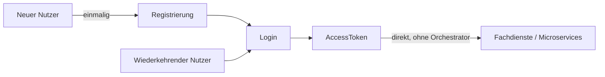

# Überblick

Die tragenden Konzepte in Kurzform. Jeder Abschnitt verweist auf das Dokument, das ihn ausführt.

---

## Worum es eigentlich geht

Das eigentliche Ziel ist immer dasselbe: ein `AccessToken`, mit dem die App anschließend die
Fachdienste – Microservices, andere Backends – **direkt** aufruft, ohne Umweg über den
Orchestrator. Die Registrierung ist kein Selbstzweck, sondern nur die einmalige Voraussetzung
dafür, dass sich ein neuer Nutzer danach anmelden kann. Das `AccessToken` selbst stammt aus dem
üblichen OIDC-Ablauf mit Keycloak, den der Orchestrator auf dem Server abwickelt. Das Frontend
bekommt nur das Ergebnis und braucht keine eigene Logik zum Erneuern der Tokens.

Ein konkretes Beispiel, das genau diesen Weg an einer einzelnen Person durchspielt, steht in
[11-beispiel-story.md](11-beispiel-story.md).

---

## Drei Sitzungsebenen

Der Kern des Modells sind drei ineinander geschachtelte Sitzungen, von lang- zu kurzlebig:

| Ebene | Steht für | Lebensdauer |
|---|---|---|
| `ChannelSession` | Den Kanal (App oder Web), per DPoP an das Gerät gebunden | überdauert einzelne Verfahren, ist aber bewusst kurzlebig (ADR-3); welches Gerät zu welchem Konto gehört, merkt sich `DeviceAccountLink` |
| `AuthJourney` | Einen Durchlauf zu einem `AuthIntent`: einen geführten Weg zu einem Ziel | solange die Journey läuft |
| `ToolSession` | Einen einzelnen Durchlauf eines Tools, z. B. die TAN-Eingabe | kurz, oft nur Minuten |

Eine Journey kann beliebig viele Tools nacheinander nutzen. Eine Registrierung mit
Identifizierung läuft etwa so: `ident-fsc` -> `confirm-email` -> `enroll-sms` -> `enroll-password`.
Nach dem Ausweisen bestätigt man die E-Mail-Adresse und richtet so lange Anmeldeverfahren ein, bis
das verlangte Niveau erreicht ist. SMS allein reicht nur für `loa1`, deshalb folgt die Pflicht zum
Passwort. Welche Verfahren in welcher Reihenfolge angeboten werden, bestimmt der Intent
([04-orchestrierung.md](04-orchestrierung.md)).

Details: [02-domaenenmodell.md](02-domaenenmodell.md)

---

## Tools beschreiben sich selbst

Jedes Verfahren ist ein *Tool* mit einem einfachen Bezeichner (`toolId`) wie `enroll-sms`. Die
Module bringen ihre Beschreibung selbst mit: Kategorie, Methode, Faktorart und das höchste
erreichbare Sicherheitsniveau. Es gibt keine zentral gepflegte Liste, die man beim Hinzufügen
eines Verfahrens vergessen könnte.

Über die Grenze eines Moduls geht nur ein `ToolOutcome`: Das Verfahren läuft noch, ist
abgeschlossen oder ist fehlgeschlagen. Arbeitsdaten wie TAN oder Freischaltcode verlassen das
Modul nie. Was ein Tool geprüft hat, meldet es ausschließlich als bestätigte Angabe (`Claim`) im
`ToolOutcome`.

Details: [03-tool-architektur.md](03-tool-architektur.md)

---

## Der Client folgt `next`, er entscheidet nicht

Jede Antwort enthält ein `next`-Objekt. Es ist eine reine Adresse: entweder auf ein konkretes Tool
oder auf eine Seite des Orchestrators (Auswahl, Abschluss). Der Client ordnet `next` über eine
feste Routing-Tabelle einem Endpunkt zu. Er leitet nichts aus URLs ab, setzt keine `toolId` selbst
zusammen und entscheidet nie, welches Verfahren als Nächstes kommt.

Alles, was ein Schritt zum Anzeigen braucht – fehlende Felder, Auswahlmöglichkeiten,
Fehlergründe –, steht in `stepData`.

Details: [05-api.md](05-api.md)

---

## Der Orchestrator entscheidet, die Module melden nur ihr Ergebnis

Nach jedem abgeschlossenen Tool entscheidet der Orchestrator, wie es weitergeht. Er verarbeitet das
Ergebnis je nach Kategorie (Konto anlegen, Verfahren einrichten, Nachweis übernehmen) und fragt
dann die `AuthPolicy`, ob genug Faktoren nachgewiesen sind. Erst danach steht der nächste Schritt
fest.

Die Policy ist auch die einzige Stelle, die weiß, was eine *Kombination* von Nachweisen bedeutet.
Ein Modul kennt nur sich selbst.

Details: [04-orchestrierung.md](04-orchestrierung.md)

---

## Zwei Kanäle, eine Tool-API

### App (der Orchestrator führt)

1. Die App schickt eine Anfrage mit DPoP; das Backend legt die `ChannelSession(APP)` an oder liest
   sie.
2. Das Backend startet eine `AuthJourney` mit dem Intent des Kanals (standardmäßig
   `FAST_ACCESS`).
3. Der Orchestrator bietet die Verfahren an, die der aktuelle Zustand der Journey zulässt (z. B.
   Freischaltcode, eID, Nect, SMS, Passwort, Gerät).
4. Bei Erfolg legt das Backend den `AuthContext` an; den Tokenablauf mit Keycloak wickelt es auf
   dem Server ab.
5. `ChannelSession.state` wechselt auf `AUTHENTICATED`.
6. Braucht die App ein höheres Niveau, fordert sie es per
   `POST /channels/{channelSessionId}/step-ups` mit `requiredAcr` an ([05-api.md](05-api.md),
   Abschnitt „`POST /channels/{channelSessionId}/step-ups`“). Die Untergrenze kann auch schon beim
   Anlegen des Kanals gesetzt werden.
7. Das Backend vergleicht die Forderung mit dem Nachweis der Sitzung (`AuthEvidence`: `currentAmr`
   und das daraus berechnete Niveau). Reicht er nicht, wechselt der Kanal auf
   `STEP_UP_REQUIRED`, eine neue `AuthJourney(STEP_UP)` beginnt, und die Antwort enthält gleich
   den fälligen `next`-Schritt.

### Web (Keycloak führt)

Der Browser spricht nie direkt mit dem Orchestrator. Stattdessen ruft Keycloaks eigenes
Java-Plugin (SPI) ihn von Server zu Server auf; es weist sich dabei mit einer signierten
Peer-Auth-Assertion aus statt mit DPoP.

1. Keycloaks eigener Login (Conditional-LoA-Subflow) ruft bei Bedarf den Orchestrator per
   `PATCH /orchestrator/api/v1/kc/channels/{channelSessionId}` auf. Der erste Aufruf legt den Kanal
   (`ChannelSession(KEYCLOAK)`) unter der von Keycloak gewählten ID an, jeder weitere aktualisiert
   ihn.
2. Das Backend startet dabei die Einstiegs-Journey `KC_SELECT_METHOD` und bietet alle Tools, die im
   Web-Kanal nutzbar sind, in einem gemeinsamen Auswahlschritt (`selectMethod`) an
   ([04-orchestrierung.md](04-orchestrierung.md)).
3. Keycloaks `OrchestratorAuthenticator` zeigt das passende Formular an und reicht die Eingaben per
   `PATCH` oder `POST` an dieselben kanalneutralen Tool-Endpunkte weiter, die auch die App nutzt.
4. Nach fachlichem Erfolg schreibt der Authenticator `authData` (`accountId`, `acr`, `amr`) sofort
   in Keycloaks eigene Session-Notes. Ein Protocol Mapper übernimmt sie beim Ausstellen des Tokens
   in die Claims `acr` und `amr`.
5. `ChannelSession.state` wechselt auf `AUTHENTICATED`, sobald das angefragte Niveau erreicht ist.

Nach dem Einstieg nutzen beide Kanäle dieselben kanalneutralen Tool-URLs. Nur der Einstieg
unterscheidet sich: Die App legt einen Kanal per `POST` an; Keycloak legt ihn per `PATCH` unter
einer selbst gewählten ID an oder aktualisiert ihn.

Details: [05-api.md](05-api.md)

---

## Sicherheitsniveaus sind nach oben begrenzt

Ein Verfahren kann nie mehr Vertrauen erzeugen, als bei seiner Einrichtung vorhanden war. Dazu
zählt auch, wie sicher die Person in dieser Sitzung identifiziert war. Ein einzelner Durchlauf
erreicht außerdem nie mehr, als das Verfahren technisch hergibt. Eine eigene, kontoweite Grenze aus
einer früheren Identifizierung gibt es nicht mehr; die Identifizierung wirkt nur noch über die
Einrichtung ([ADR-5](adr/ADR-005-drei-obergrenzen-fuer-das-sicherheitsniveau.md), Nachtrag 2).
Zusammen verhindern diese Grenzen, dass jemand in einer schwach gesicherten Sitzung ein Verfahren
einrichtet und sich damit dauerhaft ein höheres Niveau verschafft.

Details: [04-orchestrierung.md](04-orchestrierung.md)
