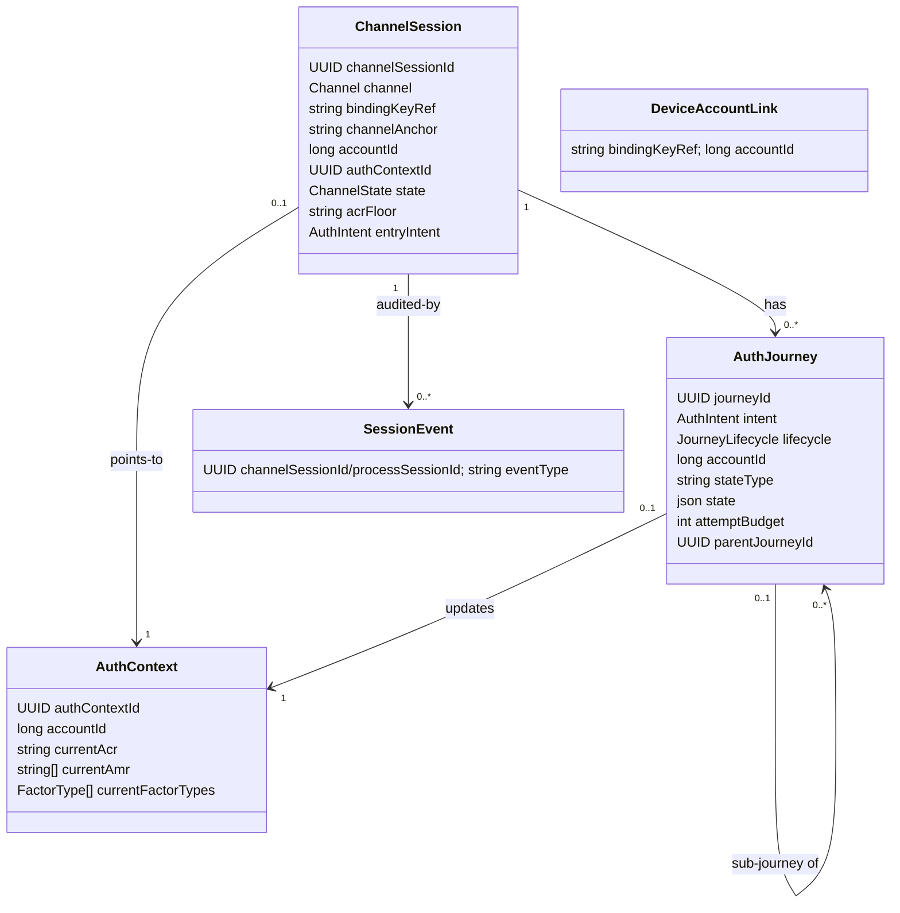
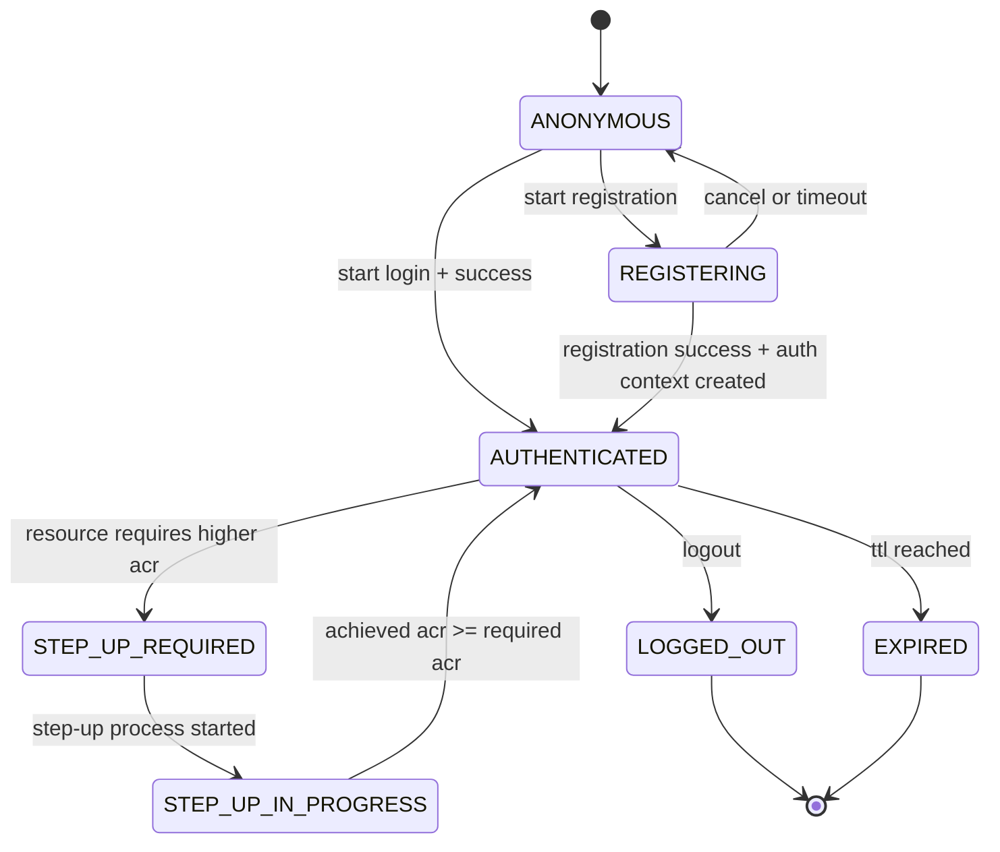
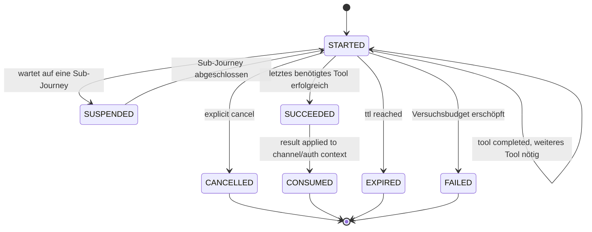
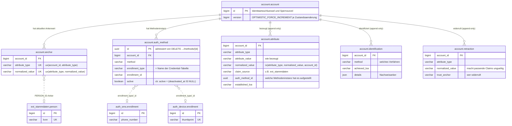
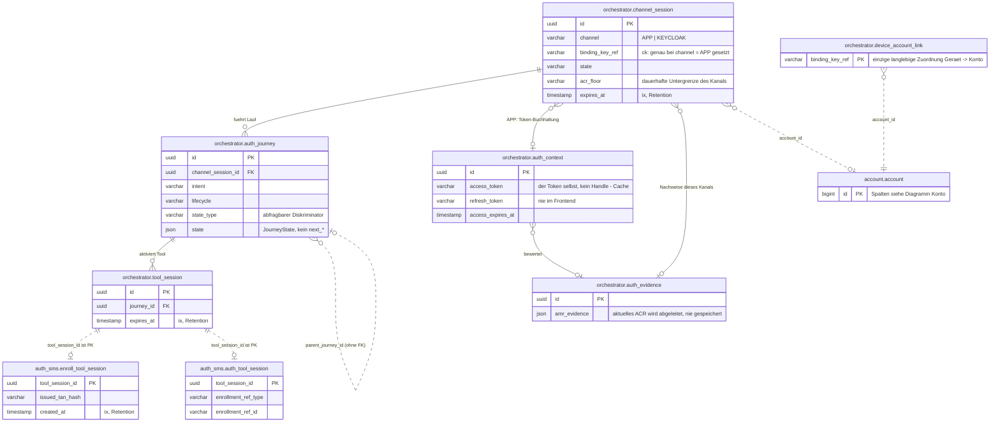

# Domänenmodell

Die Entitäten des Zielmodells, ihre Zustände und die Regeln, nach denen sie persistiert werden.
Wie die Tools darauf aufsetzen, beschreibt [03-tool-architektur.md](03-tool-architektur.md).

---

## 1) Klassenmodell

`DeviceAccountLink` ist bewusst **nicht** mit `ChannelSession` verknüpft — genau das ist der Punkt: die einzige langlebige, von einer einzelnen `ChannelSession` unabhängige Zuordnung Gerät -> Account (`bindingKeyRef -> accountId`), Details in [DPoP-Bindung](09-dpop.md) Abschnitt 3. Bewusst **APP-only**: Im Web-Kanal gibt es kein Gerät, das eine solche Zuordnung tragen könnte — `bindingKeyRef` bleibt dort `null`.

**Kanal-Anker, je Fassade verschieden.** Beide Fassaden tun strukturell dasselbe (Identität
nachweisen, dann gegen das prüfen, womit der Kanal angelegt wurde), nur der Anker unterscheidet
sich: `APP` nutzt `bindingKeyRef` (Geräteschlüssel, DPoP-Proof dagegen); `KEYCLOAK` nutzt
`channelAnchor` (immer der eigene `channelSessionId`-Wert DIESES Flow-Durchlaufs, in der
Peer-Auth-Assertion mitgeführt) — bewusst nicht Keycloaks durables `UserSessionModel`, damit zwei
GLEICHZEITIGE Flow-Durchläufe derselben SSO-Session (zwei Tabs, die parallel steppen) nie denselben
Anker teilen. `ChannelAccessGuard` ([05-api.md](05-api.md) Abschnitt 3) ist ein Vertrag mit zwei
Implementierungen für genau diese zwei Nachweisformen — die Ressource dahinter (`ChannelSession`)
bleibt identisch.

---

## 2) Zustand statt Vererbung

- `AuthJourney` ist eine flache Entity ohne Subklassen. Was sich je Intent unterscheidet, steckt nicht in Feldern der Entity, sondern im `JourneyState` — einer versiegelten Zustandsmenge **pro Intent** ([Orchestrierung](04-orchestrierung.md)). Verhalten braucht Services (`AuthPolicy`, `AccountService`, Tool-Katalog), die eine JPA-Entity nicht halten darf; es lebt deshalb in einer `IntentStrategy` je Intent.
- Persistiert wird der Zustand als `stateType` (abfragbarer Diskriminator) plus `state` (JSON der Attribute). Eigene Spalten je Attribut wären eine breite Tabelle aus überwiegend leeren Feldern — genau die formlose Routing-Ablage, die dieses Modell ersetzt.
- Bewusst **nicht** auf der `AuthJourney`: die laufende Challenge. Das gewählte Tool steckt als `ToolRef` im `JourneyState`, die Challenge ausschließlich im jeweiligen Methodenmodul (strikte Regel in [Tool-Architektur](03-tool-architektur.md)).
- Ebenfalls bewusst **nicht** vorhanden: gespeicherte `next*`-Felder. `next` ist eine reine Funktion des Zustands; eine zweite Ablage derselben Wahrheit könnte nur auseinanderlaufen.

---

## 3) Zustandsdiagramme

### ChannelSession-Zustände

### AuthJourney-Lebenszyklus

Der Lebenszyklus sagt nur, **ob** die Journey noch läuft. Wo auf dem Weg sie steht, sagt der intent-eigene `JourneyState` ([Orchestrierung](04-orchestrierung.md)); die Schritte innerhalb eines Tools gehören zu `ToolState`.

---

## 4) Enumerationen

- `Channel`: `APP`, `KEYCLOAK` — welche Fassade den Kanal geöffnet hat, für dessen ganze Lebenszeit fest ([05-api.md](05-api.md) Abschnitt 3).
- `ChannelState`: `ANONYMOUS`, `REGISTERING`, `AUTHENTICATED`, `STEP_UP_REQUIRED`, `STEP_UP_IN_PROGRESS`, `LOGGED_OUT`, `EXPIRED`
- `AuthIntent`: `FAST_ACCESS`, `REGISTER`, `LOOKUP_LOGIN`, `KC_SELECT_METHOD`, `STEP_UP`, `MANAGE_AUTH_METHODS`, `CONFIRM_PEER_LOGIN`, `DELETE_ACCOUNT`, `LOGOUT`, `RE_IDENTIFY` — Ziel *samt* Führungsstrategie ([Orchestrierung](04-orchestrierung.md) Abschnitt 1). `DELETE_ACCOUNT` ist wie `MANAGE_AUTH_METHODS` nur auf einem bereits `AUTHENTICATED`-Kanal erreichbar, dreht die Reihenfolge aber bewusst um: erst eine unbedingte, immer verlangte Ja/Nein-Bestätigung (`Prompt`, siehe [API](05-api.md) Abschnitt "Das `Prompt`-Objekt"), dann das loa2-Gate. Bei bereits vorhandenem loa2 verlangt es zusätzlich einen frisch bewiesenen aktiven Faktor; nach einem dafür nötigen Step-up zählt dessen Nachweis bereits.
- `JourneyLifecycle`: `STARTED`, `SUSPENDED`, `SUCCEEDED`, `FAILED`, `CANCELLED`, `EXPIRED`, `CONSUMED`
- `ToolCategory`: `IDENT`, `ENROLL`, `AUTH`, `SIDE_ACTION` — Selbstauskunft des Moduls; `SIDE_ACTION` bestätigt eine Anfrage auf einem anderen Kanal und trägt nichts zur Evidenz des eigenen Kanals bei ([Tool-Architektur](03-tool-architektur.md)).
- `FactorType`: `KNOWLEDGE`, `POSSESSION`, `INHERENCE` — ebenfalls Selbstauskunft, Grundlage der MFA-Prüfung ([Orchestrierung](04-orchestrierung.md))

---

## 5) Persistenz-Regeln

- `ChannelSession.channelSessionId` ist stabil und opaque; App/Web kennen nur diese technische Referenz.
- Routing wird **nicht** gespeichert: `next` folgt aus dem `JourneyState` ([Orchestrierung](04-orchestrierung.md) Abschnitt 4). `stepData` wird vom konkreten Handler aus dem methodenspezifischen Zustand aufgebaut und ebenfalls nirgends zentral gespeichert.
- `accountId` mit klarer Rollenteilung: `AuthJourney.accountId` wird während der laufenden Journey ermittelt; `ChannelSession.accountId` wird erst bei erfolgreichem Prozessabschluss daraus übernommen und gilt nur für diesen (kurzlebigen) Kanal. Die tatsächlich langlebige Zuordnung Gerät -> Account liegt in `DeviceAccountLink`, unabhängig von einer einzelnen `ChannelSession` ([DPoP-Bindung](09-dpop.md) Abschnitt 3).
- `ChannelSession` ist bewusst kurzlebig (Aufbewahrung: [Betrieb](07-betrieb.md)) und wird **nie** über `bindingKeyRef` gesucht oder wiederverwendet — der Key beweist nur, welches Gerät spricht, nie welche Session fortzusetzen ist. Fortsetzen verlangt die vom Client gemerkte `channelSessionId` (`GET`); ein Kanaleinstieg ohne bekannte ID legt daher immer eine neue `ChannelSession` an. `DeviceAccountLink` sorgt trotzdem dafür, dass ein bereits registriertes Gerät direkt in den passenden Anmeldepfad statt zur Identifikation gelangt.
- `currentFactorTypes` wird neben `currentAmr` geführt, nicht daraus abgeleitet: `amr`-Werte benennen Verfahren, nicht Faktorarten (ein Wert wie `user` bei WebAuthn ließe sich nicht eindeutig zurückführen) — die Faktorarten meldet das Tool direkt.
- Zwei Ebenen, bewusst verschieden benannt, damit sie nicht wie dasselbe Feld aussehen: `ChannelSession.acrFloor` ist die **dauerhafte Untergrenze** des Kanals (überlebt einzelne Journeys); `StepUpState.targetAcr` ist das **Ziel des konkreten Laufs** und kann höher liegen. Gating rechnet mit dem Maximum beider Werte.
- Ein vom Client genanntes `requiredAcr` ist stets eine Untergrenze, nie eine Erlaubnis: Das Backend setzt `max(Policy-Anforderung, Client-Wunsch)` — ein Client kann sein Niveau anheben, aber nie eine Policy unterlaufen.

---

## 6) Konto-Identität: Claims, Anker, Konsolidierung

- `Account` ist nur Identitätsschlüssel und Sperrwurzel (`id`, `createdAt`, `version`). Aktueller Zustand liegt in eigenen, kontobezogenen Zeilen (`AccountAnchor`, `AccountAuthMethod`); jede Änderung daran lädt die Kontozeile mit `OPTIMISTIC_FORCE_INCREMENT`, sodass zwei konkurrierende Schreiber desselben Kontos nie beide gewinnen (`409 CONCURRENT_MODIFICATION`). Historie ist append-only (`AccountAttribute`, `AccountIdentification`) und erhöht die Version nie.
- `AccountProfile` bleibt die typisierte Leseprojektion: `personId` (optional — ein Interessent hat noch keine Bindung an eine Person, [12-entscheidungen.md](12-entscheidungen.md) ADR-10) und `email`/`emailConfirmedAt` werden aus den Ankern gelesen, nicht aus eigenen Spalten; `AttributeType.allowsAnchorReplacement` unterscheidet: `email` änderbar, `personId` nach Erstbindung unveränderlich.
- `AccountAuthMethod` ist eine eingerichtete Methodeninstanz (`method`, `active`/`deactivatedAt`, `enrolledUnderAcr`, `label`, `details`) mit der `EnrollmentRef` als echten Spalten (`enrollment_type`, `enrollment_id`) — die einzige Stelle, an der Konto und Credential verknüpft sind. Die Credential-Zeile selbst gehört dem Methodenmodul; deaktivierte Instanzen bleiben stehen, damit die Kontolöschung jedes je referenzierte Credential erreicht. Die Methode `email` hat kein Modul-Credential: ihre Referenz ist der EMAIL-Anker (`EMAIL_ANCHOR_ENROLLMENT`).
- `AccountIdentification` ist der Audit-Datensatz jeder Identifizierung: Verfahren, erreichtes LoA, Zeitpunkt und Nachweisanker ([06-ablaeufe.md](06-ablaeufe.md) Abschnitt 1). Er ergänzt das Claim-Log, weil ein Claim seine Quelle (z. B. `ext_stammdaten`) nennt, nicht das prüfende Verfahren; für Entscheidungen wird er nie gelesen.
- `AccountRetraction` (`account.retraction`) macht einen Wert ungültig, ohne das Log anzufassen: eine eigene Widerrufs-Zeile mit eigenem Vertrauensanker (`RetractionAnchor`: `ACCOUNT_MANAGEMENT`, `EXT_STAMMDATEN`, `OPERATOR`), Grund und Zeitpunkt ([12-entscheidungen.md](12-entscheidungen.md) ADR-12). „Aktuell gültig" ist die Subtraktion Behauptungen minus Retraktionen; der Abgleich rechnet sie mit. Das Entfernen einer Methode zieht über `auth_method_id` genau deren Behauptungen zurück — aber nur die mit `AttributeAuthority.METHOD_MODULE`, denn Anker und Stammdaten-Attribute gehören dem Konto, nicht der Methode.
- `AccountAttribute` ist das Provenienz-Log: jede je bezeugte Behauptung (`AttributeType`, Wert, Quelle — Spalte `claim_source`, im Code `ClaimSource` —, `AcrLevel`), append-only, nie überschrieben. Eine `normalized_value`-Spalte (befüllt über einen `@PrePersist`/`@PreUpdate`-Hook) trägt die Normalisierungsregel für den lesenden Abgleich an genau einer Stelle.
- Wo ein Attribut seine Autorität hat, ist ein deklarierter Fall, keine Ableitung: `AttributeType.authority` (`tool_api/AttributeRules.kt`) kennt `LOCAL_ANCHOR` (`PERSON_ID`, `EMAIL` — lokal in `account.anchor`), `EXT_STAMMDATEN` (`KVNR`, `NAME`, `VORNAME`, `GEBURTSDATUM` — live über `PersonDirectory` gelesen, lokal nur als Claim-Historie geloggt) und `METHOD_MODULE` (`PHONE_NUMBER` — in der `<modul>_enrollment`-Zeile des Methodenmoduls). Das `when` ist exhaustiv: ein neuer Attributtyp kompiliert erst, wenn seine Herkunft entschieden ist. `anchorBindingStrength` bleibt daneben bestehen, weil es eine andere Frage beantwortet — nicht „wem gehört der Wert", sondern „wie stark bindet ein Treffer darauf eine Identität"; ein Test hält fest, dass `LOCAL_ANCHOR` genau für die Typen mit Bindungsstärke gilt.
- `AccountAnchor` ist die Auflösungs- und Eindeutigkeits-Projektion für die lokal geführten Attribute (`AttributeAuthority.LOCAL_ANCHOR`: `PERSON_ID`, `EMAIL`) und zugleich deren einziger Speicherort — `UNIQUE(attribute_type, normalized_value)` macht `resolveByAnchor` zu einem Lookup statt einem Abgleich und ist die einzige Eindeutigkeitsautorität, `UNIQUE(account_id, attribute_type)` erzwingt höchstens einen aktuellen Wert je Konto und Attributtyp. Lokal konsolidiert wird genau, was Anker ist; alle übrigen Attribute behalten ihre Autorität in `ext_stammdaten` und werden nur geloggt. KVNR wird ausschließlich live über `ext_stammdaten` zur PersonId und anschließend zum lokalen PersonId-Anker aufgelöst; historische KVNR-Claims sind keine lokale Zuordnungsquelle. Ein Anker, der bereits einem anderen Konto gehört, wird abgewiesen, nie still übersprungen oder umgehängt ([12-entscheidungen.md](12-entscheidungen.md) ADR-11).
- `IdentityMatchingService.resolve` beantwortet „gehört diese bezeugte Identität zu einem bestehenden Konto?" in fester, nach Bindungsstärke fallender Schichtfolge: (1) eindeutiger Anker (`PERSON_ID` rangiert unter den Ankern am höchsten, Reihenfolge bei mehreren attestierten Ankern nach `AttributeType.anchorBindingStrength`, nicht nach Claim-Quelle/Vertrauensrang und nicht nach Aufrufer-Zufall — es gibt keinen separaten `personId`-Projektions-Sonderweg mehr), (2) normalisierte Attributkombination (Name+Vorname+Geburtsdatum, eine sargable Abfrage mit harter Kandidaten-Obergrenze). Wird die Obergrenze überschritten oder passen mehrere Konten, ist das Ergebnis `Ambiguous`, nie ein Treffer — „lieber gar nicht als falsch zusammenführen" gilt für diese Schicht uneingeschränkt.
- Herleitung und noch nicht umgesetzte Ausbaustufen (Retraktion als eigene Widerrufs-Zeile, Konto-Merge) stehen in [ideen/claims-modell-und-vertrauensanker.md](ideen/claims-modell-und-vertrauensanker.md); die getroffenen Entscheidungen in [12-entscheidungen.md](12-entscheidungen.md) ADR-10/ADR-11/ADR-12/ADR-13; die Sicherheits- und Skalierungs-Härtung dieses Modells in [13-review-domaenen-db-modell.md](13-review-domaenen-db-modell.md); die technische Vereinheitlichung von `personId` und `email` auf denselben Claim-/Anker-Pfad in [ideen/account-attribute-und-trust-vereinheitlichen.md](ideen/account-attribute-und-trust-vereinheitlichen.md).

---

## 7) Tabellenmodell

Das Schema steht vollständig in `src/main/resources/db/migration/V1__schema.sql`, die Konventionen
dahinter in [07-betrieb.md](07-betrieb.md) Abschnitt 6 und [12-entscheidungen.md](12-entscheidungen.md)
ADR-14/ADR-16. Die beiden Diagramme zeigen die tragenden Tabellen mit ihren identifizierenden Spalten,
nicht jede Spalte.

Jedes Modul hat ein eigenes Datenbankschema; der qualifizierte Name nennt also immer den Besitzer
([12-entscheidungen.md](12-entscheidungen.md) ADR-16).

**Linienarten, und warum sie sich unterscheiden:** Eine durchgezogene Linie ist ein echter
Fremdschlüssel — den gibt es ausschließlich **innerhalb** eines Schemas. Eine gestrichelte Linie ist
ein schemaübergreifender Bezug: eine indizierte Spalte ohne Constraint, aufgeräumt über die API des
besitzenden Moduls (`EnrollmentCleanup`, `AccountDeletionService`), nie per Kaskade. Eine Kaskade
über eine Modulgrenze würde die Löschregel eines fremden Moduls in die DDL dieses Moduls schreiben.

### Konto

`account` trägt selbst keinen Fakt: `personId` und `email` stehen als Anker in `account.anchor`,
die Methodenliste in `account.auth_method` (Abschnitt 6). Die Credential-Tabellen der
Methodenmodule (hier beispielhaft `auth_sms.enrollment`, `auth_device.enrollment`) haben bewusst
**keine** `account_id`: Sie entstehen im Tool-Handler, bevor die Orchestrierung das Konto kennt —
bei „Enrollment zuerst" existiert noch gar keins. Die einzige Verknüpfung ist
`account.auth_method.enrollment_type/enrollment_id`, in beide Richtungen indiziert.
`auth_email` hat aus demselben Grund keine eigene Credential-Tabelle: Das Credential *ist* der
EMAIL-Anker.

### Orchestrierung und Tool-Arbeitsdaten

`orchestrator.auth_evidence` und `orchestrator.auth_context` sind getrennt, obwohl sie im
APP-Kanal gemeinsam entstehen: Nachweise hat jeder Kanal (der KEYCLOAK-Kanal legt nie einen
`AuthContext` an), und sie sind die Wahrheit, aus der die Policy rechnet — der Token ist nur die
daraus ausgestellte, jederzeit verwerfbare Kopie
([12-entscheidungen.md](12-entscheidungen.md) ADR-15).

Die `*_tool_session`-Tabellen liegen im Schema ihres Moduls, obwohl nicht das Modul, sondern die
`ToolSession` ihr Lebenszyklus-Eigentümer ist: Ihr Primärschlüssel *ist* die `tool_session_id`, ein
Fremdschlüssel darauf wäre schemaübergreifend. Der Ort nennt den Besitzer, der Schlüssel den
Lebenszyklus — zwei verschiedene Fragen, und der Name sagt beides: `auth_sms.enroll_tool_session`
ist die Modulhälfte derselben `orchestrator.tool_session`, keine vierte Session-Ebene. Jedes
Methodenmodul folgt demselben Zuschnitt wie `auth_sms` oben: ein langlebiges `<modul>.enrollment`
plus je eine kurzlebige `<modul>.<tool-rolle>_tool_session` pro Tool; die vollständige Liste steht
in `V1__schema.sql`.

Nicht im Diagramm, weil ohne Beziehungen: `orchestrator.session_event` und
`orchestrator.journey_log` (Session-IDs sind dort historische Werte, keine Referenzen — die Spur
überlebt die Sessions), `orchestrator.attempt_throttle`, `orchestrator.dpop_proof_replay`,
`orchestrator.tool_availability`, `orchestrator.feature_flag` und
`orchestrator.keycloak_keypair`.
