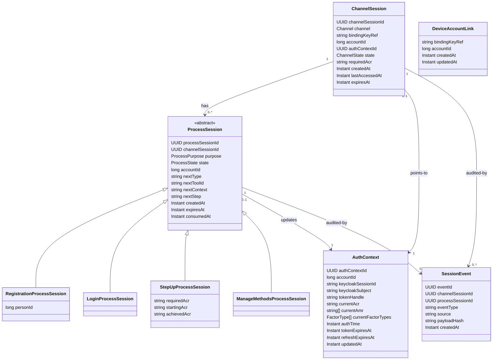
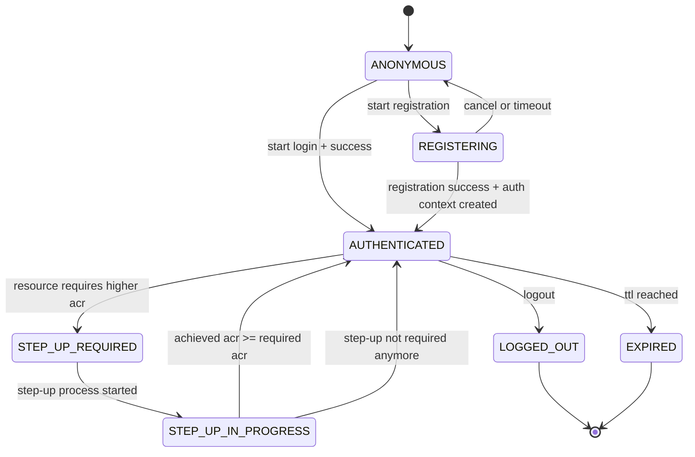
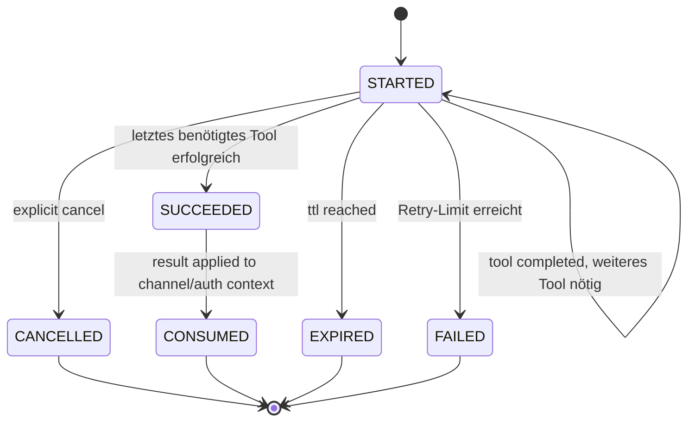

# Domänenmodell

Die Entitäten des Zielmodells, ihre Zustände und die Regeln, nach denen sie persistiert werden.
Wie die Tools darauf aufsetzen, beschreibt [03-tool-architektur.md](03-tool-architektur.md).

---

## 1) Klassenmodell

`DeviceAccountLink` ist bewusst **nicht** mit `ChannelSession` verknüpft — genau das ist der Punkt: Sie ist die einzige langlebige, von einer einzelnen `ChannelSession` unabhängige Zuordnung Gerät -> Account (`bindingKeyRef -> accountId`), Details in [DPoP-Bindung](09-dpop.md) Abschnitt 3.

---

## 2) Prozessklassen statt flachem Objekt

- `ProcessSession` ist die abstrakte Basis mit gemeinsamem Lifecycle, Account-Bezug und Routing-Zustand.
- `RegistrationProcessSession` kapselt die identifizierte Person (`personId`).
- `LoginProcessSession` ist eine leere Marker-Subklasse: LOGIN braucht derzeit keine eigenen Felder, bleibt aber als eigener Typ erhalten (erschöpfendes `when`, offen für spätere Login-spezifische Daten).
- `StepUpProcessSession` kapselt ACR-spezifische Step-up-Daten (`requiredAcr`, `startingAcr`, `achievedAcr`).
- `ManageMethodsProcessSession` ist ebenfalls eine leere Marker-Subklasse, nach demselben Muster wie `LoginProcessSession`: Sie steht für die freiwillige Verwaltung von Auth-Mitteln auf einem bereits `AUTHENTICATED`-Kanal (Hinzufügen/Deaktivieren, [Orchestrierung](04-orchestrierung.md) Abschnitt 3) und braucht keine eigenen Felder, weil sie dieselben Enroll-Tools und dieselbe Kandidatenermittlung wie REGISTRATION wiederverwendet.
- Bewusst **nicht** auf der `ProcessSession`: gewählte Methode und laufende Challenge. Das gewählte Tool steckt im Routing-Zustand (`nextToolId`), die Challenge ausschließlich im jeweiligen Methodenmodul (siehe strikte Regel in [Tool-Architektur](03-tool-architektur.md)).
- Persistenz darf physisch weiterhin eine Tabelle nutzen, aber das Domain-Modell arbeitet mit konkreten Typen statt einem großen, flachen JSON-Objekt.

---

## 3) Zustandsdiagramme

### ChannelSession-Zustände

### ProcessSession-Zustände

Der Prozess läuft über beliebig viele Tools (z. B. `ident-fsc` -> `enroll-sms`); die einzelnen Tool-Schritte sind hier bewusst nicht sichtbar, sie gehören zu `ToolState`.

---

## 4) Enumerationen

- `Channel`: `APP`, `WEB`
- `ChannelState`: `ANONYMOUS`, `REGISTERING`, `AUTHENTICATED`, `STEP_UP_REQUIRED`, `STEP_UP_IN_PROGRESS`, `LOGGED_OUT`, `EXPIRED`
- `ProcessPurpose`: `REGISTRATION`, `LOGIN`, `STEP_UP`, `MANAGE_METHODS` (freiwillige Kontoverwaltung auf bereits `AUTHENTICATED`-Kanal, [Orchestrierung](04-orchestrierung.md) Abschnitt 3)
- `ProcessState`: `STARTED`, `SUCCEEDED`, `FAILED`, `CANCELLED`, `EXPIRED`, `CONSUMED` (rein prozessweite Zustände; der Fortschritt innerhalb eines einzelnen Verfahrens liegt in `ToolState`)
- `ToolState`: `INPUT_REQUIRED`, `VERIFIED`, `FAILED`, `EXPIRED`, `CANCELLED`
- `ToolCategory`: `IDENT`, `ENROLL`, `AUTH` (Kategorie eines Tools; vom Modul über `ToolDescriptor` gemeldet, siehe [Tool-Architektur](03-tool-architektur.md))
- `FactorType`: `KNOWLEDGE`, `POSSESSION`, `INHERENCE` (Faktorart einer Methode; ebenfalls Selbstauskunft des Moduls, Grundlage der MFA-Prüfung in [Orchestrierung](04-orchestrierung.md))

---

## 5) Persistenz-Regeln

- `ChannelSession.channelSessionId` ist stabil und opaque; App/Web kennen nur diese technische Referenz.
- `ProcessSession` ist immer kurzlebig und nach Abschluss `CONSUMED` oder `EXPIRED`.
- Prozessspezifische Felder werden nur im jeweils passenden Typ geführt (keine "immer vorhandenen" Universal-Felder).
- Routing-Metadaten (`nextType`, `nextToolId`, `nextContext`, `nextStep`) liegen in der `ProcessSession`; `ToolState` und `stepData` werden vom konkreten Handler aus dem methodenspezifischen Zustand aufgebaut und nirgends zentral gespeichert.
- Methodenspezifische Tool-Felder und fachliche Verifikationsdetails liegen ausschließlich in den jeweiligen Fachmodulen.
- `accountId` steht auf beiden Ebenen mit klarer Rollenteilung: `ProcessSession.accountId` wird während des laufenden Prozesses ermittelt (bei `Completed.Identified`, siehe [Orchestrierung](04-orchestrierung.md)); `ChannelSession.accountId` wird erst bei erfolgreichem Prozessabschluss daraus übernommen und gilt für die (nun kurzlebige, siehe unten) Dauer dieses Kanals. Die tatsächlich langlebige Zuordnung Gerät -> Account liegt in `DeviceAccountLink` (`bindingKeyRef -> accountId`), unabhängig von einer einzelnen `ChannelSession` ([DPoP-Bindung](09-dpop.md) Abschnitt 3).
- `ChannelSession` ist bewusst kurzlebig (siehe TTL in [08-projektrahmen.md](08-projektrahmen.md)/Code) und wird nie über `bindingKeyRef` gesucht oder wiederverwendet — `binding_key_ref` beweist nur, welches Gerät spricht, nie welche Session fortzusetzen ist. Fortsetzen einer konkreten Session verlangt die vom Client gemerkte `channelSessionId` (`GET`). Ein Kanaleinstieg ohne bekannte `channelSessionId` legt daher immer eine neue `ChannelSession` an; `DeviceAccountLink` sorgt dafür, dass ein bereits registriertes Gerät trotzdem direkt bei LOGIN statt bei `ident-fsc` landet.
- `AuthContext` ist serverseitig; Clients sehen keine Keycloak-Tokens.
- `currentFactorTypes` wird neben `currentAmr` geführt und nicht daraus abgeleitet: `amr`-Werte benennen Verfahren, nicht Faktorarten, und ein einzelner Wert wie `user` (WebAuthn User Verification) lässt sich nicht eindeutig zurückführen. Die Faktorarten meldet das Tool direkt (`Completed.factorTypes`).
- `ChannelSession.state` ist die primäre Runtime-Entscheidungsquelle für Request-Gating.
- Zwei Ebenen für `requiredAcr`, mit klarer Rollenteilung: `ChannelSession.requiredAcr` ist die **dauerhafte Untergrenze** des Kanals — sie überlebt einzelne Prozesse, sodass ein erreichtes Niveau nach Prozessende nicht wieder als ausreichend gilt. `StepUpProcessSession.requiredAcr` ist das **Ziel des konkreten Laufs**; es kann höher liegen, wenn ein einzelner Vorgang mehr verlangt. Gating und `AuthPolicy` rechnen mit dem Maximum beider Werte.
- Ein vom Client genanntes `requiredAcr` ist stets eine Untergrenze, nie eine Obergrenze und nie eine Erlaubnis: Das Backend setzt `max(Policy-Anforderung, Client-Wunsch)`. Ein Client kann sein Niveau also anheben, aber niemals eine Policy unterlaufen.
- App-Bindung: `ChannelSession.bindingKeyRef` muss mit aktuellem DPoP-Ableitungswert matchen.
