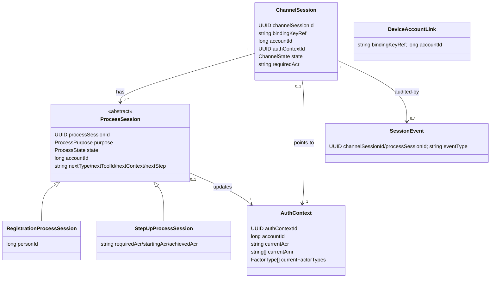
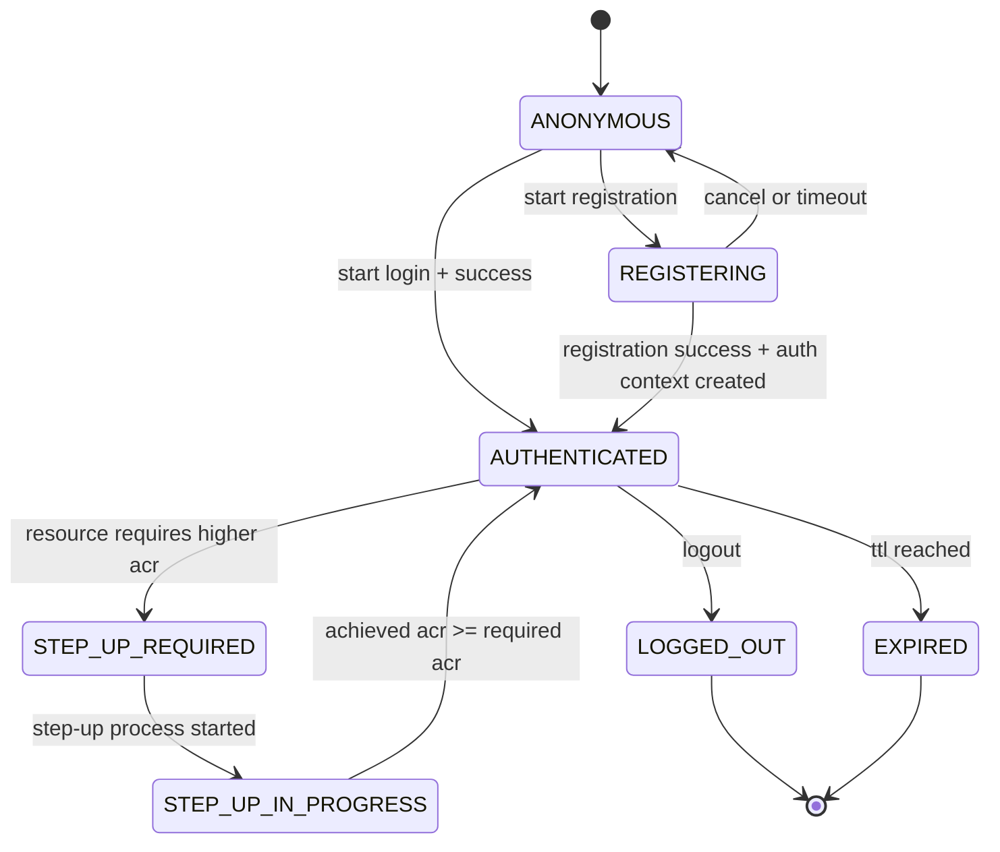
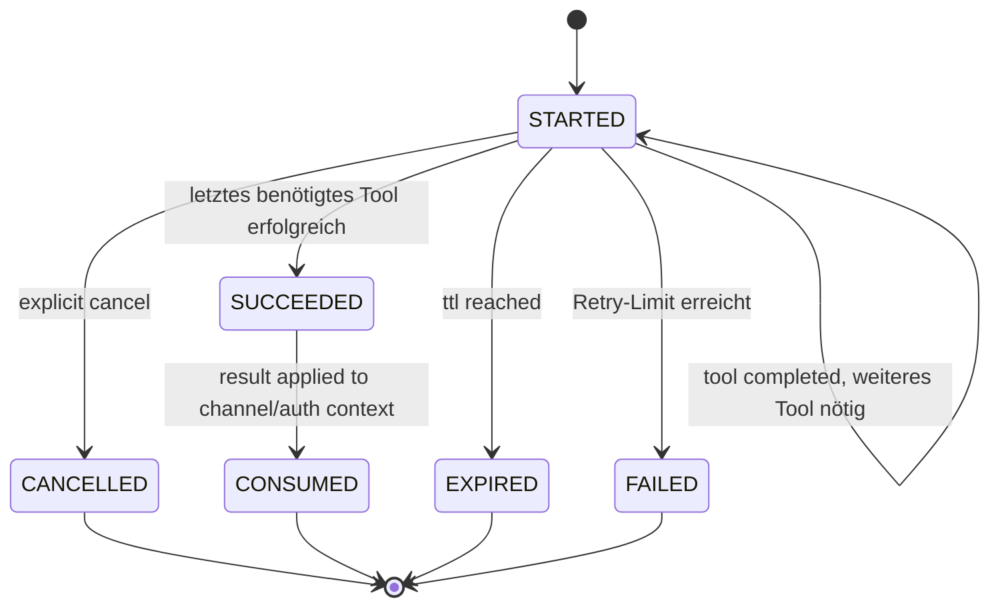

# Domänenmodell

Die Entitäten des Zielmodells, ihre Zustände und die Regeln, nach denen sie persistiert werden.
Wie die Tools darauf aufsetzen, beschreibt [03-tool-architektur.md](03-tool-architektur.md).

---

## 1) Klassenmodell

`DeviceAccountLink` ist bewusst **nicht** mit `ChannelSession` verknüpft — genau das ist der Punkt: die einzige langlebige, von einer einzelnen `ChannelSession` unabhängige Zuordnung Gerät -> Account (`bindingKeyRef -> accountId`), Details in [DPoP-Bindung](09-dpop.md) Abschnitt 3.

---

## 2) Prozessklassen statt flachem Objekt

- `ProcessSession` ist die abstrakte Basis mit gemeinsamem Lifecycle, Account-Bezug und Routing-Zustand; konkrete Subklassen (`RegistrationProcessSession`, `LoginProcessSession`, `StepUpProcessSession`, `ManageMethodsProcessSession`) tragen nur, was ihr jeweiliger Prozesstyp zusätzlich braucht. `LoginProcessSession`/`ManageMethodsProcessSession` sind leere Marker-Subklassen — kein eigenes Feld nötig, aber ein eigener Typ (erschöpfendes `when`, offen für später).
- Bewusst **nicht** auf der `ProcessSession`: gewählte Methode und laufende Challenge. Das gewählte Tool steckt im Routing-Zustand (`nextToolId`), die Challenge ausschließlich im jeweiligen Methodenmodul (strikte Regel in [Tool-Architektur](03-tool-architektur.md)).
- Persistenz darf physisch eine Tabelle nutzen (Single-Table-Vererbung), aber das Domain-Modell arbeitet mit konkreten Typen statt einem großen, flachen JSON-Objekt.

---

## 3) Zustandsdiagramme

### ChannelSession-Zustände

### ProcessSession-Zustände

Der Prozess läuft über beliebig viele Tools (z. B. `ident-fsc` -> `enroll-sms`); die einzelnen Tool-Schritte gehören zu `ToolState`, nicht hierher.

---

## 4) Enumerationen

- `Channel`: `APP`, `WEB`
- `ChannelState`: `ANONYMOUS`, `REGISTERING`, `AUTHENTICATED`, `STEP_UP_REQUIRED`, `STEP_UP_IN_PROGRESS`, `LOGGED_OUT`, `EXPIRED`
- `ProcessPurpose`: `REGISTRATION`, `LOGIN`, `STEP_UP`, `MANAGE_METHODS` (freiwillige Kontoverwaltung, [Orchestrierung](04-orchestrierung.md) Abschnitt 3)
- `ProcessState`: `STARTED`, `SUCCEEDED`, `FAILED`, `CANCELLED`, `EXPIRED`, `CONSUMED`
- `ToolCategory`: `IDENT`, `ENROLL`, `AUTH` — Selbstauskunft des Moduls ([Tool-Architektur](03-tool-architektur.md))
- `FactorType`: `KNOWLEDGE`, `POSSESSION`, `INHERENCE` — ebenfalls Selbstauskunft, Grundlage der MFA-Prüfung ([Orchestrierung](04-orchestrierung.md))

---

## 5) Persistenz-Regeln

- `ChannelSession.channelSessionId` ist stabil und opaque; App/Web kennen nur diese technische Referenz.
- Routing-Metadaten (`nextType`, `nextToolId`, `nextContext`, `nextStep`) liegen in der `ProcessSession`; `stepData` wird vom konkreten Handler aus dem methodenspezifischen Zustand aufgebaut und nirgends zentral gespeichert.
- `accountId` mit klarer Rollenteilung: `ProcessSession.accountId` wird während des laufenden Prozesses ermittelt; `ChannelSession.accountId` wird erst bei erfolgreichem Prozessabschluss daraus übernommen und gilt nur für diesen (kurzlebigen) Kanal. Die tatsächlich langlebige Zuordnung Gerät -> Account liegt in `DeviceAccountLink`, unabhängig von einer einzelnen `ChannelSession` ([DPoP-Bindung](09-dpop.md) Abschnitt 3).
- `ChannelSession` ist bewusst kurzlebig (TTL in [08-projektrahmen.md](08-projektrahmen.md)) und wird **nie** über `bindingKeyRef` gesucht oder wiederverwendet — der Key beweist nur, welches Gerät spricht, nie welche Session fortzusetzen ist. Fortsetzen verlangt die vom Client gemerkte `channelSessionId` (`GET`); ein Kanaleinstieg ohne bekannte ID legt daher immer eine neue `ChannelSession` an. `DeviceAccountLink` sorgt trotzdem dafür, dass ein bereits registriertes Gerät direkt bei LOGIN statt bei `ident-fsc` landet.
- `currentFactorTypes` wird neben `currentAmr` geführt, nicht daraus abgeleitet: `amr`-Werte benennen Verfahren, nicht Faktorarten (ein Wert wie `user` bei WebAuthn ließe sich nicht eindeutig zurückführen) — die Faktorarten meldet das Tool direkt.
- Zwei Ebenen für `requiredAcr`: `ChannelSession.requiredAcr` ist die **dauerhafte Untergrenze** des Kanals (überlebt einzelne Prozesse); `StepUpProcessSession.requiredAcr` ist das **Ziel des konkreten Laufs** und kann höher liegen. Gating rechnet mit dem Maximum beider Werte.
- Ein vom Client genanntes `requiredAcr` ist stets eine Untergrenze, nie eine Erlaubnis: Das Backend setzt `max(Policy-Anforderung, Client-Wunsch)` — ein Client kann sein Niveau anheben, aber nie eine Policy unterlaufen.
