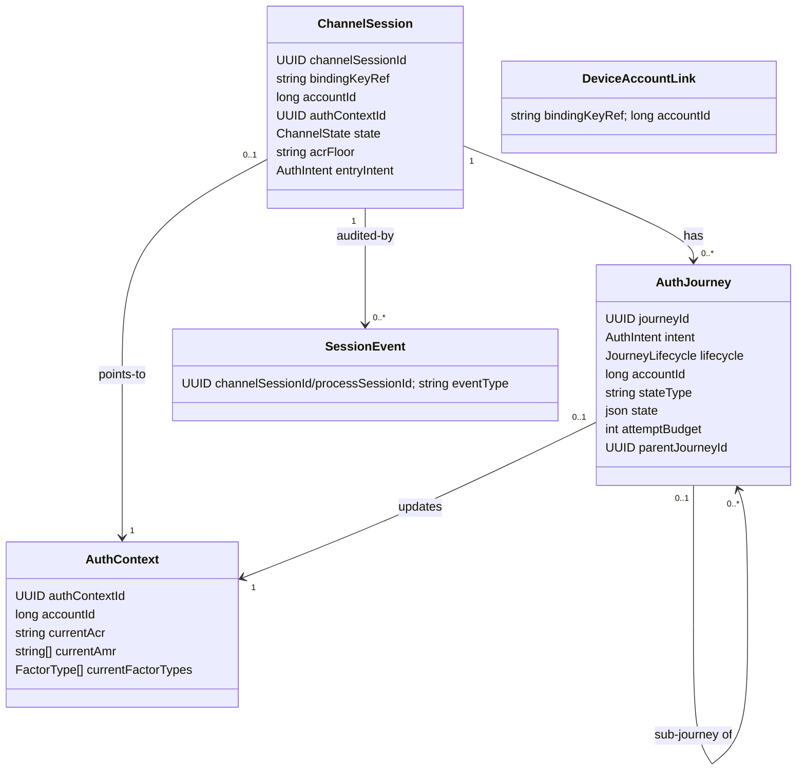
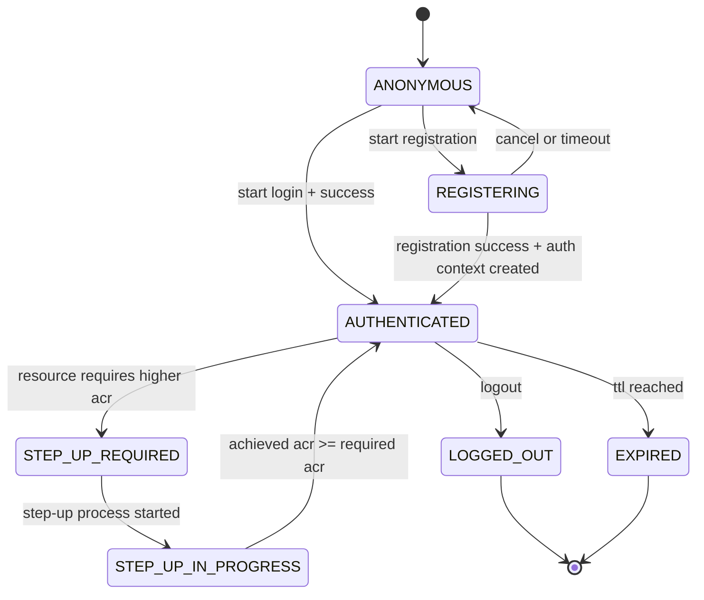
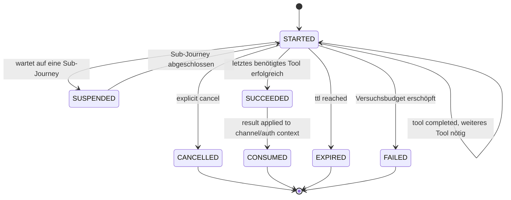

# Domänenmodell

Die Entitäten des Zielmodells, ihre Zustände und die Regeln, nach denen sie persistiert werden.
Wie die Tools darauf aufsetzen, beschreibt [03-tool-architektur.md](03-tool-architektur.md).

---

## 1) Klassenmodell

`DeviceAccountLink` ist bewusst **nicht** mit `ChannelSession` verknüpft — genau das ist der Punkt: die einzige langlebige, von einer einzelnen `ChannelSession` unabhängige Zuordnung Gerät -> Account (`bindingKeyRef -> accountId`), Details in [DPoP-Bindung](09-dpop.md) Abschnitt 3.

---

## 2) Zustand statt Vererbung

- `AuthJourney` ist eine flache Entity ohne Subklassen. Was sich je Intent unterscheidet, steckt nicht in Feldern der Entity, sondern im `JourneyState` — einer versiegelten Zustandsmenge **pro Intent** ([Orchestrierung](04-orchestrierung.md)). Verhalten braucht Services (`AuthPolicy`, `AccountService`, Tool-Katalog), die eine JPA-Entity nicht halten darf; es lebt deshalb in einer `IntentStrategy` je Intent.
- Persistiert wird der Zustand als `stateType` (abfragbarer Diskriminator) plus `state` (JSON der Attribute). Eigene Spalten je Attribut wären eine breite Tabelle aus überwiegend leeren Feldern — genau die formlose Routing-Ablage, die dieses Modell ersetzt.
- Bewusst **nicht** auf der `AuthJourney`: die laufende Challenge. Das gewählte Tool steckt als `ToolRef` im `JourneyState`, die Challenge ausschließlich im jeweiligen Methodenmodul (strikte Regel in [Tool-Architektur](03-tool-architektur.md)).
- Ebenfalls bewusst **nicht** vorhanden: gespeicherte `next*`-Felder. `next` ist eine reine Funktion des Zustands; eine zweite Ablage derselben Wahrheit könnte nur auseinanderlaufen.

---

## 3) Zustandsdiagramme

### ChannelSession-Zustände

### AuthJourney-Lebenszyklus

Der Lebenszyklus sagt nur, **ob** die Journey noch läuft. Wo auf dem Weg sie steht, sagt der intent-eigene `JourneyState` ([Orchestrierung](04-orchestrierung.md)); die Schritte innerhalb eines Tools gehören zu `ToolState`.

---

## 4) Enumerationen

- `Channel`: `APP`, `WEB`
- `ChannelState`: `ANONYMOUS`, `REGISTERING`, `AUTHENTICATED`, `STEP_UP_REQUIRED`, `STEP_UP_IN_PROGRESS`, `LOGGED_OUT`, `EXPIRED`
- `AuthIntent`: `FAST_ACCESS`, `REGISTER`, `LOOKUP_LOGIN`, `STEP_UP`, `MANAGE_AUTH_METHODS`, `DELETE_ACCOUNT` — Ziel *samt* Führungsstrategie ([Orchestrierung](04-orchestrierung.md) Abschnitt 1). `DELETE_ACCOUNT` ist wie `MANAGE_AUTH_METHODS` nur auf einem bereits `AUTHENTICATED`-Kanal erreichbar, dreht die Reihenfolge aber bewusst um: erst eine unbedingte, immer verlangte Ja/Nein-Bestätigung (`Prompt`, siehe [API](05-api.md) Abschnitt "Das `Prompt`-Objekt") — das kostet nichts und darf nicht hinter einem Step-up versteckt sein, den der Aufrufer vielleicht gar nicht will —, erst danach, nur bei Zustimmung, dasselbe loa2-Gate wie vor `MANAGE_AUTH_METHODS`. War die Session schon vorher bei loa2 (Evidenz unbekannten Alters), verlangt das Gate zusätzlich einen frisch erneut bewiesenen, beliebigen aktiven Faktor; musste das Gate stattdessen erst einen Step-up auslösen, zählt der dabei erbrachte Nachweis bereits als dieser und die Löschung folgt direkt.
- `JourneyLifecycle`: `STARTED`, `SUSPENDED`, `SUCCEEDED`, `FAILED`, `CANCELLED`, `EXPIRED`, `CONSUMED`
- `ToolCategory`: `IDENT`, `ENROLL`, `AUTH` — Selbstauskunft des Moduls ([Tool-Architektur](03-tool-architektur.md))
- `FactorType`: `KNOWLEDGE`, `POSSESSION`, `INHERENCE` — ebenfalls Selbstauskunft, Grundlage der MFA-Prüfung ([Orchestrierung](04-orchestrierung.md))

---

## 5) Persistenz-Regeln

- `ChannelSession.channelSessionId` ist stabil und opaque; App/Web kennen nur diese technische Referenz.
- Routing wird **nicht** gespeichert: `next` folgt aus dem `JourneyState` ([Orchestrierung](04-orchestrierung.md) Abschnitt 4). `stepData` wird vom konkreten Handler aus dem methodenspezifischen Zustand aufgebaut und ebenfalls nirgends zentral gespeichert.
- `accountId` mit klarer Rollenteilung: `AuthJourney.accountId` wird während der laufenden Journey ermittelt; `ChannelSession.accountId` wird erst bei erfolgreichem Prozessabschluss daraus übernommen und gilt nur für diesen (kurzlebigen) Kanal. Die tatsächlich langlebige Zuordnung Gerät -> Account liegt in `DeviceAccountLink`, unabhängig von einer einzelnen `ChannelSession` ([DPoP-Bindung](09-dpop.md) Abschnitt 3).
- `ChannelSession` ist bewusst kurzlebig (TTL in [08-projektrahmen.md](08-projektrahmen.md)) und wird **nie** über `bindingKeyRef` gesucht oder wiederverwendet — der Key beweist nur, welches Gerät spricht, nie welche Session fortzusetzen ist. Fortsetzen verlangt die vom Client gemerkte `channelSessionId` (`GET`); ein Kanaleinstieg ohne bekannte ID legt daher immer eine neue `ChannelSession` an. `DeviceAccountLink` sorgt trotzdem dafür, dass ein bereits registriertes Gerät direkt bei LOGIN statt bei `ident-fsc` landet.
- `currentFactorTypes` wird neben `currentAmr` geführt, nicht daraus abgeleitet: `amr`-Werte benennen Verfahren, nicht Faktorarten (ein Wert wie `user` bei WebAuthn ließe sich nicht eindeutig zurückführen) — die Faktorarten meldet das Tool direkt.
- Zwei Ebenen, bewusst verschieden benannt, damit sie nicht wie dasselbe Feld aussehen: `ChannelSession.acrFloor` ist die **dauerhafte Untergrenze** des Kanals (überlebt einzelne Journeys); `StepUpState.targetAcr` ist das **Ziel des konkreten Laufs** und kann höher liegen. Gating rechnet mit dem Maximum beider Werte.
- Ein vom Client genanntes `requiredAcr` ist stets eine Untergrenze, nie eine Erlaubnis: Das Backend setzt `max(Policy-Anforderung, Client-Wunsch)` — ein Client kann sein Niveau anheben, aber nie eine Policy unterlaufen.
