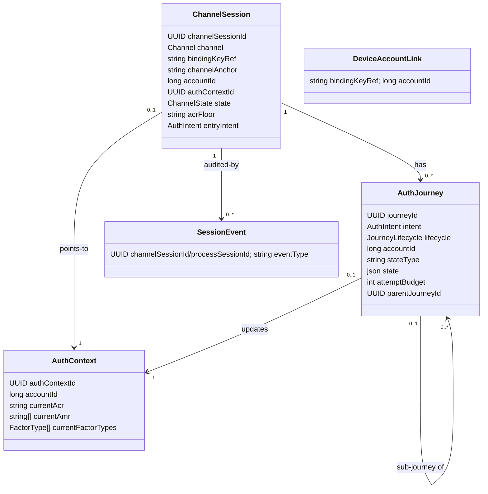
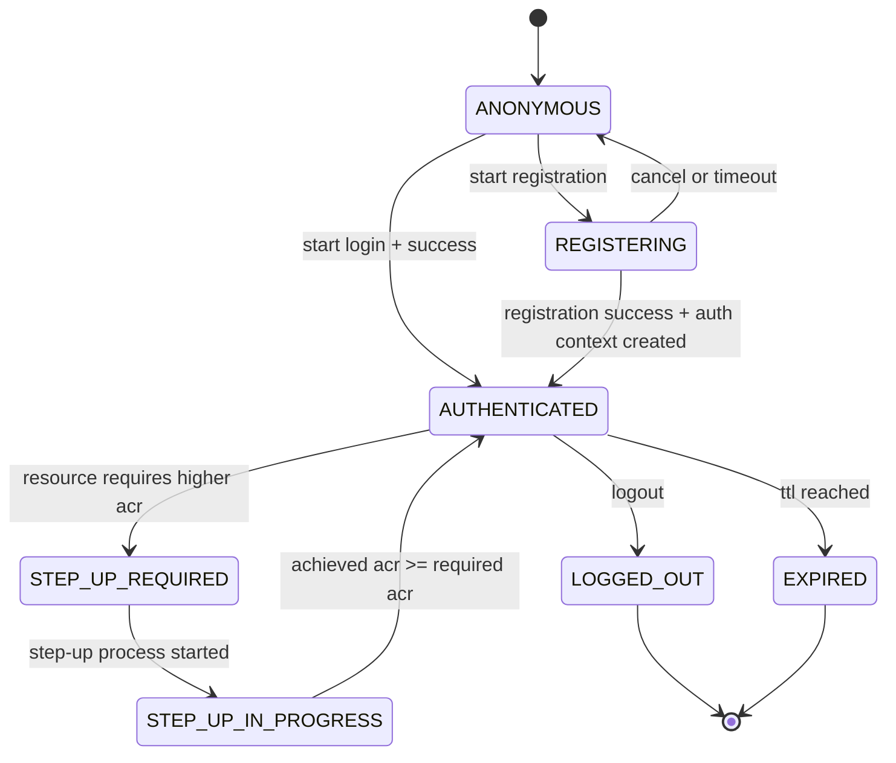
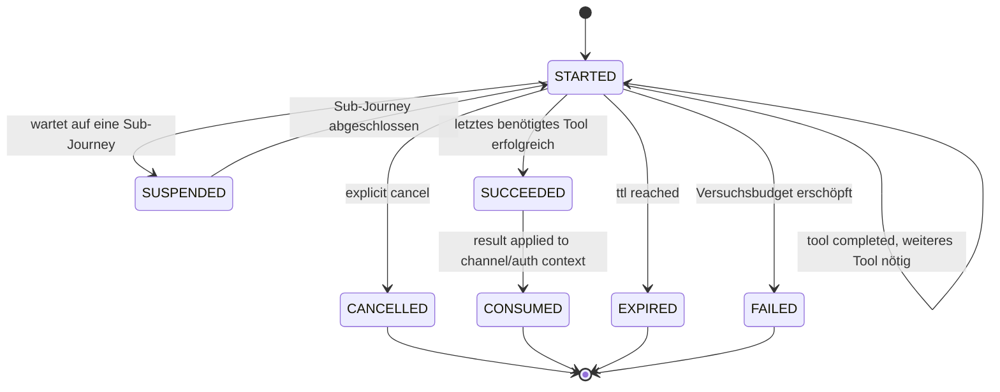
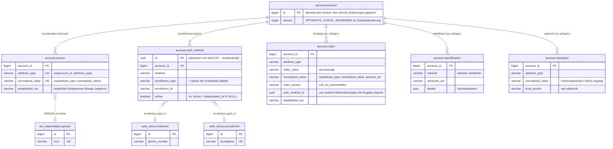
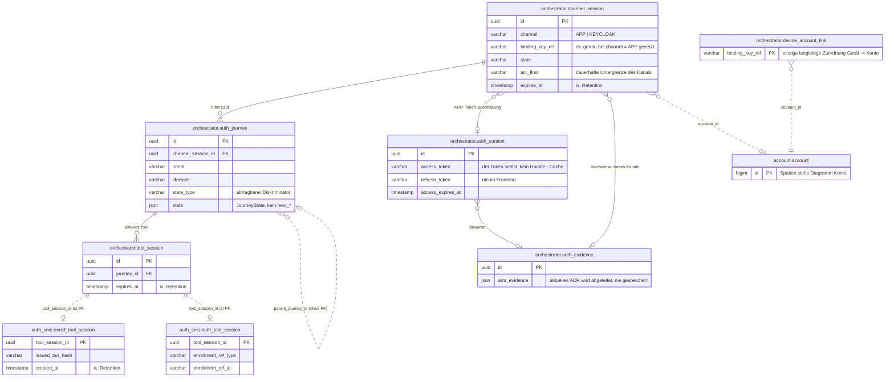

# Domänenmodell

Die Entitäten des Zielmodells, ihre Zustände und die Regeln, nach denen sie persistiert werden.
Wie die Tools darauf aufsetzen, beschreibt [03-tool-architektur.md](03-tool-architektur.md).

---

## 1) Klassenmodell

`DeviceAccountLink` ist bewusst **nicht** mit `ChannelSession` verknüpft: die einzige langlebige, von einer einzelnen `ChannelSession` unabhängige Zuordnung Gerät -> Account (`bindingKeyRef -> accountId`), Details in [DPoP-Bindung](09-dpop.md) Abschnitt 3. **APP-only**: Im Web-Kanal bleibt `bindingKeyRef` `null`.

**Kanal-Anker, je Fassade verschieden.** `APP` nutzt `bindingKeyRef` (den Geräteschlüssel, geprüft gegen den DPoP-Proof), `KEYCLOAK`
nutzt `channelAnchor`. Das ist immer der eigene `channelSessionId`-Wert DIESES Flow-Durchlaufs,
mitgeführt in der Peer-Auth-Assertion — bewusst nicht Keycloaks langlebiges `UserSessionModel`,
sonst würden zwei GLEICHZEITIGE Flow-Durchläufe derselben SSO-Session denselben Anker teilen.
`ChannelAccessGuard` ([05-api.md](05-api.md) Abschnitt 3) hat je Nachweisform eine
Implementierung; die Ressource dahinter (`ChannelSession`) ist in beiden Fällen dieselbe.

---

## 2) Zustand statt Vererbung

- `AuthJourney` ist eine flache Entity ohne Subklassen. Was sich je Intent unterscheidet, steckt im `JourneyState` — einer abgeschlossenen Zustandsmenge **pro Intent** ([Orchestrierung](04-orchestrierung.md)). Das Verhalten dazu steht in einer `IntentStrategy` je Intent, weil es Services braucht (`AuthPolicy`, `AccountService`, Tool-Katalog), die eine JPA-Entity nicht halten darf.
- Persistiert wird der Zustand als `stateType` (abfragbarer Diskriminator) plus `state` (JSON der Attribute).
- Bewusst **nicht** auf der `AuthJourney`: die laufende Challenge. Das gewählte Tool steckt als `ToolRef` im `JourneyState`, die Challenge ausschließlich im jeweiligen Methodenmodul (strikte Regel in [Tool-Architektur](03-tool-architektur.md)).
- Ebenfalls **nicht** vorhanden: gespeicherte `next*`-Felder. `next` ist eine reine Funktion des Zustands.

---

## 3) Zustandsdiagramme

### ChannelSession-Zustände

### AuthJourney-Lebenszyklus

Der Lebenszyklus sagt nur, **ob** die Journey noch läuft. Wo sie steht, sagt der intent-eigene `JourneyState` ([Orchestrierung](04-orchestrierung.md)); die Schritte innerhalb eines Tools gehören zu `ToolState`.

---

## 4) Enumerationen

- `Channel`: `APP`, `KEYCLOAK` — welche Fassade den Kanal geöffnet hat, für dessen ganze Lebenszeit fest ([05-api.md](05-api.md) Abschnitt 3).
- `ChannelState`: `ANONYMOUS`, `REGISTERING`, `AUTHENTICATED`, `STEP_UP_REQUIRED`, `STEP_UP_IN_PROGRESS`, `LOGGED_OUT`, `EXPIRED`
- `AuthIntent`: `FAST_ACCESS`, `REGISTER`, `LOOKUP_LOGIN`, `KC_SELECT_METHOD`, `STEP_UP`, `MANAGE_AUTH_METHODS`, `CONFIRM_PEER_LOGIN`, `DELETE_ACCOUNT`, `LOGOUT`, `RE_IDENTIFY` — das Ziel *und* der Weg dorthin ([Orchestrierung](04-orchestrierung.md) Abschnitt 1). `DELETE_ACCOUNT` und `MANAGE_AUTH_METHODS` setzen einen bereits `AUTHENTICATED`-Kanal voraus; `DELETE_ACCOUNT` verlangt erst die unbedingte Ja/Nein-Bestätigung (`Prompt`, [API](05-api.md) Abschnitt "Das `Prompt`-Objekt"), dann das `selfServiceAcrFloor`-Gate (loa2, für ein nie identifiziertes Konto nur loa1) und einen frisch bewiesenen aktiven Faktor.
- `JourneyLifecycle`: `STARTED`, `SUSPENDED`, `SUCCEEDED`, `FAILED`, `CANCELLED`, `EXPIRED`, `CONSUMED`
- `ToolCategory`: `IDENT`, `ENROLL`, `AUTH`, `SIDE_ACTION` — das Modul gibt sie selbst an; `SIDE_ACTION` bestätigt eine Anfrage auf einem anderen Kanal und trägt nichts zum Nachweis des eigenen Kanals bei ([Tool-Architektur](03-tool-architektur.md)).
- `FactorType`: `KNOWLEDGE`, `POSSESSION`, `INHERENCE` — gibt das Modul ebenfalls selbst an, Grundlage der MFA-Prüfung ([Orchestrierung](04-orchestrierung.md))

---

## 5) Persistenz-Regeln

- `ChannelSession.channelSessionId` ist stabil und opaque; App/Web kennen nur diese technische Referenz.
- Routing wird **nicht** gespeichert: `next` folgt aus dem `JourneyState` ([Orchestrierung](04-orchestrierung.md) Abschnitt 4); `stepData` baut der konkrete Handler aus dem methodenspezifischen Zustand auf.
- `accountId` mit klarer Rollenteilung: `AuthJourney.accountId` wird während der laufenden Journey ermittelt, `ChannelSession.accountId` erst bei erfolgreichem Prozessabschluss daraus übernommen und gilt nur für diesen Kanal. Die langlebige Zuordnung Gerät -> Account liegt in `DeviceAccountLink` ([DPoP-Bindung](09-dpop.md) Abschnitt 3).
- `ChannelSession` ist kurzlebig (Aufbewahrung: [Betrieb](07-betrieb.md)) und wird **nie** über `bindingKeyRef` gesucht oder wiederverwendet. Fortsetzen verlangt die vom Client gemerkte `channelSessionId` (`GET`); ein Kanaleinstieg ohne bekannte ID legt immer eine neue `ChannelSession` an. `DeviceAccountLink` führt ein registriertes Gerät trotzdem direkt in den passenden Anmeldepfad.
- `currentFactorTypes` wird neben `currentAmr` geführt, nicht daraus abgeleitet: `amr`-Werte benennen Verfahren, nicht Faktorarten.
- Zwei Ebenen: `ChannelSession.acrFloor` ist die **dauerhafte Untergrenze** des Kanals (überlebt einzelne Journeys), `StepUpState.targetAcr` das **Ziel des konkreten Laufs** und kann höher liegen. Gating rechnet mit dem Maximum beider Werte.
- Ein vom Client genanntes `requiredAcr` ist stets eine Untergrenze, nie eine Erlaubnis: Das Backend setzt `max(Policy-Anforderung, Client-Wunsch)`.

---

## 6) Konto-Identität: Claims, Anker, Konsolidierung

- `Account` ist nur die Identität des Kontos und die Zeile, über die Änderungen an ihm gesperrt werden (`id`, `createdAt`, `version`). Der aktuelle Zustand steht in eigenen, kontobezogenen Zeilen (`AccountAnchor`, `AccountAuthMethod`). Jede Änderung daran lädt die Kontozeile mit `OPTIMISTIC_FORCE_INCREMENT`; schreiben zwei Vorgänge gleichzeitig, bekommt der zweite `409 CONCURRENT_MODIFICATION`. Die Historie (`AccountClaim`, `AccountIdentification`) wird nur angefügt und erhöht die Version nie.
- `AccountProfile` bleibt die typisierte Leseprojektion: `personId` (optional, [12-entscheidungen.md](12-entscheidungen.md) ADR-10) und `email`/`emailConfirmedAt` werden aus den Ankern gelesen, nicht aus eigenen Spalten; `AnchorRule.allowsReplacement` unterscheidet: `email` änderbar, `personId` nach Erstbindung unveränderlich. Daran hängen zwei Regeln, die jeweils an einer Stelle einen Namen haben, statt als Bedingung an mehreren Stellen zu stehen: `isUnidentified` (keine PersonId — das Konto darf eine Identität annehmen) und `isProvisional` (zusätzlich nie ein Zugangsmittel eingerichtet, deaktivierte zählen mit — das Konto darf gelöscht oder mit einem anderen zusammengeführt werden, ADR-20).
- `AccountAuthMethod` ist eine eingerichtete Methodeninstanz (`method`, `active`/`deactivatedAt`, `enrolledUnderAcr`, `label`, `details`) mit der `EnrollmentRef` als echten Spalten (`enrollment_type`, `enrollment_id`) — die einzige Stelle, an der Konto und Credential verknüpft sind. Die Credential-Zeile gehört dem Methodenmodul; deaktivierte Instanzen bleiben stehen. Die Methode `email` hat kein Modul-Credential: ihre Referenz ist der EMAIL-Anker (`EMAIL_ANCHOR_ENROLLMENT`).
- `AccountIdentification` ist der Audit-Datensatz jeder Identifizierung: Verfahren, erreichtes LoA, Zeitpunkt und der Nachweis, auf dem sie beruht ([06-ablaeufe.md](06-ablaeufe.md) Abschnitt 1); für Entscheidungen wird er nie gelesen.
- `AccountRetraction` (`account.retraction`) macht einen Wert ungültig: eine Widerrufszeile mit eigenem Vertrauensanker (`RetractionAnchor`: `ACCOUNT_MANAGEMENT`, `EXT_STAMMDATEN`, `OPERATOR`), Grund und Zeitpunkt ([12-entscheidungen.md](12-entscheidungen.md) ADR-12). „Aktuell gültig" heißt: alle Angaben minus die Widerrufe. Der Vergleich läuft über die Zeit — ein Widerruf entkräftet nur Angaben, die vor ihm liegen; ein danach neu bestätigter Wert gilt wieder. Es gibt drei Auslöser. Wird eine Methode entfernt, nimmt das über `auth_method_id` deren Angaben zurück (nur die mit `AttributeAuthority.MethodModule`). Wird ein Anker an derselben Stelle ersetzt, wird der alte Wert widerrufen (`ACCOUNT_MANAGEMENT`, Grund „anker-ersetzt"), damit Log und Anker übereinstimmen. Und seit ADR-24 lässt sich ein Attribut **direkt** zurücknehmen (`AccountService.retractAttribute`, Grund „attribute withdrawn"); das löscht zusätzlich die Anker-Zeile. Nur über diesen letzten Weg ist eine bestätigte Adresse überhaupt zu verlieren: `confirm-email` schreibt seine Angabe als ATTESTATION, also ganz ohne `auth_method_id`, und EMAIL gehört ohnehin dem Konto selbst — kein Methodenwiderruf erreicht sie.
- `AccountClaim` ist das Herkunfts-Log: jede je bestätigte *Änderung* (`AttributeType`, Wert, Quelle — Spalte `claim_source`, im Code `ClaimSource` —, `AcrLevel`); es wird nur angefügt, nie geändert. Protokolliert werden Änderungen, nicht Durchläufe: Eine Angabe, die identisch bereits gilt (gleicher Typ, Wert, Quelle und Methodeninstanz), wird nicht erneut geschrieben — ein eid-Lauf auf unveränderter Karte kostet keine acht Zeilen. Eine `normalized_value`-Spalte (`@PrePersist`/`@PreUpdate`) hält die Normalisierungsregel an genau einer Stelle.
- Wo ein Attribut seine Autorität hat, steht deklariert im Code: `AttributeType.authority` (`tool_api/AttributeRules.kt`) kennt `Local` (`PERSON_ID`, `EID_RESTRICTED_ID`, `EMAIL` — lokal in `account.anchor`; dieser Fall trägt die Ankerregeln gleich mit), `ExtStammdaten` (`KVNR`, `NAME`, `VORNAME`, `GEBURTSDATUM`, `STRASSE`, `HAUSNUMMER`, `PLZ`, `ORT` — live über `PersonDirectory` gelesen, lokal nur als Claim-Historie geloggt) und `MethodModule` (`PHONE_NUMBER` — in der `<modul>_enrollment`-Zeile des Methodenmoduls). `AnchorRule.bindingStrength` sagt daneben, wie stark ein Treffer darauf eine Identität bindet.
- Einen Anker zu schreiben **verlangt** ein Mindestniveau: `AnchorRule.acrFloor` deklariert je Attributtyp, welches Niveau das *Erstbinden* (`establish`) und welches das *Ersetzen* (`replace`) mindestens voraussetzt. `EMAIL` bindet bei `loa1`, ersetzt aber erst ab `loa2`. `PERSON_ID` verlangt schon zum Erstbinden `loa2`; `allowsReplacement = false` bleibt daneben die führende Regel. Geprüft wird an der einzigen Schreibstelle (`AccountService.recordAnchor`); wer darunter liegt, wird abgewiesen (`409`).
- `account.anchor.established_acr` ist das Gegenstück zu `account.auth_method.enrolled_under_acr`: das **tatsächlich bewiesene** Niveau, begrenzt nach ADR-5.
- `AccountAnchor` löst die lokal geführten Attribute (`AttributeAuthority.Local`: `PERSON_ID`, `EID_RESTRICTED_ID`, `EMAIL`) auf ein Konto auf, hält sie eindeutig und ist zugleich ihr einziger Speicherort: `UNIQUE(attribute_type, normalized_value)` macht `resolveByAnchor` zu einem Lookup, `UNIQUE(account_id, attribute_type)` erzwingt höchstens einen aktuellen Wert je Konto und Attributtyp. KVNR wird ausschließlich live über `ext_stammdaten` zur PersonId und anschließend zum lokalen PersonId-Anker aufgelöst. Ein Anker, der bereits einem anderen Konto gehört, wird abgewiesen ([12-entscheidungen.md](12-entscheidungen.md) ADR-11).
- `IdentityMatchingService.resolve` beantwortet „gehört diese bestätigte Identität zu einem bestehenden Konto?" **ausschließlich über Anker** (ADR-19): `resolveByAnchor` prüft die Anker-Claims in Reihenfolge ihrer `AnchorRule.bindingStrength`, ohne Treffer bleibt nur `Unresolved`. Über Attributkombinationen aus der Claim-Historie wird nicht mehr aufgelöst; Name, Vorname und Geburtsdatum dienen nur noch dem Abgleich gegen `ext_stammdaten` (`verifyToolAttestedConsistency`, `attestedIdentityMatches`).
- Herleitung und noch nicht umgesetzte Ausbaustufen (Konto-Merge): [ideen/claims-modell-und-vertrauensanker.md](ideen/claims-modell-und-vertrauensanker.md); Entscheidungen: [12-entscheidungen.md](12-entscheidungen.md) ADR-10/ADR-11/ADR-12/ADR-13/ADR-19; Vereinheitlichung von `personId` und `email` auf denselben Claim-/Anker-Pfad: [ideen/account-attribute-und-trust-vereinheitlichen.md](ideen/account-attribute-und-trust-vereinheitlichen.md).

---

## 7) Tabellenmodell

Das Schema steht vollständig in `src/main/resources/db/migration/V1__schema.sql`, die Konventionen
dahinter in [07-betrieb.md](07-betrieb.md) Abschnitt 6 und [12-entscheidungen.md](12-entscheidungen.md)
ADR-14/ADR-16. Die Diagramme zeigen die tragenden Tabellen mit ihren identifizierenden Spalten,
nicht jede Spalte. Jedes Modul hat ein eigenes Datenbankschema; der qualifizierte Name nennt den
Besitzer ([12-entscheidungen.md](12-entscheidungen.md) ADR-16).

**Linienarten:** Eine durchgezogene Linie ist ein echter Fremdschlüssel — den gibt es
ausschließlich **innerhalb** eines Schemas. Eine gestrichelte Linie ist ein Bezug über Schemagrenzen:
eine indizierte Spalte ohne Constraint. Aufgeräumt wird sie über die API des besitzenden Moduls
(`EnrollmentCleanup`, `AccountDeletionService`), nie per Kaskade.

### Konto

`account` trägt selbst keinen Fakt: `personId` und `email` stehen als Anker in `account.anchor`,
die Methodenliste in `account.auth_method` (Abschnitt 6). Die Credential-Tabellen der
Methodenmodule (hier beispielhaft `auth_sms.enrollment`, `auth_device.enrollment`) haben bewusst
**keine** `account_id`: Sie entstehen im Tool-Handler, bevor die Orchestrierung das Konto kennt.
Die einzige Verknüpfung ist `account.auth_method.enrollment_type/enrollment_id`. `auth_email` hat aus demselben Grund keine eigene Credential-Tabelle: Das
Credential *ist* der EMAIL-Anker.

### Orchestrierung und Tool-Arbeitsdaten

`orchestrator.auth_evidence` und `orchestrator.auth_context` sind getrennt: Nachweise hat jeder
Kanal (der KEYCLOAK-Kanal legt nie einen `AuthContext` an) und sind die Wahrheit, aus der die
Policy rechnet — der Token ist nur die daraus ausgestellte, verwerfbare Kopie
([12-entscheidungen.md](12-entscheidungen.md) ADR-15).

Die `*_tool_session`-Tabellen liegen im Schema ihres Moduls, obwohl ihr Lebenszyklus an der
`orchestrator.tool_session` hängt: Ihr Primärschlüssel *ist* die `tool_session_id`, ein
Fremdschlüssel darauf würde also über eine Schemagrenze gehen. `auth_sms.enroll_tool_session` ist die Modulhälfte
derselben `orchestrator.tool_session`, keine vierte Session-Ebene. Jedes Methodenmodul ist gleich
aufgebaut: ein langlebiges `<modul>.enrollment` plus je eine kurzlebige
`<modul>.<tool-rolle>_tool_session` pro Tool; die vollständige Liste steht in `V1__schema.sql`.

Nicht im Diagramm, weil ohne Beziehungen: `orchestrator.session_event` und
`orchestrator.journey_log` (Session-IDs sind dort historische Werte, keine Referenzen — die
Aufzeichnung überlebt die Sessions), `orchestrator.attempt_throttle`, `orchestrator.dpop_proof_replay`,
`orchestrator.tool_availability`, `orchestrator.feature_flag` und
`orchestrator.keycloak_keypair`.
