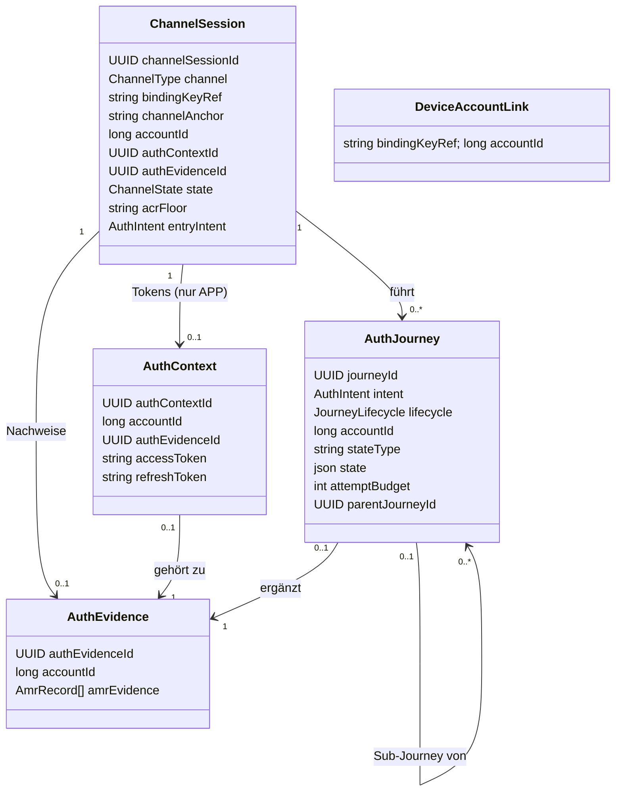
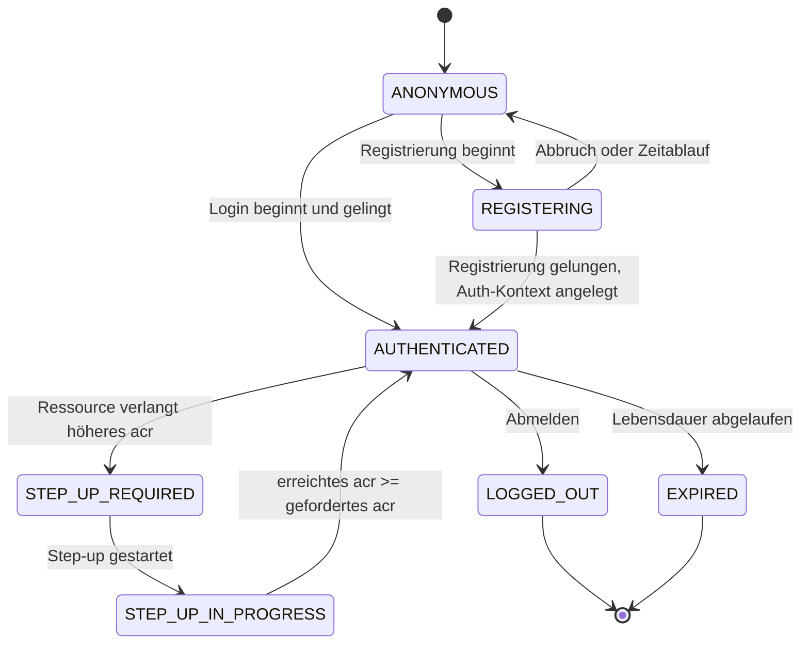
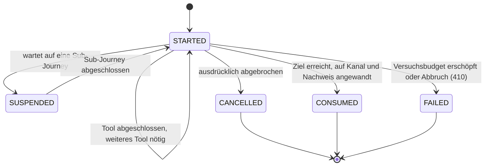
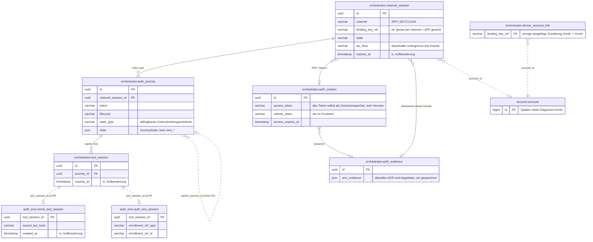

# Domänenmodell

Die Entitäten des Zielmodells, ihre Zustände und die Regeln, nach denen sie gespeichert werden.
Wie die Tools darauf aufsetzen, beschreibt [03-tool-architektur.md](03-tool-architektur.md).

---

## 1) Klassenmodell

`DeviceAccountLink`, die **Geräteverknüpfung**, hängt bewusst **nicht** an `ChannelSession`. Es ist
die einzige langlebige Zuordnung von Gerät zu Konto (`bindingKeyRef -> accountId`), zählt nicht als
Anmeldung (keine Gerätebindung im Sinne des Glossars) und hängt an keiner
einzelnen `ChannelSession`; Details in [DPoP-Bindung](09-dpop.md) Abschnitt 3. Es gibt sie **nur im
App-Kanal**: Im Web-Kanal bleibt `bindingKeyRef` `null`.

**Kanal-Anker, je Zugang verschieden.** `APP` nutzt `bindingKeyRef`, also den Geräteschlüssel, den
der DPoP-Proof belegt. `KEYCLOAK` nutzt `channelAnchor`: Das ist immer der eigene
`channelSessionId`-Wert **dieses** Login-Durchlaufs, mitgeschickt in der Peer-Auth-Assertion. Es ist
bewusst nicht Keycloaks langlebiges `UserSessionModel`; sonst würden sich zwei **gleichzeitige**
Login-Durchläufe derselben SSO-Sitzung denselben Anker teilen. `ChannelAccessGuard`
([05-api.md](05-api.md) Abschnitt 3) hat für jede der beiden Nachweisformen eine eigene
Implementierung; die Ressource dahinter (`ChannelSession`) ist in beiden Fällen dieselbe.

---

## 2) Zustand statt Vererbung

- `AuthJourney` ist eine flache Entity ohne Unterklassen. Was sich je Intent unterscheidet, steckt
  im `JourneyState`, einer abgeschlossenen Menge von Zuständen **je Intent**
  ([Orchestrierung](04-orchestrierung.md)). Das Verhalten dazu steht in einer eigenen
  `IntentStrategy` je Intent. Es braucht nämlich Services (`AuthPolicy`, `AccountService`,
  Tool-Katalog), die eine JPA-Entity nicht halten darf.
- Gespeichert wird der Zustand als `stateType` (ein Unterscheidungsmerkmal, nach dem sich
  abfragen lässt) plus `state` (die Attribute als JSON).
- Bewusst **nicht** auf der `AuthJourney` liegt die laufende Challenge. Das gewählte Tool steht als
  `ToolRef` im `JourneyState`; die Challenge selbst kennt ausschließlich das jeweilige
  Methodenmodul (strikte Regel in [Tool-Architektur](03-tool-architektur.md)).
- Ebenfalls **nicht** vorhanden sind gespeicherte `next*`-Felder. `next` ergibt sich allein aus dem
  Zustand.

---

## 3) Zustandsdiagramme

### Zustände der ChannelSession

### Lebenszyklus der AuthJourney

Der Lebenszyklus sagt nur, **ob** die Journey noch läuft. Wo sie gerade steht, sagt der
`JourneyState` des jeweiligen Intents ([Orchestrierung](04-orchestrierung.md)); die Schritte
innerhalb eines Tools verwaltet das Modul des Tools selbst.

`SUCCEEDED` und `EXPIRED` stehen noch im Enum, werden aber nie gesetzt: Eine erfolgreiche Journey
wechselt direkt auf `CONSUMED`, und ob sie abgelaufen ist, wird nur über `expiresAt` geprüft
([Lebenszyklus](journeys/lebenszyklus-unabhaengig-vom-intent.md)).

---

## 4) Aufzählungstypen

- `ChannelType`: `APP`, `KEYCLOAK` – über welchen Zugang der Kanal geöffnet wurde; das bleibt für
  seine ganze Lebenszeit fest ([05-api.md](05-api.md) Abschnitt 3).
- `ChannelState`: `ANONYMOUS`, `REGISTERING`, `AUTHENTICATED`, `STEP_UP_REQUIRED`,
  `STEP_UP_IN_PROGRESS`, `LOGGED_OUT`, `EXPIRED`
- `AuthIntent`: `FAST_ACCESS`, `REGISTER`, `LOOKUP_LOGIN`, `KC_SELECT_METHOD`, `STEP_UP`,
  `MANAGE_AUTH_METHODS`, `CONFIRM_PEER_LOGIN`, `DELETE_ACCOUNT`, `LOGOUT`, `RE_IDENTIFY` – das Ziel
  *und* der Weg dorthin ([Orchestrierung](04-orchestrierung.md) Abschnitt 1). `DELETE_ACCOUNT` und
  `MANAGE_AUTH_METHODS` setzen einen Kanal voraus, der schon `AUTHENTICATED` ist. `DELETE_ACCOUNT`
  verlangt zuerst in jedem Fall die Ja/Nein-Bestätigung (`Prompt`, [API](05-api.md) Abschnitt
  "Das `Prompt`-Objekt"). Danach muss die Sitzung die Schwelle `selfServiceAcrFloor` erreichen
  (loa2, für ein nie identifiziertes Konto nur loa1), und ein aktiver Faktor muss frisch
  nachgewiesen sein.
- `JourneyLifecycle`: `STARTED`, `SUSPENDED`, `SUCCEEDED`, `FAILED`, `CANCELLED`, `EXPIRED`,
  `CONSUMED`
- `ToolCategory`: `IDENT`, `ENROLL`, `AUTH`, `SIDE_ACTION`, `ATTEST` – das Modul gibt sie selbst
  an. `SIDE_ACTION` bestätigt eine Anfrage auf einem anderen Kanal und trägt nichts zum Nachweis
  des eigenen Kanals bei. `ATTEST` bestätigt ein Attribut, das dem Konto gehört (etwa die
  E-Mail-Adresse), und trägt ebenfalls nichts zum Niveau bei
  ([Tool-Architektur](03-tool-architektur.md)).
- `FactorType`: `KNOWLEDGE`, `POSSESSION`, `INHERENCE` – gibt das Modul ebenfalls selbst an; darauf
  beruht die Prüfung, ob verschiedene Faktortypen vorliegen ([Orchestrierung](04-orchestrierung.md)).

---

## 5) Regeln fürs Speichern

- `ChannelSession.channelSessionId` ist stabil und nach außen bedeutungslos; App und Web kennen nur
  diese technische Referenz.
- Das Routing wird **nicht** gespeichert: `next` folgt aus dem `JourneyState`
  ([Orchestrierung](04-orchestrierung.md) Abschnitt 4). `stepData` baut der jeweilige Handler aus
  dem Zustand seines Verfahrens auf.
- `accountId` hat an zwei Stellen klar getrennte Aufgaben: `AuthJourney.accountId` wird ermittelt,
  während die Journey läuft. `ChannelSession.accountId` wird erst nach erfolgreichem Abschluss von
  dort übernommen und gilt nur für diesen Kanal. Die langlebige Zuordnung von Gerät zu Konto liegt
  in `DeviceAccountLink` ([DPoP-Bindung](09-dpop.md) Abschnitt 3).
- `ChannelSession` ist kurzlebig (Aufbewahrung: [Betrieb](07-betrieb.md)). Sie wird **nie** über
  `bindingKeyRef` gesucht oder wiederverwendet. Um fortzusetzen, braucht es die `channelSessionId`,
  die sich der Client gemerkt hat (`GET`); ein Einstieg ohne bekannte ID legt immer eine neue
  `ChannelSession` an. Ein registriertes Gerät kommt über `DeviceAccountLink` trotzdem direkt auf
  den passenden Weg zur Anmeldung.
- Der Nachweis einer Sitzung liegt in `AuthEvidence`, nicht im `AuthContext`; der verwaltet nur die
  Tokens des App-Kanals. Je Verfahren hält ein `amrEvidence`-Eintrag Methode, Niveau und
  Faktortypen fest. `currentAmr` und `currentFactorTypes` sind Sichten darauf. Die Faktortypen
  stehen im Eintrag selbst, statt aus dem `amr`-Namen abgeleitet zu werden, denn `amr`-Werte
  benennen Verfahren, nicht Faktortypen. Das aktuelle Niveau wird nie gespeichert, sondern bei
  Bedarf aus dem Nachweis berechnet.
- Zwei Ebenen: `ChannelSession.acrFloor` ist die **dauerhafte Untergrenze** des Kanals und
  überlebt einzelne Journeys. `StepUpState.targetAcr` ist das **Ziel des jeweiligen Laufs** und
  kann höher liegen. Geprüft wird gegen das höhere der beiden Niveaus.
- Ein vom Client genanntes `requiredAcr` ist immer eine Untergrenze, nie eine Erlaubnis: Das
  Backend setzt `max(Policy-Anforderung, Client-Wunsch)`.

---

## 6) Konto-Identität: Claims, Anker, Konsolidierung

- `Account` ist nur die Identität des Kontos und die Zeile, über die Änderungen am Konto gesperrt
  werden (`id`, `createdAt`, `version`). Der aktuelle Zustand steht in eigenen Zeilen je Konto
  (`AccountAnchor`, `AccountAuthMethod`). Jede Änderung daran lädt die Kontozeile mit
  `OPTIMISTIC_FORCE_INCREMENT`; schreiben zwei Vorgänge gleichzeitig, bekommt der zweite
  `409 CONCURRENT_MODIFICATION`. Die Historie (`AccountClaim`, `ChangeLogEntry` (IDENTIFIED)) wird nur
  ergänzt und erhöht die Version nie.
- `AccountProfile` ist die typisierte Sicht zum Lesen. `personId` (die Partnernummer, optional,
  [12-entscheidungen.md](12-entscheidungen.md) ADR-10/ADR-34) und `email`/`emailConfirmedAt`
  kommen aus den Ankern, nicht aus eigenen Spalten. `AnchorRule.allowsReplacement` legt fest, was
  sich ändern darf: `email` ja, `personId` nach der ersten Bindung nicht mehr. Daran hängen zwei
  Regeln, die jeweils an genau einer Stelle einen Namen haben, statt als Bedingung an mehreren
  Stellen zu stehen:
  - `isUnidentified`: Das Konto hat keine PersonId und darf deshalb eine Identität annehmen; das
    ist zugleich die Rolle Interessent (ADR-34).
  - `isProvisional`: Außerdem wurde nie ein Zugangsmittel eingerichtet (deaktivierte zählen mit).
    Ein solches Konto darf gelöscht oder mit einem anderen zusammengeführt werden (ADR-20).
- **Kennungen einer Person** im Personenverzeichnis (ADR-34):
  - **Partnernummer**: `P` und neun Ziffern, zufällig vergeben, unveränderlich; im Konto der Anker
    `PERSON_ID`.
  - **Versicherungsnummer**: acht Ziffern, nur für Versicherte, änderbar und entfernbar; im Konto
    der Anker `INSURANCE_NUMBER`.
  - **KVNR**: nur zusammen mit einer Versicherungsnummer, änderbar, darf zeitweise fehlen; im Konto
    ein Claim, der jüngste gilt.
- **Drei Rollen** ergeben sich aus den Ankern, ohne eigenes Statusfeld (ADR-34):
  - **Versicherter**: Das Konto gehört zu einer Person mit Versicherungsnummer (`INSURANCE_NUMBER`-Anker).
  - **Partner**: Eine Person ist zugeordnet (`PERSON_ID`, die Partnernummer), aber ohne
    Versicherungsnummer.
  - **Interessent**: Es ist keine Person zugeordnet.

  Die App leitet die angezeigte Rolle aus den ID-Claims `personId` und `versnr` ab, die live aus
  dem Personenverzeichnis kommen. Das Personenverzeichnis sichert die Grundlage im Schema ab: Eine
  KVNR gibt es nur zusammen mit einer Versicherungsnummer (`ck_person_kvnr_nur_versichert`), und
  jede Versicherungsnummer gibt es nur einmal (`ux_person_versnr`). Die Anwendung fragt das
  Personenverzeichnis über den Port `PersonDirectory` ab (`findPersonIdByKvnr`,
  `findPersonIdByPartnernr`, `insuranceNumberOf`, `matchesMasterData`, `matchesPersonalDetails`, `hasNamesake`,
  `displayName`).
- `AccountAuthMethod` ist ein eingerichtetes Verfahren eines Kontos (`method`,
  `active`/`deactivatedAt`, `enrolledUnderAcr`, `label`, `details`). Die `EnrollmentRef` steht darin
  als echte Spalten (`enrollment_type`, `enrollment_id`); das ist die einzige Stelle, an der Konto
  und Credential verknüpft sind. Die Zeile mit dem Credential gehört dem Methodenmodul;
  deaktivierte Einträge bleiben stehen. Die Methode `email` hat kein eigenes Credential im Modul:
  Ihre Referenz ist der EMAIL-Anker (`EMAIL_ANCHOR_ENROLLMENT`).
- Das Änderungsprotokoll (`account.change_log`, [ADR-39](adr/ADR-039-was-eine-kontoloeschung-ueberlebt.md))
  hält jede Identifizierung fest (Ereignis `IDENTIFIED`): Verfahren, erreichtes LoA, Rolle, Zeitpunkt
  und die Referenz beim Anbieter ([06-ablaeufe.md](06-ablaeufe.md) Abschnitt 1) – dazu Widerrufe,
  Methoden und Löschung. Für Entscheidungen wird es nie gelesen; es überlebt das Konto.
- `AccountRetraction` (`account.retraction`) macht einen Wert ungültig. Jede Widerrufszeile nennt,
  wer widerruft (`RetractionAnchor`: `ACCOUNT_MANAGEMENT`, `PERSON_DIRECTORY`, `OPERATOR`), den
  Grund und den Zeitpunkt ([12-entscheidungen.md](12-entscheidungen.md) ADR-12). „Aktuell gültig"
  heißt: alle Angaben abzüglich der Widerrufe. Maßgeblich ist die Zeit: Ein Widerruf entkräftet nur
  Angaben, die vor ihm liegen; ein danach neu bestätigter Wert gilt wieder. Es gibt vier Auslöser:
  - Wird ein Verfahren entfernt, nimmt das über `auth_method_id` dessen Angaben zurück (nur die mit
    `AttributeAuthority.MethodModule`).
  - Wird ein Anker durch einen neuen Wert ersetzt, wird der alte widerrufen
    (`ACCOUNT_MANAGEMENT`, Grund „anker-ersetzt"), damit Protokoll und Anker übereinstimmen.
  - Seit ADR-24 lässt sich ein Attribut **direkt** zurücknehmen (`AccountService.retractAttribute`,
    Grund „attribute withdrawn"); dabei wird auch die Zeile des Ankers gelöscht.
  - Meldet das Personenverzeichnis per `PersonChanged` eine neue oder entfernte KVNR bzw.
    Versicherungsnummer, widerruft `AccountService.applyDirectoryChange` den alten Wert
    (`PERSON_DIRECTORY`) und schreibt den neuen, falls es einen gibt (ADR-34).

  Eine bestätigte E-Mail-Adresse lässt sich nur über den direkten Widerruf verlieren: `confirm-email`
  schreibt seine Angabe als ATTESTATION, also ganz ohne `auth_method_id`, und die E-Mail-Adresse
  gehört ohnehin dem Konto selbst. Kein Widerruf eines Verfahrens erreicht sie.
- `AccountClaim` protokolliert die Herkunft jeder bestätigten *Änderung* (`AttributeType`, Wert,
  Quelle – Spalte `claim_source`, im Code `ClaimSource` –, `AcrLevel`). Es wird nur ergänzt, nie
  geändert. Protokolliert werden Änderungen, nicht Durchläufe: Eine Angabe, die genau so schon gilt
  (gleicher Typ, Wert, Quelle und Verfahren), wird nicht noch einmal geschrieben. Ein eID-Lauf mit
  unveränderter Karte erzeugt also keine sieben neuen Zeilen. Die Spalte `normalized_value`
  (`@PrePersist`/`@PreUpdate`) hält die Regel zur Normalisierung an genau einer Stelle fest. Im
  Sinne des [Glossars](glossar/glossar.md) sind diese Claims **bescheinigte Attribute**, sobald ein
  Identifizierungsverfahren oder das Personenverzeichnis für sie einsteht; was nur der Nutzer selbst
  angibt (`SELF_REPORTED`), bleibt unbescheinigt.

  Die Quelle sagt, wer für einen Wert einsteht: das Personenverzeichnis (`PERSON_DIRECTORY`, in der
  Datenbank `person_directory`), ein Verfahren selbst (`ClaimSource.of(toolId)`, z. B. `ident-eid`),
  der Nutzer (`SELF_REPORTED`) oder die Demo-Startdaten (`DEMO_BOOTSTRAP`). Daraus folgt ihr Rang
  (`TrustLevel`: `AUTHORITATIVE` vor `PROVEN` vor `SELF_REPORTED`). Gibt es für ein Attribut mehr als
  einen Wert, entscheidet zuerst der Rang, dann die Zeit.
- Wem ein Attribut gehört, steht deklariert im Code: `AttributeType.authority`
  (`tool_api/AttributeRules.kt`) kennt drei Fälle:
  - `Local` (`PERSON_ID`, `INSURANCE_NUMBER`, `EID_RESTRICTED_ID`, `NECT_RESTRICTED_ID`, `EMAIL`): Der Wert liegt im Konto in
    `account.anchor`; dieser Fall bringt die Regeln für Anker gleich mit.
  - `PersonDirectory` (`KVNR`, `FAMILY_NAME`, `GIVEN_NAMES`, `BIRTH_DATE`, `STREET_ADDRESS` (Straße mit
    Hausnummer), `POSTAL_CODE`, `LOCALITY`): Der Wert wird live über `PersonDirectory` gelesen; im Konto steht
    nur die Historie der Claims.
  - `MethodModule` (`PHONE_NUMBER`, `PASSWORD_EXISTS`): Der Wert steht in der Enrollment-Zeile des
    Methodenmoduls.

  `AnchorRule.bindingStrength` sagt zusätzlich, wie stark ein Treffer auf einem Anker eine
  Identität bindet.
- Einen Anker zu schreiben **verlangt** ein Mindestniveau: `AnchorRule.acrFloor` legt je
  Attributtyp fest, welches Niveau die *erste Bindung* (`establish`) und welches das *Ersetzen*
  (`replace`) mindestens voraussetzt. `EMAIL` lässt sich schon bei `loa1` binden, aber erst ab
  `loa2` ersetzen. `PERSON_ID` verlangt schon für die erste Bindung `loa2`; daneben gilt vorrangig
  `allowsReplacement = false`. `INSURANCE_NUMBER` und die beiden Kartenpseudonyme lassen sich ab `loa2` binden und
  ersetzen (eine neue Versicherungsnummer, eine neue Karte). Das Pseudonym des Online-Ausweises ist je
  Diensteanbieter verschieden (§ 18 PAuswG): Liest `ident-eid` die Karte, entsteht unseres
  (`EID_RESTRICTED_ID`); liest Nect sie, entsteht Nects (`NECT_RESTRICTED_ID`). Deshalb sind es zwei
  Anker, und keiner überschreibt den anderen. Geprüft wird an der einzigen Stelle,
  die Anker schreibt (`AccountService.recordAnchor`); liegt die Sitzung darunter, wird der
  Schreibversuch abgewiesen (`409`).
- `account.anchor.established_acr` ist das Gegenstück zu `account.auth_method.enrolled_under_acr`:
  das **tatsächlich nachgewiesene** Niveau, begrenzt nach ADR-5.
- `AccountAnchor` ordnet die lokal geführten Attribute (`AttributeAuthority.Local`: `PERSON_ID`,
  `INSURANCE_NUMBER`, `EID_RESTRICTED_ID`, `NECT_RESTRICTED_ID`, `EMAIL`) einem Konto zu, hält sie eindeutig und ist zugleich ihr
  einziger Speicherort. `UNIQUE(attribute_type, normalized_value)` macht `resolveByAnchor` zu einem
  einfachen Nachschlagen; `UNIQUE(account_id, attribute_type)` erzwingt höchstens einen aktuellen
  Wert je Konto und Attributtyp. KVNR und Partnernummer werden ausschließlich live über
  `ext_personenverzeichnis` (`findPersonIdByKvnr`/`findPersonIdByPartnernr`) zur PersonId und damit
  zum lokalen PersonId-Anker aufgelöst. Ein Anker, der schon einem anderen Konto gehört, wird
  abgewiesen ([12-entscheidungen.md](12-entscheidungen.md) ADR-11). Ändert das
  Personenverzeichnis KVNR oder Versicherungsnummer, zieht das Konto den Claim bzw. den
  `INSURANCE_NUMBER`-Anker per Event nach (ADR-34).
- `IdentityMatchingService.resolve` beantwortet die Frage „Gehört diese bestätigte Identität zu
  einem bestehenden Konto?" **ausschließlich über Anker** (ADR-19). `resolveByAnchor` prüft die
  Anker-Claims in der Reihenfolge ihrer `AnchorRule.bindingStrength`; ohne Treffer bleibt nur
  `Unresolved`. Über Kombinationen von Attributen aus der Claim-Historie wird nicht mehr
  aufgelöst. Name, Vorname und Geburtsdatum dienen nur noch dem Abgleich mit
  `ext_personenverzeichnis` (`verifyToolAttestedConsistency`, `attestedIdentityMatches`).
- Bewusst getrennt bleiben einige ähnlich klingende Namen, weil an ihren Unterschieden Regeln
  hängen: `personId` ist die Partnernummer, nicht `accountId`. `Claim`, `ClaimDeclaration` und
  `ClaimRequirement` sind ein Ergebnis, eine zugesicherte Fähigkeit eines Tools und eine
  Voraussetzung. `AcrLevel`, `EvidenceAxis`, `FactorType`, `acrFloor` und `targetAcr` tragen
  verschiedene Sicherheitsregeln. `ClaimSource` (woher eine Aussage kommt) und `AmrSource` (woher
  ein Nachweis der Sitzung kommt) haben unterschiedliche Werte.
- Herleitung des Modells: [archiv/claims-modell-und-vertrauensanker.md](archiv/claims-modell-und-vertrauensanker.md)
  (umgesetzt, archiviert). Entscheidungen: [12-entscheidungen.md](12-entscheidungen.md)
  ADR-10/ADR-11/ADR-12/ADR-19 und `db/migration/KONVENTIONEN.md`. Offene Umbenennungen:
  [ideen/account-attribute-und-trust-vereinheitlichen.md](ideen/account-attribute-und-trust-vereinheitlichen.md).
  Das Zusammenführen von Konten ist eine zurückgestellte Verbesserung
  ([12-entscheidungen.md](12-entscheidungen.md)).

---

## 7) Tabellenmodell

Das Schema steht in `src/main/resources/db/migration/<modul>/`, eine Datei je Modul; die
Konventionen dazu in [07-betrieb.md](07-betrieb.md) Abschnitt 6 und
[12-entscheidungen.md](12-entscheidungen.md) ADR-14/ADR-16. Die Diagramme zeigen die tragenden
Tabellen mit ihren identifizierenden Spalten, nicht jede Spalte. Jedes Modul hat ein eigenes
Datenbankschema; der qualifizierte Name nennt das Modul, dem die Tabelle gehört
([12-entscheidungen.md](12-entscheidungen.md) ADR-16).

**Linienarten:** Eine durchgezogene Linie ist ein echter Fremdschlüssel. Solche gibt es
ausschließlich **innerhalb** eines Schemas. Eine gestrichelte Linie ist ein Bezug über
Schemagrenzen hinweg: eine indizierte Spalte ohne Constraint. Aufgeräumt wird sie über die API des
Moduls, dem die Daten gehören (`EnrollmentCleanup`, `AccountDeletionService`), nie per Kaskade.

### Konto

```mermaid
erDiagram
  account.account ||--o{ account.anchor : "hat aktuellen Ankerwert"
  account.account ||--o{ account.auth_method : "hat eingerichtetes Verfahren"
  account.account ||--o{ account.claim : "bestätigt (nur anfügen)"
  account.account ||--o{ account.change_log : "Änderungen (nur anfügen, ohne FK)"
  account.account ||--o{ account.sign_in_log : "Anmeldungen (geht mit dem Konto)"
  account.account ||--o{ account.retraction : "widerruft (nur anfügen)"
  account.auth_method }o..o| auth_sms.enrollment : "enrollment_type/_id"
  account.auth_method }o..o| auth_device.enrollment : "enrollment_type/_id"
  account.anchor }o..o| ext_personenverzeichnis.person : "PERSON_ID-/INSURANCE_NUMBER-Anker"
  ext_personenverzeichnis.person ||--o{ ext_personenverzeichnis.freischaltcode : "stellt aus"
  ext_personenverzeichnis.person ||--o{ ext_personenverzeichnis.brief : "verschickt"

  account.account {
    bigint id PK "Identität des Kontos; hier wird für Änderungen gesperrt"
    bigint version "OPTIMISTIC_FORCE_INCREMENT je Zustandsänderung"
  }
  account.anchor {
    bigint account_id FK
    varchar attribute_type UK "ux(account_id, attribute_type)"
    varchar normalized_value UK "ux(attribute_type, normalized_value)"
    varchar established_acr "tatsächlich nachgewiesenes Niveau, begrenzt"
  }
  account.auth_method {
    uuid id PK "adressiert von DELETE .../methods/{id}"
    bigint account_id FK
    varchar method
    varchar enrollment_type "= Name der Credential-Tabelle"
    varchar enrollment_id
    boolean active "ck: active = (deactivated_at IS NULL)"
  }
  account.claim {
    bigint account_id FK
    varchar attribute_type
    varchar claim_value "wie bezeugt"
    varchar normalized_value "Normalform (@PrePersist)"
    varchar claim_source "z.B. person_directory, ident-eid"
    uuid auth_method_id "ix; von welchem Verfahren die Angabe stammt"
    varchar established_acr
  }
  account.retraction {
    bigint account_id FK
    varchar attribute_type
    varchar normalized_value "macht passende Claims ungültig"
    varchar trust_anchor "wer widerruft"
  }
  account.change_log {
    bigint account_id "kein FK - überlebt das Konto"
    varchar change_type "IDENTIFIED, METHOD_ADDED, ..."
    varchar subject "Verfahren oder Attributtyp"
    varchar acr
    json details "type, version und je Ereignis eigene Schlüssel"
    varchar lookup_key "HMAC über Name, Vorname, Geburtsdatum"
    varchar person_id "Registernummer, falls vorhanden"
  }
  account.sign_in_log {
    bigint account_id FK "geht mit dem Konto"
    varchar sign_in_type "SIGNED_IN, SIGN_IN_FAILED, LOCKED_OUT, ..."
    varchar channel
    varchar acr
    json details "type, version, amr, Verfahren, ..."
  }
  auth_sms.enrollment {
    bigint id PK
    varchar phone_number
  }
  auth_device.enrollment {
    bigint id PK
    varchar thumbprint UK
  }
  ext_personenverzeichnis.person {
    varchar id PK "Partnernummer"
    varchar versnr UK "nur Versicherte"
    varchar kvnr UK "nur mit versnr"
  }
  ext_personenverzeichnis.freischaltcode {
    bigint id PK
    varchar person_id FK
    varchar code_hash "nur der Prüfwert"
  }
  ext_personenverzeichnis.brief {
    bigint id PK
    varchar person_id FK
    bigint freischaltcode_id FK
    varchar code "Klartext, wie auf Papier"
  }
```

Die Tabelle `account.account` selbst trägt keine Fakten: `personId`, `versnr`, `restricted_id` und
`email` stehen als Anker in `account.anchor`, die Liste der Verfahren in `account.auth_method`
(Abschnitt 6). Die Credential-Tabellen der Methodenmodule (hier beispielhaft
`auth_sms.enrollment` und `auth_device.enrollment`) haben bewusst **keine** `account_id`: Sie
entstehen im Tool-Handler, bevor die Orchestrierung das Konto kennt. Die einzige Verknüpfung ist
`account.auth_method.enrollment_type/enrollment_id`. Aus demselben Grund hat `auth_email` keine
eigene Credential-Tabelle: Das Credential *ist* der EMAIL-Anker.

### Orchestrierung und Arbeitsdaten der Tools

`orchestrator.auth_evidence` und `orchestrator.auth_context` sind getrennt. Nachweise hat jeder
Kanal (der KEYCLOAK-Kanal legt nie einen `AuthContext` an), und sie sind die Wahrheit, mit der die
Policy rechnet. Das Token ist nur eine daraus ausgestellte Kopie, die man verwerfen kann
([12-entscheidungen.md](12-entscheidungen.md) ADR-15).

Die `*_tool_session`-Tabellen liegen im Schema ihres Moduls, obwohl ihr Lebenszyklus an
`orchestrator.tool_session` hängt. Ihr Primärschlüssel *ist* die `tool_session_id`; ein
Fremdschlüssel darauf würde also über eine Schemagrenze gehen. `auth_sms.enroll_tool_session` ist
der Teil derselben `orchestrator.tool_session`, der im Modul liegt, keine vierte Sitzungsebene.
Jedes Methodenmodul ist gleich aufgebaut: ein langlebiges `<modul>.enrollment` und für jedes Tool
eine kurzlebige `<modul>.<tool-rolle>_tool_session`. Die Tabellen eines Moduls stehen in seiner
eigenen Migration unter `db/migration/<modul>/`.

Nicht im Diagramm, weil ohne Beziehungen: `orchestrator.journey_trace` (die Sitzungs-IDs dort sind historische Werte, keine Verweise; die
Aufzeichnung überlebt die Sitzungen), `orchestrator.attempt_throttle`,
`orchestrator.dpop_proof_replay`, `orchestrator.tool_availability`, `orchestrator.feature_flag`,
`orchestrator.node_signing_key` und `orchestrator.event_publication`
(die Event-Publication-Registry von Spring Modulith, ADR-29).
