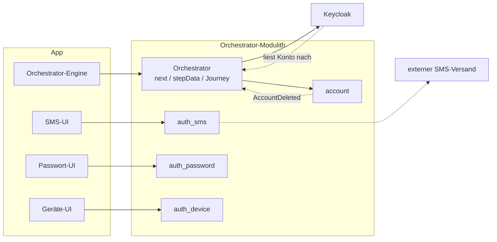
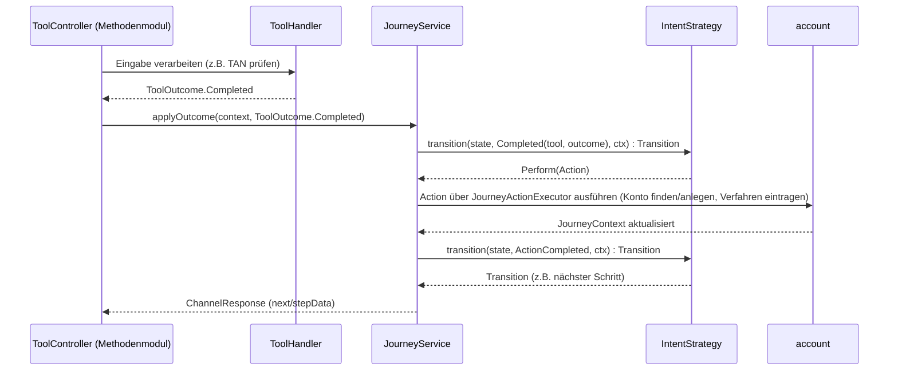

# Tool-Architektur

Ein *Tool* ist ein konkretes Verfahren, um jemanden zu identifizieren, ein Anmeldeverfahren
einzurichten oder sich anzumelden (`ident-fsc`, `enroll-sms`, `auth-sms`). Dieses Dokument
beschreibt, wie Tools sich selbst beschreiben und was sie über die Grenze ihres Moduls melden.

Was der Orchestrator mit diesen Meldungen macht, steht in [04-orchestrierung.md](04-orchestrierung.md).

---

## Einstieg: Zusammenspiel an einem Schritt

Aus Sicht des Backends ist der Orchestrator ein Modulith mit eigenen Tool-Modulen; einzelne Module
geben Arbeit ihrerseits an externe Dienste ab:

So arbeiten der Orchestrator und ein Tool-Modul wie `auth_sms` bei einem konkreten Schritt
zusammen:

Keycloak kommt in diesem Schritt nicht vor. Es hält keine Kopie der Konten, sondern liest ein Konto
bei Bedarf selbst beim Orchestrator nach ([ADR-38](adr/ADR-038-keycloak-liest-konten.md)). Das Modul
`account` spricht nie selbst mit Keycloak. Nur wenn ein Konto gelöscht wird, meldet es
`AccountDeleted`, und nach dem Commit räumt der Orchestrator (`KeycloakAccountRemovalListener`) die
Daten ab, die Keycloak selbst zu diesem Konto hält, etwa Sitzungen
([07-betrieb.md](07-betrieb.md) Abschnitt 3a).

Was der `ToolHandler` intern tut, um zu diesem `ToolOutcome` zu kommen, gehört bewusst nicht zu
diesem Bild. Er arbeitet mit eigener Fachlogik auf einem eigenen Schema (`ToolDB`), auf das nichts
außerhalb des Moduls zugreift.

Für dich als Backend-Entwickler heißt das:

- **Dein Modul bleibt dein Modul.** Ein Tool-Modul wie `auth_sms` hat sein eigenes Schema
  (`ToolDB`), auf das nichts von außen zugreift. Du kannst dort die Fachlogik ändern, ohne die
  Journey oder andere Module überhaupt lesen zu müssen.
- **Der Vertrag ist klein und stabil.** Dein `ToolHandler` liefert nur ein `ToolOutcome`. Was das
  für die Journey, ihren Zustand und den nächsten Schritt bedeutet, entscheidet allein die
  `IntentStrategy`. Beim Schreiben eines Tools musst du also nie die ganze Zustandsmaschine im
  Kopf haben.
- **App- und Web-Kanal sind für dich gleich.** Journey, Tool und `next` funktionieren für beide
  Zugänge gleich ([05-api.md](05-api.md)); du schreibst keine Sonderfälle für einen einzelnen Kanal
  in dein Modul.
- **Den Ablauf zum Ausstellen der Tokens musst du nicht bauen.** Das übliche OIDC mit Keycloak ist
  auf dem Server einmal umgesetzt. Dein Modul liefert nur das Ergebnis eines Verfahrens, nie selbst
  ein Token.

---

## 1) Tool-Katalog

`ToolSession` ist die dritte und kurzlebigste Ebene (`ChannelSession` → `AuthJourney` →
`ToolSession`). Sie steht für genau einen Durchlauf eines Tools und hält nur technische Daten zu
dessen Lebenszyklus. `toolId` (z. B. `ident-fsc`, `enroll-sms`, `auth-sms`) bezeichnet Art und
Methode in einem einzigen Namen. Die `toolId` wird nicht gespeichert, sondern aus der Route
abgeleitet; über sie werden Handler und Datenklasse des Moduls ausgewählt.

Der Tool-Katalog ist **keine zentral gepflegte Tabelle**. Er entsteht aus den Angaben, die die Module
über sich selbst machen (`ToolDescriptor`, Abschnitt 2). In den Begriffen des
[Glossars](glossar/glossar.md): Tools der Rolle `IDENTIFICATION` sind Identifizierungsmittel, die
Methoden der Rollen `ENROLLMENT` und `IDENTIFIED_AUTH`/`LOOKUP_AUTH` Authentisierungsmittel
([Orchestrierung](04-orchestrierung.md), Abschnitt „Begriffe“).

| toolId | role | method | factorTypes | maxAcr | allowsMultipleInstances |
|---|---|---|---|---|---|
| `ident-fsc` | `IDENTIFICATION` | `fsc` | `{possession}` | `loa2` | — |
| `ident-eid` | `IDENTIFICATION` | `eid` | `{possession,knowledge}` | `loa3` | — |
| `ident-nect` | `IDENTIFICATION` | `nect` | `{possession,knowledge,inherence}` | `loa3` | — |
| `ident-kvnr` | `CORRELATION` | `kvnr` | `{}` | `loa2` | — |
| `confirm-email` | `ATTESTATION` | `email` | `{}` | `loa1` | — |
| `enroll-sms` / `auth-sms` | `ENROLLMENT` / `IDENTIFIED_AUTH` | `sms` | `{possession}` | `loa1` | `false` |
| `enroll-password` / `auth-password` | `ENROLLMENT` / `IDENTIFIED_AUTH` | `password` | `{knowledge}` | `loa1` | `false` |
| `enroll-email` / `auth-email` | `ENROLLMENT` / `IDENTIFIED_AUTH` | `email` | `{knowledge}` | `loa1` | `false` |
| `auth-sms-lookup` / `auth-password-lookup` / `auth-email-lookup` | `LOOKUP_AUTH` | `sms`/`password`/`email` | wie das Gegenstück ohne `-lookup` | `loa1` | `false` |
| `enroll-device` / `auth-device` | `ENROLLMENT` / `IDENTIFIED_AUTH` | `device` | `{possession,knowledge,inherence}` | `loa2` | `true` |
| `enroll-kobil` / `auth-kobil` | `ENROLLMENT` / `IDENTIFIED_AUTH` | `kobil` | `{possession,knowledge,inherence}` | `loa2` | `true` |
| `enroll-qr` / `auth-qr` / `auth-qr-lookup` | `ENROLLMENT` / `IDENTIFIED_AUTH` / `LOOKUP_AUTH` | `qr` | `{}` / `{possession,knowledge}` / `{possession,knowledge}` | `loa1` / `loa2` / `loa2` | `false` |
| `confirm-qr-login` | `PEER_APPROVAL` | `qr` | `{}` | `loa2` | — |

Die Entscheidungen dahinter:

- Jedes Modul liefert Kategorie, Methode, Faktortyp und Niveau selbst; es gibt keinen zentral zu
  pflegenden Katalog.
- `method` wird **nicht** aus der `toolId` herausgelesen. `enroll-sms` und `auth-sms` melden
  dieselbe `method`; darüber findet ein Tool zum Anmelden die passende Zeile in
  `account.auth_method`.
- `factorTypes` ist eine **Menge**, weil ein Verfahren mehrere Faktoren zugleich erbringen kann:
  `enroll-device`/`auth-device` und `enroll-kobil`/`auth-kobil` deklarieren bis zu drei
  Faktortypen und erbringen je Durchlauf zwei davon mit `loa2` (ein an das Gerät gebundenes
  Credential plus System-PIN oder Biometrie).
- `requires` wird gegen die zusammengeführten Claims des Kontos geprüft
  (`AccountProfile.establishedClaims`, also Angaben abzüglich der Widerrufe, ADR-12). Die Prüfung
  läuft zweimal: bei der Auswahl der Kandidaten und noch einmal beim Start des Tools
  (`ToolControllerSupport.validatePreconditions`). Sonst ließe sich die Kandidatenliste durch
  einen direkten Aufruf umgehen. Drei Tools nutzen `requires` heute: `enroll-password` und
  `enroll-email` verlangen `ClaimRequirement(EMAIL, PROVEN)`, `ident-kvnr` die bestätigten
  Identitätsattribute NAME, VORNAME und GEBURTSDATUM (ADR-18).
- `requires` entscheidet **nicht nur über das Angebot, sondern gilt dauerhaft** (ADR-24): Was ein
  Credential brauchte, um zu entstehen, braucht es auch, um weiter zu bestehen. Fällt die Angabe
  weg, fällt das Credential mit – und mit ihm alles, was daran hängt. Das wird aus denselben
  Deklarationen ermittelt (`JourneyActionExecutor.dependentsOfLostClaims`). Eine Abhängigkeit
  zwischen zwei Verfahren braucht deshalb keine eigenen Begriffe: Ein Modul schreibt beim
  Einrichten einen Claim, ein anderes verlangt ihn, und das Protokoll der Claims erledigt den
  Rest. `enroll-password` schreibt dafür `PASSWORD_EXISTS`. Heute fragt das niemand ab, aber so
  ließe sich eine solche Abhängigkeit ausdrücken.
- Die **Verfügbarkeit** wird auf zwei unabhängigen Ebenen bestimmt, beide als Mengen von
  `toolId`s. Der Client gibt beim Anlegen des Kanals an, welche Tools er darstellen kann
  (`availableTools`, fest für den ganzen Kanal). Der Betreiber kann zusätzlich jedes Tool **je
  Kanaltyp** (App oder Web) zur Laufzeit sperren (`ToolAvailabilityService`, ADR-32). Bei jeder
  Anfrage zählt nur, was in beiden Mengen steht (`JourneyRouting.availableToolsOf`); das wird an
  drei Stellen geprüft. Bleibt nichts übrig, bricht die Journey genauso ab
  (`exhausted`/Cancel), als hätte der Nutzer alle Kandidaten abgelehnt.
- Auch die **Reihenfolge** legt der Betreiber je Kanaltyp fest: eine Rangfolge der Tools, die jede
  Auswahl in diesem Kanal übernimmt. Sie wirkt nur innerhalb einer Rolle (`MethodRole`), denn
  jede Auswahl zeigt nur Tools einer Rolle; die Admin-Seite gruppiert entsprechend. Tools ohne
  Rang stehen dahinter, sortiert nach Rolle und Verfahren. Sortiert wird erst beim Ausliefern der
  Auswahl (`JourneyRouting.stepFor`), nicht im gespeicherten Angebot der Journey. Eine geänderte
  Reihenfolge gilt so schon für den nächsten Bildschirm einer laufenden Journey (ADR-32).
- `role=ATTESTATION` (`confirm-email`) kennzeichnet einen Nachweis, der weder Identifizierung
  noch Anmeldung noch Einrichtung ist: Die bestätigte Adresse wird ein Attribut des Kontos, kein
  Credential. Ausführlich dazu Abschnitt 2 („`ATTEST`").
- `role=LOOKUP_AUTH` kennzeichnet die `-lookup`-Varianten. Sie haben dieselbe `method` wie ihr
  Gegenstück mit `IDENTIFIED_AUTH`, finden das Konto aber über eine eingegebene E-Mail-Adresse
  statt über den Kanal. Ohne diese Unterscheidung wäre die Auswahl der Kandidaten mehrdeutig.
- `role=CORRELATION` (`ident-kvnr`) kennzeichnet einen Schritt, der nur zuordnet. Für sich beweist
  er nichts: Eine eingetippte KVNR oder Partnernummer ist kein Nachweis. Er ist nie Kandidat einer
  (erneuten) Identifizierung, denn `forIdentification` und `reIdentCandidates` prüfen die Rolle,
  nicht die Kategorie. Starten lässt er sich erst, wenn die Identität bereits bestätigt ist
  (`requires`, ADR-18). `factorTypes = {}` folgt aus dieser Rolle, definiert sie aber nicht.
- `allowsMultipleInstances=true` (`device`, `kobil`): Mehrere aktive Einträge derselben Methode
  dürfen gleichzeitig bestehen, einer je physischem Gerät. Sonst gilt die Regel, dass ein neues
  Einrichten den alten Eintrag ersetzt. Das ist eine reine **Regel fürs Speichern**: Sie sagt nur,
  ob ein neues Einrichten das alte ersetzt.
- `keyBinding` (`device`, `kobil`): Das Credential liegt als nicht exportierbarer Schlüssel auf
  genau einem Gerät und kann anderswo gar nicht existieren. Daraus folgt die **Regel für Angebot
  und Widerruf**: `AuthPolicy.candidateTools` bietet nur den Eintrag an, der zum anfragenden Gerät
  passt. `usableByCaller` prüft zusätzlich, dass das Gerät laut `DeviceAccountLink` noch mit diesem
  Konto verknüpft ist. Und wird das Gerät neu verknüpft, widerruft `JourneyActionExecutor` genau die Credentials,
  die auf diesem Schlüssel liegen.
- `instanceDisclosure` (heute bei `device` und `kobil`) beantwortet die nächste Frage: Was darf
  über den Eintrag auf diesem Schlüssel **angezeigt** werden? Auch hier liefert das Modul die
  Regel, nicht die Detaildaten selbst. Die gehören allein dem Modul und enthalten Hashes und
  Bindungsschlüssel. So kann der Orchestrator sagen, wodurch dieses Gerät sonst noch bekannt ist
  (`device-link.boundCredentials`), ohne einen einzigen Schlüssel der Detaildaten zu kennen.
  Früher las genau eine Stelle dafür die privaten Konstanten zweier Module. Das ließ sich nur
  kompilieren, weil der Compiler `internal const val` direkt einsetzt; dadurch blieb keine
  Abhängigkeit zwischen den Modulen übrig, die `ApplicationModules.verify` hätte beanstanden
  können.
- `keyBinding` ist bewusst ein `CallerKeyBinding?` und kein Schalter neben einer
  überschreibbaren Funktion: Wer die Eigenschaft deklariert, liefert damit **zwingend** die Regel
  mit, nach der sich die Einträge unterscheiden. (Aus demselben Grund trägt
  `AttributeAuthority.Local` seine `AnchorRule` selbst, [12-entscheidungen.md](12-entscheidungen.md)
  ADR-14.) Ein Schalter ohne Regel (jeder Eintrag läge auf jedem Schlüssel) oder eine Regel ohne
  Schalter (sie würde nie abgefragt) lassen sich so gar nicht ausdrücken. Es braucht also keine
  Prüfung, die beides zusammenhält.
- `keyBinding` ist **getrennt** von `allowsMultipleInstances`, obwohl `device` und `kobil` heute
  beides bejahen. Das eine aus dem anderen abzuleiten, ginge nur gut, solange jede Methode mit
  mehreren Einträgen auch an einen Schlüssel gebunden ist. Eine künftige Methode, die lediglich
  mehrere Einträge nebeneinander erlaubt, bekäme sonst unbemerkt die Bedeutung eines
  Geräteschlüssels, die sie nie beansprucht hat.
- `enroll-kobil`/`auth-kobil` binden das Gerät nicht selbst, sondern über den externen
  Dienstleister KOBIL. Es ist das erste Verfahren, dessen Nachweis **nicht über den Client läuft**:
  Der Client überbringt nur eine Einmalkennung (OTP); die Bestätigung holt sich das Backend selbst
  beim Anbieter ab (Abschnitt 7 in [Abläufe](06-ablaeufe.md)). Der Besitz des Geräts ist damit
  stärker belegt als bei jedem anderen Tool; das Zugangsmittel ist es nicht (nächster Punkt).
- Beim KOBIL-Verfahren liegt der PIN **im Backend des Tools**, nicht beim Nutzer. Er wird beim
  Einrichten dort erzeugt und bei jeder Anmeldung an den Client herausgegeben, nachdem dieser
  sich lokal entsperrt hat: per Gerätegeheimnis mit Biometrie-Schutz oder per Passwort des Kontos
  (ADR-21). Dieses Entsperren ist die `userVerification` des Verfahrens, kein zweiter Nachweis. Es
  nutzt die im Projekt üblichen Namen: `pin` für Wissen, `biometric` für Inhärenz – dieselben
  Werte wie bei `auth-device`. (Ein amr-Eintrag `password` wäre nicht nur ein neuer Name, sondern
  falsch: amr-Werte und Methodennamen teilen sich einen Namensraum, und `JourneyRecorder` würde
  dem Durchlauf die echte Passwort-Methode des Kontos anhängen.)
- Beide Wege zum Entsperren sind optional. Welche es für ein bestimmtes Credential gibt,
  **berechnet der Server**: Biometrie nur, wenn der Nutzer ihr beim Einrichten zugestimmt hat
  (dann gibt es `unlock_secret_hash`, sonst ist die Spalte NULL), das Passwort nur, solange das
  Konto eines hat. `auth-kobil` nennt in `stepData` (`unlockOptions`) nur die Wege, die es
  tatsächlich gibt, statt beide anzubieten und einen davon ins Leere laufen zu lassen.
- `kobil` deklariert dieselben `factorTypes` und dasselbe `maxAcr` wie `device` und hat damit
  **dieselbe Ausnahme** von der Regel „nur nachweisbare Faktoren melden"
  ([Orchestrierung](04-orchestrierung.md) Abschnitt 8): Wie entsperrt wurde, gibt in beiden Fällen
  der Client selbst an. Beides wird bewusst gleich behandelt, statt für dasselbe Zugangsmittel eine
  zweite, strengere Regel einzuführen.
- `keyBinding` liest beim KOBIL-Verfahren den **DPoP-Schlüssel** des Kanals
  (`kobilBindingKeyRef`), nicht die Gerätekennung von KOBIL. Wenn das Verfahren angeboten wird,
  ist der Schlüssel das Einzige, was bekannt ist; die Kennung erfährt der Server erst nach dem
  Einlösen. Beide stehen deshalb unter getrennten, eigens benannten Schlüsseln in den
  `instanceDetails`: Sie beantworten verschiedene Fragen zu verschiedenen Zeitpunkten.
- `enroll-qr`/`auth-qr`/`auth-qr-lookup` folgen demselben Muster wie `sms`, `password` und `email`:
  einrichten, anmelden und anmelden über die E-Mail-Adresse. Eine Besonderheit gibt es:
  `enroll-qr` ist eine reine Zustimmung (Opt-in) ohne Geheimnis (`factorTypes = {}`); ob diese
  Zustimmung vorliegt, prüft erst `confirm-qr-login`.
- `auth-qr`/`auth-qr-lookup` deklarieren `factorTypes = {possession, knowledge}`. Das Handy, das
  die Anmeldung bestätigt, muss laut `ConfirmPeerLoginStrategy.gate()` vorher selbst frisch loa2
  nachgewiesen haben. Das ist MFA aus einem einzigen Verfahren wie bei `ident-eid` und passt zu
  `maxAcr=loa2`.
- `confirm-qr-login` hat die Rolle `MethodRole.PEER_APPROVAL` (Kategorie `SIDE_ACTION`), denn
  keine der übrigen Rollen passt auf „bestätigt, was jemand anderes tut".

Zentral bleibt nur, was ein Modul nicht wissen *kann*: welches Niveau sich aus einer
**Kombination** von Nachweisen ergibt und welches Niveau eine Ressource verlangt. Das ist Sache der
`AuthPolicy` ([Orchestrierung](04-orchestrierung.md)).

---

### Was `ident-nect` von Nect bekommt

`ident-nect` leitet zum simulierten Identifizierungsdienst Nect weiter (Sprungseite `/nect/`) und holt
das Ergebnis danach selbst ab (`NectIdent.redeem`). Nur im App-Kanal. Nect veröffentlicht keine
Feldliste; was es weitergeben **kann**, begrenzt das Dokument selbst:

Quellen: Online-Ausweis nach [§18 PAuswG](https://www.gesetze-im-internet.de/pauswg/__18.html), Reisepass nach [ICAO 9303](https://www.icao.int/publications/doc-series/doc-9303) (DG1), EUDI-Wallet nach dem [PID-Rulebook](https://github.com/eu-digital-identity-wallet/eudi-doc-attestation-rulebooks-catalog/blob/main/rulebooks/pid/pid-rulebook.md).

- **Auswahl der Daten**
  - *Online-Ausweis:* je Zugriffsrecht
  - *Reisepass:* keine – der Chip wird ganz gelesen
  - *EUDI-Wallet:* je Attribut; der Nutzer darf ablehnen
- **Name, Vorname, Geburtsdatum**
  - *Online-Ausweis:* ✓
  - *Reisepass:* ✓ in MRZ-Schreibweise (`MUELLER`, ggf. gekürzt)
  - *EUDI-Wallet:* ✓
- **Anschrift**
  - *Online-Ausweis:* ✓, Straße und Hausnummer in einem Feld
  - *Reisepass:* ✗
  - *EUDI-Wallet:* optional
- **Anker**
  - *Online-Ausweis:* Pseudonym der Karte – je Diensteanbieter verschieden, bei Nect also Nects eigenes (`NECT_RESTRICTED_ID`, nicht das von `ident-eid`)
  - *Reisepass:* keiner – die Dokumentnummer wird nicht angefordert (§ 20 PAuswG / § 16 PassG, docs/ideen/ident-nect.md)
  - *EUDI-Wallet:* ✗ – die PID trägt kein Pseudonym
- **Niveau / Faktortypen**
  - *Online-Ausweis:* `loa3`, Besitz + Wissen
  - *Reisepass:* `loa2`, Besitz + Biometrie (Lichtbildabgleich)
  - *EUDI-Wallet:* `loa3`, Besitz + Wissen

`ident-nect` fragt dasselbe an wie `ident-eid`: Name, Vorname, Geburtsdatum, Anschrift und den Anker
des Dokuments. Nect gibt nur weiter, was angefragt **und** vom Dokument lieferbar ist. Eine Person im
Personenverzeichnis findet `ident-nect` nicht; die Zuordnung folgt wie nach `ident-eid` über
`ident-kvnr`. Offene Punkte (Web-Kanal, echte Anbindung, Pass-Anker):
[ideen/ident-nect.md](ideen/ident-nect.md).

---

## 2) `ToolDescriptor` und `ToolOutcome`

Jedes Tool bringt eine eigene Descriptor-Bean mit (`object EnrollSmsDescriptor : ToolDescriptor`, je
Modul in `Descriptors.kt`), statt dass der Handler das Interface selbst implementiert. Der
Descriptor ist eine reine Selbstbeschreibung ohne Abhängigkeiten, getrennt von der Fachlogik in
`internal`. Der Orchestrator sammelt die Descriptors beim Start ein und bildet daraus den Katalog
aus Abschnitt 1:

| Feld | Bedeutung |
|---|---|
| `toolId` | z. B. `"auth-sms"` – frei vergeben, nie aus `role` und `method` abgeleitet (öffentlicher API-Vertrag) |
| `method` | z. B. `"sms"` – verbindet `enroll-sms`, `auth-sms` und `auth-sms-lookup` |
| `role` | `IDENTIFICATION` \| `CORRELATION` \| `ATTESTATION` \| `ENROLLMENT` \| `IDENTIFIED_AUTH` \| `LOOKUP_AUTH` \| `PEER_APPROVAL`; die Kategorie (`role.category`: `IDENT`/`ATTEST`/`ENROLL`/`AUTH`/`SIDE_ACTION`) wird direkt daraus gelesen und nicht auf dem Descriptor wiederholt |
| `factorTypes`, `maxAcr` | feste Obergrenzen dieses Tools |
| `claims` | welche Attribute das Tool mit welcher `ClaimSource` bezeugen darf; ein Durchlauf meldet nie mehr |
| `startStep` | erster Schritt eines neuen Durchlaufs, standardmäßig aus der Rolle abgeleitet (`role.defaultStartStep`) |
| `requires`, `allowsMultipleInstances`, `keyBinding`, `instanceDisclosure` | standardmäßig leere Menge, `false`, `null` bzw. `null` |

`(method, role)` ist der eindeutige Schlüssel für „das konkrete Verfahren dieser Art für dieses
Credential". `(method, role.category)` allein reicht nicht, weil sich `IDENTIFIED_AUTH` und
`LOOKUP_AUTH` die Kategorie `AUTH` teilen. `ToolHandlerRegistry` lehnt beim Einsammeln der
Descriptors ein doppeltes Paar `(method, role)` ab, statt unbemerkt einen der beiden zu nehmen.

`tool_spi` kennt **keine** konkreten Methoden. Jedes Modul deklariert seine eigene Konstante (z. B.
in `auth_sms/Descriptors.kt`: `internal const val SMS_METHOD = "sms"`), damit der Katalog ohne
zentrale Liste auskommt. Die `toolId` wird bewusst *nicht* aus `(method, role)` abgeleitet: Sie ist
öffentlicher API-Vertrag (URL-Pfade, Frontend-Routing), auch wenn die heutigen Werte dem Muster
`{role-präfix}-{method}[-lookup]` folgen.

`maxAcr` und `factorTypes` sind fest und dienen der Vorauswahl: Kann dieses Tool eine Lücke
überhaupt schließen? Was ein konkreter Durchlauf tatsächlich erreicht hat, meldet `Completed` – nie
mehr, als der Descriptor zulässt.

Über die Grenze eines Moduls geht nur ein `ToolOutcome`: Das Verfahren läuft noch, ist
abgeschlossen oder ist fehlgeschlagen.

| Variante | Bedeutung |
|---|---|
| `InProgress(nextStep, stepData, demo)` | läuft weiter; `stepData` ist für den Client bestimmt und wird unverändert weitergegeben, `demo` enthält nur Demo-Werte (ADR-28) |
| `Failed.*(reason, …)` | Versuch fehlgeschlagen, eine Variante je Rolle (siehe unten); wie es mit weiteren Versuchen weitergeht, steht in [Orchestrierung](04-orchestrierung.md) |
| `Completed.Identified(claims, ...)` | Identität festgestellt; höchstens ein `PERSON_ID`-Claim (eine Partnernummer). Verfahren, die nur bezeugen, was sie lesen (`ident-eid`, `ident-nect`), liefern keinen |
| `Completed.Attested(claims, ...)` | Attribut bestätigt; kein `enrollmentRef`, `amr` immer leer (Abschnitt „ATTEST" unten) |
| `Completed.Enrolled(enrollmentRef, ...)` | Verfahren eingerichtet |
| `Completed.Authenticated(accountId?, ...)` | Nachweis erbracht; `accountId` setzen nur die `-lookup`-Tools |
| `Completed.Approved(...)` | Ein `PEER_APPROVAL`-Tool (`confirm-qr-login`) hat eine fremde Anfrage bestätigt |

Ein Fehlschlag nennt über seine Variante, gegen wen der Versuch lief – davon hängt ab, welche
Sperre nach zu vielen Versuchen greift. Das Subjekt ist ein Pflichtfeld; „niemand“ ist ein
ausdrückliches `null`, kein vergessener Standardwert (Review 2026-09, S-6):

- **`IdentifiedAuth(reason)`** (`IDENTIFIED_AUTH`): gegen das Konto, das der Kanal schon kennt.
- **`LookupAuth(reason, attemptedAccountId)`** (`LOOKUP_AUTH`): gegen das Konto, das die Eingabe
  ergab, oder `null`.
- **`Identification(reason, attemptedPersonId)`** (`IDENTIFICATION`, `CORRELATION`): gegen die
  Person, die die Eingabe ergab, oder `null`.
- **`NothingGuessed(reason)`** (`ENROLLMENT`, `ATTESTATION`, `PEER_APPROVAL`): Kein Geheimnis eines
  bestehenden Kontos wurde geraten; es zählt keine Sperre.

Eine Variante, die nicht zur Rolle des Tools passt, weist der Orchestrator als Vertragsfehler
des Moduls ab, bevor er etwas bucht.

Jeder gemeldete Claim wird vor der Verarbeitung geprüft (`Claim.validateValue`): Er darf nicht leer
sein, ein `PERSON_ID` muss eine Partnernummer sein (`tool_spi.Partnernr`, `P` und neun Ziffern) und
ein Geburtsdatum ein ISO-Datum.

Jede `Completed`-Variante trägt außerdem `amr` (die nachgewiesenen Methoden, für
`AuthEvidence.currentAmr`), `achievedAcr` und `factorTypes` (eine Teilmenge der
`ToolDescriptor.factorTypes`). Die Variante *ist* die Kategorie und legt fest, was der
Orchestrator tut.

### `ATTEST`: ein Attribut bestätigen ist weder Identifizierung noch Anmeldung

`confirm-email` weist nach, dass jemand eine Adresse **kontrolliert**: Dort kommt ein Code an. Das
ist weder „wer bist du" (`IDENT`) noch „weise ein Mittel nach" (`AUTH`) noch „richte ein Mittel ein"
(`ENROLL`). Deshalb gibt es eine eigene Kategorie `MethodRole.ATTESTATION` mit dem Ergebnis
`ToolOutcome.Completed.Attested`: Claims ja, `enrollmentRef` nein, `amr` ausdrücklich leer. Eine
bestätigte Adresse darf das Niveau des Kanals nicht anheben.

Es unter `IDENT` einzuordnen, wäre falsch: `CandidateTools.forIdentification` und
`DefaultAuthPolicy.reIdentCandidates` würden das Tool dann als Identifizierungsverfahren anbieten,
und sein Nachweis zählte als Identitätsnachweis (IDENTITY). Das würde das IAL anheben und damit
über `enrolledUnderAcr` auch die Obergrenze der danach eingerichteten Verfahren (ADR-5).

**Welche Kategorie für ein neues Attribut?** Darüber entscheiden `ClaimSource` (wer für den Wert
einsteht) und `AttributeType.authority` (wem der aktuelle Wert gehört):

- Steht das Personenverzeichnis dafür ein (`PERSON_DIRECTORY`), ist es `IDENT`.
- Steht das Verfahren selbst dafür ein (`ClaimSource.of(toolId)`) und gehört der Wert dem Konto
  (`AttributeAuthority.Local`), ist es `ATTEST`.
- Gehört der Wert dem Methodenmodul (`MethodModule`), ist es `ENROLL`.

Über die KVNR lässt sich keine Kontrolle nachweisen, nur die Zugehörigkeit zur Person. Sie gehört
also zu `IDENT`; ein `attest-kvnr` gibt es nicht.

**Jedes Identifizierungsverfahren liefert Name, Vorname und Geburtsdatum.** Danach wird eine Person
im Änderungsprotokoll wiedergefunden, auch nach der Löschung ihres Kontos (ADR-39).
`ToolHandlerRegistry` verweigert den Start, wenn ein Verfahren der Rolle `IDENTIFICATION` eines der
drei nicht deklariert.

Ein dritter Fall fehlte in dieser Regel und wurde mit ADR-18 ergänzt: **Steht das Verfahren selbst
(`ClaimSource.of(toolId)`) für einen Wert ein, der dem Personenverzeichnis gehört
(`AttributeAuthority.PersonDirectory`), ist es `IDENT`.** So ist es bei `ident-eid`, das Name,
Vorname, Geburtsdatum, Adresse und die an die Karte gebundene `restricted_id` von der Karte liest,
und ebenso bei `ident-nect`. `ATTEST` wäre dafür falsch – nicht weil die Daten jemand anderem
gehören, sondern weil `ATTEST` per Definition *nichts* zu ACR und AMR beiträgt
(`evidenceAxis()` liefert dort keine Nachweisart). Eine eID trägt aber sehr wohl zum IAL bei.
Umgekehrt gilt die Kategorie auch für ein Tool, das nur *zuordnet*, statt etwas zu beweisen
(`ident-kvnr`, `role = CORRELATION`). Es bleibt `IDENT`, liefert aber keinen Nachweis und hebt das
IAL nicht. Seine Sicherheit kommt aus `requires` und dem Abgleich der Identität im Modul
`account`.

`ToolCategory.SIDE_ACTION` benennt, was `PEER_APPROVAL`-Tools gemeinsam haben: Sie tragen nichts
zu ACR und AMR des *eigenen* Kanals bei, werden nie vorausgewählt, um eine Lücke zu schließen, und
nur ausdrücklich per `intent` gestartet. Bewusst heißt die Kategorie **nicht** `MISC` oder `OTHER`:
Das würde die Vollständigkeit aushebeln, die `ToolCategory` als abgeschlossenes `enum` sichert.
`AuthPolicy.candidateTools` und `enrollmentCandidates` haben einen eigenen Zweig für
`SIDE_ACTION`, der nichts anbietet. Lehnt jemand eine fremde Anfrage ab, braucht das **kein**
eigenes `ToolOutcome`; `Failed(reason = "Vom Nutzer abgelehnt")` genügt.

- `InProgress.stepData` ist **für den Client bestimmt** (z. B. `missingFields`); `Completed` und
  `Failed` sind **für den Orchestrator bestimmt** und werden nie direkt an den Client
  weitergegeben.
- `amr` und `achievedAcr` liefert jedes Tool selbst, weil dasselbe Verfahren je nach Durchlauf
  unterschiedliche Niveaus erreichen kann.
- `Completed.Authenticated.accountId` setzen nur die `-lookup`-Tools, die das Konto selbst finden.
  Die gewöhnlichen `auth-*`-Tools kennen es schon über den Kanal.
- Jedes Tool hat einen eigenen Controller, der seinen Handler direkt und typisiert aufruft, statt
  über eine allgemeine `Map<String, Any?>`. Es gibt keine Verteilung anhand der `toolId` zur
  Laufzeit ([Projektrahmen](08-projektrahmen.md) A11: „Lesbarkeit hat Vorrang vor einer maximal
  generischen API-Anbindung"). Dieser Controller liegt im selben Modul wie sein Handler (Abschnitt 4).
  Die `EnrollmentRef` wird im Controller aufgelöst und geprüft, bevor der Handler aufgerufen wird;
  der Handler bekommt also nie einen Parameter, der `null` sein könnte.
- **Die bestätigte E-Mail-Adresse ist ein Attribut des Kontos, kein Credential eines Moduls.**
  `confirm-email` liefert den `EMAIL`-Claim über `Completed.Attested`; die Journey übernimmt ihn per
  `AccountService.recordClaims`. `enroll-email` baut darauf auf
  (`requires ClaimRequirement(EMAIL, PROVEN)`) und schreibt selbst keinen Claim mehr: Die Kontrolle
  über die Adresse ist schon bewiesen, ein zweiter Nachweis brächte nichts. `auth-email-lookup`,
  `auth-sms-lookup` und `auth-password-lookup` finden das Konto dagegen über die
  `resolveAccountByEmail`-Erweiterung von `AccountDirectory`; sie liefert nur eine Konto-ID, kein
  Profil. `confirm-email` prüft selbst **nicht**, ob die Adresse schon zu einem Konto gehört: Vor
  der Eingabe des Codes ist sie nur eingetippt, nicht bewiesen. Wem die bestätigte Adresse gehört,
  entscheidet danach die zentrale Auflösung. Gehört sie zu einem anderen Konto, geht das
  vorläufige Konto darin auf, sofern die bestätigte Identität dazu passt
  ([12-entscheidungen.md](12-entscheidungen.md) ADR-20).

---

## 3) Modulinterner Aufbau: das `Flow`-Muster (optional)

Ein Methodenmodul darf sich intern frei organisieren. Nur das `ToolOutcome` verlässt das Modul, nie
ein interner Zustand. Ein mögliches, aber nicht vorgeschriebenes Muster ist ein reiner `Flow`: Er
kennt nur seinen eigenen `State` und leitet aus `(State, Input)` eine `Decision` ab. Die enthält den
nächsten Zustand, Effekte (z. B. „TAN senden") und ein neutrales `FlowOutcome`
(`InProgress`/`Completed`/`Failed`). Der Handler übersetzt das `FlowOutcome` dann in ein
`ToolOutcome`.

---

## 4) Wo der Controller lebt: `tool_api` als Modulgrenze

Der `@RestController` eines Tools liegt **im selben Modul wie sein Handler** (z. B.
`id_fsc.api.v1.IdentFscToolController`, `auth_sms.api.v1.AuthSmsToolController`), nicht im
`orchestrator`. Der Orchestrator kennt kein Methodenmodul beim Namen: `orchestrator/ModuleMetadata.kt`
deklariert `allowedDependencies = ["tool_spi", "tool_api", "account", "ext_personenverzeichnis", "kcmigrate", "demo_seed", "texts"]`,
also kein einziges Methodenmodul (`id_*`, `auth_*`).

Möglich macht das das gemeinsame Modul `tool_api` (`allowedDependencies = ["tool_spi", "texts"]`),
das beide Seiten kennen dürfen:

- **`ToolEndpoint`** – das, was jeder Tool-Controller an Sitzung und Journey braucht: Tool starten,
  Kontext laden, Ergebnis anwenden, Journey abbrechen. Implementiert von `ToolControllerSupport` im
  `orchestrator` und per Konstruktor übergeben.
- **`AccountDirectory`** / **`PersonDirectory`** / **`DeviceProofs`** – schmale Schnittstellen zum
  Lesen und Prüfen von Daten zu Konto, Person und Gerätenachweis (z. B. findet `auth-sms-lookup`
  darüber ein Konto anhand der E-Mail-Adresse). Implementiert von `AccountService` (`account`),
  `Personenverzeichnis` (`ext_personenverzeichnis`) bzw. `DeviceProofValidator` (`orchestrator`),
  jeweils direkt im Domänenservice, ohne eigene Adapterklasse. Den Freischaltcode prüft `id_fsc`
  ebenfalls über einen Port, `ActivationCodes` (`digest`, `isValid`), den `Freischaltcodes`
  implementiert (ADR-31, Nachtrag). Das Personenverzeichnis ist damit nur über Ports erreichbar; an
  ihnen wechselt die Sprache vom Deutsch des Registers ins Englische unseres Codes.
  `PersonDirectory` löst eine KVNR (`findPersonIdByKvnr`) oder eine Partnernummer
  (`findPersonIdByPartnernr`) zur PersonId auf, gleicht Personalien ab (`matchesMasterData`,
  `matchesPersonalDetails`) und gibt die Versicherungsnummer (`insuranceNumberOf`) und den
  Anzeigenamen (`displayName`) heraus – nie die übrigen Stammdaten.
- **`IdentityResolver`** – beantwortet, ob bestätigte Claims zu einem bestehenden Konto gehören
  (`resolve`, `attestedIdentityMatches`). Implementiert von `IdentityMatchingService` (`account`).
- **`SmsCredentialPort`** / **`PasswordCredentialPort`** / **`QrCredentialPort`** – richten ein
  Credential für Aufrufer ein, die das Konto schon kennen und keine Tool-Sitzung haben (etwa die
  Demo-Startdaten); implementiert in `auth_sms`, `auth_password` bzw. `auth_qr`.
- **`PersonChanged`** – kein Port, sondern ein Event: die Änderungsmeldung des
  Personenverzeichnisses (Partnernummer, geänderte Attributarten, neue KVNR und
  Versicherungsnummer). Es liegt hier, damit `ext_personenverzeichnis` es veröffentlichen und
  `account` darauf reagieren kann (`PersonChangeListener`), ohne dass die beiden Module einander
  kennen (ADR-34).
- **`EnrollmentCleanup`** – die umgekehrte Richtung: eine Schnittstelle, über die in einem
  Methodenmodul geschrieben wird, wenn ein Konto gelöscht wird ([API](05-api.md), „Konto
  löschen"). Jedes Modul mit eigener, langlebiger Credential-Tabelle (`auth_sms.enrollment`,
  `auth_password.enrollment`, `auth_device.enrollment`, `auth_qr.enrollment`,
  `auth_kobil.enrollment`; der Tabellenname ist `EnrollmentRef.type`) bringt dafür eine
  `@Component`-Implementierung mit, die über `enrollmentType` angesprochen wird. `auth_email`
  braucht keine, weil die bestätigte E-Mail-Adresse dem Modul `account` gehört (Abschnitt 2).
  `AccountDeletionService` (`orchestrator`) sammelt alle `EnrollmentCleanup`-Beans ein, so wie
  `ToolHandlerRegistry` die `ToolDescriptor`-Beans. Weder `orchestrator` noch `account` müssen dafür
  ein Methodenmodul beim Namen kennen.
- **Envelope-DTOs** (`ChannelResponse`, `ChannelBlock`, `ActiveMethodView`, `Next`, `DemoInfo`) –
  das gemeinsame Antwortformat, das jeder Tool-Controller zurückgibt.
- **`ToolSwitchController`** – der einzige allgemeine Controller ohne `toolId` (Tool wechseln oder
  abbrechen, ohne Logik eines bestimmten Tools). Er liegt im Orchestrator
  (`orchestrator.api.v1.tool`), weder in einem Methodenmodul noch in `tool_api`: Was nach dem
  Abbruch kommt, entscheidet der Zustand der Journey, und `tool_api` ist der Vertrag zwischen den
  Modulen, keine Web-Schicht.

Beide Seiten zeigen auf dieselbe Schnittstelle, nie direkt aufeinander: Ein Methodenmodul ruft
Methoden von `ToolEndpoint` auf, ohne `ToolControllerSupport` oder den `orchestrator` zu kennen; der
`orchestrator` liest nie einen Handler eines Methodenmoduls. Die HTTP-Pfade
(`/orchestrator/api/v1/tools/...`) sind unverändert, denn Spring ordnet Anfragen nach
`@RequestMapping` zu, nicht nach dem Kotlin-Package. Details zur Modulliste und zur Richtung der
Abhängigkeiten: [Projektrahmen](08-projektrahmen.md) Abschnitt 3.
