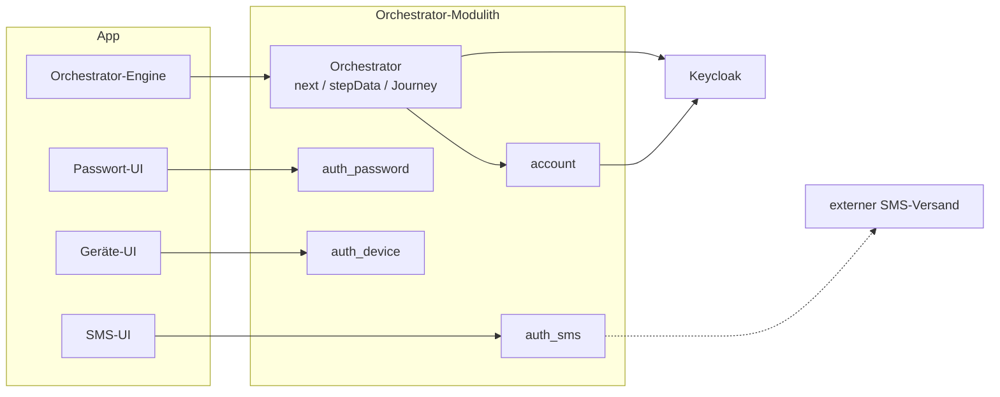
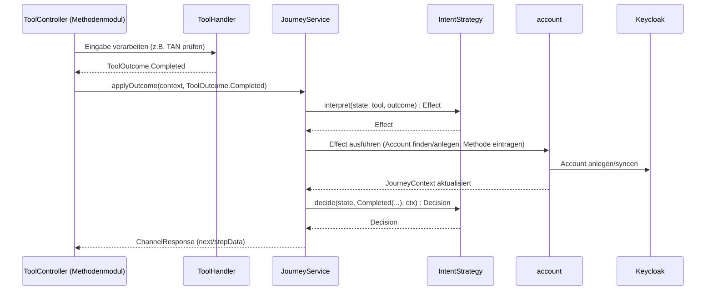

# Tool-Architektur

Ein *Tool* ist ein konkretes Verfahren zur Identifikation, zum Enrollment oder zur Authentifizierung
(`ident-fsc`, `enroll-sms`, `auth-sms`). Dieses Dokument beschreibt, wie Tools sich selbst
beschreiben und was sie über die Modulgrenze melden.

Was der Orchestrator mit diesen Meldungen macht, steht in [04-orchestrierung.md](04-orchestrierung.md).

---

## Einstieg: Zusammenspiel an einem Schritt

Aus Backend-Sicht ist der Orchestrator ein Modulith mit eigenen Tool-Modulen; einzelne Module
delegieren ihrerseits an externe Dienste:

So spielen Orchestrator und ein Tool-Modul wie `auth_sms` an einem konkreten Schritt zusammen:

Was `ToolHandler` intern tut, um zu diesem `ToolOutcome` zu kommen, ist bewusst nicht Teil dieses
Bildes: eigene, tool-spezifische Fachlogik gegen ein eigenes Schema (`ToolDB`), auf das nichts
außerhalb des Moduls zugreift.

Daraus folgt für dich als Backend-Entwickler:

- **Dein Modul bleibt dein Modul** — ein Tool-Modul wie `auth_sms` hat sein eigenes Schema
  (`ToolDB`), auf das nichts außerhalb zugreift. Du kannst darin fachliche Logik ändern, ohne
  Journey oder andere Module überhaupt lesen zu müssen.
- **Der Vertrag ist klein und stabil** — dein `ToolHandler` liefert nur einen `ToolOutcome`;
  was das für Journey/Zustand/nächsten Schritt bedeutet, entscheidet ausschließlich die
  `IntentStrategy`. Du musst beim Schreiben eines Tools nie die volle Zustandsmaschine im Kopf
  haben.
- **App- und Web-Kanal sind für dich identisch** — Journey, Tool und `next` laufen für beide
  Fassaden gleich ([05-api.md](05-api.md)); du schreibst keine kanalspezifischen Sonderfälle in
  dein Modul.
- **Der Tokenfluss ist kein Baustellen-Code** — Standard-OIDC gegen Keycloak, serverseitig
  einmal implementiert; dein Modul liefert nur das Ergebnis eines Verfahrens, nie ein Token
  selbst.

---

## 1) Tool-Katalog

`ToolSession` ist die dritte, kurzlebigste Ebene (`ChannelSession` → `AuthJourney` → `ToolSession`)
und steht für genau einen Durchlauf eines Tools, mit rein technischen Lifecycle-Metadaten. `toolId`
(z. B. `ident-fsc`, `enroll-sms`, `auth-sms`) identifiziert Art und Methode flach — kein
persistiertes Feld, sondern aus der Route abgeleitet, wählt darüber Handler und Moduldaten-Klasse.

Der Tool-Katalog ist **keine zentral gepflegte Tabelle**, sondern die Aggregation der Selbstauskünfte aller Module (`ToolDescriptor`, Abschnitt 2):

| toolId | role | method | factorTypes | maxAcr | allowsMultipleInstances |
|---|---|---|---|---|---|
| `ident-fsc` | `IDENTIFICATION` | `fsc` | `{possession}` | `loa2` | — |
| `ident-eid` | `IDENTIFICATION` | `eid` | `{possession,knowledge}` | `loa3` | — |
| `ident-kvnr` | `CORRELATION` | `kvnr` | `{}` | `loa2` | — |
| `confirm-email` | `ATTESTATION` | `email` | `{}` | `loa1` | — |
| `enroll-sms` / `auth-sms` | `ENROLLMENT` / `IDENTIFIED_AUTH` | `sms` | `{possession}` | `loa1` | `false` |
| `enroll-password` / `auth-password` | `ENROLLMENT` / `IDENTIFIED_AUTH` | `password` | `{knowledge}` | `loa1` | `false` |
| `enroll-email` / `auth-email` | `ENROLLMENT` / `IDENTIFIED_AUTH` | `email` | `{knowledge}` | `loa1` | `false` |
| `auth-sms-lookup` / `auth-password-lookup` / `auth-email-lookup` | `LOOKUP_AUTH` | `sms`/`password`/`email` | wie Zwilling | `loa1` | `false` |
| `enroll-device` / `auth-device` | `ENROLLMENT` / `IDENTIFIED_AUTH` | `device` | `{possession,knowledge,inherence}` | `loa2` | `true` |
| `enroll-kobil` / `auth-kobil` | `ENROLLMENT` / `IDENTIFIED_AUTH` | `kobil` | `{possession,knowledge,inherence}` | `loa2` | `true` |
| `enroll-qr` / `auth-qr` / `auth-qr-lookup` | `ENROLLMENT` / `IDENTIFIED_AUTH` / `LOOKUP_AUTH` | `qr` | `{}` / `{possession,knowledge}` / `{possession,knowledge}` | `loa1` / `loa2` / `loa2` | `false` |
| `confirm-qr-login` | `PEER_APPROVAL` | `qr` | `{}` | `loa2` | — |

Entscheidungen dahinter:

- Jedes Modul liefert Kategorie/Methode/Faktorart/Niveau selbst — kein zentral zu pflegender Katalog.
- `method` wird **nicht** aus `toolId` geparst: `enroll-sms`/`auth-sms` melden dieselbe `method`, worüber ein Auth-Tool die passende Zeile in `account.auth_method` findet.
- `factorTypes` ist eine **Menge**, weil ein Verfahren mehrere Faktoren zugleich erbringen kann: `enroll-device`/`auth-device` und `enroll-kobil`/`auth-kobil` melden `loa2` und zwei Faktorarten aus einem Durchlauf (gerätegebundenes Credential plus System-PIN/Biometrie).
- `requires` wird gegen die konsolidierten Claims des Kontos geprüft (`AccountProfile.establishedClaims`, Behauptungen minus Retraktionen, ADR-12) und doppelt ausgewertet — bei der Kandidatenermittlung und nochmals bei der Aktivierung (`ToolControllerSupport.validatePreconditions`) —, sonst wäre die Kandidatenliste per Direktaufruf umgehbar. Zwei Tools nutzen es heute: `enroll-password` verlangt `ClaimRequirement(EMAIL, PROVEN)`, `ident-kvnr` die bezeugten Identitätsattribute (ADR-18).
- `requires` ist dabei **keine reine Angebotsschranke mehr, sondern eine stehende Voraussetzung** (ADR-24): Was ein Credential zum Entstehen brauchte, braucht es zum Weiterbestehen. Fällt die Behauptung weg, fällt das Credential mit — transitiv, ermittelt aus denselben Deklarationen (`JourneyActionExecutor.dependentsOfLostClaims`). Deshalb braucht eine Abhängigkeit zwischen Verfahren keine zweite Vokabel: Ein Modul behauptet beim Einrichten einen Claim, ein anderes verlangt ihn, und das Claim-Log erledigt den Rest. `enroll-password` behauptet dafür `PASSWORD_EXISTS` — heute ohne Abnehmer, aber es ist die Vokabel, in der eine solche Abhängigkeit formuliert würde.
- **Verfügbarkeit** hat zwei unabhängige Achsen, beide als `toolId`-Mengen: Der Client erklärt bei der Kanal-Erzeugung, welche Tools er rendern kann (`availableTools`, fix je Kanal); das Backend kann zusätzlich jedes Tool global zur Laufzeit sperren (`ToolAvailabilityService`). Beide werden live geschnitten (`JourneyContext.availableTools`) und an drei Stellen geprüft; bleibt nichts übrig, greift derselbe `exhausted`/Cancel-Fallback wie bei vollständig abgelehnten Kandidaten.
- `role=ATTESTATION` (`confirm-email`) markiert einen Nachweis, der weder Ident noch Auth noch Enroll ist: die bestätigte Adresse wird Account-Attribut, kein Credential — ausführlich in Abschnitt 2 ("`ATTEST`").
- `role=LOOKUP_AUTH` markiert die `-lookup`-Zwillinge: dieselbe `method` wie ihr `IDENTIFIED_AUTH`-Geschwister, aber Account-Auflösung über eine eingegebene E-Mail statt über den Kanal — ohne diese Unterscheidung wäre die Kandidatenermittlung mehrdeutig.
- `role=CORRELATION` (`ident-kvnr`) markiert einen Zuordnungsschritt: Er beweist für sich nichts — eine getippte Nummer ist kein Nachweis —, ist nie Kandidat einer (Re-)Identifizierung (`forIdentification`/`reIdentCandidates` matchen auf die Rolle, nicht die Kategorie) und nur nach einer Bezeugung überhaupt aktivierbar (`requires`, ADR-18). `factorTypes = {}` ist Folge dieser Rolle, nicht ihre Definition.
- `allowsMultipleInstances=true` (`device`, `kobil`): mehrere aktive Instanzen derselben Methode dürfen gleichzeitig existieren, eine je physischem Gerät, statt der sonst üblichen "neu enrollen ersetzt die alte"-Regel. Eine reine **Speicherregel** — sie sagt nur, ob ein neues Enrollment das alte ersetzt.
- `keyBinding` (`device`, `kobil`): das Credential liegt als nicht-extrahierbarer Schlüssel auf genau einem Gerät und kann anderswo strukturell nicht existieren. Das ist die **Angebots- und Widerrufsregel**: `AuthPolicy.candidateTools` filtert auf die zum anfragenden Gerät passende Instanz, `usableByCaller` prüft zusätzlich, dass das Gerät laut `DeviceAccountLink` noch an dieses Konto gebunden ist, und beim Umbinden widerruft `JourneyActionExecutor` genau die Credentials, die auf diesem Schlüssel liegen.
- `keyBinding` ist bewusst ein `CallerKeyBinding?` und kein Flag neben einer überschreibbaren Funktion: Die Eigenschaft zu deklarieren **ist** das Mitliefern der Regel, die die Instanzen unterscheidet. Ein Flag ohne Regel (jede Instanz läge auf jedem Schlüssel) oder eine Regel ohne Flag (nie befragt) sind so nicht ausdrückbar — es braucht keine Prüfung, die das Paar zusammenhält.
- Von `allowsMultipleInstances` **getrennt**, obwohl `device` und `kobil` heute beides beantworten. Die eine aus der anderen zu lesen hält nur, solange jede Multi-Instanz-Methode auch schlüsselgebunden ist: Eine künftige Methode, die lediglich mehrere parallele Instanzen erlaubt, ohne an einen Schlüssel gebunden zu sein, würde sonst still Geräte-Semantik erben, die sie nie beansprucht hat.
- `enroll-kobil`/`auth-kobil` binden das Gerät nicht selbst, sondern über den externen Dienstleister KOBIL — das erste Verfahren, dessen Nachweis **nicht durch den Client läuft**: Der Client trägt nur eine Einmalkennung (OTP), die Assertion holt sich das Backend selbst beim Anbieter (Abschnitt 7 in [Abläufe](06-ablaeufe.md)). Der Besitzfaktor ist damit hier stärker belegt als bei jedem anderen Tool; das Zugangsmittel ist es nicht (nächster Punkt).
- Beim KOBIL-Verfahren liegt der PIN **im Tool-Backend**, nicht beim Nutzer: er wird bei der Einrichtung dort erzeugt und pro Anmeldung an den Client freigegeben, nachdem dieser sich lokal entsperrt hat — per biometriegeschütztem Gerätegeheimnis oder per Kontopasswort (ADR-21). Der Entsperrweg ist das `userVerification` dieses Verfahrens, kein zweiter Nachweis, und benutzt dafür die im Projekt übliche Vokabel: `pin` für Wissen, `biometric` für Inhärenz — dieselben Werte wie bei `auth-device`. (Ein amr-Eintrag `password` wäre nicht nur eine neue Vokabel, sondern falsch: amr-Token und Methodennamen teilen sich einen Namensraum, `JourneyRecorder` würde dem Lauf die echte Passwortmethode des Kontos anhängen.)
- Beide Entsperrwege sind optional, und welche es für ein konkretes Credential gibt, **rechnet der Server aus**: Biometrie nur, wenn ihr bei der Einrichtung zugestimmt wurde (dann existiert `unlock_secret_hash`, sonst NULL), das Passwort nur, solange das Konto eines hat. `auth-kobil` nennt die tatsächlich vorhandenen Wege im `stepData` (`unlockOptions`), statt beide anzubieten und einen davon ins Leere laufen zu lassen.
- `kobil` deklariert dieselben `factorTypes`/`maxAcr` wie `device` und trägt damit **dieselbe Ausnahme** von „nur nachweisbare Faktoren melden" ([Orchestrierung](04-orchestrierung.md) Abschnitt 8): Wie entsperrt wurde, ist in beiden Fällen eine Selbstauskunft des Clients. Bewusst gleich behandelt, statt für dasselbe Zugangsmittel eine zweite, strengere Regel aufzumachen.
- `keyBinding` liest beim KOBIL-Verfahren den **DPoP-Schlüssel** des Kanals (`kobilBindingKeyRef`), nicht die KOBIL-Gerätekennung: Zum Angebotszeitpunkt ist der Schlüssel das einzig Bekannte, die Kennung erfährt der Server erst nach der Einlösung. Beide stehen deshalb unter getrennten, eigens benannten Keys in den `auditDetails` — sie beantworten verschiedene Fragen zu verschiedenen Zeitpunkten.
- `enroll-qr`/`auth-qr`/`auth-qr-lookup` folgen demselben Enroll/Auth/Lookup-Dreiklang wie `sms`/`password`/`email`, mit einer Besonderheit: `enroll-qr` ist ein reiner Opt-in-Marker ohne Geheimnis (`factorTypes = {}`); die Opt-in-Prüfung selbst sitzt in `confirm-qr-login`.
- `auth-qr`/`auth-qr-lookup` deklarieren `factorTypes = {possession, knowledge}`: Das bestätigende Handy muss laut `ConfirmPeerLoginStrategy.gate()` selbst erst frisch loa2 nachgewiesen haben — selbst-genügsame MFA wie bei `ident-eid`, konsistent zum `maxAcr=loa2`.
- `confirm-qr-login` trägt `MethodRole.PEER_APPROVAL` (Kategorie `SIDE_ACTION`) — keine bestehende Rolle passt auf „bestätigt fremdes Handeln".

Zentral bleibt nur, was ein Modul nicht wissen *kann*: welches Niveau sich aus einer **Kombination** von Nachweisen ergibt und welches Niveau eine Ressource fordert — Sache der `AuthPolicy` ([Orchestrierung](04-orchestrierung.md)).

---

## 2) `ToolDescriptor` und `ToolOutcome`

Jedes Tool bringt eine eigene Descriptor-Bean mit (`object EnrollSmsDescriptor : ToolDescriptor`, je Modul in `Descriptors.kt`) statt dass der Handler das Interface selbst implementiert — reine Selbstbeschreibung ohne Dependencies, getrennt von der Geschäftslogik in `internal`. Der Orchestrator sammelt die Descriptors beim Start ein und aggregiert daraus den Katalog aus Abschnitt 1:

| Feld | Bedeutung |
|---|---|
| `toolId` | z. B. `"auth-sms"` — frei vergeben, nie aus `role`/`method` abgeleitet (öffentlicher API-Vertrag) |
| `method` | z. B. `"sms"` — verbindet `enroll-sms`/`auth-sms`/`auth-sms-lookup` |
| `role` | `IDENTIFICATION` \| `ATTESTATION` \| `ENROLLMENT` \| `IDENTIFIED_AUTH` \| `LOOKUP_AUTH` \| `PEER_APPROVAL`; `role.category` (`IDENT`/`ATTEST`/`ENROLL`/`AUTH`/`SIDE_ACTION`) wird direkt gelesen, nicht auf dem Descriptor dupliziert |
| `factorTypes`, `maxAcr` | statische Obergrenzen dieses Tools |
| `requires`, `allowsMultipleInstances`, `keyBinding` | leere Menge, `false` bzw. `null` per Default |

`(method, role)` ist der eindeutige Schlüssel für "das konkrete Verfahren dieser Art für dieses Credential" — `(method, role.category)` allein reicht nicht, weil `IDENTIFIED_AUTH` und `LOOKUP_AUTH` sich `category=AUTH` teilen. `ToolHandlerRegistry` lehnt beim Einsammeln der Descriptors ein doppeltes `(method, role)`-Paar ab, statt still auf einen beliebigen Treffer zu kollabieren.

`tool_spi` kennt **keine** konkreten Methoden — jedes Modul deklariert seine eigene Konstante (z. B. `auth_sms/Descriptors.kt`: `internal const val SMS_METHOD = "sms"`), damit der Katalog ohne zentrale Liste auskommt. `toolId` bleibt bewusst *nicht* aus `(method, role)` abgeleitet: es ist der öffentliche API-Vertrag (URL-Pfade, Frontend-Routing), auch wenn die aktuellen Werte dem Muster `{role-präfix}-{method}[-lookup]` folgen.

`maxAcr`/`factorTypes` sind statisch und dienen der Vorauswahl (kann dieses Tool eine Lücke überhaupt schließen?); was ein konkreter Durchlauf tatsächlich erbracht hat, meldet `Completed` — nie mehr, als der Descriptor zulässt.

Über die Modulgrenze geht ausschließlich `ToolOutcome` — läuft noch, abgeschlossen, oder
fehlgeschlagen:

| Variante | Bedeutung |
|---|---|
| `InProgress(nextStep, data)` | läuft weiter; `data` ist client-gerichtet und wird unverändert als `stepData` durchgereicht |
| `Failed(reason)` | Versuch fehlgeschlagen; Retry-Regel siehe [Orchestrierung](04-orchestrierung.md) |
| `Completed.Identified(claims, ...)` | Person identifiziert; genau ein gültiger `PERSON_ID`-Claim |
| `Completed.Attested(claims, ...)` | Attribut bezeugt; kein `enrollmentRef`, `amr` fest leer (Abschnitt „ATTEST" unten) |
| `Completed.Enrolled(enrollmentRef, ...)` | Methode eingerichtet |
| `Completed.Authenticated(accountId?, ...)` | Nachweis erbracht — `accountId` nur bei `-lookup`-Tools gesetzt |
| `Completed.Approved(...)` | Ein `PEER_APPROVAL`-Tool (`confirm-qr-login`) hat eine fremde Anfrage bestätigt |

Jede `Completed`-Variante trägt zusätzlich `amr` (nachgewiesene Methoden, für
`AuthContext.currentAmr`), `achievedAcr` und `factorTypes` (Teilmenge der `ToolDescriptor.factorTypes`) —
die Variante *ist* die Kategorie und legt fest, was der Orchestrator tut.

### `ATTEST`: ein Attribut bezeugen ist weder Identifizierung noch Anmeldung

`confirm-email` weist nach, dass jemand eine Adresse **kontrolliert** — dort kommt ein Code an. Das
ist weder „wer bist du" (`IDENT`) noch „weise ein Mittel nach" (`AUTH`) noch „richte ein Mittel ein"
(`ENROLL`). Deshalb eine eigene Kategorie `MethodRole.ATTESTATION` mit der Ergebnisform
`ToolOutcome.Completed.Attested`: Claims ja, `enrollmentRef` nein, `amr` ausdrücklich leer — eine
bestätigte Adresse darf das Niveau des Kanals nicht anheben.

Unter `IDENT` einzuordnen wäre falsch: `CandidateTools.forIdentification` und
`DefaultAuthPolicy.reIdentCandidates` böten das Tool als Identifizierungsverfahren an, und seine
Evidenz läge auf der IDENTITY-Achse — das höbe das IAL, den ersten der drei Deckel aus ADR-5.

**Wann welche Kategorie**, für das nächste Attribut: `ClaimSource` (wer bürgt) und
`AttributeType.authority` (wem der aktuelle Wert gehört) entscheiden. Bürgt das Register
(`EXT_STAMMDATEN`), ist es `IDENT`; bürgt der Austausch selbst (`ClaimSource.of(toolId)`) und gehört
der Wert dem Konto (`LOCAL_ANCHOR`), ist es `ATTEST`; gehört er dem Methodenmodul
(`METHOD_MODULE`), ist es `ENROLL`. Über die KVNR lässt sich keine Kontrolle nachweisen, nur die
Zugehörigkeit zur Person — also `IDENT`, kein `attest-kvnr`.

Ein dritter Fall fehlte in dieser Regel und wurde mit ADR-18 nachgetragen: **bürgt das Verfahren
selbst (`ClaimSource.of(toolId)`) für einen Wert, den `EXT_STAMMDATEN` verwaltet, ist es `IDENT`** —
so liegt `ident-eid`, das Name/Vorname/Geburtsdatum, die Adresse und die kartengebundene `restricted_id` von der Karte bezeugt. `ATTEST` wäre dafür
falsch, und zwar nicht wegen des Datenbesitzes, sondern weil `ATTEST` per Definition *nichts* zur
ACR/AMR-Bilanz beiträgt (`evidenceAxis()` wirft dafür): eine eID trägt sehr wohl IAL bei. Umgekehrt
gilt die Kategorie auch für ein Tool, das nur *korreliert* statt zu beweisen (`ident-kvnr`,
`role = CORRELATION`) — es bleibt `IDENT`, seine Sicherheit kommt aus `requires` plus dem
Identitätsabgleich im Account-Modul.

`ToolCategory.SIDE_ACTION` benennt die geteilte Eigenschaft von `PEER_APPROVAL`-Tools: sie tragen
nichts zur ACR/AMR-Bilanz des *eigenen* Kanals bei und sind nie Kandidat einer Lücken-Vorauswahl,
nur explizit per `intent` aktiviert. Bewusst **nicht** `MISC`/`OTHER`: das würde die Exhaustivität
unterlaufen, die `ToolCategory` als versiegeltes `enum` herstellt — `AuthPolicy.candidateTools`/
`enrollmentCandidates` haben einen eigenen `SIDE_ACTION`-Zweig, der nichts anbietet. Ablehnen einer
Peer-Anfrage ist **kein** eigener `ToolOutcome` — `Failed(reason = "Vom Nutzer abgelehnt")` reicht.

- `InProgress.data` ist **client-gerichtet** (z. B. `missingFields`); `Completed`/`Failed` sind **orchestrator-gerichtet** und werden nie direkt an den Client durchgereicht.
- `amr`/`achievedAcr` liefert jedes Tool selbst, weil dasselbe Verfahren je nach Ausführung unterschiedliche Niveaus erreichen kann.
- `Completed.Authenticated.accountId` setzen nur die `-lookup`-Tools, die den Account selbst auflösen — gewöhnliche `auth-*`-Tools kennen ihn schon über den Kanal.
- Ein Controller pro Tool ruft seinen Handler direkt auf, typisiert statt über eine generische `Map<String, Any?>` — kein `toolId`-basierter Laufzeit-Dispatch ([Projektrahmen](08-projektrahmen.md) A11: „Lesbarkeit hat Vorrang vor maximal generischem API-Wiring"). Dieser Controller lebt im selben Modul wie sein Handler (Abschnitt 4); `EnrollmentRef` wird am Aufrufort im Controller aufgelöst und geprüft — der Handler bekommt nie einen nullable Parameter.
- **Die bestätigte E-Mail ist ein Account-Attribut, kein modul-eigenes Credential**: `confirm-email` liefert den `EMAIL`-Claim über `Completed.Attested`; die Journey übernimmt ihn über `AccountService.recordClaims`. `enroll-email` setzt darauf auf (`requires ClaimRequirement(EMAIL, PROVEN)`) und trägt selbst keinen Claim mehr — die Kontrolle wurde bereits bewiesen, ein zweiter Nachweis brächte nichts. `auth-email-lookup`, `auth-sms-lookup` und `auth-password-lookup` lösen den Account stattdessen über die `resolveAccountByEmail`-Extension auf `AccountDirectory` auf; sie liefert nur eine Account-ID, kein Profil. `confirm-email` prüft selbst **nicht**, ob die Adresse schon einem Konto gehört: Vor dem Code ist sie nur getippt, nicht bewiesen. Wem die bestätigte Adresse gehört, entscheidet danach die zentrale Auflösung — gehört sie einem anderen Konto, geht das vorläufige darin auf, sofern die bezeugte Identität dazu passt ([12-entscheidungen.md](12-entscheidungen.md) ADR-20).

---

## 3) Modulinterne Flow-Architektur (optional)

Ein Methodenmodul darf sich intern frei organisieren — nur `ToolOutcome` verlässt die Modulgrenze, nie ein interner Zustand. Ein mögliches, nicht vorgeschriebenes Muster: ein reiner `Flow`, der nur seinen eigenen `State` kennt und aus `(State, Input)` eine `Decision` mit nächstem Zustand, Effekten (z. B. „TAN senden") und einem neutralen `FlowOutcome` (`InProgress`/`Completed`/`Failed`) ableitet; der Handler übersetzt `FlowOutcome` in `ToolOutcome`.

---

## 4) Wo der Controller lebt: `tool_api` als Modulgrenze

Der `@RestController` eines Tools lebt **im selben Modul wie sein Handler** (z. B. `id_fsc.api.v1.IdentFscToolController`, `auth_sms.api.v1.AuthSmsToolController`), nicht im `orchestrator`. Der Orchestrator kennt kein Methodenmodul namentlich — `orchestrator/ModuleMetadata.kt` deklariert `allowedDependencies = ["tool_spi", "tool_api", "account", "ext_stammdaten"]`, ohne `id_fsc`, `auth_sms`, `auth_password`, `auth_email` oder `auth_device`.

Ermöglicht wird das durch das gemeinsame SPI-Modul `tool_api` (`allowedDependencies = ["tool_spi"]`), das beide Seiten kennen dürfen:

- **`ToolEndpoint`** — Session-/Journey-Mechanik jedes Tool-Controllers (Aktivierung starten, Kontext laden, Ergebnis anwenden, Journey abbrechen). Implementiert von `ToolControllerSupport` im `orchestrator`, per Konstruktor injiziert.
- **`AccountDirectory`** / **`PersonDirectory`** / **`DeviceProofs`** — schmale Lese-/Prüf-Ports auf Konto-, Personen- und Geräte-Nachweis-Daten (z. B. `auth-sms-lookup` zum Auflösen eines Kontos über E-Mail). Implementiert von `AccountService` (`account`), `ExtStammdatenService` (`ext_stammdaten`) bzw. `DeviceProofValidator` (`orchestrator`) — jeweils direkt am Domänenservice, ohne separate Adapterklasse.
- **`EnrollmentCleanup`** — die Gegenrichtung: ein Schreib-Port AUS einem Methodenmodul heraus, für den Fall der Account-Löschung ([API](05-api.md), "Account löschen"). Jedes Modul mit eigener Langzeit-Credential-Tabelle (`auth_sms.enrollment`, `auth_password.enrollment`, `auth_device.enrollment`, `auth_qr.enrollment` — Tabellenname = `EnrollmentRef.type`) bringt eine `@Component`-Implementierung mit, die per `enrollmentType` angesprochen wird; `auth_email` braucht keine, weil die bestätigte E-Mail dem Account-Modul gehört (Abschnitt 2). `AccountDeletionService` (`orchestrator`) sammelt `List<EnrollmentCleanup>` wie `ToolHandlerRegistry` die `ToolDescriptor`-Beans ein — ohne dass `orchestrator` oder `account` ein Methodenmodul beim Namen kennen müsste.
- **Envelope-DTOs** (`ChannelResponse`, `ChannelBlock`, `ActiveMethodView`, `Next`, `DemoInfo`) — die gemeinsame Antwortform, die jeder Tool-Controller zurückgibt.
- **`ToolSwitchController`** — der einzige generische, toolId-lose Controller (Tool wechseln/abbrechen ohne tool-spezifische Logik); lebt deshalb direkt in `tool_api` statt in einem einzelnen Methodenmodul.

Beide Seiten zeigen auf dasselbe Interface, nie direkt aufeinander: ein Methodenmodul ruft `ToolEndpoint`-Methoden auf, ohne `ToolControllerSupport` oder den `orchestrator` zu kennen; der `orchestrator` liest nie einen Handler eines Methodenmoduls. Die HTTP-Pfade (`/orchestrator/api/v1/tools/...`) sind unverändert — Spring routet nach `@RequestMapping`, nicht nach Kotlin-Package. Details zur Modulliste und den Abhängigkeitsrichtungen: [Projektrahmen](08-projektrahmen.md) Abschnitt 3.
