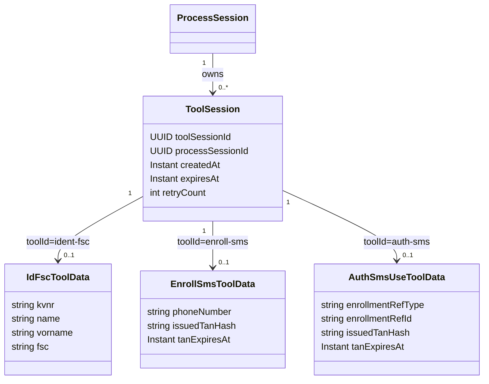
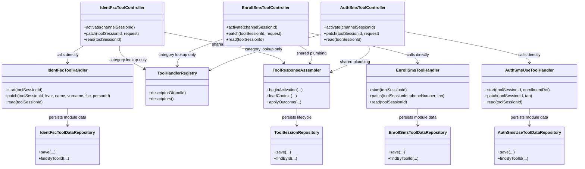

# Tool-Architektur

Ein *Tool* ist ein konkretes Verfahren zur Identifikation, zum Enrollment oder zur Authentifizierung
(`ident-fsc`, `enroll-sms`, `auth-sms`). Dieses Dokument beschreibt, wie Tools modelliert sind, wie sie
sich selbst beschreiben und was sie über die Modulgrenze hinweg melden.

Was der Orchestrator mit diesen Meldungen macht, steht in [04-orchestrierung.md](04-orchestrierung.md).

---

## 1) Entitätsmodell und Tool-Katalog



- `ToolSession` ist die dritte und kurzlebigste Session-Ebene (`ChannelSession` -> `ProcessSession` -> `ToolSession`) und steht für genau einen Durchlauf eines Tools. Sie ist eine einzige konkrete Klasse ohne Kind-Subtypen und enthält nur technische Identitäts- und Lifecycle-Metadaten.
- `toolId` (z. B. `ident-fsc`, `enroll-sms`, `auth-sms`) identifiziert Kind und Methode zusammen in einem flachen Bezeichner. Er ist kein persistiertes Feld, sondern ergibt sich aus der anlegenden/lesenden Route und wählt darüber direkt Handler und `*ToolData`-Klasse (Abschnitt 2).

Tool-Katalog — **keine zentral gepflegte Tabelle**, sondern die Aggregation der Selbstauskünfte aller Module (`ToolDescriptor`, Abschnitt 2). Aktueller Stand:

| toolId | Kategorie | method | factorTypes | maxAcr | Modul |
|---|---|---|---|---|---|
| `ident-fsc` | Identifikation | `fsc` | `{possession}` | `loa2` | `id_fsc` |
| `enroll-sms` | Enrollment | `sms` | `{possession}` | `loa2` | `auth_sms` |
| `auth-sms` | Authentifizierung | `sms` | `{possession}` | `loa2` | `auth_sms` |
| `auth-passkey` (Beispiel) | Authentifizierung | `passkey` | `{possession, inherence}` | `loa3` | `auth_passkey` |

- Jedes Modul liefert diese Angaben selbst. Es weiß am besten, welche Faktorart es abdeckt und welches Niveau sein Verfahren maximal tragen kann — dieselbe Begründung, aus der bereits `amr` und `achievedAcr` aus dem Modul kommen (Tool-Architektur). Ein neues Modul bringt seine Beschreibung mit; niemand muss eine zentrale Liste nachpflegen und dabei etwas vergessen.
- `method` wird **nicht** aus dem `toolId` geparst. Der Name ist ein Bezeichner, kein strukturiertes Datum — ein künftiges `auth-push-tan` würde bei naivem Zerlegen falsch aufgelöst.
- `method` trägt echte Information: `enroll-sms` und `auth-sms` melden dieselbe `method` (`sms`). Genau darüber findet ein Auth-Tool die passende Zeile in `account.authenticationMethods`, die das zugehörige Enroll-Tool angelegt hat.
- `factorTypes` (`knowledge`, `possession`, `inherence`) ist die Grundlage für Mehr-Faktor-Prüfungen ([Orchestrierung](04-orchestrierung.md)). MFA bedeutet zwei **verschiedene** Faktorarten, nicht zwei Methoden — ohne diese Angabe könnten zwei Wissensfaktoren fälschlich als MFA durchgehen. Die Angabe gehört zur Methode: Enroll- und Auth-Tool derselben `method` melden dieselben Faktorarten.
- Es ist eine Menge, weil ein einzelnes Verfahren mehrere Faktoren gleichzeitig erbringen kann (Zeile `auth-passkey`): Der Authenticator ist Besitz, die User Verification darauf Inhärenz oder Wissen. Solche Tools erfüllen MFA im Alleingang.
- Zentral bleibt nur, was ein einzelnes Modul nicht wissen *kann*: welches Niveau sich aus einer **Kombination** von Nachweisen ergibt und welches Niveau eine Ressource fordert. Das ist Sache der `AuthPolicy` ([Orchestrierung](04-orchestrierung.md)).

- `ToolState` (`INPUT_REQUIRED`, `VERIFIED`, ...) wird nicht auf der Tool-Entität gespeichert, sondern vom konkreten Handler aus dem methodenspezifischen Zustand ermittelt. Dasselbe gilt für `stepData`: Es ist kein persistiertes Feld, sondern wird bei jeder Antwort neu aus den Moduldaten aufgebaut.
- Routing-Information (`next.type`, `next.toolId`/`next.context`, `next.step`) gehört zur `ProcessSession`, nicht zum Tool.
- Methodenbezogene Tool-Daten liegen in den jeweiligen Modulen: `IdFscToolData` im Modul `id_fsc`, `EnrollSmsToolData`/`AuthSmsUseToolData` im Modul `auth_sms`.
- Die Tool-Entität bildet direkt das API-Muster `POST` (anlegen), `PATCH` (anreichern/verifizieren), `GET` (lesen) ab.
- Für `auth-sms` wird kein fester `smsEnrollmentId` als Core-Feld angenommen; stattdessen verwendet das Modell eine generische Enrollment-Referenz (`enrollmentRefType`, `enrollmentRefId`), die fachlich auf einen Enrollment-Datensatz im jeweiligen Modul zeigt (bei SMS auf `auth_sms`).
- Strikte Regel für dieses Zielbild: Der Orchestrator persistiert weder `toolId` noch fachliche Ergebnisdetails als eigenes Datenfeld; diese liegen ausschließlich in den Methodenmodulen bzw. ergeben sich aus der Route.

---

## 2) Modulklassen und Verträge



- **Ein Controller je Tool**, nicht ein generischer Dispatcher: `IdentFscToolController`, `EnrollSmsToolController`, `AuthSmsToolController` besitzen je Aktivierung (`POST .../tool-activate/{toolId}`), `PATCH` und `GET` für genau ihr Tool, mit eigenen typisierten Request-DTOs (`IdentFscPatchRequest`, `EnrollSmsPatchRequest`, `AuthSmsPatchRequest`) und rufen ihren Handler direkt auf ([Projektrahmen](08-projektrahmen.md) A11: „Lesbarkeit hat Vorrang vor maximal generischem API-Wiring"). Es gibt keinen `toolId`-basierten Laufzeit-Dispatch auf einen Handler mehr.
- `ToolHandlerRegistry` (Orchestrator-Modul) sammelt beim Start alle `ToolHandler`-Beans ein und aggregiert daraus ausschließlich den Tool-Katalog (`descriptorOf`/`descriptors()`) — keine Handler-Auflösung mehr, da nichts mehr generisch dispatcht.
- `ToolResponseAssembler` (Orchestrator-Modul) bündelt die Plumbing, die für jedes Tool identisch und sicherheitsrelevant ist: Binding-Prüfung, Aktivierungs-Validierung gegen den aktuellen Prozesszustand, Anlegen der `ToolSession`, Retry-Zählung, Persistieren von `next`. Das bleibt zentral, weil eine Abweichung zwischen Tools hier ein Sicherheits-/Konsistenzproblem wäre, nicht weil hier Fachlogik steckt.
- `ToolHandler` (Modul `tool_spi`) ist auf `descriptor: ToolDescriptor` verschlankt. `start(toolSessionId, ...)` ist auf den Handler-Klassen selbst deklariert und wird vom jeweiligen Controller direkt aufgerufen — typisiert statt über eine generische `Map<String, Any?>`, z. B. `AuthSmsUseToolHandler.start(toolSessionId, enrollmentRef: EnrollmentRef)`. Referenzen, die der Orchestrator für ein Tool auflöst (z. B. die `EnrollmentRef` für `auth-sms`), werden am Aufrufort im Controller aufgelöst und geprüft; der Handler bekommt nie einen nullable Parameter, sondern entweder einen gültigen Wert oder der Aufruf wird vorher mit `UnresolvableReferenceException` abgebrochen.
- Modul `id_fsc`: `IdentFscToolHandler` plus `IdentFscToolDataRepository`.
- Modul `auth_sms`: `EnrollSmsToolHandler`/`AuthSmsUseToolHandler` plus zugehörige Repositories.
- Damit sind im Bild sowohl der zentrale Lifecycle als auch die eigentlichen Fachklassen in den Modulen sichtbar.

Jeder Handler beschreibt sich zusätzlich selbst. Der Orchestrator sammelt diese Descriptors beim Start ein — daraus entsteht der Tool-Katalog aus Abschnitt 1, ohne dass irgendwo eine Liste gepflegt werden müsste:

```kotlin
interface ToolDescriptor {
    val toolId: String                     // "auth-sms"
    val category: ToolCategory             // IDENT | ENROLL | AUTH
    val method: String                     // "sms" — verbindet enroll-sms und auth-sms
    val factorTypes: Set<FactorType>       // Faktorarten, die das Verfahren abdecken kann
    val maxAcr: String                     // höchstes Niveau, das dieses Verfahren tragen kann
}
```

- `maxAcr` und `factorTypes` sind statisch und dienen der Vorauswahl: Die `AuthPolicy` muss entscheiden können, ob ein Tool eine offene Lücke überhaupt schließen *könnte*, bevor sie es dem Nutzer anbietet. Was der konkrete Durchlauf tatsächlich erbracht hat, meldet `Completed` (`achievedAcr`, `factorTypes`) — nie mehr, als der Descriptor zulässt.
- `factorTypes` ist bewusst eine **Menge**: Manche Verfahren erbringen in einem einzigen Durchlauf mehrere Faktoren. Ein Passkey mit User Verification vereint Besitz (Authenticator) und Inhärenz oder Wissen (Biometrie/PIN); eine Smartcard mit PIN vereint Besitz und Wissen. Solche Tools sind für sich genommen bereits Mehr-Faktor ([Orchestrierung](04-orchestrierung.md)).
- Der Orchestrator interpretiert diese Werte nur; er legt sie nicht fest.

`start(...)`/`patch(...)` liefern bei jedem Handler denselben Vertrag zurück, auch wenn ihre Parameter je Tool typisiert und unterschiedlich sind:

```kotlin
sealed interface ToolOutcome {

    /** Tool läuft weiter; `data` ist client-gerichtet und wird als `stepData` durchgereicht. */
    data class InProgress(
        val nextStep: String,
        val data: Map<String, Any?>? = null
    ) : ToolOutcome

    /** Versuch fehlgeschlagen; Retry-Regel siehe 04-orchestrierung.md. */
    data class Failed(val reason: String) : ToolOutcome

    /**
     * Tool abgeschlossen. Die Variante entspricht der Kategorie aus dem Tool-Katalog
     * und legt fest, was der Orchestrator damit tut.
     */
    sealed interface Completed : ToolOutcome {
        /** Vom Tool nachgewiesene Methoden für `AuthContext.currentAmr` (ein Durchlauf kann mehrere liefern). */
        val amr: List<String>
        /** Erreichtes Sicherheitsniveau, falls das Tool es selbst bestimmen kann. */
        val achievedAcr: String?
        /** Faktorarten, die dieser Durchlauf tatsächlich erbracht hat; Teilmenge von `ToolDescriptor.factorTypes`. */
        val factorTypes: Set<FactorType>

        data class Identified(
            val personId: Long,
            override val amr: List<String> = emptyList(),
            override val achievedAcr: String? = null,
            override val factorTypes: Set<FactorType> = emptySet(),
            /** Methodenspezifischer Prüfnachweis; wandert unverändert nach `account.identifications[].details`. */
            val auditDetails: Map<String, Any?>? = null
        ) : Completed

        data class Enrolled(
            val enrollmentRef: EnrollmentRef,
            override val amr: List<String> = emptyList(),
            override val achievedAcr: String? = null,
            override val factorTypes: Set<FactorType> = emptySet(),
            /** Methodenspezifischer Zustellnachweis; wandert nach `authenticationMethods[].details`. */
            val auditDetails: Map<String, Any?>? = null
        ) : Completed

        data class Authenticated(
            override val amr: List<String>,
            override val achievedAcr: String? = null,
            override val factorTypes: Set<FactorType> = emptySet()
        ) : Completed
    }
}
```

- `ToolOutcome` ist der Orchestrator-weite Vertrag an der Modulgrenze. Entscheidend ist, **an wen** der Inhalt jeweils gerichtet ist:
  - `InProgress.data` ist **client-gerichtet**: der tool-interne Zustand, den der Nutzer sehen muss (z. B. `missingFields`, maskierte Telefonnummer, TAN-Gültigkeit). Der Orchestrator reicht ihn unverändert als `stepData` in den API-Response durch ([API](05-api.md)).
  - `Completed` ist **orchestrator-gerichtet** und typisiert statt als freie Map: Die Variante *ist* die Kategorie des Tools und legt damit fest, was der Orchestrator zu tun hat (siehe [Orchestrierung](04-orchestrierung.md)). Ein Erfolgs-Bool wäre redundant, weil `Completed` den Erfolg schon durch seinen Typ ausdrückt.
  - `Failed` trägt nur `reason` — eine Fehlermeldung transportiert keinen tool-internen Zustand.
- `amr`/`achievedAcr` liefert jedes Tool selbst, weil dasselbe Verfahren je nach Ausführung unterschiedliche Niveaus erreichen kann (z. B. eID mit oder ohne PIN). Auch Identifikation und Enrollment dürfen einen Nachweis beitragen — im Beispiel führt `ident-fsc` + `enroll-sms` zu `currentAmr: ["fsc", "sms"]`. Wie sich daraus ein Gesamt-`acr` ergibt, ist Policy und bleibt der offene Punkt im [Umsetzungsstatus](README.md#umsetzungsstatus).
- Das `stepData` einer Abschluss- oder Auswahlantwort stammt **nicht** vom Handler, sondern baut der Orchestrator selbst (z. B. `options` mit den erlaubten Folge-Tools, siehe [Orchestrierung](04-orchestrierung.md)).
- `Completed`/`Failed` verlassen das Tool und werden ausschließlich vom Orchestrator interpretiert (siehe [Orchestrierung](04-orchestrierung.md)).
- Das ist bewusst getrennt vom tool-internen `FlowOutcome` (Abschnitt 3 dieses Dokuments): `FlowOutcome` steuert nur den State-Effects-Flow *innerhalb* eines Moduls (z. B. wie `auth_sms` intern von "Telefonnummer erwartet" zu "TAN erwartet" kommt); `ToolOutcome` ist das, was ein Handler daraus baut und über die Modulgrenze hinweg an den Orchestrator meldet.

---

## 3) Modulinterne Flow-Architektur: State + Effects

Dieser Abschnitt beschreibt ausschließlich, wie ein Methodenmodul **intern** aufgebaut sein kann. Was über die Modulgrenze geht (`ToolOutcome`), steht in Abschnitt 2; wie daraus der nächste Prozessschritt wird, in [04-orchestrierung.md](04-orchestrierung.md) — nicht hier.

### Grundprinzip

- **Flow**: kennt nur seinen eigenen Zustand und entscheidet über den nächsten internen Schritt sowie auszuführende Effekte.
- **Modulgrenze**: nach außen sichtbar ist nur ein neutrales Ergebnis, nie der interne `State`.

### Neutraler Vertrag (Flow → Handler)

```kotlin
sealed interface FlowOutcome {
    data class InProgress(val missingFields: List<String> = emptyList()) : FlowOutcome
    data object Completed : FlowOutcome
    data class Failed(val reason: String) : FlowOutcome
}
```

Der Flow liefert immer genau eines dieser drei Ergebnisse; der Handler des Moduls wertet es aus und baut daraus sein `ToolOutcome` (Tool-Architektur). Nur `ToolOutcome` verlässt das Modul — `FlowOutcome` und `State` bleiben intern.

### Flow-Struktur (Beispiel: SMS-Enrollment)

```kotlin
class SmsEnrollFlow {

    sealed interface State
    data object AwaitingPhone : State
    data class AwaitingTan(val phoneNumber: String) : State
    data class Verified(val ref: EnrollmentRef) : State

    data class Input(val phoneNumber: String?, val tan: String?)

    sealed interface Effect
    /** TAN erzeugen, gehasht mit Ablaufzeit ablegen, SMS versenden. */
    data class SendTan(val phoneNumber: String) : Effect
    /** Erst nach bestätigter TAN: Enrollment-Datensatz anlegen, liefert die EnrollmentRef. */
    data class CreateEnrollment(val phoneNumber: String) : Effect

    data class Decision(
        val nextState: State,
        val effects: List<Effect> = emptyList(),
        val outcome: FlowOutcome = FlowOutcome.InProgress()
    )

    fun decide(state: State, input: Input): Decision = when (state) {
        AwaitingPhone -> {
            if (input.phoneNumber.isNullOrBlank())
                Decision(nextState = state, outcome = FlowOutcome.InProgress(listOf("phoneNumber")))
            else
                Decision(
                    nextState = AwaitingTan(input.phoneNumber),
                    effects = listOf(SendTan(input.phoneNumber))
                )
        }
        is AwaitingTan -> {
            if (input.tan.isNullOrBlank())
                Decision(nextState = state, outcome = FlowOutcome.InProgress(listOf("tan")))
            else
                Decision(
                    nextState = state,
                    effects = listOf(CreateEnrollment(state.phoneNumber)),
                    outcome = FlowOutcome.Completed
                )
        }
        is Verified -> Decision(nextState = state, outcome = FlowOutcome.Completed)
    }
}
```

### Eigenschaften dieses Musters

- Der `State` ist modulintern und wird nie nach außen sichtbar; die Modulgrenze kennt nur `FlowOutcome` -> `ToolOutcome`.
- Seiteneffekte entstehen ausschließlich im Modul (TAN erzeugen/senden/prüfen). Alles, was Account- oder Prozessbezug hat, macht der Orchestrator bei der Verarbeitung von `Completed` ([Orchestrierung](04-orchestrierung.md)) — deshalb taucht hier kein „Methode aktivieren"-Effect auf.
- Flows lassen sich austauschen oder ergänzen, ohne die Prozess-Ebene zu ändern, weil diese nur `ToolOutcome` sieht.
