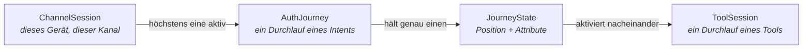
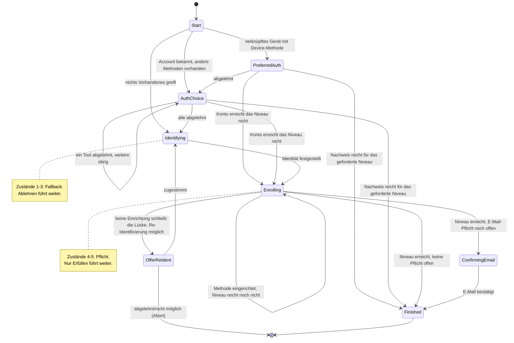
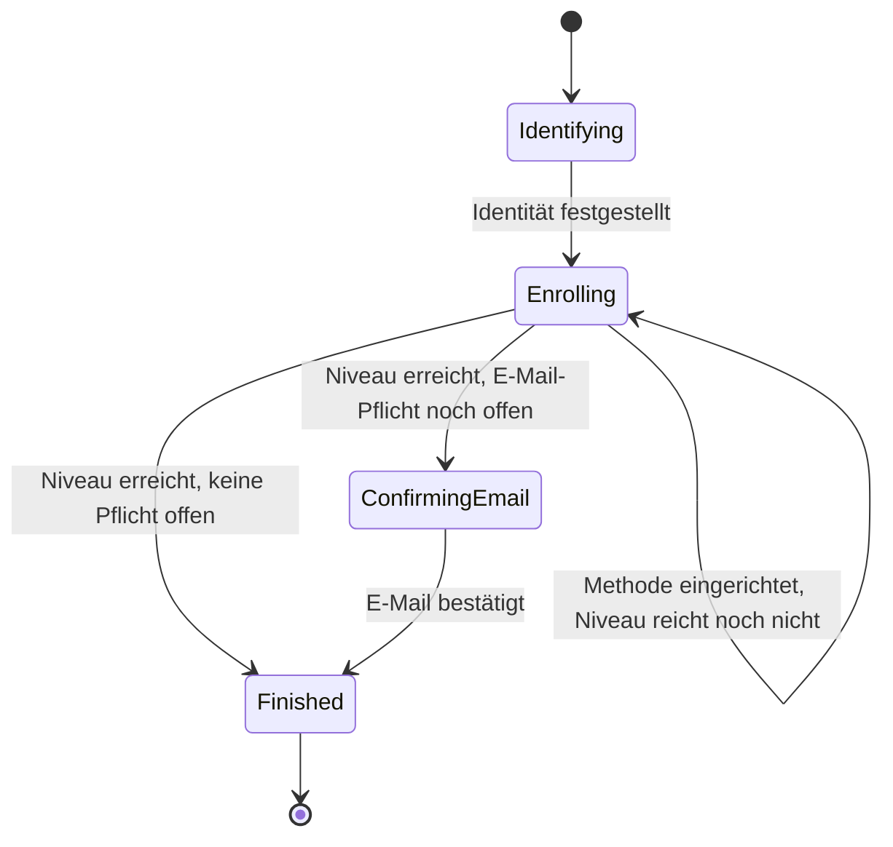
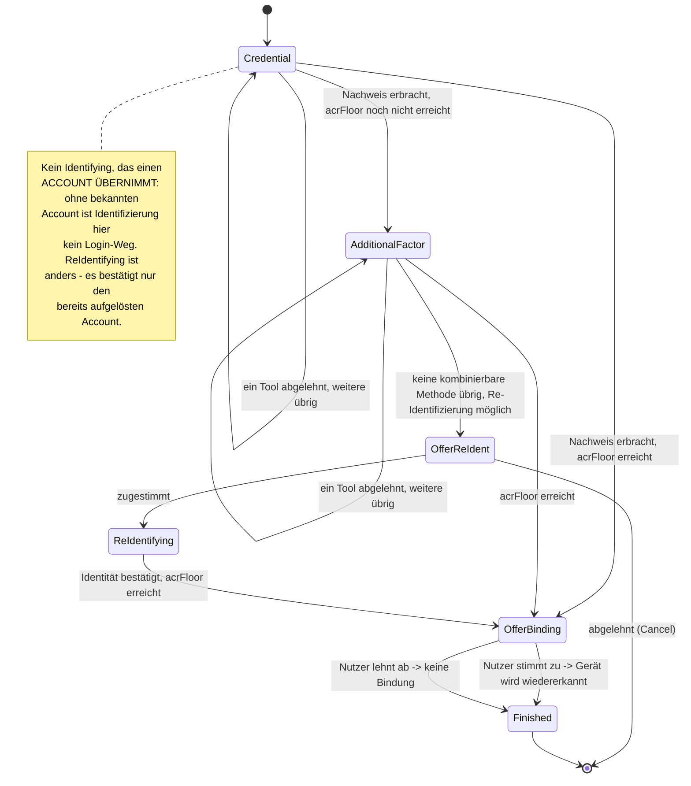
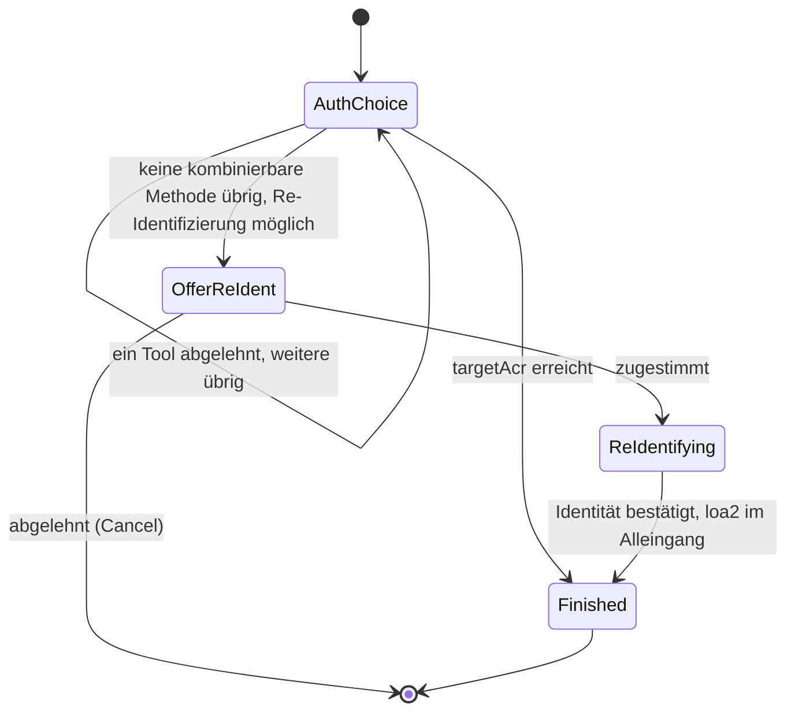
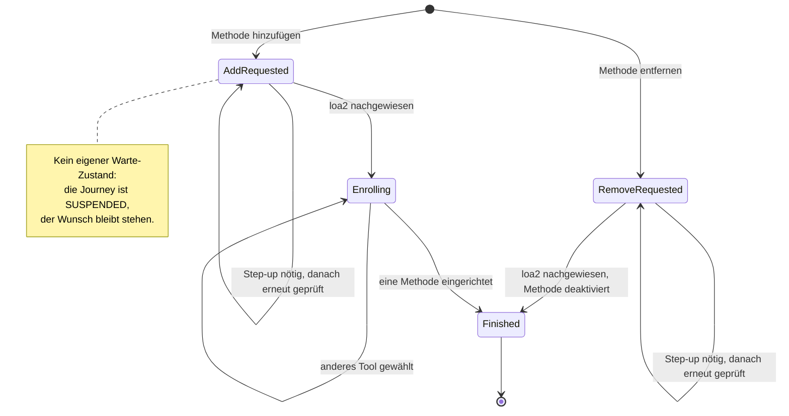
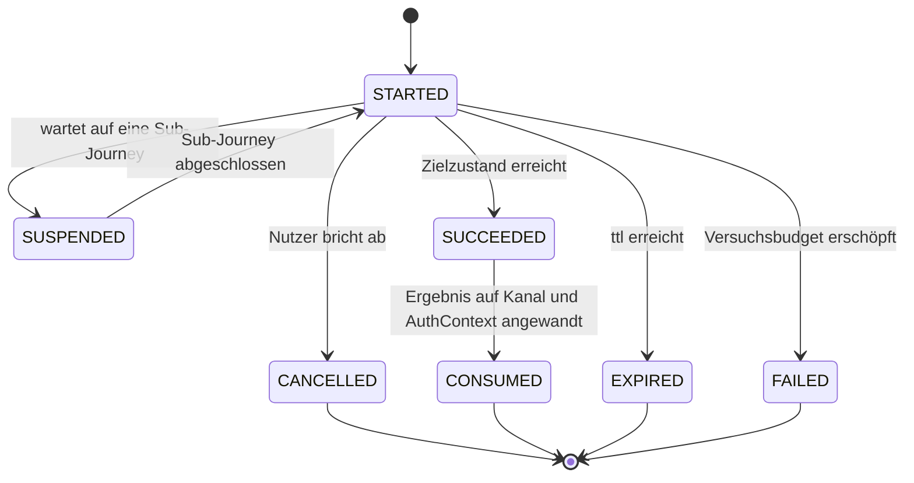

# Orchestrierung und Policy

Wie ein Nutzer zu seinem Ziel geführt wird — und wer entscheidet, welches Tool wann
angeboten wird.

Vorausgesetzt wird der `ToolOutcome`-Vertrag aus [03-tool-architektur.md](03-tool-architektur.md).

---

## 1) Begriffe

Sieben Wörter haben in diesem Kapitel eine feste Bedeutung:

| Begriff | Bedeutung | Im Code |
|---|---|---|
| **Intent** | Ziel des Nutzers samt Strategie, die ihn dorthin führt | `AuthIntent` |
| **Journey** | ein laufender Durchlauf eines Intents | `AuthJourney` |
| **Zustand** | Position auf dem Weg, samt der dort geltenden Attribute | `JourneyState` |
| **Tool** | ein einzelner Ablauf, den der Nutzer durchläuft | `toolId` |
| **Methode** | was am Konto eingerichtet ist und einen Login ermöglicht | `method` |
| **Schritt** | ein Schritt *innerhalb* eines Tools | `next.step` |
| **Niveau** | Vertrauensniveau (`loa1`/`loa2`/`loa3`) | `acr` |

**Intent**, **Journey**, **Zustand** und **Tool** tragen das Kapitel und werden unten ausgeführt;
sie bauen aufeinander auf, daher diese Reihenfolge. **Methode**, **Schritt** und **Niveau** stehen
hier nur, damit sie nicht mit ihnen verwechselt werden.

**Tool** und **Methode** ebenso: `enroll-sms` und `auth-sms` sind zwei Tools für *eine* Methode
(`sms`). Ein Konto hat Methoden; angeboten und aktiviert werden Tools. Das Wort „Verfahren" kommt
für beides nicht mehr vor.

Drei weitere Wörter sehen ähnlich aus, meinen aber verschiedene Dinge und stehen bewusst
nebeneinander: **Kandidaten** liefert der Katalog beziehungsweise die Policy; daraus wird das
**Angebot**, das ein Zustand hält (`activatable()` — Kandidaten minus bereits Abgelehntes minus
aktuell nicht Verfügbares, [Tool-Architektur](03-tool-architektur.md) Verfügbarkeit); und
eine **Auswahlseite** zeigt der Client nur, wenn das Angebot mehr als einen Eintrag hat. Bleibt
davon nichts übrig, greift derselbe Fallback wie beim vollständigen Ablehnen aller Kandidaten
(Rückfall auf Identifikation bzw. `exhausted`/Cancel) — kein eigener Fehlerzustand für
Nichtverfügbarkeit.

Bewusst **kein** eigenes Wort für „Zustand als Position in einer Reihenfolge": Das ist derselbe
Zustand, nur unter einer anderen Frage betrachtet, und ein zweiter Begriff dafür hätte im Modell
keine Entsprechung. Wo die Reihenfolge gemeint ist, sagt der Text es als Eigenschaft des Zustands
(*Fallback-Zustand*, *Pflichtzustand*) oder benennt gleich die Kette.

### Intent

Ein **Intent** ist das Ziel des Nutzers *zusammen mit* der Strategie, nach der er dorthin geführt
wird. Beides gehört untrennbar zusammen: „bring mich rein" und „biete zuerst das Gerät an, dann
andere Auth-Tools, notfalls eine Identifizierung" sind nicht zwei Entscheidungen, sondern eine.

Der Intent ist damit die Antwort auf drei Fragen, die sich je Ziel unterschiedlich beantworten:

- Welche Tools dürfen hier überhaupt angeboten werden — und in welcher Reihenfolge?
- Was bedeutet ein abgeschlossenes Tool in diesem Kontext? Derselbe erfolgreiche `ident-fsc`
  heißt an einer Stelle „lege einen Account an" und an anderer „bestätige den bekannten Account".
- Wann ist das Ziel erreicht?

Ein Intent ist ausdrücklich **keine** Beschreibung dessen, was am Ende herauskam. Ob ein
Durchlauf rückblickend eine Registrierung oder ein Login war, ist eine Beobachtung über den
gelaufenen Weg — kein Ziel, das man vorab wählt.

### Journey

Eine **`AuthJourney`** ist ein laufender Durchlauf eines Intents: ein geführter Weg mit einem
Ziel. Sie gehört zu genau einer `ChannelSession` und lebt kürzer als diese; pro Kanal ist
immer höchstens eine Journey aktiv.

Die Journey hält, was den ganzen Weg über gilt (Intent, Account, Budget, Lebenszyklus). Wo auf
dem Weg der Nutzer gerade steht, hält sie **nicht** selbst — das ist der `JourneyState`.

Intent und Journey verhalten sich zueinander wie `ToolDescriptor` und `ToolSession`: der eine
benennt die *Art*, der andere ist *ein Durchlauf* davon. Der Unterschied ist nicht akademisch —
den Intent gibt es, bevor eine Journey existiert (der Client nennt ihn beim Anlegen des Kanals,
und der Kanal merkt ihn sich), unzählige Journeys teilen sich denselben Intent, und ein Kanal kann
nacheinander mehrere Journeys desselben Intents durchlaufen. Umgekehrt trägt nur die Journey
Identität, Lebensdauer, Account, Budget und Zustand; der Intent ist ein Wert ohne all das.

### Zustand (`JourneyState`)

Der **`JourneyState`** ist die Position auf dem Weg — und trägt die Attribute, die genau an dieser
Position gelten. Zwei Beispiele, die den Unterschied zu einem bloßen Statuswort zeigen: Der
Zustand „Nutzer wählt unter mehreren Auth-Tools" trägt, *welche* angeboten wurden und
*welche* er bereits verworfen hat. Der Zustand „ein Tool läuft gerade" trägt, *welche*
`ToolSession` dafür autorisiert ist.

Jeder Intent hat seine eigene, versiegelte Zustandsmenge — die Zustände von `MANAGE_AUTH_METHODS` ergeben für
`LOOKUP_LOGIN` keinen Sinn und sind dort nicht formulierbar. Ein vergessener Zustand ist damit
ein Compile-Fehler, kein plausibel aussehender Laufzeit-Default.

Der `JourneyState` ist außerdem die einzige Quelle für zwei Fragen, die sonst leicht auseinander
laufen: „welches Tool darf der Client jetzt aktivieren?" und „wohin schicke ich ihn als
nächstes?". Beide beantwortet dieselbe Funktion (Abschnitt 4).

#### Zwei Sorten von Übergang

Einen erfolgreichen Nachweis behandeln alle Zustände gleich: Er bringt die Journey weiter. Sie
unterscheiden sich darin, was **Ablehnen** bewirkt:

- In einem **Fallback-Zustand** führt Ablehnen weiter — zum nächsten, aufwendigeren Weg. Mehrere
  davon hintereinander bilden eine **Fallback-Kette**, geordnet vom bequemsten zum aufwendigsten
  Weg; so ist `FAST_ACCESS` gebaut. Ist nichts Aufwendigeres mehr da, endet die Journey.
- In einem **Pflichtzustand** führt Ablehnen nirgendwohin. Die Pflicht bleibt bestehen, das
  volle Angebot kommt zurück — auch das gerade verworfene Tool. Nur Erfüllen bringt weiter.

Beide kommen in derselben Zustandsmenge vor (etwa in `FAST_ACCESS`), und welche Sorte ein Zustand ist,
gehört sichtbar in den Code, nicht in einen Kommentar.

### Tool

Ein **Tool** ist ein einzelner Ablauf (`ident-fsc`, `enroll-sms`, `auth-device`, …), den der
Nutzer durchläuft. Ein Tool weiß nichts über Journeys, Intents oder Reihenfolgen — es meldet nur
sein Ergebnis als `ToolOutcome` ([Tool-Architektur](03-tool-architektur.md)). Was dieses Ergebnis
bedeutet, entscheidet der Intent.

### Die Session-Ebenen im Zusammenhang

---

## 2) Die fünf Intents

| `AuthIntent` | Ziel | Einstieg |
|---|---|---|
| `FAST_ACCESS` | So schnell wie möglich in einen Login auf diesem Gerät — und so, dass es künftig wieder klappt | `POST /channels` (Default) |
| `REGISTER` | Bewusst frische Identifizierung, auch auf einem bereits verknüpften Gerät | `POST /channels` mit `intent=register` |
| `LOOKUP_LOGIN` | Bestehenden Account ohne Gerätebindung anmelden (klassischer Web-Login) | `POST /channels` mit `intent=lookup_login` |
| `STEP_UP` | Niveau anheben | nur auf einem `AUTHENTICATED`-Kanal |
| `MANAGE_AUTH_METHODS` | Methoden hinzufügen oder entfernen | nur auf einem `AUTHENTICATED`-Kanal |

Registrierung ist **kein eigener Intent**, sondern ein Weg innerhalb von `FAST_ACCESS`: das Ende der
Fallback-Kette, wenn keine vorhandene Methode mehr greift. Ob dabei ein Account entsteht oder
ein bestehender wiedergefunden wird, entscheidet `findOrCreateAccount` im Nachhinein.

`REGISTER` ist trotzdem ein eigener Intent, weil „ich will hier bewusst neu identifizieren" ein
anderes Nutzerziel ist als „bring mich rein": es unterdrückt den `DeviceAccountLink`-Lookup und
bietet nie eine bestehende Kontobindung an. Es erzwingt aber **keinen** zweiten Account —
dieselbe KVNR findet weiterhin denselben Account wieder.

Der gewählte Intent wird auf der `ChannelSession` gemerkt. Das ist kein Detail: Resume und Abbruch
starten denselben Intent erneut, weshalb ein abgebrochener Lookup-Login wieder ein Lookup-Login
wird und nicht stillschweigend zur Registrierung umschlägt.

---

## 3) Die Journeys im Einzelnen

Gemeinsam für alle Diagramme: Ein Pfeil ist ein Übergang, ausgelöst durch ein `JourneyEvent`
(Tool abgeschlossen, Tool abgebrochen, Kind-Journey fertig). `abgelehnt` steht für „gescheitert
oder vom Nutzer verworfen, und in diesem Zustand ist nichts mehr übrig".

Terminale Zustände (`Finished`) sind eingezeichnet, existieren aber bewusst **nicht** als
persistierter Zustand: Das Ende einer Journey ist die Entscheidung `Decision.Finish`, die sie
abschließt. Ein zusätzlicher Endzustand wäre eine zweite Darstellung derselben Tatsache.

### `FAST_ACCESS`

Erst die Fallback-Kette vom bequemsten zum aufwendigsten Weg, danach die Pflichtzustände, die
dafür sorgen, dass der nächste Login wieder klappt.

`PreferredAuth` trägt genau die eine vorgeschlagene `toolId`; `AuthChoice`/`Identifying`/
`ConfirmingEmail`/`Enrolling` tragen jeweils, was angeboten wurde und was bereits abgelehnt ist
(Fallback- bzw. Pflichtsemantik, s. o.). `Enrolling` trägt zusätzlich `emailObligation`: ein Merker,
dass dieser Lauf über `Identifying` kam (Account neu angelegt oder übernommen) — nur dann gilt die
E-Mail-Pflicht danach (Abschnitt 8).

`OfferReIdent` ist der Ausweg, falls selbst keine Einrichtung die Lücke schließt (z. B. kein
`enroll-*`-Tool mehr verfügbar): dasselbe generische Ja/Nein wie bei `STEP_UP` (Abschnitt „STEP_UP"),
nie ein stiller Rückfall. Bei Zustimmung läuft es in ein gewöhnliches `Identifying` — `Identified`
interpretiert `FAST_ACCESS` ohnehin immer als „finde oder übernimm den Account" (`AdoptIdentity`),
unabhängig davon, welcher Zustand dorthin führte.

`Identifying` ist gleichzeitig Login-Notausgang und Registrierungseinstieg. Eine
`REGISTRATION`/`LOGIN`-Trennung gibt es nicht, weil sie im Zustandsmodell keinen eigenen Zustand
hätte: Welches von beidem es war, entscheidet erst `findOrCreateAccount` danach. Genau deshalb
darf eine leere Kandidatenliste hier auch nicht abbrechen — „keine Methode vorhanden" ist
der Grund, aus dem `Identifying` als Login-Weg überhaupt erlaubt wird.

In einem Fallback-Zustand sammelt `declined` die verworfenen Tools, bis nichts mehr übrig ist
und der nächste dran ist. In einem Pflichtzustand passiert das **nicht**: Wer dort
zurückgeht, wählt anders, gibt aber die Pflicht nicht auf — deshalb kommt das volle Angebot
zurück, das gerade verworfene Tool eingeschlossen.

### `REGISTER`

Dieselben Zustände wie `FAST_ACCESS` ab `Identifying`, nur mit direktem Einstieg dort und unterdrücktem
`DeviceAccountLink`-Lookup. Weil es wörtlich dieselben sind, teilt sich `REGISTER` auch
die Zustandsmenge von `FAST_ACCESS`; die Strategie überschreibt nur, wo die Fallback-Kette einsetzt.

### `LOOKUP_LOGIN`

Anmelden ohne gepaartes Gerät: Der Nutzer nennt einen Identifikator (E-Mail) und weist ein
seiner Methoden nach. Angeboten wird der abgeleitete Satz aller `MethodRole.LOOKUP_AUTH`-Tools — nicht
`AuthPolicy.candidateTools`, das einen bereits aufgelösten Account bräuchte, den es hier noch
nicht geben kann.

`OfferBinding` fragt ausdrücklich und optional: „Dieses Gerät für künftige Logins wiedererkennen?" —
und erfüllt zusätzlich das generische `AnswerableState`-Markerinterface (Abschnitt 5), damit die
Maschinerie diesen Zustand erkennt, ohne den konkreten Typ `LookupLoginState.OfferBinding` selbst
zu kennen.

Die Gerätewiedererkennung (`DeviceAccountLink`) entsteht hier **nur** nach Zustimmung. Sie ist
eine dauerhafte Zuordnung Gerät → Account und darf nicht als Nebenwirkung eines Logins entstehen,
den der Nutzer gerade deshalb gewählt hat, weil er ohne Gerätebindung auskommen wollte.

`AdditionalFactor` erzwingt die eigene `acrFloor` des Kanals (Abschnitt 8) — ohne sie würde ein mit
`requiredAcr: loa3` eröffneter Kanal auf einem einzigen `loa1`-Faktor authentifiziert. Bleibt danach
keine kombinierbare Methode übrig, fragt `OfferReIdent` (dasselbe generische Ja/Nein wie bei
`STEP_UP`) vor `ReIdentifying`, nie ein stiller Rückfall. `ReIdentifying` bestätigt dabei **nur**
den bereits aufgelösten Account — `LookupLoginStrategy.interpret` liefert dafür `ConfirmIdentity`,
niemals `AdoptIdentity`: Eine Session, die gerade erst `loa1` bewiesen hat, darf keine fremde
Identität einschleusen. Anders als bei `enroll-*` wächst hier **keine** dauerhafte Credential auf
einem ungeprüften Gerät — Re-Identifizierung bleibt deshalb erlaubt, obwohl dieser Intent
bewusst **keinen** Enrollment-Fallback hat.

**Enumeration-Schutz**: Eine unbekannte E-Mail liefert exakt dieselbe Antwortform wie ein korrekt
aufgelöster Account mit fehlgeschlagenem Nachweis — nie eine eigene Fehlerform, auch nicht im Timing
der Demo-Werte ([API](05-api.md)). Bewusst nicht weiter gehärtet (kein künstliches
Timing-Padding); in einem Produktivsystem wäre das der nächste Ausbau.

### `STEP_UP`

Jeder Zustand trägt `targetAcr` (das Ziel dieses Laufs, nicht zu verwechseln mit der dauerhaften
Untergrenze des Kanals, Abschnitt 8) und `startingAcr`; `AuthChoice`/`ReIdentifying` zusätzlich
Angebot und Ablehnungen wie oben.

`ReIdentifying` ist der Ausweg aus dem **Ein-Methoden-Fall**: Ein Account mit genau einer
aktiven Methode hätte nach einem frischen gerätegebundenen Login (nur `loa1`) sonst keinen
Weg zu `loa2` — es gibt keine zweite Methode zum Kombinieren. `ident-fsc`/`ident-eid` erreichen
`loa2`/`loa3` im Alleingang. Bewusst ein eigener Zustand und nicht Teil von `AuthChoice`:
Re-Identifizierung ist eine schwerere Aktion als ein weiteres Verfahren auszuwählen, also nie ein
stiller Rückfall — `OfferReIdent` fragt davor immer erst per generischem `AnswerableState`-Prompt
(„Erneut identifizieren?"), egal ob dieser Step-up eigenständig läuft oder als Vorbedingung eines
anderen Intents (Abschnitt 6). Bei Ablehnung endet der Step-up (`Decision.Cancel`) wie jede andere
abgebrochene Sub-Journey.
Die neu festgestellte Person muss zum angemeldeten Account passen (`409` bei Abweichung), sonst
könnte eine `loa1`-Session eine fremde Identität einschleusen.

### `MANAGE_AUTH_METHODS`

`AddRequested`/`RemoveRequested` (Letzterer trägt die `methodInstanceId`) sind zugleich der Wunsch
vor der loa2-Prüfung und der Parkzustand während eines dafür nötigen Step-ups; `Enrolling` trägt
wie gewohnt Angebot und Ablehnungen.

`MANAGE_AUTH_METHODS` ist der einzige Intent ohne Policy-Ziel: **ein** erfolgreiches Enrollment beendet ihn,
unabhängig vom erreichten Niveau — der Kanal war ja bereits `AUTHENTICATED`. Um ein zweites
Methode hinzuzufügen, startet man eine neue Journey.

Es gibt bewusst **keinen** eigenen „wartet auf Step-up"-Zustand: Die Journey bleibt schlicht in
`AddRequested`/`RemoveRequested` stehen, während die Kind-Journey läuft. Dass gewartet wird, sagen
bereits `JourneyLifecycle.SUSPENDED` und die `parentJourneyId` der Kind-Journey — eine zweite
Kopie derselben Information könnte nur auseinanderlaufen. Genau dieses Parken ist der Grund,
weshalb der Wunsch den Step-up überlebt: Nach dessen Abschluss wird derselbe Zustand erneut
ausgewertet, prüft die Vorbedingung neu und führt aus, was ursprünglich verlangt war.

Die `loa2`-Vorbedingung selbst folgt derselben Anti-Selbsteskalations-Logik wie die
`enrolledUnderAcr`-Deckelung (Abschnitt 8): Eine gekaperte `loa1`-Session darf nicht aus eigener
Kraft Methoden hinzufügen oder entfernen. Das Entfernen prüft zusätzlich, dass der Account
danach die Untergrenze des Kanals noch erreichen kann (`409`, Selbstsperrschutz).

### Lebenszyklus, unabhängig vom Intent

Die intent-eigenen Zustände beschreiben den Weg; `JourneyLifecycle` beschreibt, ob die Journey
überhaupt noch läuft.

---

## 4) `next` folgt aus dem Zustand

Alle Zustände erfüllen einen gemeinsamen Vertrag: Jeder weiß, welche `toolId`s hier aktivierbar
sind (leer für terminale und wartende Zustände), ob und welches Tool gerade läuft, und welche
orchestrator-eigene Seite (`next.context`/`next.step`) er anzeigt, falls keine Auswahl nötig ist.

Daraus folgt **eine** Ableitungstabelle:

| `active` | `activatable()` | `next` |
|---|---|---|
| gesetzt | — | `type="tool"`, Schritt der laufenden `ToolSession` |
| null | genau ein Eintrag | `type="tool"`, `startStep` des Descriptors |
| null | mehrere | `type="orchestrator"`, Auswahlseite |
| null | leer | `type="orchestrator"`, orchestrator-eigene Seite (Bestätigung, Abschluss) |

Die Prüfung „darf dieses Tool jetzt aktiviert werden?" ist dieselbe Funktion — Mitgliedschaft in
`activatable()`. Beide Fragen an einer Stelle beantwortet heißt: Sie können nicht auseinander
driften, und ein Zustand, der ein Tool nicht anbietet, kann es auch nicht versehentlich zulassen.

`next.type` ist `"tool"` oder `"orchestrator"`. Beide Werte beantworten dieselbe Frage: Wem
gehört der nächste Screen, und welchen Endpunkt ruft der Client als nächstes.

Bei genau einem Kandidaten entfällt die Auswahlseite — bei einer Wahl ist nichts zu wählen.

---

## 5) Die zwei Verträge: SPI und API

### `IntentStrategy` — der SPI

Symmetrisch zu `tool_spi`: dort beschreiben sich Tools selbst, hier beschreiben sich Intents
selbst. Jede Strategie beantwortet für ihren eigenen Zustandstyp vier Fragen — wo sie beginnt
(direkt, oder als Sub-Journey mit einem vorgegebenen Zielniveau statt dem des Kanals), was ein
abgeschlossenes Tool bedeutet, wie sie auf ein Ereignis reagiert, und wohin der Kanal bei Abbruch
zurückfällt.

Ein `JourneyEvent` ist, was der Journey gerade passiert ist:

| Event | Bedeutung |
|---|---|
| `Started` | Journey wurde eben angelegt, braucht ihr erstes Angebot |
| `Completed(tool, outcome)` | ein Tool wurde erfolgreich abgeschlossen |
| `Abandoned(tool)` | „Zurück"/„Wechseln": das aktivierte Tool wurde ohne Abschluss verworfen |
| `SubJourneyFinished(achievedAcr)` | eine als Vorbedingung gestartete Kind-Journey ist fertig |
| `Answered(answer)` | eine ausdrückliche Antwort auf einen `AnswerableState` statt eines Tool-Laufs — `answer` ist ein String, nicht `Boolean`: eine künftige Aktion kann mehr als zwei Antworten haben |

Eine `Decision` ist, was als Nächstes passieren soll:

| Decision | Bedeutung |
|---|---|
| `Advance(to)` | weiter zu diesem Zustand — der Zustand trägt sein Angebot bereits selbst, es gibt kein separates „biete diese Tools an" |
| `RequireSubJourney(intent, targetAcr, resumeWith)` | erst einen anderen Intent laufen lassen, danach hier bei `resumeWith` weiter |
| `Finish` | Ziel erreicht, Journey wird konsumiert |
| `Cancel` | Nutzer gibt auf — endet wie ein ausdrückliches Abbrechen, nicht als Fehler |
| `Remove(methodInstanceId)` | Effekt, der kein Tool-Lauf ist: Methode deaktivieren |
| `FinishWithDeviceLink(accountId)` | Effekt, der kein Tool-Lauf ist: Gerät verknüpfen, dann beenden |
| `Abort(reason)` | es geht gar nicht weiter (410) — nie bloß „keine Kandidaten mehr" |

Entscheidungen dahinter:

- **Ein Übergang statt vier.** „Erstes Angebot", „nach einem abgeschlossenen Tool", „nach einem
  Abbruch" und „Rückkehr aus einer Sub-Journey" beantworten alle dieselbe Frage. Sie sind ein
  `next` mit einem Event-Parameter.
- **Die Strategie liefert `Decision`, nicht `Next`.** Sonst baut jeder Intent die
  Skip-if-single-Candidate-Regel nach. Eine gemeinsame Maschinerie macht aus der `Decision` den
  neuen Zustand und daraus `next`.
- **Es gibt kein eigenes „biete diese Tools an".** Ein Zustand trägt sein Angebot bereits selbst
  (`activatable()`), also *ist* `Advance` auf diesen Zustand das Angebot. Eine zusätzliche
  `Offer`-Variante wäre dieselbe Information zweimal.
- **`Abort` ist eine Entscheidung der Strategie**, kein Automatismus der Kandidatenauflösung.
  Eine leere Kandidatenliste muss „nächster Zustand" bedeuten dürfen, sonst ist eine
  Fallback-Kette gar nicht formulierbar.
- **Die Strategie bekommt nie Services**, nur einen lesenden `JourneyContext` (Account, Evidence,
  Untergrenze, Gerätebezug, Katalogabfragen). Sie entscheidet, sie wirkt nicht.

Welche Tools für ein Angebot überhaupt in Frage kommen, beantwortet `CandidateTools` — abgeleitet
aus den Descriptors, die die Module registrieren. Dort steht keine einzige `toolId`; ein neues
Tool tritt einem Angebot bei, indem es seine Rolle deklariert.

### `Interpretation` — Bedeutung als Wert

| Interpretation | Bedeutung |
|---|---|
| `AdoptIdentity` | `FAST_ACCESS`/`REGISTER`: Account finden oder anlegen, dauerhafte Identifikations-Historie |
| `ConfirmIdentity` | `STEP_UP`/`MANAGE_AUTH_METHODS`: muss zum bereits bekannten Account passen, sonst `409` |
| `AdoptCredential(bindDevice)` | eine neue Methode wurde eingerichtet |
| `AcceptProof(useOutcomeAccount, bindDevice)` | ein Nachweis wurde erbracht; `useOutcomeAccount`: nur `LOOKUP_LOGIN` traut einem Tool zu, den Account selbst aufzulösen |

Damit steht die zentrale Asymmetrie im Typsystem: Derselbe `ident-fsc`-Abschluss heißt in `FAST_ACCESS`
„Account finden oder anlegen" und in `STEP_UP`/`MANAGE_AUTH_METHODS` „bestätige den bekannten Account, sonst
`409`".

Enthalten ist nur, was sich je Intent tatsächlich **unterscheidet**. Alles Mechanische —
`personId`, `enrollmentRef`, `amr`, `achievedAcr` — liest die Maschinerie direkt vom Outcome ab;
es hier zu doppeln hieße nur, es zweimal pflegen zu müssen.

`bindDevice` macht die Gerätewiedererkennung zu einer sichtbaren Entscheidung je Intent:
`FAST_ACCESS`/`REGISTER` setzen `true`, `LOOKUP_LOGIN` setzt `false` bis zur Zustimmung im
`OfferBinding`-Zustand.

Zentral und für Strategien nicht erreichbar bleiben: Nachweis in den `AuthContext` übernehmen,
`SessionEvent` schreiben, und die Deckelung `min(achievedAcr, enrolledUnderAcr)`.

### `JourneyApi` — was Tool-Controller sehen

Fünf Operationen — `activate` (prüft und übernimmt eine `ToolSession`), `applyOutcome`, `abandon`,
`cancel`, `nextOf` — sind die **einzige** Berührungsfläche der Tool-Controller mit dem
Journey-Modell: kein Setzen von Routing-Feldern, kein Typ-Switch auf einen Intent, keine
Entscheidung darüber, welches Tool laufen darf. `Step` ist dabei schlicht `next` plus die Daten,
die dieser Schritt zum Rendern braucht.

Zwei Aktionen, die der Client sauber auseinanderhalten muss: `abandon` lehnt den aktuellen
**Zustand** ab und führt die Journey weiter (`DELETE /tools/{toolSessionId}/{toolId}`); `cancel`
gibt die **Journey** auf und startet den Entry-Intent neu (`DELETE .../journey`). Wer nur
letzteres anbietet, lässt den Nutzer in einem Fallback-Zustand im Kreis laufen.

---

## 6) Sub-Journey

`Decision.RequireSubJourney` legt eine eigene `AuthJourney` mit `parentJourneyId` an. Bei deren
`Finished` reaktiviert die Maschinerie den Parent mit `resumeWith`.

Invariante: pro Kanal ist immer genau **eine** Journey aktiv — die Kind-Journey läuft, der Parent
ist `SUSPENDED`, nicht parallel. Der Step-up behält dadurch seine eigenen
`startingAcr`/`achievedAcr` und sein eigenes Audit, statt als Umleitung von Hand nachgebaut zu
werden.

---

## 7) Versuchsbudget

`attemptBudget` liegt auf der `AuthJourney`, nicht auf der `ToolSession`. Jedes `Failed` zieht ab,
unabhängig davon, in welchem Zustand oder in welchem Tool. Bei `0` endet die **ganze Journey**
(`410`) — auch wenn noch Zustände übrig wären.

Das ist eine Sicherheitsanforderung: Sobald erschöpfte Versuche einen Zustand weiterrücken statt zu
terminieren, wird Brute-Force entlang der Kette billiger. Ein tool-lokaler Zähler kann das
strukturell nicht abdecken.

Die Retry-Regel selbst: Ein fehlgeschlagener Versuch mit verbleibendem Budget ist **kein**
HTTP-Fehlerfall, sondern verhält sich wie fehlende Eingabe (`200` plus Navigation, Grund in
`stepData.error`). Erst das erschöpfte Budget endet terminal (`410`) — HTTP-Fehlercodes
signalisieren gestörte Abläufe, nicht erwartbare Eingabefehler ([API](05-api.md)).

Nicht gelöst und ausdrücklich offen: Brute-Force-Schutz auf Kontoebene über mehrere Journeys
hinweg. Das Budget ist journey-lokal und dazu orthogonal.

---

## 8) AuthPolicy: Mehr-Faktor-Entscheidung

Die Strategien fragen die `AuthPolicy`, statt selbst zu entscheiden, was genug ist — sie ist die
einzige Stelle mit diesem Wissen: ob vorhandene Nachweise reichen (`isSatisfied`), welches Niveau
sich aus ihnen ergibt (`resolveAcr`), welche Tools als Nachweis, Re-Identifizierung oder Enrollment
noch in Frage kommen, und ob ein Account ein Niveau grundsätzlich erreichen kann
(`canAccountReach`) — unabhängig davon, ob die aktuelle Session das schon bewiesen hat.

Zwei Bedingungen müssen zusammen erfüllt sein:

1. **Niveau**: `resolveAcr(evidence) >= requiredAcr`. Die Abbildung von `amr`-Kombinationen auf
   `acr`-Werte ist fachlich/regulatorisch offen und hier bewusst nicht endgültig festgeschrieben.
   RFC 8176 definiert eine IANA-Registry für `amr`-Werte (`pwd`, `otp`, `hwk`/`swk`, `user`,
   `face`, `fpt`, `mfa`, …), aber welche Kombination welches Vertrauensniveau (eIDAS/BSI/NIST je
   nach Kontext) ergibt, ist damit nicht festgelegt. Die `amr`-Strings dieses Projekts (`sms`,
   `password`, `email`, `fsc`, `device`, `pin`, `biometric`) folgen deshalb einer eigenen,
   methodennamen-nahen Konvention.
2. **Faktorvielfalt**: Für MFA-Niveaus mindestens zwei **verschiedene** Faktorarten — gezählt wird
   die Vereinigung der `factorTypes` über alle abgeschlossenen Tools, nie die Tool-Anzahl. Ein
   einzelnes Tool, das selbst schon zwei Faktorarten meldet (z. B. ein Passkey mit User
   Verification), erfüllt MFA im Alleingang.

Wichtige Einschränkung: Ein Tool darf nur Faktoren melden, die es dem Server gegenüber tatsächlich
**nachweisen** kann. Eine nur lokal geprüfte App-PIN schützt das Gerät, nicht die Anfrage — dafür
gehört nur `{possession}` in den Descriptor.

### Session-Nachweis ist nicht gleich Account-Fähigkeit

In einem Auth-Zustand lautet die Frage „reicht das *jetzt*?" (`isSatisfied`). Auf einer
in einem Enrollment-Zustand lautet sie „kommt der Nutzer damit *künftig wieder herein*?"
(`canAccountReach`) — verschiedene Fragen, weil eine Identifizierung keine dauerhafte
Methode ist: `ident-fsc` zählt für `AuthContext.currentFactorTypes` dieser Session, landet
aber in `account.identifications`, nicht in `account.authenticationMethods`.

Daraus folgt eine Deckelungskette über drei Größen: `identifications[].loa` begrenzt, was ein
Account überhaupt je erreichen kann; `authenticationMethods[].enrolledUnderAcr` begrenzt, was eine
einzelne Methode liefern darf; `Completed.achievedAcr` meldet, was der konkrete Durchlauf erreicht
hat. Praktische Folge: Ein Kanal, der `loa3` verlangt, braucht bereits ein `loa3`-fähiges
Ident-Tool — wurde nur mit `loa2` identifiziert, bleiben auch alle danach eingerichteten
Methoden auf `loa2` gedeckelt. Deshalb ist die Untergrenze schon beim Anlegen des Kanals setzbar
([API](05-api.md)).

### Untergrenze des Kanals gegen Ziel eines Laufs

Zwei Größen, die leicht als dasselbe Feld gelesen werden und deshalb verschieden heißen:

- **`ChannelSession.acrFloor`** — die *dauerhafte Untergrenze* des Kanals. Eine Fachanwendung
  fordert „auf diesem Kanal nie unter `loa3`". Gilt für jede Journey darauf, auch für spätere, und
  trägt den Selbstsperrschutz beim Entfernen einer Methode.
- **`StepUpState.targetAcr`** — das *Ziel dieses einen Durchlaufs*. Nur `STEP_UP` hat eins.

Gerechnet wird stets mit dem Maximum beider. Ein vom Client genanntes Niveau ist immer eine
Untergrenze, nie eine Erlaubnis: Das Backend setzt `max(Policy-Anforderung, Client-Wunsch)`.

### Pflichten sind Zustände

Keycloak kennt „Required Actions": pro Nutzer abzuarbeitende Pflichten wie `VERIFY_EMAIL`,
die vor Abschluss der Session erledigt sein müssen. Hier sind sie kein eigenes Konzept, sondern
Pflichtzustände: „ausreichende Login-Methode eingerichtet" *ist* `Enrolling`,
„bestätigte E-Mail" *ist* `ConfirmingEmail`. Eine offene Pflicht ist definitionsgemäß eine
Position auf dem Weg.

Die Reihenfolge der Pflichten ist die Reihenfolge der Zustände — und sie lautet: erst eine
ausreichende Login-Methode, dann die bestätigte E-Mail. Umgekehrt würde ein bestimmtes
Tool erzwungen, bevor der Nutzer überhaupt eines gewählt hat, obwohl `enroll-email` eine der
Wahlmöglichkeiten ist, die beide Pflichten auf einmal erledigt.

Der Geltungsbereich ergibt sich daraus, welcher Weg zu dem Zustand geführt hat: Die E-Mail-Pflicht
gilt nur für einen Lauf, der über `Identifying` kam, also einen Account angelegt oder übernommen
hat — festgehalten im Attribut `Enrolling.emailObligation`. Wer sich lediglich anmeldet, wird nie
rückwirkend auf eine fehlende E-Mail-Bestätigung festgenagelt.

Beide Pflichten sind aus vorhandenem Zustand **abgeleitet** (`authenticationMethods`,
`emailConfirmedAt`), nicht als eigenes Account-Feld gespeichert — eine gespeicherte Liste brächte
Drift-Risiko ohne aktuellen Nutzen.

**Der Preis, ausdrücklich benannt**: Eine künftige dritte Pflicht, die *mehrere* Intents betrifft,
bedeutet denselben Zustand in mehreren Hierarchien. Bei genau zwei Pflichten, die beide ohnehin
Zustände sind, ist das der bessere Tausch; bei einer dritten, intent-übergreifenden Pflicht gehört
die Entscheidung neu geprüft.
