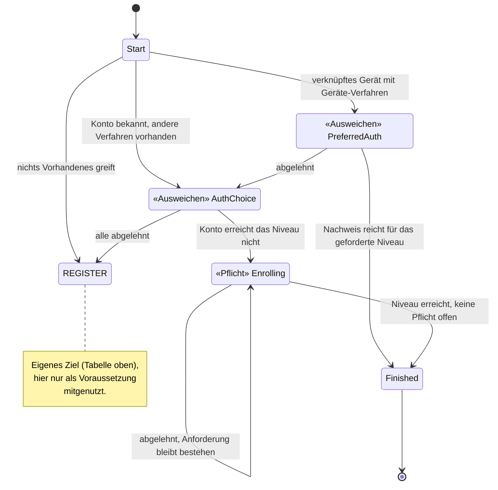
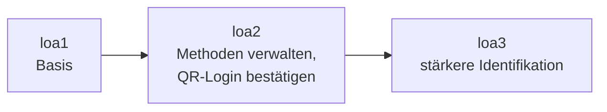
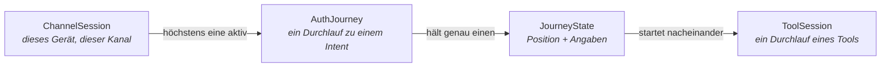

# Orchestrierung und Policy

Wie ein Nutzer zu seinem Ziel geführt wird – und wer entscheidet, welches Tool wann angeboten wird.

Vorausgesetzt wird der Vertrag über `ToolOutcome` aus [03-tool-architektur.md](03-tool-architektur.md).

---

## Einstieg für Fachexperten

Jeder Ablauf, den ein Nutzer durchläuft, ist nach seinem *Ziel* benannt, nicht nach seinem
technischen Ablauf:

| Ziel aus fachlicher Sicht | Heißt im System |
|---|---|
| Möglichst reibungslos anmelden, mit Ausweichmöglichkeiten | `FAST_ACCESS` |
| Sich bewusst neu identifizieren, auch auf einem bekannten Gerät | `REGISTER` |
| Klassischer Login ohne Geräteverknüpfung | `LOOKUP_LOGIN` |
| Das Vertrauensniveau anheben (z. B. für eine heikle Aktion) | `STEP_UP` |
| Anmeldeverfahren hinzufügen oder entfernen | `MANAGE_AUTH_METHODS` |
| Das Konto unwiderruflich löschen | `DELETE_ACCOUNT` |
| Eine QR-Anmeldung auf einem anderen Gerät bestätigen | `CONFIRM_PEER_LOGIN` |
| Sich erneut identifizieren, wenn nichts anderes mehr greift | `RE_IDENTIFY` |

Wer eine fachliche Frage hat – etwa „Darf man X löschen, ohne sich frisch auszuweisen?" –, findet
die Antwort in genau *einem* dieser Bausteine (Abschnitt 3), nicht verstreut über mehrere Schichten
des Codes. Für jedes Ziel gibt es ein vollständiges Zustandsdiagramm, in dem jeder Zustand, jeder
Übergang und jede Bedingung zu sehen ist. Hier ein Ausschnitt aus `FAST_ACCESS`:

Wichtig für die fachliche Prüfung: Das System unterscheidet zwei Sorten von Zuständen. Diese
Unterscheidung ist erzwungen, nicht freiwillig, und im Bild oben direkt an den Markierungen
abzulesen:

- **Ausweichen**: Wer ablehnt, bekommt den nächsten, aufwendigeren Weg (z. B. Gerät abgelehnt →
  anderes Verfahren anbieten). Das ist Bequemlichkeit für den Nutzer, solange am Ende trotzdem das
  geforderte Sicherheitsniveau erreicht wird.
- **Pflicht**: Ablehnen führt nirgendwohin; die Anforderung bleibt bestehen, bis sie erfüllt ist.
  Das gilt für alles, was nicht verhandelbar ist (z. B. das geforderte Vertrauensniveau).

Einen fachlichen Fehler – „Das sollte doch Pflicht sein, nicht Ausweichen" – kann man damit an
*diesem* Bild klären, ohne Entwickler hinzuzuziehen.

Manche Anforderungen kommen in mehreren Zielen vor. „Erneut identifizieren, wenn nichts anderes mehr
greift" gehört zu `FAST_ACCESS` ebenso wie zu anderen Abläufen, und im Diagramm oben ist sogar ein
ganzes eigenes Ziel (`REGISTER`) nur die Voraussetzung für ein anderes. Beides ist im System als
eigenständige **Sub-Journey** modelliert (`RE_IDENTIFY`, `REGISTER`; Abschnitt 6): Mehrere Ziele
können sie anstoßen, definiert ist sie aber nur einmal. Ändert sich die fachliche Regel für die
erneute Identifizierung oder die Registrierung, ändert sie sich an *einer* Stelle für alle
Abläufe, die sie nutzen.

Außerdem verlangt jede Aktion ein bestimmtes Niveau (`loa1`/`loa2`/`loa3`, Abschnitt 8); je heikler
die Aktion, desto höher die Hürde:

Methoden verwalten und Konto löschen verlangen `loa2`; für ein nie identifiziertes Konto reicht
`loa1` (`selfServiceAcrFloor`). Konto löschen verlangt zusätzlich einen frischen Faktor, aber nicht
`loa3`. Festgelegt ist das genau an der Stelle im Modell, an der das jeweilige Ziel beschrieben
ist. Eine fachliche Entscheidung wie „Die QR-Bestätigung braucht künftig einen frischen Nachweis,
kein altes Niveau" ist damit eine gezielte, nachvollziehbare Änderung an der Beschreibung dieses
einen Ziels.

Schließlich wird jeder Schritt, den ein Nutzer durchläuft, protokolliert und ist im Journey-Log
einsehbar: welches Verfahren wann angeboten, angenommen oder abgelehnt wurde und welches Niveau am
Ende erreicht war. Für eine fachliche oder revisionsrelevante Frage („Warum konnte dieser Nutzer
sein Konto ohne erneute Prüfung löschen?") muss man also nichts aus verteilten Systemlogs
zusammensuchen.

Ein konkretes Beispiel, das eine Person durch mehrere dieser Ziele führt, steht in
[11-beispiel-story.md](11-beispiel-story.md). Was daraus insgesamt folgt:

- **Fachliche Regeln stehen an einer Stelle, nicht verstreut im Code.** Jedes Ziel hat sein eigenes,
  vollständiges Zustandsdiagramm, das sich unabhängig von der Implementierung prüfen lässt.
- **Ausnahmen sind sichtbar, nicht versteckt.** Ob ein Zustand ausweicht oder eine Pflicht ist,
  welches Niveau eine Aktion verlangt und welche Wege zu einer erneuten Identifizierung führen, steht
  ausdrücklich im Modell.
- **Wiederverwendete Abläufe bleiben eine einzige fachliche Wahrheit.** Eine geänderte Regel in
  einer Sub-Journey wirkt überall, wo sie eingebunden ist, ohne dass Varianten auseinanderlaufen.
- **A/B-Tests werden möglich.** Weil ein Ziel wie `FAST_ACCESS` ein eigenständiges, in sich
  geschlossenes Modell ist, lässt sich für denselben Intent eine zweite Variante der Journey
  danebenstellen und im laufenden Betrieb ausspielen.

---

## 1) Begriffe

Sieben Wörter haben in diesem Kapitel eine feste Bedeutung:

| Begriff | Bedeutung | Im Code |
|---|---|---|
| **Intent** | das Ziel des Nutzers samt der Strategie, die ihn dorthin führt | `AuthIntent` |
| **Journey** | ein laufender Durchlauf zu einem Intent | `AuthJourney` |
| **Zustand** | wo die Journey gerade steht, samt der dort geltenden Angaben | `JourneyState` |
| **Tool** | ein einzelner Ablauf, den der Nutzer durchläuft | `toolId` |
| **Methode** | was im Konto eingerichtet ist und eine Anmeldung ermöglicht | `method` |
| **Schritt** | ein Schritt *innerhalb* eines Tools | `next.step` |
| **Niveau** | das Vertrauensniveau (`loa1`/`loa2`/`loa3`) | `acr` |

**Tool** und **Methode**: `enroll-sms` und `auth-sms` sind zwei Tools für *eine* Methode (`sms`). Ein
Konto hat Methoden; angeboten und gestartet werden Tools.

**Begriffe aus dem [Glossar](glossar/glossar.md).** Die Doku nutzt die Wörter des Projekts; so
entsprechen sie denen des Glossars:

- **Authentisierung und Authentifizierung.** Das Glossar trennt beides: Den Nachweis, den ein Tool
  im Namen des Clients liefert, nennt es *Authentisierung* (Seite des Clients), die Prüfung dieses
  Nachweises durch die `AuthPolicy` *Authentifizierung* (Seite des Servers). Das Projekt sagt für
  beides „Authentifizierung“. Das ist eine bewusste Sprachregelung, keine Unkenntnis der
  Unterscheidung.
- **Authentisierungsmittel** heißt hier **Methode** oder **Anmeldeverfahren**: was im Konto
  eingerichtet ist und eine Anmeldung ermöglicht (`AccountAuthMethod`), etwa SMS, Passwort oder ein
  Geräteschlüssel.
- **Identifizierungsmittel** heißt hier **Identifizierungsverfahren**: der Freischaltcode aus dem
  Brief, der Online-Ausweis und über Nect Personalausweis, Reisepass oder EUDI-Wallet.
- **Bescheinigte Attribute** sind die Angaben, für die ein Identifizierungsverfahren oder das
  Personenverzeichnis einsteht; das Konto hält sie als Claims. Was der Nutzer nur selbst angibt, ist
  unbescheinigt (`ClaimSource.SELF_REPORTED`).
- **Faktortyp** (Wissen, Besitz, Biometrie) heißt im Code `FactorType`.
- **Gerätebindung** heißt hier nur das Einrichten eines an das Gerät gebundenen Anmeldeverfahrens
  (`enroll-device`, `enroll-kobil`), also eines Faktors vom Typ Besitz. Dass der DPoP-Schlüssel eines
  Geräts mit einem Konto verknüpft ist (`DeviceAccountLink`), heißt dagegen **Geräteverknüpfung**. Sie
  erkennt das Gerät nur wieder und zählt bewusst nicht als Anmeldung
  ([DPoP-Bindung](09-dpop.md), Abschnitt 3).

Drei weitere Wörter meinen verschiedene Dinge:

- **Kandidaten** liefern der Katalog bzw. die Policy.
- Daraus wird das **Angebot**, das ein Zustand hält (`activatable()`: die Kandidaten ohne das
  Abgelehnte und ohne das nicht Verfügbare, [Tool-Architektur](03-tool-architektur.md)
  Verfügbarkeit).
- Eine **Auswahlseite** zeigt der Client nur, wenn das Angebot mehr als einen Eintrag hat.

Bleibt nichts übrig, geht es genauso weiter, als hätte der Nutzer alle Kandidaten abgelehnt
(zurück zur Identifizierung bzw. Abbruch über `exhausted`/Cancel). Einen eigenen Fehlerzustand für
nicht verfügbare Tools gibt es nicht.

### Intent

Ein **Intent** ist das Ziel des Nutzers *zusammen mit* der Strategie, die ihn dorthin führt. Er
beantwortet drei Fragen, für jedes Ziel anders:

- Welche Tools dürfen hier überhaupt angeboten werden, und in welcher Reihenfolge?
- Was bedeutet ein abgeschlossenes Tool in diesem Zusammenhang?
- Wann ist das Ziel erreicht?

Ein Intent beschreibt ausdrücklich **nicht**, was am Ende herauskam. Ob ein Durchlauf eine
Registrierung oder ein Login war, erkennt man erst am tatsächlich gegangenen Weg.

### Journey

Eine **`AuthJourney`** ist ein laufender Durchlauf zu einem Intent. Sie gehört zu genau einer
`ChannelSession` und lebt kürzer als diese; je Kanal ist immer höchstens eine Journey aktiv. Beginnt
eine neue Journey auf oberster Ebene, bricht `JourneyService.start` die noch laufende samt der für sie
pausierten Eltern ab; nur eine Sub-Journey läuft neben ihrer pausierten Eltern-Journey
([Invarianten](invarianten.md) I-3).

Die Journey hält, was für den ganzen Weg gilt (Intent, Konto, Versuchsbudget, Lebenszyklus), aber
nicht, wo der Nutzer gerade steht. Das steht im `JourneyState`.

Intent und Journey verhalten sich zueinander wie `ToolDescriptor` und `ToolSession`: Das eine
benennt die *Art*, das andere ist *ein Durchlauf* davon. Ein Kanal kann nacheinander mehrere
Journeys desselben Intents durchlaufen.

### Zustand (`JourneyState`)

Der **`JourneyState`** sagt, wo die Journey gerade steht, und trägt die Angaben, die genau dort
gelten: etwa *welche* Tools angeboten und *welche* schon verworfen wurden oder *welche*
`ToolSession` gerade laufen darf.

Jeder Intent hat seine eigene, abgeschlossene Menge von Zuständen. Die Zustände von
`MANAGE_AUTH_METHODS` lassen sich für `LOOKUP_LOGIN` gar nicht ausdrücken.

Der `JourneyState` ist außerdem die einzige Quelle für zwei Fragen: „Welches Tool darf der Client
jetzt starten?" und „Wohin schicke ich ihn als Nächstes?". Beide beantwortet dieselbe Funktion
(Abschnitt 4).

#### Zwei Sorten von Übergang

Einen erfolgreichen Nachweis behandeln alle Zustände gleich: Er bringt die Journey weiter.
Unterschiedlich ist, was **Ablehnen** bewirkt:

- In einem **Ausweichzustand** führt Ablehnen weiter, und zwar zum nächsten, aufwendigeren Weg.
  Mehrere solche Zustände bilden eine **Ausweichkette** vom bequemsten zum aufwendigsten Weg; so ist
  `FAST_ACCESS` aufgebaut. Gibt es nichts Aufwendigeres mehr, endet die Journey.
- In einem **Pflichtzustand** führt Ablehnen nirgendwohin. Die Pflicht bleibt bestehen, und das
  volle Angebot kommt zurück, auch das gerade verworfene Tool. Nur wer die Pflicht erfüllt, kommt
  weiter.

Beide Sorten kommen in derselben Menge von Zuständen vor (etwa in `FAST_ACCESS`); welche Sorte ein
Zustand ist, muss im Code sichtbar sein.

### Tool

Ein **Tool** ist ein einzelner Ablauf (`ident-fsc`, `enroll-sms`, `auth-device`, …). Es weiß nichts
über Journeys, Intents oder Reihenfolgen und meldet nur sein Ergebnis als `ToolOutcome`
([Tool-Architektur](03-tool-architektur.md)). Was dieses Ergebnis bedeutet, entscheidet der Intent.

### Die Sitzungsebenen im Zusammenhang

---

## 2) Die Intents

- Vier **Einstiegs-Intents** starten eine neue Sitzung im `APP`-Kanal.
- `KC_SELECT_METHOD` ist der Einstieg des Web-Kanals für Login und Step-up; `REGISTER` ist
  zusätzlich über den Web-Kanal erreichbar (siehe unten).
- Fünf weitere Intents laufen innerhalb einer bestehenden Sitzung.
- `CONFIRM_PEER_LOGIN` ist die Ausnahme, die **beides zugleich** ist (eigener Abschnitt unten).

| `AuthIntent` | Ziel | Einstieg |
|---|---|---|
| `FAST_ACCESS` | So schnell wie möglich auf diesem Gerät angemeldet sein, und so, dass es auch künftig klappt | `POST /app/channels` (Standard) |
| `REGISTER` | Sich bewusst frisch identifizieren, auch auf einem schon verknüpften Gerät | `POST /app/channels` mit `intent=register` (App) bzw. `PATCH /kc/channels/{id}` mit `intent=register` (Web, siehe unten) |
| `LOOKUP_LOGIN` | Ein bestehendes Konto ohne Geräteverknüpfung anmelden (klassischer Web-Login) | `POST /app/channels` mit `intent=lookup_login` |
| `KC_SELECT_METHOD` | Alle im Web-Kanal nutzbaren Tools in einem Auswahlschritt (`selectMethod`) anbieten; um das Ausweichen auf andere Verfahren kümmert sich Keycloak selbst | Standard-Einstieg des `KEYCLOAK`-Kanals ([05-api.md](05-api.md) Abschnitt 3) |
| `STEP_UP` | Das Niveau anheben | nur auf einem Kanal, der `AUTHENTICATED` ist |
| `MANAGE_AUTH_METHODS` | Verfahren hinzufügen oder entfernen | nur auf einem Kanal, der `AUTHENTICATED` ist |
| `CONFIRM_PEER_LOGIN` | Einen wartenden Web-Login per `auth-qr`/`auth-qr-lookup` bestätigen oder ablehnen | `POST /app/channels` mit `intent=confirm_peer_login` **oder** `POST /channels/{id}/peer-logins` auf einem Kanal, der `AUTHENTICATED` ist – beide mit derselben Prüfung |
| `DELETE_ACCOUNT` | Das Konto unwiderruflich löschen | nur auf einem Kanal, der `AUTHENTICATED` ist |
| `LOGOUT` | Abmelden mit Bestätigung | nur auf einem Kanal, der `AUTHENTICATED` ist |
| `RE_IDENTIFY` | Erneute Identifizierung als gemeinsam genutzte Sub-Journey | nie direkt, nur über `RequireSubJourney` |

Startet `CONFIRM_PEER_LOGIN` ohne bestehende Sitzung, bietet es nie eine Identifizierung oder
Registrierung an. Ist über `DeviceAccountLink` kein Konto bekannt, bricht die Journey sofort ab
(410). Ist ein Konto bekannt, gilt eine feste Schwelle von `loa2`, die per `STEP_UP` erreicht werden
muss. Anders als bei `MANAGE_AUTH_METHODS` gibt es dabei keinen Ausweg über eine erneute
Identifizierung (`allowReIdentification = false`). Reichte das Niveau schon *vor* diesem Durchlauf,
verlangt `CONFIRM_PEER_LOGIN` zusätzlich einen frischen Nachweis, wie `DELETE_ACCOUNT` (eigener
Abschnitt unten).

`REGISTER` ist ein eigener Intent mit eigener Journey (`RegisterState`). Er schlägt nicht in
`DeviceAccountLink` nach und bietet nie eine schon bestehende Geräteverknüpfung an. Auch
`FAST_ACCESS` nutzt diese Journey: Muss sich jemand beim schnellen Anmelden erst ausweisen, startet
sie als vorgeschalteter Schritt (`Transition.RequireSubJourney`) – nach demselben Muster wie
`RE_IDENTIFY`. Ein zweites Konto erzwingt `REGISTER` **nicht**: Dieselbe Person (erkannt über KVNR
oder Partnernummer) findet dasselbe Konto wieder. Umgekehrt entsteht ein zweites Konto auf einem
verknüpften Gerät nur über `intent=register`: Als vorgeschalteter Schritt des schnellen Anmeldens
kennt der Kanal schon das Konto des Geräts, und eine fremde Person ohne Konto wird dort abgewiesen
statt still ein neues Konto zu bekommen ([register.md](journeys/register.md)).

Welches Konto gerade „in der Hand“ ist, sagt allein `ChannelSession.accountId`. `AuthJourney.accountId`
hält nur fest, für welches Konto eine Journey lief (Nachweis), und wird zu keiner Entscheidung
gelesen.

Der gewählte Intent wird in der `ChannelSession` gespeichert. Fortsetzen und Abbrechen starten
denselben Intent erneut: Eine abgebrochene Anmeldung über die E-Mail-Adresse (`LOOKUP_LOGIN`) beginnt
wieder als Anmeldung über die E-Mail-Adresse.

---

## 3) Die Journeys im Einzelnen

Für alle Diagramme gilt: Ein Pfeil ist ein Übergang, ausgelöst durch ein `JourneyEvent` (Tool
abgeschlossen, Tool abgebrochen, untergeordnete Journey fertig). „abgelehnt" heißt: gescheitert
oder vom Nutzer verworfen, und in diesem Zustand ist nichts mehr übrig. Endzustände (`Finished`)
sind eingezeichnet, werden aber **nicht** als Zustand gespeichert: Das Ende einer Journey ist ein
Übergang – `Authenticated` im Erfolgsfall, sonst `Logout`, `Cancel` oder `Abort`.

Jede Journey hat eine eigene Datei unter [`journeys/`](journeys/). Früher war dieser Abschnitt 32 KB
groß, die Hälfte des Dokuments; wer eine einzelne Journey nachschlagen wollte, musste alle laden.

| Journey | Datei |
|---|---|
| `FAST_ACCESS` | [fast-access.md](journeys/fast-access.md) |
| `REGISTER` | [register.md](journeys/register.md) |
| `LOOKUP_LOGIN` | [lookup-login.md](journeys/lookup-login.md) |
| `KC_SELECT_METHOD` | [kc-select-method.md](journeys/kc-select-method.md) |
| `STEP_UP` | [step-up.md](journeys/step-up.md) |
| `RE_IDENTIFY` | [re-identify.md](journeys/re-identify.md) |
| `MANAGE_AUTH_METHODS` | [manage-auth-methods.md](journeys/manage-auth-methods.md) |
| `CONFIRM_PEER_LOGIN` | [confirm-peer-login.md](journeys/confirm-peer-login.md) |
| `DELETE_ACCOUNT` | [delete-account.md](journeys/delete-account.md) |
| `LOGOUT` | [logout.md](journeys/logout.md) |
| Lebenszyklus, unabhängig vom Intent | [lebenszyklus-unabhaengig-vom-intent.md](journeys/lebenszyklus-unabhaengig-vom-intent.md) |

## 4) `next` folgt aus dem Zustand

Alle Zustände erfüllen einen gemeinsamen Vertrag. Jeder Zustand weiß, welche `toolId`s hier
gestartet werden dürfen (keine bei End- und Wartezuständen), ob und welches Tool gerade läuft und
welche eigene Seite des Orchestrators (`next.context`/`next.step`) er anzeigt. Daraus folgt **eine**
Tabelle, aus der sich `next` ergibt:

| `active` | `activatable()` | `next` |
|---|---|---|
| gesetzt | – | `type="tool"`, Schritt der laufenden `ToolSession` |
| null | genau ein Eintrag | `type="tool"`, `startStep` des Descriptors |
| null | mehrere | `type="orchestrator"`, Auswahlseite |
| null | leer | `type="orchestrator"`, eigene Seite des Orchestrators (Bestätigung, Abschluss) |

Die Prüfung „Darf dieses Tool jetzt gestartet werden?" ist dieselbe Funktion: Das Tool muss in
`activatable()` stehen. Ein Zustand, der ein Tool nicht anbietet, kann es also auch nicht zulassen.
`next.type` (`"tool"` oder `"orchestrator"`) sagt, wem der nächste Bildschirm gehört und welchen
Endpunkt der Client aufruft.

---

## 5) Die zwei Verträge: SPI und API

### `IntentStrategy` – die SPI

Sie ist das Gegenstück zu `tool_spi`: Dort beschreiben sich die Tools selbst, hier die Intents. Jede
Strategie ist ein Moore-Automat für ihren eigenen Zustandstyp. Sie hat `transition(state, event, ctx)`,
dazu `initialState(ctx)` (wo eine direkt gestartete Journey beginnt). Wohin der Kanal bei einem
Abbruch zurückfällt, entscheidet keine Strategie: Er kehrt zu dem Anmeldestand zurück, den er vor
der Journey hatte (`ChannelState.isLoggedIn` – `AUTHENTICATED` oder ein darauf laufender Step-up),
sonst nach `ANONYMOUS`. Früher legte das jede Strategie selbst fest, und die „läuft nur auf
angemeldeten Kanälen“-Annahme stimmte für die kalte Web-Login-Bestätigung und einen Step-up vor der
Anmeldung nicht (Review 2026-09, Phase D 19). Eine Sub-Journey mit vorgegebenem Zielniveau beginnt nicht
über die SPI, sondern über die Fabrikmethode im Companion ihres Zustands
(`StepUpState.forSubJourney(...)`, `ReIdentifyState.forSubJourney(...)`,
`RegisterState.forSubJourney()`). Als Sub-Journey laufen `STEP_UP`, `RE_IDENTIFY` und `REGISTER`.

`transition()` ist die einzige Methode, die überhaupt etwas entscheidet.

Ein `JourneyEvent` ist das, was der Journey gerade passiert ist:

| Event | Bedeutung |
|---|---|
| `Started` | Die Journey wurde gerade angelegt und braucht ihr erstes Angebot |
| `Completed(tool, outcome)` | Ein Tool wurde erfolgreich abgeschlossen; was das bedeutet, entscheidet hier die Strategie |
| `Abandoned(tool)` | „Zurück" oder „Wechseln": Das gestartete Tool wurde ohne Abschluss verworfen |
| `ActionCompleted` | Die `Action` eines `Perform`-Übergangs (unten) ist ausgeführt; der `JourneyContext` ist neu aufgebaut |
| `EvidenceReported` | Ein Nachweis kam außerhalb eines Tools an (eigene Keycloak-Verfahren); die `AuthEvidence` ist bereits aktualisiert |
| `SubJourneyFinished(intent, achievedAcr)` | Eine als Voraussetzung gestartete untergeordnete Journey ist fertig |
| `SubJourneyCancelled(intent)` | Die untergeordnete Journey wurde abgelehnt oder aufgegeben, ohne Ergebnis |
| `Answered(answer)` | Eine ausdrückliche Antwort auf einen `AnswerableState` statt eines Tools; `answer` ist ein String, kein `Boolean` |

Eine `Transition` ist das, was als Nächstes passieren soll:

- **`To(state)`** — weiter zu diesem Zustand; er bringt sein Angebot selbst mit
- **`RequireSubJourney(intent, seedWith, resumeWith)`** — zuerst `intent` laufen lassen, beginnend bei `seedWith`, danach hier bei `resumeWith` weitermachen. `seedWith` baut die anfordernde Strategie über die Fabrikmethode des Zielzustands, z. B. `StepUpState.forSubJourney(...)`
- **`Authenticated`** — Ziel erreicht; die Journey ist damit verbraucht
- **`Cancel`** — Der Nutzer gibt auf – wie ein ausdrücklicher Abbruch, kein Fehler
- **`Perform(action, resumeState)`** — die `Action` ausführen und die Journey danach bei `resumeState` mit `ActionCompleted` fortsetzen
- **`Logout`** — den Kanal endgültig beenden (`LOGGED_OUT`, Endzustand)
- **`Abort(reason)`** — Es geht gar nicht weiter (410) – das bedeutet nie bloß „keine Kandidaten mehr"

`Perform` trennt die Entscheidung von der Wirkung. `JourneyService` führt die `action` aus, baut den
`JourneyContext` danach neu auf und ruft `transition(resumeState, ActionCompleted, frischerCtx)`
erneut auf – so lange, bis eine Strategie nicht wieder `Perform` liefert. Auf dieser Wiederholung
beruhen alle besonderen Wege:

- Ein abgeschlossenes Tool: `is Completed -> Perform(actionFürOutcome, resumeState = state)`,
  gefolgt von `is ActionCompleted -> <weitere Logik>` im selben Zustand. Diese zweistufige Form
  gilt für jeden Intent, der Tools anbietet.
- `Action.LinkDevice`, `Action.RevokeAuthMethod` und `Action.DeleteAccount`: Die Strategie liefert
  `Perform`, statt selbst zu verknüpfen oder zu löschen (`LookupLoginState.OfferBinding`,
  `ManageAuthMethodsState.RemoveRequested`, `DeleteAccountState.ConfirmationRequired`).
- RestoreData ([05-api.md](05-api.md) Abschnitt 3): kein `JourneyEvent`, sondern der erste Übergang
  des Automaten – siehe unten.

Die Varianten von `Action`:

- **`RecordIdentification(tool, outcome)`** — Eine Identifizierung (`ident-fsc`/`ident-eid`/`ident-nect`) oder Zuordnung (`ident-kvnr`) hat eine Identität festgestellt. **Ein** Handler für beide Fälle: Ob schon ein Konto gebunden ist, liest er zur Laufzeit aus Journey und Kanal; die Strategie legt das nicht über die Variante fest
- **`AdoptCredential(tool, outcome)`** — Ein neues Verfahren wurde eingerichtet
- **`AcceptProof(tool, outcome)`** — Ein Nachweis wurde erbracht. Ob das Tool das Konto selbst *nennen* darf, leitet der Executor aus `MethodRole.LOOKUP_AUTH` und der aktuellen Zuordnung zum Konto ab; widerspricht ein genanntes Konto einem schon gebundenen, gibt es `409`
- **`AdoptAttestation(tool, outcome)`** — Ein Attribut des Kontos wurde bestätigt (z. B. die E-Mail-Adresse). Das allein darf nie zu einem *anderen* Konto wechseln; dafür braucht es eine echte Identifizierung in derselben Sitzung
- **`ApplyRestoredEvidence(source, methods)`** — siehe „RestoreData als erster Übergang" unten
- **`RecordApproval(tool, outcome)`** — Ein `PEER_APPROVAL`-Tool hat über die Anfrage eines anderen Kanals entschieden (`CONFIRM_PEER_LOGIN`); das wird nur verbucht und ändert keinen eigenen Nachweis
- **`RevokeAuthMethod(methodInstanceId)`** — **Ein Anmeldeverfahren** widerrufen, also das Credential selbst, nicht nur einen Schalter. Wer sich damit aussperren würde, wird vom Automaten abgewiesen, nicht von der Strategie. Benannt nach dem, was es zerstört – neben `DeleteAccount`, das das ganze Konto zerstört
- **`RetractAttribute(attributeType)`** — Ein Attribut des Kontos (heute die bestätigte E-Mail-Adresse) zurücknehmen; was davon abhing (`requires`), fällt mit
- **`LinkDevice`** — Das aktuelle Gerät mit dem Konto **dieser Sitzung** verknüpfen. Nur auf diesem Weg darf ein Gerät auch *neu* verknüpft werden, weil ihm eine Zustimmung vorausgeht
- **`DeleteAccount`** — **Das ganze Konto** dieser Sitzung unwiderruflich löschen. Unmittelbar vor der Ausführung prüft der Executor `requiredAcr(account)` noch einmal gegen die aktuellen Nachweise

**Sicherheitsprüfungen gehören nie in die Strategie.** Drei Lücken, über die sich fremde Konten
übernehmen ließen, sind genau so entstanden: Die *Prüfung* lag im einzelnen Handler einer Action,
die *Wahl* des Handlers (oder eines Schalters darauf) aber bei der Strategie. Daraus folgt heute,
fest im Aufbau verankert:

- Identität feststellen (`IdentityResolver`), ein vorläufiges Konto übernehmen
  (`absorbProvisionalAccount`) und ein Gerät verknüpfen (`linkDeviceToAccount`) sind aus **genau einer**
  Klasse erreichbar (`JourneyActionExecutor`). Das erzwingt eine ArchUnit-Regel, nicht ein Review.
- Jeder Wechsel zu einem *anderen* Konto als dem bisherigen läuft durch dieselbe Funktion (`accountOf`),
  egal welche Strategie sie ausgelöst hat.
- Für das Verknüpfen eines Geräts gibt es **eine** Implementierung (`linkDeviceTo`), die immer auch die
  Geräte-Credentials des vorher verknüpften Kontos widerruft. Früher gab es zwei Varianten, und
  welche lief, hing an der Action. `RegisterEnrollFirstStrategy` hatte damals noch keinen eigenen
  Zustand für die Rückfrage und erwischte die Variante, die nicht widerruft.

Die ersten vier Varianten von `Action` tragen `tool` und `outcome` selbst. Enthalten ist nur, was
sich je Intent **unterscheidet**; alles Mechanische – `personId`, `enrollmentRef`, `amr`,
`achievedAcr` – liest der gemeinsame Mechanismus direkt aus dem mitgegebenen `outcome`.

### Ein Angebot darf veralten, die Ausführung muss aktuell prüfen

Das ist die Regel hinter allen Punkten oben, und nach ihr entscheidet sich jeder künftige
Zweifelsfall. Ein festgehaltener Wert ist **richtig**, wenn er eine Vergangenheit festhält, die
sich später nicht mehr feststellen lässt (`ConfirmPeerLoginState.startedAuthenticated`,
`StepUpState.startingAcr`, `MethodEvidence` als Nachweis, Felder im Protokoll). Er ist **falsch**,
wenn er eine Gegenwart einfriert, die bei der Ausführung neu gelesen werden müsste. Schwellen und
`accountId`-Felder, die die Strategie in Zustände schreibt, gehören ausnahmslos in die zweite
Gruppe.

Angebote (`OfferingState.offered`) gehören bewusst in die erste Gruppe. `activatable()` gleicht sie
beim Anzeigen nur mit `availableTools` ab (was der Client kann plus die Sperren des Betreibers),
**nicht** mit der aktuellen Lage des Kontos. So bleibt `next` eine reine Funktion des Zustands und
braucht keine Datenbank. Ein Verfahren, das inzwischen weggefallen ist, kann deshalb noch angeboten
werden. Das führt zu einem Fehlschlag, ist aber kein Sicherheitsproblem, weil geprüft wird, wenn
das Verfahren **ausgeführt** wird, und dort immer mit aktuellen Daten:

- Anmelden: `performAcceptProof` liest `findActiveMethod(accountId, method)` neu und begrenzt auf
  `min(achievedAcr, enrolledUnderAcr)`. Fehlt das Verfahren, schlägt der Durchlauf fehl.
- Einrichten: `performAdoptCredential` berechnet `enrolledUnderAcr` aus den Nachweisen von
  **jetzt**, nie aus der Lage, in der das Angebot entstand (ADR-5).

`AuthPolicy` und `CandidateTools` haben dafür keinen eigenen Zustand: Beide rechnen nur mit dem
übergebenen `JourneyContext`, den `JourneyService.advance` bei **jedem** Übergang neu aufbaut –
auch nach jeder Action, über den wiederholten Durchlauf mit `ActionCompleted`.

**Die Geräteverknüpfung hängt an keiner Action.** Innerhalb eines Intents ändert sie sich nie; ein
Schalter an jeder Action wäre eine Konstante des Intents, die man überall neu (und falsch) setzen
könnte. Stattdessen gibt es zwei unabhängige Fragen, jede dort beantwortet, wo die nötige
Information liegt, und an genau einer Stelle zusammengeführt:

- **Will dieser Ablauf verknüpfen?** `AuthIntent.bindsDeviceImplicitly` – nur `LOOKUP_LOGIN` nicht,
  weil genau diesen Intent Leute wählen, die nicht wiedererkannt werden wollen. Er fragt stattdessen
  nach (`OfferBinding` → `Perform(LinkDevice, …)`). Die Frage nach dem Kanal kann diese Eigenschaft
  gar nicht mitbeantworten: `REGISTER` läuft auf APP *und* KEYCLOAK und wäre also keine Konstante
  mehr.
- **Gibt es hier ein Gerät?** Das hängt am Kanal und wird einmal im Executor geprüft. Die Prüfung
  gilt auch für den ausdrücklichen Weg, denn auf einem KEYCLOAK-Kanal gibt es auch nach einer
  Zustimmung nichts zu verknüpfen.

Zusätzlich wird danach unterschieden, **ob etwas zerstört wird**, nicht nach der Strategie. Das
stillschweigende Verknüpfen greift nur, wenn das Gerät frei ist oder schon zu diesem Konto gehört.
Es verknüpft ein Gerät **nie** still neu und widerruft nie fremde Credentials. Wer einen Ablauf erfolgreich
abschließt, ist damit einverstanden, von *diesem* Konto wiedererkannt zu werden – nicht damit, das
Gerät einem anderen Konto wegzunehmen. Neu verknüpfen kann nur der ausdrückliche Weg nach einer Rückfrage
(`ConfirmDeviceRebind`; im Experiment „Erst Anmeldeverfahren einrichten" `EnrollFirstConfirmDeviceRebind` am Ende
des Durchlaufs).

Zentral und für Strategien unerreichbar bleiben: den Nachweis in die `AuthEvidence` übernehmen,
`SessionEvent` und Journey-Log schreiben und die Begrenzung `min(achievedAcr, enrolledUnderAcr)`.

Die Entscheidungen dahinter:

- **Ein Übergang statt fünf.** „Erstes Angebot", „abgeschlossenes Tool", „Abbruch", „Rückkehr aus
  einer Sub-Journey" und „eigene Aktion fertig" sind dieselbe Frage, nur mit einem anderen Event.
- **Die Strategie liefert eine `Transition`, kein `Next`.** Sonst müsste jeder Intent selbst die
  Regel nachbauen, dass ein einzelner Kandidat die Auswahlseite überspringt. So macht der gemeinsame
  Mechanismus daraus Zustand und `next`.
- **`Abort` ist eine Entscheidung der Strategie**, nicht etwas, das beim Ermitteln der Kandidaten
  von selbst passiert. Eine leere Liste von Kandidaten muss „nächster Zustand" bedeuten dürfen;
  sonst ließe sich keine Ausweichkette bauen.
- **Die Strategie bekommt nie Services**, nur einen `JourneyContext` zum Lesen (Konto, Nachweise,
  Untergrenze, Bezug zum Gerät, Abfragen im Katalog). Sie entscheidet, sie wirkt nicht; ausgeführt
  wird ausschließlich außerhalb (`JourneyActionExecutor`, siehe unten).

Welche Tools für ein Angebot in Frage kommen, beantwortet `CandidateTools`, abgeleitet aus den
Descriptors der Module. Dort steht keine einzige `toolId`: Ein Tool wird Teil eines Angebots, indem
es seine Rolle deklariert.

### Die vier Phasen eines Übergangs

Dieselbe Trennung wie zwischen `IntentStrategy` und dem ausführenden Teil setzt sich im
ausführenden Teil fort: Jeder Übergang durchläuft vier Phasen, und für jede Phase ist genau eine
Klasse zuständig. `JourneyService` bleibt der **Treiber**, nicht der Ausführende.

| Phase | Klasse | Aufgabe |
|---|---|---|
| lesen | `JourneyContextFactory` | baut den `JourneyContext` zum Lesen aus den dauerhaft gespeicherten Daten (Konto, Nachweise, Geräteverknüpfung, Feature-Flags) |
| entscheiden | `IntentStrategy` | macht aus Zustand, Event und Kontext eine `Transition` – nur Werte, keine Wirkung |
| wirken | `JourneyActionExecutor` | führt die `Action` eines `Perform` aus (Konto anlegen, Claims und Credentials schreiben, Gerät verknüpfen, widerrufen) |
| weiterleiten | `JourneyRouting` | leitet `next` und `Step` aus dem neuen Zustand ab |

Bei `JourneyService` bleibt, was keine der vier Klassen allein besitzen kann: der Lebenszyklus der
Journey (`start`, Pausieren, Fortsetzen, `cancel`), die Schleife, die die Phasen nacheinander
aufruft, das Versuchsbudget und die Folgen eines Abbruchs.

Die Abhängigkeit geht bewusst nur in eine Richtung: `JourneyActionExecutor` schreibt und kehrt
zurück. Er bringt keine Journey weiter, leitet nicht weiter und startet keine Sub-Journey. Nur so
bleibt die Wiederholung in `JourneyService.applyTransition` die einzige im ganzen Ablauf.
`OrchestratorArchitectureTest` prüft das.

Auch Keycloak wird in keiner Phase direkt abgeglichen. Was ein Übergang am Konto ändert, meldet das
Modul `account` per `AccountChanged`. Danach, nach dem Commit, spiegelt der
`KeycloakAccountSyncListener` die Änderung nach Keycloak, über die Event-Publication-Registry
(ADR-29). Denselben Weg nimmt eine Änderung im Personenverzeichnis, ganz ohne Journey:
`PersonChanged` → Konto (`applyDirectoryChange`) → `AccountChanged(accountId, changed)` → Keycloak,
dort aber nur, wenn Attribute betroffen sind, die nach Keycloak gespiegelt werden (ADR-34).

### RestoreData als erster Übergang

Ein als Voraussetzung mitgelieferter Nachweis ([05-api.md](05-api.md) Abschnitt 3, RestoreData im
Web-Kanal) ist keine fachliche Entscheidung einer Strategie, sondern nur eine Information des
Aufrufers. Er läuft deshalb als **erster Übergang** des Automaten (in Statecharts der Übergang vom
Startpunkt zum ersten Zustand): mechanisch, ohne Bedingung und zu keinem Zustand gehörig.

Genau dafür gibt es den Parameter `seedAction` von `JourneyService.start()`:
`Action.ApplyRestoredEvidence` läuft, BEVOR `IntentStrategy.initialState()` aufgerufen wird. Das ist
kein `JourneyEvent`, sondern ein protokollierter Übergang namens `"Entry"`, den `JourneyService`
selbst ausführt. Weil der Nachweis schon vor dem ersten Angebot vorliegen kann, darf `Started` das
erste Angebot nicht einfach bauen. Eine Strategie wie `KcSelectMethodStrategy` prüft bei `Started`
genauso wie bei jedem anderen Nachweis, ob das Vorhandene schon reicht.

### Was Tool-Controller sehen

Tool-Controller greifen ausschließlich über `ToolControllerSupport` auf `JourneyService` zu:
`activate` (prüft und übernimmt eine `ToolSession`), `applyOutcome`, `back`, `abandon` und `nextOf`, dazu
zum Lesen `isCurrent` und `findActive`. Das ist ihre **einzige** Berührung mit dem Journey-Modell:
Sie setzen keine Routing-Felder, unterscheiden nicht nach dem Intent und entscheiden nicht, welches
Tool laufen darf. Ein `Step` ist `next` plus die Daten, die der Schritt zum Anzeigen braucht.

Drei Aktionen muss der Client sauber auseinanderhalten: `back` verlässt das laufende **Tool** und
zeigt die Auswahl des Zustands wieder, ohne etwas abzulehnen (`POST /tools/{toolSessionId}/{toolId}/back`).
`abandon` lehnt das Tool im aktuellen **Zustand** ab und führt die Journey weiter
(`DELETE /tools/{toolSessionId}/{toolId}`). `cancel` gibt die **Journey** auf und startet den
Einstiegs-Intent neu (`DELETE .../journey`, über `ChannelService`, nicht über einen Tool-Controller).

---

## 6) Sub-Journey

`Transition.RequireSubJourney` legt eine eigene `AuthJourney` mit `parentJourneyId` an. Ist sie
fertig, wird die übergeordnete Journey bei `resumeWith` fortgesetzt.

Dabei gilt immer: Je Kanal ist genau **eine** Journey aktiv. Die untergeordnete Journey läuft, die
übergeordnete ist `SUSPENDED`; beide laufen nie gleichzeitig. Der Step-up behält eigene Werte
`startingAcr` und `achievedAcr` und ein eigenes Protokoll.

---

## 7) Versuchsbudget

`attemptBudget` liegt an der `AuthJourney`, nicht an der `ToolSession`. Jedes `Failed` zieht einen
Versuch ab, egal in welchem Zustand und in welchem Tool. Bei `0` endet die **ganze Journey**
(`410`), auch wenn noch Zustände übrig wären.

Das ist eine Sicherheitsanforderung: Ein Zähler je Tool würde es billiger machen, entlang der Kette
von Tools durchzuprobieren.

Regel für weitere Versuche: Ein fehlgeschlagener Versuch mit verbleibendem Budget ist **kein**
HTTP-Fehler, sondern wird behandelt wie eine fehlende Eingabe (`200` plus Navigation, Grund in
`stepData.error`). Erst ein erschöpftes Budget beendet die Journey (`410`). HTTP-Fehlercodes zeigen
gestörte Abläufe an, nicht erwartbare Eingabefehler ([API](05-api.md)).

Über die Journey hinaus gibt es einen zweiten Schutz für das ganze Konto:
`ToolControllerSupport.chargeThrottles` bucht jeden abgeschlossenen Anmeldeversuch auf das Konto
(`LoginThrottleService`, bei der Anmeldung über die E-Mail-Adresse über `attemptedAccountId`) und jeden
Identifizierungsversuch auf die Person (`IdentThrottleService`). Das Versuchsbudget oben gilt nur
für die Journey; die Sperre des Kontos gilt über alle Journeys und Kanäle hinweg. Welche Arten von
Versuchen bewusst nicht zählen und warum, steht in [Betrieb](07-betrieb.md) Abschnitt 4.

---

## 8) AuthPolicy: Entscheidung über mehrere Faktoren

Die Strategien fragen die `AuthPolicy`, statt selbst zu entscheiden, was genug ist: ob die
vorhandenen Nachweise reichen (`isSatisfied`), welches Niveau sich aus ihnen ergibt (`resolveAcr`),
welche Tools als Nachweis, zur erneuten Identifizierung oder zum Einrichten in Frage kommen und ob
ein Konto ein Niveau grundsätzlich erreichen kann (`reachability`), unabhängig vom aktuellen
Nachweis.

Zwei Bedingungen müssen zusammen erfüllt sein:

1. **Niveau**: `resolveAcr(evidence) >= requiredAcr`. Welche `amr`-Kombination welchen `acr`-Wert
   ergibt, ist fachlich und regulatorisch offen. RFC 8176 legt zwar ein IANA-Verzeichnis für
   `amr`-Werte fest (`pwd`, `otp`, `hwk`/`swk`, `user`, `face`, `fpt`, `mfa`, …), aber nicht, welche
   Kombination welches Vertrauensniveau ergibt. Die `amr`-Werte dieses Projekts (`sms`, `password`,
   `email`, `fsc`, `eid`, `kvnr`, `nect-<verfahren>`, `device`, `kobil`, `qr`, dazu `pin`/`biometric`
   aus der Prüfung am Gerät) folgen einer eigenen Konvention.
2. **Verschiedene Faktortypen**: Für die Niveaus ab `loa2` braucht es mindestens zwei
   **verschiedene** Faktortypen. Gezählt werden alle `factorTypes` aller abgeschlossenen Tools
   zusammen, nie die Anzahl der Tools. Ein Tool, das selbst zwei Faktortypen meldet (z. B. ein
   Passkey mit Prüfung am Gerät), ist allein schon ein 2-Faktor-Authentisierungsmittel (MFA im
   engeren Sinn).

Eine wichtige Einschränkung: Ein Tool darf nur Faktoren melden, die es dem Server gegenüber
tatsächlich **nachweisen** kann. Für eine App-PIN, die nur lokal geprüft wird, gehört nur
`{possession}` in den Descriptor.

**Davon gibt es zwei benannte Ausnahmen**, `device` und `kobil`. Beide melden `knowledge` bzw.
`inherence` aus dem Zugangsmittel, mit dem der Nutzer das Credential entsperrt hat. Wie er das
getan hat, kann der Server nicht sehen; er kann nur die Angabe des Clients lesen
(`tool_api.DeviceProofs`, `UserVerification`). Das ist hier bewusst als **eine Ausnahme** notiert,
nicht als zwei Einzelfälle: Würde dasselbe Zugangsmittel in zwei Verfahren verschieden bewertet,
würde dieselbe Handlung je Tool unterschiedlich viel zählen, ohne dass der Nutzer den Grund sieht
(ADR-21). Bei `kobil` ist dafür die andere Hälfte stärker belegt als anderswo: Der Besitz beruht auf
einer Bestätigung, die das Backend selbst beim Anbieter einlöst, nicht auf einer Signatur des
Clients.

### IAL und AAL: zwei Fragen, ein `acr`-Wert

`resolveAcr` beantwortet zwei unabhängige Fragen (NIST 800-63: IAL und AAL) und fasst sie erst am
Ende zu dem `acr`-Wert zusammen, der nach außen sichtbar ist:

- **IAL** (`identityAssuranceLevel`, „Wer ist das?"): das höchste `loa`, das ein Verfahren mit der
  Rolle IDENTIFICATION (`ident-fsc`, `ident-eid`, `ident-nect`) **in dieser Sitzung** erbracht hat.
  Es wird bewusst NICHT aus `account.identification` einer früheren Sitzung nachgeladen, denn die
  `AuthEvidence` gibt es „einmal je Kanal, gelöscht beim Abmelden"
  (`orchestrator.session.AuthEvidence`).
- **AAL** (`authenticatorAssuranceLevel`, „Wie stark ist der Nachweis bei DIESEM Login?"): die
  Regel für die Kombination mehrerer Faktoren aus Punkt 2, aber ausschließlich über Nachweise aus
  Einrichten und Anmelden gerechnet.

`resolveAcr = max(IAL, AAL)`. Jede Zeile `MethodEvidence`/`AmrRecord` trägt dafür eine `axis`
(`EvidenceAxis.IDENTITY` oder `AUTHENTICATOR`, `DefaultAuthPolicy`/`ToolDescriptor.evidenceAxis()`),
abgeleitet aus der `role`. Ein Schritt mit der Rolle `CORRELATION` wie `ident-kvnr` hebt keine der
beiden Nachweisarten. Der Grund für die Trennung: Eine Identifizierung darf ihr eigenes `loa` direkt
beisteuern (ein einzelnes `ident-fsc` erreicht `loa2`). Sie darf sich aber **nicht** mit einem
einzelnen Anmeldefaktor anderer Art zu einer mehrstufigen Authentifizierung verbinden. Sonst würde ein gestohlenes
Passwort so gelten, als wäre es durch einen weiteren, beim Login geprüften Faktor abgesichert.

**`loa2` ist damit die projekteigene Bezeichnung für AAL2 nach NIST 800-63B.** Es gibt drei
gleichwertige Wege dorthin:

1. ein einzelnes Tool mit zwei eigenen Faktortypen (`device`: Besitz plus Wissen oder Inhärenz),
2. zwei kombinierte Anmelde-Tools mit je einem Faktor unterschiedlicher Art (SMS plus Passwort).
   Im Sinne des [Glossars](glossar/glossar.md) ist das eine **mehrstufige Authentifizierung**, keine
   MFA im engeren Sinn, denn jedes der beiden Mittel trägt nur einen Faktor. NIST SP 800-63B stellt
   sie für AAL2 der MFA gleich (mehrere Authenticators, die zusammen zwei Faktortypen abdecken);
   deshalb zählt sie hier gleich viel wie Weg 1. Die Regel bleibt, nur der Name ist genau,
3. eine Identifizierung (`ident-fsc`/`ident-eid`/`ident-nect`) allein über ihr eigenes IAL.

Weil Weg 3 gleichwertig ist, bietet die Anmeldung `CandidateTools.forReIdentification`
standardmäßig als Ausweichweg an (`StepUpState.forSubJourney`, standardmäßig
`allowReIdentification=true`), sobald die vorhandenen Anmeldeverfahren nicht reichen. `loa3` bzw.
AAL3 ist bewusst nicht ausgearbeitet.

### Nachweis der Sitzung ist nicht dasselbe wie Fähigkeit des Kontos

In einem Zustand zum Anmelden lautet die Frage „Reicht das *jetzt*?" (`isSatisfied`), in einem
Zustand zum Einrichten „Kommt der Nutzer damit *künftig wieder herein*?" (`reachability`). Eine
Identifizierung ist kein dauerhaftes Verfahren: `ident-fsc` zählt zwar für die
`AuthEvidence.currentFactorTypes` dieser Sitzung, landet aber im Protokoll
`account.identification`, nicht in `account.auth_method`.

Daraus folgt eine Kette von Obergrenzen:

- Die Identifizierung in der Sitzung, in der ein Verfahren eingerichtet wird, begrenzt, welches
  Niveau dabei erreicht werden kann.
- `account.auth_method.enrolled_under_acr` begrenzt, was ein einzelnes Verfahren später liefern
  darf.
- `Completed.achievedAcr` meldet, was der jeweilige Durchlauf tatsächlich erreicht hat.

Ein Kanal, der `loa3` verlangt, braucht also ein Identifizierungsverfahren, das `loa3` erreicht.
Nach einer Identifizierung mit `loa2` bleiben alle danach eingerichteten Verfahren auf `loa2`
begrenzt. Deshalb lässt sich die Untergrenze schon beim Anlegen des Kanals setzen ([API](05-api.md)).

### Untergrenze des Kanals und Ziel eines Durchlaufs

Zwei Größen, die man leicht für dasselbe Feld hält und die deshalb verschieden heißen:

- **`ChannelSession.acrFloor`** ist die *dauerhafte Untergrenze* des Kanals („auf diesem Kanal nie
  unter `loa3`"). Sie gilt für jede Journey darauf und verhindert, dass sich jemand beim Entfernen
  eines Verfahrens selbst aussperrt.
- **`StepUpState.targetAcr`** ist das *Ziel dieses einen Durchlaufs*. Nur `STEP_UP` hat eins.

Gerechnet wird immer mit dem höheren der beiden Werte. Ein vom Client genanntes Niveau ist immer
eine Untergrenze, nie eine Erlaubnis: Das Backend setzt `max(Policy-Anforderung, Client-Wunsch)`.

### Pflichten sind Zustände

Keycloak kennt „Required Actions" wie `VERIFY_EMAIL`. Hier sind sie kein eigenes Konzept, sondern
Pflichtzustände: „ein ausreichendes Anmeldeverfahren ist eingerichtet" *ist* `Enrolling`, „die
E-Mail-Adresse ist bestätigt" *ist* `ConfirmingEmail`.

Die Reihenfolge der Pflichten ist die Reihenfolge der Zustände: zuerst die bestätigte
E-Mail-Adresse, dann ein ausreichendes Anmeldeverfahren. Die Bestätigung ist kein Anmeldeverfahren,
sondern eine Grundlage des Kontos: Drei Tools finden das Konto über die E-Mail-Adresse, und
`enroll-password` setzt sie voraus. Käme sie später, könnte `enroll-password` im ersten Angebot von
`Enrolling` nicht auftauchen. Dieselbe Reihenfolge gilt im Experiment „Erst Anmeldeverfahren einrichten"
(`EnrollFirstAttestingEmail`).

Ist kein Tool zum Bestätigen verfügbar (weil der Betreiber es gesperrt hat), wird der Schritt
übersprungen. Die Pflicht bleibt dann offen und wird in der Kette der Einrichtungsschritte
(`AuthEnrollCore.afterEnrollment`) erneut angeboten; dafür trägt `Enrolling.emailObligation` den
Vermerk weiter.

Wofür eine Pflicht gilt, hängt davon ab, auf welchem Weg der Zustand erreicht wurde: Die Pflicht zur
E-Mail-Bestätigung gilt nur für einen Durchlauf, der über `Identifying` kam, also ein Konto angelegt
oder übernommen hat. Das hält das Attribut `Enrolling.emailObligation` fest. Wer sich lediglich
anmeldet, wird nie nachträglich zur Bestätigung einer fehlenden E-Mail-Adresse verpflichtet. Die
Bestätigung wird deshalb erst *nach* dem Zweig `AuthChoice` angeboten, nicht davor.

Beide Pflichten werden aus dem vorhandenen Zustand **abgeleitet** (`authenticationMethods`,
`emailConfirmedAt`), nicht in einem eigenen Feld des Kontos gespeichert.

**Was das kostet, ausdrücklich benannt:** Eine künftige dritte Pflicht, die *mehrere* Intents
betrifft, hieße, denselben Zustand in mehreren Hierarchien zu führen. Bei zwei Pflichten ist das der
bessere Tausch; kommt eine dritte dazu, die mehrere Intents betrifft, muss die Entscheidung neu
geprüft werden.

### Eine dritte Pflicht, auf einen Intent begrenzt

`PasswordObligation` (`RegisterStrategy`) ist die oben angekündigte dritte Pflicht. Sie ist aber
enger zugeschnitten, als der Absatz darüber befürchtet: Sie betrifft **keinen zweiten Intent**, nur
`REGISTER`, nie `FAST_ACCESS`. Seit die Bestätigung der E-Mail-Adresse kein Einrichtungsschritt mehr
ist ([ADR-17](adr/ADR-017-adresse-bestaetigen-und-e-mail-login-einrichten-sind.md)), gilt sie in
**beiden** Kanälen. `RegisterStrategy` setzt dafür am Ergebnis von `AuthEnrollCore.afterEnrollment`
an. `PasswordObligation` wird nur eingeschoben, wenn drei Dinge zusammenkommen: Das Ergebnis wäre
`Transition.Authenticated`, es gibt noch kein aktives `password`-Verfahren, und das Konto könnte
`loa2` sonst nicht erreichen. Anders als `AuthChoice` und `Enrolling` gehört dieser Zustand allein
zu `RegisterState`.

**Die Reihenfolge ist technisch erzwungen**: `PasswordObligation` kommt *nach* `ConfirmingEmail`,
weil `enroll-password` eine bestätigte E-Mail-Adresse voraussetzt (`ToolDescriptor.requires` mit
`ClaimRequirement(EMAIL, PROVEN)`, [Tool-Architektur](03-tool-architektur.md) Abschnitt 1) und
vorher nicht einmal Kandidat ist. Die Kette lautet also zwingend
`ConfirmingEmail → Enrolling → PasswordObligation`.

**Wofür sie gilt, ist wie bei der E-Mail-Pflicht begrenzt**: Läuft der Nachweis über
`AuthChoice`/`afterProof` statt über `afterEnrollment`, greift `PasswordObligation` nicht. Ein Konto,
das sich nur anmeldet, wird nie nachträglich blockiert.

Die Kandidaten für `PasswordObligation` werden wie überall über den Katalog ermittelt
(`role == ENROLLMENT && method == "password"`, abgeglichen mit `availableTools`), nie über eine fest
eingetragene `toolId`.
