# Orchestrierung und Policy

Wie ein Nutzer zu seinem Ziel geführt wird — und wer entscheidet, welches Tool wann
angeboten wird.

Vorausgesetzt wird der `ToolOutcome`-Vertrag aus [03-tool-architektur.md](03-tool-architektur.md).

---

## 1) Begriffe

Sieben Wörter haben in diesem Kapitel eine feste Bedeutung:

| Begriff | Bedeutung | Im Code |
|---|---|---|
| **Intent** | Ziel des Nutzers samt Strategie, die ihn dorthin führt | `AuthIntent` |
| **Journey** | ein laufender Durchlauf eines Intents | `AuthJourney` |
| **Zustand** | Position auf dem Weg, samt der dort geltenden Attribute | `JourneyState` |
| **Tool** | ein einzelner Ablauf, den der Nutzer durchläuft | `toolId` |
| **Methode** | was am Konto eingerichtet ist und einen Login ermöglicht | `method` |
| **Schritt** | ein Schritt *innerhalb* eines Tools | `next.step` |
| **Niveau** | Vertrauensniveau (`loa1`/`loa2`/`loa3`) | `acr` |

**Intent**, **Journey**, **Zustand** und **Tool** tragen das Kapitel und werden unten ausgeführt;
sie bauen aufeinander auf, daher diese Reihenfolge. **Methode**, **Schritt** und **Niveau** stehen
hier nur, damit sie nicht mit ihnen verwechselt werden.

**Tool** und **Methode** ebenso: `enroll-sms` und `auth-sms` sind zwei Tools für *eine* Methode
(`sms`). Ein Konto hat Methoden; angeboten und aktiviert werden Tools. Das Wort „Verfahren" kommt
für beides nicht mehr vor.

Drei weitere Wörter sehen ähnlich aus, meinen aber verschiedene Dinge und stehen bewusst
nebeneinander: **Kandidaten** liefert der Katalog beziehungsweise die Policy; daraus wird das
**Angebot**, das ein Zustand hält (`activatable()` — Kandidaten minus bereits Abgelehntes minus
aktuell nicht Verfügbares, [Tool-Architektur](03-tool-architektur.md) Verfügbarkeit); und
eine **Auswahlseite** zeigt der Client nur, wenn das Angebot mehr als einen Eintrag hat. Bleibt
davon nichts übrig, greift derselbe Fallback wie beim vollständigen Ablehnen aller Kandidaten
(Rückfall auf Identifikation bzw. `exhausted`/Cancel) — kein eigener Fehlerzustand für
Nichtverfügbarkeit.

Bewusst **kein** eigenes Wort für „Zustand als Position in einer Reihenfolge": Das ist derselbe
Zustand, nur unter einer anderen Frage betrachtet, und ein zweiter Begriff dafür hätte im Modell
keine Entsprechung. Wo die Reihenfolge gemeint ist, sagt der Text es als Eigenschaft des Zustands
(*Fallback-Zustand*, *Pflichtzustand*) oder benennt gleich die Kette.

### Intent

Ein **Intent** ist das Ziel des Nutzers *zusammen mit* der Strategie, nach der er dorthin geführt
wird. Beides gehört untrennbar zusammen: „bring mich rein" und „biete zuerst das Gerät an, dann
andere Auth-Tools, notfalls eine Identifizierung" sind nicht zwei Entscheidungen, sondern eine.

Der Intent ist damit die Antwort auf drei Fragen, die sich je Ziel unterschiedlich beantworten:

- Welche Tools dürfen hier überhaupt angeboten werden — und in welcher Reihenfolge?
- Was bedeutet ein abgeschlossenes Tool in diesem Kontext? Derselbe erfolgreiche `ident-fsc`
  heißt an einer Stelle „lege einen Account an" und an anderer „bestätige den bekannten Account".
- Wann ist das Ziel erreicht?

Ein Intent ist ausdrücklich **keine** Beschreibung dessen, was am Ende herauskam. Ob ein
Durchlauf rückblickend eine Registrierung oder ein Login war, ist eine Beobachtung über den
gelaufenen Weg — kein Ziel, das man vorab wählt.

### Journey

Eine **`AuthJourney`** ist ein laufender Durchlauf eines Intents: ein geführter Weg mit einem
Ziel. Sie gehört zu genau einer `ChannelSession` und lebt kürzer als diese; pro Kanal ist
immer höchstens eine Journey aktiv.

Die Journey hält, was den ganzen Weg über gilt (Intent, Account, Budget, Lebenszyklus). Wo auf
dem Weg der Nutzer gerade steht, hält sie **nicht** selbst — das ist der `JourneyState`.

Intent und Journey verhalten sich zueinander wie `ToolDescriptor` und `ToolSession`: der eine
benennt die *Art*, der andere ist *ein Durchlauf* davon. Der Unterschied ist nicht akademisch —
den Intent gibt es, bevor eine Journey existiert (der Client nennt ihn beim Anlegen des Kanals,
und der Kanal merkt ihn sich), unzählige Journeys teilen sich denselben Intent, und ein Kanal kann
nacheinander mehrere Journeys desselben Intents durchlaufen. Umgekehrt trägt nur die Journey
Identität, Lebensdauer, Account, Budget und Zustand; der Intent ist ein Wert ohne all das.

### Zustand (`JourneyState`)

Der **`JourneyState`** ist die Position auf dem Weg — und trägt die Attribute, die genau an dieser
Position gelten. Zwei Beispiele, die den Unterschied zu einem bloßen Statuswort zeigen: Der
Zustand „Nutzer wählt unter mehreren Auth-Tools" trägt, *welche* angeboten wurden und
*welche* er bereits verworfen hat. Der Zustand „ein Tool läuft gerade" trägt, *welche*
`ToolSession` dafür autorisiert ist.

Jeder Intent hat seine eigene, versiegelte Zustandsmenge — die Zustände von `MANAGE_AUTH_METHODS` ergeben für
`LOOKUP_LOGIN` keinen Sinn und sind dort nicht formulierbar. Ein vergessener Zustand ist damit
ein Compile-Fehler, kein plausibel aussehender Laufzeit-Default.

Der `JourneyState` ist außerdem die einzige Quelle für zwei Fragen, die sonst leicht auseinander
laufen: „welches Tool darf der Client jetzt aktivieren?" und „wohin schicke ich ihn als
nächstes?". Beide beantwortet dieselbe Funktion (Abschnitt 4).

#### Zwei Sorten von Übergang

Einen erfolgreichen Nachweis behandeln alle Zustände gleich: Er bringt die Journey weiter. Sie
unterscheiden sich darin, was **Ablehnen** bewirkt:

- In einem **Fallback-Zustand** führt Ablehnen weiter — zum nächsten, aufwendigeren Weg. Mehrere
  davon hintereinander bilden eine **Fallback-Kette**, geordnet vom bequemsten zum aufwendigsten
  Weg; so ist `FAST_ACCESS` gebaut. Ist nichts Aufwendigeres mehr da, endet die Journey.
- In einem **Pflichtzustand** führt Ablehnen nirgendwohin. Die Pflicht bleibt bestehen, das
  volle Angebot kommt zurück — auch das gerade verworfene Tool. Nur Erfüllen bringt weiter.

Beide kommen in derselben Zustandsmenge vor (etwa in `FAST_ACCESS`), und welche Sorte ein Zustand ist,
gehört sichtbar in den Code, nicht in einen Kommentar.

### Tool

Ein **Tool** ist ein einzelner Ablauf (`ident-fsc`, `enroll-sms`, `auth-device`, …), den der
Nutzer durchläuft. Ein Tool weiß nichts über Journeys, Intents oder Reihenfolgen — es meldet nur
sein Ergebnis als `ToolOutcome` ([Tool-Architektur](03-tool-architektur.md)). Was dieses Ergebnis
bedeutet, entscheidet der Intent.

### Die Session-Ebenen im Zusammenhang

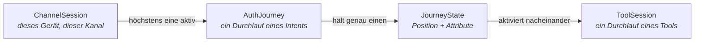

---

## 2) Die Intents

Vier **Entry-Intents** starten eine neue Sitzung auf dem `APP`-Kanal, `KC_SELECT_METHOD` ist der
Web-Kanal-eigene Login/Step-up-Einstieg, `REGISTER` ist zusätzlich auch über den Web-Kanal
erreichbar (Registrierung, s. u.); fünf weitere laufen innerhalb einer bestehenden Sitzung.
`CONFIRM_PEER_LOGIN` ist die eine Ausnahme, die **beides zugleich** ist (eigener Abschnitt unten):

| `AuthIntent` | Ziel | Einstieg |
|---|---|---|
| `FAST_ACCESS` | So schnell wie möglich in einen Login auf diesem Gerät — und so, dass es künftig wieder klappt | `POST /channels` (Default) |
| `REGISTER` | Bewusst frische Identifizierung, auch auf einem bereits verknüpften Gerät | `POST /channels` mit `intent=register` (App) bzw. `PATCH /kc/channels/{id}` mit `intent=register` (Web, s. u.) |
| `LOOKUP_LOGIN` | Bestehenden Account ohne Gerätebindung anmelden (klassischer Web-Login) | `POST /channels` mit `intent=lookup_login` |
| `KC_SELECT_METHOD` | Web-Kanal-Entry für Login/Step-up: alle kc-nutzbaren Tools als einen `selectMethod`-Schritt anbieten, Keycloak fährt die eigentliche Fallback-Logik selbst | Default-Entry-Intent des `KEYCLOAK`-Kanals ([05-api.md](05-api.md) Abschnitt 3) |
| `STEP_UP` | Niveau anheben | nur auf einem `AUTHENTICATED`-Kanal |
| `MANAGE_AUTH_METHODS` | Methoden hinzufügen oder entfernen | nur auf einem `AUTHENTICATED`-Kanal |
| `CONFIRM_PEER_LOGIN` | Einen wartenden `auth-qr`/`auth-qr-lookup`-Login des Web-Kanals bestätigen oder ablehnen | `POST /channels` mit `intent=confirm_peer_login` **oder** `POST /channels/{id}/peer-logins` auf einem bereits `AUTHENTICATED`-Kanal — beide laufen auf demselben Gate zusammen |
| `DELETE_ACCOUNT` | Konto unwiderruflich löschen | nur auf einem `AUTHENTICATED`-Kanal |
| `LOGOUT` | Bestätigtes Abmelden | nur auf einem `AUTHENTICATED`-Kanal |
| `RE_IDENTIFY` | Erneute Identifizierung als geteilte SubJourney | nie direkt, nur über `RequireSubJourney` |

`CONFIRM_PEER_LOGIN`s kalter Einstieg bietet nie eine Identifikation/Registrierung an: ist noch
kein Konto über `DeviceAccountLink` bekannt, bricht die Journey sofort ab (410) statt in
`FAST_ACCESS`s Fallback-Kette zu fallen — ein Peer-Approval darf nie der Anlass sein, sich frisch
eine Identität zu verschaffen. Ist ein Konto bekannt, gilt derselbe `STEP_UP`-Gate wie bei
`MANAGE_AUTH_METHODS` — reichte das Niveau aber schon *vor* diesem Durchlauf, verlangt
`CONFIRM_PEER_LOGIN` zusätzlich einen frischen Re-Proof wie `DELETE_ACCOUNT`, siehe eigener
Abschnitt unten.

`REGISTER` ist ein eigener Intent mit einer eigenen, vollständigen Journey (`RegisterState`) —
nicht nur, weil „ich will hier bewusst neu identifizieren" ein anderes Nutzerziel ist als „bring
mich rein" (es unterdrückt den `DeviceAccountLink`-Lookup und bietet nie eine bestehende
Kontobindung an), sondern auch strukturell: `FAST_ACCESS` läuft `REGISTER` als
`Transition.RequireSubJourney`-Voraussetzung, sobald es selbst identifizieren müsste — genau
dasselbe Muster wie bei `RE_IDENTIFY`. `REGISTER` erzwingt dabei **keinen** zweiten Account —
dieselbe KVNR findet weiterhin denselben Account wieder.

Der gewählte Intent wird auf der `ChannelSession` gemerkt. Das ist kein Detail: Resume und Abbruch
starten denselben Intent erneut, weshalb ein abgebrochener Lookup-Login wieder ein Lookup-Login
wird und nicht stillschweigend zur Registrierung umschlägt.

---

## 3) Die Journeys im Einzelnen

Gemeinsam für alle Diagramme: Ein Pfeil ist ein Übergang, ausgelöst durch ein `JourneyEvent`
(Tool abgeschlossen, Tool abgebrochen, Kind-Journey fertig). `abgelehnt` steht für „gescheitert
oder vom Nutzer verworfen, und in diesem Zustand ist nichts mehr übrig".

Terminale Zustände (`Finished`) sind eingezeichnet, existieren aber bewusst **nicht** als
persistierter Zustand: Das Ende einer Journey ist die Übergangsantwort `Transition.Authenticated`,
die sie abschließt. Ein zusätzlicher Endzustand wäre eine zweite Darstellung derselben Tatsache.

### `FAST_ACCESS`

Erst die Fallback-Kette vom bequemsten zum aufwendigsten Weg, danach die Pflichtzustände, die
dafür sorgen, dass der nächste Login wieder klappt.

`PreferredAuth` trägt genau die eine vorgeschlagene `toolId`; `AuthChoice`/`Enrolling` tragen
jeweils, was angeboten wurde und was bereits abgelehnt ist (Fallback- bzw. Pflichtsemantik, s. o.).
Beide sind geteilte Werttypen mit `RegisterState` (Abschnitt „REGISTER" unten): `FAST_ACCESS`
erreicht sie inline, ohne je zu identifizieren, weil beide Journeys, sobald ein Account feststeht,
dieselben zwei Fragen stellen — „reicht schon etwas Vorhandenes?" und „muss etwas neu eingerichtet
werden?". `Enrolling` trägt zusätzlich `emailObligation`, das `FAST_ACCESS` selbst nie setzt (immer
`false`) — nur ein Lauf, der über `RegisterState.Identifying` kam, kennt die E-Mail-Pflicht danach
(Abschnitt 8).

Fehlt ein Account ganz, oder ist jede seiner Methoden gerade abgelehnt worden, hat `FAST_ACCESS`
selbst nichts mehr anzubieten: Es identifiziert nicht selbst, sondern läuft `REGISTER`s eigene
Journey als `Transition.RequireSubJourney`-Voraussetzung, genau wie es das für `RE_IDENTIFY` tut
(Abschnitt „RE_IDENTIFY" unten). Nach deren Abschluss (`SubJourneyFinished`) prüft `Start` erneut
per `afterProof`, ob der Nachweis jetzt reicht — ein von `REGISTER` wiedererkannter, bereits
vollständig eingerichteter Account ist dann schlicht schon ausreichend.

Schließt selbst keine Einrichtung in `Enrolling` die Lücke (z. B. kein `enroll-*`-Tool mehr
verfügbar), fragt die geteilte `RE_IDENTIFY`-SubJourney (Abschnitt „RE_IDENTIFY") nach einer
Re-Identifizierung. Nach ihrem Abschluss prüft `Start` auf dieselbe Weise erneut.

In einem Fallback-Zustand sammelt `declined` die verworfenen Tools, bis nichts mehr übrig ist
und der nächste dran ist. In einem Pflichtzustand passiert das **nicht**: Wer dort
zurückgeht, wählt anders, gibt aber die Pflicht nicht auf — deshalb kommt das volle Angebot
zurück, das gerade verworfene Tool eingeschlossen.

### `REGISTER`

`REGISTER`s eigene Journey (`RegisterState`) nutzt `AuthChoice`/`Enrolling` als geteilte Werttypen
mit `FAST_ACCESS` (s. o.) und besitzt zusätzlich `Identifying`, `ConfirmDeviceRebind`,
`ConfirmingEmail` und `PasswordObligation` exklusiv. `FAST_ACCESS` läuft sie als Voraussetzung,
sobald es identifizieren müsste (s. o.); `REGISTER` unterdrückt dabei den
`DeviceAccountLink`-Lookup, den `FAST_ACCESS`s eigener `Start` sonst zuerst versucht.

Löst die frische Identifikation ein **anderes** Konto auf, als für dieses Gerät bereits
`DeviceAccountLink` hinterlegt ist ("Zweitaccount"), wird das nicht mehr still überschrieben:
`afterIdentification` erkennt den Konflikt als Allererstes, noch bevor irgendein
Anmeldeverfahren angeboten wird, und wechselt nach `ConfirmDeviceRebind` — der frühestmögliche
Punkt, an dem sowohl das neu identifizierte Konto als auch die bestehende Geräte-Bindung bekannt
sind. Zustimmung (`accept`) bindet das Gerät sofort um (`Action.LinkDevice`), löscht/deaktiviert
dabei das bisherige Kontos eigenes Geräte-Credential (`enroll-device`) für genau diesen
`bindingKeyRef` (`AccountDeletionService.revokeMethod`) und kehrt danach zu `afterIdentification`
zurück, das jetzt ohne Konflikt normal fortfährt. Ablehnung (`decline`) bricht die Journey über
`Transition.Cancel` regulär ab — kein Fehler, dieselbe Semantik wie ein explizites
`DELETE .../journey` — und lässt die bestehende Bindung unangetastet.

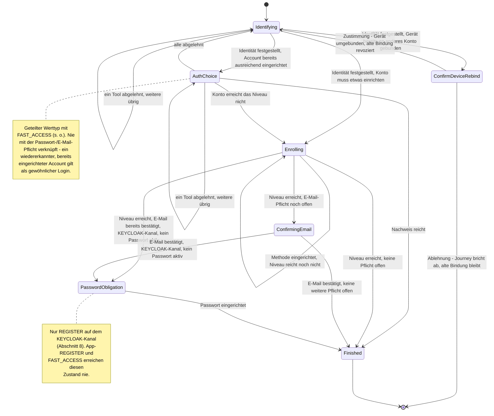

`Identifying` ist gleichzeitig Login-Notausgang (für `FAST_ACCESS`, per Sub-Journey) und
Registrierungseinstieg. Eine `REGISTRATION`/`LOGIN`-Trennung gibt es nicht, weil sie im
Zustandsmodell keinen eigenen Zustand hätte: Welches von beidem es war, entscheidet erst
`findOrCreateAccount` danach. Genau deshalb darf eine leere Kandidatenliste hier auch nicht
abbrechen — „keine Methode vorhanden" ist der Grund, aus dem `Identifying` als Login-Weg überhaupt
erlaubt wird. `Identified` wird deshalb überall dort, wo `REGISTER` es verarbeitet, immer als
„finde oder übernimm den Account" interpretiert (`AdoptIdentity`) — `RE_IDENTIFY` selbst nutzt
stattdessen `ConfirmIdentity`, weil dort der Account bereits bekannt ist.

**Web-Kanal (seit DPoP-demo-urt):** `REGISTER` ist neben `KC_SELECT_METHOD` ein zweiter,
Web-nutzbarer Entry-Intent — `PATCH /kc/channels/{channelSessionId}` mit `intent=register`
([05-api.md](05-api.md) Abschnitt 3). Komplett Keycloak-delegiert: kein natives
Registrierungsformular, `ident-fsc`/`ident-eid` und `enroll-*` laufen über dieselben
Web-Tool-Renderer wie jeder andere Schritt. Für diesen Kanal gilt zusätzlich eine dritte,
kanalgebundene Pflicht — `PasswordObligation`, Abschnitt 8.

Findet `Identifying` dabei einen **bereits existierenden** Account (KVNR-Treffer) mit schon
ausreichender aktiver Methode, läuft der Nachweis über `AuthChoice`/`afterProof`, nicht über
`Enrolling`/`afterEnrollment` — `PasswordObligation` (wie die E-Mail-Pflicht) greift dort
bewusst **nicht**: ein wiedererkannter, bereits eingerichteter Account wird wie ein gewöhnlicher
Login behandelt, keine rückwirkende Pflicht.

### `LOOKUP_LOGIN`

Anmelden ohne gepaartes Gerät: Der Nutzer nennt einen Identifikator (E-Mail) und weist ein
seiner Methoden nach. Angeboten wird der abgeleitete Satz aller `MethodRole.LOOKUP_AUTH`-Tools — nicht
`AuthPolicy.candidateTools`, das einen bereits aufgelösten Account bräuchte, den es hier noch
nicht geben kann.

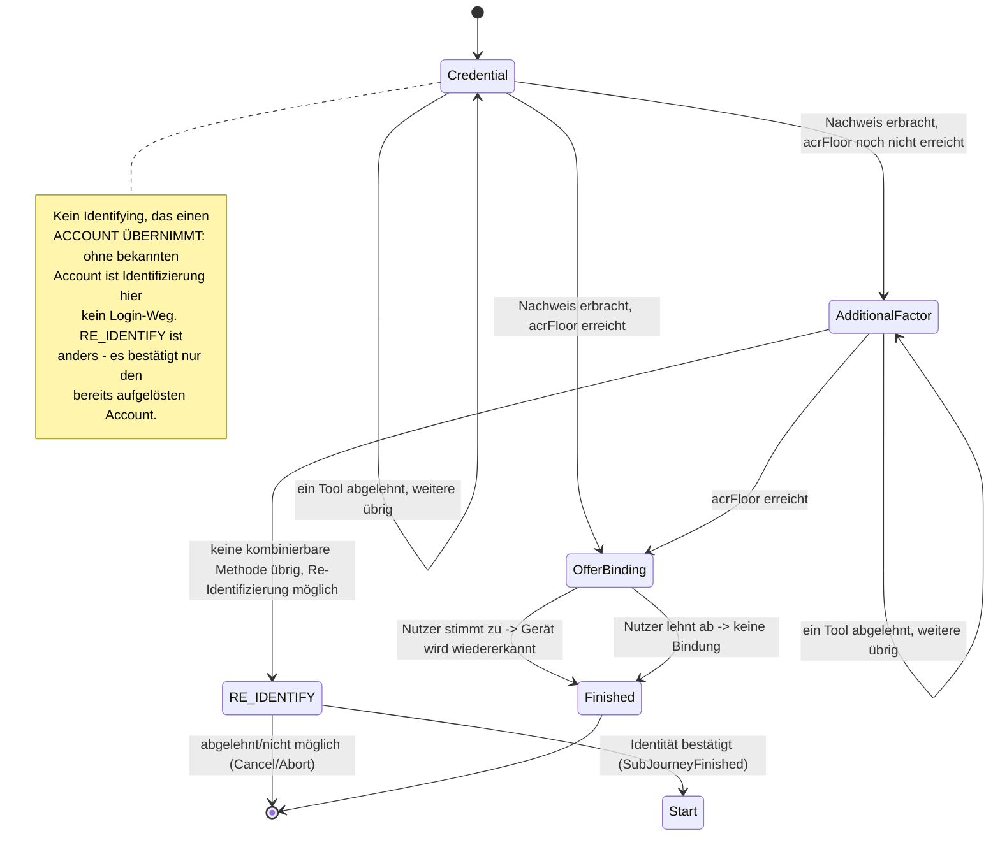

`OfferBinding` fragt ausdrücklich und optional: „Dieses Gerät für künftige Logins wiedererkennen?" —
und erfüllt zusätzlich das generische `AnswerableState`-Markerinterface (Abschnitt 5), damit die
Maschinerie diesen Zustand erkennt, ohne den konkreten Typ `LookupLoginState.OfferBinding` selbst
zu kennen.

Die Gerätewiedererkennung (`DeviceAccountLink`) entsteht hier **nur** nach Zustimmung. Sie ist
eine dauerhafte Zuordnung Gerät → Account und darf nicht als Nebenwirkung eines Logins entstehen,
den der Nutzer gerade deshalb gewählt hat, weil er ohne Gerätebindung auskommen wollte.

`AdditionalFactor` erzwingt die eigene `acrFloor` des Kanals (Abschnitt 8) — ohne sie würde ein mit
`requiredAcr: loa3` eröffneter Kanal auf einem einzigen `loa1`-Faktor authentifiziert. Bleibt danach
keine kombinierbare Methode übrig, springt die Strategie in die geteilte `RE_IDENTIFY`-SubJourney
(Abschnitt „RE_IDENTIFY") statt selbst eine Re-Identifizierung anzubieten. Nach ihrem Abschluss
prüft `Start` erneut per `settleOrRaise`. Anders als bei `enroll-*` wächst dabei **keine** dauerhafte
Credential auf einem ungeprüften Gerät — Re-Identifizierung bleibt deshalb erlaubt, obwohl dieser
Intent bewusst **keinen** Enrollment-Fallback hat.

**Enumeration-Schutz**: Eine unbekannte E-Mail liefert exakt dieselbe Antwortform wie ein korrekt
aufgelöster Account mit fehlgeschlagenem Nachweis — nie eine eigene Fehlerform, auch nicht im Timing
der Demo-Werte ([API](05-api.md)). Bewusst nicht weiter gehärtet (kein künstliches
Timing-Padding); in einem Produktivsystem wäre das der nächste Ausbau.

### `KC_SELECT_METHOD`

Der Default-Entry-Intent des `KEYCLOAK`-Kanals für Login/Step-up ([05-api.md](05-api.md)
Abschnitt 3, `ADR-8` in [12-entscheidungen.md](12-entscheidungen.md)) — `REGISTER` ist der zweite,
für die Registrierung (Abschnitt "REGISTER" oben). Ein einziger Zustand, der unconditional alle
kc-nutzbaren Tools als einen `selectMethod`-Schritt anbietet — keine Fallback-Kette, kein
Enrollment-Angebot, keine Sufficiency-Prüfung VOR dem Anbieten. Das ist bewusst so: Keycloaks
eigene, native Flow-Konfiguration (Conditional-LoA-Subflows) entscheidet bereits, OB und WELCHES
Niveau angefragt ist; diese Strategie beantwortet nur „was könnte hier noch etwas beweisen".

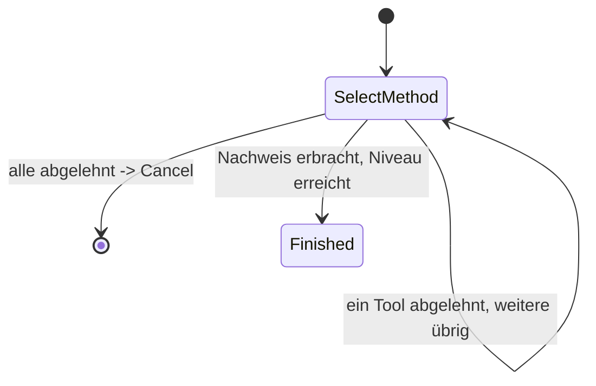

Bedient zwei Web-Kanal-Fälle mit derselben Zustandsform, unterschieden nur durch
`accountAlreadyKnown`:

- **Initialer Login** (`ctx.account` ist `null`): löst den Account selbst über Lookup-Login-Tools
  auf (`CandidateTools.forLookupLogin`) — nie über Identifikation, die ein reines App-Kanal-Konzept
  ohne Keycloak-Äquivalent ist.
- **Step-up** (Account bereits auf dem Kanal gesetzt, bevor die Journey beginnt — Keycloak kennt
  den Nutzer schon über sein eigenes natives Login): nur Auth-Tools für diesen Account, wie
  `FAST_ACCESS` ein wiedererkanntes, aber unbewiesenes Gerät behandelt.

Jedes Ereignis (`Started`, `EvidenceReported`, `ActionCompleted`) prüft dieselbe Sufficiency neu
und baut die Kandidatenliste komplett frisch auf — nötig, weil eine Evidence (natives Keycloak-
Verfahren, oder RestoreData aus einem früheren Flow-Durchlauf) schon vor dem allerersten Angebot
vorliegen kann.

### `STEP_UP`

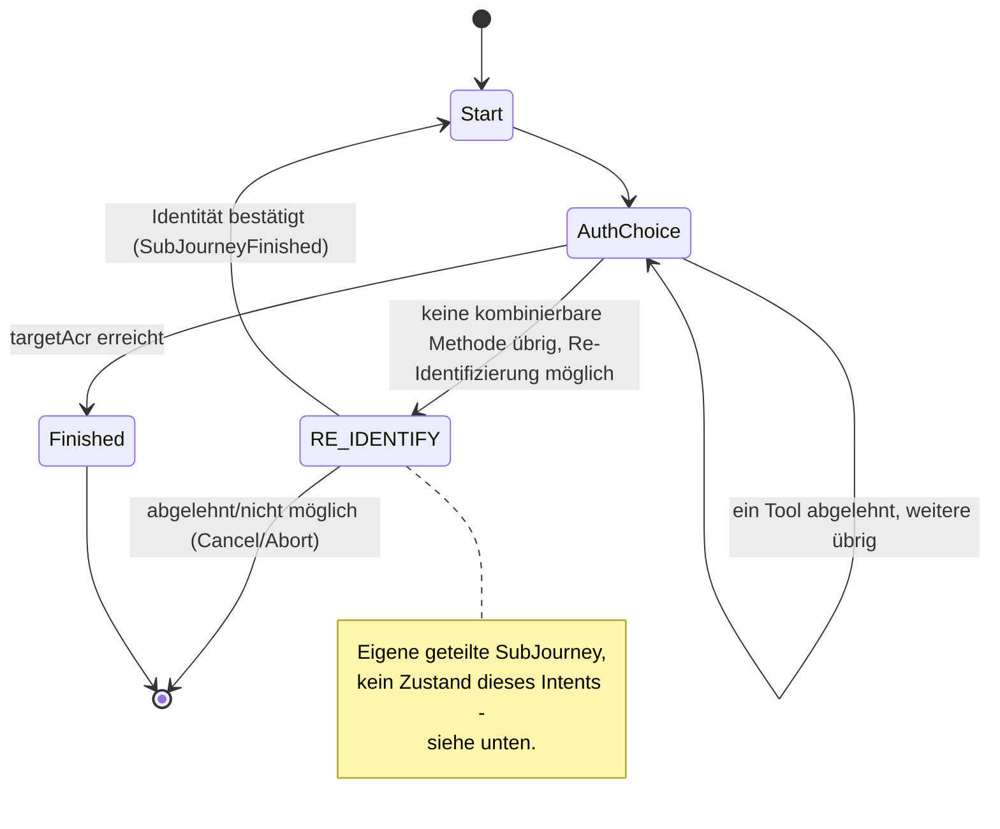

Jeder Zustand trägt `targetAcr` (das Ziel dieses Laufs, nicht zu verwechseln mit der dauerhaften
Untergrenze des Kanals, Abschnitt 8) und `startingAcr`; `AuthChoice` zusätzlich Angebot und
Ablehnungen wie oben.

Schließt keine aktive Methode die Lücke — z. B. ein Account mit genau einer aktiven Methode hat
nach einem frischen gerätegebundenen Login (nur `loa1`) sonst keinen Weg zu `loa2`, es gibt keine
zweite Methode zum Kombinieren —, springt die Strategie in die geteilte `RE_IDENTIFY`-SubJourney
statt selbst eine Re-Identifizierung anzubieten (Abschnitt „RE_IDENTIFY" unten). Nach ihrem
Abschluss (`SubJourneyFinished`) prüft `Start` per `finishOrContinue` erneut, ob der Nachweis jetzt
reicht.

### `RE_IDENTIFY`

Geteilt von `FAST_ACCESS`/`LOOKUP_LOGIN`/`STEP_UP` (jeweils oben verlinkt) — eine einzige
Implementierung statt drei fast identischer, damit auch nur an einer Stelle entschieden wird, was
eine frische Identifizierung hier bedeuten darf. Nie ein Entry-Intent, nur über
`Transition.RequireSubJourney` erreichbar.

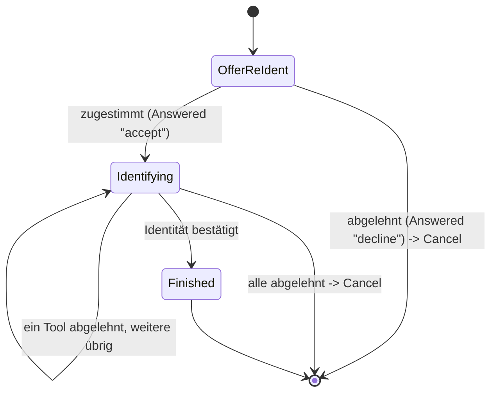

`OfferReIdent` fragt immer zuerst per generischem `AnswerableState`-Prompt („Erneut
identifizieren?") — Re-Identifizierung ist eine schwerere Aktion als ein weiteres Verfahren
auszuwählen, also nie ein stiller Rückfall. `Identifying` trägt `targetAcr`/`startingAcr` sowie
Angebot und Ablehnungen wie jeder andere Fallback-Zustand; `ident-fsc`/`ident-eid` erreichen
`loa2`/`loa3` im Alleingang.

`startingAcr` ist der einzige Hinweis, den `onCancel` hier hat, um bei Ablehnung korrekt
zurückzufallen: `"none"` bedeutet, der aufrufende Kanal war noch gar nicht authentifiziert
(`FAST_ACCESS`/`LOOKUP_LOGIN`) → `ANONYMOUS`; ein echtes Niveau bedeutet, der Kanal war bereits
`AUTHENTICATED` (`STEP_UP`) → genau das bleibt es auch, eine abgelehnte Re-Identifizierung darf eine
schon laufende Session nicht abmelden.

`transition()` liefert für ein erfolgreiches `Identified` immer `ConfirmIdentity`, nie
`AdoptIdentity`: Die identifizierte Person muss zum bereits bekannten Account passen (`409` bei
Abweichung) — unabhängig davon, welcher der drei Intents diese SubJourney angefordert hat, sonst
könnte eine schwache Session eine fremde Identität einschleusen.

### `MANAGE_AUTH_METHODS`

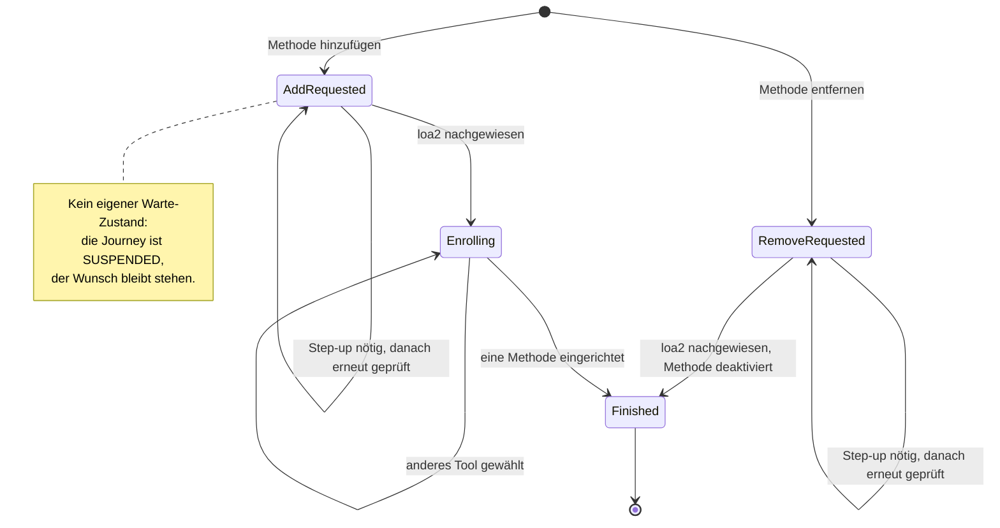

`AddRequested`/`RemoveRequested` (Letzterer trägt die `methodInstanceId`) sind zugleich der Wunsch
vor der loa2-Prüfung und der Parkzustand während eines dafür nötigen Step-ups; `Enrolling` trägt
wie gewohnt Angebot und Ablehnungen.

`MANAGE_AUTH_METHODS` ist der einzige Intent ohne Policy-Ziel: **ein** erfolgreiches Enrollment beendet ihn,
unabhängig vom erreichten Niveau — der Kanal war ja bereits `AUTHENTICATED`. Um ein zweites
Methode hinzuzufügen, startet man eine neue Journey.

Es gibt bewusst **keinen** eigenen „wartet auf Step-up"-Zustand: Die Journey bleibt schlicht in
`AddRequested`/`RemoveRequested` stehen, während die Kind-Journey läuft. Dass gewartet wird, sagen
bereits `JourneyLifecycle.SUSPENDED` und die `parentJourneyId` der Kind-Journey — eine zweite
Kopie derselben Information könnte nur auseinanderlaufen. Genau dieses Parken ist der Grund,
weshalb der Wunsch den Step-up überlebt: Nach dessen Abschluss wird derselbe Zustand erneut
ausgewertet, prüft die Vorbedingung neu und führt aus, was ursprünglich verlangt war.

Die `loa2`-Vorbedingung selbst folgt derselben Anti-Selbsteskalations-Logik wie die
`enrolledUnderAcr`-Deckelung (Abschnitt 8): Eine gekaperte `loa1`-Session darf nicht aus eigener
Kraft Methoden hinzufügen oder entfernen. Das Entfernen prüft zusätzlich, dass der Account
danach die Untergrenze des Kanals noch erreichen kann (`409`, Selbstsperrschutz).

### `CONFIRM_PEER_LOGIN`

Ein App-Kanal bestätigt oder lehnt einen Web-Login ab, den eine `auth-qr`/`auth-qr-lookup`-
Aktivierung des Web-Kanals anstößt — „mit dem Handy einloggen" per QR-Code, analog zu WhatsApp
Web/GitHub-CLI-Device-Flow. Zwei Eigenschaften unterscheiden das von jedem anderen Intent hier:
Zwei Kanäle sind an einem Tool-Durchlauf beteiligt (bislang lebt ein `ToolOutcome` immer nur
innerhalb der `ChannelSession`, die es aktiviert hat), und der App-Nutzer bestätigt fremdes
Handeln statt eigenes nachzuweisen — strukturell etwas anderes als Identifikation, Enrollment oder
Auth. Trotzdem bleibt der Journey-Vertrag selbst unverändert: `confirm-qr-login`s `ToolOutcome`
wirkt nur auf die EIGENE `AuthJourney` (`Action.RecordApproval`); die eigentliche
Kanal-übergreifende Kopplung — welchen Web-Login die Bestätigung eigentlich betrifft — lebt
komplett im `auth_qr`-Modul, über eine gemeinsame `QrLoginRequest`-Zeile, die beide Seiten
(dieselbe DB, derselbe Orchestrator-Prozess) lesen/schreiben. Kein Cross-Channel-Sonderfall im
Journey-SPI nötig.

`CONFIRM_PEER_LOGIN` ist **Entry-Intent und Aufsatz auf einer authentifizierten Session zugleich**
(Abschnitt 2) — beide Wege landen auf demselben `Requested`:

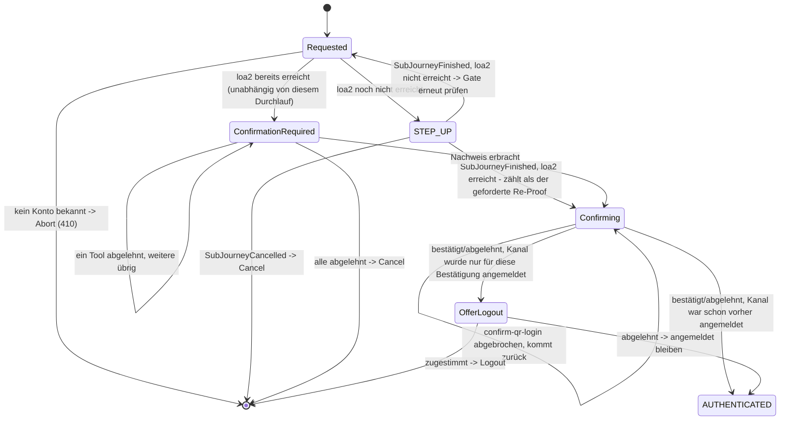

Drei Startzustände, eine Zustandsmenge:

1. **Kanal noch nicht authentifiziert**: NUR der geräte-gebundene Login-Teil von `FAST_ACCESS`s
   Fallback-Kette (`DeviceAccountLink` bekannt → dessen `IDENTIFIED_AUTH`-Kandidaten bis `loa1`,
   über den `STEP_UP`-Zweig oben) — **keine** Identifikation/Registrierung. Ein Peer-Approval darf
   nie dazu führen, dass jemand ohne bestehenden, bereits identifizierten Account sich per
   Registrierung frisch eine Identität verschafft, nur um einen fremden Web-Login zu bestätigen.
   Ohne `DeviceAccountLink` (kalter Start, z. B. App gerade erst installiert) endet die Journey
   sofort ohne Angebot — der Nutzer muss sich zuerst ganz regulär einrichten.
2. **Kanal authentifiziert, aber unter `loa2`**: derselbe `STEP_UP`-Gate wie bei
   `MANAGE_AUTH_METHODS`. Der dabei erbrachte Nachweis zählt bereits als der in Schritt 3 verlangte
   frische Faktor — kein redundanter zweiter Re-Proof direkt danach (`STEP_UP --> Confirming` oben,
   geprüft über `SubJourneyFinished.achievedAcr`, nicht bloß angenommen — ein künftiger zweiter
   Sub-Journey-Typ oder ein zu kurz gegriffener Step-up darf nie stillschweigend als ausreichend
   gelten).
3. **Kanal bereits bei `loa2` oder höher** (unabhängig von diesem Durchlauf, Evidenz unbekannten
   Alters): **nicht** direkt weiter — genau wie bei `DELETE_ACCOUNT` verlangt dieser Fall
   unconditionell einen frischen Re-Proof mit einem beliebigen aktiven Faktor
   (`CandidateTools.forReconfirmation`, jedes Niveau reicht), bevor `confirm-qr-login` angeboten
   wird (`ConfirmationRequired`). Eine bereits authentifizierte, aber evtl. gekaperte Sitzung darf
   nicht allein auf Basis vorhandener, evtl. alter Evidenz einen fremden Login bestätigen. Der
   Re-Proof wird — wie bei `DELETE_ACCOUNT` — nicht als `MethodEvidence` festgehalten, sondern
   autorisiert nur diese eine Bestätigung.
4. `confirm-qr-login` aktivieren (`Confirming`, einziger Kandidat). Backing out (`Abandoned`) ist
   kein Ablehnen der Anfrage, nur ein Zurückkommen zum selben Kandidaten — wie bei
   `MANAGE_AUTH_METHODS`s `Enrolling`.
5. Ziel erreicht, sobald das Tool `Completed`/`Failed` meldet — keine Rückkehr in die
   Kandidatenliste danach, die Journey endet mit diesem einen Tool. War der Kanal vor diesem
   Durchlauf noch nicht authentifiziert, fragt `OfferLogout` explizit, ob er das jetzt bleiben soll
   (`AnswerableState`, wie bei `LOOKUP_LOGIN`s Gerätebindungs-Angebot) — ein Kanal, der nur für
   genau diese eine Bestätigung angemeldet wurde, bleibt nicht kommentarlos angemeldet.

Der Pairing-Code selbst geht **nicht** über den Kanal-Erzeugungsvertrag — er ist ein ganz normales
Eingabefeld des ersten `confirm-qr-login`-Schritts, genau wie `kvnr`/`fsc` bei `ident-fsc`. Der
QR-Code (bzw. der Demo-Link) kodiert einen Deep-Link, der App-seitig `intent=confirm_peer_login`
setzt und `pairingCode` vorbefüllt an das Tool durchreicht ([Frontend](10-frontend.md)).

### `DELETE_ACCOUNT`

Self-Service-Löschung des eigenen Accounts. Die Bestätigung kommt immer zuerst — sie darf nie
hinter einem Step-up versteckt sein, den der Nutzer vielleicht gar nicht durchlaufen will.

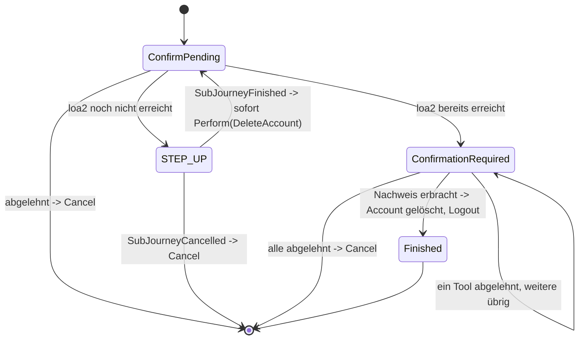

`ConfirmPending` ist ein `AnswerableState` mit `destructive: true`-Prompt. Nach Zustimmung greift
dasselbe loa2-Gate wie bei `MANAGE_AUTH_METHODS`. Musste ein Step-up laufen, zählt der dabei
erbrachte Nachweis bereits — kein redundanter zweiter Nachweis. Der Übergang am Ende ist
`Transition.Perform(Action.DeleteAccount(accountId), resumeState = ConfirmPending)`, aufgelöst zu
`Transition.Logout` sobald die Journey mit `ActionCompleted` fortgesetzt wird: Account löschen,
Kanal beenden. Der Nachweis in `ConfirmationRequired` läuft aus demselben Grund direkt in
`Action.DeleteAccount`, nie über `Action.AcceptProof` — er autorisiert genau diese eine Löschung,
nie eine dauerhafte `MethodEvidence` (Abschnitt 5).

### `LOGOUT`

Bestätigtes Abmelden — ein einzelner Prompt, kein Tool-Lauf.

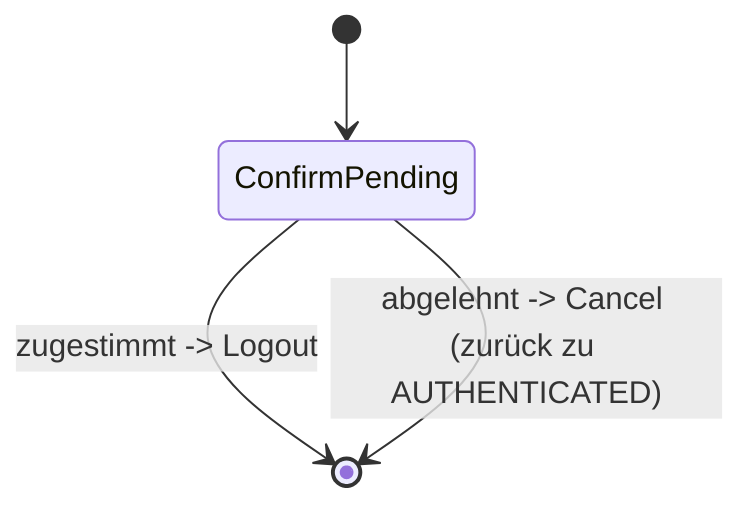

`ConfirmPending` ist wie bei `DELETE_ACCOUNT` ein `AnswerableState`. Zustimmung liefert
`Transition.Logout`; Ablehnung liefert `Cancel`, was den Kanal auf `AUTHENTICATED` zurücksetzt.

### Lebenszyklus, unabhängig vom Intent

Die intent-eigenen Zustände beschreiben den Weg; `JourneyLifecycle` beschreibt, ob die Journey
überhaupt noch läuft.

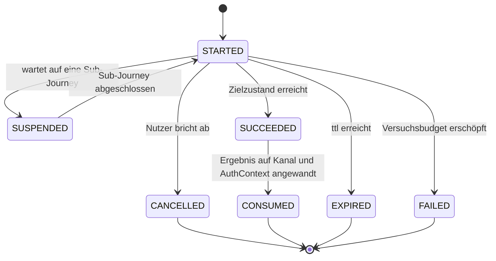

---

## 4) `next` folgt aus dem Zustand

Alle Zustände erfüllen einen gemeinsamen Vertrag: Jeder weiß, welche `toolId`s hier aktivierbar
sind (leer für terminale und wartende Zustände), ob und welches Tool gerade läuft, und welche
orchestrator-eigene Seite (`next.context`/`next.step`) er anzeigt, falls keine Auswahl nötig ist.

Daraus folgt **eine** Ableitungstabelle:

| `active` | `activatable()` | `next` |
|---|---|---|
| gesetzt | — | `type="tool"`, Schritt der laufenden `ToolSession` |
| null | genau ein Eintrag | `type="tool"`, `startStep` des Descriptors |
| null | mehrere | `type="orchestrator"`, Auswahlseite |
| null | leer | `type="orchestrator"`, orchestrator-eigene Seite (Bestätigung, Abschluss) |

Die Prüfung „darf dieses Tool jetzt aktiviert werden?" ist dieselbe Funktion — Mitgliedschaft in
`activatable()`. Beide Fragen an einer Stelle beantwortet heißt: Sie können nicht auseinander
driften, und ein Zustand, der ein Tool nicht anbietet, kann es auch nicht versehentlich zulassen.

`next.type` ist `"tool"` oder `"orchestrator"`. Beide Werte beantworten dieselbe Frage: Wem
gehört der nächste Screen, und welchen Endpunkt ruft der Client als nächstes.

Bei genau einem Kandidaten entfällt die Auswahlseite — bei einer Wahl ist nichts zu wählen.

---

## 5) Die zwei Verträge: SPI und API

### `IntentStrategy` — der SPI

Symmetrisch zu `tool_spi`: dort beschreiben sich Tools selbst, hier beschreiben sich Intents
selbst. Jede Strategie ist ein Moore-Automat für ihren eigenen Zustandstyp: eine
Übergangsfunktion `transition(state, event, ctx)` (klassische Automatensprache statt
Business-Vokabular — `transition` ist wörtlich `δ`), dazu `initialState(ctx)` (wo eine direkt
eingetretene Journey beginnt) und `cancelledTo` (wohin der Kanal bei Abbruch zurückfällt). Eine
Sub-Journey mit vorgegebenem Zielniveau statt dem des Kanals beginnt dagegen nicht über die SPI,
sondern über die Companion-Factory des jeweiligen Zustands (`StepUpState.forSubJourney(...)`,
`ReIdentifyState.forSubJourney(...)`) — nur `STEP_UP`/`RE_IDENTIFY` sind je als Sub-Journey
gemeint, das gehört also nicht in die generische SPI, die jede Strategie implementiert.

Das war nicht immer eine Methode: Bis zu docs/ideen/journey-strategie-vereinheitlichung.md liefen
„was bedeutet ein abgeschlossenes Tool" (`interpret()`) und „wie reagiere ich auf ein Ereignis"
(`decide()`) über zwei unabhängige Pfade mit je eigener Effekt-Ausführung — eine Altlast aus einer
Zeit, in der es den heutigen `Perform`-Mechanismus (unten) noch nicht gab. Beide Fragen sind
inhaltlich dieselbe Übergangsfrage, nur zu verschiedenen Ereignissen befragt; `transition()` ist
seither die einzige Methode, die überhaupt entscheidet.

Ein `JourneyEvent` ist, was der Journey gerade passiert ist:

| Event | Bedeutung |
|---|---|
| `Started` | Journey wurde eben angelegt, braucht ihr erstes Angebot |
| `Completed(tool, outcome)` | ein Tool wurde erfolgreich abgeschlossen — was das bedeutet, entscheidet die Strategie hier, nicht mehr in einer separaten Methode |
| `Abandoned(tool)` | „Zurück"/„Wechseln": das aktivierte Tool wurde ohne Abschluss verworfen |
| `ActionCompleted` | die `Action` eines eigenen `Perform`-Übergangs (unten) ist fertig ausgeführt, mit frisch hergeleitetem `JourneyContext` |
| `SubJourneyFinished(intent, achievedAcr)` | eine als Vorbedingung gestartete Kind-Journey ist fertig |
| `Answered(answer)` | eine ausdrückliche Antwort auf einen `AnswerableState` statt eines Tool-Laufs — `answer` ist ein String, nicht `Boolean`: eine künftige Aktion kann mehr als zwei Antworten haben |

Eine `Transition` ist, was als Nächstes passieren soll:

| Transition | Bedeutung |
|---|---|
| `To(state)` | weiter zu diesem Zustand — der Zustand trägt sein Angebot bereits selbst, es gibt kein separates „biete diese Tools an" |
| `RequireSubJourney(intent, seedWith, resumeWith)` | erst `intent` laufen lassen, gestartet bei `seedWith` (die anfordernde Strategie baut das selbst über die Companion-Factory des Ziel-Zustands, z. B. `StepUpState.forSubJourney(...)` — dieselbe Idiomatik wie `resumeWith`), danach hier bei `resumeWith` weiter |
| `Authenticated` | Ziel erreicht, Journey wird konsumiert |
| `Cancel` | Nutzer gibt auf — endet wie ein ausdrückliches Abbrechen, nicht als Fehler |
| `Perform(action, resumeState)` | `Action` ausführen, danach die Journey bei `resumeState` mit `ActionCompleted` fortsetzen |
| `Logout` | Kanal endgültig beenden (`LOGGED_OUT`, terminal) |
| `Abort(reason)` | es geht gar nicht weiter (410) — nie bloß „keine Kandidaten mehr" |

`Perform` trennt Entscheidung von Wirkung, aber anders als sein Vorgänger `Execute` bleibt es NICHT
bei der Entscheidung stehen: `JourneyService` führt `action` aus, leitet den `JourneyContext`
danach frisch her und ruft `transition(resumeState, ActionCompleted, frischerCtx)` erneut auf —
selbst rekursiv, solange eine Strategie ihrerseits wieder `Perform` liefert. Genau diese Rekursion
ist der eine Mechanismus, der frühere Sonderpfade ersetzt:

- Ein abgeschlossenes Tool: `is Completed -> Perform(actionFürOutcome, resumeState = state)`,
  gefolgt von `is ActionCompleted -> <die alte Nachfolgelogik>` im selben Zustand — dieselbe
  Zwei-Schritt-Form für jeden Intent, der überhaupt Tools anbietet.
- `Action.LinkDevice`/`Action.Remove`/`Action.DeleteAccount`: eine Strategie liefert `Perform`
  statt selbst zu binden/zu löschen (`LookupLoginState.OfferBinding`, `ManageAuthMethodsState.
  RemoveRequested`, `DeleteAccountState.ConfirmationRequired`).
- RestoreData ([05-api.md](05-api.md) Abschnitt 3): kein `JourneyEvent` mehr, sondern der
  Anfangs-Übergang der Maschine — siehe unten.

`Action` ist der Name für das, was früher `Effect` hieß:

| Action | Bedeutung |
|---|---|
| `AdoptIdentity(tool, outcome)` | `FAST_ACCESS`/`REGISTER`: Account finden oder anlegen, dauerhafte Identifikations-Historie |
| `ConfirmIdentity(tool, outcome)` | `STEP_UP`/`MANAGE_AUTH_METHODS`/`RE_IDENTIFY`: muss zum bereits bekannten Account passen, sonst `409` |
| `AdoptCredential(tool, outcome, bindDevice)` | eine neue Methode wurde eingerichtet |
| `AcceptProof(tool, outcome, useOutcomeAccount, bindDevice)` | ein Nachweis wurde erbracht; `useOutcomeAccount`: nur `LOOKUP_LOGIN`/`KC_SELECT_METHOD` (bei noch unbekanntem Account) trauen einem Tool zu, den Account selbst aufzulösen |
| `ApplyRestoredEvidence(source, methods)` | siehe „RestoreData als Anfangs-Übergang" unten |
| `Remove(methodInstanceId)` | eine Methode deaktivieren — die Maschine, nicht die Strategie, weist Selbstsperrung ab |
| `LinkDevice(accountId)` | das aktuelle Gerät verknüpfen |
| `DeleteAccount(accountId)` | Konto unwiderruflich löschen — `JourneyService` prüft `REQUIRED_ACR` unmittelbar vor der Ausführung selbstständig gegen die aktuelle Evidence nach |

Die ersten vier `Action`-Varianten tragen jetzt `tool`/`outcome` selbst (statt sie separat über das
auslösende `JourneyEvent.Completed` mitzuführen) — dieselbe zentrale Asymmetrie wie zuvor bleibt im
Typsystem sichtbar: Derselbe `ident-fsc`-Abschluss heißt in `FAST_ACCESS` „Account finden oder
anlegen" (`AdoptIdentity`) und in `STEP_UP`/`MANAGE_AUTH_METHODS`/`RE_IDENTIFY` „bestätige den
bekannten Account, sonst `409`" (`ConfirmIdentity`). Enthalten ist nur, was sich je Intent
tatsächlich **unterscheidet**; alles Mechanische — `personId`, `enrollmentRef`, `amr`,
`achievedAcr` — liest die Maschinerie direkt vom mitgeführten `outcome` ab.

`bindDevice` macht die Gerätewiedererkennung zu einer sichtbaren Entscheidung je Intent:
`FAST_ACCESS`/`REGISTER` setzen `true`, `LOOKUP_LOGIN` setzt `false` bis zur Zustimmung im
`OfferBinding`-Zustand (dort dann per `Perform(LinkDevice(accountId), resumeState = OfferBinding)`).

Zentral und für Strategien nicht erreichbar bleiben: Nachweis in den `AuthContext` übernehmen,
`SessionEvent`/Journey-Log schreiben, und die Deckelung `min(achievedAcr, enrolledUnderAcr)`.

Entscheidungen dahinter:

- **Ein Übergang statt vier — jetzt fünf.** „Erstes Angebot", „nach einem abgeschlossenen Tool",
  „nach einem Abbruch", „Rückkehr aus einer Sub-Journey" und „eine eigene Aktion ist fertig"
  beantworten alle dieselbe Frage. Sie sind ein `next` mit einem Event-Parameter.
- **Die Strategie liefert `Transition`, nicht `Next`.** Sonst baut jeder Intent die
  Skip-if-single-Candidate-Regel nach. Eine gemeinsame Maschinerie macht aus der `Transition` den
  neuen Zustand und daraus `next`.
- **Es gibt kein eigenes „biete diese Tools an".** Ein Zustand trägt sein Angebot bereits selbst
  (`activatable()`), also *ist* `To` auf diesen Zustand das Angebot. Eine zusätzliche
  `Offer`-Variante wäre dieselbe Information zweimal.
- **`Abort` ist eine Entscheidung der Strategie**, kein Automatismus der Kandidatenauflösung.
  Eine leere Kandidatenliste muss „nächster Zustand" bedeuten dürfen, sonst ist eine
  Fallback-Kette gar nicht formulierbar.
- **Die Strategie bekommt nie Services**, nur einen lesenden `JourneyContext` (Account, Evidence,
  Untergrenze, Gerätebezug, Katalogabfragen). Sie entscheidet, sie wirkt nicht — auch nicht über
  den Umweg von `Perform`: die Ausführung selbst bleibt allein bei `JourneyService`.

Welche Tools für ein Angebot überhaupt in Frage kommen, beantwortet `CandidateTools` — abgeleitet
aus den Descriptors, die die Module registrieren. Dort steht keine einzige `toolId`; ein neues
Tool tritt einem Angebot bei, indem es seine Rolle deklariert.

### RestoreData als Anfangs-Übergang

Eine als Vorbedingung mitgelieferte Evidence ([05-api.md](05-api.md) Abschnitt 3, Web-Kanal
RestoreData) ist keine fachliche Entscheidung einer Strategie, sondern reine Aufrufer-Information
— „kam mit dieser Journey eine Aktion mit, die zuerst laufen muss". Statecharts (Harel/UML)
unterscheiden dafür den **Anfangs-Pseudostate** vom **Anfangs-Übergang** (Pseudostate → `q0`):
dieser Übergang darf eine Aktion tragen, ist aber mechanisch, unconditional und gehört keinem
Zustand.

Genau das ist `JourneyService.start()`s `seedAction`-Parameter: `Action.ApplyRestoredEvidence`
läuft, BEVOR `IntentStrategy.initialState()` überhaupt aufgerufen wird — kein `JourneyEvent`, das
eine Strategie je sähe, sondern ein geloggter `"Entry"`-Übergang, den `JourneyService` selbst
ausführt. Weil die Evidence damit schon vor dem ersten Angebot vorliegen kann, darf `Started`
selbst nicht mehr blind das erste Angebot bauen — jede Strategie, die hier eine Sufficiency-Prüfung
braucht (z. B. `KcSelectMethodStrategy`), macht sie auf `Started` genauso wie auf jedem anderen
Nachweis.

### `JourneyApi` — was Tool-Controller sehen

Fünf Operationen — `activate` (prüft und übernimmt eine `ToolSession`), `applyOutcome`, `abandon`,
`cancel`, `nextOf` — sind die **einzige** Berührungsfläche der Tool-Controller mit dem
Journey-Modell: kein Setzen von Routing-Feldern, kein Typ-Switch auf einen Intent, keine
Entscheidung darüber, welches Tool laufen darf. `Step` ist dabei schlicht `next` plus die Daten,
die dieser Schritt zum Rendern braucht.

Zwei Aktionen, die der Client sauber auseinanderhalten muss: `abandon` lehnt den aktuellen
**Zustand** ab und führt die Journey weiter (`DELETE /tools/{toolSessionId}/{toolId}`); `cancel`
gibt die **Journey** auf und startet den Entry-Intent neu (`DELETE .../journey`). Wer nur
letzteres anbietet, lässt den Nutzer in einem Fallback-Zustand im Kreis laufen.

---

## 6) Sub-Journey

`Transition.RequireSubJourney` legt eine eigene `AuthJourney` mit `parentJourneyId` an. Bei deren
`Finished` reaktiviert die Maschinerie den Parent mit `resumeWith`.

Invariante: pro Kanal ist immer genau **eine** Journey aktiv — die Kind-Journey läuft, der Parent
ist `SUSPENDED`, nicht parallel. Der Step-up behält dadurch seine eigenen
`startingAcr`/`achievedAcr` und sein eigenes Audit, statt als Umleitung von Hand nachgebaut zu
werden.

---

## 7) Versuchsbudget

`attemptBudget` liegt auf der `AuthJourney`, nicht auf der `ToolSession`. Jedes `Failed` zieht ab,
unabhängig davon, in welchem Zustand oder in welchem Tool. Bei `0` endet die **ganze Journey**
(`410`) — auch wenn noch Zustände übrig wären.

Das ist eine Sicherheitsanforderung: Sobald erschöpfte Versuche einen Zustand weiterrücken statt zu
terminieren, wird Brute-Force entlang der Kette billiger. Ein tool-lokaler Zähler kann das
strukturell nicht abdecken.

Die Retry-Regel selbst: Ein fehlgeschlagener Versuch mit verbleibendem Budget ist **kein**
HTTP-Fehlerfall, sondern verhält sich wie fehlende Eingabe (`200` plus Navigation, Grund in
`stepData.error`). Erst das erschöpfte Budget endet terminal (`410`) — HTTP-Fehlercodes
signalisieren gestörte Abläufe, nicht erwartbare Eingabefehler ([API](05-api.md)).

Nicht gelöst und ausdrücklich offen: Brute-Force-Schutz auf Kontoebene über mehrere Journeys
hinweg. Das Budget ist journey-lokal und dazu orthogonal.

---

## 8) AuthPolicy: Mehr-Faktor-Entscheidung

Die Strategien fragen die `AuthPolicy`, statt selbst zu entscheiden, was genug ist — sie ist die
einzige Stelle mit diesem Wissen: ob vorhandene Nachweise reichen (`isSatisfied`), welches Niveau
sich aus ihnen ergibt (`resolveAcr`), welche Tools als Nachweis, Re-Identifizierung oder Enrollment
noch in Frage kommen, und ob ein Account ein Niveau grundsätzlich erreichen kann
(`canAccountReach`) — unabhängig davon, ob die aktuelle Session das schon bewiesen hat.

Zwei Bedingungen müssen zusammen erfüllt sein:

1. **Niveau**: `resolveAcr(evidence) >= requiredAcr`. Die Abbildung von `amr`-Kombinationen auf
   `acr`-Werte ist fachlich/regulatorisch offen und hier bewusst nicht endgültig festgeschrieben.
   RFC 8176 definiert eine IANA-Registry für `amr`-Werte (`pwd`, `otp`, `hwk`/`swk`, `user`,
   `face`, `fpt`, `mfa`, …), aber welche Kombination welches Vertrauensniveau (eIDAS/BSI/NIST je
   nach Kontext) ergibt, ist damit nicht festgelegt. Die `amr`-Strings dieses Projekts (`sms`,
   `password`, `email`, `fsc`, `device`, `pin`, `biometric`) folgen deshalb einer eigenen,
   methodennamen-nahen Konvention.
2. **Faktorvielfalt**: Für MFA-Niveaus mindestens zwei **verschiedene** Faktorarten — gezählt wird
   die Vereinigung der `factorTypes` über alle abgeschlossenen Tools, nie die Tool-Anzahl. Ein
   einzelnes Tool, das selbst schon zwei Faktorarten meldet (z. B. ein Passkey mit User
   Verification), erfüllt MFA im Alleingang.

Wichtige Einschränkung: Ein Tool darf nur Faktoren melden, die es dem Server gegenüber tatsächlich
**nachweisen** kann. Eine nur lokal geprüfte App-PIN schützt das Gerät, nicht die Anfrage — dafür
gehört nur `{possession}` in den Descriptor.

### Session-Nachweis ist nicht gleich Account-Fähigkeit

In einem Auth-Zustand lautet die Frage „reicht das *jetzt*?" (`isSatisfied`). Auf einer
in einem Enrollment-Zustand lautet sie „kommt der Nutzer damit *künftig wieder herein*?"
(`canAccountReach`) — verschiedene Fragen, weil eine Identifizierung keine dauerhafte
Methode ist: `ident-fsc` zählt für `AuthContext.currentFactorTypes` dieser Session, landet
aber in `account.identifications`, nicht in `account.authenticationMethods`.

Daraus folgt eine Deckelungskette über drei Größen: `identifications[].loa` begrenzt, was ein
Account überhaupt je erreichen kann; `authenticationMethods[].enrolledUnderAcr` begrenzt, was eine
einzelne Methode liefern darf; `Completed.achievedAcr` meldet, was der konkrete Durchlauf erreicht
hat. Praktische Folge: Ein Kanal, der `loa3` verlangt, braucht bereits ein `loa3`-fähiges
Ident-Tool — wurde nur mit `loa2` identifiziert, bleiben auch alle danach eingerichteten
Methoden auf `loa2` gedeckelt. Deshalb ist die Untergrenze schon beim Anlegen des Kanals setzbar
([API](05-api.md)).

### Untergrenze des Kanals gegen Ziel eines Laufs

Zwei Größen, die leicht als dasselbe Feld gelesen werden und deshalb verschieden heißen:

- **`ChannelSession.acrFloor`** — die *dauerhafte Untergrenze* des Kanals. Eine Fachanwendung
  fordert „auf diesem Kanal nie unter `loa3`". Gilt für jede Journey darauf, auch für spätere, und
  trägt den Selbstsperrschutz beim Entfernen einer Methode.
- **`StepUpState.targetAcr`** — das *Ziel dieses einen Durchlaufs*. Nur `STEP_UP` hat eins.

Gerechnet wird stets mit dem Maximum beider. Ein vom Client genanntes Niveau ist immer eine
Untergrenze, nie eine Erlaubnis: Das Backend setzt `max(Policy-Anforderung, Client-Wunsch)`.

### Pflichten sind Zustände

Keycloak kennt „Required Actions": pro Nutzer abzuarbeitende Pflichten wie `VERIFY_EMAIL`,
die vor Abschluss der Session erledigt sein müssen. Hier sind sie kein eigenes Konzept, sondern
Pflichtzustände: „ausreichende Login-Methode eingerichtet" *ist* `Enrolling`,
„bestätigte E-Mail" *ist* `ConfirmingEmail`. Eine offene Pflicht ist definitionsgemäß eine
Position auf dem Weg.

Die Reihenfolge der Pflichten ist die Reihenfolge der Zustände — und sie lautet: erst eine
ausreichende Login-Methode, dann die bestätigte E-Mail. Umgekehrt würde ein bestimmtes
Tool erzwungen, bevor der Nutzer überhaupt eines gewählt hat, obwohl `enroll-email` eine der
Wahlmöglichkeiten ist, die beide Pflichten auf einmal erledigt.

Der Geltungsbereich ergibt sich daraus, welcher Weg zu dem Zustand geführt hat: Die E-Mail-Pflicht
gilt nur für einen Lauf, der über `Identifying` kam, also einen Account angelegt oder übernommen
hat — festgehalten im Attribut `Enrolling.emailObligation`. Wer sich lediglich anmeldet, wird nie
rückwirkend auf eine fehlende E-Mail-Bestätigung festgenagelt.

Beide Pflichten sind aus vorhandenem Zustand **abgeleitet** (`authenticationMethods`,
`emailConfirmedAt`), nicht als eigenes Account-Feld gespeichert — eine gespeicherte Liste brächte
Drift-Risiko ohne aktuellen Nutzen.

**Der Preis, ausdrücklich benannt**: Eine künftige dritte Pflicht, die *mehrere* Intents betrifft,
bedeutet denselben Zustand in mehreren Hierarchien. Bei genau zwei Pflichten, die beide ohnehin
Zustände sind, ist das der bessere Tausch; bei einer dritten, intent-übergreifenden Pflicht gehört
die Entscheidung neu geprüft.

### Eine dritte Pflicht, aber kanalgebunden statt intent-übergreifend

`PasswordObligation` (`RegisterStrategy`, DPoP-demo-urt) ist die oben angekündigte dritte Pflicht —
tatsächlich eingetreten, aber anders geschnitten als der "Preis"-Absatz befürchtet: Sie betrifft
**keinen zweiten Intent** (nur `REGISTER`, nie `FAST_ACCESS`), sondern ist auf einen Kanal begrenzt
(nur `KEYCLOAK`, nie `APP`). `RegisterStrategy` wrapt dafür das Ergebnis von `FastAccessCore.
afterEnrollment` (der von beiden Strategien genutzten, zustandslosen Übergangslogik): Nur wenn
diese `Transition.Authenticated` zurückgeben würde *und* der Kanal `KEYCLOAK` ist *und*
noch keine aktive `password`-Methode existiert, wird stattdessen `PasswordObligation` eingeschoben.
`FAST_ACCESS` erzeugt den Zustand deshalb nie — `PasswordObligation` gehört, anders als `AuthChoice`/
`Enrolling`, exklusiv zu `RegisterState`.

**Reihenfolge, technisch erzwungen, nicht gewählt**: `PasswordObligation` steht *nach*
`ConfirmingEmail`, nicht davor — `enroll-password` selbst setzt eine bestätigte E-Mail voraus
(`ToolDescriptor.requiresConfirmedEmail`, [Tool-Architektur](03-tool-architektur.md) Abschnitt 1);
`enroll-password` ist vor bestätigter E-Mail nicht einmal Kandidat. Die Kette lautet deshalb
zwingend `Enrolling → ConfirmingEmail → PasswordObligation`, unabhängig davon, welche Reihenfolge
fachlich naheliegender schiene.

**Geltungsbereich wie bei der E-Mail-Pflicht**: Findet `Identifying` einen bereits existierenden
Account mit schon ausreichender Methode, läuft der Nachweis über `AuthChoice`/`afterProof`, niemals
über `afterEnrollment` — `PasswordObligation` greift dort bewusst nicht, exakt dieselbe Ausnahme,
die `afterProof` für die E-Mail-Pflicht schon dokumentiert ("ein Account, der nur einloggt, wird
nie rückwirkend blockiert").

Kandidaten für `PasswordObligation` werden wie überall über den Katalog aufgelöst (`role ==
ENROLLMENT && method == "password"`, geschnitten mit `availableTools`) — nie über einen
hartcodierten `toolId`-String —, damit App und Web grundsätzlich unterschiedliche Tools für
dieselbe Methode registrieren könnten, ohne diese Strategie anzufassen.
