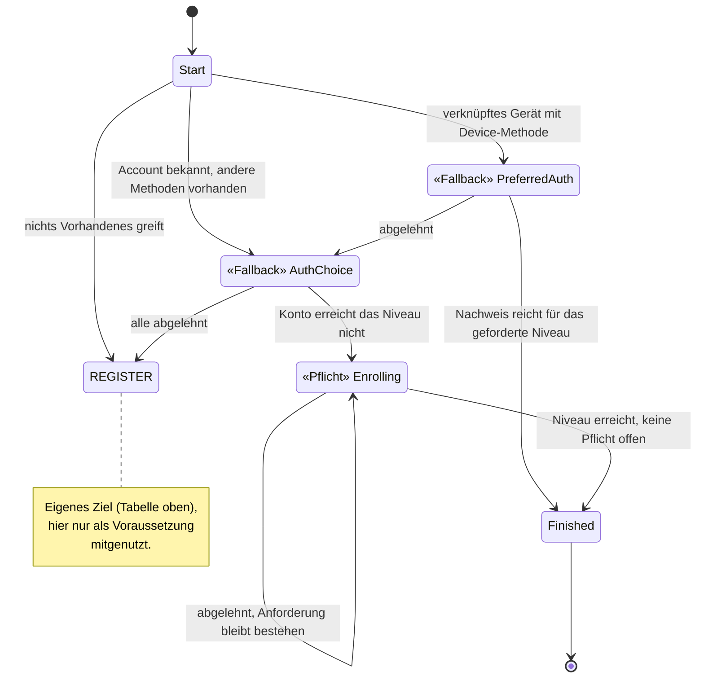
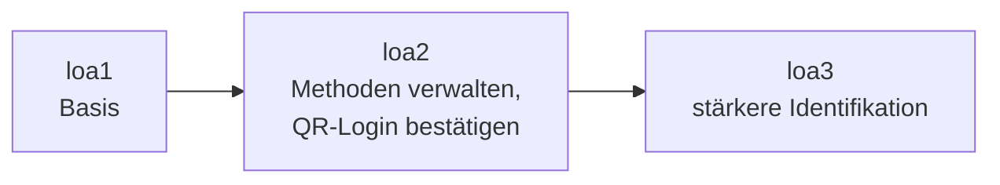
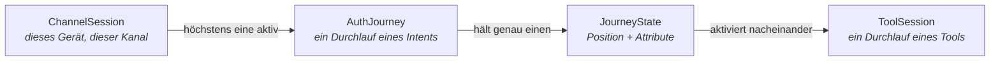

# Orchestrierung und Policy

Wie ein Nutzer zu seinem Ziel geführt wird — und wer entscheidet, welches Tool wann
angeboten wird.

Vorausgesetzt wird der `ToolOutcome`-Vertrag aus [03-tool-architektur.md](03-tool-architektur.md).

---

## Einstieg für Fachexperten

Jeder Ablauf, den ein Nutzer durchläuft, heißt nach seinem *Ziel*, nicht nach seinem technischen
Ablauf:

| Ziel aus fachlicher Sicht | Heißt im System |
|---|---|
| Möglichst reibungslos anmelden, mit Rückfallebenen | `FAST_ACCESS` |
| Bewusst neu identifizieren, auch auf einem bekannten Gerät | `REGISTER` |
| Klassischer Login ohne Gerätebindung | `LOOKUP_LOGIN` |
| Vertrauensniveau anheben (z. B. für eine sensible Aktion) | `STEP_UP` |
| Anmeldeverfahren hinzufügen oder entfernen | `MANAGE_AUTH_METHODS` |
| Konto unwiderruflich löschen | `DELETE_ACCOUNT` |
| Eine QR-Anmeldung auf einem anderen Gerät bestätigen | `CONFIRM_PEER_LOGIN` |
| Erneute Identifizierung, wenn nichts anderes mehr greift | `RE_IDENTIFY` |

Wer eine fachliche Frage stellt — „darf man X löschen, ohne sich frisch auszuweisen?" — findet
die Antwort in genau *einem* dieser Bausteine (Abschnitt 3), nicht verstreut über mehrere
Code-Ebenen. Für jedes Ziel gibt es ein vollständiges Zustandsdiagramm — jeder Zustand, jeder
Übergang, jede Bedingung ist darin sichtbar. Ausschnitt aus `FAST_ACCESS`:

Wichtig für die fachliche Prüfung: Das System unterscheidet zwei Sorten von Zustand, und diese
Unterscheidung ist erzwungen, nicht optional — im Bild oben direkt an den Notizen ablesbar:

- **Fallback**: Ablehnen führt zum nächsten, aufwendigeren Weg (z. B. Gerät abgelehnt → andere
  Methode anbieten). Bequemlichkeit für den Nutzer, solange das Sicherheitsniveau am Ende
  trotzdem erreicht wird.
- **Pflicht**: Ablehnen führt nirgendwohin — die Anforderung bleibt bestehen, bis sie erfüllt
  ist. Für alles, was nicht verhandelbar ist (z. B. das geforderte Vertrauensniveau).

Ein fachlicher Fehler — „das sollte doch Pflicht sein, nicht Fallback" — lässt sich damit an
*diesem* Bild klären, ohne Entwickler hinzuzuziehen.

Manche Anforderungen tauchen in mehreren Zielen auf — „erneut identifizieren, wenn nichts anderes
mehr greift" gehört sowohl zu `FAST_ACCESS` als auch zu anderen Abläufen, und im Diagramm oben
ist sogar ein komplettes eigenes Ziel (`REGISTER`) nur die Voraussetzung für ein anderes. Das
System modelliert beides als eigenständige **Sub-Journey** (`RE_IDENTIFY`, `REGISTER`, Abschnitt
5), die von mehreren Zielen aus angestoßen wird, aber nur einmal definiert ist. Ändert sich die
fachliche Regel für Re-Identifizierung oder Registrierung, ändert sie sich an *einer* Stelle für
alle Abläufe, die sie nutzen.

Jede Aktion verlangt außerdem ein bestimmtes Niveau (`loa1`/`loa2`/`loa3`, Abschnitt 8) — je
sensibler die Aktion, desto höher die Hürde:

Konto löschen verlangt aktuell `loa2` **und** einen frischen Faktor, nicht `loa3`. Das ist an
genau der Stelle im Modell festgelegt, an der das jeweilige Ziel beschrieben ist — eine fachliche
Entscheidung wie „QR-Bestätigung braucht künftig einen frischen Nachweis, kein altes Niveau" ist
damit eine punktuelle, nachvollziehbare Änderung an der Beschreibung dieses einen Ziels.

Schließlich: Jeder Schritt, den ein Nutzer durchläuft, wird protokolliert und ist im Journey-Log
einsehbar — welches Verfahren wann angeboten, angenommen oder abgelehnt wurde, und welches
Niveau am Ende erreicht war. Für eine fachliche oder revisionsrelevante Frage („warum konnte
dieser Nutzer sein Konto ohne erneute Prüfung löschen?") braucht es damit keine Rekonstruktion
aus verteilten Systemlogs.

Ein konkretes Beispiel, das eine Person durch mehrere dieser Ziele führt:
[11-beispiel-story.md](11-beispiel-story.md). Was daraus insgesamt folgt:

- **Fachliche Regeln sind an einer Stelle beschrieben, nicht im Code verstreut** — jedes Ziel
  hat sein eigenes, vollständiges Zustandsdiagramm, das sich unabhängig von der Implementierung
  prüfen lässt.
- **Ausnahmen sind sichtbar, nicht implizit** — Fallback vs. Pflicht, welches Niveau eine
  Aktion verlangt, welche Wege zu einer Re-Identifizierung führen: alles steht explizit im
  Modell.
- **Wiederverwendete Abläufe bleiben eine einzige fachliche Wahrheit** — eine Regeländerung an
  einer Sub-Journey wirkt überall dort, wo sie eingebunden ist, ohne Abweichungsrisiko.
- **A/B-Tests werden möglich** — weil ein Ziel wie `FAST_ACCESS` ein eigenständiges, in sich
  geschlossenes Modell ist, lässt sich für denselben Intent eine zweite Journey-Variante
  danebenstellen und im laufenden Betrieb ausspielen.

---

## 1) Begriffe

Sieben Wörter haben in diesem Kapitel eine feste Bedeutung:

| Begriff | Bedeutung | Im Code |
|---|---|---|
| **Intent** | Ziel des Nutzers samt Strategie, die ihn dorthin führt | `AuthIntent` |
| **Journey** | ein laufender Durchlauf eines Intents | `AuthJourney` |
| **Zustand** | Position auf dem Weg, samt der dort geltenden Attribute | `JourneyState` |
| **Tool** | ein einzelner Ablauf, den der Nutzer durchläuft | `toolId` |
| **Methode** | was am Konto eingerichtet ist und einen Login ermöglicht | `method` |
| **Schritt** | ein Schritt *innerhalb* eines Tools | `next.step` |
| **Niveau** | Vertrauensniveau (`loa1`/`loa2`/`loa3`) | `acr` |

**Tool** und **Methode**: `enroll-sms` und `auth-sms` sind zwei Tools für *eine* Methode
(`sms`). Ein Konto hat Methoden; angeboten und aktiviert werden Tools.

Drei weitere Wörter meinen verschiedene Dinge: **Kandidaten** liefert der Katalog bzw. die Policy;
daraus wird das **Angebot**, das ein Zustand hält (`activatable()` — Kandidaten minus Abgelehntes
minus nicht Verfügbares, [Tool-Architektur](03-tool-architektur.md) Verfügbarkeit); eine
**Auswahlseite** zeigt der Client nur bei mehr als einem Eintrag. Bleibt nichts übrig, greift
derselbe Fallback wie beim Ablehnen aller Kandidaten (Rückfall auf Identifikation bzw.
`exhausted`/Cancel) — kein eigener Fehlerzustand für Nichtverfügbarkeit.

### Intent

Ein **Intent** ist das Ziel des Nutzers *zusammen mit* der Strategie, nach der er dorthin geführt
wird. Er beantwortet drei Fragen, je Ziel unterschiedlich:

- Welche Tools dürfen hier überhaupt angeboten werden — und in welcher Reihenfolge?
- Was bedeutet ein abgeschlossenes Tool in diesem Kontext?
- Wann ist das Ziel erreicht?

Ein Intent ist ausdrücklich **keine** Beschreibung dessen, was am Ende herauskam: Ob ein
Durchlauf eine Registrierung oder ein Login war, ist eine Beobachtung über den gelaufenen Weg.

### Journey

Eine **`AuthJourney`** ist ein laufender Durchlauf eines Intents. Sie gehört zu genau einer
`ChannelSession` und lebt kürzer als diese; pro Kanal ist immer höchstens eine Journey aktiv.

Die Journey hält, was den ganzen Weg über gilt (Intent, Account, Budget, Lebenszyklus), nicht aber
die Position des Nutzers — das ist der `JourneyState`.

Intent und Journey verhalten sich zueinander wie `ToolDescriptor` und `ToolSession`: der eine
benennt die *Art*, der andere ist *ein Durchlauf* davon. Ein Kanal kann nacheinander mehrere
Journeys desselben Intents durchlaufen.

### Zustand (`JourneyState`)

Der **`JourneyState`** ist die Position auf dem Weg — und trägt die Attribute, die genau an dieser
Position gelten: etwa *welche* Tools angeboten und *welche* bereits verworfen wurden, oder *welche*
`ToolSession` gerade autorisiert ist.

Jeder Intent hat seine eigene, abgeschlossene Zustandsmenge — die Zustände von
`MANAGE_AUTH_METHODS` lassen sich für `LOOKUP_LOGIN` gar nicht ausdrücken.

Der `JourneyState` ist außerdem die einzige Quelle für „welches Tool darf der Client jetzt
aktivieren?" und „wohin schicke ich ihn als nächstes?" — beides beantwortet dieselbe Funktion
(Abschnitt 4).

#### Zwei Sorten von Übergang

Einen erfolgreichen Nachweis behandeln alle Zustände gleich: Er bringt die Journey weiter. Sie
unterscheiden sich darin, was **Ablehnen** bewirkt:

- In einem **Fallback-Zustand** führt Ablehnen weiter — zum nächsten, aufwendigeren Weg. Mehrere
  davon bilden eine **Fallback-Kette** vom bequemsten zum aufwendigsten Weg; so ist `FAST_ACCESS`
  gebaut. Ist nichts Aufwendigeres mehr da, endet die Journey.
- In einem **Pflichtzustand** führt Ablehnen nirgendwohin. Die Pflicht bleibt bestehen, das
  volle Angebot kommt zurück — auch das gerade verworfene Tool. Nur Erfüllen bringt weiter.

Beide kommen in derselben Zustandsmenge vor (etwa in `FAST_ACCESS`); welche Sorte ein Zustand
ist, gehört sichtbar in den Code.

### Tool

Ein **Tool** ist ein einzelner Ablauf (`ident-fsc`, `enroll-sms`, `auth-device`, …). Es weiß
nichts über Journeys, Intents oder Reihenfolgen und meldet nur sein Ergebnis als `ToolOutcome`
([Tool-Architektur](03-tool-architektur.md)); was das bedeutet, entscheidet der Intent.

### Die Session-Ebenen im Zusammenhang

---

## 2) Die Intents

Vier **Entry-Intents** starten eine neue Sitzung auf dem `APP`-Kanal, `KC_SELECT_METHOD` ist der
Web-Kanal-eigene Login/Step-up-Einstieg, `REGISTER` ist zusätzlich über den Web-Kanal erreichbar
(s. u.); fünf weitere laufen innerhalb einer bestehenden Sitzung. `CONFIRM_PEER_LOGIN` ist die
Ausnahme, die **beides zugleich** ist (eigener Abschnitt unten):

| `AuthIntent` | Ziel | Einstieg |
|---|---|---|
| `FAST_ACCESS` | So schnell wie möglich in einen Login auf diesem Gerät, und so, dass es künftig wieder klappt | `POST /channels` (Default) |
| `REGISTER` | Bewusst frische Identifizierung, auch auf einem bereits verknüpften Gerät | `POST /channels` mit `intent=register` (App) bzw. `PATCH /kc/channels/{id}` mit `intent=register` (Web, s. u.) |
| `LOOKUP_LOGIN` | Bestehenden Account ohne Gerätebindung anmelden (klassischer Web-Login) | `POST /channels` mit `intent=lookup_login` |
| `KC_SELECT_METHOD` | Alle kc-nutzbaren Tools als einen `selectMethod`-Schritt anbieten; um die Fallback-Logik kümmert sich Keycloak selbst | Default-Entry-Intent des `KEYCLOAK`-Kanals ([05-api.md](05-api.md) Abschnitt 3) |
| `STEP_UP` | Niveau anheben | nur auf einem `AUTHENTICATED`-Kanal |
| `MANAGE_AUTH_METHODS` | Methoden hinzufügen oder entfernen | nur auf einem `AUTHENTICATED`-Kanal |
| `CONFIRM_PEER_LOGIN` | Einen wartenden `auth-qr`/`auth-qr-lookup`-Login des Web-Kanals bestätigen oder ablehnen | `POST /channels` mit `intent=confirm_peer_login` **oder** `POST /channels/{id}/peer-logins` auf einem `AUTHENTICATED`-Kanal — dasselbe Gate |
| `DELETE_ACCOUNT` | Konto unwiderruflich löschen | nur auf einem `AUTHENTICATED`-Kanal |
| `LOGOUT` | Bestätigtes Abmelden | nur auf einem `AUTHENTICATED`-Kanal |
| `RE_IDENTIFY` | Erneute Identifizierung als geteilte SubJourney | nie direkt, nur über `RequireSubJourney` |

Startet `CONFIRM_PEER_LOGIN` ohne bestehende Sitzung, bietet es nie eine Identifikation oder Registrierung an: Ist kein
Konto über `DeviceAccountLink` bekannt, bricht die Journey sofort ab (410). Ist ein Konto bekannt,
gilt derselbe `STEP_UP`-Gate wie bei `MANAGE_AUTH_METHODS`; reichte das Niveau schon *vor* diesem
Durchlauf, verlangt `CONFIRM_PEER_LOGIN` zusätzlich einen frischen Re-Proof wie `DELETE_ACCOUNT`
(eigener Abschnitt unten).

`REGISTER` ist ein eigener Intent mit eigener Journey (`RegisterState`): Er unterdrückt den
`DeviceAccountLink`-Lookup und bietet nie eine bestehende Kontobindung an. `FAST_ACCESS` läuft ihn
als `Transition.RequireSubJourney`-Voraussetzung, sobald es identifizieren müsste — dasselbe Muster
wie bei `RE_IDENTIFY`. Einen zweiten Account erzwingt `REGISTER` **nicht**: Dieselbe KVNR findet
denselben Account wieder.

Der gewählte Intent wird auf der `ChannelSession` gemerkt. Resume und Abbruch starten denselben
Intent erneut: Ein abgebrochener Lookup-Login wird wieder ein Lookup-Login.

---

## 3) Die Journeys im Einzelnen

Gemeinsam für alle Diagramme: Ein Pfeil ist ein Übergang, ausgelöst durch ein `JourneyEvent`
(Tool abgeschlossen, Tool abgebrochen, Kind-Journey fertig). `abgelehnt` steht für „gescheitert
oder vom Nutzer verworfen, und in diesem Zustand ist nichts mehr übrig". Terminale Zustände
(`Finished`) sind eingezeichnet, existieren aber **nicht** als persistierter Zustand: Das Ende
einer Journey ist `Transition.Authenticated`.

Eine Datei je Journey, unter [`journeys/`](journeys/). Dieser Abschnitt war 32 KB groß, also die
Hälfte des Dokuments. Wer eine einzelne Journey nachschlagen wollte, musste alle laden.

| Journey | Datei |
|---|---|
| `FAST_ACCESS` | [fast-access.md](journeys/fast-access.md) |
| `REGISTER` | [register.md](journeys/register.md) |
| `LOOKUP_LOGIN` | [lookup-login.md](journeys/lookup-login.md) |
| `KC_SELECT_METHOD` | [kc-select-method.md](journeys/kc-select-method.md) |
| `STEP_UP` | [step-up.md](journeys/step-up.md) |
| `RE_IDENTIFY` | [re-identify.md](journeys/re-identify.md) |
| `MANAGE_AUTH_METHODS` | [manage-auth-methods.md](journeys/manage-auth-methods.md) |
| `CONFIRM_PEER_LOGIN` | [confirm-peer-login.md](journeys/confirm-peer-login.md) |
| `DELETE_ACCOUNT` | [delete-account.md](journeys/delete-account.md) |
| `LOGOUT` | [logout.md](journeys/logout.md) |
| Lebenszyklus, unabhängig vom Intent | [lebenszyklus-unabhaengig-vom-intent.md](journeys/lebenszyklus-unabhaengig-vom-intent.md) |

## 4) `next` folgt aus dem Zustand

Alle Zustände erfüllen einen gemeinsamen Vertrag: Jeder weiß, welche `toolId`s hier aktivierbar
sind (leer für terminale und wartende Zustände), ob und welches Tool gerade läuft, und welche
orchestrator-eigene Seite (`next.context`/`next.step`) er anzeigt. Daraus folgt **eine**
Ableitungstabelle:

| `active` | `activatable()` | `next` |
|---|---|---|
| gesetzt | — | `type="tool"`, Schritt der laufenden `ToolSession` |
| null | genau ein Eintrag | `type="tool"`, `startStep` des Descriptors |
| null | mehrere | `type="orchestrator"`, Auswahlseite |
| null | leer | `type="orchestrator"`, orchestrator-eigene Seite (Bestätigung, Abschluss) |

Die Prüfung „darf dieses Tool jetzt aktiviert werden?" ist dieselbe Funktion — Mitgliedschaft in
`activatable()`. Ein Zustand, der ein Tool nicht anbietet, kann es damit nicht zulassen.
`next.type` (`"tool"`/`"orchestrator"`) sagt, wem der nächste Screen gehört und welchen Endpunkt
der Client ruft.

---

## 5) Die zwei Verträge: SPI und API

### `IntentStrategy` — der SPI

Symmetrisch zu `tool_spi`: dort beschreiben sich Tools selbst, hier Intents. Jede Strategie ist ein
Moore-Automat für ihren eigenen Zustandstyp: `transition(state, event, ctx)`, dazu
`initialState(ctx)` (wo eine direkt eingetretene Journey beginnt) und `cancelledTo` (wohin der
Kanal bei Abbruch zurückfällt). Eine Sub-Journey mit vorgegebenem Zielniveau beginnt nicht über die
SPI, sondern über die Companion-Factory des jeweiligen Zustands (`StepUpState.forSubJourney(...)`,
`ReIdentifyState.forSubJourney(...)`) — nur `STEP_UP`/`RE_IDENTIFY` sind als Sub-Journey gemeint.

`transition()` ist die einzige Methode, die überhaupt entscheidet
(docs/ideen/journey-strategie-vereinheitlichung.md).

Ein `JourneyEvent` ist, was der Journey gerade passiert ist:

| Event | Bedeutung |
|---|---|
| `Started` | Journey wurde eben angelegt, braucht ihr erstes Angebot |
| `Completed(tool, outcome)` | ein Tool wurde erfolgreich abgeschlossen — was das bedeutet, entscheidet die Strategie hier |
| `Abandoned(tool)` | „Zurück"/„Wechseln": das aktivierte Tool wurde ohne Abschluss verworfen |
| `ActionCompleted` | die `Action` eines `Perform`-Übergangs (unten) ist ausgeführt, mit frisch hergeleitetem `JourneyContext` |
| `SubJourneyFinished(intent, achievedAcr)` | eine als Vorbedingung gestartete Kind-Journey ist fertig |
| `Answered(answer)` | eine ausdrückliche Antwort auf einen `AnswerableState` statt eines Tool-Laufs — `answer` ist ein String, nicht `Boolean` |

Eine `Transition` ist, was als Nächstes passieren soll:

| Transition | Bedeutung |
|---|---|
| `To(state)` | weiter zu diesem Zustand — er trägt sein Angebot selbst |
| `RequireSubJourney(intent, seedWith, resumeWith)` | erst `intent` laufen lassen, gestartet bei `seedWith` (von der anfordernden Strategie über die Companion-Factory des Ziel-Zustands gebaut, z. B. `StepUpState.forSubJourney(...)`), danach hier bei `resumeWith` weiter |
| `Authenticated` | Ziel erreicht, Journey wird konsumiert |
| `Cancel` | Nutzer gibt auf — wie ein ausdrückliches Abbrechen, kein Fehler |
| `Perform(action, resumeState)` | `Action` ausführen, danach die Journey bei `resumeState` mit `ActionCompleted` fortsetzen |
| `Logout` | Kanal endgültig beenden (`LOGGED_OUT`, terminal) |
| `Abort(reason)` | es geht gar nicht weiter (410) — nie bloß „keine Kandidaten mehr" |

`Perform` trennt Entscheidung von Wirkung: `JourneyService` führt `action` aus, leitet den
`JourneyContext` danach frisch her und ruft `transition(resumeState, ActionCompleted, frischerCtx)`
erneut auf — selbst rekursiv, solange eine Strategie ihrerseits wieder `Perform` liefert. Diese
Rekursion trägt alle Sonderpfade:

- Ein abgeschlossenes Tool: `is Completed -> Perform(actionFürOutcome, resumeState = state)`,
  gefolgt von `is ActionCompleted -> <Nachfolgelogik>` im selben Zustand — dieselbe Zwei-Schritt-
  Form für jeden Intent, der Tools anbietet.
- `Action.LinkDevice`/`Action.RevokeAuthMethod`/`Action.DeleteAccount`: eine Strategie liefert `Perform`
  statt selbst zu binden/zu löschen (`LookupLoginState.OfferBinding`, `ManageAuthMethodsState.
  RemoveRequested`, `DeleteAccountState.ConfirmationRequired`).
- RestoreData ([05-api.md](05-api.md) Abschnitt 3): kein `JourneyEvent`, sondern der
  Anfangs-Übergang des Automaten — siehe unten.

Die `Action`-Varianten:

| Action | Bedeutung |
|---|---|
| `RecordIdentification(tool, outcome)` | eine Identifizierung (`ident-fsc`/`ident-eid`) oder Korrelation (`ident-kvnr`) hat eine Identität aufgelöst. **Ein** Handler für beide Fälle: ob schon ein Konto gebunden ist, liest er zur Ausführungszeit aus Journey/Kanal, die Strategie wählt das nicht über die Action-Variante |
| `AdoptCredential(tool, outcome)` | eine neue Methode wurde eingerichtet |
| `AcceptProof(tool, outcome)` | ein Nachweis wurde erbracht. Ob das Tool den Account selbst *nennen* darf, leitet der Executor aus `MethodRole.LOOKUP_AUTH` plus der Live-Bindung ab; ein genannter Account, der einem bereits gebundenen widerspricht, ist `409` |
| `AdoptAttestation(tool, outcome)` | ein Konto-eigenes Attribut wurde bestätigt (z. B. bestätigte E-Mail) — darf allein nie auf ein *anderes* Konto wechseln, dafür braucht es eine echte Identifizierung in derselben Sitzung |
| `ApplyRestoredEvidence(source, methods)` | siehe „RestoreData als Anfangs-Übergang" unten |
| `RevokeAuthMethod(methodInstanceId)` | **ein Anmeldeverfahren** widerrufen (das Credential selbst, nicht nur ein Flag) — wer sich damit aussperren würde, wird vom Automaten abgewiesen, nicht von der Strategie. Benannt nach dem, was es zerstört, neben `DeleteAccount`, das das ganze Konto zerstört |
| `LinkDevice` | das aktuelle Gerät mit dem Konto **dieser Sitzung** verknüpfen — der einzige Weg, der auch *um*binden darf, weil ihm eine Zustimmung vorausgeht |
| `DeleteAccount` | **das ganze Konto** dieser Sitzung unwiderruflich löschen — der Executor prüft `requiredAcr(account)` unmittelbar vor der Ausführung gegen die aktuellen Nachweise nach |

**Sicherheitsprüfungen gehören nie in die Strategie.** Drei Kontoübernahme-Lücken sind genau so
entstanden, dass die *Prüfung* pro Action-Handler lag, während die *Wahl* des Handlers (bzw. eines
Flags darauf) der Strategie gehörte. Konsequenz, heute strukturell:

- Identitätsauflösung (`IdentityResolver`), Konto-Absorption (`absorbProvisionalAccount`) und
  Geräte-Bindung (`linkDeviceToAccount`) sind aus **genau einer** Klasse erreichbar
  (`JourneyActionExecutor`) — per ArchUnit-Regel erzwungen, nicht per Review.
- Jede Bindung an ein *anderes* Konto als das bereits gehaltene läuft durch dieselbe Funktion
  (`accountOf`), unabhängig davon, welche Strategie sie ausgelöst hat.
- Geräte-Bindung hat **eine** Implementierung (`linkDeviceTo`), die immer auch die
  Geräte-Credentials des vorher verknüpften Kontos widerruft. Vorher gab es zwei Varianten, und
  welche lief, hing an der Action — `RegisterEnrollFirstStrategy` hat mangels
  `ConfirmDeviceRebind`-Zustand die nicht-widerrufende erwischt.

Die ersten vier `Action`-Varianten tragen `tool`/`outcome` selbst. Enthalten ist nur, was sich je
Intent **unterscheidet**; alles Mechanische — `personId`, `enrollmentRef`, `amr`, `achievedAcr` —
liest der gemeinsame Mechanismus direkt vom mitgeführten `outcome` ab.

### Ein Angebot darf veralten, die Ausführung muss live prüfen

Die Regel hinter allen obigen Punkten, und die Frage, an der sich ein künftiger Zweifelsfall
entscheidet. Ein festgehaltener Wert ist **richtig**, wenn er eine Vergangenheit festhält, die
später nicht mehr feststellbar ist (`ConfirmPeerLoginState.startedAuthenticated`,
`StepUpState.startingAcr`, `MethodEvidence` als Nachweis, Log-Felder). Er ist **falsch**, wenn er
eine Gegenwart einfriert, die zur Ausführungszeit neu gelesen werden müsste. Von der Strategie gesetzte
Gates und `accountId`-Felder in Zuständen fallen ausnahmslos in die zweite Gruppe.

Angebote (`OfferingState.offered`) fallen bewusst in die erste Gruppe: `activatable()` schneidet
sie beim Rendern nur gegen `availableTools` (Client-Fähigkeit plus Admin-Sperre), **nicht** gegen
die aktuelle Kontolage — `next` soll eine reine Funktion des Zustands bleiben und dafür keine
Datenbank brauchen. Ein zwischenzeitlich entfallenes Verfahren kann deshalb noch angeboten
werden. Das ist ein Fehlerpfad, aber kein Sicherheitsproblem, weil die Prüfung bei der
**Ausführung** liegt und dort ausnahmslos live ist:

- AUTH: `performAcceptProof` liest `findActiveMethod(accountId, method)` frisch und begrenzt mit
  `min(achievedAcr, enrolledUnderAcr)` — fehlt die Methode, schlägt der Lauf fehl.
- ENROLL: `performAdoptCredential` berechnet `enrolledUnderAcr` aus den Nachweisen von **jetzt**,
  nie aus der Lage, in der das Angebot entstand (ADR-5).

`AuthPolicy`/`CandidateTools` sind dafür zustandslos: beide rechnen ausschließlich aus dem
übergebenen `JourneyContext`, den `JourneyService.advance` bei **jedem** Übergang neu aufbaut —
auch nach jeder Action, per rekursivem `ActionCompleted`-Durchlauf.

**Gerätebindung trägt keine Action.** Sie variiert nie *innerhalb* eines Intents — ein Flag an
jeder Action wäre eine Intent-Konstante, die überall neu (und falsch) gesetzt werden könnte.
Stattdessen zwei unabhängige Fragen, jede dort beantwortet, wo ihre Information liegt,
zusammengeführt an genau einer Stelle:

- **Will dieser Ablauf binden?** `AuthIntent.bindsDeviceImplicitly` — nur `LOOKUP_LOGIN` nicht, weil
  genau dieser Intent von Leuten gewählt wird, die nicht wiedererkannt werden wollen; er fragt
  stattdessen (`OfferBinding` → `Perform(LinkDevice, …)`). Die Eigenschaft kann die Kanalfrage gar
  nicht mitbeantworten: `REGISTER` läuft auf APP *und* KEYCLOAK, wäre also keine Konstante mehr.
- **Gibt es hier ein Gerät?** Kanalfrage, einmal im Executor — sie gilt auch für den expliziten
  Weg, denn auf einem KEYCLOAK-Kanal gibt es auch nach Zustimmung nichts zu binden.

Getrennt wird zusätzlich nach **Destruktivität**, nicht nach Strategie: Implizites Binden greift
nur, wenn das Gerät frei ist oder schon diesem Konto gehört — es bindet **nie** still um und
widerruft nie fremde Credentials. Erfolg in einem Ablauf ist Einverständnis, von *diesem* Konto
wiedererkannt zu werden, nicht Einverständnis, das Gerät einem anderen wegzunehmen. Umbinden kann
nur der explizite Weg nach einem Prompt (`ConfirmDeviceRebind`). Das schließt den Fall, den
`RegisterEnrollFirstStrategy` ohne eigenen `ConfirmDeviceRebind`-Zustand sonst unbemerkt mitnehmen
würde.

Zentral und für Strategien nicht erreichbar bleiben: den Nachweis in den `AuthContext` übernehmen,
`SessionEvent` und Journey-Log schreiben, und die Begrenzung `min(achievedAcr, enrolledUnderAcr)`.

Entscheidungen dahinter:

- **Ein Übergang statt fünf.** „Erstes Angebot", „abgeschlossenes Tool", „Abbruch", „Rückkehr aus
  einer Sub-Journey" und „eigene Aktion fertig" sind dieselbe Frage mit einem Event-Parameter.
- **Die Strategie liefert `Transition`, nicht `Next`.** Sonst müsste jeder Intent selbst die Regel
  nachbauen, dass ein einzelner Kandidat die Auswahlseite überspringt; so macht der gemeinsame
  Mechanismus daraus Zustand und `next`.
- **`Abort` ist eine Entscheidung der Strategie**, nichts, was die Kandidatenauflösung von selbst
  auslöst: Eine leere Kandidatenliste muss „nächster Zustand" bedeuten dürfen, sonst lässt sich
  eine Fallback-Kette nicht bauen.
- **Die Strategie bekommt nie Services**, nur einen lesenden `JourneyContext` (Account, Nachweise,
  Untergrenze, Gerätebezug, Katalogabfragen). Sie entscheidet, sie wirkt nicht; ausgeführt wird
  ausschließlich außerhalb (`JourneyActionExecutor`, siehe unten).

Welche Tools für ein Angebot in Frage kommen, beantwortet `CandidateTools`, abgeleitet aus den
Descriptors der Module. Dort steht keine einzige `toolId`; ein Tool tritt einem Angebot bei, indem
es seine Rolle deklariert.

### Die vier Phasen eines Übergangs

Dieselbe Trennung, die zwischen `IntentStrategy` und dem ausführenden Teil liegt, setzt sich in
diesem fort: Jeder Übergang durchläuft vier Phasen, und jede Phase hat genau eine zuständige
Klasse. `JourneyService` bleibt der **Treiber**, nicht der Ausführende.

| Phase | Klasse | Aufgabe |
|---|---|---|
| lesen | `JourneyContextFactory` | baut den lesenden `JourneyContext` aus der dauerhaften Wahrheit (Account, Nachweise, Gerätebindung, Feature-Flags) |
| entscheiden | `IntentStrategy` | macht aus (Zustand, Event, Kontext) eine `Transition` — reine Werte |
| wirken | `JourneyActionExecutor` | führt die `Action` eines `Perform` aus (Account anlegen, Claims/Credentials schreiben, Gerät binden, widerrufen) |
| routen | `JourneyRouting` | leitet `next`/`Step` aus dem resultierenden Zustand ab |

Bei `JourneyService` bleibt, was keine dieser vier allein besitzen kann: Journey-Lebenszyklus
(`start`/Suspend/Resume/`cancel`), die Schleife, die die Phasen sequenziert, das Versuchsbudget
und die Abbruch-Folgen.

Die Abhängigkeit ist bewusst eine Einbahnstraße: `JourneyActionExecutor` schreibt und kehrt
zurück — er treibt keine Journey weiter, routet nicht und startet keine Sub-Journey. Nur so bleibt
die Rekursion in `JourneyService.applyTransition` die einzige Rekursion im ganzen Ablauf.
`OrchestratorArchitectureTest` prüft das.

### RestoreData als Anfangs-Übergang

Ein als Vorbedingung mitgelieferter Nachweis ([05-api.md](05-api.md) Abschnitt 3, Web-Kanal
RestoreData) ist keine fachliche Entscheidung einer Strategie, sondern reine Aufrufer-Information.
Sie läuft als **Anfangs-Übergang** (Statecharts: Pseudostate → `q0`): mechanisch, ohne Bedingung
und keinem Zustand zugehörig.

Genau das ist `JourneyService.start()`s `seedAction`-Parameter: `Action.ApplyRestoredEvidence`
läuft, BEVOR `IntentStrategy.initialState()` aufgerufen wird — kein `JourneyEvent`, sondern ein
geloggter `"Entry"`-Übergang, den `JourneyService` selbst ausführt. Weil der Nachweis schon vor
dem ersten Angebot vorliegen kann, darf `Started` nicht blind das erste Angebot bauen: Eine
Strategie wie `KcSelectMethodStrategy` prüft bei `Started` genauso wie bei jedem anderen Nachweis,
ob das Vorhandene schon reicht.

### `JourneyApi` — was Tool-Controller sehen

Fünf Operationen — `activate` (prüft und übernimmt eine `ToolSession`), `applyOutcome`, `abandon`,
`cancel`, `nextOf` — sind die **einzige** Berührungsfläche der Tool-Controller mit dem
Journey-Modell: kein Setzen von Routing-Feldern, kein Typ-Switch auf einen Intent, keine
Entscheidung darüber, welches Tool laufen darf. `Step` ist `next` plus die Renderdaten des
Schritts.

Zwei Aktionen, die der Client sauber auseinanderhalten muss: `abandon` lehnt den aktuellen
**Zustand** ab und führt die Journey weiter (`DELETE /tools/{toolSessionId}/{toolId}`); `cancel`
gibt die **Journey** auf und startet den Entry-Intent neu (`DELETE .../journey`).

---

## 6) Sub-Journey

`Transition.RequireSubJourney` legt eine eigene `AuthJourney` mit `parentJourneyId` an. Ist sie fertig, wird der Parent mit `resumeWith` wieder aufgenommen.

Invariante: pro Kanal ist immer genau **eine** Journey aktiv — die Kind-Journey läuft, der Parent
ist `SUSPENDED`, nicht parallel. Der Step-up behält eigene `startingAcr`/`achievedAcr` und ein
eigenes Audit.

---

## 7) Versuchsbudget

`attemptBudget` liegt auf der `AuthJourney`, nicht auf der `ToolSession`. Jedes `Failed` zieht ab,
unabhängig davon, in welchem Zustand oder in welchem Tool. Bei `0` endet die **ganze Journey**
(`410`) — auch wenn noch Zustände übrig wären.

Das ist eine Sicherheitsanforderung: Ein tool-lokaler Zähler würde Brute-Force entlang der Kette
billiger machen.

Retry-Regel: Ein fehlgeschlagener Versuch mit verbleibendem Budget ist **kein** HTTP-Fehlerfall,
sondern verhält sich wie fehlende Eingabe (`200` plus Navigation, Grund in `stepData.error`). Erst
das erschöpfte Budget endet terminal (`410`) — HTTP-Fehlercodes signalisieren gestörte Abläufe,
nicht erwartbare Eingabefehler ([API](05-api.md)).

Ausdrücklich offen: Brute-Force-Schutz auf Kontoebene über mehrere Journeys hinweg; das Budget ist
journey-lokal.

---

## 8) AuthPolicy: Mehr-Faktor-Entscheidung

Die Strategien fragen die `AuthPolicy`, statt selbst zu entscheiden, was genug ist: ob vorhandene
Nachweise reichen (`isSatisfied`), welches Niveau sich aus ihnen ergibt (`resolveAcr`), welche
Tools als Nachweis, Re-Identifizierung oder Enrollment in Frage kommen, und ob ein Account ein
Niveau grundsätzlich erreichen kann (`canAccountReach`), unabhängig vom aktuellen Nachweis.

Zwei Bedingungen müssen zusammen erfüllt sein:

1. **Niveau**: `resolveAcr(evidence) >= requiredAcr`. Die Abbildung von `amr`-Kombinationen auf
   `acr`-Werte ist fachlich/regulatorisch offen: RFC 8176 definiert zwar eine IANA-Registry für
   `amr`-Werte (`pwd`, `otp`, `hwk`/`swk`, `user`, `face`, `fpt`, `mfa`, …), nicht aber, welche
   Kombination welches Vertrauensniveau ergibt. Die `amr`-Strings dieses Projekts (`sms`,
   `password`, `email`, `fsc`, `device`, `pin`, `biometric`) folgen einer eigenen Konvention.
2. **Faktorvielfalt**: Für MFA-Niveaus mindestens zwei **verschiedene** Faktorarten — gezählt wird
   die Vereinigung der `factorTypes` über alle abgeschlossenen Tools, nie die Tool-Anzahl. Ein Tool,
   das selbst zwei Faktorarten meldet (z. B. Passkey mit User Verification), erfüllt MFA allein.

Wichtige Einschränkung: Ein Tool darf nur Faktoren melden, die es dem Server gegenüber tatsächlich
**nachweisen** kann. Für eine nur lokal geprüfte App-PIN gehört nur `{possession}` in den
Descriptor.

**Zwei benannte Ausnahmen davon**, `device` und `kobil`: Beide melden `knowledge` bzw. `inherence`
aus dem Zugangsmittel, mit dem der Nutzer das Credential entsperrt hat — und wie er das getan hat,
kann der Server nicht sehen, sondern nur die Selbstauskunft des Clients lesen
(`tool_api.DeviceProofs`, `UserVerification`). Das ist hier als **Ausnahme** notiert, nicht als
zwei Einzelfälle: Würde dasselbe Zugangsmittel in zwei Verfahren unterschiedlich gewertet, dann würde dieselbe Geste
je Tool unterschiedlich viel kosten, ohne dass der Nutzer den Grund sieht (ADR-21).
Bei `kobil` ist die andere Hälfte dafür stärker belegt als anderswo: Der Besitz beruht auf einer
Assertion, die das Backend selbst beim Anbieter einlöst, nicht auf einer Client-Signatur.

### IAL und AAL: zwei Fragen, eine `acr`-Zahl

`resolveAcr` beantwortet zwei unabhängige Fragen (NIST 800-63: IAL vs. AAL) und kombiniert sie erst
am Ende zur nach außen sichtbaren `acr`-Zahl:

- **IAL** (`identityAssuranceLevel`, "wer ist das?") — das höchste `loa`, das eine
  IDENTIFICATION-Rolle (`ident-fsc`, `ident-eid`) **in dieser Session** erbracht hat. Bewusst
  NICHT aus `account.identification` einer früheren Session nachgeladen: `AuthEvidence` ist "one
  per channel, cleared at logout" (`orchestrator.session.AuthEvidence`).
- **AAL** (`authenticatorAssuranceLevel`, "wie stark ist der Nachweis bei DIESEM Login?") — die
  MFA-Kombinationsregel aus Punkt 2, aber ausschließlich über ENROLLMENT/AUTH-Nachweise gerechnet.

`resolveAcr = max(IAL, AAL)`. Jede `MethodEvidence`/`AmrRecord`-Zeile trägt dafür eine `axis`
(`EvidenceAxis.IDENTITY`/`AUTHENTICATOR`, `DefaultAuthPolicy`/`ToolDescriptor.evidenceAxis()`,
abgeleitet aus `role.category`). Grund der Trennung: Eine Identifizierung darf ihr eigenes `loa`
direkt beisteuern (ein alleiniges `ident-fsc` erreicht `loa2`), sich aber **nicht** mit einem
einzelnen Auth-Faktor anderer Art zu einer MFA-Erhöhung verbinden — sonst würde ein gestohlenes
Passwort als durch einen weiteren, beim Login geprüften Faktor abgesichert gelten.

**`loa2` ist damit das Projekt-eigene Label für NIST-800-63B-AAL2**, erreichbar über drei
gleichwertige Wege: (1) ein einzelnes Tool mit zwei eigenen Faktorarten (`device`:
Besitz+Wissen/Inhärenz), (2) zwei kombinierte Einzelfaktor-AUTH-Tools unterschiedlicher Art
(sms+password, über die MFA-Erhöhung), oder (3) eine Identifizierung (`ident-fsc`/`ident-eid`) allein
über ihr eigenes IAL. Weil Weg (3) gleichwertig ist, wird `CandidateTools.forReIdentification` in
Auth-Kontexten standardmäßig als Fallback angeboten (`StepUpState.forSubJourney`, Default
`allowReIdentification=true`), sobald die Auth-Mittel nicht reichen. `loa3`/AAL3 ist bewusst nicht
ausgearbeitet.

### Session-Nachweis ist nicht gleich Account-Fähigkeit

In einem Auth-Zustand lautet die Frage „reicht das *jetzt*?" (`isSatisfied`), in einem
Enrollment-Zustand „kommt der Nutzer damit *künftig wieder herein*?" (`canAccountReach`). Eine
Identifizierung ist keine dauerhafte Methode: `ident-fsc` zählt für
`AuthContext.currentFactorTypes` dieser Session, landet aber im Audit-Log
`account.identification`, nicht in `account.auth_method`.

Daraus folgt eine Kette von Obergrenzen: Das LoA der Identifizierung begrenzt, was ein Account je
erreichen kann; `account.auth_method.enrolled_under_acr` begrenzt, was eine einzelne Methode
liefern darf; `Completed.achievedAcr` meldet, was der konkrete Durchlauf erreicht hat. Ein Kanal,
der `loa3` verlangt, braucht also ein `loa3`-fähiges Ident-Tool; nach einer `loa2`-Identifizierung
bleiben alle danach eingerichteten Methoden auf `loa2` begrenzt. Deshalb ist die Untergrenze schon
beim Anlegen des Kanals setzbar ([API](05-api.md)).

### Untergrenze des Kanals gegen Ziel eines Laufs

Zwei Größen, die leicht als dasselbe Feld gelesen werden und deshalb verschieden heißen:

- **`ChannelSession.acrFloor`** — die *dauerhafte Untergrenze* des Kanals („auf diesem Kanal nie
  unter `loa3`"). Gilt für jede Journey darauf und verhindert, dass sich jemand beim Entfernen einer Methode selbst
  aussperrt.
- **`StepUpState.targetAcr`** — das *Ziel dieses einen Durchlaufs*. Nur `STEP_UP` hat eins.

Gerechnet wird stets mit dem Maximum beider. Ein vom Client genanntes Niveau ist immer eine
Untergrenze, nie eine Erlaubnis: Das Backend setzt `max(Policy-Anforderung, Client-Wunsch)`.

### Pflichten sind Zustände

Keycloak kennt „Required Actions" wie `VERIFY_EMAIL`. Hier sind sie kein eigenes Konzept, sondern
Pflichtzustände: „ausreichende Login-Methode eingerichtet" *ist* `Enrolling`, „bestätigte E-Mail"
*ist* `ConfirmingEmail`.

Die Reihenfolge der Pflichten ist die Reihenfolge der Zustände: erst die bestätigte E-Mail, dann
eine ausreichende Login-Methode. Die Bestätigung ist kein Anmeldeverfahren, sondern
Konto-Infrastruktur (drei Lookup-Tools lösen darüber auf, `enroll-password` setzt sie voraus);
andernfalls könnte `enroll-password` im ersten `Enrolling`-Angebot nicht auftauchen. Dieselbe
Reihenfolge gilt im Experiment „Enrollment zuerst" (`EnrollFirstAttestingEmail`).

Ist kein bestätigendes Tool verfügbar (admin-seitig gesperrt), wird der Schritt übersprungen, die
Pflicht bleibt offen und wird in der Enrollment-Kaskade (`AuthEnrollCore.afterEnrollment`) erneut
angeboten — dafür trägt `Enrolling.emailObligation` den Vermerk weiter.

Der Geltungsbereich ergibt sich daraus, welcher Weg zu dem Zustand geführt hat: Die E-Mail-Pflicht
gilt nur für einen Lauf, der über `Identifying` kam, also einen Account angelegt oder übernommen
hat — festgehalten im Attribut `Enrolling.emailObligation`. Wer sich lediglich anmeldet, wird nie
rückwirkend zu einer fehlenden E-Mail-Bestätigung verpflichtet: Die Bestätigung wird deshalb erst
*nach* dem `AuthChoice`-Zweig angeboten, nicht vor ihm.

Beide Pflichten sind aus vorhandenem Zustand **abgeleitet** (`authenticationMethods`,
`emailConfirmedAt`), nicht als eigenes Account-Feld gespeichert.

**Was das kostet, ausdrücklich benannt**: Eine künftige dritte Pflicht, die *mehrere* Intents
betrifft, bedeutet denselben Zustand in mehreren Hierarchien. Bei zwei Pflichten ist das der
bessere Tausch; kommt eine dritte hinzu, die mehrere Intents betrifft, gehört die Entscheidung neu
geprüft.

### Eine dritte Pflicht, aber kanalgebunden statt intent-übergreifend

`PasswordObligation` (`RegisterStrategy`) ist die oben angekündigte dritte Pflicht, aber anders
zugeschnitten als der Absatz darüber befürchtet: Sie betrifft **keinen zweiten Intent** (nur
`REGISTER`, nie `FAST_ACCESS`), sondern ist auf einen Kanal begrenzt (nur `KEYCLOAK`, nie `APP`).
`RegisterStrategy` legt sich dafür um das Ergebnis von `AuthEnrollCore.afterEnrollment`: Nur wenn diese
`Transition.Authenticated` zurückgeben würde *und* der Kanal `KEYCLOAK` ist *und* noch keine aktive
`password`-Methode existiert, wird `PasswordObligation` eingeschoben. Der Zustand gehört, anders
als `AuthChoice`/`Enrolling`, exklusiv zu `RegisterState`.

**Reihenfolge, technisch erzwungen**: `PasswordObligation` steht *nach* `ConfirmingEmail`, weil
`enroll-password` eine bestätigte E-Mail voraussetzt (`ToolDescriptor.requires` mit
`ClaimRequirement(EMAIL, PROVEN)`, [Tool-Architektur](03-tool-architektur.md) Abschnitt 1) und
davor nicht einmal Kandidat ist. Die Kette lautet zwingend
`ConfirmingEmail → Enrolling → PasswordObligation`.

**Geltungsbereich wie bei der E-Mail-Pflicht**: Läuft der Nachweis über `AuthChoice`/`afterProof`
statt über `afterEnrollment`, greift `PasswordObligation` nicht — ein Account, der nur einloggt,
wird nie rückwirkend blockiert.

Kandidaten für `PasswordObligation` werden wie überall über den Katalog aufgelöst (`role ==
ENROLLMENT && method == "password"`, geschnitten mit `availableTools`), nie über einen
hartcodierten `toolId`-String.
