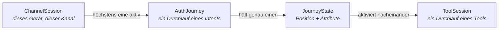
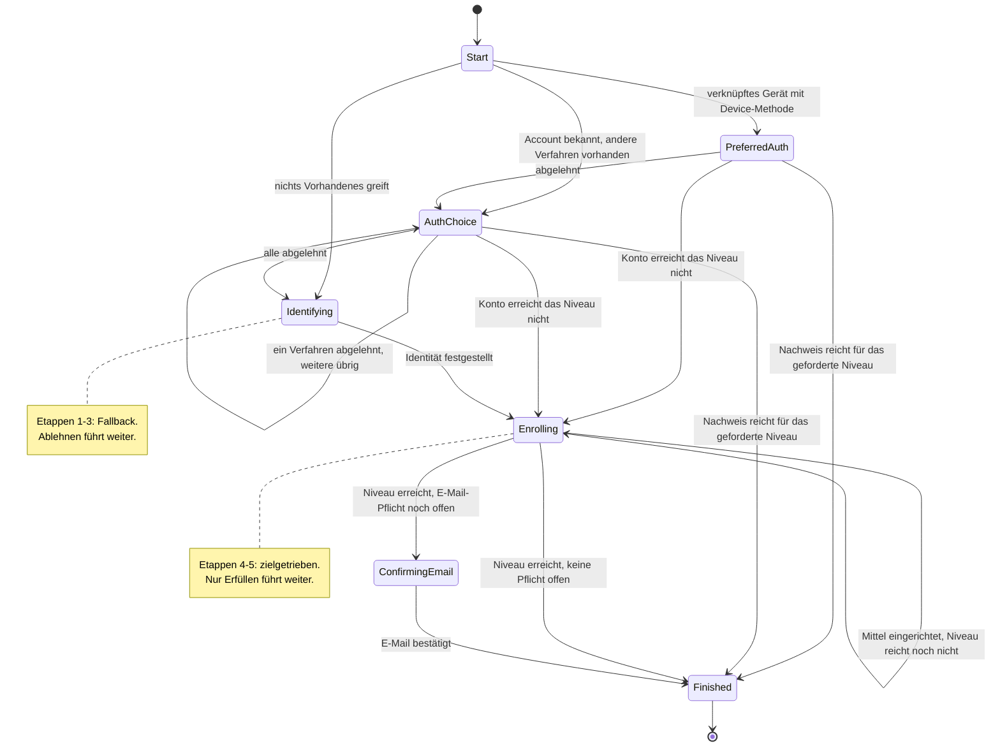
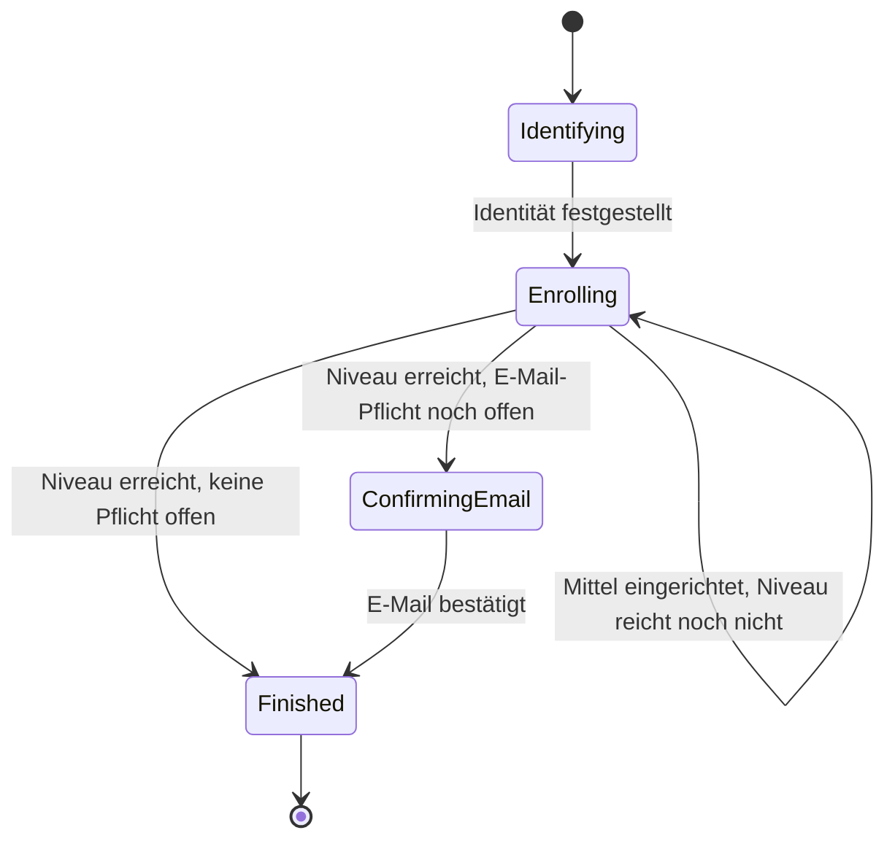
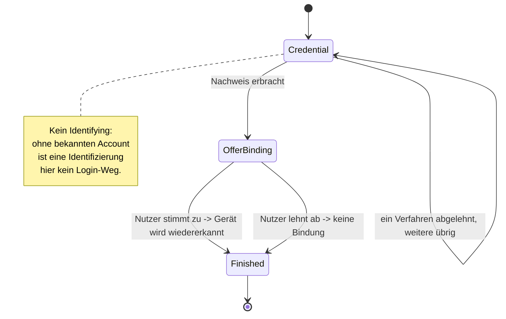
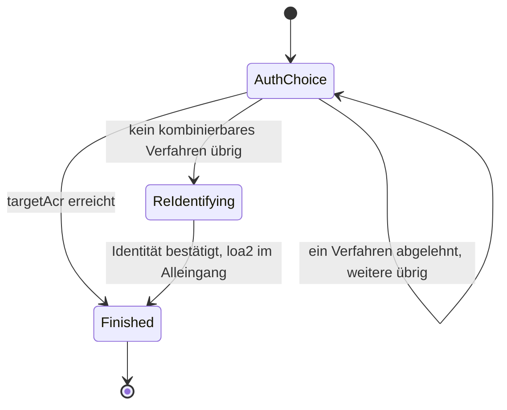
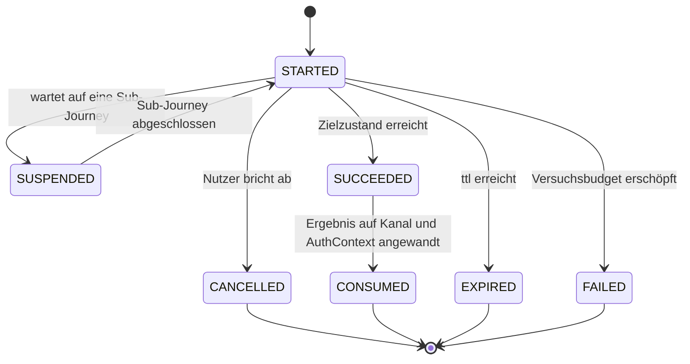

# Orchestrierung und Policy

Wie ein Nutzer zu seinem Ziel geführt wird — und wer entscheidet, welches Verfahren wann
angeboten wird.

Vorausgesetzt wird der `ToolOutcome`-Vertrag aus [03-tool-architektur.md](03-tool-architektur.md).

---

## 1) Begriffe

Fünf Begriffe tragen dieses Kapitel. Sie bauen aufeinander auf, deshalb hier in der Reihenfolge,
in der sie voneinander abhängen.

### Intent

Ein **Intent** ist das Ziel des Nutzers *zusammen mit* der Strategie, nach der er dorthin geführt
wird. Beides gehört untrennbar zusammen: „bring mich rein" und „biete zuerst das Gerät an, dann
andere Verfahren, notfalls eine Identifizierung" sind nicht zwei Entscheidungen, sondern eine.

Der Intent ist damit die Antwort auf drei Fragen, die sich je Ziel unterschiedlich beantworten:

- Welche Verfahren dürfen hier überhaupt angeboten werden — und in welcher Reihenfolge?
- Was bedeutet ein abgeschlossenes Tool in diesem Kontext? Derselbe erfolgreiche `ident-fsc`
  heißt an einer Stelle „lege einen Account an" und an anderer „bestätige den bekannten Account".
- Wann ist das Ziel erreicht?

Ein Intent ist ausdrücklich **keine** Beschreibung dessen, was am Ende herauskam. Ob ein
Durchlauf rückblickend eine Registrierung oder ein Login war, ist eine Beobachtung über den
gelaufenen Weg — kein Ziel, das man vorab wählt.

### Journey

Eine **`AuthJourney`** ist ein laufender Durchlauf eines Intents: eine geführte Wegstrecke mit
einem Ziel. Sie gehört zu genau einer `ChannelSession` und lebt kürzer als diese; pro Kanal ist
immer höchstens eine Journey aktiv.

Die Journey hält, was den ganzen Weg über gilt (Intent, Account, Budget, Lebenszyklus). Wo auf
dem Weg der Nutzer gerade steht, hält sie **nicht** selbst — das ist der `JourneyState`.

### JourneyState

Der **`JourneyState`** ist die Position auf dem Weg — und trägt die Attribute, die genau an dieser
Position gelten. Zwei Beispiele, die den Unterschied zu einem bloßen Statuswort zeigen: Der
Zustand „Nutzer wählt unter mehreren Auth-Verfahren" trägt, *welche* angeboten wurden und
*welche* er bereits verworfen hat. Der Zustand „ein Tool läuft gerade" trägt, *welche*
`ToolSession` dafür autorisiert ist.

Jeder Intent hat seine eigene, versiegelte Zustandsmenge — die Zustände von `MANAGE` ergeben für
`LOGIN_LOOKUP` keinen Sinn und sind dort nicht formulierbar. Eine vergessene Position ist damit
ein Compile-Fehler, kein plausibel aussehender Laufzeit-Default.

Der `JourneyState` ist außerdem die einzige Quelle für zwei Fragen, die sonst leicht auseinander
laufen: „welches Tool darf der Client jetzt aktivieren?" und „wohin schicke ich ihn als
nächstes?". Beide beantwortet dieselbe Funktion (Abschnitt 4).

### Etappe

Eine **Etappe** ist ein Zustand, verstanden als Position in einer Reihenfolge. Im Code heißt sie
`stage`. Der Begriff existiert, weil zwei sehr verschiedene Reihenfolge-Regeln nebeneinander
vorkommen:

- Eine **Fallback-Etappe** wird verlassen, wenn der Nutzer sie ablehnt oder sie scheitert. Sie
  fragt: „Geht es so? Nein? Dann anders." Die Reihenfolge geht vom bequemsten zum aufwendigsten
  Weg — daher die Leiter-Vorstellung bei `FAST`.
- Eine **zielgetriebene Etappe** wird verlassen, wenn ihre Bedingung erfüllt ist. Sie fragt:
  „Ist die Pflicht erledigt?" Ablehnen hilft hier nicht weiter.

Beide kommen in derselben Zustandsmenge vor (etwa in `FAST`), und die Unterscheidung gehört
sichtbar in den Code, nicht in einen Kommentar.

Nicht zu verwechseln mit **Stufe**, was in diesem Projekt durchgehend das Vertrauensniveau meint
(`loa1`/`loa2`/`loa3`), und mit **Schritt**, was der Schritt *innerhalb* eines Tools ist
(`next.step`).

### Tool

Ein **Tool** ist ein einzelnes Verfahren (`ident-fsc`, `enroll-sms`, `auth-device`, …), das der
Nutzer durchläuft. Ein Tool weiß nichts über Journeys, Intents oder Reihenfolgen — es meldet nur
sein Ergebnis als `ToolOutcome` ([Tool-Architektur](03-tool-architektur.md)). Was dieses Ergebnis
bedeutet, entscheidet der Intent.

### Die Ebenen im Zusammenhang



---

## 2) Die fünf Intents

| `AuthIntent` | Ziel | Einstieg |
|---|---|---|
| `FAST` | So schnell wie möglich in einen Login auf diesem Gerät — und so, dass es künftig wieder klappt | `POST /channels` (Default) |
| `REGISTER` | Bewusst frische Identifizierung, auch auf einem bereits verknüpften Gerät | `POST /channels` mit `intent=register` |
| `LOGIN_LOOKUP` | Bestehenden Account ohne Gerätebindung anmelden (klassischer Web-Login) | `POST /channels` mit `intent=login` |
| `STEP_UP` | Niveau anheben | nur auf einem `AUTHENTICATED`-Kanal |
| `MANAGE` | Auth-Mittel hinzufügen oder entfernen | nur auf einem `AUTHENTICATED`-Kanal |

Registrierung ist **kein eigener Intent**, sondern ein Pfad innerhalb von `FAST`: die letzte
Etappe, wenn kein vorhandenes Verfahren mehr greift. Ob dabei ein Account entsteht oder ein
bestehender wiedergefunden wird, entscheidet `findOrCreateAccount` im Nachhinein.

`REGISTER` ist trotzdem ein eigener Intent, weil „ich will hier bewusst neu identifizieren" ein
anderes Nutzerziel ist als „bring mich rein": es unterdrückt den `DeviceAccountLink`-Lookup und
bietet nie eine bestehende Kontobindung an. Es erzwingt aber **keinen** zweiten Account —
dieselbe KVNR findet weiterhin denselben Account wieder.

Der gewählte Intent wird auf der `ChannelSession` gemerkt. Das ist kein Detail: Resume und Abbruch
starten denselben Intent erneut, weshalb ein abgebrochener Lookup-Login wieder ein Lookup-Login
wird und nicht stillschweigend zur Registrierung umschlägt.

---

## 3) Die Journeys im Einzelnen

Gemeinsam für alle Diagramme: Ein Pfeil ist ein Übergang, ausgelöst durch ein `JourneyEvent`
(Tool abgeschlossen, Tool abgebrochen, Kind-Journey fertig). `abgelehnt` steht für „gescheitert
oder vom Nutzer verworfen, und es ist auf dieser Etappe nichts mehr übrig".

Terminale Zustände (`Finished`) sind eingezeichnet, existieren aber bewusst **nicht** als
persistierter Zustand: Das Ende einer Journey ist die Entscheidung `Decision.Finish`, die sie
abschließt. Ein zusätzlicher Endzustand wäre eine zweite Darstellung derselben Tatsache.

### `FAST`

Die Leiter vom bequemsten zum aufwendigsten Weg — und danach die Pflichtetappen, die dafür
sorgen, dass der nächste Login wieder klappt.



```kotlin
sealed interface FastState : JourneyState {
    data object Start : FastState
    /** Verknüpftes Gerät mit passender Device-Methode: genau ein Default-Vorschlag. */
    data class PreferredAuth(val toolId: String, val active: ToolRef?) : FastState
    /** Weitere vorhandene Auth-Verfahren. */
    data class AuthChoice(val offered: List<String>, val declined: Set<String>, val active: ToolRef?) : FastState
    /** Letzte Fallback-Etappe: Identifizierung - hier für Login *und* Registrierung. */
    data class Identifying(val offered: List<String>, val declined: Set<String>, val active: ToolRef?) : FastState
    data class ConfirmingEmail(val offered: List<String>, val declined: Set<String>, val active: ToolRef?) : FastState
    /** emailObligation merkt sich, dass dieser Lauf über Identifying kam - s. Abschnitt 8. */
    data class Enrolling(val offered: List<String>, val declined: Set<String>,
                         val active: ToolRef?, val emailObligation: Boolean) : FastState
}
```

`Identifying` ist gleichzeitig Login-Notausgang und Registrierungseinstieg. Eine
`REGISTRATION`/`LOGIN`-Trennung gibt es nicht, weil sie im Zustandsmodell keinen eigenen Zustand
hätte: Welches von beidem es war, entscheidet erst `findOrCreateAccount` danach. Genau deshalb
darf eine leere Kandidatenliste hier auch nicht abbrechen — „keine Auth-Verfahren vorhanden" ist
der Grund, aus dem `Identifying` als Login-Weg überhaupt erlaubt wird.

Auf einer Fallback-Etappe sammelt `declined` die verworfenen Verfahren, bis nichts mehr übrig ist
und die nächste Etappe dran ist. Auf einer zielgetriebenen Etappe passiert das **nicht**: Wer dort
zurückgeht, wählt anders, gibt aber die Pflicht nicht auf — deshalb kommt die volle Auswahl
zurück, das gerade verworfene Verfahren eingeschlossen.

### `REGISTER`

Dieselben Etappen wie `FAST` ab `Identifying`, nur mit direktem Einstieg dort und unterdrücktem
`DeviceAccountLink`-Lookup. Weil es wörtlich dieselben Etappen sind, teilt sich `REGISTER` auch
die Zustandsmenge `FastState`; die Strategie überschreibt genau eine Methode — wo die Leiter
beginnt.



### `LOGIN_LOOKUP`

Anmelden ohne gepaartes Gerät: Der Nutzer nennt einen Identifikator (E-Mail) und weist ein
Credential nach. Angeboten wird der abgeleitete Satz aller `MethodRole.LOOKUP_AUTH`-Tools — nicht
`AuthPolicy.candidateTools`, das einen bereits aufgelösten Account bräuchte, den es hier noch
nicht geben kann.



```kotlin
sealed interface LookupState : JourneyState {
    data object Start : LookupState
    data class Credential(val offered: List<String>, val declined: Set<String>, val active: ToolRef?) : LookupState
    /** Ausdrücklich und optional: „Dieses Gerät für künftige Logins wiedererkennen?" */
    data class OfferBinding(val accountId: Long) : LookupState
}
```

Die Gerätewiedererkennung (`DeviceAccountLink`) entsteht hier **nur** nach Zustimmung. Sie ist
eine dauerhafte Zuordnung Gerät → Account und darf nicht als Nebenwirkung eines Logins entstehen,
den der Nutzer gerade deshalb gewählt hat, weil er ohne Gerätebindung auskommen wollte.

Dass es kein `Identifying` gibt, ist keine zusätzliche Prüfung, sondern eine fehlende Möglichkeit:
Kein Zustand dieses Intents bietet je ein Ident-Verfahren an, also kann auch keine Prüfung
vergessen werden.

**Enumeration-Schutz**: Eine unbekannte E-Mail liefert exakt dieselbe Antwortform wie ein korrekt
aufgelöster Account mit falschem Credential — nie eine eigene Fehlerform, auch nicht im Timing
der Demo-Werte ([API](05-api.md)). Bewusst nicht weiter gehärtet (kein künstliches
Timing-Padding); in einem Produktivsystem der nächste Schritt.

### `STEP_UP`



```kotlin
sealed interface StepUpState : JourneyState {
    /** Das Ziel dieses Laufs - nicht zu verwechseln mit der dauerhaften Untergrenze des Kanals. */
    val targetAcr: String

    data class Start(override val targetAcr: String, val startingAcr: String) : StepUpState
    data class AuthChoice(override val targetAcr: String, val startingAcr: String,
                          val offered: List<String>, val declined: Set<String>, val active: ToolRef?) : StepUpState
    data class ReIdentifying(override val targetAcr: String, val startingAcr: String,
                             val offered: List<String>, val declined: Set<String>, val active: ToolRef?) : StepUpState
}
```

`ReIdentifying` ist der Notausgang aus dem **Ein-Methoden-Fall**: Ein Account mit genau einer
aktiven Auth-Methode hätte nach einem frischen gerätegebundenen Login (nur `loa1`) sonst keinen
Weg zu `loa2` — es gibt keine zweite Methode zum Kombinieren. `ident-fsc` erreicht `loa2` im
Alleingang. Bewusst ein eigener Zustand und nicht Teil von `AuthChoice`: Re-Identifizierung soll
nie als generische Login-Abkürzung erscheinen, nur als Ausweg aus dieser einen Sackgasse. Sie wird
deshalb ausschließlich angeboten, solange dieser Step-up als Vorbedingung eines anderen Intents
läuft (Abschnitt 6) — ein gewöhnlicher Step-up bietet weiterhin nur eingerichtete Verfahren an.
Die neu festgestellte Person muss zum angemeldeten Account passen (`409` bei Abweichung), sonst
könnte eine `loa1`-Session eine fremde Identität einschleusen.

### `MANAGE`


```kotlin
sealed interface ManageState : JourneyState {
    /** Der Wunsch, bevor das loa2-Gate ausgewertet ist - und der Parkzustand während des Step-ups. */
    data object AddRequested : ManageState
    data class RemoveRequested(val methodInstanceId: String) : ManageState
    data class Enrolling(val offered: List<String>, val declined: Set<String>, val active: ToolRef?) : ManageState
}
```

`MANAGE` ist der einzige Intent ohne Policy-Ziel: **ein** erfolgreiches Enrollment beendet ihn,
unabhängig vom erreichten Niveau — der Kanal war ja bereits `AUTHENTICATED`. Um ein zweites
Mittel hinzuzufügen, startet man eine neue Journey.

Es gibt bewusst **keinen** eigenen „wartet auf Step-up"-Zustand: Die Journey bleibt schlicht in
`AddRequested`/`RemoveRequested` stehen, während die Kind-Journey läuft. Dass gewartet wird, sagen
bereits `JourneyLifecycle.SUSPENDED` und die `parentJourneyId` der Kind-Journey — eine zweite
Kopie derselben Information könnte nur auseinanderlaufen. Genau dieses Parken ist der Grund,
weshalb der Wunsch den Step-up überlebt: Nach dessen Abschluss wird derselbe Zustand erneut
ausgewertet, prüft das Gate neu und führt aus, was ursprünglich verlangt war.

Das `loa2`-Gate selbst folgt derselben Anti-Selbsteskalations-Logik wie die
`enrolledUnderAcr`-Deckelung (Abschnitt 8): Eine gekaperte `loa1`-Session darf nicht aus eigener
Kraft Credentials hinzufügen oder entfernen. Das Entfernen prüft zusätzlich, dass der Account
danach die Untergrenze des Kanals noch erreichen kann (`409`, Selbstsperrschutz).

### Lebenszyklus, unabhängig vom Intent

Die intent-eigenen Zustände beschreiben den Weg; `JourneyLifecycle` beschreibt, ob die Journey
überhaupt noch läuft.



---

## 4) `next` folgt aus dem Zustand

Alle Zustände erfüllen einen gemeinsamen Vertrag:

```kotlin
sealed interface JourneyState {
    /** Was in diesem Zustand aktivierbar ist. Leer für terminale und wartende Zustände. */
    fun activatable(): Set<String>
    /** Das gerade laufende Tool, falls eines aktiviert wurde. */
    val active: ToolRef?
    /** `next.context`/`next.step` der orchestrator-eigenen Seite dieses Zustands. */
    val selectionContext: String
    val selectionStep: String
}
```

Daraus folgt **eine** Ableitungstabelle:

| `active` | `activatable()` | `next` |
|---|---|---|
| gesetzt | — | `type="tool"`, Schritt der laufenden `ToolSession` |
| null | genau ein Eintrag | `type="tool"`, `startStep` des Descriptors |
| null | mehrere | `type="orchestrator"`, Auswahlseite |
| null | leer | `type="orchestrator"`, orchestrator-eigene Seite (Bestätigung, Abschluss) |

Die Prüfung „darf dieses Tool jetzt aktiviert werden?" ist dieselbe Funktion — Mitgliedschaft in
`activatable()`. Beide Fragen an einer Stelle beantwortet heißt: Sie können nicht auseinander
driften, und ein Zustand, der ein Tool nicht anbietet, kann es auch nicht versehentlich zulassen.

`next.type` ist `"tool"` oder `"orchestrator"`. Beide Werte beantworten dieselbe Frage: Wem
gehört der nächste Screen, und welchen Endpunkt ruft der Client als nächstes.

Bei genau einem Kandidaten entfällt die Auswahlseite — bei einer Wahl ist nichts zu wählen.

---

## 5) Die zwei Verträge: SPI und API

### `IntentStrategy` — der SPI

Symmetrisch zu `tool_spi`: dort beschreiben sich Tools selbst, hier beschreiben sich Intents
selbst.

```kotlin
interface IntentStrategy<S : JourneyState> {
    val intent: AuthIntent
    fun initial(ctx: JourneyContext): S

    /** Bedeutung eines abgeschlossenen Tools - ein reiner Wert, keine Ausführung. */
    fun interpret(state: S, tool: ToolDescriptor, outcome: ToolOutcome.Completed): Interpretation

    /** Der einzige Übergang: ein erschöpfendes `when` über state x event. */
    fun next(state: S, event: JourneyEvent, ctx: JourneyContext): Decision

    /** Wohin der Kanal beim Abbruch zurückfällt. */
    fun onCancel(state: S): ChannelState
}

sealed interface JourneyEvent {
    data object Started : JourneyEvent
    data class Completed(val tool: ToolDescriptor, val outcome: ToolOutcome.Completed) : JourneyEvent
    data class Abandoned(val tool: ToolDescriptor) : JourneyEvent
    data class SubJourneyFinished(val achievedAcr: String?) : JourneyEvent
}

sealed interface Decision {
    data class Advance(val to: JourneyState) : Decision
    data class RequireSubJourney(val intent: AuthIntent, val targetAcr: String, val resumeWith: JourneyState) : Decision
    data object Finish : Decision
    /** Der Nutzer gibt auf - endet wie ein ausdrückliches Abbrechen, nicht als Fehler. */
    data object Cancel : Decision
    /** Der einzige Effekt einer Strategie, der kein Tool-Lauf ist: Mittel deaktivieren. */
    data class Remove(val methodInstanceId: String) : Decision
    /** Es geht gar nicht weiter (410) - nie bloß „keine Kandidaten mehr". */
    data class Abort(val reason: String) : Decision
}
```

Entscheidungen dahinter:

- **Ein Übergang statt vier.** „Erstes Angebot", „nach einem abgeschlossenen Tool", „nach einem
  Abbruch" und „Rückkehr aus einer Sub-Journey" beantworten alle dieselbe Frage. Sie sind ein
  `next` mit einem Event-Parameter.
- **Die Strategie liefert `Decision`, nicht `Next`.** Sonst baut jeder Intent die
  Skip-if-single-Candidate-Regel nach. Eine gemeinsame Maschinerie macht aus der `Decision` den
  neuen Zustand und daraus `next`.
- **Es gibt kein eigenes „biete diese Tools an".** Ein Zustand trägt sein Angebot bereits selbst
  (`activatable()`), also *ist* `Advance` auf diesen Zustand das Angebot. Eine zusätzliche
  `Offer`-Variante wäre dieselbe Information zweimal.
- **`Abort` ist eine Entscheidung der Strategie**, kein Automatismus der Kandidatenauflösung.
  Eine leere Kandidatenliste muss „nächste Etappe" bedeuten dürfen, sonst ist eine Fallback-Leiter
  nicht formulierbar.
- **Die Strategie bekommt nie Services**, nur einen lesenden `JourneyContext` (Account, Evidence,
  Untergrenze, Gerätebezug, Katalogabfragen). Sie entscheidet, sie wirkt nicht.

Welche Tools für ein Angebot überhaupt in Frage kommen, beantwortet `CandidateTools` — abgeleitet
aus den Descriptors, die die Module registrieren. Dort steht keine einzige `toolId`; ein neues
Verfahren tritt einem Angebot bei, indem es seine Rolle deklariert.

### `Interpretation` — Bedeutung als Wert

```kotlin
sealed interface Interpretation {
    /** FAST/REGISTER: findOrCreateAccount + dauerhafte Identifikations-Historie. */
    data object AdoptIdentity : Interpretation
    /** STEP_UP/MANAGE: muss zum bereits bekannten Account passen, sonst 409. */
    data object ConfirmIdentity : Interpretation
    data class AdoptCredential(val bindDevice: Boolean) : Interpretation
    /** useOutcomeAccount: nur LOGIN_LOOKUP traut einem Tool zu, den Account selbst aufzulösen. */
    data class AcceptProof(val useOutcomeAccount: Boolean, val bindDevice: Boolean) : Interpretation
}
```

Damit steht die zentrale Asymmetrie im Typsystem: Derselbe `ident-fsc`-Abschluss heißt in `FAST`
„Account finden oder anlegen" und in `STEP_UP`/`MANAGE` „bestätige den bekannten Account, sonst
`409`".

Enthalten ist nur, was sich je Intent tatsächlich **unterscheidet**. Alles Mechanische —
`personId`, `enrollmentRef`, `amr`, `achievedAcr` — liest die Maschinerie direkt vom Outcome ab;
es hier zu doppeln hieße nur, es zweimal pflegen zu müssen.

`bindDevice` macht die Gerätewiedererkennung zu einer sichtbaren Entscheidung je Intent:
`FAST`/`REGISTER` setzen `true`, `LOGIN_LOOKUP` setzt `false` bis zur Zustimmung im
`OfferBinding`-Zustand.

Zentral und für Strategien nicht erreichbar bleiben: Nachweis in den `AuthContext` übernehmen,
`SessionEvent` schreiben, und die Deckelung `min(achievedAcr, enrolledUnderAcr)`.

### `JourneyApi` — was Tool-Controller sehen

```kotlin
interface JourneyApi {
    fun activate(journey: AuthJourney, tool: ToolDescriptor, toolSessionId: UUID)  // prüft und übernimmt
    fun applyOutcome(journey: AuthJourney, channel: ChannelSession, tool: ToolDescriptor, outcome: ToolOutcome): Step
    fun abandon(journey: AuthJourney, channel: ChannelSession, tool: ToolDescriptor): Step
    fun cancel(journey: AuthJourney, channel: ChannelSession)
    fun nextOf(journey: AuthJourney): Next
}
```

Die **einzige** Berührungsfläche der Tool-Controller mit dem Journey-Modell: kein Setzen von
Routing-Feldern, kein Typ-Switch auf einen Intent, keine Entscheidung darüber, welches Tool laufen
darf. `Step` ist dabei schlicht `next` plus die Daten, die dieser Schritt zum Rendern braucht.

Zwei Aktionen, die der Client sauber auseinanderhalten muss: `abandon` lehnt die aktuelle
**Etappe** ab und führt die Journey weiter (`DELETE /tools/{toolSessionId}/{toolId}`); `cancel`
gibt die **Journey** auf und startet den Entry-Intent neu (`DELETE .../process`). Wer nur
letzteres anbietet, lässt den Nutzer auf einer Fallback-Etappe im Kreis laufen.

---

## 6) Sub-Journey

`Decision.RequireSubJourney` legt eine eigene `AuthJourney` mit `parentJourneyId` an. Bei deren
`Finished` reaktiviert die Maschinerie den Parent mit `resumeWith`.

Invariante: pro Kanal ist immer genau **eine** Journey aktiv — die Kind-Journey läuft, der Parent
ist `SUSPENDED`, nicht parallel. Der Step-up behält dadurch seine eigenen
`startingAcr`/`achievedAcr` und sein eigenes Audit, statt als Umleitung von Hand nachgebaut zu
werden.

---

## 7) Versuchsbudget

`attemptBudget` liegt auf der `AuthJourney`, nicht auf der `ToolSession`. Jedes `Failed` zieht ab,
unabhängig davon, auf welcher Etappe oder in welchem Tool. Bei `0` endet die **ganze Journey**
(`410`) — auch wenn noch Etappen übrig wären.

Das ist eine Sicherheitsanforderung: Sobald erschöpfte Versuche eine Etappe weiterrücken statt zu
terminieren, wird Brute-Force über die Leiter billiger. Ein tool-lokaler Zähler kann das
strukturell nicht abdecken.

Die Retry-Regel selbst: Ein fehlgeschlagener Versuch mit verbleibendem Budget ist **kein**
HTTP-Fehlerfall, sondern verhält sich wie fehlende Eingabe (`200` plus Navigation, Grund in
`stepData.error`). Erst das erschöpfte Budget endet terminal (`410`) — HTTP-Fehlercodes
signalisieren gestörte Abläufe, nicht erwartbare Eingabefehler ([API](05-api.md)).

Nicht gelöst und ausdrücklich offen: Brute-Force-Schutz auf Kontoebene über mehrere Journeys
hinweg. Das Budget ist journey-lokal und dazu orthogonal.

---

## 8) AuthPolicy: Mehr-Faktor-Entscheidung

Die Strategien fragen die `AuthPolicy`, statt selbst zu entscheiden, was genug ist — sie ist die
einzige Stelle mit diesem Wissen.

```kotlin
interface AuthPolicy {
    fun isSatisfied(evidence: AuthEvidence, requiredAcr: String, account: AccountProfile?): Boolean
    fun candidateTools(evidence: AuthEvidence, requiredAcr: String, account: AccountProfile, bindingKeyRef: String): List<String>
    fun reIdentCandidates(evidence: AuthEvidence, requiredAcr: String): List<String>
    fun canAccountReach(account: AccountProfile, requiredAcr: String): Boolean
    fun enrollmentCandidates(account: AccountProfile, requiredAcr: String): List<String>
    fun resolveAcr(evidence: AuthEvidence, account: AccountProfile?): String
}
```

Zwei Bedingungen müssen zusammen erfüllt sein:

1. **Niveau**: `resolveAcr(evidence) >= requiredAcr`. Die Abbildung von `amr`-Kombinationen auf
   `acr`-Werte ist fachlich/regulatorisch offen und hier bewusst nicht endgültig festgeschrieben.
   RFC 8176 definiert eine IANA-Registry für `amr`-Werte (`pwd`, `otp`, `hwk`/`swk`, `user`,
   `face`, `fpt`, `mfa`, …), aber welche Kombination welches Vertrauensniveau (eIDAS/BSI/NIST je
   nach Kontext) ergibt, ist damit nicht festgelegt. Die `amr`-Strings dieses Projekts (`sms`,
   `password`, `email`, `fsc`, `device`, `pin`, `biometric`) folgen deshalb einer eigenen,
   methodennamen-nahen Konvention.
2. **Faktorvielfalt**: Für MFA-Stufen mindestens zwei **verschiedene** Faktorarten — gezählt wird
   die Vereinigung der `factorTypes` über alle abgeschlossenen Tools, nie die Tool-Anzahl. Ein
   einzelnes Tool, das selbst schon zwei Faktorarten meldet (z. B. ein Passkey mit User
   Verification), erfüllt MFA im Alleingang.

Wichtige Einschränkung: Ein Tool darf nur Faktoren melden, die es dem Server gegenüber tatsächlich
**nachweisen** kann. Eine nur lokal geprüfte App-PIN schützt das Gerät, nicht die Anfrage — dafür
gehört nur `{possession}` in den Descriptor.

### Session-Nachweis ist nicht gleich Account-Fähigkeit

Auf einer Auth-Etappe lautet die Frage „reicht das *jetzt*?" (`isSatisfied`). Auf einer
Enrollment-Etappe lautet sie „kommt der Nutzer damit *künftig wieder herein*?"
(`canAccountReach`) — verschiedene Fragen, weil ein Identifikationsverfahren keine dauerhafte
Auth-Methode ist: `ident-fsc` zählt für `AuthContext.currentFactorTypes` dieser Session, landet
aber in `account.identifications`, nicht in `account.authenticationMethods`.

Daraus folgt eine Deckelungskette über drei Ebenen: `identifications[].loa` begrenzt, was ein
Account überhaupt je erreichen kann; `authenticationMethods[].enrolledUnderAcr` begrenzt, was eine
einzelne Methode liefern darf; `Completed.achievedAcr` meldet, was der konkrete Durchlauf erreicht
hat. Praktische Folge: Ein Kanal, der `loa3` verlangt, braucht bereits ein `loa3`-fähiges
Ident-Verfahren — wurde nur mit `loa2` identifiziert, bleiben auch alle danach eingerichteten
Methoden auf `loa2` gedeckelt. Deshalb ist die Untergrenze schon beim Anlegen des Kanals setzbar
([API](05-api.md)).

### Zwei Ebenen für das geforderte Niveau

- **`ChannelSession.acrFloor`** — die *dauerhafte Untergrenze* des Kanals. Ein Fachverfahren
  fordert „auf diesem Kanal nie unter `loa3`". Gilt für jede Journey darauf, auch für spätere, und
  trägt den Selbstsperrschutz beim Entfernen einer Methode.
- **`StepUpState.targetAcr`** — das *Ziel dieses einen Durchlaufs*. Nur `STEP_UP` hat eins.

Gerechnet wird stets mit dem Maximum beider. Ein vom Client genanntes Niveau ist immer eine
Untergrenze, nie eine Erlaubnis: Das Backend setzt `max(Policy-Anforderung, Client-Wunsch)`.

### Pflichten sind Zustände

Keycloak kennt „Required Actions": pro Nutzer abzuarbeitende Pflicht-Schritte wie `VERIFY_EMAIL`,
die vor Abschluss der Session erledigt sein müssen. Hier sind sie kein eigenes Konzept, sondern
zielgetriebene Etappen: „ausreichendes Login-Verfahren eingerichtet" *ist* `Enrolling`,
„bestätigte E-Mail" *ist* `ConfirmingEmail`. Eine offene Pflicht ist definitionsgemäß eine
Position auf dem Weg.

Die Reihenfolge der Pflichten ist die Reihenfolge der Etappen — und sie lautet: erst ein
ausreichendes Login-Verfahren, dann die bestätigte E-Mail. Umgekehrt würde ein bestimmtes
Verfahren erzwungen, bevor der Nutzer überhaupt eines gewählt hat, obwohl `enroll-email` eine der
Wahlmöglichkeiten ist, die beide Pflichten in einem Schritt erledigt.

Der Geltungsbereich ergibt sich daraus, welcher Weg zu der Etappe geführt hat: Die E-Mail-Pflicht
gilt nur für einen Lauf, der über `Identifying` kam, also einen Account angelegt oder übernommen
hat — festgehalten im Attribut `Enrolling.emailObligation`. Wer sich lediglich anmeldet, wird nie
rückwirkend auf eine fehlende E-Mail-Bestätigung festgenagelt.

Beide Pflichten sind aus vorhandenem Zustand **abgeleitet** (`authenticationMethods`,
`emailConfirmedAt`), nicht als eigenes Account-Feld gespeichert — eine gespeicherte Liste brächte
Drift-Risiko ohne aktuellen Nutzen.

**Der Preis, ausdrücklich benannt**: Eine künftige dritte Pflicht, die *mehrere* Intents betrifft,
bedeutet denselben Zustand in mehreren Hierarchien. Bei genau zwei Pflichten, die beide ohnehin
Zustände sind, ist das der bessere Tausch; bei einer dritten, intent-übergreifenden Pflicht gehört
die Entscheidung neu geprüft.
