# Orchestrierung und Policy

Wie ein Nutzer zu seinem Ziel geführt wird — und wer entscheidet, welches Tool wann
angeboten wird.

Vorausgesetzt wird der `ToolOutcome`-Vertrag aus [03-tool-architektur.md](03-tool-architektur.md).

---

## Einstieg für Fachexperten

Jeder Ablauf, den ein Nutzer durchläuft, heißt nach seinem *Ziel*, nicht nach seinem technischen
Ablauf:

| Ziel aus fachlicher Sicht | Heißt im System |
|---|---|
| Möglichst reibungslos anmelden, mit Rückfallebenen | `FAST_ACCESS` |
| Bewusst neu identifizieren, auch auf einem bekannten Gerät | `REGISTER` |
| Klassischer Login ohne Gerätebindung | `LOOKUP_LOGIN` |
| Vertrauensniveau anheben (z. B. für eine sensible Aktion) | `STEP_UP` |
| Anmeldeverfahren hinzufügen oder entfernen | `MANAGE_AUTH_METHODS` |
| Konto unwiderruflich löschen | `DELETE_ACCOUNT` |
| Eine QR-Anmeldung auf einem anderen Gerät bestätigen | `CONFIRM_PEER_LOGIN` |
| Erneute Identifizierung, wenn nichts anderes mehr greift | `RE_IDENTIFY` |

Wer eine fachliche Frage stellt — „darf man X löschen, ohne sich frisch auszuweisen?" — findet
die Antwort in genau *einem* dieser Bausteine (Abschnitt 3), nicht verstreut über mehrere
Code-Ebenen. Für jedes Ziel gibt es ein vollständiges Zustandsdiagramm — jeder Zustand, jeder
Übergang, jede Bedingung ist darin sichtbar. Ausschnitt aus `FAST_ACCESS`:

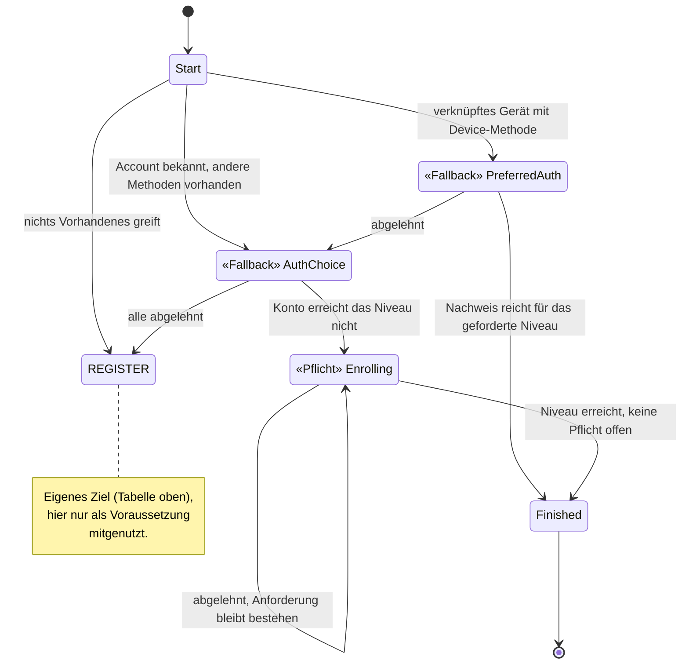

Wichtig für die fachliche Prüfung: Das System unterscheidet zwei Sorten von Zustand, und diese
Unterscheidung ist erzwungen, nicht optional — im Bild oben direkt an den Notizen ablesbar:

- **Fallback**: Ablehnen führt zum nächsten, aufwendigeren Weg (z. B. Gerät abgelehnt → andere
  Methode anbieten). Bequemlichkeit für den Nutzer, solange das Sicherheitsniveau am Ende
  trotzdem erreicht wird.
- **Pflicht**: Ablehnen führt nirgendwohin — die Anforderung bleibt bestehen, bis sie erfüllt
  ist. Für alles, was nicht verhandelbar ist (z. B. das geforderte Vertrauensniveau).

Ein fachlicher Fehler — „das sollte doch Pflicht sein, nicht Fallback" — lässt sich damit an
*diesem* Bild klären, ohne Entwickler zu Rate zu ziehen.

Manche Anforderungen tauchen in mehreren Zielen auf — „erneut identifizieren, wenn nichts anderes
mehr greift" gehört sowohl zu `FAST_ACCESS` als auch zu anderen Abläufen, und im Diagramm oben
ist sogar ein komplettes eigenes Ziel (`REGISTER`) nur die Voraussetzung für ein anderes. Das
System modelliert beides als eigenständige **Sub-Journey** (`RE_IDENTIFY`, `REGISTER`, Abschnitt
5), die von mehreren Zielen aus angestoßen wird, aber nur einmal definiert ist. Ändert sich die
fachliche Regel für Re-Identifizierung oder Registrierung, ändert sie sich an *einer* Stelle für
alle Abläufe, die sie nutzen.

Jede Aktion verlangt außerdem ein bestimmtes Niveau (`loa1`/`loa2`/`loa3`, Abschnitt 8) — je
sensibler die Aktion, desto höher die Hürde:

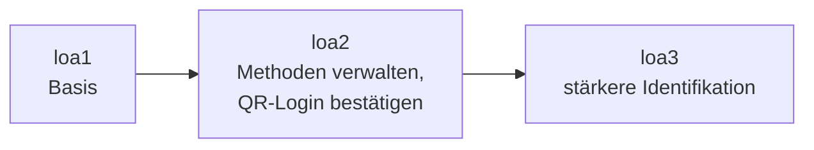

Konto löschen verlangt aktuell `loa2` **und** einen frischen Faktor, nicht `loa3`. Das ist an
genau der Stelle im Modell festgelegt, an der das jeweilige Ziel beschrieben ist — eine fachliche
Entscheidung wie „QR-Bestätigung braucht künftig einen frischen Nachweis, kein altes Niveau" ist
damit eine punktuelle, nachvollziehbare Änderung an der Beschreibung dieses einen Ziels.

Schließlich: Jeder Schritt, den ein Nutzer durchläuft, wird protokolliert und ist im Journey-Log
einsehbar — welches Verfahren wann angeboten, angenommen oder abgelehnt wurde, und welches
Niveau am Ende erreicht war. Für eine fachliche oder revisionsrelevante Frage („warum konnte
dieser Nutzer sein Konto ohne erneute Prüfung löschen?") braucht es damit keine Rekonstruktion
aus verteilten Systemlogs.

Ein konkretes Beispiel, das eine Person durch mehrere dieser Ziele führt:
[11-beispiel-story.md](11-beispiel-story.md). Was daraus insgesamt folgt:

- **Fachliche Regeln sind an einer Stelle beschrieben, nicht im Code verstreut** — jedes Ziel
  hat sein eigenes, vollständiges Zustandsdiagramm, das sich unabhängig von der Implementierung
  prüfen lässt.
- **Ausnahmen sind sichtbar, nicht implizit** — Fallback vs. Pflicht, welches Niveau eine
  Aktion verlangt, welche Wege zu einer Re-Identifizierung führen: alles steht explizit im
  Modell.
- **Wiederverwendete Abläufe bleiben eine einzige fachliche Wahrheit** — eine Regeländerung an
  einer Sub-Journey wirkt überall dort, wo sie eingebunden ist, ohne Abweichungsrisiko.
- **A/B-Tests werden möglich** — weil ein Ziel wie `FAST_ACCESS` ein eigenständiges, in sich
  geschlossenes Modell ist, lässt sich für denselben Intent eine zweite Journey-Variante
  danebenstellen und im laufenden Betrieb ausspielen.

---

## 1) Begriffe

Sieben Wörter haben in diesem Kapitel eine feste Bedeutung:

| Begriff | Bedeutung | Im Code |
|---|---|---|
| **Intent** | Ziel des Nutzers samt Strategie, die ihn dorthin führt | `AuthIntent` |
| **Journey** | ein laufender Durchlauf eines Intents | `AuthJourney` |
| **Zustand** | Position auf dem Weg, samt der dort geltenden Attribute | `JourneyState` |
| **Tool** | ein einzelner Ablauf, den der Nutzer durchläuft | `toolId` |
| **Methode** | was am Konto eingerichtet ist und einen Login ermöglicht | `method` |
| **Schritt** | ein Schritt *innerhalb* eines Tools | `next.step` |
| **Niveau** | Vertrauensniveau (`loa1`/`loa2`/`loa3`) | `acr` |

**Tool** und **Methode**: `enroll-sms` und `auth-sms` sind zwei Tools für *eine* Methode
(`sms`). Ein Konto hat Methoden; angeboten und aktiviert werden Tools.

Drei weitere Wörter meinen verschiedene Dinge: **Kandidaten** liefert der Katalog bzw. die Policy;
daraus wird das **Angebot**, das ein Zustand hält (`activatable()` — Kandidaten minus Abgelehntes
minus nicht Verfügbares, [Tool-Architektur](03-tool-architektur.md) Verfügbarkeit); eine
**Auswahlseite** zeigt der Client nur bei mehr als einem Eintrag. Bleibt nichts übrig, greift
derselbe Fallback wie beim Ablehnen aller Kandidaten (Rückfall auf Identifikation bzw.
`exhausted`/Cancel) — kein eigener Fehlerzustand für Nichtverfügbarkeit.

### Intent

Ein **Intent** ist das Ziel des Nutzers *zusammen mit* der Strategie, nach der er dorthin geführt
wird. Er beantwortet drei Fragen, je Ziel unterschiedlich:

- Welche Tools dürfen hier überhaupt angeboten werden — und in welcher Reihenfolge?
- Was bedeutet ein abgeschlossenes Tool in diesem Kontext?
- Wann ist das Ziel erreicht?

Ein Intent ist ausdrücklich **keine** Beschreibung dessen, was am Ende herauskam: Ob ein
Durchlauf eine Registrierung oder ein Login war, ist eine Beobachtung über den gelaufenen Weg.

### Journey

Eine **`AuthJourney`** ist ein laufender Durchlauf eines Intents. Sie gehört zu genau einer
`ChannelSession` und lebt kürzer als diese; pro Kanal ist immer höchstens eine Journey aktiv.

Die Journey hält, was den ganzen Weg über gilt (Intent, Account, Budget, Lebenszyklus), nicht aber
die Position des Nutzers — das ist der `JourneyState`.

Intent und Journey verhalten sich zueinander wie `ToolDescriptor` und `ToolSession`: der eine
benennt die *Art*, der andere ist *ein Durchlauf* davon. Ein Kanal kann nacheinander mehrere
Journeys desselben Intents durchlaufen.

### Zustand (`JourneyState`)

Der **`JourneyState`** ist die Position auf dem Weg — und trägt die Attribute, die genau an dieser
Position gelten: etwa *welche* Tools angeboten und *welche* bereits verworfen wurden, oder *welche*
`ToolSession` gerade autorisiert ist.

Jeder Intent hat seine eigene, versiegelte Zustandsmenge — die Zustände von `MANAGE_AUTH_METHODS`
sind für `LOOKUP_LOGIN` nicht formulierbar.

Der `JourneyState` ist außerdem die einzige Quelle für „welches Tool darf der Client jetzt
aktivieren?" und „wohin schicke ich ihn als nächstes?" — beides beantwortet dieselbe Funktion
(Abschnitt 4).

#### Zwei Sorten von Übergang

Einen erfolgreichen Nachweis behandeln alle Zustände gleich: Er bringt die Journey weiter. Sie
unterscheiden sich darin, was **Ablehnen** bewirkt:

- In einem **Fallback-Zustand** führt Ablehnen weiter — zum nächsten, aufwendigeren Weg. Mehrere
  davon bilden eine **Fallback-Kette** vom bequemsten zum aufwendigsten Weg; so ist `FAST_ACCESS`
  gebaut. Ist nichts Aufwendigeres mehr da, endet die Journey.
- In einem **Pflichtzustand** führt Ablehnen nirgendwohin. Die Pflicht bleibt bestehen, das
  volle Angebot kommt zurück — auch das gerade verworfene Tool. Nur Erfüllen bringt weiter.

Beide kommen in derselben Zustandsmenge vor (etwa in `FAST_ACCESS`); welche Sorte ein Zustand
ist, gehört sichtbar in den Code.

### Tool

Ein **Tool** ist ein einzelner Ablauf (`ident-fsc`, `enroll-sms`, `auth-device`, …). Es weiß
nichts über Journeys, Intents oder Reihenfolgen und meldet nur sein Ergebnis als `ToolOutcome`
([Tool-Architektur](03-tool-architektur.md)); was das bedeutet, entscheidet der Intent.

### Die Session-Ebenen im Zusammenhang

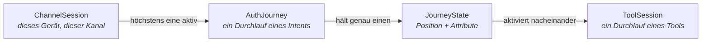

---

## 2) Die Intents

Vier **Entry-Intents** starten eine neue Sitzung auf dem `APP`-Kanal, `KC_SELECT_METHOD` ist der
Web-Kanal-eigene Login/Step-up-Einstieg, `REGISTER` ist zusätzlich über den Web-Kanal erreichbar
(s. u.); fünf weitere laufen innerhalb einer bestehenden Sitzung. `CONFIRM_PEER_LOGIN` ist die
Ausnahme, die **beides zugleich** ist (eigener Abschnitt unten):

| `AuthIntent` | Ziel | Einstieg |
|---|---|---|
| `FAST_ACCESS` | So schnell wie möglich in einen Login auf diesem Gerät, und so, dass es künftig wieder klappt | `POST /channels` (Default) |
| `REGISTER` | Bewusst frische Identifizierung, auch auf einem bereits verknüpften Gerät | `POST /channels` mit `intent=register` (App) bzw. `PATCH /kc/channels/{id}` mit `intent=register` (Web, s. u.) |
| `LOOKUP_LOGIN` | Bestehenden Account ohne Gerätebindung anmelden (klassischer Web-Login) | `POST /channels` mit `intent=lookup_login` |
| `KC_SELECT_METHOD` | Alle kc-nutzbaren Tools als einen `selectMethod`-Schritt anbieten; die Fallback-Logik fährt Keycloak selbst | Default-Entry-Intent des `KEYCLOAK`-Kanals ([05-api.md](05-api.md) Abschnitt 3) |
| `STEP_UP` | Niveau anheben | nur auf einem `AUTHENTICATED`-Kanal |
| `MANAGE_AUTH_METHODS` | Methoden hinzufügen oder entfernen | nur auf einem `AUTHENTICATED`-Kanal |
| `CONFIRM_PEER_LOGIN` | Einen wartenden `auth-qr`/`auth-qr-lookup`-Login des Web-Kanals bestätigen oder ablehnen | `POST /channels` mit `intent=confirm_peer_login` **oder** `POST /channels/{id}/peer-logins` auf einem `AUTHENTICATED`-Kanal — dasselbe Gate |
| `DELETE_ACCOUNT` | Konto unwiderruflich löschen | nur auf einem `AUTHENTICATED`-Kanal |
| `LOGOUT` | Bestätigtes Abmelden | nur auf einem `AUTHENTICATED`-Kanal |
| `RE_IDENTIFY` | Erneute Identifizierung als geteilte SubJourney | nie direkt, nur über `RequireSubJourney` |

`CONFIRM_PEER_LOGIN`s kalter Einstieg bietet nie eine Identifikation/Registrierung an: Ist kein
Konto über `DeviceAccountLink` bekannt, bricht die Journey sofort ab (410). Ist ein Konto bekannt,
gilt derselbe `STEP_UP`-Gate wie bei `MANAGE_AUTH_METHODS`; reichte das Niveau schon *vor* diesem
Durchlauf, verlangt `CONFIRM_PEER_LOGIN` zusätzlich einen frischen Re-Proof wie `DELETE_ACCOUNT`
(eigener Abschnitt unten).

`REGISTER` ist ein eigener Intent mit eigener Journey (`RegisterState`): Er unterdrückt den
`DeviceAccountLink`-Lookup und bietet nie eine bestehende Kontobindung an. `FAST_ACCESS` läuft ihn
als `Transition.RequireSubJourney`-Voraussetzung, sobald es identifizieren müsste — dasselbe Muster
wie bei `RE_IDENTIFY`. Einen zweiten Account erzwingt `REGISTER` **nicht**: Dieselbe KVNR findet
denselben Account wieder.

Der gewählte Intent wird auf der `ChannelSession` gemerkt. Resume und Abbruch starten denselben
Intent erneut: Ein abgebrochener Lookup-Login wird wieder ein Lookup-Login.

---

## 3) Die Journeys im Einzelnen

Gemeinsam für alle Diagramme: Ein Pfeil ist ein Übergang, ausgelöst durch ein `JourneyEvent`
(Tool abgeschlossen, Tool abgebrochen, Kind-Journey fertig). `abgelehnt` steht für „gescheitert
oder vom Nutzer verworfen, und in diesem Zustand ist nichts mehr übrig". Terminale Zustände
(`Finished`) sind eingezeichnet, existieren aber **nicht** als persistierter Zustand: Das Ende
einer Journey ist `Transition.Authenticated`.

### `FAST_ACCESS`

Erst die Fallback-Kette vom bequemsten zum aufwendigsten Weg, danach die Pflichtzustände für den
nächsten Login.

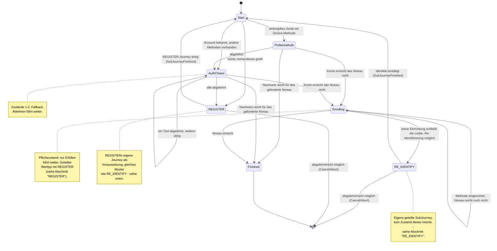

`PreferredAuth` trägt genau die eine vorgeschlagene `toolId`; `AuthChoice`/`Enrolling` tragen
Angebot und Ablehnungen (Fallback- bzw. Pflichtsemantik, s. o.) und sind geteilte Werttypen mit
`RegisterState` (Abschnitt „REGISTER" unten). `Enrolling` trägt zusätzlich `emailObligation`, das
`FAST_ACCESS` selbst nie setzt (immer `false`) — nur ein Lauf über `RegisterState.Identifying`
kennt die E-Mail-Pflicht (Abschnitt 8).

`FAST_ACCESS` identifiziert nie selbst: Fehlt ein Account oder ist jede Methode abgelehnt, läuft
`REGISTER`s eigene Journey als `Transition.RequireSubJourney`-Voraussetzung; schließt in
`Enrolling` keine Einrichtung die Lücke, fragt die geteilte `RE_IDENTIFY`-SubJourney (Abschnitt
„RE_IDENTIFY" unten). Nach `SubJourneyFinished` prüft `Start` per `afterProof` erneut, ob der
Nachweis reicht.

In einem Fallback-Zustand sammelt `declined` die verworfenen Tools, in einem Pflichtzustand
**nicht** (s. o.).

### `REGISTER`

`REGISTER`s eigene Journey (`RegisterState`) nutzt `AuthChoice`/`Enrolling` als geteilte Werttypen
mit `FAST_ACCESS` (s. o.) und besitzt zusätzlich `Identifying`, `ConfirmDeviceRebind`,
`Assigning`, `ConfirmingEmail` und `PasswordObligation` exklusiv. `FAST_ACCESS` läuft sie als Voraussetzung,
sobald es identifizieren müsste (s. o.).

Löst die frische Identifikation ein **anderes** Konto auf, als für dieses Gerät bereits
`DeviceAccountLink` hinterlegt ist ("Zweitaccount"), wird das nicht mehr still überschrieben:
`afterIdentification` erkennt den Konflikt als Allererstes, noch bevor ein Anmeldeverfahren
angeboten wird, und wechselt nach `ConfirmDeviceRebind`. Zustimmung (`accept`) bindet das Gerät um
(`Action.LinkDevice`), widerruft dabei das Geräte-Credential (`enroll-device`) des bisherigen
Kontos für genau diesen `bindingKeyRef` (`AccountDeletionService.revokeMethod`) und kehrt zu
`afterIdentification` zurück. Ablehnung (`decline`) bricht die Journey über `Transition.Cancel`
regulär ab — kein Fehler, dieselbe Semantik wie `DELETE .../journey` — und lässt die bestehende
Bindung unangetastet.

Hat die Identifizierung zwar bezeugt, WER jemand ist, aber niemanden im Register aufgelöst
(`ident-eid`: eine Karte trägt keine KVNR, ADR-18), geht es direkt nach `Assigning` — `next` zeigt
also gleich auf `ident-kvnr`. Eine Ja/Nein-Frage davor gibt es bewusst nicht: „Darf ich die Nummer
haben?" und das Formular, das nach ihr fragt, sind dieselbe Frage zweimal, und das Formular sagt
selbst, wofür die Nummer gut ist. Das Nein ist der normale Abbruch des Schritts
(`DELETE .../tools/{toolSessionId}/ident-kvnr`, im Frontend als „Jetzt nicht" beschriftet): Der
Lauf läuft weiter, das Konto bleibt **Interessent** (ADR-10) mit voll bezeugter Identität, nur ohne
Registerbindung. Ein Fallback-, kein Pflichtzustand; ein `ident-fsc`-Lauf (Register bürgt, PersonId
sofort dabei) erreicht ihn nie.

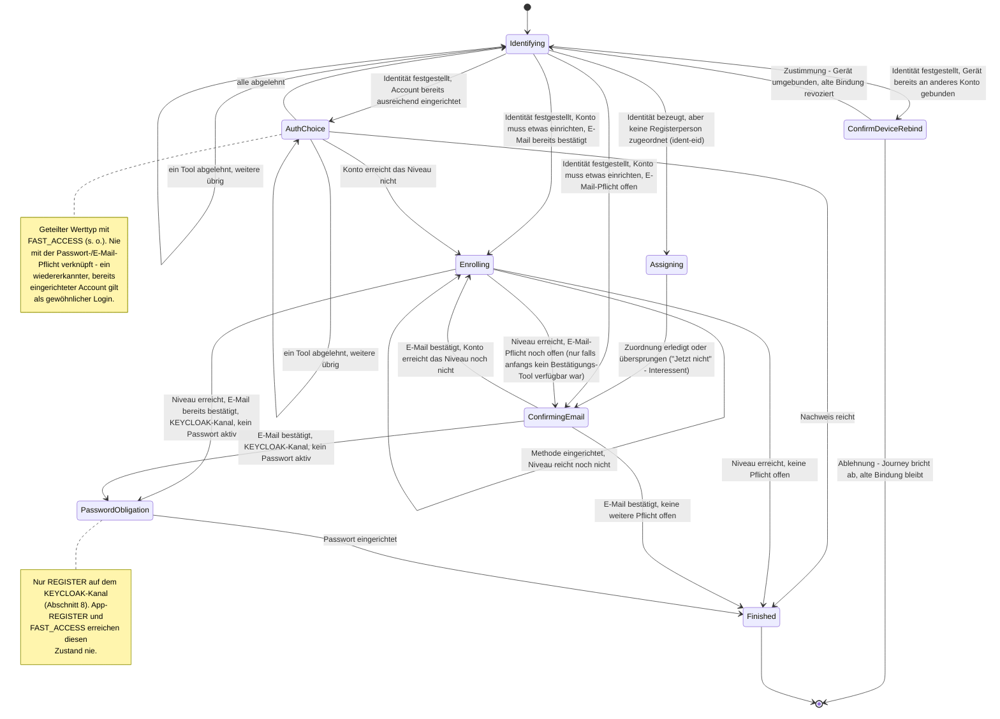

`Identifying` ist gleichzeitig Login-Notausgang (für `FAST_ACCESS`, per Sub-Journey) und
Registrierungseinstieg. Eine `REGISTRATION`/`LOGIN`-Trennung gibt es nicht: Welches von beidem es
war, entscheidet erst die Claim-basierte Account-Auflösung danach; eine leere Kandidatenliste darf
hier nicht abbrechen. `Identified` heißt in `REGISTER` immer „finde oder übernimm den Account"
(`AdoptIdentity`), in `RE_IDENTIFY` dagegen `ConfirmIdentity`.

Bei `Resolution.Unresolved` schreibt der Lauf auf das Konto, das er schon hat, solange dieses noch
keine PersonId trägt; sonst entsteht ein neues Konto ohne Personenbindung. Ein bereits
identifiziertes Konto nimmt eine fremde Bezeugung nie an: Gehört der Kanal nur dem Gerät (der
Zweitaccount-Fall, Abschnitt 2), bekommt der Lauf sein eigenes Konto, sonst wird er abgewiesen.
`recordClaims` schreibt PersonId wie E-Mail über den gemeinsamen Claim-/Ankerpfad. Anlage, Claims und
Journey-Zustand teilen dieselbe Transaktion; ein Konflikt rollt auch den neuen Account zurück.
Bekannte Konten werden ausschließlich über Anker aufgelöst ([12-entscheidungen.md](12-entscheidungen.md)
ADR-19) — für eid-Bezeugungen ist das die kartengebundene `restricted_id`, ohne Anker-Treffer
bleibt es beim neuen Interessenten.
Bei `ConfirmIdentity` erzwingt die Account-Schicht Erstbindung, Unveränderlichkeit der PersonId und
Ankerbesitz. Findet der Schritt ein **anderes** Konto als das, mit dem die Journey arbeitet, geht
das vorläufige der beiden im anderen auf ([12-entscheidungen.md](12-entscheidungen.md) ADR-20) —
gemeint ist das Konto ohne PersonId, auf dem nie ein Zugangsmittel eingerichtet wurde. Ist es das
Konto der Journey, wechselt sie zum gefundenen und läuft noch einmal durch `afterIdentification`;
ist es das gefundene, bleibt sie stehen und übernimmt dessen Daten. Sind beide echt, bleibt es beim
`409`.

**Web-Kanal:** `REGISTER` ist neben `KC_SELECT_METHOD` ein zweiter, Web-nutzbarer Entry-Intent —
`PATCH /kc/channels/{channelSessionId}` mit `intent=register` ([05-api.md](05-api.md)
Abschnitt 3). Kein natives Registrierungsformular: `ident-fsc`/`ident-eid` und `enroll-*` laufen
über dieselben Web-Tool-Renderer wie jeder andere Schritt. Für diesen Kanal gilt zusätzlich eine
dritte, kanalgebundene Pflicht — `PasswordObligation`, Abschnitt 8.

Findet `Identifying` dabei einen **bereits existierenden** Account (KVNR-Treffer) mit schon
ausreichender aktiver Methode, läuft der Nachweis über `AuthChoice`/`afterProof`, nicht über
`Enrolling`/`afterEnrollment` — `PasswordObligation` und E-Mail-Pflicht greifen dort **nicht**.

#### Experiment „Enrollment zuerst" (`RegisterEnrollFirstStrategy`)

Zweite, eigenständige `REGISTER`-Variante — eigene Zustände (`RegisterEnrollFirstState`, teilt
nichts mit `RegisterState`/`AuthChoice`/`Enrolling`), eigene Strategie.
`RegisterDispatchStrategy` ist der einzige unter
`AuthIntent.REGISTER` tatsächlich registrierte Spring-Bean und wählt pro **neuer** Journey einmalig
zwischen beiden Varianten. Welche Variante eine laufende Journey verwendet, entscheidet danach nur
noch der Zustandstyp selbst (`is RegisterEnrollFirstState` vs. `is RegisterState`), nie erneut das
Flag.

Aktiviert über das Runtime-Feature-Flag `FeatureFlags.REGISTER_ENROLL_FIRST`
(`"register-enroll-first"`), das `FeatureFlagService` (`@Service`, implementiert
`FeatureFlagProvider`) aus der Tabelle `orchestrator.feature_flag` beisteuert — eine Zeile je
Flag, keine Zeile heißt „aus". Gelesen/gesetzt wird es über
`GET/PUT /orchestrator/api/v1/admin/registration-order` (`RegistrationOrderController`).

**Kernidee**: Kein Konto nötig, um zu starten — es entsteht erst lazy, beim ersten abgeschlossenen
Enrollment (`JourneyService`s generisches `Action.AdoptCredential`-Handling), nicht schon bei der
Identifikation. Bis dahin rechnet die Strategie gegen einen transienten, nie persistierten
Platzhalter-Account (`AccountProfile(accountId = -1, ...)`).

**Verpflichtende Reihenfolge E-Mail → SMS**: Anders als `RegisterState`/`AuthEnrollCore` (freie
Wahl) erzwingt diese Variante zuerst die E-Mail-Bestätigung (`EnrollFirstAttestingEmail`, ein
`ATTEST`-Schritt, kein Enrollment), danach SMS-Enrollment
(`EnrollFirstEnrollingSms`). Beides ist nicht überspringbar: Ablehnen (`Abandoned`) bietet denselben
Schritt erneut an. Ist eines der beiden Tools admin-seitig gesperrt, wird genau dieser Schritt
übersprungen (nicht die Journey blockiert). Erst danach greift dieselbe Pflichtkaskade wie
`RegisterState`/`AuthEnrollCore` (weiteres Verfahren falls das Niveau nicht reicht →
E-Mail-Bestätigung → Web-Passwort, Abschnitt 8). `EnrollFirstEnrolling` ist der Auffangzustand für
das, was E-Mail+SMS nicht abdecken (z. B. ein höheres Sicherheitsniveau), und Startzustand, falls
beim Start weder E-Mail noch SMS verfügbar waren. Erst wenn jede Pflicht erledigt ist, wird
Identifikation **einmalig angeboten, nie erzwungen** — über die `RE_IDENTIFY`-Sub-Journey
(`Transition.RequireSubJourney`). Bei Ablehnung oder wenn nichts anzubieten ist, endet die Journey
trotzdem erfolgreich (`Transition.Authenticated`); das Konto bleibt unidentifiziert, ist aber
angemeldet. Gehört die identifizierte Person bereits zu einem anderen Konto, bricht `RE_IDENTIFY`
selbst mit Fehlermeldung ab — es wird nichts zusammengeführt.

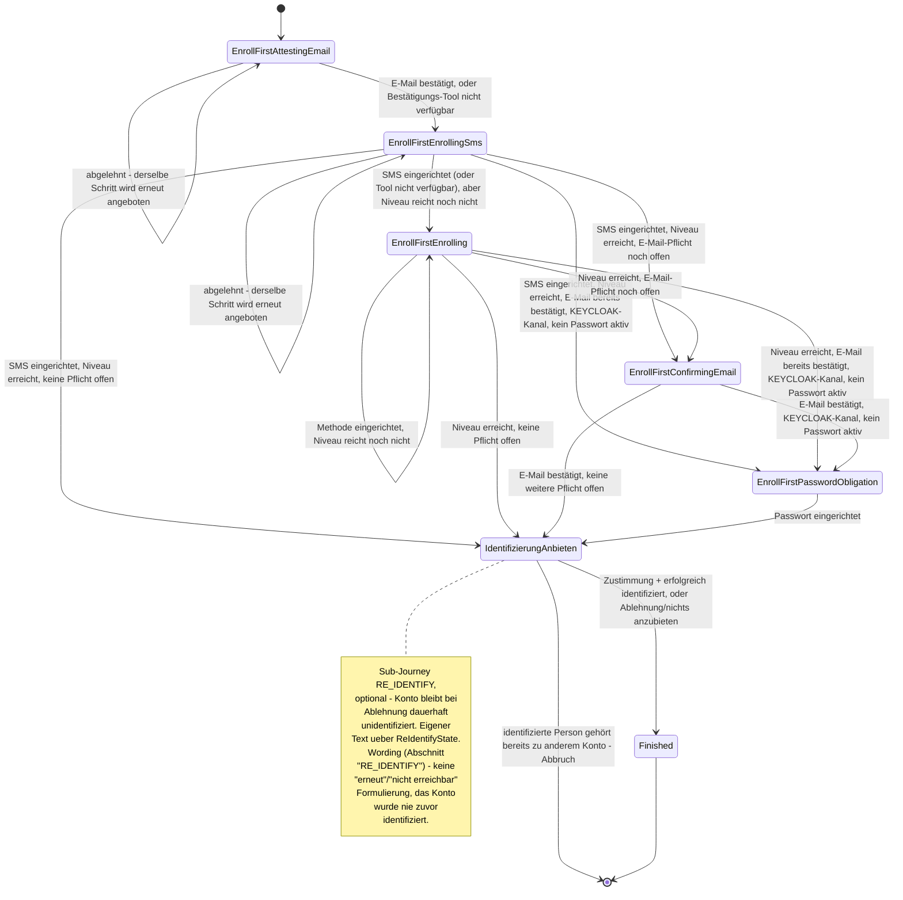

### `LOOKUP_LOGIN`

Anmelden ohne gepaartes Gerät: Der Nutzer nennt einen Identifikator (E-Mail) und weist eine seiner
Methoden nach. Angeboten wird der abgeleitete Satz aller `MethodRole.LOOKUP_AUTH`-Tools, nicht
`AuthPolicy.candidateTools` — das bräuchte einen bereits aufgelösten Account.

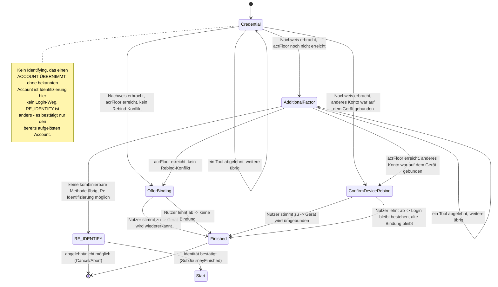

`OfferBinding` fragt optional: „Dieses Gerät für künftige Logins wiedererkennen?" und erfüllt dafür
das generische `AnswerableState`-Markerinterface (Abschnitt 5), damit die Maschinerie den Zustand
ohne Kenntnis von `LookupLoginState.OfferBinding` erkennt. Löst der Login ein anderes Konto auf als
das für dieses Gerät hinterlegte, wechselt die Journey in `ConfirmDeviceRebind`: dieselbe
Ja/Nein-Mechanik mit destruktivem Hinweis. Ablehnung verwirft nur die Umbindung, nicht den Login.

Die Gerätewiedererkennung (`DeviceAccountLink`) — eine dauerhafte Zuordnung Gerät → Account —
entsteht hier **nur** nach Zustimmung, nie als Nebenwirkung des Logins.

`AdditionalFactor` erzwingt die eigene `acrFloor` des Kanals (Abschnitt 8). Bleibt danach
keine kombinierbare Methode übrig, springt die Strategie in die geteilte `RE_IDENTIFY`-SubJourney
(Abschnitt „RE_IDENTIFY") statt selbst eine Re-Identifizierung anzubieten. Nach ihrem Abschluss
prüft `Start` erneut per `settleOrRaise`. Dieser Intent hat bewusst **keinen** Enrollment-Fallback;
Re-Identifizierung bleibt erlaubt, weil dabei keine Credential auf einem ungeprüften Gerät wächst.

**Enumeration-Schutz**: Eine unbekannte E-Mail liefert dieselbe Antwortform wie ein aufgelöster
Account mit fehlgeschlagenem Nachweis — nie eine eigene Fehlerform, auch nicht im Timing der
Demo-Werte ([API](05-api.md)). Bewusst nicht weiter gehärtet (kein Timing-Padding).

### `KC_SELECT_METHOD`

Der Default-Entry-Intent des `KEYCLOAK`-Kanals für Login/Step-up ([05-api.md](05-api.md)
Abschnitt 3, `ADR-8` in [12-entscheidungen.md](12-entscheidungen.md)); `REGISTER` ist der zweite
Web-Entry (Abschnitt "REGISTER" oben). Ein einziger Zustand, der unconditional alle kc-nutzbaren
Tools als einen `selectMethod`-Schritt anbietet — keine Fallback-Kette, kein Enrollment-Angebot,
keine Sufficiency-Prüfung VOR dem Anbieten: Keycloaks native Flow-Konfiguration
(Conditional-LoA-Subflows) entscheidet bereits, OB und WELCHES Niveau angefragt ist.

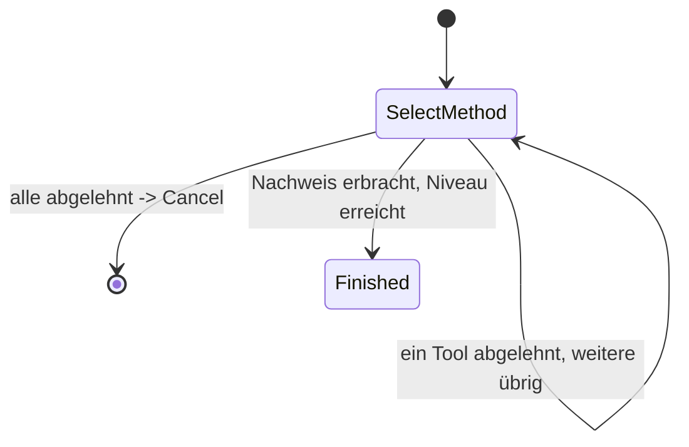

Bedient zwei Web-Kanal-Fälle mit derselben Zustandsform, unterschieden nur durch
`accountAlreadyKnown`:

- **Initialer Login** (`ctx.account` ist `null`): löst den Account selbst über Lookup-Login-Tools
  auf (`CandidateTools.forLookupLogin`), nie über Identifikation.
- **Step-up** (Account bereits auf dem Kanal gesetzt, bevor die Journey beginnt): nur Auth-Tools
  für diesen Account.

Jedes Ereignis (`Started`, `EvidenceReported`, `ActionCompleted`) prüft dieselbe Sufficiency neu
und baut die Kandidatenliste komplett frisch auf — eine Evidence (natives Keycloak-Verfahren oder
RestoreData) kann schon vor dem allerersten Angebot vorliegen.

### `STEP_UP`

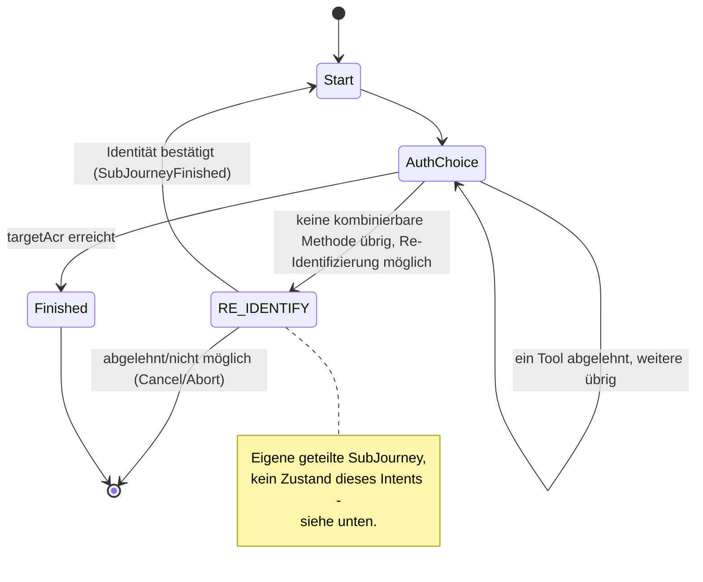

Jeder Zustand trägt `targetAcr` (das Ziel dieses Laufs, nicht die dauerhafte Untergrenze des
Kanals, Abschnitt 8) und `startingAcr`; `AuthChoice` zusätzlich Angebot und Ablehnungen.

Schließt keine aktive Methode die Lücke (etwa ein Account mit nur einer aktiven Methode, die
`loa1` erreicht), springt die Strategie in die geteilte `RE_IDENTIFY`-SubJourney
statt selbst eine Re-Identifizierung anzubieten (Abschnitt „RE_IDENTIFY" unten). Nach ihrem
Abschluss (`SubJourneyFinished`) prüft `Start` per `finishOrContinue` erneut, ob der Nachweis jetzt
reicht.

### `RE_IDENTIFY`

Geteilt von `FAST_ACCESS`/`LOOKUP_LOGIN`/`STEP_UP` (jeweils oben verlinkt) sowie vom
„Enrollment zuerst"-Experiment (`RegisterEnrollFirstStrategy`, Abschnitt „REGISTER") — eine einzige
Implementierung statt vier fast identischer. Nie ein Entry-Intent, nur über
`Transition.RequireSubJourney` erreichbar.

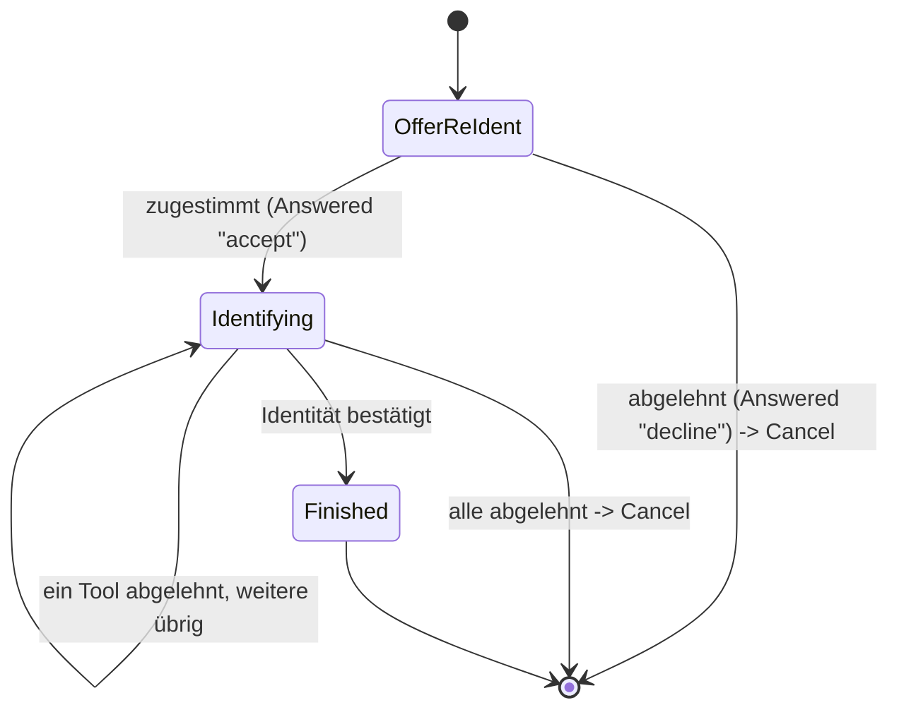

`OfferReIdent` fragt immer zuerst per `AnswerableState`-Prompt („Erneut identifizieren?"), nie als
stiller Rückfall. `Identifying` trägt `targetAcr`/`startingAcr` sowie Angebot und Ablehnungen;
`ident-fsc`/`ident-eid` erreichen `loa2`/`loa3` im Alleingang.

Der Standardtext („Sicherheitsniveau mit den vorhandenen Anmeldeverfahren nicht erreichbar") passt
nur für `FAST_ACCESS`/`LOOKUP_LOGIN`/`STEP_UP`; für `RegisterEnrollFirstStrategy`s abschließendes
Angebot ist er falsch. Deshalb trägt `ReIdentifyState` (und darüber `forSubJourney(targetAcr,
startingAcr, wording)`) ein optionales `Wording` (Titel/Beschreibung/Button-Text für `OfferReIdent`
und `Identifying`), das nur dieser Aufrufer belegt; `null` behält den Standardtext. Gleiches Muster
wie `StepUpState.forSubJourney`s `reason`.

`startingAcr` steuert, wohin `onCancel` bei Ablehnung zurückfällt: `"none"` heißt, der aufrufende
Kanal war nicht authentifiziert (`FAST_ACCESS`/`LOOKUP_LOGIN`) → `ANONYMOUS`; ein echtes Niveau
heißt `AUTHENTICATED` (`STEP_UP`) → das bleibt er auch, eine abgelehnte Re-Identifizierung meldet
keine laufende Session ab.

`transition()` liefert für ein erfolgreiches `Identified` immer `ConfirmIdentity`, nie
`AdoptIdentity`: Die identifizierte Person muss zum bereits bekannten Account passen (`409` bei
Abweichung), unabhängig davon, welcher Intent die SubJourney angefordert hat.

### `MANAGE_AUTH_METHODS`

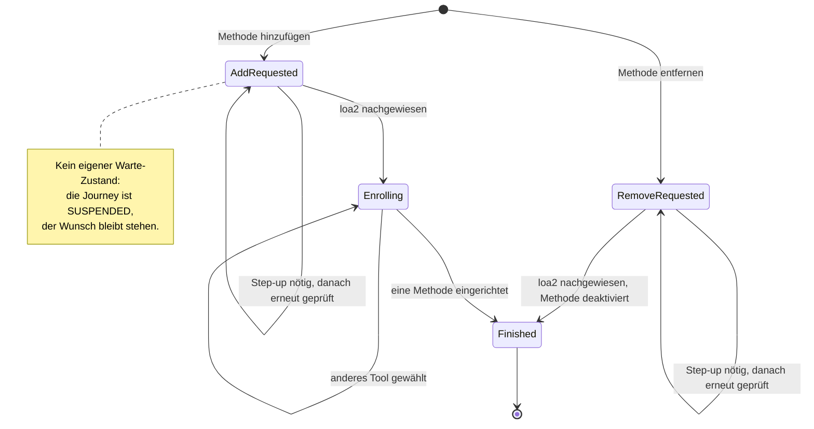

`AddRequested`/`RemoveRequested` (Letzterer trägt die `methodInstanceId`) sind zugleich der Wunsch
vor der loa2-Prüfung und der Parkzustand während eines Step-ups; `Enrolling` trägt Angebot und
Ablehnungen.

`MANAGE_AUTH_METHODS` ist der einzige Intent ohne Policy-Ziel: **ein** erfolgreiches Enrollment
beendet ihn, unabhängig vom Niveau. Eine zweite Methode braucht eine neue Journey.

Dass gewartet wird, sagen `JourneyLifecycle.SUSPENDED` und die `parentJourneyId` der Kind-Journey
— deshalb überlebt der Wunsch den Step-up: Nach dessen Abschluss wird derselbe Zustand erneut
ausgewertet, prüft die Vorbedingung neu und führt aus, was ursprünglich verlangt war.

Die Vorbedingung folgt derselben Anti-Selbsteskalations-Logik wie die `enrolledUnderAcr`-Deckelung
(Abschnitt 8): Eine gekaperte Session darf nicht aus eigener Kraft Methoden hinzufügen oder
entfernen. Das geforderte Niveau selbst liefert die geteilte Funktion `selfServiceAcrFloor`
(`orchestrator/journey/IntentStrategy.kt`, auch von `DeleteAccountStrategy` genutzt): `loa2` für
ein identifiziertes Konto, aber nur `loa1` für ein nie identifiziertes (`personId == null`, der
"Enrollment zuerst"-Fall) — dort gibt es keine gebundene Identität, die eine gekaperte Session
zusätzlich beschädigen könnte, und `loa2` wäre für ein solches Konto ohnehin nie erreichbar (die
MFA-Kombinationsregel deckelt jeden Bump auf das höchste `enrolledUnderAcr` seiner Methoden, und
das liegt bei einem nie identifizierten Konto immer bei `loa1`). Das Entfernen prüft zusätzlich,
dass der Account danach die Untergrenze des Kanals noch erreichen kann (`409`, Selbstsperrschutz).

### `CONFIRM_PEER_LOGIN`

Ein App-Kanal bestätigt oder lehnt einen Web-Login ab, den eine `auth-qr`/`auth-qr-lookup`-
Aktivierung des Web-Kanals anstößt („mit dem Handy einloggen" per QR-Code). Der Journey-Vertrag
bleibt dabei unverändert: `confirm-qr-login`s `ToolOutcome` wirkt nur auf die EIGENE `AuthJourney`
(`Action.RecordApproval`); die Kanal-übergreifende Kopplung lebt im `auth_qr`-Modul, über eine
gemeinsame `QrLoginRequest`-Zeile, die beide Seiten lesen/schreiben. Kein Cross-Channel-Sonderfall
im Journey-SPI.

`CONFIRM_PEER_LOGIN` ist **Entry-Intent und Aufsatz auf einer authentifizierten Session zugleich**
(Abschnitt 2) — beide Wege landen auf demselben `Requested`:

Bewusst **kein** separates "Möchten Sie bestätigen?"-Gate vor den folgenden Sicherheits-Checks:
Der `STEP_UP`-Schritt, den ein fehlendes loa2 ohnehin auslöst, erklärt selbst, warum gefragt wird,
und bietet "Abbrechen" als Ausweg — siehe `StepUpState.forSubJourney`s `reason`-Text
(`ConfirmPeerLoginStrategy.STEP_UP_REASON`).

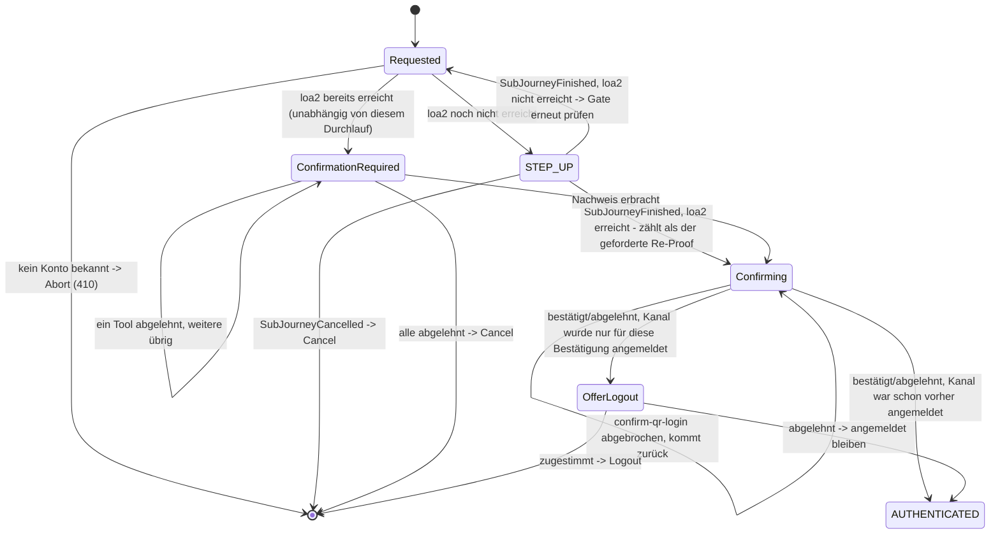

Drei Startzustände, eine Zustandsmenge:

1. **Kanal noch nicht authentifiziert**: NUR der geräte-gebundene Login-Teil von `FAST_ACCESS`s
   Fallback-Kette (`DeviceAccountLink` bekannt → dessen `IDENTIFIED_AUTH`-Kandidaten bis `loa1`,
   über den `STEP_UP`-Zweig oben) — **keine** Identifikation/Registrierung. Ohne
   `DeviceAccountLink` endet die Journey sofort ohne Angebot.
2. **Kanal authentifiziert, aber unter `loa2`**: derselbe `STEP_UP`-Gate wie bei
   `MANAGE_AUTH_METHODS`. Der dabei erbrachte Nachweis zählt bereits als der in Schritt 3 verlangte
   frische Faktor (`STEP_UP --> Confirming` oben, geprüft über `SubJourneyFinished.achievedAcr`).
3. **Kanal bereits bei `loa2` oder höher** (unabhängig von diesem Durchlauf): **nicht** direkt
   weiter — wie bei `DELETE_ACCOUNT` verlangt dieser Fall unconditionell einen frischen Re-Proof
   mit einem beliebigen aktiven Faktor (`CandidateTools.forReconfirmation`, jedes Niveau reicht),
   bevor `confirm-qr-login` angeboten wird (`ConfirmationRequired`). Der Re-Proof wird nicht als
   `MethodEvidence` festgehalten, sondern autorisiert nur diese eine Bestätigung.
4. `confirm-qr-login` aktivieren (`Confirming`, einziger Kandidat). Backing out (`Abandoned`) ist
   kein Ablehnen der Anfrage, nur ein Zurückkommen zum selben Kandidaten.
5. Ziel erreicht, sobald das Tool `Completed`/`Failed` meldet — keine Rückkehr in die
   Kandidatenliste, die Journey endet mit diesem einen Tool. War der Kanal vorher nicht
   authentifiziert, fragt `OfferLogout` (`AnswerableState`), ob er angemeldet bleiben soll.

Der Pairing-Code geht **nicht** über den Kanal-Erzeugungsvertrag, sondern ist ein Eingabefeld des
ersten `confirm-qr-login`-Schritts. Der QR-Code (bzw. der Demo-Link) kodiert einen Deep-Link, der
App-seitig `intent=confirm_peer_login` setzt und `pairingCode` vorbefüllt durchreicht
([Frontend](10-frontend.md)).

### `DELETE_ACCOUNT`

Self-Service-Löschung des eigenen Accounts. Die Bestätigung kommt immer zuerst, nie hinter einem
Step-up versteckt.

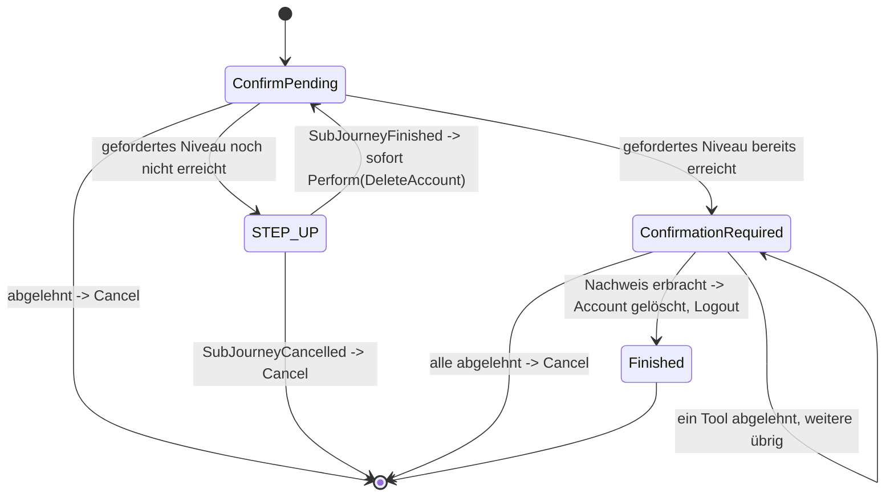

`ConfirmPending` ist ein `AnswerableState` mit `destructive: true`-Prompt. Nach Zustimmung greift
dasselbe `selfServiceAcrFloor`-Gate wie bei `MANAGE_AUTH_METHODS` (Abschnitt 3, `Action.DeleteAccount
.requiredAcr` delegiert an dieselbe Funktion). Der abschließende Re-Proof
(irgendein aktiver Faktor, beliebiges Niveau) bleibt Pflicht, nie ein stiller Auto-Delete; musste
ein Step-up laufen, zählt dessen Nachweis bereits. Der Übergang am Ende ist
`Transition.Perform(Action.DeleteAccount(accountId), resumeState = ConfirmPending)`, aufgelöst zu
`Transition.Logout` sobald die Journey mit `ActionCompleted` fortgesetzt wird: Account löschen,
Kanal beenden. `JourneyService` prüft `requiredAcr(account)` unmittelbar vor der Ausführung erneut
nach (wie beim Selbst-Aussperr-Check vor `Action.Remove`).
Der Nachweis in `ConfirmationRequired` läuft direkt in `Action.DeleteAccount`, nie über
`Action.AcceptProof` — er autorisiert genau diese eine Löschung, nie eine dauerhafte
`MethodEvidence` (Abschnitt 5).

### `LOGOUT`

Bestätigtes Abmelden — ein einzelner Prompt, kein Tool-Lauf.

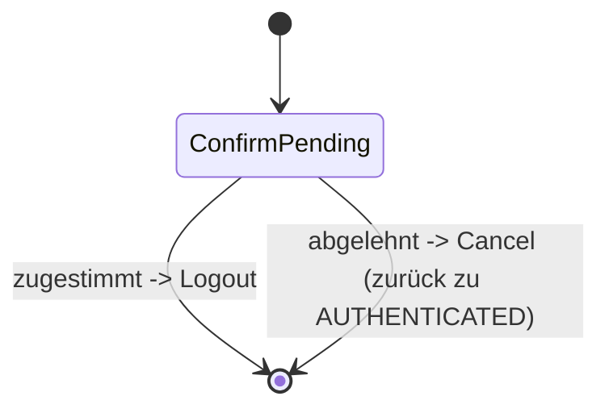

`ConfirmPending` ist wie bei `DELETE_ACCOUNT` ein `AnswerableState`. Zustimmung liefert
`Transition.Logout`, Ablehnung `Cancel` (Kanal zurück auf `AUTHENTICATED`).

### Lebenszyklus, unabhängig vom Intent

Die intent-eigenen Zustände beschreiben den Weg; `JourneyLifecycle`, ob die Journey noch läuft.

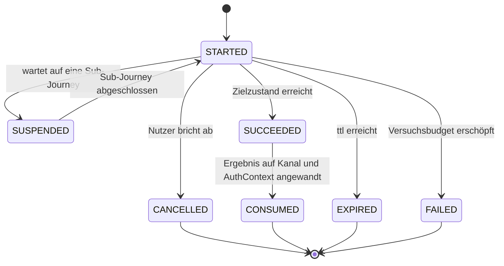

---

## 4) `next` folgt aus dem Zustand

Alle Zustände erfüllen einen gemeinsamen Vertrag: Jeder weiß, welche `toolId`s hier aktivierbar
sind (leer für terminale und wartende Zustände), ob und welches Tool gerade läuft, und welche
orchestrator-eigene Seite (`next.context`/`next.step`) er anzeigt. Daraus folgt **eine**
Ableitungstabelle:

| `active` | `activatable()` | `next` |
|---|---|---|
| gesetzt | — | `type="tool"`, Schritt der laufenden `ToolSession` |
| null | genau ein Eintrag | `type="tool"`, `startStep` des Descriptors |
| null | mehrere | `type="orchestrator"`, Auswahlseite |
| null | leer | `type="orchestrator"`, orchestrator-eigene Seite (Bestätigung, Abschluss) |

Die Prüfung „darf dieses Tool jetzt aktiviert werden?" ist dieselbe Funktion — Mitgliedschaft in
`activatable()`. Ein Zustand, der ein Tool nicht anbietet, kann es damit nicht zulassen.
`next.type` (`"tool"`/`"orchestrator"`) sagt, wem der nächste Screen gehört und welchen Endpunkt
der Client ruft.

---

## 5) Die zwei Verträge: SPI und API

### `IntentStrategy` — der SPI

Symmetrisch zu `tool_spi`: dort beschreiben sich Tools selbst, hier Intents. Jede Strategie ist ein
Moore-Automat für ihren eigenen Zustandstyp: `transition(state, event, ctx)`, dazu
`initialState(ctx)` (wo eine direkt eingetretene Journey beginnt) und `cancelledTo` (wohin der
Kanal bei Abbruch zurückfällt). Eine Sub-Journey mit vorgegebenem Zielniveau beginnt nicht über die
SPI, sondern über die Companion-Factory des jeweiligen Zustands (`StepUpState.forSubJourney(...)`,
`ReIdentifyState.forSubJourney(...)`) — nur `STEP_UP`/`RE_IDENTIFY` sind als Sub-Journey gemeint.

Die frühere Trennung in `interpret()` und `decide()` ist entfallen
(docs/ideen/journey-strategie-vereinheitlichung.md); `transition()` ist die einzige Methode, die
überhaupt entscheidet.

Ein `JourneyEvent` ist, was der Journey gerade passiert ist:

| Event | Bedeutung |
|---|---|
| `Started` | Journey wurde eben angelegt, braucht ihr erstes Angebot |
| `Completed(tool, outcome)` | ein Tool wurde erfolgreich abgeschlossen — was das bedeutet, entscheidet die Strategie hier |
| `Abandoned(tool)` | „Zurück"/„Wechseln": das aktivierte Tool wurde ohne Abschluss verworfen |
| `ActionCompleted` | die `Action` eines `Perform`-Übergangs (unten) ist ausgeführt, mit frisch hergeleitetem `JourneyContext` |
| `SubJourneyFinished(intent, achievedAcr)` | eine als Vorbedingung gestartete Kind-Journey ist fertig |
| `Answered(answer)` | eine ausdrückliche Antwort auf einen `AnswerableState` statt eines Tool-Laufs — `answer` ist ein String, nicht `Boolean` |

Eine `Transition` ist, was als Nächstes passieren soll:

| Transition | Bedeutung |
|---|---|
| `To(state)` | weiter zu diesem Zustand — er trägt sein Angebot selbst |
| `RequireSubJourney(intent, seedWith, resumeWith)` | erst `intent` laufen lassen, gestartet bei `seedWith` (von der anfordernden Strategie über die Companion-Factory des Ziel-Zustands gebaut, z. B. `StepUpState.forSubJourney(...)`), danach hier bei `resumeWith` weiter |
| `Authenticated` | Ziel erreicht, Journey wird konsumiert |
| `Cancel` | Nutzer gibt auf — wie ein ausdrückliches Abbrechen, kein Fehler |
| `Perform(action, resumeState)` | `Action` ausführen, danach die Journey bei `resumeState` mit `ActionCompleted` fortsetzen |
| `Logout` | Kanal endgültig beenden (`LOGGED_OUT`, terminal) |
| `Abort(reason)` | es geht gar nicht weiter (410) — nie bloß „keine Kandidaten mehr" |

`Perform` trennt Entscheidung von Wirkung: `JourneyService` führt `action` aus, leitet den
`JourneyContext` danach frisch her und ruft `transition(resumeState, ActionCompleted, frischerCtx)`
erneut auf — selbst rekursiv, solange eine Strategie ihrerseits wieder `Perform` liefert. Diese
Rekursion ersetzt alle früheren Sonderpfade:

- Ein abgeschlossenes Tool: `is Completed -> Perform(actionFürOutcome, resumeState = state)`,
  gefolgt von `is ActionCompleted -> <Nachfolgelogik>` im selben Zustand — dieselbe Zwei-Schritt-
  Form für jeden Intent, der Tools anbietet.
- `Action.LinkDevice`/`Action.Remove`/`Action.DeleteAccount`: eine Strategie liefert `Perform`
  statt selbst zu binden/zu löschen (`LookupLoginState.OfferBinding`, `ManageAuthMethodsState.
  RemoveRequested`, `DeleteAccountState.ConfirmationRequired`).
- RestoreData ([05-api.md](05-api.md) Abschnitt 3): kein `JourneyEvent`, sondern der
  Anfangs-Übergang der Maschine — siehe unten.

Die `Action`-Varianten:

| Action | Bedeutung |
|---|---|
| `AdoptIdentity(tool, outcome)` | `FAST_ACCESS`/`REGISTER`: Account finden oder anlegen, dauerhafte Identifikations-Historie |
| `ConfirmIdentity(tool, outcome)` | `STEP_UP`/`MANAGE_AUTH_METHODS`/`RE_IDENTIFY`: muss zum bereits bekannten Account passen, sonst `409` |
| `AdoptCredential(tool, outcome, bindDevice)` | eine neue Methode wurde eingerichtet |
| `AcceptProof(tool, outcome, useOutcomeAccount, bindDevice)` | ein Nachweis wurde erbracht; `useOutcomeAccount` nur für `LOOKUP_LOGIN`/`KC_SELECT_METHOD` bei noch unbekanntem Account |
| `ApplyRestoredEvidence(source, methods)` | siehe „RestoreData als Anfangs-Übergang" unten |
| `Remove(methodInstanceId)` | eine Methode deaktivieren — Selbstsperrung weist die Maschine ab, nicht die Strategie |
| `LinkDevice(accountId)` | das aktuelle Gerät verknüpfen |
| `DeleteAccount(accountId)` | Konto unwiderruflich löschen — `JourneyService` prüft `requiredAcr(account)` unmittelbar vor der Ausführung gegen die aktuelle Evidence nach |

Die ersten vier `Action`-Varianten tragen `tool`/`outcome` selbst. Enthalten ist nur, was sich je
Intent **unterscheidet**; alles Mechanische — `personId`, `enrollmentRef`, `amr`, `achievedAcr` —
liest die Maschinerie direkt vom mitgeführten `outcome` ab.

`bindDevice` macht die Gerätewiedererkennung zu einer sichtbaren Entscheidung je Intent:
`FAST_ACCESS`/`REGISTER` setzen `true`, `LOOKUP_LOGIN` setzt `false` bis zur Zustimmung im
`OfferBinding`-Zustand (dort dann per `Perform(LinkDevice(accountId), resumeState = OfferBinding)`).

Zentral und für Strategien nicht erreichbar bleiben: Nachweis in den `AuthContext` übernehmen,
`SessionEvent`/Journey-Log schreiben, und die Deckelung `min(achievedAcr, enrolledUnderAcr)`.

Entscheidungen dahinter:

- **Ein Übergang statt fünf.** „Erstes Angebot", „abgeschlossenes Tool", „Abbruch", „Rückkehr aus
  einer Sub-Journey" und „eigene Aktion fertig" sind dieselbe Frage mit einem Event-Parameter.
- **Die Strategie liefert `Transition`, nicht `Next`.** Sonst baut jeder Intent die
  Skip-if-single-Candidate-Regel nach; die gemeinsame Maschinerie macht daraus Zustand und `next`.
- **`Abort` ist eine Entscheidung der Strategie**, kein Automatismus der Kandidatenauflösung: Eine
  leere Kandidatenliste muss „nächster Zustand" bedeuten dürfen, sonst ist eine Fallback-Kette
  nicht formulierbar.
- **Die Strategie bekommt nie Services**, nur einen lesenden `JourneyContext` (Account, Evidence,
  Untergrenze, Gerätebezug, Katalogabfragen). Sie entscheidet, sie wirkt nicht; die Ausführung
  bleibt allein bei der Maschinerie (`JourneyActionExecutor`, siehe unten).

Welche Tools für ein Angebot in Frage kommen, beantwortet `CandidateTools`, abgeleitet aus den
Descriptors der Module. Dort steht keine einzige `toolId`; ein Tool tritt einem Angebot bei, indem
es seine Rolle deklariert.

### Die vier Phasen eines Übergangs

Dieselbe Trennung, die `IntentStrategy` gegenüber der Maschinerie zieht, setzt sich innerhalb der
Maschinerie fort: Jeder Übergang durchläuft vier Phasen, und jede Phase hat genau eine zuständige
Klasse. `JourneyService` bleibt der **Treiber**, nicht der Ausführende.

| Phase | Klasse | Aufgabe |
|---|---|---|
| lesen | `JourneyContextFactory` | baut den lesenden `JourneyContext` aus der dauerhaften Wahrheit (Account, Evidence, Gerätebindung, Feature-Flags) |
| entscheiden | `IntentStrategy` | macht aus (Zustand, Event, Kontext) eine `Transition` — reine Werte |
| wirken | `JourneyActionExecutor` | führt die `Action` eines `Perform` aus (Account anlegen, Claims/Credentials schreiben, Gerät binden, widerrufen) |
| routen | `JourneyRouting` | leitet `next`/`Step` aus dem resultierenden Zustand ab |

Bei `JourneyService` bleibt, was keine dieser vier allein besitzen kann: Journey-Lebenszyklus
(`start`/Suspend/Resume/`cancel`), die Schleife, die die Phasen sequenziert, das Versuchsbudget
und die Abbruch-Folgen.

Die Abhängigkeit ist bewusst eine Einbahnstraße: `JourneyActionExecutor` schreibt und kehrt
zurück — er treibt keine Journey weiter, routet nicht und startet keine Sub-Journey. Nur so bleibt
die Rekursion in `JourneyService.applyTransition` die einzige Rekursion der Maschine.
`OrchestratorArchitectureTest` prüft das.

### RestoreData als Anfangs-Übergang

Eine als Vorbedingung mitgelieferte Evidence ([05-api.md](05-api.md) Abschnitt 3, Web-Kanal
RestoreData) ist keine fachliche Entscheidung einer Strategie, sondern reine Aufrufer-Information.
Sie läuft als **Anfangs-Übergang** (Statecharts: Pseudostate → `q0`): mechanisch, unconditional,
keinem Zustand gehörend.

Genau das ist `JourneyService.start()`s `seedAction`-Parameter: `Action.ApplyRestoredEvidence`
läuft, BEVOR `IntentStrategy.initialState()` aufgerufen wird — kein `JourneyEvent`, sondern ein
geloggter `"Entry"`-Übergang, den `JourneyService` selbst ausführt. Weil die Evidence schon vor
dem ersten Angebot vorliegen kann, darf `Started` nicht blind das erste Angebot bauen: Eine
Strategie wie `KcSelectMethodStrategy` prüft auf `Started` dieselbe Sufficiency wie bei jedem
anderen Nachweis.

### `JourneyApi` — was Tool-Controller sehen

Fünf Operationen — `activate` (prüft und übernimmt eine `ToolSession`), `applyOutcome`, `abandon`,
`cancel`, `nextOf` — sind die **einzige** Berührungsfläche der Tool-Controller mit dem
Journey-Modell: kein Setzen von Routing-Feldern, kein Typ-Switch auf einen Intent, keine
Entscheidung darüber, welches Tool laufen darf. `Step` ist `next` plus die Renderdaten des
Schritts.

Zwei Aktionen, die der Client sauber auseinanderhalten muss: `abandon` lehnt den aktuellen
**Zustand** ab und führt die Journey weiter (`DELETE /tools/{toolSessionId}/{toolId}`); `cancel`
gibt die **Journey** auf und startet den Entry-Intent neu (`DELETE .../journey`).

---

## 6) Sub-Journey

`Transition.RequireSubJourney` legt eine eigene `AuthJourney` mit `parentJourneyId` an. Bei deren
`Finished` reaktiviert die Maschinerie den Parent mit `resumeWith`.

Invariante: pro Kanal ist immer genau **eine** Journey aktiv — die Kind-Journey läuft, der Parent
ist `SUSPENDED`, nicht parallel. Der Step-up behält eigene `startingAcr`/`achievedAcr` und ein
eigenes Audit.

---

## 7) Versuchsbudget

`attemptBudget` liegt auf der `AuthJourney`, nicht auf der `ToolSession`. Jedes `Failed` zieht ab,
unabhängig davon, in welchem Zustand oder in welchem Tool. Bei `0` endet die **ganze Journey**
(`410`) — auch wenn noch Zustände übrig wären.

Das ist eine Sicherheitsanforderung: Ein tool-lokaler Zähler würde Brute-Force entlang der Kette
billiger machen.

Retry-Regel: Ein fehlgeschlagener Versuch mit verbleibendem Budget ist **kein** HTTP-Fehlerfall,
sondern verhält sich wie fehlende Eingabe (`200` plus Navigation, Grund in `stepData.error`). Erst
das erschöpfte Budget endet terminal (`410`) — HTTP-Fehlercodes signalisieren gestörte Abläufe,
nicht erwartbare Eingabefehler ([API](05-api.md)).

Ausdrücklich offen: Brute-Force-Schutz auf Kontoebene über mehrere Journeys hinweg; das Budget ist
journey-lokal.

---

## 8) AuthPolicy: Mehr-Faktor-Entscheidung

Die Strategien fragen die `AuthPolicy`, statt selbst zu entscheiden, was genug ist: ob vorhandene
Nachweise reichen (`isSatisfied`), welches Niveau sich aus ihnen ergibt (`resolveAcr`), welche
Tools als Nachweis, Re-Identifizierung oder Enrollment in Frage kommen, und ob ein Account ein
Niveau grundsätzlich erreichen kann (`canAccountReach`), unabhängig vom aktuellen Nachweis.

Zwei Bedingungen müssen zusammen erfüllt sein:

1. **Niveau**: `resolveAcr(evidence) >= requiredAcr`. Die Abbildung von `amr`-Kombinationen auf
   `acr`-Werte ist fachlich/regulatorisch offen: RFC 8176 definiert zwar eine IANA-Registry für
   `amr`-Werte (`pwd`, `otp`, `hwk`/`swk`, `user`, `face`, `fpt`, `mfa`, …), nicht aber, welche
   Kombination welches Vertrauensniveau ergibt. Die `amr`-Strings dieses Projekts (`sms`,
   `password`, `email`, `fsc`, `device`, `pin`, `biometric`) folgen einer eigenen Konvention.
2. **Faktorvielfalt**: Für MFA-Niveaus mindestens zwei **verschiedene** Faktorarten — gezählt wird
   die Vereinigung der `factorTypes` über alle abgeschlossenen Tools, nie die Tool-Anzahl. Ein Tool,
   das selbst zwei Faktorarten meldet (z. B. Passkey mit User Verification), erfüllt MFA allein.

Wichtige Einschränkung: Ein Tool darf nur Faktoren melden, die es dem Server gegenüber tatsächlich
**nachweisen** kann. Für eine nur lokal geprüfte App-PIN gehört nur `{possession}` in den
Descriptor.

### IAL und AAL: zwei Fragen, eine `acr`-Zahl

`resolveAcr` beantwortet zwei unabhängige Fragen (NIST 800-63: IAL vs. AAL) und kombiniert sie erst
am Ende zur nach außen sichtbaren `acr`-Zahl:

- **IAL** (`identityAssuranceLevel`, "wer ist das?") — das höchste `loa`, das eine
  IDENTIFICATION-Rolle (`ident-fsc`, `ident-eid`) **in dieser Session** erbracht hat. Bewusst
  NICHT aus `account.identification` einer früheren Session nachgeladen: `AuthEvidence` ist "one
  per channel, cleared at logout" (`orchestrator.session.AuthEvidence`).
- **AAL** (`authenticatorAssuranceLevel`, "wie stark ist der Nachweis bei DIESEM Login?") — die
  MFA-Kombinationsregel aus Punkt 2, aber ausschließlich über ENROLLMENT/AUTH-Nachweise gerechnet.

`resolveAcr = max(IAL, AAL)`. Jede `MethodEvidence`/`AmrRecord`-Zeile trägt dafür eine `axis`
(`EvidenceAxis.IDENTITY`/`AUTHENTICATOR`, `DefaultAuthPolicy`/`ToolDescriptor.evidenceAxis()`,
abgeleitet aus `role.category`). Grund der Trennung: Eine Identifizierung darf ihr eigenes `loa`
direkt beisteuern (ein alleiniges `ident-fsc` erreicht `loa2`), sich aber **nicht** mit einem
einzelnen artfremden Auth-Faktor zu einem MFA-Bump verbinden — sonst gälte ein gestohlenes Passwort
als durch einen beim Login erneut geprüften Faktor abgesichert.

**`loa2` ist damit das Projekt-eigene Label für NIST-800-63B-AAL2**, erreichbar über drei
gleichwertige Wege: (1) ein einzelnes Tool mit zwei eigenen Faktorarten (`device`:
Besitz+Wissen/Inhärenz), (2) zwei kombinierte Einzelfaktor-AUTH-Tools unterschiedlicher Art
(sms+password, über den MFA-Bump), oder (3) eine Identifizierung (`ident-fsc`/`ident-eid`) allein
über ihr eigenes IAL. Weil Weg (3) gleichwertig ist, wird `CandidateTools.forReIdentification` in
Auth-Kontexten standardmäßig als Fallback angeboten (`StepUpState.forSubJourney`, Default
`allowReIdentification=true`), sobald die Auth-Mittel nicht reichen. `loa3`/AAL3 ist bewusst nicht
ausgearbeitet.

### Session-Nachweis ist nicht gleich Account-Fähigkeit

In einem Auth-Zustand lautet die Frage „reicht das *jetzt*?" (`isSatisfied`), in einem
Enrollment-Zustand „kommt der Nutzer damit *künftig wieder herein*?" (`canAccountReach`). Eine
Identifizierung ist keine dauerhafte Methode: `ident-fsc` zählt für
`AuthContext.currentFactorTypes` dieser Session, landet aber im Audit-Log
`account.identification`, nicht in `account.auth_method`.

Daraus folgt eine Deckelungskette: das LoA der Identifizierung begrenzt, was ein Account je
erreichen kann; `account.auth_method.enrolled_under_acr` begrenzt, was eine einzelne Methode
liefern darf; `Completed.achievedAcr` meldet, was der konkrete Durchlauf erreicht hat. Ein Kanal,
der `loa3` verlangt, braucht also ein `loa3`-fähiges Ident-Tool; nach einer `loa2`-Identifizierung
bleiben alle danach eingerichteten Methoden auf `loa2` gedeckelt. Deshalb ist die Untergrenze schon
beim Anlegen des Kanals setzbar ([API](05-api.md)).

### Untergrenze des Kanals gegen Ziel eines Laufs

Zwei Größen, die leicht als dasselbe Feld gelesen werden und deshalb verschieden heißen:

- **`ChannelSession.acrFloor`** — die *dauerhafte Untergrenze* des Kanals („auf diesem Kanal nie
  unter `loa3`"). Gilt für jede Journey darauf und trägt den Selbstsperrschutz beim Entfernen einer
  Methode.
- **`StepUpState.targetAcr`** — das *Ziel dieses einen Durchlaufs*. Nur `STEP_UP` hat eins.

Gerechnet wird stets mit dem Maximum beider. Ein vom Client genanntes Niveau ist immer eine
Untergrenze, nie eine Erlaubnis: Das Backend setzt `max(Policy-Anforderung, Client-Wunsch)`.

### Pflichten sind Zustände

Keycloak kennt „Required Actions" wie `VERIFY_EMAIL`. Hier sind sie kein eigenes Konzept, sondern
Pflichtzustände: „ausreichende Login-Methode eingerichtet" *ist* `Enrolling`, „bestätigte E-Mail"
*ist* `ConfirmingEmail`.

Die Reihenfolge der Pflichten ist die Reihenfolge der Zustände: erst die bestätigte E-Mail, dann
eine ausreichende Login-Methode. Die Bestätigung ist kein Anmeldeverfahren, sondern
Konto-Infrastruktur (drei Lookup-Tools lösen darüber auf, `enroll-password` ist darauf gegated);
andernfalls könnte `enroll-password` im ersten `Enrolling`-Angebot nicht auftauchen. Dieselbe
Reihenfolge gilt im Experiment „Enrollment zuerst" (`EnrollFirstAttestingEmail`).

Ist kein bestätigendes Tool verfügbar (admin-seitig gesperrt), wird der Schritt übersprungen, die
Pflicht bleibt offen und wird in der Enrollment-Kaskade (`AuthEnrollCore.afterEnrollment`) erneut
angeboten — dafür trägt `Enrolling.emailObligation` den Merker weiter.

Der Geltungsbereich ergibt sich daraus, welcher Weg zu dem Zustand geführt hat: Die E-Mail-Pflicht
gilt nur für einen Lauf, der über `Identifying` kam, also einen Account angelegt oder übernommen
hat — festgehalten im Attribut `Enrolling.emailObligation`. Wer sich lediglich anmeldet, wird nie
rückwirkend auf eine fehlende E-Mail-Bestätigung festgenagelt: Die Bestätigung wird deshalb erst
*nach* dem `AuthChoice`-Zweig angeboten, nicht vor ihm.

Beide Pflichten sind aus vorhandenem Zustand **abgeleitet** (`authenticationMethods`,
`emailConfirmedAt`), nicht als eigenes Account-Feld gespeichert.

**Der Preis, ausdrücklich benannt**: Eine künftige dritte Pflicht, die *mehrere* Intents betrifft,
bedeutet denselben Zustand in mehreren Hierarchien. Bei zwei Pflichten ist das der bessere Tausch;
bei einer dritten, intent-übergreifenden Pflicht gehört die Entscheidung neu geprüft.

### Eine dritte Pflicht, aber kanalgebunden statt intent-übergreifend

`PasswordObligation` (`RegisterStrategy`) ist die oben angekündigte dritte Pflicht, anders
geschnitten als der "Preis"-Absatz befürchtet: Sie betrifft **keinen zweiten Intent** (nur
`REGISTER`, nie `FAST_ACCESS`), sondern ist auf einen Kanal begrenzt (nur `KEYCLOAK`, nie `APP`).
`RegisterStrategy` wrapt dafür das Ergebnis von `AuthEnrollCore.afterEnrollment`: Nur wenn diese
`Transition.Authenticated` zurückgeben würde *und* der Kanal `KEYCLOAK` ist *und* noch keine aktive
`password`-Methode existiert, wird `PasswordObligation` eingeschoben. Der Zustand gehört, anders
als `AuthChoice`/`Enrolling`, exklusiv zu `RegisterState`.

**Reihenfolge, technisch erzwungen**: `PasswordObligation` steht *nach* `ConfirmingEmail`, weil
`enroll-password` eine bestätigte E-Mail voraussetzt (`ToolDescriptor.requires` mit
`ClaimRequirement(EMAIL, PROVEN)`, [Tool-Architektur](03-tool-architektur.md) Abschnitt 1) und
davor nicht einmal Kandidat ist. Die Kette lautet zwingend
`ConfirmingEmail → Enrolling → PasswordObligation`.

**Geltungsbereich wie bei der E-Mail-Pflicht**: Läuft der Nachweis über `AuthChoice`/`afterProof`
statt über `afterEnrollment`, greift `PasswordObligation` nicht — ein Account, der nur einloggt,
wird nie rückwirkend blockiert.

Kandidaten für `PasswordObligation` werden wie überall über den Katalog aufgelöst (`role ==
ENROLLMENT && method == "password"`, geschnitten mit `availableTools`), nie über einen
hartcodierten `toolId`-String.
