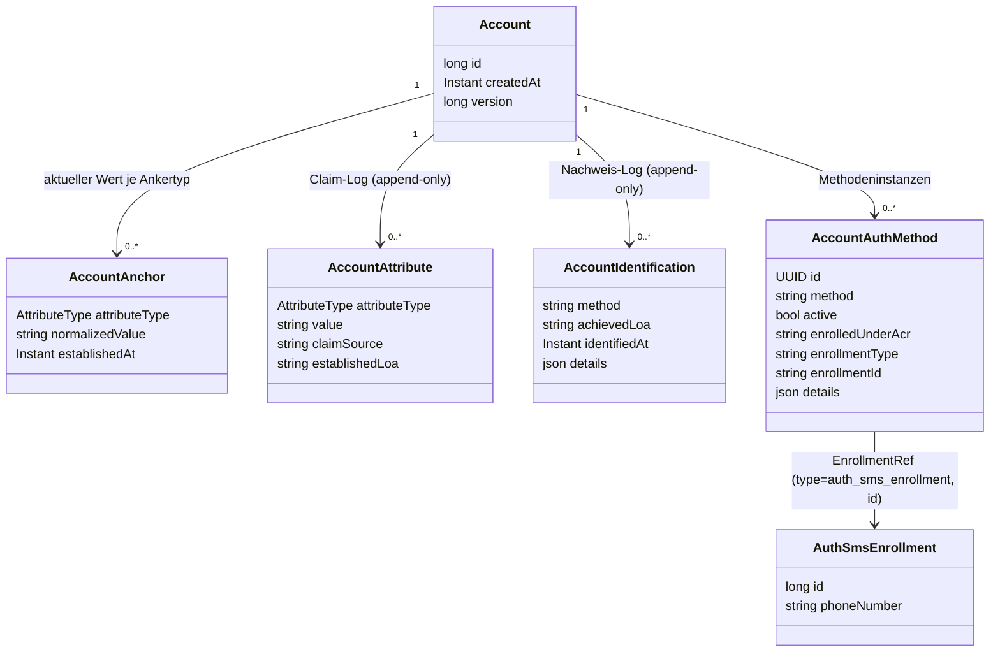

# Konkrete Abläufe

Wie `ident-fsc`/`ident-eid`/`auth-sms`/`enroll-sms` die Bausteine aus [03-tool-architektur.md](03-tool-architektur.md)
und [04-orchestrierung.md](04-orchestrierung.md) konkret nutzen — mit Fokus auf das Datenmodell
und die Entscheidungen dahinter. Ein durchgängiges Call-Beispiel steht in [05-api.md](05-api.md).

---

## 1) Datenmodell für `auth-sms` und `enroll-sms`

Entscheidungen, die an diesem Modell hängen:

- **`enrolledUnderAcr` als eigenes Feld, nicht nur Audit-Inhalt**: Eine Methode darf bei der Authentifizierung nicht mehr Vertrauen erzeugen, als bei ihrer Einrichtung vorhanden war — das effektive `achievedAcr` eines `auth-*`-Tools ist durch `enrolledUnderAcr` der verwendeten Methode gedeckelt ([Orchestrierung](04-orchestrierung.md) Abschnitt 1). Ohne diese Regel gäbe es einen Eskalationspfad: Wer eine schwache Session übernimmt, hinterlegt dort eine eigene Methode und erreicht damit dauerhaft ein höheres Niveau, als er je nachgewiesen hat. Den Wert kennt nur der Orchestrator (aus dem `AuthContext` zum Enrollment-Zeitpunkt), nie das Modul.
- **`EnrollmentRef` als echte Spalten, nicht im `details`-Blob**: `account_auth_method.enrollment_type`/`enrollment_id` ist die einzige Verknüpfung zwischen Konto und Credential. Sie ist indiziert, also in beide Richtungen abfragbar (Konto → Credentials bei der Löschung, Credential → Konten bei einem Widerrufs- oder Krypto-Wechsel-Sweep). Die Credential-Tabellen der Module tragen bewusst keine `account_id`: Sie entstehen im Tool-Handler, bevor der Orchestrator das Konto kennt, und eine zweite Kopie der Verknüpfung könnte auseinanderlaufen.
- **Eine Zeile je Methodeninstanz statt JSON-Liste auf dem Konto**: Lesen schreibt nie; Änderungen sperren nur die Kontozeile per Versions-Inkrement; deaktivierte Instanzen tragen `deactivated_at` (ein CHECK-Constraint hält `active` und `deactivated_at` konsistent).
- **`details.enrolledUnderAmr` ist Audit-Kontext, kein Modellfeld**: Beim Enrollment speichert der Orchestrator die damals vorhandenen AMR-Werte in `AccountAuthMethod.details`. Sie erklären rückblickend, unter welchen Nachweisen die Methode eingerichtet wurde, beeinflussen aber weder Kandidatenauswahl noch ACR-Berechnung. Maßgeblich dafür ist ausschließlich `enrolledUnderAcr`.
- **Die bestätigte E-Mail ist der EMAIL-Anker**, keine Spalte auf `Account` und kein Modul-Credential: Ein Account hat höchstens eine bestätigte E-Mail zu jeder Zeit, dieselbe Behandlung wie `personId`. Erlaubt, dieselbe Adresse sowohl als Auth-Mittel (`enroll-email`/`auth-email`, `EnrollmentRef` = `EMAIL_ANCHOR_ENROLLMENT`) als auch als Identifikator für den lookup-basierten Login zu nutzen. `UNIQUE(attribute_type, normalized_value)` verhindert doppelt vergebene Adressen in jeder Schreibweise.
- **Kein eigenes Identifikator-Feld bei `enroll-password`/`auth-password`**: Der EMAIL-Anker übernimmt diese Rolle, erzwungen über `ToolDescriptor.requires = { ClaimRequirement(EMAIL, PROVEN) }` ([Tool-Architektur](03-tool-architektur.md) Abschnitt 2).
- **Keine TAN im Enrollment**: Die ausgestellte TAN ist ein versuchsbezogenes Einmalgeheimnis und liegt gehasht mit Ablaufzeit in der Tool-Session-Tabelle, nicht im langlebigen Enrollment-Datensatz — sonst würden sich zwei parallele Versuche gegenseitig die TAN überschreiben. Die eingereichte TAN wird nirgends gespeichert, nur gegen den Hash geprüft.
- **Orchestrator speichert nur Lifecycle/Routing**, nie Fach- oder Moduldaten — die liegen ausschließlich im jeweiligen Methodenmodul (`auth_sms_auth_data`/`auth_sms_enroll_data` bei SMS).

Regel für `account_identification.details`: Der Eintrag belegt, **dass und wie** geprüft wurde, nicht **was** geprüft wurde. Hinein gehören Nachweisanker (`provider`, `providerTxId`), Verfahrensversion und ein Hash über die geprüften Merkmale; nicht hinein gehören KVNR/Name im Klartext (die hängen über `personId` an der Person) oder Geheimnisse.

---

## 2) `ident-fsc`

`id_fsc` prüft `kvnr`/`name`/`vorname`/`fsc` gegen den FSC-Dienst und löst dabei die Identität auf — das *ist* die fachliche Leistung des Moduls. Das `account`-Modul kennt `id_fsc` nicht; die Verknüpfung übernimmt erst der Orchestrator beim Verarbeiten von `Completed.Identified` ([Orchestrierung](04-orchestrierung.md)).

Besonderheiten gegenüber dem allgemeinen Muster in [05-api.md](05-api.md): Zwei `PATCH`-Aufrufe (erst `kvnr`/`name`/`vorname`, dann `fsc`) — der FSC-Dienst wird erst aufgerufen, wenn alle vier Felder vorliegen. `GET` baut `stepData` bei jedem Aufruf neu aus den Moduldaten auf; ist das Tool bereits abgeschlossen, zeigt die Antwort bereits auf das Folge-Tool (Resume-Fall).

---

## 3) `auth-sms` (und `auth-password`/`auth-email` analog)

Der Orchestrator liest die aktive Enrollment-Referenz des Accounts (`AccountDirectory.activeEnrollment`) und übergibt sie an den Handler — `auth_sms` referenziert `account` nicht selbst, sondern bekommt eine opake `EnrollmentRef` gereicht (Modulith-Grenze, [Projektrahmen](08-projektrahmen.md)). Auch `auth_email` verwendet nur `tool_api`/`tool_spi`: Account-IDs und Ankerwerte werden über `AccountDirectory` gelesen, Attribute durch Claims übernommen ([Tool-Architektur](03-tool-architektur.md) Abschnitt 2). `auth_sms` löst die Referenz auf ein bestehendes Enrollment auf, erzeugt/versendet/prüft die TAN, verändert das Enrollment aber nie.

Fehlerfall zusätzlich zum allgemeinen Vertrag ([Betrieb](07-betrieb.md)): unbekannte `enrollmentRef` oder fehlendes Enrollment -> `422`.

---

## 4) `enroll-sms` (und `enroll-password`/`enroll-email` analog)

Wie `auth-sms`, aber der `AuthSmsEnrollment`-Datensatz entsteht hier neu — und zwar erst **nach** erfolgreicher TAN-Prüfung, nie beim ersten `PATCH` mit der Telefonnummer (die ist ja noch unbestätigt). Nach Abschluss legt der Orchestrator gemäß [Orchestrierung](04-orchestrierung.md) Abschnitt 1 den `account.authenticationMethods`-Eintrag an (inkl. `enrolledUnderAcr` aus dem aktuellen `AuthContext`).

Fehlerfall zusätzlich zum allgemeinen Vertrag: ungültige Telefonnummer (Formatfehler) -> `400`.

---

## 5) `enroll-device` / `auth-device`

Anders als `sms`/`email`/`password` gibt es kein serverseitig ausgestelltes Geheimnis (keine TAN, kein Code): das Credential *ist* ein auf dem Gerät erzeugtes, nicht-extrahierbares ECDSA-P-256-Schlüsselpaar, unabhängig vom DPoP-Kanal-Schlüssel. Der Client weist Besitz nach, indem er einen selbstsignierten `device-proof+jwt` erzeugt — strukturell identisch zu einem DPoP-Proof (`jwk` im Header, `htm`/`htu`/`iat`/`jti`), aber mit eigenem `typ` und einem zusätzlichen `userVerification`-Claim (`pin` oder `biometric`), den der (im Demo gemockte) System-PIN/Biometrie-Prompt pro Versuch bestimmt. `DeviceProofValidator` prüft ihn serverseitig eigenständig (bewusst kein Ausbau von `DpopValidator` — zwei kleine, unabhängig lesbare Prüfungen statt eine generisch gemachte, [Projektrahmen](08-projektrahmen.md) A11), verwendet dafür aber dieselben generischen Bausteine (`JwkThumbprintService`, Replay-Schutz per Thumbprint+`jti`).

Kein Server-Nonce nötig: `htu` bindet den Proof bereits an die konkrete, einmalige `toolSessionId`-URL — dasselbe Modell, das gewöhnliche DPoP-Proofs in dieser App schon verwenden.

- **`enroll-device`**: Der Controller validiert den Proof, reicht nur die verifizierten Public-Key-Felder (`DevicePublicKey`: `kty`/`crv`/`x`/`y`/`thumbprint`, nicht die rohe `JWK`) an den Handler weiter — das Modul bekommt nie ein Nimbus-/Krypto-Objekt, nur Strings ([Tool-Architektur](03-tool-architektur.md) Abschnitt 2). Legt einen neuen `device_enrollment`-Datensatz an; `EnrollmentRef(type="device_enrollment", id=...)`.
- **`auth-device`**: Löst die aktive Enrollment-Referenz auf (wie `auth-sms`), vergleicht den Thumbprint des präsentierten Schlüssels mit dem gespeicherten — bei Abweichung `Failed("Geraet nicht erkannt")`, ohne zu verraten, welches Gerät stattdessen erwartet wurde.
- **loa2 auf einmal**: `maxAcr=loa2`, `factorTypes={possession,knowledge,inherence}` — Besitz des Schlüssels plus Wissen (PIN) oder Inhärenz (Biometrie) aus demselben Durchlauf, der bislang nur hypothetische Passkey-Fall aus [03-tool-architektur.md](03-tool-architektur.md) Abschnitt 1. Die loa2-Voraussetzung für ein Enrollment (`enrolledUnderAcr` darf nicht höher liegen als das, was die Session tatsächlich schon bewiesen hat) ist bereits durch bestehende Gates abgedeckt, nicht durch neuen Code: `ident-fsc` liefert im Identifizierungs-Zustand immer zuerst `loa2`, und das loa2-Gate von `AuthIntent.MANAGE_AUTH_METHODS` erzwingt denselben Nachweis vor jedem nachträglichen Enrollment.

Fehlerfall zusätzlich zum allgemeinen Vertrag: fehlender/ungültiger `deviceProof` (Signatur, Replay, `htm`/`htu`/`iat`) -> `401` (derselbe `DpopValidationException`-Pfad wie bei DPoP-Proofs); falscher Schlüssel bei `auth-device` -> `Failed`, kein Fehlerstatus (Retry-Fall wie bei falscher TAN).

---

## 6) `ident-eid`

`id_eid` ist das zweite `IDENTIFICATION`-Tool neben `ident-fsc` — mock-simulierte Online-Ausweisfunktion statt Freischaltcode. Anders als `ident-fsc` erbringt es zwei Faktorarten in einem Durchlauf (`factorTypes={possession,knowledge}`, `maxAcr=loa3`): Besitz der (simulierten) eID-Karte plus Wissen der PIN.

Drei `PATCH`-Schritte statt zwei, jeder mit eigenem `nextStep`, damit der Client drei unterschiedliche Bildschirme zeigen kann:

1. **`input`**: `kvnr`/`name`/`vorname` — löst wie bei `ident-fsc` über `PersonDirectory.findPersonIdByKvnr` die Person auf (Controller, nicht Handler — `id_eid` darf `ext_stammdaten` nicht direkt kennen, [Projektrahmen](08-projektrahmen.md) Abschnitt 3).
2. **`card`**: die simulierte eID-Karte liefert ihre vollen Ausweisdaten — `geburtsdatum`, `strasse`, `hausnummer`, `plz`, `ort`.
3. **`pin`**: die eID-PIN (Testwert `123456`, wie `ident-fsc`s `VALIDCODE`).

Wie beim allgemeinen Muster lösen alle Felder zusammen in einem einzigen `PATCH`-Aufruf ebenfalls auf; nur die fehlenden Felder müssen einzeln nachgereicht werden.

Der eigentliche Unterschied zu `ident-fsc` liegt im Abgleich: `ident-fsc` prüft Name und Vorname über den Stammdaten-Port, der Freischaltcode trägt den Verfahrensnachweis. `ident-eid` prüft die als Claims übernommenen Identitätsmerkmale (Name, Vorname und Geburtsdatum) zentral über `PersonDirectory.matchesStammdaten`; Adressfelder dienen im Demo-Verfahren als zusätzliche Eingabeschritte und werden nur im Nachweis-Hash/auditDetails geführt, nicht als Account-Claims. `ext_stammdaten` gibt dabei nur Ja/Nein zurück, nie die Stammdaten selbst (dieselbe Regel wie bei `findPersonIdByKvnr`). Das hält die Entscheidung "war das eine gültige Identifizierung" bei der Datenquelle, die sie treffen kann, ohne `ext_stammdaten` die fachliche Prozesslogik von `id_eid` kennen zu lassen. Eine Verallgemeinerung dieses Musters (Vertrauensanker statt fester KVNR-Bindung) ist als Idee festgehalten, nicht umgesetzt: [ideen/claims-modell-und-vertrauensanker.md](ideen/claims-modell-und-vertrauensanker.md).

Fehlerfälle zusätzlich zum allgemeinen Vertrag: KVNR nicht gefunden -> `Failed("Person zu dieser KVNR nicht gefunden")`; falsche PIN -> `Failed("eID-PIN ungueltig")`; Ausweisdaten stimmen nicht mit `ext_stammdaten` überein -> `Failed("Ausweisdaten stimmen nicht mit den angegebenen Daten ueberein")` — drei unterschiedliche, dem Nutzer erklärbare Gründe statt eines einzigen generischen Fehlschlags.
