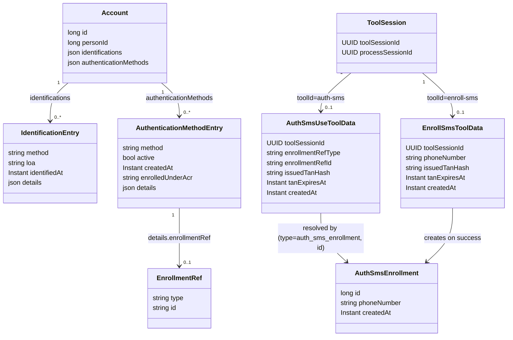

# Konkrete Abläufe

Drei Verfahren vollständig durchgespielt — vom Aktivieren des Tools bis zum Eintrag am Account.
Sie zeigen das Zusammenspiel der Bausteine aus [03-tool-architektur.md](03-tool-architektur.md)
und [04-orchestrierung.md](04-orchestrierung.md) am konkreten Fall.

Ein durchgängiges Beispiel über alle Calls hinweg steht in [05-api.md](05-api.md).

---

## 1) Datenmodell für `auth-sms` und `enroll-sms`

Zielprinzip:

- SMS-Fachlogik (TAN erzeugen/senden/prüfen, Enrollment anlegen) liegt ausschließlich im Modul `auth_sms`.
- Der Orchestrator speichert nur Tool-Lifecycle, Routing und Referenzen.
- Der Account speichert aktive Methoden plus generische Enrollment-Referenz in `details`: `enroll-sms` legt diesen Eintrag neu an, `auth-sms` liest ihn nur.

Konkrete Persistenzsicht:



Beispiel für einen Eintrag in `account.authenticationMethods` (Ergebnis von `enroll-sms`, Grundlage für `auth-sms`):

```json
{
  "method": "sms",
  "active": true,
  "createdAt": "2026-08-17T10:15:30Z",
  "enrolledUnderAcr": "loa2",
  "details": {
    "enrollmentRef": {
      "type": "auth_sms_enrollment",
      "id": "4711"
    },
    "enrolledUnderAmr": ["fsc"],
    "channel": "APP",
    "smsProvider": "sms-gw",
    "providerMsgId": "MSG-2026-08-17-55871"
  }
}
```

`enrolledUnderAcr` ist bewusst ein eigenes Feld und nicht bloß Audit-Inhalt in `details`, weil daran eine Policy-Entscheidung hängt:

- **Deckelungsregel**: Eine Methode kann bei der Authentifizierung nicht mehr Vertrauen erzeugen, als bei ihrer Einrichtung vorhanden war. Das effektive `achievedAcr` eines `auth-*`-Tools ist also durch `enrolledUnderAcr` der verwendeten Methode begrenzt.
- Ohne diese Regel gäbe es einen Eskalationspfad: Wer eine schwache Session übernimmt, hinterlegt dort seine eigene Telefonnummer als zusätzliche Methode und erreicht damit anschließend dauerhaft ein höheres Niveau, als er je nachgewiesen hat.
- Den Wert kennt nur der Orchestrator — er stammt aus dem `AuthContext` zum Zeitpunkt des Enrollments, nicht aus dem Modul. Dasselbe gilt für `enrolledUnderAmr` und `channel` in `details`; rein methodenspezifische Nachweise (`smsProvider`, `providerMsgId`) kommen aus `Completed.Enrolled.auditDetails`.
- `enrolledUnderAmr` ergänzt `enrolledUnderAcr` um einen eigenen Zweck und ist keine Dopplung: Stellt sich später heraus, dass eine Methode kompromittiert war, lassen sich damit alle Methoden finden, die *unter* dieser Methode eingerichtet wurden — also möglicherweise vom Angreifer hinterlegt. Bei gleichem `acr` unterscheidet nur `amr`, welche das sind.
- Nicht aufgenommen ist der `ProcessPurpose` der Einrichtung: Ob eine Methode bei der Registrierung oder später angelegt wurde, sagt sicherheitstechnisch nichts aus, was `enrolledUnderAcr` nicht präziser sagt — eine Registrierung kann mit schwachem Ident-Verfahren laufen, ein späteres Hinzufügen direkt nach einem Step-up. Für die reine Chronologie genügt `createdAt`.

Beispiel für einen Eintrag in `account.identifications` (Ergebnis von `ident-fsc`):

```json
{
  "method": "fsc",
  "loa": "loa2",
  "identifiedAt": "2026-08-17T10:12:04Z",
  "details": {
    "provider": "fsc-service",
    "providerTxId": "FSC-2026-08-17-99213",
    "methodVersion": "2.1",
    "evidenceHash": "sha256:9f2b…",
    "channel": "APP",
    "processSessionId": "p2222222-2222-2222-2222-222222222222"
  }
}
```

Regel für `details`: Der Eintrag belegt, **dass und wie** geprüft wurde — nicht **was** geprüft wurde.

- Hinein gehören der Nachweisanker beim externen Dienst (`provider`, `providerTxId`), die Verfahrens-/Policy-Version (ohne sie ist ein `loa`-Wert Jahre später nicht mehr interpretierbar), ein `evidenceHash` über die geprüften Merkmale sowie Korrelationsdaten zur Audit-Spur.
- Nicht hinein gehören KVNR, Name, Vorname im Klartext (die hängen über `personId` an der Person und wären hier eine zweite, dauerhafte Kopie), FSC oder andere Geheimnisse und rohe Provider-Antworten.
- Der Inhalt ist methodenspezifisch: Er stammt aus `Completed.Identified.auditDetails` und wird vom Orchestrator unverändert durchgereicht, nie interpretiert (analog zu `stepData`).
- `processSessionId` zeigt nach Ablauf der Session-Fristen ([Betrieb](07-betrieb.md)) ins Leere — das ist wie beim `SessionEvent` erwartet und kein Defekt.

Speicherorte:

- Tabelle `account`: `personId` als Bezug zur identifizierten Person (Grundlage für `findOrCreateAccount`), `identifications` (JSON-Array) als dauerhafte Historie der angewendeten Identifikationsverfahren und `authenticationMethods` (JSON-Array) mit generischer Referenz auf Enrollment-Daten, `enrolledUnderAcr` und Nachweis-`details`; letztere geschrieben von `enroll-sms`, gelesen von `auth-sms`.
- Beide Arrays halten damit nicht nur den funktionalen Zustand („welche Nummer ist hinterlegt"), sondern auch den Nachweis, unter welchen Bedingungen er zustande kam. Der `AuthSmsEnrollment`-Datensatz im Modul bleibt bewusst schlank und trägt keine Audit-Information.
- Tabelle `auth_sms`: das langlebige SMS-Enrollment, reduziert auf `id`, `phoneNumber`, `createdAt`. Es entsteht erst nach erfolgreicher TAN-Prüfung, existiert also per Definition nur gültig — ein `validated`-Flag ist damit überflüssig, ebenso `updatedAt` (nach dem Anlegen ändert sich nichts mehr). Ob die Methode später deaktiviert wird, steht in `account.authenticationMethods[].active`.
- **Keine TAN im Enrollment**: Die ausgestellte TAN ist ein versuchsbezogenes Einmalgeheimnis und liegt deshalb in der jeweiligen ToolData-Tabelle, gehasht und mit Ablaufzeit. Das ist nicht nur sauberer, sondern verhindert einen echten Fehler: Zwei parallele Versuche (zweites Gerät, Doppel-Tap) würden sich sonst gegenseitig die TAN im gemeinsamen Enrollment-Datensatz überschreiben.
- Die vom Nutzer **eingereichte** TAN wird nirgends gespeichert, sondern nur gegen `issuedTanHash` geprüft. `retryCount` liegt auf `ToolSession`, die Audit-Spur in `SessionEvent.payloadHash`.
- Tabelle `tool_session` (im Orchestrator): enthält nur technische Lifecycle-Metadaten (`toolSessionId`, `processSessionId`, `retryCount`, Zeitstempel). Weder `toolId` noch `stepData` sind Spalten — `toolId` ergibt sich aus der Route bzw. der referenzierten Modul-Tabelle, `stepData` baut der Handler bei jeder Antwort neu aus den Moduldaten auf.
- Modul-Tabellen im Modul `auth_sms`: `auth_sms_use_tool_data` (`toolSessionId`, `enrollmentRefType`, `enrollmentRefId`, `issuedTanHash`, `tanExpiresAt`, `createdAt`) für `auth-sms`, `enroll_sms_tool_data` (`toolSessionId`, `phoneNumber`, `issuedTanHash`, `tanExpiresAt`, `createdAt`) für `enroll-sms`. `createdAt` trägt das eigenständige Aufräumen im Modul (siehe [Betrieb](07-betrieb.md)).

---

## 2) Code-Flow `ident-fsc`

Verantwortungen: Orchestrator übernimmt API-Routing, Tool-Lifecycle-Steuerung und übernimmt nach jedem Schritt mit neuem `next`-Zustand diesen automatisch in die `ProcessSession`. `id_fsc` prüft `kvnr`/`name`/`vorname`/`fsc` gegen den FSC-Dienst und löst dabei die Identität auf — das *ist* die fachliche Leistung des Moduls, nicht nur eine Ja/Nein-Prüfung. Das `account`-Modul kennt `id_fsc` nicht; die Verknüpfung zu einem Account übernimmt erst der Orchestrator beim Verarbeiten von `Completed.Identified` ([Orchestrierung](04-orchestrierung.md)).

### Ablauf `ident-fsc` (Zielbild)

1. `POST /orchestrator/api/v1/app/channels/{channelSessionId}/tool-activate/ident-fsc` (kein Body nötig)
   - Orchestrator legt eine `ToolSession` an (nur `toolSessionId`, `processSessionId`) und delegiert an `IdentFscToolHandler` (im Modul `id_fsc`).
   - Ergebnis: `ToolOutcome.InProgress(nextStep="input", data={"missingFields": ["kvnr","name","vorname"]})`; Orchestrator reicht `data` unverändert als `stepData` an den Client durch und übersetzt `nextStep` mechanisch ([Orchestrierung](04-orchestrierung.md)) in `next={type:"tool", toolId:"ident-fsc", step:"input"}`.
   - Response: `201` mit `stepData={"missingFields": ["kvnr","name","vorname"]}`, `next` wie oben.

2. `PATCH /orchestrator/api/v1/tools/{toolSessionId}/ident-fsc` mit `{ "kvnr": "...", "name": "...", "vorname": "..." }`
   - `id_fsc` speichert die übergebenen Felder per `toolSessionId` in seiner eigenen Moduldaten-Tabelle `id_fsc_tool_data` (analog zu `auth_sms_use_tool_data`/`enroll_sms_tool_data`) — nicht auf `ToolSession` und nicht als Blob durch den Orchestrator gereicht. Der FSC-Dienst wird noch nicht aufgerufen, solange `fsc` fehlt.
   - Ergebnis: `ToolOutcome.InProgress(nextStep="input", data={"missingFields": ["fsc"]})`; Orchestrator reicht `data` als `stepData` durch und übersetzt `nextStep` mechanisch ([Orchestrierung](04-orchestrierung.md)) in `next={type:"tool", toolId:"ident-fsc", step:"input"}`.
   - Response: `200` mit `stepData={"missingFields": ["fsc"]}`, `next` wie oben.

3. `PATCH /orchestrator/api/v1/tools/{toolSessionId}/ident-fsc` mit `{ "fsc": "..." }`
   - `IdentFscToolHandler` prüft `kvnr`/`name`/`vorname`/`fsc` gegen den FSC-Dienst und löst dabei auf, welche Person das ist.
   - Ergebnis: `ToolOutcome.Completed.Identified(personId=5001, amr=["fsc"], achievedAcr="loa2", factorTypes={POSSESSION}, auditDetails={provider, providerTxId, evidenceHash, …})` — die Variante sagt dem Orchestrator, dass eine Person aufgelöst wurde; ein Erfolgs-Bool wäre redundant. Den Prüfnachweis in `auditDetails` kennt nur `id_fsc`, der Orchestrator reicht ihn nur weiter.
   - Orchestrator verarbeitet das gemäß [Orchestrierung](04-orchestrierung.md): `findOrCreateAccount(personId)` -> `accountId`, beides in die `ProcessSession`; ein dauerhafter Eintrag in `account.identifications` (`method="fsc"`, `loa="loa2"`, `details` aus `auditDetails`); `amr=["fsc"]` in den `AuthContext`; `SessionEvent`. Erst danach ermittelt die Tabelle aus [Orchestrierung](04-orchestrierung.md) (`ProcessPurpose=REGISTRATION`, `toolId=ident-fsc`) den nächsten Schritt.
   - Response: `200` mit `stepData={"options": ["enroll-sms"]}`, `next={type:"flow", context:"enrollment", step:"selectMethod"}` (bzw. direkt `{type:"tool", toolId:"enroll-sms", step:"enroll"}` ohne `stepData` bei genau einer erlaubten Methode). `personId`/`accountId` bleiben serverseitig in der `ProcessSession` — der Client braucht sie für keinen der möglichen nächsten Aufrufe.

4. `GET /orchestrator/api/v1/tools/{toolSessionId}/ident-fsc`
   - Orchestrator liest `tool_session` und die zugehörige `ProcessSession`; `IdentFscToolHandler` baut `ToolState` und `stepData` neu aus seinen Moduldaten auf (nichts davon ist zentral gespeichert). Ist das Tool bereits abgeschlossen, liefert die Antwort den aktuellen `next` der `ProcessSession` — auch wenn dieser schon auf ein anderes Tool zeigt (Resume, siehe [API](05-api.md)). Keine FSC-Fachlogik im GET.

Fehlerfälle:

- Person nicht auflösbar, Retry erlaubt: kein Fehlerstatus, sondern `200` mit `next` auf dasselbe Tool und `stepData.error` (siehe Retry-Regel in [Orchestrierung](04-orchestrierung.md)).
- Retry-Limit erreicht: Prozessabbruch, HTTP `410`.
- Tool in ungültigem Zustand (z. B. bereits `VERIFIED`): HTTP `409`.

---

## 3) Code-Flow `auth-sms`

Gemeinsame Verantwortungen für `auth-sms` und `enroll-sms`: Der Orchestrator übernimmt API-Routing, Tool-Lifecycle-Steuerung und Prozess-Gating und überträgt nach jedem Schritt mit neuem `next`-Zustand diesen automatisch in die `ProcessSession` (wird unten nicht mehr je Schritt wiederholt). `auth_sms` erzeugt, versendet und validiert in beiden Flüssen die TAN. Das Account-Modul (`account`) wird ausschließlich vom Orchestrator gelesen/geschrieben, nie direkt von `auth_sms`.

Gemeinsame Fehlerfälle für `auth-sms` und `enroll-sms` (gelten für beide Flüsse, unten nicht wiederholt): Falsche TAN bei erlaubtem Retry -> kein Fehlerstatus, sondern `200` mit `next` auf dasselbe Tool und `stepData.error` (Retry-Regel in [Orchestrierung](04-orchestrierung.md)); Retry-Limit erreicht -> Prozessabbruch, HTTP `410`; Tool in ungültigem Zustand (z. B. bereits `VERIFIED`) -> HTTP `409`.

Zusätzlich für `auth-sms`: Orchestrator liest die aktive Account-Enrollment-Referenz (`details.enrollmentRef`) für das Tool; `auth_sms` löst sie auf ein bestehendes Enrollment auf.

### Ablauf `auth-sms` (Zielbild)

1. `POST /orchestrator/api/v1/app/channels/{channelSessionId}/tool-activate/auth-sms` (kein Body nötig, `toolId` steht bereits in der URL)
   - Orchestrator legt eine `ToolSession` an (nur `toolSessionId`, `processSessionId`) und liest aus `account.authenticationMethods[]` die aktive SMS-Enrollment-Referenz, die er an `AuthSmsUseToolHandler` übergibt.
   - `AuthSmsUseToolHandler` (im Modul `auth_sms`) löst die Referenz auf `auth_sms.id` auf, liest von dort die `phoneNumber`, erzeugt eine TAN und versendet die SMS.
   - `auth_sms` speichert in `auth_sms_use_tool_data` die Bezugsdaten (`toolSessionId`, `enrollmentRefType`, `enrollmentRefId`) plus `issuedTanHash` und `tanExpiresAt` — versuchsbezogen, damit parallele Versuche sich nicht gegenseitig überschreiben. Das Enrollment selbst bleibt unverändert.
   - Ergebnis: `ToolOutcome.InProgress(nextStep="auth", data={"missingFields": ["tan"]})`; Orchestrator reicht `data` unverändert als `stepData` an den Client durch und übersetzt `nextStep` mechanisch ([Orchestrierung](04-orchestrierung.md)) in `next={type:"tool", toolId:"auth-sms", step:"auth"}`.
   - Response: `201` mit `stepData={"missingFields": ["tan"]}`, `next` wie oben.

2. `PATCH /orchestrator/api/v1/tools/{toolSessionId}/auth-sms` mit `{ "tan": "..." }`
   - Orchestrator validiert nur Request-Form und aktuellen Tool-State, dann Delegation an `AuthSmsUseToolHandler`.
   - `auth_sms` liest `auth_sms_use_tool_data` per `toolSessionId` und prüft die eingereichte TAN gegen `issuedTanHash` und `tanExpiresAt`. Die eingereichte TAN wird nicht gespeichert, das Enrollment nicht verändert.
   - Ergebnis: `ToolOutcome.Completed.Authenticated(amr=["sms"], achievedAcr="loa2", factorTypes={POSSESSION})`; Orchestrator übernimmt den Nachweis in den `AuthContext` und übersetzt das für `ProcessPurpose=LOGIN` in `next={type:"flow", context:"authentication", step:"authenticated"}` (bei `STEP_UP` zusätzlich abhängig von `achievedAcr` vs. `requiredAcr`, siehe [Orchestrierung](04-orchestrierung.md)).
   - Response: `200` mit `next` wie oben (kein `stepData`, da nichts über den Erfolg hinaus zu berichten ist).

3. `GET /orchestrator/api/v1/tools/{toolSessionId}/auth-sms`
   - Orchestrator liest `tool_session` und die zugehörige `ProcessSession`; `AuthSmsUseToolHandler` baut `ToolState` und `stepData` neu aus seinen Moduldaten auf (nichts davon ist zentral gespeichert). Ist das Tool bereits abgeschlossen, liefert die Antwort den aktuellen `next` der `ProcessSession` — auch wenn dieser schon auf ein anderes Tool zeigt (Resume, siehe [API](05-api.md)). Keine SMS-Fachlogik im GET.

Zusätzlicher Fehlerfall für `auth-sms`:

- Unbekannte Referenz (`enrollmentRef`) oder fehlendes Enrollment: HTTP `422` oder `404` gemäß Fehlervertrag.

---

## 4) Code-Flow `enroll-sms`

Zusätzlich für `enroll-sms` (über die gemeinsamen Verantwortungen in Abschnitt 3 hinaus): Orchestrator ruft nach erfolgreichem Enrollment das Account-Modul auf, um einen neuen Eintrag mit `EnrollmentRef` anzulegen; `auth_sms` legt zusätzlich den SMS-Enrollment-Datensatz an und aktiviert ihn.

### Ablauf `enroll-sms` (Zielbild)

1. `POST /orchestrator/api/v1/app/channels/{channelSessionId}/tool-activate/enroll-sms` (kein Body nötig, `toolId` steht bereits in der URL)
   - Orchestrator legt eine `ToolSession` an (nur `toolSessionId`, `processSessionId`) und delegiert an `EnrollSmsToolHandler` (im Modul `auth_sms`).
   - Ergebnis: `ToolOutcome.InProgress(nextStep="enroll", data={"missingFields": ["phoneNumber"]})`; Orchestrator reicht `data` unverändert als `stepData` an den Client durch und übersetzt `nextStep` mechanisch ([Orchestrierung](04-orchestrierung.md)) in `next={type:"tool", toolId:"enroll-sms", step:"enroll"}`.
   - Response: `201` mit `stepData={"missingFields": ["phoneNumber"]}`, `next` wie oben.

2. `PATCH /orchestrator/api/v1/tools/{toolSessionId}/enroll-sms` mit `{ "phoneNumber": "+49 170 1234567" }`
   - `auth_sms` erzeugt eine TAN und versendet die SMS. Ein `AuthSmsEnrollment` wird hier noch **nicht** angelegt — die Nummer ist ja noch unbestätigt.
   - `auth_sms` speichert in `enroll_sms_tool_data` (`toolSessionId`, `phoneNumber`, `issuedTanHash`, `tanExpiresAt`).
   - Ergebnis: `ToolOutcome.InProgress(nextStep="tanInput", data={"missingFields": ["tan"]})`; Orchestrator reicht `data` als `stepData` durch und übersetzt `nextStep` mechanisch ([Orchestrierung](04-orchestrierung.md)) in `next={type:"tool", toolId:"enroll-sms", step:"tanInput"}`.
   - Response: `200` mit `stepData={"missingFields": ["tan"]}`, `next` wie oben.

3. `PATCH /orchestrator/api/v1/tools/{toolSessionId}/enroll-sms` mit `{ "tan": "123456" }`
   - `auth_sms` liest `enroll_sms_tool_data` per `toolSessionId` und prüft die eingereichte TAN gegen `issuedTanHash`/`tanExpiresAt`. Erst bei Erfolg legt `auth_sms` den `AuthSmsEnrollment`-Datensatz an (`phoneNumber`, `createdAt`) und erhält dessen `id`.
   - Ergebnis: `ToolOutcome.Completed.Enrolled(enrollmentRef={type:"auth_sms_enrollment", id:"<neue auth_sms.id>"}, amr=["sms"], factorTypes={POSSESSION}, auditDetails={smsProvider, providerMsgId})`.
   - Orchestrator verarbeitet das gemäß [Orchestrierung](04-orchestrierung.md): Account-Modul legt den neuen Eintrag in `account.authenticationMethods` an — inklusive `enrolledUnderAcr` aus dem aktuellen `AuthContext` (hier `loa2`, weil unmittelbar nach `ident-fsc` eingerichtet) und den Kontextangaben in `details`; `amr=["sms"]` geht in den `AuthContext`; danach übersetzt die Tabelle (ProcessPurpose=REGISTRATION) das in `next={type:"flow", context:"authentication", step:"authenticated"}`.
   - Response: `200` mit `next` wie oben (kein `stepData`, da nichts über den Erfolg hinaus zu berichten ist).

4. `GET /orchestrator/api/v1/tools/{toolSessionId}/enroll-sms`
   - Orchestrator liest `tool_session` und die zugehörige `ProcessSession`; `EnrollSmsToolHandler` baut `ToolState` und `stepData` neu aus seinen Moduldaten auf (nichts davon ist zentral gespeichert). Ist das Tool bereits abgeschlossen, liefert die Antwort den aktuellen `next` der `ProcessSession` — auch wenn dieser schon auf ein anderes Tool zeigt (Resume, siehe [API](05-api.md)). Keine SMS-Fachlogik im GET.

Zusätzlicher Fehlerfall für `enroll-sms`:

- Ungültige Telefonnummer (Formatfehler): HTTP `400` gemäß Fehlervertrag.
