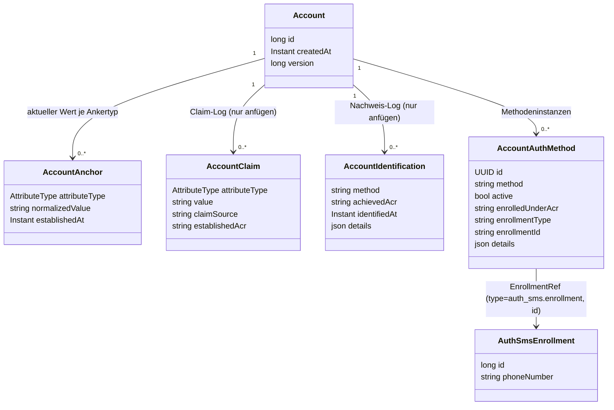

# Konkrete Abläufe

Wie `ident-fsc`/`ident-eid`/`auth-sms`/`enroll-sms` die Bausteine aus [03-tool-architektur.md](03-tool-architektur.md)
und [04-orchestrierung.md](04-orchestrierung.md) konkret nutzen — mit Fokus auf das Datenmodell
und die Entscheidungen dahinter. Ein durchgängiges Call-Beispiel steht in [05-api.md](05-api.md).

---

## 1) Datenmodell für `auth-sms` und `enroll-sms`

Entscheidungen, die an diesem Modell hängen:

- **`enrolledUnderAcr` als eigenes Feld, nicht nur Audit-Inhalt**: Das effektive `achievedAcr` eines `auth-*`-Tools ist durch `enrolledUnderAcr` der verwendeten Methode begrenzt ([Orchestrierung](04-orchestrierung.md) Abschnitt 1). Ohne diese Regel gäbe es einen Weg nach oben: Eine in einer schwachen Session eingerichtete Methode würde dauerhaft ein höheres Niveau erzeugen, als je nachgewiesen wurde. Den Wert kennt nur der Orchestrator, nie das Modul.
- **`EnrollmentRef` als echte Spalten, nicht irgendwo in `details`**: `account.auth_method.enrollment_type`/`enrollment_id` ist die einzige Verknüpfung zwischen Konto und Credential, indiziert und in beide Richtungen abfragbar (Löschung, Widerruf). Die Credential-Tabellen der Module tragen bewusst keine `account_id`: Sie entstehen im Tool-Handler, bevor der Orchestrator das Konto kennt.
- **Eine Zeile je Methodeninstanz statt JSON-Liste auf dem Konto**: Lesen schreibt nie; Änderungen sperren nur die Kontozeile per Versions-Inkrement; deaktivierte Instanzen tragen `deactivated_at` (CHECK-Constraint hält `active` und `deactivated_at` konsistent).
- **`details.enrolledUnderAmr` ist Audit-Kontext, kein Modellfeld**: erklärt rückblickend die Nachweise zum Enrollment-Zeitpunkt, beeinflusst weder Kandidatenauswahl noch ACR-Berechnung. Maßgeblich ist ausschließlich `enrolledUnderAcr`.
- **Die bestätigte E-Mail ist der EMAIL-Anker**, keine Spalte auf `Account` und kein Modul-Credential — höchstens eine je Konto, dieselbe Behandlung wie `personId`. Dieselbe Adresse dient sowohl als Auth-Mittel (`enroll-email`/`auth-email`, `EnrollmentRef` = `EMAIL_ANCHOR_ENROLLMENT`) als auch als Identifikator für den lookup-basierten Login. `UNIQUE(attribute_type, normalized_value)` verhindert Doppelvergabe in jeder Schreibweise.
- **Kein eigenes Identifikator-Feld bei `enroll-password`/`auth-password`**: Der EMAIL-Anker übernimmt diese Rolle, erzwungen über `ToolDescriptor.requires = { ClaimRequirement(EMAIL, PROVEN) }` ([Tool-Architektur](03-tool-architektur.md) Abschnitt 2).
- **Keine TAN im Enrollment**: Die TAN ist ein versuchsbezogenes Einmalgeheimnis und liegt gehasht mit Ablaufzeit in der Tool-Session-Tabelle — sonst überschreiben sich zwei parallele Versuche gegenseitig. Die eingereichte TAN wird nie gespeichert, nur gegen den Hash geprüft.
- **Orchestrator speichert nur Lifecycle/Routing**, nie Fach- oder Moduldaten — die liegen ausschließlich im jeweiligen Methodenmodul (`auth_sms.auth_tool_session`/`auth_sms.enroll_tool_session` bei SMS).

Regel für `account.identification.details`: Der Eintrag belegt, **dass und wie** geprüft wurde, nicht **was** geprüft wurde. Hinein gehören die Belege der Prüfung (`provider`, `providerTxId`), die Verfahrensversion und ein Hash über die geprüften Merkmale; nicht hinein gehören KVNR/Name im Klartext oder Geheimnisse.

Ein Lauf kann **zwei** Zeilen hinterlassen, weil ADR-18 die Identifizierung in zwei Akte teilt: bestätigen (`ident-eid`) und zuordnen (`ident-kvnr`). Beide werden protokolliert — die Zuordnung besonders, denn das ist der Moment, in dem der `PERSON_ID`-Anker entsteht. Welcher Akt eine Zeile war, steht als `role` in `details` (`IDENTIFICATION` oder `CORRELATION`) und wird nicht aus dem Verfahrensnamen erraten: Ein Korrelationsschritt trägt das Niveau der Bestätigung, auf der er aufsetzt, und eine Zeile „kvnr / loa2" ohne weiteren Hinweis würde sich wie ein Verfahren lesen, das dieses Niveau allein erreicht hat. Zeilen desselben Laufs teilen sich ihre `journeyId`.

---

## 2) `ident-fsc`

`id_fsc` prüft `kvnr`/`name`/`vorname`/`geburtsdatum`/`fsc` gegen den FSC-Dienst (Name und Geburtsdatum gegen die Stammdaten, der Code gegen den Briefkasten des Registers) und löst dabei die Identität auf — das *ist* die fachliche Leistung des Moduls. Das `account`-Modul kennt `id_fsc` nicht; die Verknüpfung übernimmt erst der Orchestrator beim Verarbeiten von `Completed.Identified` ([Orchestrierung](04-orchestrierung.md)).

Besonderheiten gegenüber dem allgemeinen Muster in [05-api.md](05-api.md): Gestaffelte `missingFields` in einem einzigen Step `input`: erst `kvnr`/`name`/`vorname`/`geburtsdatum`, danach `fsc`. Die Personendaten werden geprüft, sobald sie vollständig sind — erst wenn sie zum Register passen, fordert das Tool den Freischaltcode an. Abgelehnte Personendaten werden verworfen (danach fehlen wieder alle vier), ein abgelehnter Code nur der Code. Beide Ablehnungen zählen als Fehlversuch; die Personen-Sperre (`isIdentLockedOut`) greift beim Code, dem ratbaren Geheimnis. Eine Ablehnung der Personendaten nennt nie, welches Feld nicht passte oder ob die KVNR existiert. Wie viele Bildschirme ein Client daraus macht, entscheidet er selbst ([Frontend](10-frontend.md)); App und Keycloak zeigen erst die Personendaten, dann den Code, und bleiben nach einem Fehlversuch auf der Seite, von der abgeschickt wurde. `GET` baut `stepData` bei jedem Aufruf neu aus den Moduldaten auf; ist das Tool bereits abgeschlossen, zeigt die Antwort bereits auf das Folge-Tool (Resume-Fall).

---

## 3) `auth-sms` (und `auth-password`/`auth-email` analog)

Der Orchestrator liest die aktive Enrollment-Referenz des Accounts (`AccountDirectory.activeEnrollment`) und übergibt sie an den Handler — `auth_sms` referenziert `account` nicht selbst, sondern bekommt eine opake `EnrollmentRef` gereicht (Modulith-Grenze, [Projektrahmen](08-projektrahmen.md)). Auch `auth_email` verwendet nur `tool_api`/`tool_spi`: Account-IDs und Ankerwerte werden über `AccountDirectory` gelesen, Attribute durch Claims übernommen ([Tool-Architektur](03-tool-architektur.md) Abschnitt 2). `auth_sms` löst die Referenz auf ein bestehendes Enrollment auf, erzeugt/versendet/prüft die TAN, verändert das Enrollment aber nie.

Fehlerfall zusätzlich zum allgemeinen Vertrag ([Betrieb](07-betrieb.md)): unbekannte `enrollmentRef` oder fehlendes Enrollment -> `422`.

---

## 4) `enroll-sms` (und `enroll-password`/`enroll-email` analog)

Wie `auth-sms`, aber der `AuthSmsEnrollment`-Datensatz entsteht hier neu — und zwar erst **nach** erfolgreicher TAN-Prüfung, nie beim ersten `PATCH` mit der Telefonnummer (die ist ja noch unbestätigt). Nach Abschluss legt der Orchestrator gemäß [Orchestrierung](04-orchestrierung.md) Abschnitt 1 den `account.authenticationMethods`-Eintrag an (inkl. `enrolledUnderAcr` aus dem aktuellen `AuthContext`).

Fehlerfall zusätzlich zum allgemeinen Vertrag: ungültige Telefonnummer (Formatfehler) -> `400`.

---

## 5) `enroll-device` / `auth-device`

Anders als `sms`/`email`/`password` gibt es kein serverseitig ausgestelltes Geheimnis: das Credential *ist* ein auf dem Gerät erzeugtes, nicht-extrahierbares ECDSA-P-256-Schlüsselpaar, unabhängig vom DPoP-Kanal-Schlüssel. Der Client weist Besitz über einen selbstsignierten `device-proof+jwt` nach — strukturell identisch zu einem DPoP-Proof (`jwk` im Header, `htm`/`htu`/`iat`/`jti`), aber mit eigenem `typ` und einem zusätzlichen `userVerification`-Claim (`pin` oder `biometric`), den der (im Demo gemockte) System-Prompt pro Versuch bestimmt. `DeviceProofValidator` prüft ihn eigenständig (bewusst kein Ausbau von `DpopValidator`, [Projektrahmen](08-projektrahmen.md) A11), nutzt dafür aber dieselben Bausteine (`JwkThumbprintService`, Replay-Schutz per Thumbprint+`jti`).

Kein Server-Nonce nötig: `htu` bindet den Proof bereits an die einmalige `toolSessionId`-URL.

- **`enroll-device`**: Der Controller validiert den Proof und reicht nur die verifizierten Public-Key-Felder (`DevicePublicKey`: `kty`/`crv`/`x`/`y`/`thumbprint`) an den Handler weiter — das Modul bekommt nie ein Krypto-Objekt, nur Strings ([Tool-Architektur](03-tool-architektur.md) Abschnitt 2). Legt einen `device_enrollment`-Datensatz an; `EnrollmentRef(type="device_enrollment", id=...)`.
- **`auth-device`**: Löst die aktive Enrollment-Referenz auf (wie `auth-sms`) und vergleicht den Thumbprint des präsentierten Schlüssels mit dem gespeicherten — bei Abweichung `Failed("Geraet nicht erkannt")`, ohne zu verraten, welches Gerät erwartet wurde.
- **loa2 auf einmal**: `maxAcr=loa2`, `factorTypes={possession,knowledge,inherence}` — Besitz des Schlüssels plus Wissen (PIN) oder Inhärenz (Biometrie) aus einem Durchlauf ([03-tool-architektur.md](03-tool-architektur.md) Abschnitt 1). Die loa2-Voraussetzung fürs Enrollment decken bestehende Gates ab, nicht neuer Code: `ident-fsc` liefert im Identifizierungs-Zustand immer zuerst `loa2`, und `AuthIntent.MANAGE_AUTH_METHODS`s `selfServiceAcrFloor`-Gate erzwingt denselben Nachweis vor jedem nachträglichen Enrollment (nur loa1 für ein nie identifiziertes Konto).

Fehlerfall zusätzlich zum allgemeinen Vertrag: fehlender/ungültiger `deviceProof` (Signatur, Replay, `htm`/`htu`/`iat`) -> `401` (derselbe `DpopValidationException`-Pfad wie bei DPoP-Proofs); falscher Schlüssel bei `auth-device` -> `Failed`, kein Fehlerstatus (Retry-Fall wie bei falscher TAN).

---

## 6) `ident-eid` und `ident-kvnr`

`id_eid` ist das zweite `IDENTIFICATION`-Tool neben `ident-fsc` — mock-simulierte Online-Ausweisfunktion statt Freischaltcode. Anders als `ident-fsc` erbringt es zwei Faktorarten in einem Durchlauf (`factorTypes={possession,knowledge}`, `maxAcr=loa3`): Besitz der (simulierten) eID-Karte plus Wissen der PIN.

Zwei `PATCH`-Schritte, jeder mit eigenem `nextStep`, damit der Client zwei unterschiedliche Bildschirme zeigen kann:

1. **`card`**: die simulierte eID-Karte liefert ihre vollen Ausweisdaten in einem Zug — `name`, `vorname`, `geburtsdatum`, `strasse` (Straße **und** Hausnummer in einer Zeile, wie das Kartenfeld `Street`), `plz`, `ort`, `restrictedId`. Es wird **nichts** vorab eingetippt: eine Karte trägt weder KVNR noch PersonId, also gibt es auch keinen Suchschritt davor. Die `restrictedId` ist das kartengebundene Pseudonym (in der Demo ein Platzhalter für den echten Restricted Identifier). Im Kartenformular ist sie änderbar, obwohl eine echte Karte sie fest mitbringt: Nur so lässt sich in der Demo eine zweite Karte derselben Person durchspielen (neuer Wert, gleiches Konto — ADR-19) oder dieselbe Karte ein zweites Mal auflegen (Wiedererkennung).
2. **`pin`**: die eID-PIN (Testwert `123456`, wie `ident-fsc`s `VALIDCODE`).

Wie beim allgemeinen Muster lösen alle Felder zusammen in einem einzigen `PATCH`-Aufruf ebenfalls auf; nur die fehlenden Felder müssen einzeln nachgereicht werden.

Der eigentliche Unterschied zu `ident-fsc` liegt darin, wer für die Daten einsteht: Bei `ident-fsc` ist das Stammdaten-Backend die Quelle und das Tool nur sein Kanal (`ClaimSource.PERSON_DIRECTORY`), der Freischaltcode trägt den Verfahrensnachweis. `ident-eid` bestätigt dagegen auf **eigene** Autorität (`ClaimSource.of(toolId)`), was die Karte zeigt — Name, Vorname, Geburtsdatum und die Adresse als Claims, die `restrictedId` als achter Claim, der als lokaler Anker die Wiedererkennung des Interessenten trägt (ADR-19: eine neue Karte ersetzt den Wert an derselben Stelle, ein fremdes Konto hält ihn nie). Eine PersonId behauptet es nicht (ADR-18).

**`ident-kvnr`** ist der zweite Akt: ein eigenes Tool mit einem Schritt (`input`, Feld `kvnr` – oder ohne KVNR `partnernr`, ADR-34), das die Versichertennummer über `PersonDirectory.findPersonIdByKvnr` auflöst (die Partnernummer über `findPersonIdByPartnernr`; kommen beide, zählt die KVNR) (Controller, nicht Handler — `id_kvnr` darf `ext_personenverzeichnis` nicht direkt kennen, [Projektrahmen](08-projektrahmen.md) Abschnitt 3) und `PERSON_ID`/`KVNR` unter `PERSON_DIRECTORY` behauptet. Es trägt die Rolle `CORRELATION` (Kategorie `IDENT`, ADR-18) — der ausdrückliche Hinweis darauf, dass eine getippte Nummer für sich nichts beweist (`factorTypes={}` ist Folge, nicht Definition). Getragen wird es von zwei Dingen: `requires` (die bestätigten Identitätsattribute müssen am Konto vorliegen, sonst ist es nicht einmal aktivierbar) und `IdentityResolver.attestedIdentityMatches`, das vor dem Ankerschreiben prüft, ob die Stammdaten hinter der Nummer zur bestätigten Identität passen.

Gehört die Nummer zu einem Konto, das es bereits gibt, ist das kein Fehler des Nutzers, sondern eine Folge der Reihenfolge: Die Bestätigung brauchte ein Konto, bevor die Zuordnung laufen konnte. Das vorläufige Konto geht dann im gefundenen auf — mit Bestätigung, Ankern und Identifizierungs-Audit ([12-entscheidungen.md](12-entscheidungen.md) ADR-20). Danach steht die Registrierung dort, wo jeder andere Weg auf ein bestehendes Konto auch stünde: bei der Frage, ob dieses Gerät anderswo gebunden ist, und beim Angebot, eine vorhandene Methode zu beweisen statt eine neue einzurichten.

Zwischen beiden steht keine Ja/Nein-Frage mehr: Nach der Bestätigung zeigt `next` direkt auf `ident-kvnr` (`RegisterState.Assigning`). Wer die Nummer nicht angeben will, bricht den Schritt ab (`DELETE /orchestrator/api/v1/tools/{toolSessionId}/ident-kvnr`, im Frontend „Jetzt nicht") — der Lauf läuft regulär weiter und das Konto bleibt Interessent ([Orchestrierung](04-orchestrierung.md), ADR-10), mit voll bestätigter Identität, nur ohne Registerbindung. Ein Fallback-, kein Pflichtzustand.

Fehlerfälle zusätzlich zum allgemeinen Vertrag: falsche PIN -> `Failed("eID-PIN ungueltig")`; unbekannte Versichertennummer -> `Failed("Versichertennummer konnte nicht zugeordnet werden")`. Beide Fälle bekommen bewusst dieselbe Antwort, egal ob die Nummer gar nicht existiert oder zu jemand anderem gehört — sonst ließe sich daraus ablesen, ob eine Nummer existiert. Passt die Nummer zu einer anderen Person als der bestätigten, ist es ein Konflikt (`409`), kein Tool-Fehlschlag.

---

## 7) `enroll-kobil` / `auth-kobil`

Gerätebindung über den externen Dienstleister **KOBIL** — das erste Verfahren, dessen Nachweis
nicht durch den Client läuft. Der Client trägt nur eine Einmalkennung (OTP); die Geräte-Assertion
holt sich das Backend selbst beim Anbieter. Ein manipulierter Client kann eine Kennung
zurückhalten oder wiederholen, ein Ergebnis behaupten kann er nicht.

Zweite Abweichung, bewusst gegen den KOBIL-Standardweg: **der PIN liegt im Tool-Backend**, nicht
beim Nutzer. Er wird dort erzeugt und pro Anmeldung freigegeben, nachdem der Client sich lokal
entsperrt hat (ADR-21, ADR-22).

Die **Biometrie ist freiwillig**: Nur bei Zustimmung entsteht überhaupt ein Gerätegeheimnis, und
nur dann speichert der Server dessen Hash. Welche Entsperrwege ein konkretes Credential später hat,
rechnet der Server daraus aus — siehe „Nutzung" unten.

Der Anbieter ist simuliert: das Modul `kobil_mock` mit eigenem Schema, eigener HTTP-Fassade für die
App (`/mock-kobil/*`, das Pendant zum MC SDK) und der Schnittstelle `KobilSsms` für unser Backend.
Kein Spring-Profil, keine zweite Implementierung — der Mock *ist* KOBIL. Seine Operationen heißen
nach dem, was SSMS tut (Nutzer anlegen, Aktivierungscode ausstellen, PIN setzen, Nutzergeräte
abfragen, OTP am Services-Knoten verifizieren), nicht nach unserem Ablauf; die echten Wire-Formate
sind für die Demo nicht das Thema.

### Vier Geheimnisse, vier verschiedene Aussagen

| Ding | Wo es liegt | Was es dem Server beweist |
|---|---|---|
| KOBIL-PIN | Tool-Backend, pro Lauf freigegeben | **Nichts über den Nutzer** — er kennt ihn nicht |
| Lokales, biometriegeschütztes Gerätegeheimnis | nur im Client | Das Zugangsmittel zum Credential |
| Kontopasswort | `auth_password.enrollment` | Dasselbe Zugangsmittel, andere Ausprägung |
| Assertion + Gerätekennung | KOBIL, serverseitig per OTP eingelöst | **Besitz, echt** — der Server prüft, statt zu glauben |

### Einrichtung (`enroll-kobil`, Schritt `activate`)

1. Aktivierung des Tools: Das Backend legt bei KOBIL einen Nutzer an, lässt einen Aktivierungscode
   ausstellen, erzeugt den PIN und setzt ihn dort. `stepData` trägt `tenantId`, `kobilUserId`,
   `activationCode`, `pin` und ein frisch erzeugtes `unlockSecret`.
2. Der Client ruft damit direkt KOBIL auf (SDK-`ActivateEvent`). Dabei entsteht bei KOBIL die
   **Gerätekennung**. Das `unlockSecret` legt der Client — nur bei Zustimmung — lokal hinter
   seiner Biometrie ab; andernfalls verwirft er es.
3. `PATCH {activated, biometricConsent, label}`: Das Backend fragt die Kennung bei KOBIL ab —
   niemals beim Client, denn sie ist der Vergleichsanker jeder späteren Anmeldung — und schreibt
   das Credential (Kennung, PIN, DPoP-`bindingKeyRef`, und **nur bei Zustimmung** den Hash des
   Unlock-Secrets). `Completed.Enrolled` mit `amr = [kobil, pin|biometric]`, wobei das
   Zugangsmittel aus der Zustimmung abgeleitet wird und keine zweite Eingabe ist.

`biometricConsent` hat keinen Default: Eine Zustimmung, die man nicht gegeben hat, gibt es nicht.
Ohne sie bleibt `unlock_secret_hash` NULL, und „Biometrie erlaubt" ist damit kein Flag neben einem
Geheimnis, sondern dessen Vorhandensein.

Ein `activated` ohne Gerät bei KOBIL ist **kein** Fehlschlag, sondern `Unchanged`: Wer die Seite
neu geladen hat, hat nichts geraten, also wird auch kein Versuchsbudget belastet. Deshalb gibt der
Schritt seine Werte bei jedem Lesen erneut heraus — solange die Einrichtung läuft, muss der Client
sie noch entgegennehmen können.

### Nutzung (`auth-kobil`, Schritte `unlock` und `otp`)

| Schritt | Wer | Was |
|---|---|---|
| `unlock` | Client | Entsperrt lokal: `POST .../auth-kobil/pin-releases` mit dem Gerätegeheimnis **oder** dem Kontopasswort — angeboten wird nur, was es wirklich gibt (`stepData.unlockOptions`) |
| — | Backend | Prüft, gibt den PIN frei — in **dieser einen Antwort**, Schritt wird `otp` |
| `otp` | Client | SDK-`LoginEvent` mit dem PIN bei KOBIL, erhält einen OTP zurück |
| — | Client | `PATCH {otp}` |
| — | Backend | Löst den OTP bei KOBIL ein, vergleicht Kennung, bewertet Risiken |

Die Freigabe ist eine **eigene Sub-Ressource**, nicht Teil des PATCH — das erste Tool, das den in
[API](05-api.md) Abschnitt 1 zugesagten eigenen URL-Namespace wirklich nutzt. Drei Gründe, alle
strukturell: Der PIN darf nicht wieder abrufbar sein (`buildReadResponse` baut `stepData` bei jedem
GET neu auf, also darf er dort nicht stehen); eine Freigabe ist eine Erzeugung, nicht ein Patch
(einmalig, befristet, nicht idempotent); und zwei verschiedene Akte werden besser durch die URL
unterschieden als durch „welche nullable Felder sind gerade gesetzt". Der Body ist ein echtes
Entweder-Oder (`sealed interface KobilUnlockCredential`) — beides oder nichts ist nicht
konstruierbar, und damit folgt die gemeldete Faktorart aus dem Typ statt aus einem Flag.

Das Kontopasswort ist auf diesem Weg das Zugangsmittel zum KOBIL-Credential, kein eigener
Anmeldeschritt: geprüft wird es über `PasswordCredentialPort`, gemeldet wird `pin` — nie
`password`, weil das dem Lauf die echte Passwortmethode anhängen und sie doppelt zählen würde.
Eine wiederholte Freigabe ist erlaubt: wessen Freigabefenster abgelaufen ist, entsperrt einfach
erneut.

### Was geprüft wird, und was bei Abweichung passiert

- Kein gültiges Freigabefenster -> `Failed("Entsperren erforderlich")`, zurück zu `unlock`.
- OTP unbekannt oder verbraucht -> `Failed("Bestaetigung nicht erkannt")`. Unbekannt, verbraucht
  und fremd sind bei KOBIL bewusst dieselbe Antwort.
- Kennung weicht ab -> `Failed("Geraet nicht erkannt")` — wortgleich zu `auth-device`, verrät nicht,
  welches Gerät erwartet wurde.
- Gemeldetes Risiko in der konfigurierten Sperrmenge (`dpop.kobil.blocking-risks`) ->
  `Failed("Geraet als unsicher gemeldet")`. Bewusst ein eigener Grund: Das ist kein Tippfehler des
  Nutzers, sondern eine Aussage über das Gerät; in einem „nicht erkannt" würde ein echter Befund verschwinden.
  Kein Score, sondern eine benannte Menge — ein Score wäre erfunden und würde sich trotzdem wie eine
  Messung lesen. Da beide Seiten geschlossene Enums sind, ist ein unbekanntes Signal nicht einmal
  konstruierbar, also auch kein zu prüfender Fall.
- Falsches Gerätegeheimnis, falsches Passwort und gar kein Passwort-Credential ->
  **eine** Formulierung (`Failed("Entsperren fehlgeschlagen")`), damit daraus kein Orakel wird, ob
  das Konto ein Passwort hat.

Alle Fehlschläge sind der gewöhnliche Retry-Fall (`200` mit `stepData.error`, Versuchsbudget der
Journey), kein Fehlerstatus. Sie belasten über `chargeThrottles` den bestehenden
`LoginThrottleService` — auch die Risiko-Ablehnung, was heißt: ein gerootetes Telefon kann seinen
Besitzer aussperren. Bewusst in Kauf genommen, statt eine Sonderbehandlung einzuführen.

### Welche Entsperrwege es gibt, entscheidet nicht der Client

`unlockOptions` ist abgeleitet, nicht fest: `biometric` genau dann, wenn ein
`unlock_secret_hash` existiert (also jemand zugestimmt hat), `password` genau dann, wenn das Konto
noch ein Passwort hält. Einen Weg anzubieten, den es nicht gibt, hätte nur einen möglichen Ausgang
— einen Fehlversuch, der den Login-Throttle belastet.

Was das kostet: Die Antwort verrät dem Aufrufer, ob das Konto ein Passwort hat. Das ist
hier vertretbar, weil `auth-kobil` überhaupt nur für einen Aufrufer läuft, dessen Schlüssel bereits
zu einem eingetragenen Credential **dieses** Kontos passt (`keyBinding`) — und derselbe Aufrufer
sieht `activeMethods`, sobald er fertig ist.

Eine leere Liste ist möglich und wird als solche angezeigt: ein Credential ohne Biometrie-Zustimmung
auf einem Konto, das sein Passwort verloren hat, ist nicht mehr benutzbar. Der Client sagt das,
statt eine Schaltfläche anzubieten, die nicht funktionieren kann.

Nicht gebaut: eine `-lookup`-Variante (das Credential ist schlüsselgebunden) und ein
`WebToolRenderer` für den Keycloak-Kanal (ein Telefon-SDK lässt sich aus einer Loginmaske nicht
ansprechen) — siehe [API](05-api.md) Abschnitt 3.
