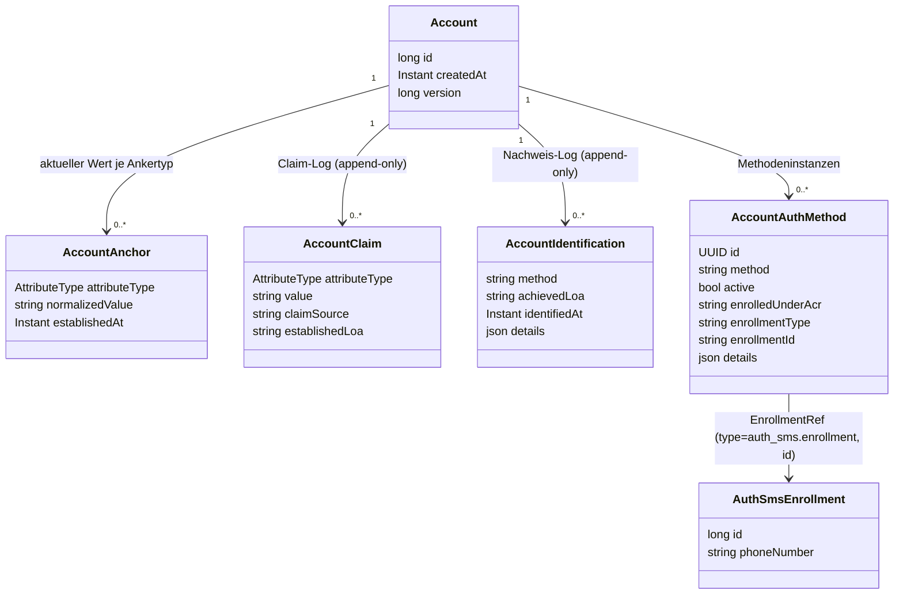

# Konkrete Abläufe

Wie `ident-fsc`/`ident-eid`/`auth-sms`/`enroll-sms` die Bausteine aus [03-tool-architektur.md](03-tool-architektur.md)
und [04-orchestrierung.md](04-orchestrierung.md) konkret nutzen — mit Fokus auf das Datenmodell
und die Entscheidungen dahinter. Ein durchgängiges Call-Beispiel steht in [05-api.md](05-api.md).

---

## 1) Datenmodell für `auth-sms` und `enroll-sms`

Entscheidungen, die an diesem Modell hängen:

- **`enrolledUnderAcr` als eigenes Feld, nicht nur Audit-Inhalt**: Das effektive `achievedAcr` eines `auth-*`-Tools ist durch `enrolledUnderAcr` der verwendeten Methode gedeckelt ([Orchestrierung](04-orchestrierung.md) Abschnitt 1). Ohne diese Regel gäbe es einen Eskalationspfad: eine in schwacher Session hinterlegte Methode erzeugte dauerhaft ein höheres Niveau, als je nachgewiesen wurde. Den Wert kennt nur der Orchestrator, nie das Modul.
- **`EnrollmentRef` als echte Spalten, nicht im `details`-Blob**: `account.auth_method.enrollment_type`/`enrollment_id` ist die einzige Verknüpfung zwischen Konto und Credential, indiziert und in beide Richtungen abfragbar (Löschung, Widerrufs-Sweep). Die Credential-Tabellen der Module tragen bewusst keine `account_id`: Sie entstehen im Tool-Handler, bevor der Orchestrator das Konto kennt.
- **Eine Zeile je Methodeninstanz statt JSON-Liste auf dem Konto**: Lesen schreibt nie; Änderungen sperren nur die Kontozeile per Versions-Inkrement; deaktivierte Instanzen tragen `deactivated_at` (CHECK-Constraint hält `active` und `deactivated_at` konsistent).
- **`details.enrolledUnderAmr` ist Audit-Kontext, kein Modellfeld**: erklärt rückblickend die Nachweise zum Enrollment-Zeitpunkt, beeinflusst weder Kandidatenauswahl noch ACR-Berechnung. Maßgeblich ist ausschließlich `enrolledUnderAcr`.
- **Die bestätigte E-Mail ist der EMAIL-Anker**, keine Spalte auf `Account` und kein Modul-Credential — höchstens eine je Konto, dieselbe Behandlung wie `personId`. Dieselbe Adresse dient sowohl als Auth-Mittel (`enroll-email`/`auth-email`, `EnrollmentRef` = `EMAIL_ANCHOR_ENROLLMENT`) als auch als Identifikator für den lookup-basierten Login. `UNIQUE(attribute_type, normalized_value)` verhindert Doppelvergabe in jeder Schreibweise.
- **Kein eigenes Identifikator-Feld bei `enroll-password`/`auth-password`**: Der EMAIL-Anker übernimmt diese Rolle, erzwungen über `ToolDescriptor.requires = { ClaimRequirement(EMAIL, PROVEN) }` ([Tool-Architektur](03-tool-architektur.md) Abschnitt 2).
- **Keine TAN im Enrollment**: Die TAN ist ein versuchsbezogenes Einmalgeheimnis und liegt gehasht mit Ablaufzeit in der Tool-Session-Tabelle — sonst überschreiben sich zwei parallele Versuche gegenseitig. Die eingereichte TAN wird nie gespeichert, nur gegen den Hash geprüft.
- **Orchestrator speichert nur Lifecycle/Routing**, nie Fach- oder Moduldaten — die liegen ausschließlich im jeweiligen Methodenmodul (`auth_sms.auth_tool_session`/`auth_sms.enroll_tool_session` bei SMS).

Regel für `account.identification.details`: Der Eintrag belegt, **dass und wie** geprüft wurde, nicht **was** geprüft wurde. Hinein gehören Nachweisanker (`provider`, `providerTxId`), Verfahrensversion und ein Hash über die geprüften Merkmale; nicht hinein gehören KVNR/Name im Klartext oder Geheimnisse.

---

## 2) `ident-fsc`

`id_fsc` prüft `kvnr`/`name`/`vorname`/`fsc` gegen den FSC-Dienst und löst dabei die Identität auf — das *ist* die fachliche Leistung des Moduls. Das `account`-Modul kennt `id_fsc` nicht; die Verknüpfung übernimmt erst der Orchestrator beim Verarbeiten von `Completed.Identified` ([Orchestrierung](04-orchestrierung.md)).

Besonderheiten gegenüber dem allgemeinen Muster in [05-api.md](05-api.md): Zwei `PATCH`-Aufrufe (erst `kvnr`/`name`/`vorname`, dann `fsc`) — der FSC-Dienst wird erst aufgerufen, wenn alle vier Felder vorliegen. `GET` baut `stepData` bei jedem Aufruf neu aus den Moduldaten auf; ist das Tool bereits abgeschlossen, zeigt die Antwort bereits auf das Folge-Tool (Resume-Fall).

---

## 3) `auth-sms` (und `auth-password`/`auth-email` analog)

Der Orchestrator liest die aktive Enrollment-Referenz des Accounts (`AccountDirectory.activeEnrollment`) und übergibt sie an den Handler — `auth_sms` referenziert `account` nicht selbst, sondern bekommt eine opake `EnrollmentRef` gereicht (Modulith-Grenze, [Projektrahmen](08-projektrahmen.md)). Auch `auth_email` verwendet nur `tool_api`/`tool_spi`: Account-IDs und Ankerwerte werden über `AccountDirectory` gelesen, Attribute durch Claims übernommen ([Tool-Architektur](03-tool-architektur.md) Abschnitt 2). `auth_sms` löst die Referenz auf ein bestehendes Enrollment auf, erzeugt/versendet/prüft die TAN, verändert das Enrollment aber nie.

Fehlerfall zusätzlich zum allgemeinen Vertrag ([Betrieb](07-betrieb.md)): unbekannte `enrollmentRef` oder fehlendes Enrollment -> `422`.

---

## 4) `enroll-sms` (und `enroll-password`/`enroll-email` analog)

Wie `auth-sms`, aber der `AuthSmsEnrollment`-Datensatz entsteht hier neu — und zwar erst **nach** erfolgreicher TAN-Prüfung, nie beim ersten `PATCH` mit der Telefonnummer (die ist ja noch unbestätigt). Nach Abschluss legt der Orchestrator gemäß [Orchestrierung](04-orchestrierung.md) Abschnitt 1 den `account.authenticationMethods`-Eintrag an (inkl. `enrolledUnderAcr` aus dem aktuellen `AuthContext`).

Fehlerfall zusätzlich zum allgemeinen Vertrag: ungültige Telefonnummer (Formatfehler) -> `400`.

---

## 5) `enroll-device` / `auth-device`

Anders als `sms`/`email`/`password` gibt es kein serverseitig ausgestelltes Geheimnis: das Credential *ist* ein auf dem Gerät erzeugtes, nicht-extrahierbares ECDSA-P-256-Schlüsselpaar, unabhängig vom DPoP-Kanal-Schlüssel. Der Client weist Besitz über einen selbstsignierten `device-proof+jwt` nach — strukturell identisch zu einem DPoP-Proof (`jwk` im Header, `htm`/`htu`/`iat`/`jti`), aber mit eigenem `typ` und einem zusätzlichen `userVerification`-Claim (`pin` oder `biometric`), den der (im Demo gemockte) System-Prompt pro Versuch bestimmt. `DeviceProofValidator` prüft ihn eigenständig (bewusst kein Ausbau von `DpopValidator`, [Projektrahmen](08-projektrahmen.md) A11), nutzt dafür aber dieselben Bausteine (`JwkThumbprintService`, Replay-Schutz per Thumbprint+`jti`).

Kein Server-Nonce nötig: `htu` bindet den Proof bereits an die einmalige `toolSessionId`-URL.

- **`enroll-device`**: Der Controller validiert den Proof und reicht nur die verifizierten Public-Key-Felder (`DevicePublicKey`: `kty`/`crv`/`x`/`y`/`thumbprint`) an den Handler weiter — das Modul bekommt nie ein Krypto-Objekt, nur Strings ([Tool-Architektur](03-tool-architektur.md) Abschnitt 2). Legt einen `device_enrollment`-Datensatz an; `EnrollmentRef(type="device_enrollment", id=...)`.
- **`auth-device`**: Löst die aktive Enrollment-Referenz auf (wie `auth-sms`) und vergleicht den Thumbprint des präsentierten Schlüssels mit dem gespeicherten — bei Abweichung `Failed("Geraet nicht erkannt")`, ohne zu verraten, welches Gerät erwartet wurde.
- **loa2 auf einmal**: `maxAcr=loa2`, `factorTypes={possession,knowledge,inherence}` — Besitz des Schlüssels plus Wissen (PIN) oder Inhärenz (Biometrie) aus einem Durchlauf ([03-tool-architektur.md](03-tool-architektur.md) Abschnitt 1). Die loa2-Voraussetzung fürs Enrollment decken bestehende Gates ab, nicht neuer Code: `ident-fsc` liefert im Identifizierungs-Zustand immer zuerst `loa2`, und `AuthIntent.MANAGE_AUTH_METHODS`s `selfServiceAcrFloor`-Gate erzwingt denselben Nachweis vor jedem nachträglichen Enrollment (nur loa1 für ein nie identifiziertes Konto).

Fehlerfall zusätzlich zum allgemeinen Vertrag: fehlender/ungültiger `deviceProof` (Signatur, Replay, `htm`/`htu`/`iat`) -> `401` (derselbe `DpopValidationException`-Pfad wie bei DPoP-Proofs); falscher Schlüssel bei `auth-device` -> `Failed`, kein Fehlerstatus (Retry-Fall wie bei falscher TAN).

---

## 6) `ident-eid` und `ident-kvnr`

`id_eid` ist das zweite `IDENTIFICATION`-Tool neben `ident-fsc` — mock-simulierte Online-Ausweisfunktion statt Freischaltcode. Anders als `ident-fsc` erbringt es zwei Faktorarten in einem Durchlauf (`factorTypes={possession,knowledge}`, `maxAcr=loa3`): Besitz der (simulierten) eID-Karte plus Wissen der PIN.

Zwei `PATCH`-Schritte, jeder mit eigenem `nextStep`, damit der Client zwei unterschiedliche Bildschirme zeigen kann:

1. **`card`**: die simulierte eID-Karte liefert ihre vollen Ausweisdaten in einem Zug — `name`, `vorname`, `geburtsdatum`, `strasse`, `hausnummer`, `plz`, `ort`, `restrictedId`. Es wird **nichts** vorab eingetippt: eine Karte trägt weder KVNR noch PersonId, also gibt es auch keinen Suchschritt davor. Die `restrictedId` ist das karteugebundene Pseudonym (Demo-Standin für den echten Restricted Identifier) und im Kartenformular nicht editierbar.
2. **`pin`**: die eID-PIN (Testwert `123456`, wie `ident-fsc`s `VALIDCODE`).

Wie beim allgemeinen Muster lösen alle Felder zusammen in einem einzigen `PATCH`-Aufruf ebenfalls auf; nur die fehlenden Felder müssen einzeln nachgereicht werden.

Der eigentliche Unterschied zu `ident-fsc` liegt darin, wer bürgt: Bei `ident-fsc` ist der Stammdaten-Backend die Quelle und das Tool nur sein Kanal (`ClaimSource.EXT_STAMMDATEN`), der Freischaltcode trägt den Verfahrensnachweis. `ident-eid` bezeugt dagegen auf **eigene** Autorität (`ClaimSource.of(toolId)`), was die Karte zeigt — Name, Vorname, Geburtsdatum und die Adresse als Claims, die `restrictedId` als achter Claim, der als lokaler Anker die Wiedererkennung des Interessenten trägt (ADR-19: eine neue Karte ersetzt den Wert in-place, ein fremdes Konto hält ihn nie). Eine PersonId behauptet es nicht (ADR-18).

**`ident-kvnr`** ist der zweite Akt: ein eigenes Tool mit einem Schritt (`input`, Feld `kvnr`), das die Versichertennummer über `PersonDirectory.findPersonIdByKvnr` auflöst (Controller, nicht Handler — `id_kvnr` darf `ext_stammdaten` nicht direkt kennen, [Projektrahmen](08-projektrahmen.md) Abschnitt 3) und `PERSON_ID`/`KVNR` unter `EXT_STAMMDATEN` behauptet. Es trägt die Rolle `CORRELATION` (Kategorie `IDENT`, ADR-18) — die ausdrückliche Form, dass eine getippte Nummer für sich nichts beweist (`factorTypes={}` ist Folge, nicht Definition). Getragen wird es von zwei Dingen: `requires` (die bezeugten Identitätsattribute müssen am Konto vorliegen, sonst ist es nicht einmal aktivierbar) und `IdentityResolver.attestedIdentityMatches`, das vor dem Ankerschreiben prüft, ob die Stammdaten hinter der Nummer zur bezeugten Identität passen.

Gehört die Nummer zu einem Konto, das es bereits gibt, ist das kein Fehler des Nutzers, sondern eine Folge der Reihenfolge: Die Bezeugung brauchte ein Konto, bevor die Zuordnung laufen konnte. Das vorläufige Konto geht dann im gefundenen auf — mit Bezeugung, Ankern und Identifizierungs-Audit ([12-entscheidungen.md](12-entscheidungen.md) ADR-20). Danach steht die Registrierung dort, wo jeder andere Weg auf ein bestehendes Konto auch stünde: bei der Frage, ob dieses Gerät anderswo gebunden ist, und beim Angebot, eine vorhandene Methode zu beweisen statt eine neue einzurichten.

Zwischen beiden steht eine Ja/Nein-Frage (`RegisterState.OfferRegisterAssignment`, ein `Prompt.Confirm` wie `OfferReIdent`): „Konto Ihrer Versichertennummer zuordnen?" Zustimmung wechselt nach `Assigning`, erst dieser Angebotzustand rendert `next` auf `ident-kvnr` (derselbe Split wie `OfferReIdent` → `Identifying`); Ablehnung läuft regulär weiter und das Konto bleibt Interessent ([Orchestrierung](04-orchestrierung.md), ADR-10) — mit voll bezeugter Identität, nur ohne Registerbindung. Ein Fallback-, kein Pflichtzustand.

Fehlerfälle zusätzlich zum allgemeinen Vertrag: falsche PIN -> `Failed("eID-PIN ungueltig")`; unbekannte Versichertennummer -> `Failed("Versichertennummer konnte nicht zugeordnet werden")` — bewusst dieselbe Antwort, egal ob die Nummer gar nicht existiert oder zu jemand anderem gehört, damit daraus kein KVNR-Existenz-Orakel wird; passt die Nummer zu einer anderen Person als der bezeugten, ist es ein Konflikt (`409`), kein Tool-Fehlschlag.

