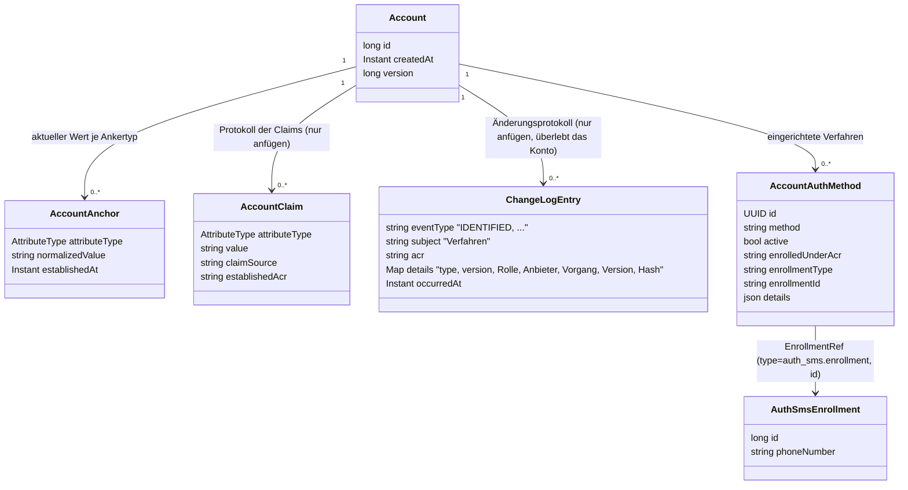

# Konkrete Abläufe

Wie `ident-fsc`, `ident-eid`, `auth-sms` und `enroll-sms` die Bausteine aus
[03-tool-architektur.md](03-tool-architektur.md) und [04-orchestrierung.md](04-orchestrierung.md)
konkret nutzen – mit dem Schwerpunkt auf dem Datenmodell und den Entscheidungen dahinter. Ein
durchgehendes Beispiel mit allen Aufrufen steht in [05-api.md](05-api.md).

Ein drittes Identifizierungsverfahren, `ident-nect` (nur im App-Kanal), hat hier keinen eigenen
Abschnitt. Die App schickt den Nutzer auf die Sprungseite des simulierten Dienstes Nect (`/nect/`);
dort wählt er Online-Ausweis, Reisepass oder EUDI-Wallet. Das Ergebnis holt der Server danach
einmalig selbst bei Nect ab (`NectIdent.redeem`), nie über den Client. Die gelieferten Angaben
bestätigt er wie bei `ident-eid` auf eigene Verantwortung (`ClaimSource.of("ident-nect")`, bis
`loa3`, `amr` `nect-<verfahren>`). Die Zuordnung zu einer Person folgt wie bei `ident-eid` über
`ident-kvnr`. Details stehen in [03-tool-architektur.md](03-tool-architektur.md), Abschnitt 1; was noch offen ist, in [ideen/ident-nect.md](ideen/ident-nect.md).

---

## 1) Datenmodell für `auth-sms` und `enroll-sms`

Entscheidungen, die an diesem Modell hängen:

- **`enrolledUnderAcr` ist ein eigenes Feld, nicht nur ein Eintrag fürs Protokoll.** Das
  tatsächlich erreichte `achievedAcr` eines `auth-*`-Tools wird durch das `enrolledUnderAcr` des
  verwendeten Verfahrens begrenzt ([Orchestrierung](04-orchestrierung.md) Abschnitt 1). Ohne diese
  Regel käme man schleichend nach oben: Ein in einer schwach gesicherten Sitzung eingerichtetes
  Verfahren würde dauerhaft ein höheres Niveau erzeugen, als je nachgewiesen wurde. Den Wert kennt
  nur der Orchestrator, nie das Modul.
- **Die `EnrollmentRef` steht in echten Spalten, nicht irgendwo in `details`.**
  `account.auth_method.enrollment_type`/`enrollment_id` ist die einzige Verknüpfung zwischen Konto
  und Credential; sie ist indiziert und in beide Richtungen abfragbar (beim Löschen und beim
  Widerruf). Die Credential-Tabellen der Module haben bewusst keine `account_id`: Sie entstehen im
  Tool-Handler, bevor der Orchestrator das Konto kennt.
- **Eine Zeile je eingerichtetem Verfahren statt einer JSON-Liste im Konto.** Lesen schreibt nie.
  Änderungen sperren nur die Kontozeile, indem sie deren Version erhöhen. Deaktivierte Einträge
  tragen `deactivated_at`; ein CHECK-Constraint hält `active` und `deactivated_at` stimmig.
- **Welche Nachweise beim Einrichten vorlagen, steht nur im Änderungsprotokoll.** Das Ereignis
  `METHOD_ADDED` trägt in `details` die Nachweise der Sitzung (`amr`) und den Kanal (`channel`),
  denn nur dort überdauern sie Deaktivierung und Kontolöschung (ADR-39). Auf die Auswahl der
  Kandidaten und die Berechnung des ACR wirken sie nicht; maßgeblich ist allein
  `enrolledUnderAcr`. `details` enthält nur, was das zuständige Modul selbst wieder liest
  (Schlüssel-Referenz, KOBIL-Gerätekennung).
- **Die bestätigte E-Mail-Adresse ist der EMAIL-Anker** – keine Spalte im `Account` und kein
  Credential eines Moduls. Es gibt höchstens eine je Konto, genau wie bei `personId`. Bestätigt
  wird sie per `confirm-email`. Danach dient dieselbe Adresse sowohl als Anmeldeverfahren
  (`enroll-email`/`auth-email`, `EnrollmentRef` = `EMAIL_ANCHOR_ENROLLMENT`) als auch zum Finden
  des Kontos bei der Anmeldung über die E-Mail-Adresse. `UNIQUE(attribute_type, normalized_value)`
  verhindert, dass dieselbe Adresse in irgendeiner Schreibweise zweimal vergeben wird.
- **`enroll-password`/`auth-password` haben kein eigenes Feld für einen Benutzernamen.** Diese
  Aufgabe übernimmt der EMAIL-Anker, erzwungen über
  `ToolDescriptor.requires = { ClaimRequirement(EMAIL, PROVEN) }`
  ([Tool-Architektur](03-tool-architektur.md) Abschnitt 2).
- **Die TAN steht nicht im Enrollment.** Sie ist ein Einmalgeheimnis für genau einen Versuch und
  liegt als Hash mit Ablaufzeit in der Tabelle der Tool-Sitzung; sonst würden sich zwei
  gleichzeitige Versuche gegenseitig überschreiben. Die eingegebene TAN wird nie gespeichert, nur
  mit dem Hash verglichen.
- **Der Orchestrator speichert nur Lebenszyklus und Routing**, nie Fach- oder Moduldaten. Die
  liegen ausschließlich im jeweiligen Methodenmodul (bei SMS in
  `auth_sms.auth_tool_session`/`auth_sms.enroll_tool_session`).

Regel für das Identifizierungs-Ereignis im Änderungsprotokoll (`account.change_log`, `IDENTIFIED`,
[ADR-39](adr/ADR-039-was-eine-kontoloeschung-ueberlebt.md)): Es belegt, **dass und wie** geprüft
wurde, nicht **was** geprüft wurde. Hinein gehören Rolle, die Belege der Prüfung (`provider`,
`providerTxId`), die Version des Verfahrens und ein Hash über die geprüften Merkmale – nur diese
Felder, per Namen übernommen (`JourneyRecorder`). Nicht hinein gehören KVNR, Name, eine Dokument-
oder Ausweisnummer (§ 20 PAuswG) oder Geheimnisse.

Ein Durchlauf kann **zwei** Zeilen hinterlassen, weil ADR-18 die Identifizierung in zwei Schritte
teilt: bestätigen (`ident-eid`) und zuordnen (`ident-kvnr`). Beide werden protokolliert, die
Zuordnung sogar besonders, denn in diesem Moment entsteht der `PERSON_ID`-Anker. Welcher Schritt
eine Zeile war, steht als `role` in `details` (`IDENTIFICATION` oder `CORRELATION`) und wird nicht
aus dem Namen des Verfahrens erraten. Ein zuordnender Schritt trägt nämlich das Niveau der
Bestätigung, auf der er aufbaut; eine Zeile „kvnr / loa2" ohne weiteren Hinweis sähe aus wie ein
Verfahren, das dieses Niveau allein erreicht hat. Zeilen desselben Durchlaufs haben dieselbe
`journeyId`.

---

## 2) `ident-fsc`

`id_fsc` prüft `kvnr`, `familyName`, `givenNames`, `birthDate` und `fsc` gegen das Personenverzeichnis:
Name und Geburtsdatum gegen die dort geführte Person, den Code gegen die dort ausgestellten
Freischaltcodes. Ein Partner ohne KVNR gibt statt `kvnr` seine Partnernummer `partnernr` an
(ADR-34). Der Client fragt zuerst nach der KVNR; kommen beide Nummern, zählt die KVNR, und das Tool
merkt sich immer nur eine von beiden. `kvnr` in `missingFields` steht deshalb für „KVNR oder
Partnernummer“. Dabei stellt das Tool fest, um welche Person es sich handelt – genau das ist die
fachliche Leistung des Moduls. Das Modul `account` kennt `id_fsc` nicht; die Verbindung stellt erst
der Orchestrator her, wenn er `Completed.Identified` verarbeitet
([Orchestrierung](04-orchestrierung.md)).

Was hier vom allgemeinen Muster in [05-api.md](05-api.md) abweicht:

- Die `missingFields` kommen gestaffelt in einem einzigen Schritt `input`: zuerst
  `kvnr`/`familyName`/`givenNames`/`birthDate`, danach `fsc`.
- Die Personendaten werden geprüft, sobald sie vollständig sind. Erst wenn sie zum
  Personenverzeichnis passen, fragt das Tool nach dem Freischaltcode.
- Abgelehnte Personendaten werden verworfen; danach fehlen wieder alle vier. Bei einem abgelehnten
  Code wird nur der Code verworfen.
- Beide Ablehnungen zählen als Fehlversuch. Die Sperre für die Person (`isIdentLockedOut`) greift
  beim Code, denn nur er ist ein Geheimnis, das man erraten könnte.
- Wird die Eingabe der Personendaten abgelehnt, erfährt man nie, welches Feld nicht passte oder
  ob es die KVNR gibt.
- Wie viele Bildschirme ein Client daraus macht, entscheidet er selbst ([Frontend](10-frontend.md)).
  App und Keycloak zeigen zuerst die Personendaten, dann den Code, und bleiben nach einem
  Fehlversuch auf der Seite, von der aus abgeschickt wurde.
- `GET` baut `stepData` bei jedem Aufruf neu aus den Daten des Moduls auf. Ist das Tool schon
  abgeschlossen, zeigt die Antwort bereits auf das nächste Tool (Fortsetzen nach Unterbrechung).

---

## 3) `auth-sms` (`auth-password` und `auth-email` entsprechend)

Der Orchestrator liest die aktive Enrollment-Referenz des Kontos
(`AccountDirectory.activeEnrollment`) und übergibt sie an den Handler. `auth_sms` greift also nicht
selbst auf `account` zu, sondern bekommt eine undurchsichtige `EnrollmentRef` übergeben (Grenze des
Moduliths, [Projektrahmen](08-projektrahmen.md)). Auch `auth_email` nutzt nur `tool_api` und
`tool_spi`: Konto-IDs und Ankerwerte liest es über `AccountDirectory`, Attribute werden über Claims
übernommen ([Tool-Architektur](03-tool-architektur.md) Abschnitt 2). `auth_sms` löst die Referenz
auf ein bestehendes Enrollment auf, erzeugt, versendet und prüft die TAN, verändert das Enrollment
aber nie.

Zusätzlicher Fehlerfall zum allgemeinen Vertrag ([Betrieb](07-betrieb.md)): unbekannte
`enrollmentRef` oder fehlendes Enrollment -> `422`.

---

## 4) `enroll-sms` (`enroll-password` und `confirm-email` entsprechend)

Wie `auth-sms`, nur entsteht der Datensatz `AuthSmsEnrollment` hier neu – und zwar erst **nach**
erfolgreicher Prüfung der TAN, nie schon beim ersten `PATCH` mit der Telefonnummer (die ist zu
diesem Zeitpunkt ja noch nicht bestätigt). Nach dem Abschluss legt der Orchestrator, wie in
[Orchestrierung](04-orchestrierung.md) Abschnitt 1 beschrieben, den Eintrag in `account.auth_method`
an, einschließlich `enrolledUnderAcr` aus dem aktuellen Nachweis der Sitzung (`AuthEvidence`).

Zusätzlicher Fehlerfall zum allgemeinen Vertrag: ungültige Telefonnummer (Formatfehler) -> `400`.

**Passwort speichern und prüfen** (`auth_password`):

- **Nur als Hash:** Argon2id mit den OWASP-Werten (19 MiB Speicher, 2 Durchläufe, 1 Spur;
  `PasswordHasher`). Ein älteres Format gibt es nicht; der frühere PBKDF2-Weg ist entfernt.
- **Umhashen bei der Anmeldung:** Werden die Werte später angehoben, erkennt `needsRehash` einen
  schwächeren Hash. Nach einer **erfolgreichen** Prüfung schreibt `PasswordHasher.upgrade` den neuen
  Hash in derselben Transaktion. Niemand muss dafür sein Passwort neu setzen.
- **Gleicher Aufwand ohne Passwort:** Hat das Konto kein Passwort, rechnet `matches` trotzdem einmal
  Argon2id gegen einen Platzhalter-Hash. Sonst verriete die Antwortzeit, ob es zu einer Adresse ein
  Passwort gibt.
- **Regeln für ein neues Passwort** (`PasswordPolicy`, gleich für `enroll-password` und den
  Passwortwechsel über Keycloak): mindestens 8, höchstens 128 Zeichen und keines aus der Liste der
  gängigsten Passwörter (`auth_password/common-passwords.txt`, ohne Beachtung von
  Groß-/Kleinschreibung). Verstöße sind `400` mit einem Text, der die Regel nennt.

---

## 5) `enroll-device` / `auth-device`

Anders als bei `sms`, `email` und `password` gibt es hier kein Geheimnis, das der Server ausstellt.
Das Credential *ist* ein auf dem Gerät erzeugtes, nicht exportierbares Schlüsselpaar (ECDSA P-256),
unabhängig vom DPoP-Schlüssel des Kanals; `enroll-device` lehnt einen Geräteschlüssel ab, der der
DPoP-Schlüssel ist. Der Client weist den Besitz mit einem selbst signierten
`device-proof+jwt` nach. Der ist genauso aufgebaut wie ein DPoP-Proof (`jwk` im Header,
`htm`/`htu`/`iat`/`jti`), hat aber einen eigenen `typ` und zusätzlich den Claim `userVerification`
(`pin` oder `biometric`). Welcher Wert darin steht, bestimmt bei jedem Versuch die
Sicherheitsabfrage des Systems (in der Demo simuliert). Weil der Server diesen Wert nur als Behauptung
der App sieht, sind beide Tools nur im Demomodus verfügbar
([ADR-36](adr/ADR-036-niveaus-und-ihre-nachweise.md)). `DeviceProofValidator` prüft den Nachweis
eigenständig; `DpopValidator` wurde dafür bewusst nicht erweitert
([Projektrahmen](08-projektrahmen.md) A11). Er nutzt aber dieselben Bausteine
(`JwkThumbprintService`, Schutz gegen Wiederholung per Thumbprint und `jti`).

Eine Nonce vom Server ist nicht nötig: `htu` bindet den Nachweis bereits an die URL mit der
einmaligen `toolSessionId`.

- **`enroll-device`**: Der Controller prüft den Nachweis und gibt nur die bestätigten Felder des
  öffentlichen Schlüssels (`DevicePublicKey`: `kty`/`crv`/`x`/`y`/`thumbprint`) an den Handler
  weiter. Das Modul bekommt also nie ein Krypto-Objekt, nur Zeichenketten
  ([Tool-Architektur](03-tool-architektur.md) Abschnitt 2). Es legt einen Datensatz in
  `auth_device.enrollment` an; die Referenz ist `EnrollmentRef(type="auth_device.enrollment", id=...)`.
- **`auth-device`**: Löst die aktive Enrollment-Referenz auf (wie `auth-sms`) und vergleicht den
  Thumbprint des vorgelegten Schlüssels mit dem gespeicherten. Weichen sie ab, meldet es
  `Failed("Geraet nicht erkannt")`, ohne zu verraten, welches Gerät erwartet wurde.
- **loa2 in einem Schritt**: `maxAcr=loa2`, `factorTypes={possession,knowledge,inherence}` – Besitz
  des Schlüssels plus Wissen (PIN) oder Inhärenz (Biometrie) aus einem einzigen Durchlauf
  ([03-tool-architektur.md](03-tool-architektur.md) Abschnitt 1). Dass zum Einrichten schon loa2
  nötig ist, sichern bestehende Prüfungen ab, kein neuer Code: `ident-fsc` liefert bei der
  Identifizierung immer zuerst `loa2`. Und vor jedem späteren Einrichten verlangt
  `AuthIntent.MANAGE_AUTH_METHODS` über die Schwelle `selfServiceAcrFloor` denselben Nachweis (für
  ein nie identifiziertes Konto nur loa1).

Zusätzliche Fehlerfälle zum allgemeinen Vertrag: fehlender oder ungültiger `deviceProof` (Signatur,
Wiederholung, `htm`/`htu`/`iat`) -> `401`, auf demselben Weg (`DpopValidationException`) wie bei
DPoP-Proofs. Ein falscher Schlüssel bei `auth-device` -> `Failed`, kein Fehlerstatus; das ist ein
gewöhnlicher Fehlversuch wie eine falsche TAN.

---

## 6) `ident-eid` und `ident-kvnr`

`id_eid` ist das zweite `IDENTIFICATION`-Tool neben `ident-fsc`: eine simulierte
Online-Ausweisfunktion statt eines Freischaltcodes. Anders als `ident-fsc` erbringt es zwei
Faktortypen in einem Durchlauf (`factorTypes={possession,knowledge}`, `maxAcr=loa3`): den Besitz der
(simulierten) eID-Karte und das Wissen um die PIN.

Es gibt zwei `PATCH`-Schritte mit je eigenem `nextStep`, damit der Client zwei verschiedene
Bildschirme zeigen kann:

1. **`card`**: Die simulierte eID-Karte liefert ihre vollständigen Ausweisdaten auf einmal:
   `familyName`, `givenNames`, `birthDate`, `streetAddress` (Straße **und** Hausnummer in einer Zeile,
   wie im Kartenfeld `Street`), `postalCode`, `locality` und `restrictedId`. Vorher wird **nichts** eingetippt: Eine
   Karte trägt weder KVNR noch PersonId, also gibt es auch keinen Suchschritt davor. Die
   `restrictedId` ist das an die Karte gebundene Pseudonym (in der Demo ein Platzhalter für den
   echten Restricted Identifier). Im Kartenformular lässt sie sich ändern, obwohl eine echte Karte
   sie fest mitbringt. Nur so lässt sich in der Demo eine zweite Karte derselben Person
   durchspielen (neuer Wert, gleiches Konto, ADR-19) oder dieselbe Karte ein zweites Mal auflegen
   (Wiedererkennung).
2. **`pin`**: die eID-PIN (Testwert `123456`, entsprechend dem `VALIDCODE` bei `ident-fsc`).

Wie beim allgemeinen Muster lassen sich auch alle Felder zusammen in einem einzigen `PATCH`
schicken; nur fehlende Felder müssen einzeln nachgereicht werden.

Der eigentliche Unterschied zu `ident-fsc` liegt darin, wer für die Daten einsteht. Bei
`ident-fsc` ist das Personenverzeichnis die Quelle und das Tool nur der Weg dorthin
(`ClaimSource.PERSON_DIRECTORY`); der Freischaltcode belegt das Verfahren. `ident-eid` bestätigt
dagegen auf **eigene** Verantwortung (`ClaimSource.of(toolId)`), was die Karte zeigt: Name,
Vorname, Geburtsdatum und Adresse als Claims, dazu als siebten Claim die `restrictedId`. Sie ist
ein lokaler Anker, über den ein Interessent wiedererkannt wird (ADR-19: Eine neue Karte ersetzt den
Wert an derselben Stelle, ein fremdes Konto hält ihn nie). Eine PersonId behauptet `ident-eid` nicht
(ADR-18).

**`ident-kvnr`** ist der zweite Schritt: ein eigenes Tool mit nur einem Schritt (`input`, Feld
`kvnr` – oder ohne KVNR `partnernr`, ADR-34). Es löst die Versichertennummer über
`PersonDirectory.findPersonIdByKvnr` auf, die Partnernummer über `findPersonIdByPartnernr`; kommen
beide, zählt die KVNR. Das geschieht im Controller, nicht im Handler, denn `id_kvnr` darf
`ext_personenverzeichnis` nicht direkt kennen ([Projektrahmen](08-projektrahmen.md) Abschnitt 3).
Danach behauptet das Tool unter `PERSON_DIRECTORY` die `PERSON_ID`, bei angegebener KVNR auch die
`KVNR` und bei Versicherten die `INSURANCE_NUMBER` (ADR-34). Es hat die Rolle `CORRELATION` (Kategorie
`IDENT`, ADR-18). Das sagt ausdrücklich, dass eine eingetippte Nummer für sich nichts beweist;
`factorTypes={}` folgt daraus, definiert es aber nicht. Sicher wird der Schritt durch zwei Dinge:
`requires` (die bestätigten Identitätsattribute müssen im Konto vorliegen, sonst lässt sich das
Tool gar nicht starten) und `IdentityResolver.attestedIdentityMatches`. Das prüft, bevor der Anker
geschrieben wird, ob die Stammdaten hinter der Nummer zur bestätigten Identität passen.

Gehört die Nummer zu einem Konto, das es schon gibt, ist das kein Fehler des Nutzers, sondern eine
Folge der Reihenfolge: Die Bestätigung brauchte ein Konto, bevor die Zuordnung laufen konnte. Das
vorläufige Konto geht dann im gefundenen auf, samt Bestätigung, Ankern und Protokoll der
Identifizierung ([12-entscheidungen.md](12-entscheidungen.md) ADR-20). Danach steht die
Registrierung da, wo jeder andere Weg zu einem bestehenden Konto auch stünde: bei der Frage, ob
dieses Gerät mit einem anderen Konto verknüpft ist, und beim Angebot, ein vorhandenes Verfahren
nachzuweisen, statt ein neues einzurichten.

Zwischen beiden Schritten steht keine Ja/Nein-Frage mehr: Nach der Bestätigung zeigt `next` direkt
auf `ident-kvnr` (`RegisterState.Assigning`). Wer die Nummer nicht angeben will, bricht den Schritt
ab (`DELETE /orchestrator/api/v1/tools/{toolSessionId}/ident-kvnr`, im Frontend „Jetzt nicht"). Der
Durchlauf geht dann normal weiter, und das Konto bleibt Interessent
([Orchestrierung](04-orchestrierung.md), ADR-10): mit vollständig bestätigter Identität, nur ohne
Zuordnung zum Personenverzeichnis. Es ist ein Ausweichzustand, kein Pflichtzustand.

Zusätzliche Fehlerfälle zum allgemeinen Vertrag: falsche PIN -> `Failed("eID-PIN ungueltig")`;
unbekannte Versichertennummer -> `Failed("Versichertennummer konnte nicht zugeordnet werden")`;
unbekannte Partnernummer -> `Failed("Partnernummer konnte nicht zugeordnet werden")`. Bei beiden
Nummern kommt bewusst dieselbe Antwort, egal ob die Nummer gar nicht existiert oder zu jemand
anderem gehört; sonst ließe sich daraus ablesen, ob es eine Nummer gibt. Passt die Nummer zu einer
anderen Person als der bestätigten, ist das ein Konflikt (`409`), kein Fehlschlag des Tools.

---

## 7) `enroll-kobil` / `auth-kobil`

Gerätebindung über den externen Dienstleister **KOBIL** – das erste Verfahren, dessen Nachweis
nicht über den Client läuft. Der Client überbringt nur eine Einmalkennung (OTP); die Bestätigung
des Geräts holt sich das Backend selbst beim Anbieter. Ein manipulierter Client kann eine Kennung
zurückhalten oder wiederholen, aber kein Ergebnis vortäuschen.

Eine zweite Abweichung ist bewusst anders als der übliche Weg bei KOBIL: **Der PIN liegt im
Backend des Tools**, nicht beim Nutzer. Er wird dort erzeugt und bei jeder Anmeldung herausgegeben,
nachdem sich der Client lokal entsperrt hat (ADR-21, ADR-22).

Die **Biometrie ist freiwillig**: Nur wenn der Nutzer zustimmt, entsteht überhaupt ein
Gerätegeheimnis, und nur dann speichert der Server dessen Hash. Welche Wege zum Entsperren ein
bestimmtes Credential später hat, berechnet der Server daraus – siehe „Nutzung" unten.

Der Anbieter ist simuliert: Das Modul `kobil_mock` hat ein eigenes Schema, eine eigene
HTTP-Schnittstelle für die App (`/mock-kobil/*`, das Gegenstück zum MC SDK) und die Schnittstelle
`KobilSsms` für unser Backend. Es gibt kein Spring-Profil und keine zweite Implementierung: Die
Simulation *ist* KOBIL. Ihre Operationen heißen nach dem, was SSMS tut (Nutzer anlegen,
Aktivierungscode ausstellen, PIN setzen, Geräte eines Nutzers abfragen, OTP am Services-Knoten
prüfen), nicht nach unserem Ablauf. Die echten Nachrichtenformate spielen für die Demo keine
Rolle.

### Vier Geheimnisse, vier verschiedene Aussagen

| Was | Wo es liegt | Was es dem Server beweist |
|---|---|---|
| KOBIL-PIN | im Backend des Tools, je Durchlauf herausgegeben | **Nichts über den Nutzer** – er kennt ihn nicht |
| Lokales Gerätegeheimnis mit Biometrie-Schutz | nur im Client | Das Zugangsmittel zum Credential |
| Passwort des Kontos | `auth_password.enrollment` | Dasselbe Zugangsmittel in anderer Form |
| Bestätigung + Gerätekennung | bei KOBIL, vom Server per OTP eingelöst | **Echten Besitz** – der Server prüft selbst, statt zu glauben |

### Einrichtung (`enroll-kobil`, Schritt `activate`)

1. Start des Tools: Das Backend legt bei KOBIL einen Nutzer an, lässt einen Aktivierungscode
   ausstellen, erzeugt den PIN und setzt ihn dort. `stepData` enthält `tenantId`, `kobilUserId`,
   `activationCode`, `pin` und ein frisch erzeugtes `unlockSecret`.
2. Der Client ruft damit direkt KOBIL auf (SDK-`ActivateEvent`). Dabei entsteht bei KOBIL die
   **Gerätekennung**. Das `unlockSecret` legt der Client nur bei Zustimmung lokal hinter seiner
   Biometrie ab; andernfalls verwirft er es.
3. `PATCH {activated, biometricConsent, label}`: Das Backend fragt die Kennung bei KOBIL ab – nie
   beim Client, denn mit ihr wird jede spätere Anmeldung verglichen. Dann schreibt es das
   Credential: Kennung, PIN, DPoP-`bindingKeyRef` und **nur bei Zustimmung** den Hash des
   `unlockSecret`. Das Ergebnis ist `Completed.Enrolled` mit `amr = [kobil, pin|biometric]`. Das
   Zugangsmittel ergibt sich dabei aus der Zustimmung; es ist keine zweite Eingabe.

`biometricConsent` hat keinen Standardwert: Eine Zustimmung, die man nicht gegeben hat, gibt es
nicht. Ohne sie bleibt `unlock_secret_hash` NULL. „Biometrie erlaubt" ist damit kein Schalter neben
einem Geheimnis, sondern bedeutet schlicht, dass es das Geheimnis gibt.

Ein `activated` ohne Gerät bei KOBIL ist **kein** Fehlschlag, sondern `Unchanged`: Wer die Seite neu
geladen hat, hat nichts geraten, also wird auch kein Versuchsbudget verbraucht. Deshalb gibt der
Schritt seine Werte bei jedem Lesen erneut heraus: Solange die Einrichtung läuft, muss der Client
sie noch abholen können.

Sobald das Credential geschrieben ist, löscht das Backend die Aktivierungswerte aus der
Tool-Sitzung: Aktivierungscode, PIN und `unlockSecret` werden sofort geleert
(`EnrollKobilToolHandler.patch`), nicht erst beim Aufräumen der Tool-Sitzungen bis zu 24 Stunden
später. Der PIN lebt danach nur noch im Credential, das `unlockSecret` nur als Hash. Auch KOBIL
selbst nimmt einen Aktivierungscode nur einmal an und vergisst ihn danach (`KobilSsms.activate`).

### Nutzung (`auth-kobil`, Schritte `unlock` und `otp`)

| Schritt | Wer | Was |
|---|---|---|
| `unlock` | Client | Entsperrt lokal: `POST .../auth-kobil/pin-releases` mit dem Gerätegeheimnis **oder** dem Passwort des Kontos. Angeboten wird nur, was es wirklich gibt (`stepData.unlockOptions`) |
| – | Backend | Prüft und gibt den PIN heraus – nur in **dieser einen Antwort**; der Schritt wechselt auf `otp` |
| `otp` | Client | Meldet sich mit dem PIN per SDK-`LoginEvent` bei KOBIL an und erhält ein OTP zurück |
| – | Client | `PATCH {otp}` |
| – | Backend | Löst das OTP bei KOBIL ein, vergleicht die Kennung und bewertet gemeldete Risiken |

Die Herausgabe des PIN ist eine **eigene Unterressource**, nicht Teil des `PATCH`. Es ist das erste
Tool, das den eigenen URL-Bereich tatsächlich nutzt, den [API](05-api.md) Abschnitt 1 jedem Tool
zusagt. Dafür gibt es drei Gründe, alle im Aufbau begründet:

- Der PIN darf nicht erneut abrufbar sein. `buildReadResponse` baut `stepData` bei jedem `GET` neu
  auf, also darf er dort nicht stehen.
- Eine Herausgabe erzeugt etwas Neues, sie ändert nichts Bestehendes: Sie ist einmalig, befristet
  und nicht wiederholbar mit gleichem Ergebnis.
- Zwei verschiedene Vorgänge lassen sich besser durch die URL unterscheiden als durch die Frage,
  welche optionalen Felder gerade gesetzt sind.

Der Anfrageinhalt ist ein echtes Entweder-oder (`sealed interface KobilUnlockCredential`): Beides
zugleich oder keines von beiden lässt sich gar nicht bilden. Damit folgt der gemeldete Faktortyp
aus dem Typ statt aus einem Schalter.

Das Passwort des Kontos ist auf diesem Weg das Zugangsmittel zum KOBIL-Credential, kein eigener
Anmeldeschritt. Geprüft wird es über `PasswordCredentialPort`, gemeldet wird `pin` – nie
`password`, denn das würde dem Durchlauf die echte Passwort-Methode anhängen und sie doppelt
zählen. Eine wiederholte Herausgabe ist erlaubt: Wessen Zeitfenster abgelaufen ist, entsperrt
einfach erneut.

### Was geprüft wird und was bei Abweichungen passiert

- Kein gültiges Zeitfenster für die Herausgabe -> `Failed("Entsperren erforderlich")`, zurück zu
  `unlock`.
- OTP unbekannt oder schon verbraucht -> `Failed("Bestaetigung nicht erkannt")`. Unbekannt,
  verbraucht und fremd sind bei KOBIL bewusst dieselbe Antwort.
- Die Kennung weicht ab -> `Failed("Geraet nicht erkannt")`. Das ist derselbe Wortlaut wie bei
  `auth-device` und verrät nicht, welches Gerät erwartet wurde.
- Ein gemeldetes Risiko gehört zur eingestellten Sperrliste (`dpop.kobil.blocking-risks`) ->
  `Failed("Geraet als unsicher gemeldet")`. Das ist bewusst ein eigener Grund: Es ist kein
  Tippfehler des Nutzers, sondern eine Aussage über das Gerät; in einem „nicht erkannt" ginge ein
  echter Befund verloren. Geprüft wird gegen eine benannte Liste, nicht gegen einen Punktwert: Ein
  Punktwert wäre erfunden und läse sich trotzdem wie eine Messung. Da beide Seiten abgeschlossene
  Enums sind, lässt sich ein unbekanntes Signal gar nicht bilden; es ist also auch kein Fall, den
  man prüfen müsste.
- Falsches Gerätegeheimnis, falsches Passwort und gar kein Passwort-Credential -> immer derselbe
  Wortlaut (`Failed("Entsperren fehlgeschlagen")`). So lässt sich daraus nicht ablesen, ob das Konto
  ein Passwort hat.

Alle Fehlschläge sind gewöhnliche Fehlversuche (`200` mit `stepData.error`, Versuchsbudget der
Journey), kein Fehlerstatus. Über `chargeThrottles` belasten sie den bestehenden
`LoginThrottleService`, auch die Ablehnung wegen eines Risikos. Ein gerootetes Telefon kann seinen
Besitzer also aussperren. Das wird bewusst in Kauf genommen, statt eine Sonderbehandlung
einzuführen.

### Welche Wege zum Entsperren es gibt, entscheidet nicht der Client

`unlockOptions` wird abgeleitet, es ist nicht fest: `biometric` genau dann, wenn es einen
`unlock_secret_hash` gibt (also jemand zugestimmt hat), `password` genau dann, wenn das Konto noch
ein Passwort hat. Einen Weg anzubieten, den es nicht gibt, könnte nur zu einem führen: einem
Fehlversuch, der die Login-Sperre belastet.

Der Preis dafür: Die Antwort verrät dem Aufrufer, ob das Konto ein Passwort hat. Das ist hier
vertretbar, weil `auth-kobil` überhaupt nur für einen Aufrufer läuft, dessen Schlüssel schon zu
einem eingetragenen Credential **dieses** Kontos passt (`keyBinding`). Außerdem sieht derselbe
Aufrufer `activeMethods`, sobald er fertig ist.

Eine leere Liste ist möglich und wird auch so angezeigt: Ein Credential ohne Zustimmung zur
Biometrie auf einem Konto, das sein Passwort verloren hat, ist nicht mehr nutzbar. Der Client sagt
das, statt eine Schaltfläche anzubieten, die nicht funktionieren kann.

Nicht gebaut sind eine `-lookup`-Variante (das Credential ist an einen Schlüssel gebunden) und ein
`WebToolRenderer` für den Keycloak-Kanal (ein SDK für Telefone lässt sich aus einer Anmeldeseite
im Browser nicht ansprechen) – siehe [API](05-api.md) Abschnitt 3.
