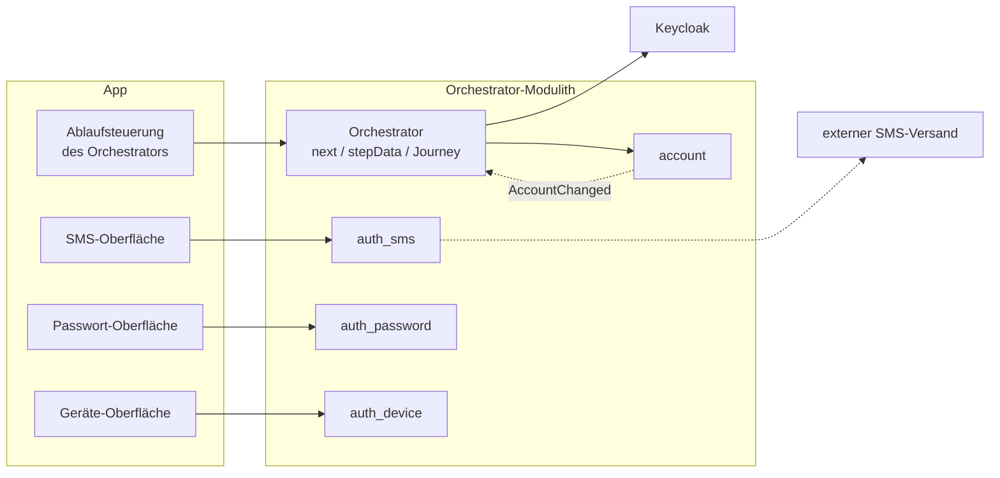

# Frontend

Dieses Kapitel beschreibt die Anforderungen an die Oberfläche der Demo und die Regel, nach der sie
von Schritt zu Schritt navigiert.

Die zugrunde liegende API beschreibt [05-api.md](05-api.md), die Erzeugung der Schlüssel
[09-dpop.md](09-dpop.md).

---

## Einstieg: Wie `next` die App steuert



Jedes Verfahren besteht auf beiden Seiten aus einer eigenen kleinen Einheit mit demselben Namen: im
Backend ein Tool-Modul, das seine Beschreibung und seinen Ablauf selbst mitbringt, in der App eine
eigene Komponente für die Oberfläche. Was die App **nicht** selbst enthält, ist die Entscheidung,
*wann* welches Verfahren an der Reihe ist. Das entscheidet allein das Backend über `next`. Die
Ablaufsteuerung in der App startet ein Tool nur darüber und übergibt dann an dessen Komponente.

Ein Tool wird dabei nur angeboten, wenn **beide** Seiten es erlauben: Die App muss es überhaupt
anzeigen können (sie meldet das beim Einstieg in den Kanal in `availableTools`), und das Backend darf
es nicht gesperrt haben. Einen Abgleich von Versionen gibt es nicht, nur diese eine Liste. So bleiben
alte Versionen der App funktionsfähig: Ein Tool, das eine App nicht kennt, wird ihr einfach nie
angeboten, statt einen Fehler auszulösen.

Zwei Ergänzungen aus der Praxis:

- Sobald ein Tool gestartet ist, spricht seine Oberfläche direkt mit dem gleichnamigen Tool im
  Backend und nicht mehr allgemein über die Ablaufsteuerung; jedes Tool bringt seine eigenen
  Endpunkte mit. Manche Tools brauchen aus technischen Gründen ohnehin ein eigenes Protokoll statt
  des üblichen Wechsels von Anfrage und Antwort (WebAuthn, Weiterleitung beim eID-Verfahren). Das
  bleibt aber auf die eine Komponente des Tools beschränkt.
- Den OIDC-Tokenfluss mit Keycloak führt für die App allein der Orchestrator; die App hat dafür keinen
  eigenen, direkten Weg. Im Backend legt ein eigenes Modul `account` die Konten an und meldet
  Änderungen als Events; der Orchestrator spiegelt sie nach Keycloak. Auch das bleibt vollständig
  hinter dem Orchestrator verborgen.

Daraus folgt für dich als Frontend-Entwickler:

- **Abläufe ändern sich, ohne dass die App angepasst werden muss.** Welche Schritte eine Journey
  verlangt und in welcher Reihenfolge, steht nur im Backend.
- **Neue Tools lassen sich leicht einbinden.** Ein neues Modul bringt seine Beschreibung mit. Die App
  braucht dafür nur eine neue Komponente in einem eigenen Ordner `tools/<name>/`. Die Registry
  findet sie selbst; ein Tabelleneintrag oder eine neue Ablaufsteuerung ist nicht nötig.
- **Die App hält fast keinen eigenen Zustand.** Sie merkt sich nur die `channelSessionId` (dauerhaft)
  und, solange ein Tool läuft, die `toolSessionId` (sie kommt aus `next`). Jeder Ablauf (Anmelden,
  Registrieren, Niveau erhöhen, Verfahren verwalten, Konto löschen) führt denselben Kanal durch
  dasselbe kleine Zustandsmodell (`ANONYMOUS` → `AUTHENTICATED` → …). Im Frontend gibt es keinen
  eigenen Zustandsautomaten je Ablauf.

---

## 0) Sechs eigenständige Apps

Das Frontend ist **keine** einzelne Single-Page-App, sondern besteht aus sechs eigenen React-Apps, jede
mit eigener HTML-Einstiegsseite und eigener URL. Gemeinsam nutzen sie nur Code wie eine Bibliothek
(Komponenten, Tools, `api.ts`, …). Jede App hat ein eigenes Farbschema (`index.css`), damit man ohne
zu lesen sieht, wo man ist:

- **Willkommen** (`/`): ohne Kanal und ohne DPoP-Schlüssel. Sie hat die Reiter *Übersicht* (Kacheln
  zu allen anderen Apps), *Begriffe & Doku* und *Server-Status*. Letzterer liest nur das öffentliche
  `GET /orchestrator/demo/server-info`: Keycloak-Profil, Reihenfolge der Registrierung, gesperrte
  Tools.
- **App-Kanal** (`/app/`): der an DPoP gebundene Ablauf des Orchestrators, ohne Reiter. Was nur diesen
  Client betrifft (Startniveau, unterstützte Verfahren), steht unter „Erweitert“. Welche Verfahren
  er darstellen kann, gibt der Client selbst an; sperren und ordnen kann sie der Betreiber je Kanal
  auf der Admin-Seite.
- **Web-Kanal** (`/web/`): der echte Ablauf mit Keycloak im Browser, ohne Reiter. Es gibt ihn nur mit
  dem Spring-Profil `keycloak`. Ohne dieses Profil zeigt `/web/` einen Hinweis statt einer Anmeldung,
  und die Kachel auf der Startseite ist ausgeschaltet. Beides liest `server-info.keycloak`, das ohne
  Profil `null` ist. Derselbe Block sagt dem Browser auch, wo Keycloak zu finden ist: öffentliche
  Adresse, Realm und beide Client-IDs. Sie stammen aus dem Parametersatz der Keycloak-Einrichtung
  (`keycloak-setup`); `webOidc.ts` hat dafür keine eigenen Konstanten mehr. Einen simulierten
  Keycloak gibt es nicht mehr.
- **Admin** (`/admin/`): die Sicht des Betreibers, hinter der Admin-Anmeldung (HTTP Basic auf
  `/orchestrator/admin/**`, `AdminSecurityConfig`). Reiter: *Einstellungen* (Verfahren je Kanal
  sperren und ordnen, Reihenfolge der Registrierung, Abgleich mit Keycloak, Links für Entwickler),
  *Journey-Trace* über alle Konten und Geräte (mit laufender Aktualisierung) und *Konten* (löschen,
  Demo zurücksetzen).
- **Personenverzeichnis** (`/personenverzeichnis/`): das simulierte **Fremdsystem** (ADR-31) mit
  Personen, Freischaltcodes und dem Briefkasten mit den Codes im Klartext. Fachlich spricht sie nur
  `/mock-personenverzeichnis/*` an. Von `/orchestrator` lädt sie nur die Texte der gemeinsamen
  Komponenten.
- **Nect-Sprungseite** (`/nect/`): der simulierte Identifizierungsdienst Nect (Online-Ausweis,
  Reisepass, EUDI-Wallet), zu dem `ident-nect` weiterleitet. Fachlich spricht sie nur `/mock-nect/*`
  an.

Die Kanäle zeigen nur, was ein Nutzer dieses Kanals sehen würde. Der Journey-Trace und alles, was die
ganze Instanz umstellt, liegt auf der Admin-Seite, und zwar über alle Konten, Geräte und Kanäle
hinweg.

Zwischen den Apps navigiert man mit **echter Browser-Navigation**, nicht über Routing im Client. Vor
und Zurück funktionieren deshalb ohne eigenen Code. Die Links der Willkommensseite zu den Kanälen
öffnen einen **benannten** Tab (`target="dpop-demo-app-kanal"` bzw. `target="dpop-demo-web-kanal"`)
statt `_blank`. So wird ein bereits offener Tab derselben Herkunft wiederverwendet. Bewusst fehlt
`rel="noopener"`, denn das würde die Wiederverwendung verhindern.

Der QR-Code bzw. Demo-Link im Web-Kanal (Abschnitt „Anmeldung im Browser per QR-Code bestätigen“ unten)
verwendet denselben Namen `dpop-demo-app-kanal`. **In der Praxis wird der Tab dort aber nicht
wiederverwendet:** Der Klick kommt dann von `https://localhost:8543` (echtes Keycloak), also von einer
anderen Herkunft als der Tab des App-Kanals (`http://localhost:8080/app/`), und Chrome öffnet (so
getestet) einen neuen Tab. Das ist beim Testen am Desktop etwas unbequem, schränkt aber nichts ein.

---

## 1) Technische Anforderungen

- **FE-1** — Das Frontend basiert auf React (aktuelle Version) und TypeScript.
  - *Kriterium:* siehe Versionstabelle in [08-projektrahmen.md](08-projektrahmen.md)
- **FE-2** — Das Frontend kann allein betrieben werden.
  - *Kriterium:* `npm run dev` startet den Entwicklungsserver von Vite; alle sechs Einstiegsseiten sind erreichbar (`/`, `/app/`, `/web/`, `/admin/`, `/personenverzeichnis/`, `/nect/`)
- **FE-3** — Das Frontend kann über Spring Boot ausgeliefert werden.
  - *Kriterium:* Ein Vite-Build mit sechs HTML-Einstiegsseiten landet in `src/main/resources/static`; `./gradlew bootRun` liefert es aus. `/app/`, `/web/`, `/admin/`, `/personenverzeichnis/` und `/nect/` werden über ausdrückliche Weiterleitungen in einem `WebMvcConfigurer` ([WebConfig.kt](../src/main/kotlin/com/example/dpop/orchestrator/api/v1/WebConfig.kt)) auf ihre `index.html` aufgelöst; die Standardauslieferung von Spring löst nur die Startseite auf
- **FE-4** — Im Entwicklungsmodus werden Anfragen an die API weitergeleitet.
  - *Kriterium:* Der Entwicklungsserver von Vite leitet `/orchestrator`, `/mock-personenverzeichnis`, `/mock-nect` und `/mock-kobil` an `http://localhost:8080` weiter, für alle Apps gleich
- **FE-5** — Das Frontend spricht ausschließlich mit dem `orchestrator`.
  - *Kriterium:* Keine direkten Aufrufe an fachliche Module. **Eine benannte Ausnahme:** `src/kobilSdk.ts` ruft den Fremddienst KOBIL (`/mock-kobil/*`) direkt auf. Auf einem echten Telefon wäre das Code des nativen SDK. Liefe der Aufruf über unser Backend, würde aus dem Fremddienst unbemerkt ein interner Aufruf, und genau diese Trennung macht das Verfahren aus ([Abläufe](06-ablaeufe.md) Abschnitt 7). Dasselbe gilt für die Seiten `/personenverzeichnis/` und `/nect/`, die die simulierten Fremdsysteme (`/mock-personenverzeichnis/*`, `/mock-nect/*`) direkt ansprechen (ADR-31)

---

## 2) Anforderungen an die Oberfläche

- **FE-6** — Übersichtliches Layout mit Karten, einheitlichem Farbschema und dunkler Darstellung.
  - *Kriterium:* Gestaltung als Karten
- **FE-7** — Formulare sind mit Testdaten vorausgefüllt.
  - *Kriterium:* Frei erfundene erste Angaben (Telefonnummer) sind im Client fest vorausgefüllt. Alles, wofür der Server einen Wert kennt (TAN, Code, Passwort, E-Mail, die Testpersonen samt Freischaltcode aus dem Briefkasten des Personenverzeichnisses), kommt über das Objekt `demo` ([API](05-api.md))
- **FE-8** — Der aktuelle Stand und der nächste Schritt werden angezeigt.
  - *Kriterium:* Anzeige aus `next` und `stepData`
- **FE-9** — Telefonnummern werden schon im Client geprüft.
  - *Kriterium:* Formatprüfung vor dem Absenden; das Backend lehnt ungültige Nummern mit `400` ab
- **FE-10** — Die Identität des Geräts und der Kanal lassen sich unabhängig voneinander zurücksetzen.
  - *Kriterium:* „Neu erzeugen“ tauscht den DPoP-Schlüssel und vergisst dabei die gemerkte `channelSessionId`, startet aber keinen Kanal. „Zur Startseite“ vergisst nur die lokal gemerkte `channelSessionId`, ohne das Backend aufzurufen. „Abmelden“ beendet den Kanal auf dem Server ([API](05-api.md), Abmelden) und legt **keinen** neuen Kanal automatisch an; der Knopf ist nur sichtbar, wenn der Kanal `AUTHENTICATED` ist
- **FE-11** — Nach erfolgreicher Anmeldung werden `accountId` und `personId` angezeigt.
  - *Kriterium:* Die Werte stammen aus dem Objekt `demo` der Antwort
- **FE-12** — Das Frontend merkt sich die `channelSessionId` dauerhaft und getrennt vom DPoP-Schlüssel, tut damit aber nichts von selbst.
  - *Kriterium:* Beim Start lädt oder erzeugt die App **nur** den DPoP-Schlüssel. Ohne aktiven Kanal wählt der Nutzer ausdrücklich: Sitzung fortsetzen (`GET`), Automatisch anmelden, Neues Konto registrieren, Neu anmelden (`lookup_login`) oder „Anmeldung im Browser per QR-Code bestätigen“ (je ein `POST` mit passendem `intent`)
- **FE-13** — Beim Anlegen eines Kanals lässt sich `requiredAcr` wählen.
  - *Kriterium:* Sonst wäre `enroll-password` in der Demo kaum erreichbar: Die Registrierung endet von selbst, sobald ein einzelnes `loa1`-Verfahren die voreingestellte Untergrenze erfüllt
- **FE-14** — Die Identität des Geräts (JWK-Thumbprint) ist sichtbar und lässt sich unabhängig vom Kanal neu erzeugen.
  - *Kriterium:* Eine eigene Karte, immer sichtbar, auch ohne aktiven Kanal. Darunter steht eine Zeile je weiterer Bindung dieses Geräts, allgemein aus `deviceLink.boundCredentials` erzeugt: Jedes Verfahren entscheidet selbst, was es zeigt, und die Karte gibt es nur aus. Ein neues an den Schlüssel gebundenes Verfahren braucht hier keine Änderung
- **FE-15** — Ein angemeldeter Kanal lässt sich gezielt auf ein höheres Sicherheitsniveau bringen (Step-up).
  - *Kriterium:* Der Knopf „Sicherheitsniveau jetzt erhöhen“ ruft `POST /channels/{channelSessionId}/step-ups` auf ([API](05-api.md)) und erscheint nur, solange `loa2` fehlt. Die API kann auch ein höheres Ziel anfordern; `ident-eid` ist das vorhandene Tool, das `loa3` erreicht
- **FE-16** — Solange ein Tool Eingaben erwartet oder der Nutzer zwischen mehreren Tools wählt, bleibt nur eine naheliegende Aktion übrig.
  - *Kriterium:* Nur „Abbrechen“ bleibt sichtbar. „Abmelden“ und die Links zum Umsteigen stehen gesammelt auf der Karte mit dem Sitzungsstatus; „Abmelden“ zusätzlich nur bei `AUTHENTICATED`
- **FE-17** — Die Liste „Anmeldeverfahren verwalten“ zeigt alle Verfahren des Kontos, nicht nur die, die diese Sitzung selbst nachgewiesen hat.
  - *Kriterium:* Sie kommt aus `activeMethods` ([API](05-api.md)), nicht aus `currentAmr`. Sonst wäre ein aktives, in dieser Sitzung nicht geprüftes Verfahren weder sichtbar noch zu verwalten. Jede Zeile nennt neben dem Namen auch das **Verfahren** selbst (`kobil`, `device`, …). Ein selbst vergebener Gerätename („Mein Handy“) sagt sonst nicht, um welches Verfahren es geht, und seit `kobil` gibt es zwei an ein Gerät gebundene
- **FE-20** — Verliert dieses Gerät seine KOBIL-Bindung, verschwinden auch die lokalen Daten dazu.
  - *Kriterium:* Die Aktualisierung von `device-link` reicht `boundCredentials` an `tools/kobil/localData.ts` weiter. Die Regel gehört dem Modul; der Rahmen der App weiß nur, dass sich Bindungen geändert haben. Das ist nötig, weil das lokale Gerätegeheimnis anders als der `device`-Schlüssel ein **Geheimnis** ist: Auf dem Server wird es wertlos, im Browser bliebe es aber liegen ([09-dpop.md](09-dpop.md) Abschnitt 3)
- **FE-19** — Beim KOBIL-Verfahren sieht der Nutzer den PIN nie, und der Schritt zum Entsperren sagt, warum.
  - *Kriterium:* Eigener Ordner `src/tools/kobil/`. `KobilEnrollForm` fragt nach einem Namen und dann „Biometrie erlauben?“; es ruft `kobilSdk.activate` auf und legt das Entsperrgeheimnis **nur bei Zustimmung** lokal ab, sonst bleibt auf beiden Seiten nichts zurück. `KobilUnlockGate` zeigt beide Wege zum Entsperren: den mit Passwort immer, den mit Biometrie nur nach Zustimmung, sonst ist der Knopf ausgeschaltet. `KobilOtpStep` läuft von selbst los und hält den freigegebenen PIN nur für die Dauer eines SDK-Aufrufs in einer lokalen Variable, nie im Zustand der App oder im Speicher des Browsers. `KobilAuthStep` enthält die einzige Entscheidung, die der Client selbst trifft: „Diese Freigabe nützt mir nichts mehr, ich entsperre erneut.“
- **FE-18** — Über einen URL-Parameter `intent` (dieselben Werte wie im Feld `intent` von `createChannel`) steigt der App-Kanal direkt in einen bestimmten Ablauf ein, auf Wunsch mit `pairingCode`. Der Zurück-Knopf des Browsers verlässt einen laufenden Vorgang und führt zur Startauswahl.
  - *Kriterium:* `AppChannelApp.tsx` liest `intent` und `pairingCode` einmal aus der URL und entfernt sie; `intent` startet den passenden Aufruf von `handleStart`. Ist ein Kanal aktiv, ruft ein `popstate`-Listener `handleClearChannel()` auf (nur lokal, ohne Backend). Ein schrittweises Rückgängigmachen gibt es nicht, weil der Server den Ablauf vorantreibt (Modell mit `next`)

### Anmeldeverfahren verwalten und Step-up (`AuthIntent.MANAGE_AUTH_METHODS`)

Nach erfolgreicher Anmeldung zeigt die Ansicht zwei getrennte Abschnitte: „Sicherheitsniveau
erhöhen“ (FE-15) und „Anmeldeverfahren verwalten“ (FE-17, `AuthIntent.MANAGE_AUTH_METHODS`,
[`MANAGE_AUTH_METHODS`](journeys/manage-auth-methods.md)). Beide landen im selben Ablauf
`STEP_UP_IN_PROGRESS` und in derselben Tool-Navigation. Sie unterscheiden sich nur darin, was sie
auslöst: `POST .../step-ups` oder eine Antwort `409` auf `POST .../methods`.

### Anmelden ohne gekoppeltes Gerät

Solange der Kanal weder `AUTHENTICATED` noch `LOGGED_OUT` ist, bietet `EntryChoiceLinks` den Wechsel
auf `intent="lookup_login"` oder `"register"` an, bewusst auch mitten in einem Ablauf mit mehreren
Schritten. Für die Anmeldung über die E-Mail-Adresse gibt es je Verfahren ein eigenes Formular (SMS,
Passwort, E-Mail). Die Eingabe der TAN bzw. des Codes teilt sich das Formular mit dem Gegenstück für
ein bekanntes Konto, weil beide denselben `next.step` verwenden.

### Anmeldung im Browser per QR-Code bestätigen (`AuthIntent.CONFIRM_PEER_LOGIN`)

Es gibt zwei gleichwertige Einstiege, weil man `CONFIRM_PEER_LOGIN` auf zwei Wegen erreicht
([Orchestrierung](04-orchestrierung.md) Abschnitt 2):

- **Startbildschirm** („Wie möchten Sie beginnen?“): ein Eintrag „Anmeldung im Browser per
  QR-Code bestätigen“ neben Automatisch anmelden, Registrieren und Neu anmelden. Er setzt ein Konto voraus,
  das auf diesem Gerät schon bekannt ist; ohne `DeviceAccountLink` bricht die Journey sofort ab.
- **Ansicht nach der Anmeldung** (`AuthenticationCompletedView`): ein Abschnitt „Anmeldung im Browser
  per QR-Code bestätigen“ mit einem Knopf, der `POST /channels/{id}/peer-logins` auslöst. Er ist für den
  Fall gedacht, dass die App schon offen und angemeldet ist, wenn der QR-Code gescannt wird.

Beide Wege führen zum selben `next` ([`CONFIRM_PEER_LOGIN`](journeys/confirm-peer-login.md)):

- Ist `loa2` noch nicht erreicht, folgt die normale Anmeldung oder ein Step-up auf `loa2`.
- Ist `loa2` bereits erreicht, aber nicht in diesem Durchlauf, muss der Nutzer zusätzlich mit einem
  beliebigen aktiven Verfahren erneut nachweisen, dass er es ist. Allein aufgrund vorhandener
  Nachweise wird nie automatisch bestätigt.

Der Demo-Link der Web-Seite zeigt auf `/app/?intent=confirm_peer_login&pairingCode=...`, also direkt
auf den App-Kanal. `intent` hat dieselben Werte wie das Feld `intent` von `createChannel`
(`AuthIntent.fromRequest`, Groß- und Kleinschreibung egal). Beide Parameter werden beim Laden aus der
URL gelesen und sofort entfernt. `intent=confirm_peer_login` startet denselben Ablauf wie der Knopf
„Anmeldung im Browser per QR-Code bestätigen“. Ein bekannter Kanal wird dabei zuerst geladen; ist er
`AUTHENTICATED`, läuft die Bestätigung über ihn. Den `pairingCode` merkt sich die App lokal
(`pendingPairingCode`), damit der Schritt `input` von `confirm-qr-login` ihn vorausfüllt.

---

## 3) Navigation ausschließlich über `next`

Das Frontend nutzt eine **feste Zuordnung im Client**: eine Routing-Tabelle für die Bildschirme des
Orchestrators und eine Tool-Registry für die Schritte der Tools. Welche Oberfläche es zeigt,
entscheidet es ausschließlich anhand von `next`, nie anhand von URLs, Namen von Aktionen oder eigenen
Schlüssen aus dem Zustand der Sitzung.

- **Das Backend liefert** `next.type` (`tool` oder `orchestrator`: wem der nächste Bildschirm gehört
  und welchen Endpunkt der Client aufruft), dazu `next.toolId` bzw. `next.context` und `next.step`.
  Auswahlmöglichkeiten stehen in `stepData.options`, fehlende Felder in `stepData.missingFields`.
- **Das Frontend entscheidet** über die Bildschirme des Orchestrators mit der Tabelle in `routing.ts`
  (Schlüssel `(context, step)`). Über die Schritte der Tools entscheidet `tools/registry.ts`: Jedes
  Tool bringt in `tools/<name>/index.tsx` sein `render(ctx)` für jeden `step` mit, und die Registry
  findet es über `import.meta.glob`. Ein Muster in der URL spielt nie eine Rolle.
- Der Client baut eine `toolId` **nie** selbst zusammen. Sie kommt entweder aus `next.toolId` oder
  als gewählter Eintrag aus `stepData.options`.

Die Bildschirme des Orchestrators (`routing.ts`, vollständig):

```
registration   / selectIdentificationMethod -> select-method
enrollment     / selectMethod               -> select-method
auth           / selectMethod               -> select-method
authentication / authenticated              -> authentication-completed
prompt         / confirm                    -> prompt
```

Beispiel für den Schritt eines Tools: `tools/fsc/index.tsx` zeigt für `ident-fsc` bei `step = input`
das Formular `IdentFscForm`.

Auf einer Auswahlseite (`selectMethod`) füllt das Frontend die Auswahl aus `stepData.options`; die
Einträge sind vollständige `toolId`-Werte. `SelectMethodView` macht daraus Auswahlkarten und holt
dafür Symbol, Kurzname und Erklärung aus dem `meta` des jeweiligen Tool-Moduls (`metaFor`). Die
gewählte `toolId` geht unverändert weiter.

Ein `next.step` benennt eine fachliche Phase, keinen Bildschirm. Wie viele Bildschirme ein Tool
daraus macht, entscheidet das Frontend anhand von `stepData.missingFields` und `PATCH`-Anfragen mit
einem Teil der Felder. Ein zusätzlicher Bildschirm, der dieselben Daten braucht, erfordert deshalb
keine Änderung im Backend. Beispiel `ident-fsc`: Es hat einen Schritt `input`, im Frontend aber zwei
Bildschirme (erst die Personendaten, dann der Freischaltcode).

Die Folgen: Alle URLs des Backends bleiben ein Detail der Umsetzung. Ein neues Tool braucht nur einen
eigenen Ordner `tools/<name>/`; die Registry findet es selbst, ein Tabelleneintrag ist nicht nötig.
Auch die eigenen Endpunkte eines Tools ([API](05-api.md), Bereich der Tools) findet der Client über
`(toolId, step)`.

Zwei Ausnahmen verletzen diese Regel **nicht**, weil sie nur eine Aktion auslösen und nie
entscheiden, welche Komponente angezeigt wird: Der Wechsel zwischen den Apps (Abschnitt 0) ist echte
Browser-Navigation. Und der URL-Parameter `intent` beim Einstieg in den App-Kanal (FE-18) wird einmal
in einen Aufruf von `handleStart` übersetzt.
