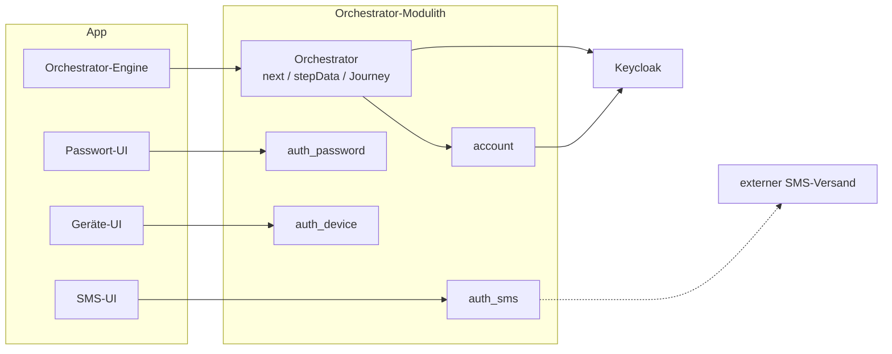

# Frontend

Anforderungen an die Demo-Oberfläche und die Regel, nach der sie navigiert.

Die zugrundeliegende API beschreibt [05-api.md](05-api.md), die Schlüsselerzeugung
[09-dpop.md](09-dpop.md).

---

## Einstieg: Wie `next` die App steuert



Jedes Verfahren hat auf beiden Seiten eine eigene, gleichnamige, kleine Einheit: im Backend ein
Tool-Modul, das seine Beschreibung und seinen Ablauf selbst mitbringt; in der App eine eigene
UI-Komponente dafür. Was die App **nicht** selbst hat, ist die Logik, *wann* welches Verfahren
dran ist — das entscheidet ausschließlich das Backend über `next`; die Orchestrator-Engine
startet ein Tool nur darüber und übergibt dann an dessen UI-Komponente.

Ein Tool wird der Journey dabei nur angeboten, wenn es **beide** Seiten erlauben: die App muss es
überhaupt rendern können (`availableTools`, beim Kanaleinstieg gemeldet), und das Backend darf es
nicht gesperrt haben — kein Versions-Handshake, nur diese eine Liste. Das hält alte
App-Versionen funktionsfähig: ein Tool, das eine App nicht kennt, wird ihr schlicht nie
angeboten, statt zu einem Fehler zu führen.

Zwei Ergänzungen aus der Praxis:

- Ab dem Start spricht die Tool-UI direkt mit ihrem gleichnamigen Backend-Tool, nicht mehr
  generisch über die Orchestrator-Engine — jedes Tool bringt seine eigenen Endpunkte mit. Manche
  brauchen dafür aus technischen Gründen ohnehin ein eigenes Protokoll statt des üblichen
  Anfrage/Antwort-Schemas (WebAuthn, eID-Redirect), bleiben aber auf diese eine UI-Komponente
  begrenzt.
- Den OIDC-Tokenfluss gegen Keycloak führt ausschließlich der Orchestrator — dafür gibt es in
  der App keinen eigenen, direkten Weg. Ein eigenes `account`-Modul im Backend legt Accounts an
  und hält sie mit Keycloak synchron; auch das bleibt vollständig hinter dem Orchestrator
  verborgen.

Daraus folgt für dich als Frontend-Entwickler:

- **Abläufe ändern sich, ohne dass die App angepasst werden muss** — welche Schritte eine
  Journey verlangt und in welcher Reihenfolge, steht nur im Backend.
- **Neue Tools lassen sich einfach integrieren** — ein neues Modul bringt seine Beschreibung
  mit; die App braucht dafür eine neue UI-Komponente plus einen Eintrag in der
  Routing-Tabelle, aber keine neue Ablaufsteuerung.
- **Die App hält praktisch keinen eigenen Zustand** — nur die `channelSessionId` (dauerhaft)
  und, solange ein Tool läuft, die `toolSessionId` (kommt aus `next`). Jeder Ablauf (Login,
  Registrierung, Niveau anheben, Verfahren verwalten, Account löschen) bewegt denselben Kanal
  durch dasselbe kleine Zustandsmodell (`ANONYMOUS` -> `AUTHENTICATED` -> ...) — kein eigener
  State-Automat pro Ablauf im Frontend.

---

## 0) Drei eigenständige Apps

Das Frontend ist **kein** einzelnes SPA, sondern drei eigene React-Apps mit eigenem
HTML-Entry-Point/URL, die sich Code (Komponenten, Tools, `api.ts`, ...) nur als gemeinsame
Bibliothek teilen:

- **Willkommen** (`/`) — statisch, keine Channel-Logik, kein DPoP-Key; Links zu den beiden Kanälen.
- **App-Kanal** (`/app/`) — der DPoP-gebundene Orchestrator-Ablauf mit eigenen
  Demo/Journey-Log/Einstellungen-Tabs.
- **Web-Kanal** (`/web/`) — der echte Keycloak-Browser-Ablauf mit eigenen
  Demo/Mock-Keycloak/Journey-Log/Einstellungen-Tabs.

Journey-Log und Einstellungen leben jeweils **im eigenen Kanal**, nicht bei Willkommen und nicht
als vierte App — beide Ansichten hängen am jeweiligen Kanal-Kontext (DPoP-Channel bzw.
Keycloak-Tokens).

Navigation zwischen den drei Apps ist **echte Browser-Navigation**, kein Client-Routing — Back/
Forward funktionieren dafür ohne eigenen Code. Willkommens Links zu den Kanälen öffnen einen
**benannten** Tab (`target="dpop-demo-app-kanal"`/`target="dpop-demo-web-kanal"`, bewusst ohne
`rel="noopener"`, das die Wiederverwendung verhindern würde) statt `_blank` — innerhalb derselben
Origin wird damit ein bereits offener Tab wiederverwendet.

Der WEB-Kanal-QR-/Demo-Link (Abschnitt "Web-Login per QR bestätigen" unten) verwendet denselben
Namen `dpop-demo-app-kanal`, **erreicht die Wiederverwendung aber in der Praxis nicht**: der
klickende Kontext liegt dann auf `https://localhost:8543` (echtes Keycloak), einer anderen Origin
als der App-Kanal-Tab (`http://localhost:8080/app/`), und Chrome öffnet — so getestet — einen
neuen Tab. Das ist ein Komfort-Manko beim Desktop-Testen, keine Funktionseinschränkung.

---

## 1) Technische Anforderungen

| ID | Anforderung | Kriterium |
|----|-------------|-----------|
| FE-1 | Frontend auf Basis von React (aktuelle Version) und TypeScript. | siehe Versionstabelle in [08-projektrahmen.md](08-projektrahmen.md) |
| FE-2 | Das Frontend kann autark betrieben werden. | `npm run dev` startet den Vite-Dev-Server, alle drei Entry-Points erreichbar (`/`, `/app/`, `/web/`) |
| FE-3 | Das Frontend kann über Spring Boot gehostet werden. | Ein Vite-Build mit drei HTML-Entry-Points nach `src/main/resources/static`; `./gradlew bootRun` liefert es aus. `/app/`/`/web/` werden über explizite `WebMvcConfigurer`-Forwards ([WebConfig.kt](../src/main/kotlin/com/example/dpop/orchestrator/api/v1/WebConfig.kt)) auf ihre `index.html` aufgelöst — der Default-Resource-Handler löst nur den Root-Fall |
| FE-4 | Im Entwicklungsmodus werden API-Requests weitergeleitet. | Vite-Dev-Server proxyt `/orchestrator` nach `http://localhost:8080`, für alle drei Apps gleichermaßen |
| FE-5 | Das Frontend kommuniziert ausschließlich über den `orchestrator`. | Keine direkten Aufrufe an fachliche Module. **Eine benannte Ausnahme:** `src/kobilSdk.ts` ruft den Fremddienst KOBIL (`/mock-kobil/*`) direkt auf — auf einem echten Telefon wäre das nativer SDK-Code, und den Aufruf durch unser Backend zu leiten würde aus dem Fremddienst unbemerkt einen internen Aufruf machen. Genau diese Trennung ist der Punkt des Verfahrens ([Abläufe](06-ablaeufe.md) Abschnitt 7) |

---

## 2) UI-Anforderungen

| ID | Anforderung | Kriterium |
|----|-------------|-----------|
| FE-6 | Übersichtliches Layout mit Karten, konsistentem Farbschema und Darkmode. | visuelle Gestaltung als Karten |
| FE-7 | Formulare sind mit Testdaten vorbelegt. | Frei erfundene Erstangaben (`ident-fsc`, Telefonnummer) clientseitig fest vorbelegt; alles, wofür der Server einen Wert kennt (TAN/Code/Passwort/E-Mail), kommt über das `demo`-Objekt ([API](05-api.md)) |
| FE-8 | Der aktuelle Stand und der nächste Schritt werden dargestellt. | Anzeige aus `next` und `stepData` |
| FE-9 | Telefonnummern werden clientseitig vorvalidiert. | Formatprüfung vor dem Absenden; das Backend lehnt ungültige Nummern mit `400` ab |
| FE-10 | Geräte-Identität und Kanal lassen sich unabhängig voneinander zurücksetzen. | „Neu erzeugen" tauscht nur den DPoP-Key, startet aber keinen Kanal. „Leeren" vergisst nur die lokal gemerkte `channelSessionId`, ohne Backend-Aufruf. Logout beendet den Kanal serverseitig ([API](05-api.md), Logout) und legt **keinen** neuen Kanal automatisch an — nur sichtbar, wenn der Kanal `AUTHENTICATED` ist |
| FE-11 | Nach erfolgreicher Anmeldung werden `accountId` und `personId` angezeigt. | Werte stammen aus dem `demo`-Objekt der Antwort |
| FE-12 | Das Frontend merkt sich `channelSessionId` dauerhaft, getrennt vom DPoP-Key — es passiert aber nichts automatisch. | Der Init-Effekt lädt/erzeugt **ausschließlich** den DPoP-Key; ohne aktiven Kanal wählt der Nutzer explizit zwischen Fortsetzen (`GET`), Verbinden, Login ohne DPoP oder Registrieren (je ein `POST` mit passendem `intent`) |
| FE-13 | Beim Anlegen eines Kanals lässt sich `requiredAcr` wählen. | Sonst wäre `enroll-password` in der Demo praktisch unerreichbar: Die Registrierung schließt automatisch ab, sobald ein einzelnes `loa1`-Mittel die Standard-Untergrenze erfüllt |
| FE-14 | Die Geräte-Identität (JWK-Thumbprint) ist sichtbar und lässt sich unabhängig vom Kanal neu erzeugen. | Eigene Karte, immer sichtbar, auch ohne aktiven Kanal. Darunter eine Zeile je weiterer Bindung dieses Geräts, generisch aus `deviceLink.boundCredentials` gerendert: jede Methode entscheidet selbst, was sie offenlegt, die Karte druckt es nur — ein neues schlüsselgebundenes Verfahren braucht hier keine Änderung |
| FE-15 | Ein authentifizierter Kanal lässt sich gezielt auf ein höheres Sicherheitsniveau anheben (Step-up). | Der UI-Button „Auf loa2 anheben" ruft `POST /channels/{channelSessionId}/step-ups` ([API](05-api.md)) auf und erscheint nur, solange loa2 fehlt. Die API kann auch ein höheres Ziel anfordern; `ident-eid` ist dafür das vorhandene `loa3`-fähige Tool. |
| FE-16 | Solange ein Tool aktiv Eingaben erwartet — oder der Nutzer zwischen mehreren Tools wählt —, wird auf eine einzige naheliegende Aktion reduziert. | Nur „Abbrechen" bleibt sichtbar; Logout und Umstiegs-Links sind an der Session-Status-Karte gruppiert, Logout zusätzlich nur wenn `AUTHENTICATED` |
| FE-17 | Die „Anmeldeverfahren verwalten"-Liste zeigt den vollständigen Methodenbestand des Kontos, nicht nur das, was diese Sitzung selbst nachgewiesen hat. | Kommt aus `activeMethods` ([API](05-api.md)), nicht aus `currentAmr` — sonst wäre eine aktive, in dieser Sitzung ungeprüfte Methode weder sichtbar noch verwaltbar. Jede Zeile nennt neben dem Namen auch die **Methode** selbst (`kobil`, `device`, …): ein selbst vergebener Gerätename („Mein Handy") sagt sonst nicht, um welches Verfahren es sich handelt — und seit `kobil` gibt es zwei gerätegebundene |
| FE-20 | Verliert dieses Gerät seine KOBIL-Bindung, verschwinden auch die lokalen Daten dazu. | Der Effekt hinter `device-link` reicht `boundCredentials` an `tools/kobil/localData.ts` — die Regel gehört dem Modul, der Rahmen der App weiß nur, dass sich Bindungen geändert haben. Nötig, weil das lokale Gerätegeheimnis anders als der `device`-Schlüssel ein **Geheimnis** ist: Serverseitig wird es wertlos, im Browser würde es trotzdem liegen bleiben ([09-dpop.md](09-dpop.md) Abschnitt 3) |
| FE-19 | Beim KOBIL-Verfahren bekommt der Nutzer den PIN nie zu sehen, und der Entsperrschritt sagt, warum. | Eigener Ordner `src/tools/kobil/`: `KobilEnrollForm` (Name, dann die Zustimmungsfrage „Biometrie erlauben?"; ruft `kobilSdk.activate` und legt das Unlock-Secret **nur bei Zustimmung** lokal ab — sonst bleibt auf beiden Seiten nichts zurück), `KobilUnlockGate` zeigt beide Entsperrwege; den Passwort-Weg gibt es immer, den Biometrie-Weg nur nach Zustimmung — sonst ist der Knopf deaktiviert. `KobilOtpStep` läuft von selbst los und hält den freigegebenen PIN nur für die Dauer eines SDK-Aufrufs in einer lokalen Variable, nie im State oder Storage. `KobilAuthStep` trägt die einzige clientseitige Entscheidung: „diese Freigabe nützt mir nichts mehr, ich entsperre erneut" |
| FE-18 | Der App-Kanal lässt sich per URL mit einem `intent`-Query-Parameter (dieselben Werte wie im `intent`-Feld von `createChannel`) direkt in einen bestimmten Ablauf einsteigen, optional mit `pairingCode`. Der Back-Button verlässt einen laufenden Vorgang auf die Startauswahl zurück. | `AppChannelApp.tsx`: `intent`/`pairingCode` werden einmalig aus der URL gelesen und entfernt, `intent` startet den passenden `handleStart`-Aufruf. Ein `popstate`-Listener ruft bei aktivem Channel `handleClearChannel()` (lokal, kein Backend-Call) — kein Schritt-für-Schritt-Undo, der Ablauf ist serverseitig vorwärtsgetrieben (next-Modell) |

### Anmeldeverfahren verwalten & Step-up (AuthIntent.MANAGE_AUTH_METHODS)

Nach erfolgreicher Anmeldung zeigt die Ansicht zwei getrennte Abschnitte: „Sicherheitsniveau erhöhen" (FE-15) und „Anmeldeverfahren verwalten" (FE-17, `AuthIntent.MANAGE_AUTH_METHODS`, [Orchestrierung](04-orchestrierung.md) Abschnitt 3). Beide enden in derselben `STEP_UP_IN_PROGRESS`-Mechanik und Tool-Navigation — nur der Auslöser unterscheidet sich (`POST .../step-ups` vs. ein `409` bei `POST .../methods`).

### Login ohne DPoP

`EntryChoiceLinks` bietet, solange der Kanal weder `AUTHENTICATED` noch `LOGGED_OUT` ist, den Wechsel auf `intent="lookup_login"`/`"register"` an — bewusst auch mitten in einem mehrstufigen Ablauf. Für den Lookup-Login existiert je Methode ein eigenes Formular (SMS/Passwort/E-Mail); die Bestätigungseingabe (TAN/Code) teilt sich das Formular mit dem geräte-gebundenen Pendant, da beide denselben `next.step` nutzen.

### Web-Login per QR bestätigen (AuthIntent.CONFIRM_PEER_LOGIN)

Zwei gleichwertige Einstiege, passend zu `CONFIRM_PEER_LOGIN`s doppelter Erreichbarkeit
([Orchestrierung](04-orchestrierung.md) Abschnitt 2/3):

- **Startbildschirm** („Wie möchten Sie starten?"): ein Eintrag „Web-Login per QR bestätigen" neben
  Automatisch/Registrieren/Neu anmelden. Setzt ein auf diesem Gerät bereits bekanntes Konto
  voraus — ohne `DeviceAccountLink` bricht die Journey sofort ab.
- **Authentifizierte Ansicht** (`AuthenticationCompletedView`): ein Abschnitt „Web-Login per QR
  bestätigen" mit Button, der `POST /channels/{id}/peer-logins` auslöst — für den Fall, dass die
  App schon offen und angemeldet ist, wenn der QR-Code gescannt wird.

Beide Wege laufen auf denselben `next` hinaus (loa2 nicht erreicht → normaler loa2-Login/Step-up;
loa2 bereits erreicht, aber unabhängig von diesem Durchlauf → ein zusätzlicher Re-Proof mit einem
beliebigen aktiven Faktor — keine automatische Bestätigung nur auf Basis vorhandener Nachweise;
[Orchestrierung](04-orchestrierung.md) `CONFIRM_PEER_LOGIN`). Der Demo-Link der Web-Seite zeigt auf
`/app/?intent=confirm_peer_login&pairingCode=...` — direkt der App-Kanal, `intent` mit denselben
Werten wie im `intent`-Feld von `createChannel` (`AuthIntent.fromRequest`, Groß-/Kleinschreibung
egal).
Beide Parameter werden beim Laden aus der URL gelesen und sofort entfernt;
`intent=confirm_peer_login` startet denselben Ablauf wie der Button „Web-Login per QR bestätigen"
— ein bekannter Channel wird zuerst geladen, ist er `AUTHENTICATED`, läuft die Bestätigung darüber.
`pairingCode` wird lokal gemerkt (`pendingPairingCode`), damit `confirm-qr-login`s `input`-Schritt
ihn vorbefüllt.

---

## 3) Navigation ausschließlich über `next`

Das Frontend nutzt eine **feste lokale Routing-Tabelle** und trifft UI-Entscheidungen
ausschließlich anhand von `next` — nie anhand von URLs, Action-Namen oder eigener Ableitung aus
dem Sessionzustand.

- **Backend liefert**: `next.type` (`tool` oder `orchestrator` — wem der nächste Screen gehört und welchen Endpunkt der Client ruft), dazu `next.toolId` bzw. `next.context` sowie `next.step`. Auswahloptionen stehen in `stepData.options`, fehlende Felder in `stepData.missingFields`.
- **Frontend entscheidet**: Eine lokale Routing-Tabelle (`routing.ts`), Schlüssel `(type, toolId|context, step)`, bildet das auf eine UI-Komponente ab — nie auf ein URL-Muster.
- Der Client konstruiert **niemals** eine `toolId` selbst; sie kommt entweder aus `next.toolId` oder als gewählter Eintrag aus `stepData.options`.

Beispiel (Ausschnitt):

```
ident-fsc  / input     -> FscForm
enroll-sms / enroll    -> SmsEnrollForm
enroll-sms / tanInput  -> TanInputForm
auth-sms   / auth      -> TanInputForm
...
enrollment / selectMethod   -> EnrollmentMethodSelection
authentication / authenticated -> AuthenticationCompleted
```

Bei einer Auswahlseite (`selectMethod`) füllt das Frontend die Auswahl aus `stepData.options`; die Einträge sind vollständige `toolId`-Werte. `SelectMethodView` übersetzt sie über eine rein darstellungsbezogene Tabelle (Icon, Kurzlabel, Erklärung) in Auswahlkarten; die gewählte `toolId` geht unverändert weiter.

Konsequenzen: Alle Backend-URLs bleiben Implementierungsdetail; ein neues Tool braucht nur einen weiteren Eintrag in der Routing-Tabelle; auch tool-eigene Endpunkte ([API](05-api.md), Tool-Namespace) findet der Client über `(toolId, step)`.

Zwei Ausnahmen sind **kein** Bruch dieser Regel, weil sie nur eine Aktion auslösen und nie
entscheiden, welche Komponente gerendert wird: App-zu-App-Wechsel (Abschnitt 0) ist echte
Browser-Navigation; der `intent`-Query-Parameter beim App-Kanal-Einstieg (FE-18 unten) übersetzt
sich einmalig in einen `handleStart`-Aufruf.
