# State-Diagramme für alle Intents/Journeys

Zielgruppe: Fachexpertinnen/Fachexperten
Darstellung: bewusst fachnah und vereinfacht, ohne interne Klassen-/Variablennamen. Die
Diagramme zeigen die **Form** jeder Journey; alle fachlichen Regeln stehen als Text daneben,
nicht als Beschriftung an jeder Kante.

## Legende

- **Start**: Einstieg in die Journey.
- **Abschluss**: Journey erreicht ihr Ziel und endet erfolgreich.
- **Abbruch** (`[*]` ohne "Abschluss"): Journey endet ohne Erfolg (z. B. abgelehnt, keine Option mehr).
- **Sub-Journey**: eigenständiger Unterprozess, den eine Journey aufruft und auf dessen Ergebnis sie wartet
  (z. B. Step-up oder Re-Identifizierung) - in den Diagrammen als eigener Kasten mit dem Zusatz
  "(Sub-Journey ...)" markiert.

## Sub-Journeys im Überblick: wer nutzt wen, und warum

| Journey | nutzt als Sub-Journey | Warum |
|---|---|---|
| `FAST_ACCESS` | `REGISTER` | Kein Konto auf diesem Gerät bekannt - Identifikation ist nie FAST_ACCESS' eigene Aufgabe, die übernimmt ausschließlich REGISTER. |
| `FAST_ACCESS` | `RE_IDENTIFY` | Keine weitere Einrichtung mehr möglich, aber die Person könnte sich stattdessen frisch identifizieren. |
| `REGISTER` (beide Varianten) | `RE_IDENTIFY` | Gleicher Grund wie oben: letzte Option, wenn Einrichtung allein nicht mehr weiterhilft (bzw. am Ende der "Enrollment zuerst"-Variante als freiwilliges Angebot). |
| `LOOKUP_LOGIN` | `RE_IDENTIFY` | Kein Faktor mehr kombinierbar, um das geforderte Niveau zu erreichen. |
| `STEP_UP` | `RE_IDENTIFY` | Standardmäßig erlaubt - **außer** ein Aufrufer sperrt es ausdrücklich (siehe `CONFIRM_PEER_LOGIN`). |
| `MANAGE_AUTH_METHODS` | `STEP_UP` | Muss vor jedem Hinzufügen/Entfernen frisch loa2 nachweisen - ein nur schwach bewiesenes Konto darf sich nicht selbst aufwerten (dieselbe Anti-Eskalations-Logik wie ADR-5, "dreifache Deckelung"). |
| `DELETE_ACCOUNT` | `STEP_UP` | Gleicher Sicherheits-Check wie bei `MANAGE_AUTH_METHODS`, bevor ein Konto endgültig gelöscht wird. |
| `CONFIRM_PEER_LOGIN` | `STEP_UP` (mit gesperrter Re-Identifizierung) | Gleicher Sicherheits-Check - aber eine Peer-Bestätigung darf niemandem unterwegs eine neue Identität verschaffen, nur um einen fremden Login abzunicken. |

`RE_IDENTIFY` selbst hat **keinen eigenen Einstieg** - niemand startet es direkt. Es ist der eine
gemeinsame Baustein, den fünf andere Journeys (direkt: `FAST_ACCESS`, `REGISTER`, `LOOKUP_LOGIN`,
`STEP_UP`; transitiv über `STEP_UP`: `MANAGE_AUTH_METHODS`, `DELETE_ACCOUNT`) für dieselbe Frage
nutzen: *"Keine vorhandene Methode reicht - stattdessen neu identifizieren?"* Eine einzige,
geteilte Journey stellt sicher, dass es nur einen Ort gibt, an dem entschieden wird, was eine
frische Identifikation bedeuten darf (siehe eigener Abschnitt unten).

---

## 1) Schneller Einstieg auf einem bekannten Gerät (`FAST_ACCESS`)

Für Nutzerinnen und Nutzer, die sich mit diesem Gerät schon einmal angemeldet haben. Versucht,
ohne Umwege zurück ins Konto zu kommen, und richtet bei Bedarf gleich ein Verfahren ein, das
nächstes Mal noch schneller geht.

**Regeln:**
- Bevorzugt das eine Verfahren, das an dieses Gerät gebunden ist; erst wenn das abgelehnt wird,
  kommt die volle Methodenauswahl.
- Ist gar kein Konto bekannt, übernimmt `REGISTER` als Vorbedingung - FAST_ACCESS identifiziert nie selbst.
- Reicht der Nachweis nicht für das geforderte Niveau, wird ein weiteres Verfahren eingerichtet,
  nicht neu identifiziert.
- Erst wenn keine Einrichtung mehr möglich ist, kommt die Re-Identifizierung als letzte Option.

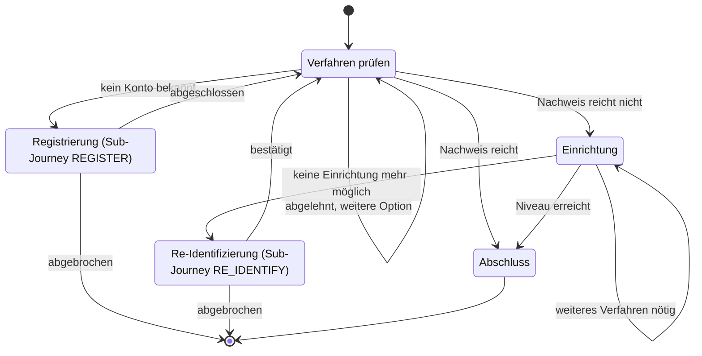

---

## 2) Neues Konto registrieren (`REGISTER`)

Führt zu einem vollständig eingerichteten, ausreichend abgesicherten Konto. Existiert in **zwei
austauschbaren Varianten**, die sich nur in der Reihenfolge unterscheiden - ein Feature-Flag
entscheidet einmal pro neu gestarteter Journey, welche läuft; eine bereits laufende wechselt nie
mitten drin.

### Variante A: Identifikation zuerst (Status quo)

**Regeln:**
- Wird auf diesem Gerät bereits ein anderes Konto erkannt, muss die Umbindung erst bestätigt
  werden, bevor irgendetwas anderes passiert.
- Eine wiedergefundene Person mit bereits ausreichendem Konto wird einfach angemeldet, nicht neu eingerichtet.
- Pflichtreihenfolge der Einrichtung: erst ein ausreichendes Anmeldeverfahren, dann bestätigte
  E-Mail, dann (nur im Web-Kanal) ein Passwort.

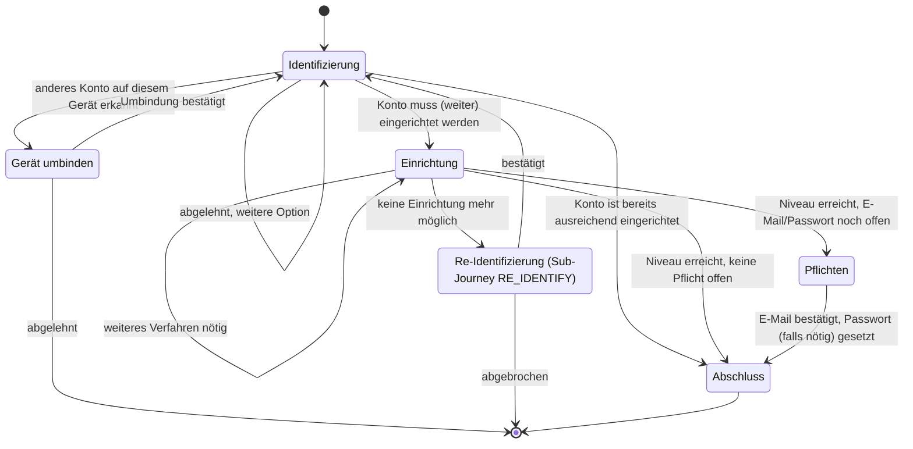

### Variante B: Enrollment zuerst (Experiment)

**Regeln:**
- Kein Konto nötig, um zu starten - es entsteht erst beim ersten abgeschlossenen Verfahren.
- Dieselbe Pflichtreihenfolge wie oben (Verfahren → E-Mail → Web-Passwort), aber ohne vorherige Identifikation.
- Am Ende wird Identifikation **einmalig angeboten, nie erzwungen**; bei Ablehnung bleibt das
  Konto dauerhaft unidentifiziert und ist trotzdem angemeldet.
- Identifiziert sich dabei eine Person, die schon ein anderes Konto hat, bricht die Registrierung
  mit Fehlermeldung ab - es wird nichts zusammengeführt.

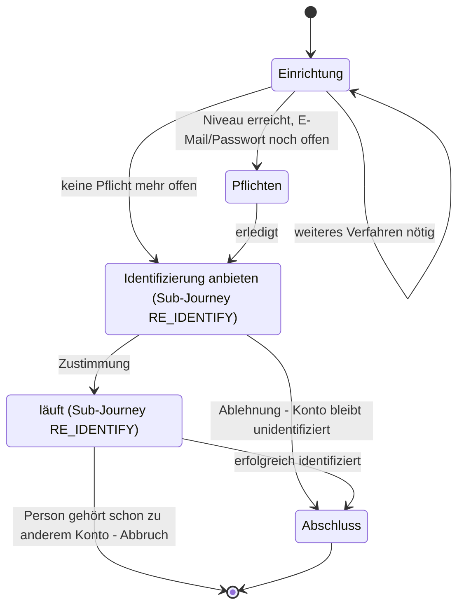

---

## 3) Anmelden ohne dieses Gerät (`LOOKUP_LOGIN`)

Klassischer Web-Login: für Nutzerinnen und Nutzer an einem fremden oder neuen Gerät, die sich mit
Zugangsdaten anmelden wollen, ohne das Gerät dauerhaft zu verknüpfen.

**Regeln:**
- Das erste Verfahren muss das Konto selbst finden (z. B. per E-Mail); jedes weitere prüft nur
  noch gegen dasselbe, bereits gefundene Konto.
- Reicht das Niveau nicht, kommt ein Zusatzfaktor - **nie** eine neue Einrichtung: ein noch nicht
  bewiesenes Konto darf hier keine neuen Verfahren bekommen.
- Ist kein Faktor mehr kombinierbar, hilft nur noch Re-Identifizierung.
- Am Ende wird die Gerätebindung angeboten (freiwillig); ist das Gerät schon einem anderen Konto
  zugeordnet, muss die Umbindung erst bestätigt werden.

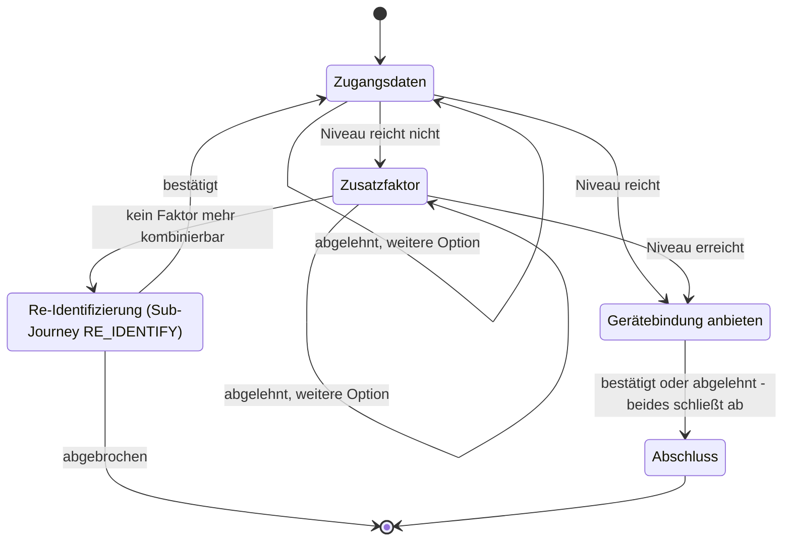

---

## 4) Web-Kanal-Login: Verfahren wählen (`KC_SELECT_METHOD`)

Der technische Einstiegspunkt für den Web-Kanal - sowohl für den ersten Login als auch für einen
Step-up, den Keycloaks eigener Flow anfordert.

**Regeln:**
- Zeigt immer alle nutzbaren Verfahren auf einmal, ohne Vorprüfung, ob sie reichen - Keycloaks
  eigener Ablauf entscheidet das.
- Kein Konto bekannt: nur Verfahren, die das Konto selbst finden können. Konto bekannt (Step-up):
  nur Verfahren für genau dieses Konto.
- Bietet **nie** Identifikation und **nie** eine Neu-Einrichtung an - der Web-Kanal beweist
  ausschließlich eine schon bestehende Identität.

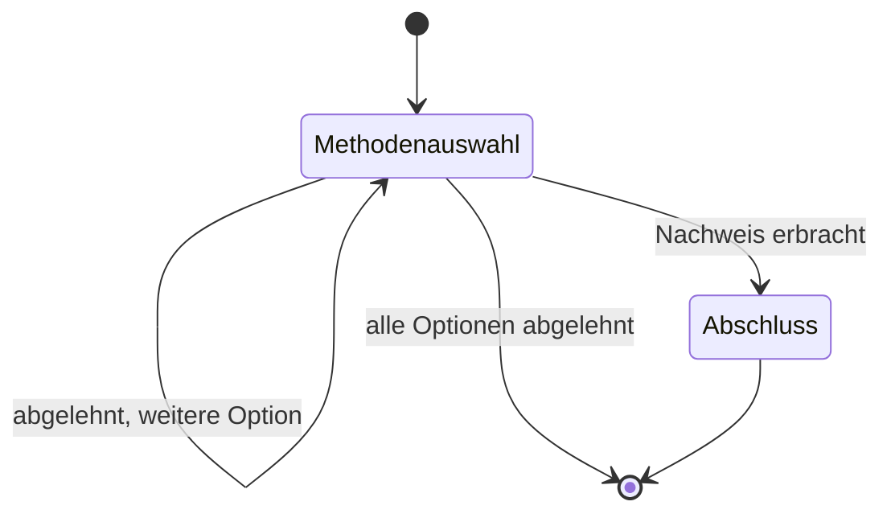

---

## 5) Sicherheitsniveau anheben (`STEP_UP`)

Für einen bereits angemeldeten Kanal, der für die aktuelle Aktion ein höheres Niveau braucht
(z. B. loa2), ohne sich komplett neu anzumelden.

**Regeln:**
- Bietet nur Verfahren an, die zum bereits bekannten Konto gehören - nie eine neue Identität.
- Reicht kein aktives Verfahren aus, wird gefragt, ob stattdessen erneut identifiziert werden
  soll - das ist standardmäßig erlaubt, kann von einem Aufrufer aber ausdrücklich gesperrt werden
  (siehe `CONFIRM_PEER_LOGIN`).
- Wird diese Rückfrage abgelehnt, bricht die Journey ab, statt es endlos erneut zu versuchen.

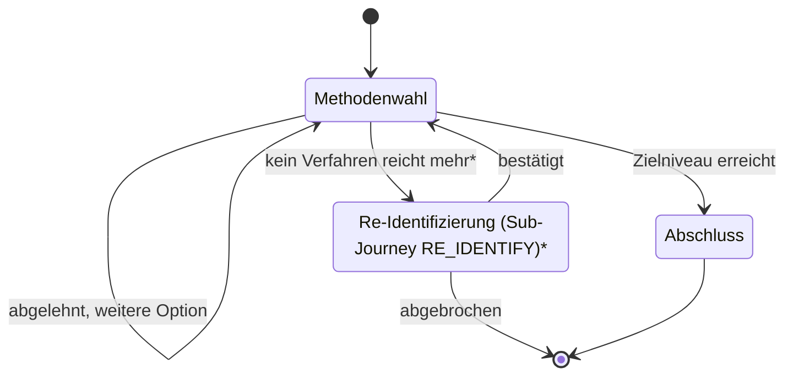

* nur wenn der Aufrufer Re-Identifizierung erlaubt - `CONFIRM_PEER_LOGIN` sperrt diesen Zweig
ausdrücklich; dort endet der Zweig stattdessen im Abbruch.

---

## 6) Anmeldeverfahren verwalten (`MANAGE_AUTH_METHODS`)

Für angemeldete Nutzerinnen und Nutzer, die ein Verfahren ergänzen oder ein bestehendes entfernen wollen.

**Regeln:**
- Beide Aktionen verlangen zuerst einen frischen Nachweis auf loa2 der aktuellen Sitzung - ein
  nur schwach bewiesenes Konto darf sich nicht selbst aufwerten (dieselbe Anti-Eskalations-Logik
  wie ADR-5, "dreifache Deckelung").
- Der ursprüngliche Wunsch (hinzufügen/entfernen) bleibt geparkt, während dieser Sicherheits-Check
  läuft, und wird danach automatisch fortgesetzt.
- Genau EIN erfolgreich eingerichtetes Verfahren beendet die Journey - der Kanal war ja schon angemeldet.
- Wird der Sicherheits-Check abgelehnt, bricht die ganze Journey ab statt endlos erneut zu fragen.

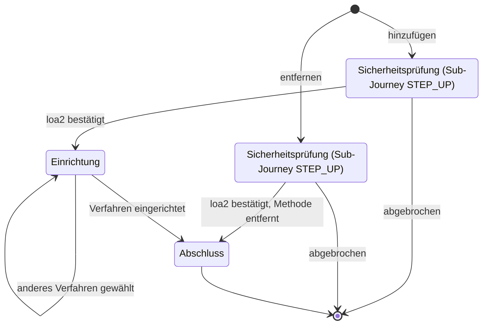

---

## 7) Web-Login per QR aus der App bestätigen (`CONFIRM_PEER_LOGIN`)

Ein schon offenes, angemeldetes App-Gerät bestätigt einen Login-Versuch im Browser (QR-Code).

**Regeln:**
- Ist auf diesem Gerät gar kein Konto bekannt, bricht sofort ab - es gibt keinen Rückfall auf
  Registrierung oder Identifikation.
- Auch hier muss die Sitzung zuerst frisch loa2 nachweisen, bevor sie für einen fremden Login
  bürgen darf (gleicher Sicherheits-Check wie bei `MANAGE_AUTH_METHODS`).
- **Bewusste Ausnahme:** Dieser Sicherheits-Check darf **nie** in eine Re-Identifizierung münden -
  eine Peer-Bestätigung darf niemandem eine neue Identität verschaffen, nur um fremde Logins abzunicken.
- War die Sitzung schon vorher unabhängig auf loa2, muss trotzdem noch einmal ein beliebiger
  aktiver Faktor frisch bestätigt werden (Schutz gegen Cross-Site-Missbrauch), bevor endgültig bestätigt wird.
- War der Kanal nur für diese eine Bestätigung angemeldet (kalter Einstieg per Scan), wird am Ende
  gefragt, ob gleich wieder abgemeldet werden soll.

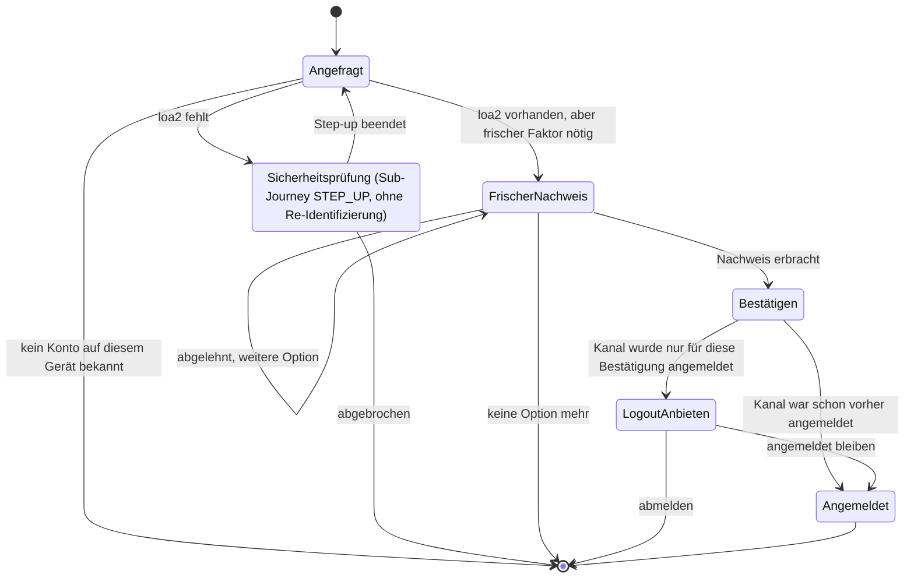

---

## 8) Konto endgültig löschen (`DELETE_ACCOUNT`)

Für angemeldete Nutzerinnen und Nutzer, die ihr Konto und alle Anmeldeverfahren dauerhaft entfernen wollen.

**Regeln:**
- Die Ja/Nein-Rückfrage kommt immer zuerst, bevor irgendein Sicherheits-Check greift.
- Erst nach "Ja" greift derselbe loa2-Check wie bei `MANAGE_AUTH_METHODS`.
- Musste dafür extra ein Step-up laufen, zählt dessen frischer Nachweis schon als die nötige
  Bestätigung - es wird nicht zweimal gefragt.
- War loa2 schon vorher erreicht, muss trotzdem ein beliebiger aktiver Faktor noch einmal frisch
  bestätigt werden, bevor endgültig gelöscht wird.
- Nach erfolgreicher Löschung wird automatisch abgemeldet.

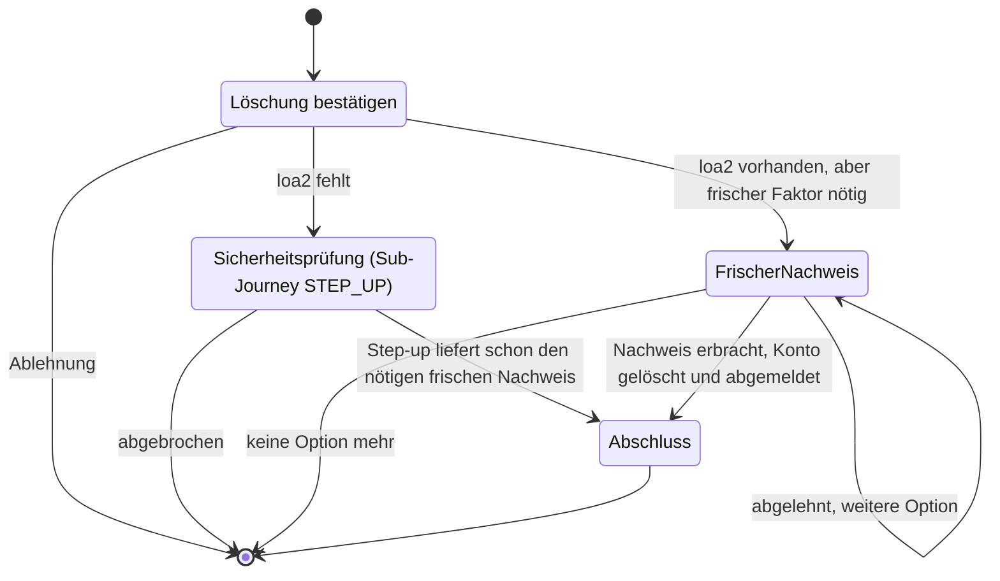

---

## 9) Abmelden (`LOGOUT`)

Einfache, bestätigte Abmeldung. Keine Tools, keine Sicherheits-Checks, keine Sub-Journeys.

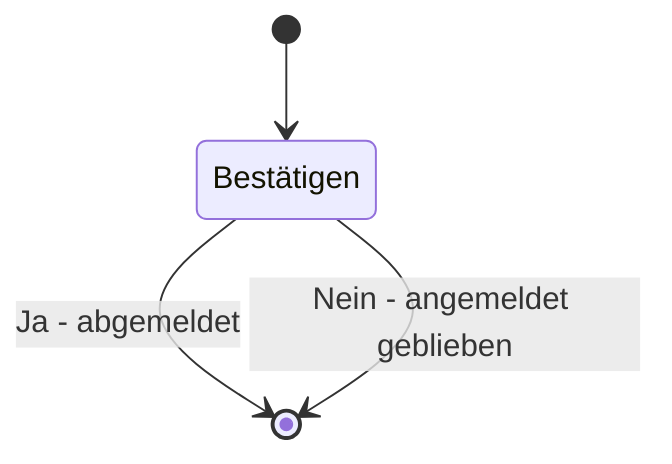

---

## 10) Erneute Identifizierung - geteilter Baustein (`RE_IDENTIFY`)

Kein Nutzer startet dies direkt - es ist der gemeinsame Rettungsanker jeder anderen Journey, wenn
keine vorhandene Methode mehr reicht (siehe Übersichtstabelle oben).

**Regeln:**
- Fragt immer zuerst nach Zustimmung ("Erneut identifizieren?"), bevor irgendetwas passiert - nie
  ein stiller Rückfall.
- Bestätigt bei Erfolg **immer nur das schon bekannte Konto**, nie eine andere Identität - eine
  nur schwach bewiesene Sitzung darf sich damit nicht in ein fremdes Konto einschleichen.
- Bei Ablehnung oder Abbruch bleibt der Kanal in genau dem Zustand, in dem er vorher war
  (angemeldet oder nicht), je nachdem, ob der Aufrufer selbst schon angemeldet war.

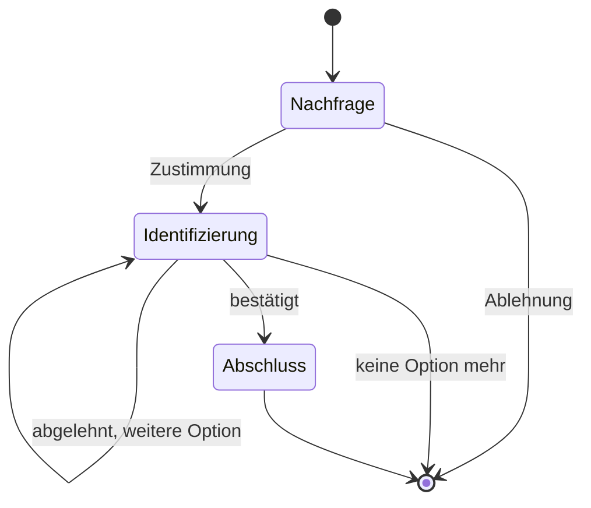

---

## 11) Journey-Lebenszyklus (technischer Rahmen für alle Journeys)

Gilt intent-unabhängig für jede der Journeys oben - zeigt, warum eine Journey, die gerade eine
Sub-Journey aufgerufen hat, nicht "läuft", sondern wartet: Pro Kanal ist zu jedem Zeitpunkt
höchstens eine Journey aktiv; ruft sie eine Sub-Journey auf, pausiert sie dafür, statt parallel weiterzulaufen.

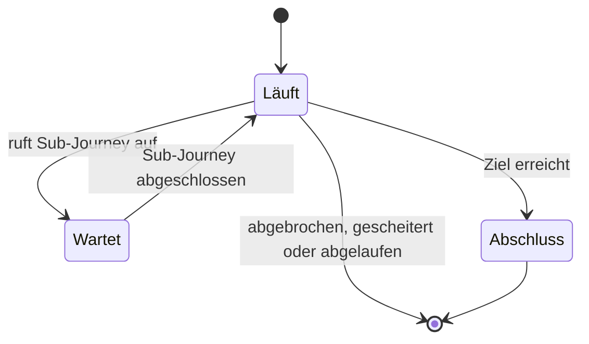

---

## Hinweise für die Präsentation

- Für Fachgespräche zuerst `FAST_ACCESS`, `REGISTER`, `STEP_UP` und `CONFIRM_PEER_LOGIN` zeigen.
- Die Übersichtstabelle "Sub-Journeys im Überblick" eignet sich gut, um am Anfang zu zeigen, dass
  es nur zwei wiederverwendete Bausteine gibt (`RE_IDENTIFY`, `STEP_UP`), nicht neun eigenständige Journeys.
- Bei Zeitdruck `RE_IDENTIFY` als Querschnitt nur verbal erklären (kommt in fünf Journeys vor).
- Für Architekturfragen auf die vollständige Modellbeschreibung in `docs/04-orchestrierung.md` verweisen.
