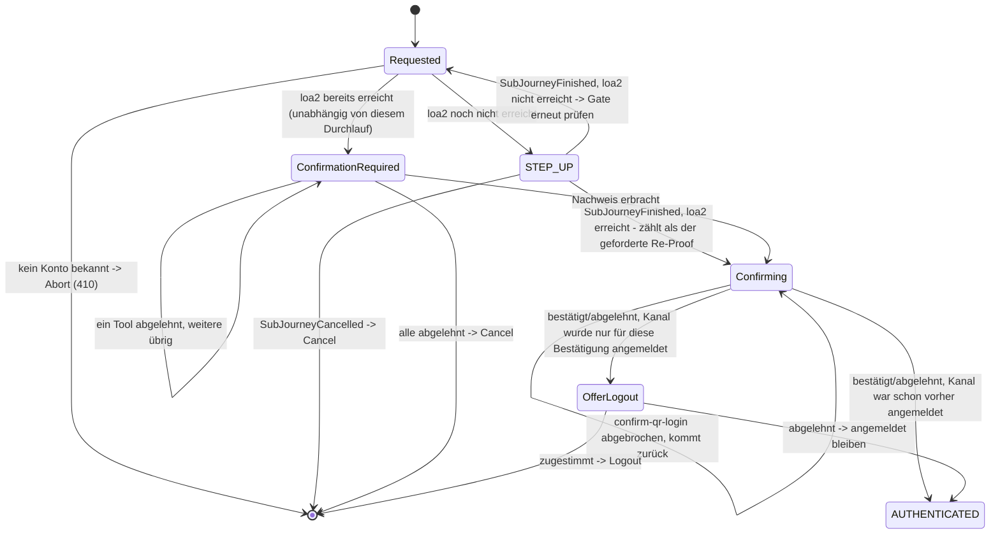

> Eine Journey aus dem Katalog. Die gemeinsame Lesehilfe zu den Diagrammen steht in
> [../04-orchestrierung.md](../04-orchestrierung.md), Abschnitt 3.

# `CONFIRM_PEER_LOGIN`

Ein App-Kanal bestätigt oder lehnt einen Web-Login ab, den eine `auth-qr`/`auth-qr-lookup`-
Aktivierung des Web-Kanals anstößt („mit dem Handy einloggen" per QR-Code). Der Journey-Vertrag
bleibt dabei unverändert: `confirm-qr-login`s `ToolOutcome` wirkt nur auf die EIGENE `AuthJourney`
(`Action.RecordApproval`); die Kanal-übergreifende Kopplung lebt im `auth_qr`-Modul, über eine
gemeinsame `QrLoginRequest`-Zeile, die beide Seiten lesen/schreiben. Kein Cross-Channel-Sonderfall
im Journey-SPI.

`CONFIRM_PEER_LOGIN` ist **beides zugleich: Entry-Intent und Zusatzschritt auf einer bereits
authentifizierten Session**
(Abschnitt 2) — beide Wege landen auf demselben `Requested`:

Bewusst **kein** separates "Möchten Sie bestätigen?"-Gate vor den folgenden Sicherheits-Checks:
Der `STEP_UP`-Schritt, den ein fehlendes loa2 ohnehin auslöst, erklärt selbst, warum gefragt wird,
und bietet "Abbrechen" als Ausweg — siehe `StepUpState.forSubJourney`s `reason`-Text
(`StepUpState.Reason.PEER_LOGIN`).

Drei Startzustände, eine Zustandsmenge:

1. **Kanal noch nicht authentifiziert**: NUR der geräte-gebundene Login-Teil von `FAST_ACCESS`s
   Fallback-Kette (`DeviceAccountLink` bekannt → dessen `IDENTIFIED_AUTH`-Kandidaten bis `loa1`,
   über den `STEP_UP`-Zweig oben) — **keine** Identifikation/Registrierung. Ohne
   `DeviceAccountLink` endet die Journey sofort ohne Angebot.
2. **Kanal authentifiziert, aber unter `loa2`**: ein `STEP_UP`-Gate auf fest `loa2` — anders als bei
   `MANAGE_AUTH_METHODS` ohne Ausweg über eine erneute Identifizierung
   (`allowReIdentification = false`), und ohne Absenkung für nie identifizierte Konten. Der dabei erbrachte Nachweis zählt bereits als der in Schritt 3 verlangte
   frische Faktor (`STEP_UP --> Confirming` oben, geprüft über `SubJourneyFinished.achievedAcr`).
3. **Kanal bereits bei `loa2` oder höher** (unabhängig von diesem Durchlauf): **nicht** direkt
   weiter — wie bei `DELETE_ACCOUNT` verlangt dieser Fall in jedem Fall einen frischen Re-Proof
   mit einem beliebigen aktiven Faktor (`CandidateTools.forReconfirmation`, jedes Niveau reicht),
   bevor `confirm-qr-login` angeboten wird (`ConfirmationRequired`). Der Re-Proof wird nicht als
   `MethodEvidence` festgehalten, sondern autorisiert nur diese eine Bestätigung.
4. `confirm-qr-login` aktivieren (`Confirming`, einziger Kandidat). Zurückgehen (`Abandoned`) ist
   kein Ablehnen der Anfrage, nur ein Zurückkommen zum selben Kandidaten.
5. Ziel erreicht, sobald das Tool `Completed`/`Failed` meldet — keine Rückkehr in die
   Kandidatenliste, die Journey endet mit diesem einen Tool. War der Kanal vorher nicht
   authentifiziert, fragt `OfferLogout` (`AnswerableState`), ob er angemeldet bleiben soll.

Der Pairing-Code geht **nicht** über den Kanal-Erzeugungsvertrag, sondern ist ein Eingabefeld des
ersten `confirm-qr-login`-Schritts. Der QR-Code (bzw. der Demo-Link) kodiert einen Deep-Link, der
App-seitig `intent=confirm_peer_login` setzt und `pairingCode` vorbefüllt durchreicht
([Frontend](../10-frontend.md)).
