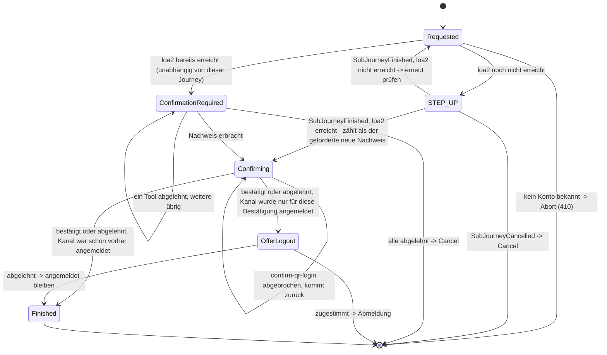

> Eine Journey aus dem Katalog. Wie die Diagramme zu lesen sind, erklärt
> [../04-orchestrierung.md](../04-orchestrierung.md), Abschnitt 3.

# `CONFIRM_PEER_LOGIN`

Mit dieser Journey bestätigt die App eine Anmeldung auf der Website oder lehnt sie ab („mit dem
Handy anmelden“ per QR-Code). Angestoßen wird sie im Web-Kanal durch `auth-qr` oder
`auth-qr-lookup`. Am Vertrag der Journeys ändert das nichts: Das `ToolOutcome` von
`confirm-qr-login` wirkt nur auf die **eigene** `AuthJourney` (`Action.RecordApproval`). Die
Verbindung zwischen den beiden Kanälen liegt im Modul `auth_qr`, in einer gemeinsamen
`QrLoginRequest`-Zeile, die beide Seiten lesen und schreiben. Einen Sonderfall für
kanalübergreifende Abläufe braucht die SPI der Journeys deshalb nicht.

`CONFIRM_PEER_LOGIN` ist **zweierlei**: ein Einstieg für eine neue Journey und ein zusätzlicher
Schritt in einer bereits angemeldeten Sitzung (Orchestrierung, Abschnitt 2). Beide Wege führen in
denselben Zustand `Requested`.

Vor den folgenden Sicherheitsprüfungen gibt es bewusst **keine** eigene Frage „Möchten Sie
bestätigen?“. Fehlt `loa2`, startet ohnehin ein Step-up. Dieser erklärt selbst, warum gefragt wird,
und bietet „Abbrechen“ als Ausweg an (siehe den Text in `reason` von `StepUpState.forSubJourney`,
`StepUpState.Reason.PEER_LOGIN`).

Je nach Zustand des Kanals beginnt die Journey an einer von drei Stellen. Danach laufen immer
dieselben Schritte:

1. **Der Kanal ist noch nicht angemeldet.** Angeboten wird nur die Anmeldung über das gekoppelte
   Gerät, also nur der gerätegebundene Teil der Ausweichwege von `FAST_ACCESS`: Ist ein
   `DeviceAccountLink` bekannt, werden dessen `IDENTIFIED_AUTH`-Kandidaten bis `loa1` angeboten,
   über den `STEP_UP`-Zweig im Diagramm. Identifizierung und Registrierung werden **nicht**
   angeboten. Ohne `DeviceAccountLink` endet die Journey sofort, ohne etwas anzubieten.
2. **Der Kanal ist angemeldet, aber unter `loa2`.** Dann läuft ein Step-up mit dem festen Ziel
   `loa2`. Anders als bei `MANAGE_AUTH_METHODS` gibt es keinen Ausweg über eine erneute
   Identifizierung (`allowReIdentification = false`), und für nie identifizierte Konten wird die
   Schwelle nicht gesenkt. Der Nachweis aus dem Step-up zählt bereits als der neue Nachweis, den
   Punkt 3 verlangt (im Diagramm `STEP_UP --> Confirming`; geprüft wird das über
   `SubJourneyFinished.achievedAcr`).
3. **Der Kanal steht bereits auf `loa2` oder höher** (unabhängig von dieser Journey). Dann geht es
   **nicht** direkt weiter. Wie bei `DELETE_ACCOUNT` muss der Nutzer in jedem Fall neu nachweisen,
   dass er es ist, mit einem beliebigen aktiven Verfahren auf beliebigem Niveau
   (`CandidateTools.forReconfirmation`). Erst danach wird `confirm-qr-login` angeboten
   (`ConfirmationRequired`). Dieser Nachweis wird nicht als `MethodEvidence` gespeichert; er erlaubt
   nur diese eine Bestätigung.
4. Danach wird `confirm-qr-login` gestartet (`Confirming`, der einzige Kandidat). Geht der Nutzer
   dort zurück (`Abandoned`), lehnt er die Anfrage damit nicht ab. Er kommt nur wieder zum selben
   Kandidaten.
5. `confirm-qr-login` hat nach der Freigabe einen dritten Schritt `showCode`: Die App zeigt den
   Bestätigungscode, den der Nutzer in den wartenden Browser tippt – erst damit ist der Browser
   angemeldet ([Betrieb](../07-betrieb.md) Abschnitt 5). `done` schließt das Tool ab.
6. Das Ziel ist erreicht, sobald das Tool `Completed` oder `Failed` meldet. Die Kandidatenliste wird
   danach nicht noch einmal angeboten; die Journey endet mit diesem einen Tool. War der Kanal vorher
   nicht angemeldet, fragt `OfferLogout` (ein `AnswerableState`), ob er angemeldet bleiben soll.

Der Pairing-Code wird **nicht** beim Anlegen des Kanals übergeben. Er ist ein Eingabefeld im ersten
Schritt von `confirm-qr-login`. Der QR-Code (oder in der Demo der Link) enthält einen Deep-Link. Er
setzt in der App `intent=confirm_peer_login` und reicht den `pairingCode` vorausgefüllt durch
([Frontend](../10-frontend.md)). Dass der Deep-Link den Pairing-Code vorbelegt, ist unkritisch:
Die Freigabe allein meldet keinen Browser an, der Bestätigungscode muss zurück in den Browser.
