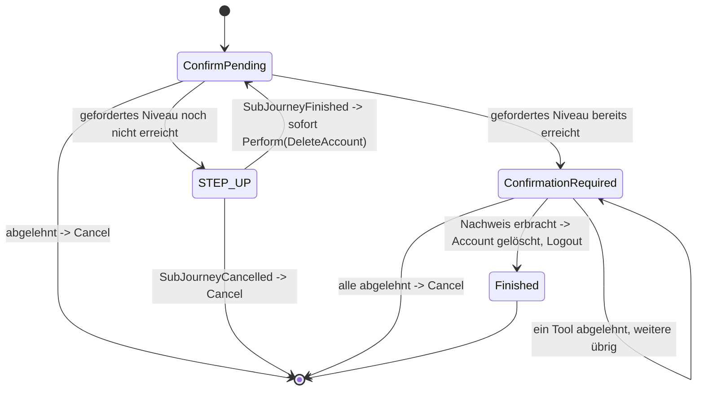

> Eine Journey aus dem Katalog. Die gemeinsame Lesehilfe zu den Diagrammen steht in
> [../04-orchestrierung.md](../04-orchestrierung.md), Abschnitt 3.

# `DELETE_ACCOUNT`

Self-Service-Löschung des eigenen Accounts. Die Bestätigung kommt immer zuerst, nie hinter einem
Step-up versteckt.

`ConfirmPending` ist ein `AnswerableState` mit `destructive: true`-Prompt. Nach Zustimmung greift
dasselbe `selfServiceAcrFloor`-Gate wie bei `MANAGE_AUTH_METHODS` (Abschnitt 3, `Action.DeleteAccount
.requiredAcr` delegiert an dieselbe Funktion). Der abschließende Re-Proof
(irgendein aktiver Faktor, beliebiges Niveau) bleibt Pflicht, nie eine Löschung, die unbemerkt von selbst passiert; musste
ein Step-up laufen, zählt dessen Nachweis bereits. Der Übergang am Ende ist
`Transition.Perform(Action.DeleteAccount, resumeState = ConfirmPending)`, aufgelöst zu
`Transition.Logout` sobald die Journey mit `ActionCompleted` fortgesetzt wird: Account löschen,
Kanal beenden. `JourneyService` prüft `requiredAcr(account)` unmittelbar vor der Ausführung erneut
nach (wie beim Selbst-Aussperr-Check vor `Action.RevokeAuthMethod`).
Der Nachweis in `ConfirmationRequired` läuft direkt in `Action.DeleteAccount`, nie über
`Action.AcceptProof` — er autorisiert genau diese eine Löschung, nie eine dauerhafte
`MethodEvidence` (Abschnitt 5).
