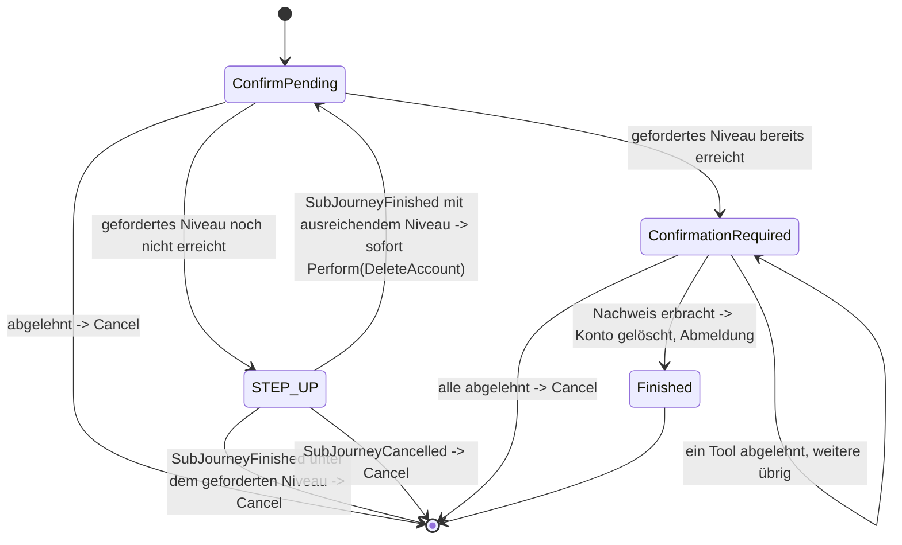

> Eine Journey aus dem Katalog. Wie die Diagramme zu lesen sind, erklärt
> [../04-orchestrierung.md](../04-orchestrierung.md), Abschnitt 3.

# `DELETE_ACCOUNT`

Mit dieser Journey löscht ein Nutzer sein eigenes Konto. Die Bestätigung kommt immer zuerst und
wird nie hinter einem Step-up versteckt.

`ConfirmPending` ist ein `AnswerableState`; seine Frage ist als folgenschwer markiert
(`destructive: true`). Nach der Zustimmung gilt dieselbe Schwelle wie bei
[`MANAGE_AUTH_METHODS`](manage-auth-methods.md): `Action.DeleteAccount.requiredAcr` ruft dieselbe
Funktion `selfServiceAcrFloor` auf.

Zum Schluss muss der Nutzer immer noch einmal ein Verfahren nachweisen (ein beliebiges aktives, auf
beliebigem Niveau). So wird ein Konto nie unbemerkt gelöscht. Musste vorher ein Step-up laufen,
zählt dessen Nachweis bereits.

Der letzte Übergang ist `Transition.Perform(Action.DeleteAccount, resumeState = ConfirmPending)`.
Wird die Journey danach mit `ActionCompleted` fortgesetzt, wird daraus `Transition.Logout`: Das Konto
wird gelöscht und der Kanal beendet. Unmittelbar vor der Ausführung prüft `JourneyActionExecutor`
`requiredAcr(account)` noch einmal, so wie vor `Action.RevokeAuthMethod` geprüft wird, ob sich der
Nutzer aussperren würde.

Der Nachweis in `ConfirmationRequired` führt direkt zu `Action.DeleteAccount` und nie über
`Action.AcceptProof`. Er erlaubt genau diese eine Löschung und wird nie zu einem dauerhaften
Nachweis der Sitzung (`MethodEvidence`, Orchestrierung, Abschnitt 5).
