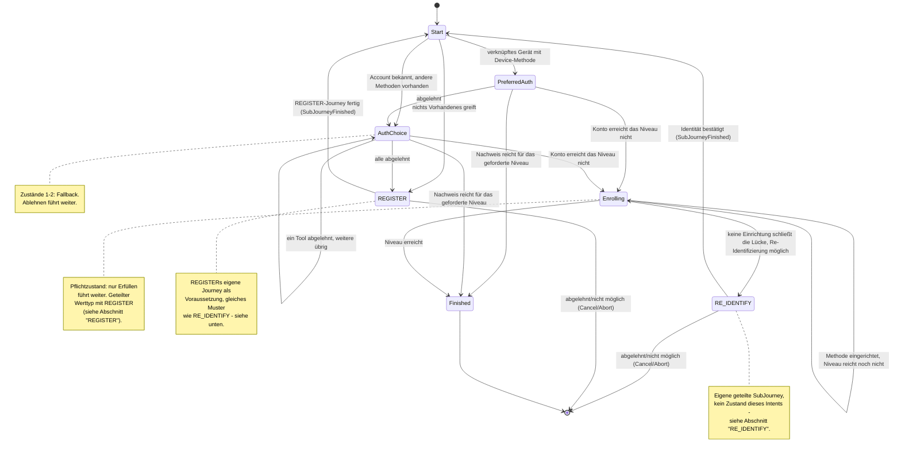

> Eine Journey aus dem Katalog. Die gemeinsame Lesehilfe zu den Diagrammen steht in
> [../04-orchestrierung.md](../04-orchestrierung.md), Abschnitt 3.

# `FAST_ACCESS`

Erst die Fallback-Kette vom bequemsten zum aufwendigsten Weg, danach die Pflichtzustände für den
nächsten Login.

`PreferredAuth` trägt genau die eine vorgeschlagene `toolId`; `AuthChoice`/`Enrolling` tragen
Angebot und Ablehnungen (Fallback- bzw. Pflichtsemantik, s. o.) und sind geteilte Werttypen mit
`RegisterState` (Abschnitt „REGISTER" unten). `Enrolling` trägt zusätzlich `emailObligation`, das
`FAST_ACCESS` selbst nie setzt (immer `false`) — nur ein Lauf über `RegisterState.Identifying`
kennt die E-Mail-Pflicht (Abschnitt 8).

`FAST_ACCESS` identifiziert nie selbst: Fehlt ein Account oder ist jede Methode abgelehnt, läuft
`REGISTER`s eigene Journey als `Transition.RequireSubJourney`-Voraussetzung; schließt in
`Enrolling` keine Einrichtung die Lücke, fragt die geteilte `RE_IDENTIFY`-SubJourney (Abschnitt
„RE_IDENTIFY" unten). Nach `SubJourneyFinished` prüft `Start` per `afterProof` erneut, ob der
Nachweis reicht.

In einem Fallback-Zustand sammelt `declined` die verworfenen Tools, in einem Pflichtzustand
**nicht** (s. o.).
