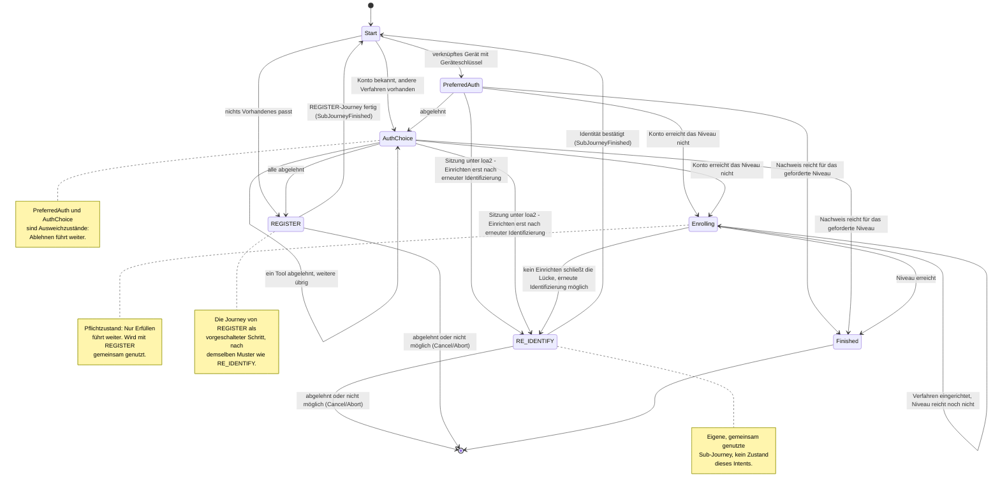

> Eine Journey aus dem Katalog. Wie die Diagramme zu lesen sind, erklärt
> [../04-orchestrierung.md](../04-orchestrierung.md), Abschnitt 3.

# `FAST_ACCESS`

Die schnelle Anmeldung versucht zuerst die bequemen Wege und weicht Schritt für Schritt auf
aufwendigere aus. Danach folgen die Pflichtzustände, die für die nächste Anmeldung sorgen.

`PreferredAuth` enthält genau das eine vorgeschlagene Tool (`toolId`). `AuthChoice` und
`Enrolling` enthalten das Angebot und die bisherigen Ablehnungen. Sie werden mit `RegisterState`
gemeinsam genutzt (siehe [`REGISTER`](register.md)). `Enrolling` hat zusätzlich das Feld
`emailObligation`. `FAST_ACCESS` setzt es nie (es bleibt `false`); die E-Mail-Pflicht gibt es nur,
wenn die Journey über `RegisterState.Identifying` gelaufen ist (Orchestrierung, Abschnitt 8).

`FAST_ACCESS` identifiziert nie selbst:

- Gibt es kein Konto, oder hat der Nutzer jedes Verfahren abgelehnt, startet die Journey von
  [`REGISTER`](register.md) als vorgeschalteter Schritt (`Transition.RequireSubJourney`).
- Kann in `Enrolling` kein Einrichten die Lücke schließen, fragt die gemeinsam genutzte Sub-Journey
  [`RE_IDENTIFY`](re-identify.md) nach einer erneuten Identifizierung.

Ist die Sub-Journey fertig (`SubJourneyFinished`), prüft `Start` mit `afterProof` erneut, ob der
Nachweis reicht.

Der Unterschied zwischen beiden Zustandsarten zeigt sich in `declined`: In einem Ausweichzustand
sammelt das Feld die abgelehnten Tools, in einem Pflichtzustand **nicht**, denn dort führt Ablehnen
nicht weiter.
