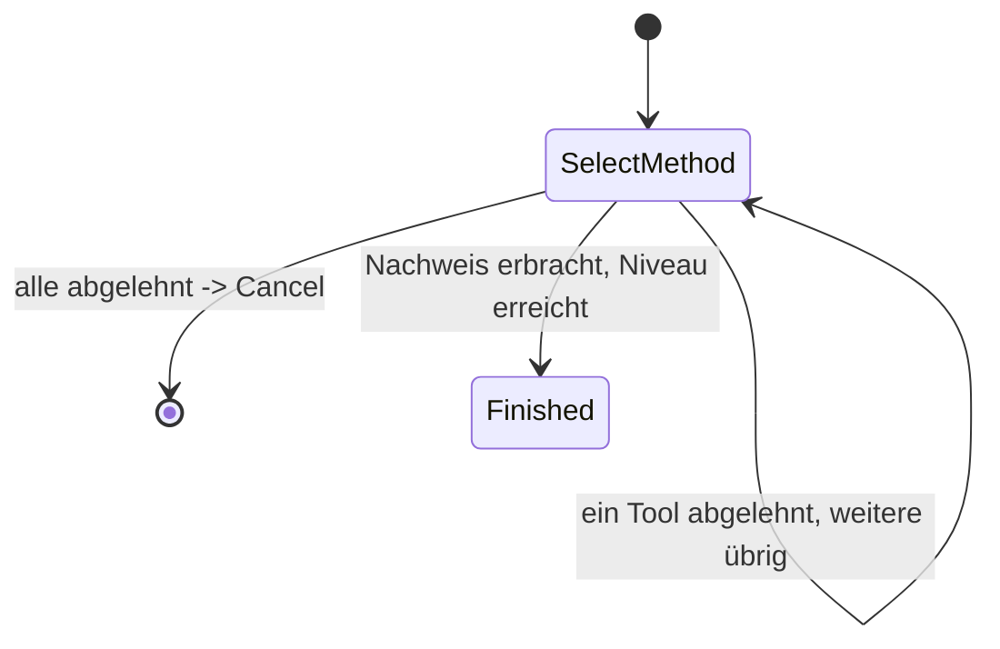

> Eine Journey aus dem Katalog. Wie die Diagramme zu lesen sind, erklärt
> [../04-orchestrierung.md](../04-orchestrierung.md), Abschnitt 3.

# `KC_SELECT_METHOD`

Mit diesem Intent beginnt im `KEYCLOAK`-Kanal jede Anmeldung und jeder Step-up, wenn nichts anderes
angegeben ist ([05-api.md](../05-api.md) Abschnitt 3, ADR-8 in
[12-entscheidungen.md](../12-entscheidungen.md)). Der zweite mögliche Einstieg im Web-Kanal ist
[`REGISTER`](register.md).

Die Journey hat nur einen einzigen Zustand. Er bietet ohne jede Bedingung alle Tools, die im
Keycloak-Kanal nutzbar sind, in einem gemeinsamen `selectMethod`-Schritt an. Es gibt keine Kette von
Ausweichwegen und kein Angebot, ein Verfahren einzurichten. Es wird vor dem Angebot auch nicht
geprüft, ob das Vorhandene schon reicht. Das entscheidet bereits Keycloak selbst: Seine
Ablaufkonfiguration (Conditional-LoA-Subflows) legt fest, ob und welches Niveau angefragt wird.

Derselbe Zustand bedient zwei Fälle im Web-Kanal. Sie unterscheiden sich nur im Feld
`accountAlreadyKnown`:

- **Erste Anmeldung** (`ctx.account` ist `null`): Die Journey findet das Konto selbst, und zwar über
  die Anmelde-Tools, die mit der E-Mail-Adresse arbeiten (`CandidateTools.forLookupLogin`), nie über
  eine Identifizierung.
- **Step-up** (das Konto ist schon vor Beginn der Journey auf dem Kanal gesetzt): Angeboten werden nur
  Anmelde-Tools für dieses Konto.

Bei jedem Ereignis (`Started`, `EvidenceReported`, `ActionCompleted`) prüft die Journey erneut, ob
das Vorhandene reicht, und baut die Kandidatenliste ganz neu auf. Ein Nachweis kann nämlich schon
vorliegen, bevor überhaupt etwas angeboten wurde, etwa aus einem eigenen Verfahren von Keycloak oder
aus RestoreData.
