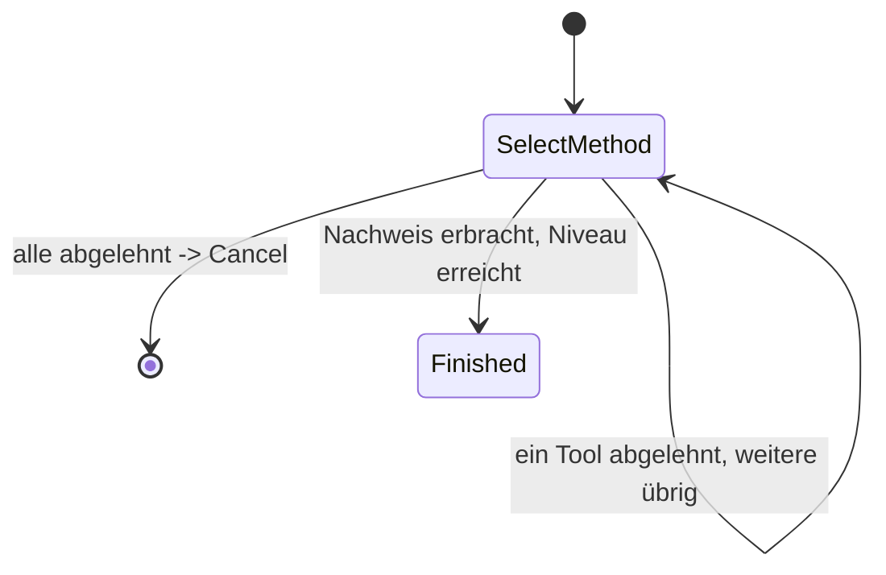

> Eine Journey aus dem Katalog. Die gemeinsame Lesehilfe zu den Diagrammen steht in
> [../04-orchestrierung.md](../04-orchestrierung.md), Abschnitt 3.

# `KC_SELECT_METHOD`

Der Default-Entry-Intent des `KEYCLOAK`-Kanals für Login/Step-up ([05-api.md](05-api.md)
Abschnitt 3, `ADR-8` in [12-entscheidungen.md](12-entscheidungen.md)); `REGISTER` ist der zweite
Web-Entry (Abschnitt "REGISTER" oben). Ein einziger Zustand, der ohne jede Bedingung alle kc-nutzbaren
Tools als einen `selectMethod`-Schritt anbietet — keine Fallback-Kette, kein Enrollment-Angebot,
und VOR dem Anbieten keine Prüfung, ob das Vorhandene schon reicht: Keycloaks native Flow-Konfiguration
(Conditional-LoA-Subflows) entscheidet bereits, OB und WELCHES Niveau angefragt ist.

Bedient zwei Web-Kanal-Fälle mit derselben Zustandsform, unterschieden nur durch
`accountAlreadyKnown`:

- **Initialer Login** (`ctx.account` ist `null`): löst den Account selbst über Lookup-Login-Tools
  auf (`CandidateTools.forLookupLogin`), nie über Identifikation.
- **Step-up** (Account bereits auf dem Kanal gesetzt, bevor die Journey beginnt): nur Auth-Tools
  für diesen Account.

Jedes Ereignis (`Started`, `EvidenceReported`, `ActionCompleted`) prüft erneut, ob das Vorhandene
reicht, und baut die Kandidatenliste komplett frisch auf — ein Nachweis (natives Keycloak-Verfahren oder
RestoreData) kann schon vor dem allerersten Angebot vorliegen.
