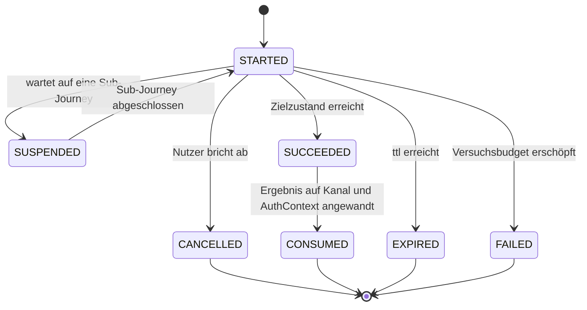

> Eine Journey aus dem Katalog. Die gemeinsame Lesehilfe zu den Diagrammen steht in
> [../04-orchestrierung.md](../04-orchestrierung.md), Abschnitt 3.

# Lebenszyklus, unabhängig vom Intent

Die intent-eigenen Zustände beschreiben den Weg; `JourneyLifecycle`, ob die Journey noch läuft.

---
