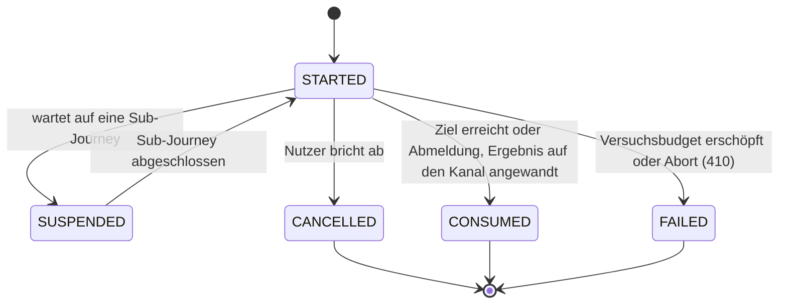

> Eine Journey aus dem Katalog. Wie die Diagramme zu lesen sind, erklärt
> [../04-orchestrierung.md](../04-orchestrierung.md), Abschnitt 3.

# Lebenszyklus, unabhängig vom Intent

Die Zustände jedes Intents beschreiben den Weg durch die Journey. `JourneyLifecycle` sagt nur, ob
die Journey noch läuft.

`SUCCEEDED` und `EXPIRED` gibt es im Enum noch, sie werden aber nie gesetzt. Eine erfolgreiche
Journey geht direkt auf `CONSUMED` (`AuthJourney.consume()`). Ob eine Journey abgelaufen ist, wird
nur gelesen (`AuthJourney.isExpired`, anhand von `expiresAt`): Eine abgelaufene Journey gilt als
nicht mehr aktiv, ohne dass ihr Zustand geändert wird.

---
