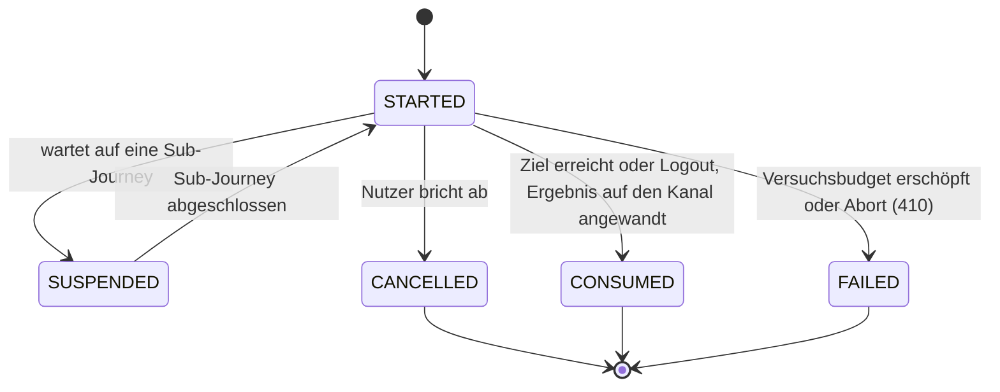

> Eine Journey aus dem Katalog. Die gemeinsame Lesehilfe zu den Diagrammen steht in
> [../04-orchestrierung.md](../04-orchestrierung.md), Abschnitt 3.

# Lebenszyklus, unabhängig vom Intent

Die intent-eigenen Zustände beschreiben den Weg; `JourneyLifecycle`, ob die Journey noch läuft.

`SUCCEEDED` und `EXPIRED` stehen noch im Enum, werden aber nie gesetzt: Eine erfolgreiche Journey geht
direkt auf `CONSUMED` (`AuthJourney.consume()`), und der Ablauf wird nur gelesen
(`AuthJourney.isExpired` über `expiresAt`) — eine abgelaufene Journey gilt als nicht mehr aktiv,
ohne dass ihr Zustand umgeschrieben wird.

---
