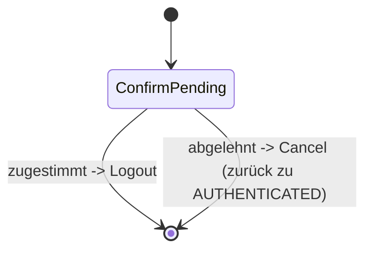

> Eine Journey aus dem Katalog. Wie die Diagramme zu lesen sind, erklärt
> [../04-orchestrierung.md](../04-orchestrierung.md), Abschnitt 3.

# `LOGOUT`

Abmelden nach einer Rückfrage: nur eine einzige Frage, ohne Tool.

`ConfirmPending` ist wie bei `DELETE_ACCOUNT` ein `AnswerableState`. Stimmt der Nutzer zu, folgt
`Transition.Logout`. Lehnt er ab, folgt `Cancel`, und der Kanal ist wieder `AUTHENTICATED`.
