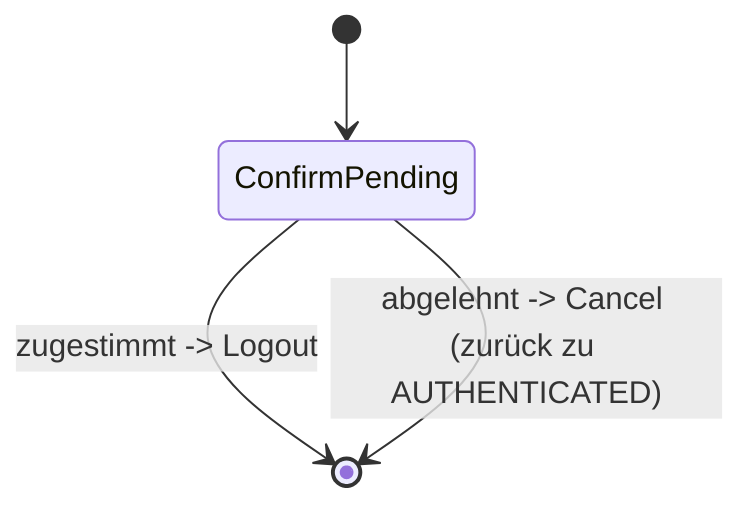

> Eine Journey aus dem Katalog. Die gemeinsame Lesehilfe zu den Diagrammen steht in
> [../04-orchestrierung.md](../04-orchestrierung.md), Abschnitt 3.

# `LOGOUT`

Bestätigtes Abmelden — ein einzelner Prompt, kein Tool-Lauf.

`ConfirmPending` ist wie bei `DELETE_ACCOUNT` ein `AnswerableState`. Zustimmung liefert
`Transition.Logout`, Ablehnung `Cancel` (Kanal zurück auf `AUTHENTICATED`).
