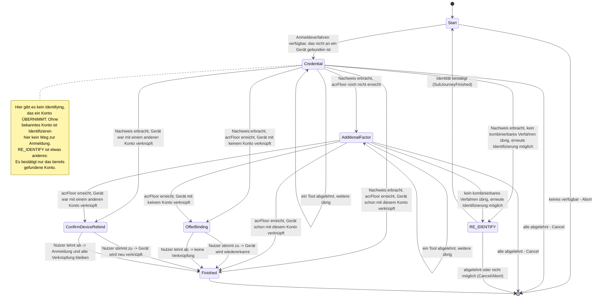

> Eine Journey aus dem Katalog. Wie die Diagramme zu lesen sind, erklärt
> [../04-orchestrierung.md](../04-orchestrierung.md), Abschnitt 3.

# `LOOKUP_LOGIN`

Anmelden ohne gekoppeltes Gerät: Der Nutzer gibt seine E-Mail-Adresse an und weist eines seiner
Verfahren nach. Angeboten werden alle Tools mit der Rolle `MethodRole.LOOKUP_AUTH`. Die
Kandidatenliste von `AuthPolicy.candidateTools` passt hier nicht, denn sie setzt ein bereits
gefundenes Konto voraus.

**Das Gerät wiedererkennen.** `OfferBinding` stellt eine freiwillige Frage: „Dieses Gerät für
künftige Anmeldungen wiedererkennen?“ Dafür implementiert der Zustand das allgemeine
Markierungs-Interface `AnswerableState` (Orchestrierung, Abschnitt 5). So erkennt der gemeinsame
Mechanismus den Zustand, ohne `LookupLoginState.OfferBinding` zu kennen. Gehört das Gerät bereits
einem anderen Konto als dem gerade angemeldeten, wechselt die Journey nach `ConfirmDeviceRebind`.
Dort läuft dieselbe Ja/Nein-Frage, mit einem Hinweis, dass die alte Verknüpfung verloren geht. Lehnt der
Nutzer ab, entfällt nur das neue Verknüpfen; die Anmeldung selbst bleibt bestehen.
Ist das Gerät schon mit genau diesem Konto verknüpft, gibt es nichts zu fragen: Die Journey endet
direkt angemeldet.

Die dauerhafte Zuordnung von Gerät zu Konto (`DeviceAccountLink`) entsteht in dieser Journey
**nur** mit Zustimmung und nie nebenbei beim Anmelden.

**Wenn das Niveau nicht reicht.** `AdditionalFactor` setzt die Untergrenze des Kanals durch
(`acrFloor`, Orchestrierung, Abschnitt 8). Bleibt danach kein kombinierbares Verfahren übrig,
bietet die Strategie die erneute Identifizierung nicht selbst an. Sie startet stattdessen die
gemeinsam genutzte Sub-Journey [`RE_IDENTIFY`](re-identify.md). Ist diese fertig, prüft `Start`
mit `settleOrRaise` erneut. Diese Journey bietet bewusst **nicht** an, ein weiteres Verfahren
einzurichten. Die erneute Identifizierung ist dagegen erlaubt, weil dabei kein Credential auf einem
ungeprüften Gerät entsteht.

**Schutz vor dem Ausforschen von Adressen:** Eine unbekannte E-Mail-Adresse erhält dieselbe Antwort
wie ein gefundenes Konto, dessen Nachweis fehlschlägt. Es gibt keine eigene Fehlerform dafür, auch
nicht darin, wann Demo-Werte in der Antwort erscheinen ([API](../05-api.md)). Weiter gehärtet ist
das bewusst nicht; die Antwortzeiten werden zum Beispiel nicht angeglichen.
