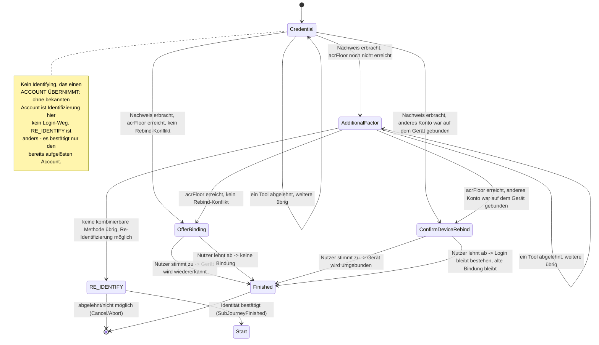

> Eine Journey aus dem Katalog. Die gemeinsame Lesehilfe zu den Diagrammen steht in
> [../04-orchestrierung.md](../04-orchestrierung.md), Abschnitt 3.

# `LOOKUP_LOGIN`

Anmelden ohne gepaartes Gerät: Der Nutzer nennt einen Identifikator (E-Mail) und weist eine seiner
Methoden nach. Angeboten wird der abgeleitete Satz aller `MethodRole.LOOKUP_AUTH`-Tools, nicht
`AuthPolicy.candidateTools` — das bräuchte einen bereits aufgelösten Account.

`OfferBinding` fragt optional: „Dieses Gerät für künftige Logins wiedererkennen?" Dafür erfüllt es
das allgemeine Markerinterface `AnswerableState` (Abschnitt 5), damit der gemeinsame Mechanismus den
Zustand erkennt, ohne `LookupLoginState.OfferBinding` zu kennen. Löst der Login ein anderes Konto auf als
das für dieses Gerät eingetragene, wechselt die Journey in `ConfirmDeviceRebind`: dieselbe
Ja/Nein-Mechanik mit destruktivem Hinweis. Ablehnung verwirft nur die Umbindung, nicht den Login.

Die Gerätewiedererkennung (`DeviceAccountLink`) — eine dauerhafte Zuordnung Gerät → Account —
entsteht hier **nur** nach Zustimmung, nie als Nebenwirkung des Logins.

`AdditionalFactor` erzwingt die eigene `acrFloor` des Kanals (Abschnitt 8). Bleibt danach
keine kombinierbare Methode übrig, springt die Strategie in die geteilte `RE_IDENTIFY`-SubJourney
(Abschnitt „RE_IDENTIFY") statt selbst eine Re-Identifizierung anzubieten. Nach ihrem Abschluss
prüft `Start` erneut per `settleOrRaise`. Dieser Intent hat bewusst **keinen** Enrollment-Fallback;
Re-Identifizierung bleibt erlaubt, weil dabei kein Credential auf einem ungeprüften Gerät entsteht.

**Enumeration-Schutz**: Eine unbekannte E-Mail liefert dieselbe Antwortform wie ein aufgelöster
Account mit fehlgeschlagenem Nachweis — nie eine eigene Fehlerform, auch nicht im Timing der
Demo-Werte ([API](../05-api.md)). Bewusst nicht weiter gehärtet (kein Timing-Padding).
