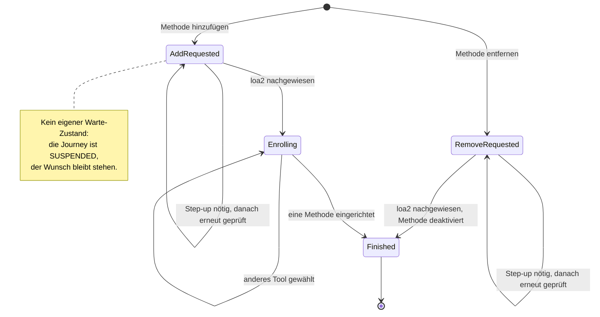

> Eine Journey aus dem Katalog. Die gemeinsame Lesehilfe zu den Diagrammen steht in
> [../04-orchestrierung.md](../04-orchestrierung.md), Abschnitt 3.

# `MANAGE_AUTH_METHODS`

`AddRequested`/`RemoveRequested` (Letzterer trägt die `methodInstanceId`) sind zugleich der Wunsch
vor der loa2-Prüfung und der Wartezustand während eines Step-ups; `Enrolling` trägt Angebot und
Ablehnungen.

`MANAGE_AUTH_METHODS` ist der einzige Intent ohne Policy-Ziel: **ein** erfolgreiches Enrollment
beendet ihn, unabhängig vom Niveau. Eine zweite Methode braucht eine neue Journey.

Dass gewartet wird, sagen `JourneyLifecycle.SUSPENDED` und die `parentJourneyId` der Kind-Journey
— deshalb überlebt der Wunsch den Step-up: Nach dessen Abschluss wird derselbe Zustand erneut
ausgewertet, prüft die Vorbedingung neu und führt aus, was ursprünglich verlangt war.

Die Vorbedingung folgt derselben Logik wie die `enrolledUnderAcr`-Begrenzung (Abschnitt 8):
Niemand soll sich aus eigener Kraft mehr Rechte verschaffen. Eine übernommene Session darf also
keine Methoden hinzufügen oder entfernen. Das geforderte Niveau selbst liefert die geteilte Funktion `selfServiceAcrFloor`
(`orchestrator/journey/IntentStrategy.kt`, auch von `DeleteAccountStrategy` genutzt): `loa2` für
ein identifiziertes Konto, aber nur `loa1` für ein nie identifiziertes (`personId == null`, der
"Enrollment zuerst"-Fall). Dort gibt es keine gebundene Identität, die eine übernommene Session
zusätzlich beschädigen könnte. Und `loa2` wäre für ein solches Konto ohnehin nie erreichbar: Die
MFA-Kombinationsregel begrenzt jede Erhöhung auf das höchste `enrolledUnderAcr` seiner Methoden, und
das liegt bei einem nie identifizierten Konto immer bei `loa1`. Das Entfernen prüft zusätzlich,
dass der Account danach die Untergrenze des Kanals noch erreichen kann (`409`, Schutz vor dem
Aussperren).
