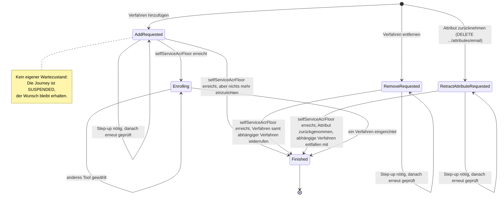

> Eine Journey aus dem Katalog. Wie die Diagramme zu lesen sind, erklärt
> [../04-orchestrierung.md](../04-orchestrierung.md), Abschnitt 3.

# `MANAGE_AUTH_METHODS`

**Wunsch und Wartezustand zugleich.** `AddRequested`, `RemoveRequested` und
`RetractAttributeRequested` halten den Wunsch des Nutzers fest. `RemoveRequested` enthält dafür die
`methodInstanceId`, `RetractAttributeRequested` den `attributeType`. Derselbe Zustand gilt vor der
Prüfung gegen `selfServiceAcrFloor` und während eines Step-ups, auf den er wartet. Lehnt der Nutzer
den Step-up ab, endet die Journey (`Cancel`); derselbe Step-up wird nicht erneut angeboten.
`Enrolling` enthält das Angebot und die bisherigen Ablehnungen.

`MANAGE_AUTH_METHODS` ist der einzige Intent ohne Ziel in der Richtlinie: Die Journey endet, sobald
**ein** Verfahren erfolgreich eingerichtet ist, unabhängig vom erreichten Niveau. Für ein zweites
Verfahren beginnt eine neue Journey.

Dass die Journey wartet, erkennt man an `JourneyLifecycle.SUSPENDED` und an der `parentJourneyId`
der Kind-Journey. Deshalb geht der Wunsch beim Step-up nicht verloren: Ist der Step-up fertig, wird
derselbe Zustand erneut ausgewertet. Er prüft die Vorbedingung noch einmal und führt dann aus, was
ursprünglich verlangt war.

**Welches Niveau verlangt wird.** Die Vorbedingung folgt derselben Überlegung wie die Begrenzung
durch `enrolledUnderAcr` (Orchestrierung, Abschnitt 8): Niemand soll sich aus eigener Kraft mehr
Rechte verschaffen. Wer eine Sitzung übernommen hat, darf deshalb keine Verfahren hinzufügen oder
entfernen. Das geforderte Niveau liefert die gemeinsam genutzte Funktion `selfServiceAcrFloor`
(`orchestrator/journey/IntentStrategy.kt`; `DeleteAccountStrategy` nutzt sie auch):

- Für ein identifiziertes Konto ist es `loa2`.
- Für ein Konto, das nie identifiziert wurde (`personId == null`, etwa aus dem Experiment „Erst
  Anmeldeverfahren einrichten“), reicht `loa1`. Bei einem solchen Konto gibt es keine gebundene
  Identität, die eine übernommene Sitzung zusätzlich schädigen könnte. Außerdem wäre `loa2` dort nie
  erreichbar: Die Regel für kombinierte Verfahren begrenzt jede Erhöhung auf das höchste
  `enrolledUnderAcr` der Verfahren eines Kontos, und das ist bei einem nie identifizierten Konto
  immer `loa1`.

Beim Entfernen wird zusätzlich geprüft, ob das Konto danach die Untergrenze des Kanals noch
erreichen kann. Wenn nicht, antwortet der Server mit `409`; so kann sich niemand selbst aussperren.
