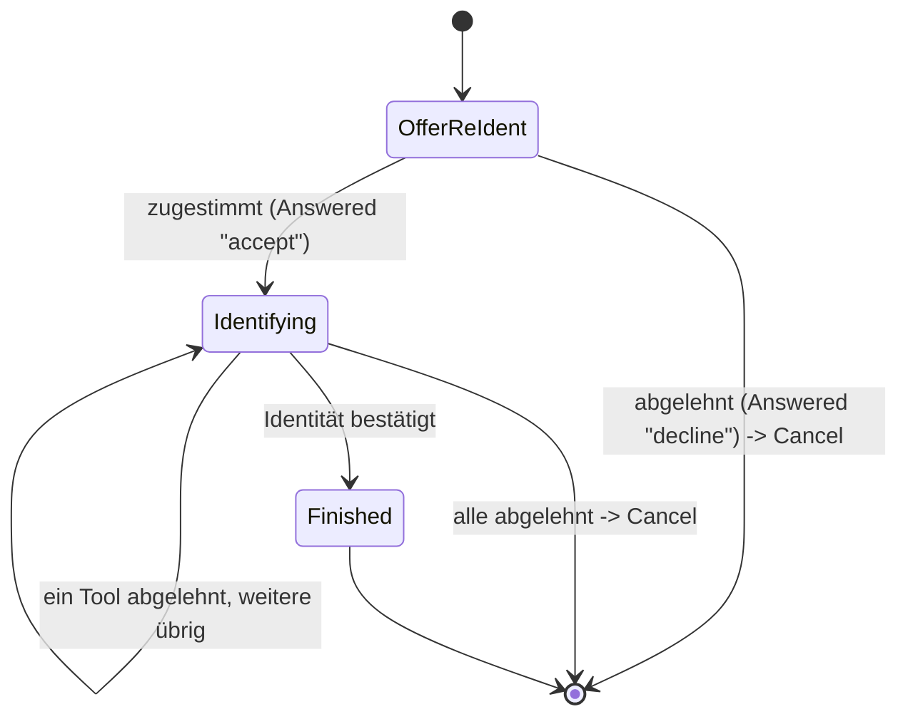

> Eine Journey aus dem Katalog. Wie die Diagramme zu lesen sind, erklärt
> [../04-orchestrierung.md](../04-orchestrierung.md), Abschnitt 3.

# `RE_IDENTIFY`

Die erneute Identifizierung ist eine gemeinsam genutzte Sub-Journey. Sie wird von diesen Journeys
angefordert:

- [`FAST_ACCESS`](fast-access.md), [`LOOKUP_LOGIN`](lookup-login.md) und [`STEP_UP`](step-up.md);
- [`REGISTER`](register.md), und zwar über `AuthEnrollCore.offerEnrollment`, wenn ein neues
  Verfahren erst nach einer erneuten Identifizierung eingerichtet werden darf;
- dem Experiment „Erst Anmeldeverfahren einrichten“ (`RegisterEnrollFirstStrategy`, siehe
  [`REGISTER`](register.md)).

Es gibt nur diese eine Umsetzung statt fünf fast gleicher. `RE_IDENTIFY` ist nie der Einstieg einer
Journey; man erreicht sie nur über `Transition.RequireSubJourney`.

`OfferReIdent` fragt immer zuerst nach („Erneut identifizieren?“, über `AnswerableState`). Die
erneute Identifizierung beginnt also nie unbemerkt. `Identifying` enthält `targetAcr` und
`startingAcr` sowie das Angebot und die bisherigen Ablehnungen. Allein erreicht `ident-fsc` das
Niveau `loa2`, `ident-eid` und `ident-nect` erreichen `loa3`.

**Eigener Text für das Experiment.** Der Standardtext („Sicherheitsniveau mit den vorhandenen
Anmeldeverfahren nicht erreichbar“) passt nur für `FAST_ACCESS`, `LOOKUP_LOGIN` und `STEP_UP`. Für
das abschließende Angebot von `RegisterEnrollFirstStrategy` ist er falsch. Deshalb hat
`ReIdentifyState` ein optionales Feld `Wording` mit Titel, Beschreibung und Knopftext für
`OfferReIdent` und `Identifying`. Gesetzt wird es über `forSubJourney(targetAcr, startingAcr,
wording)`, und nur dieser eine Aufrufer belegt es. Bleibt es `null`, gilt der Standardtext. Das
folgt demselben Muster wie `reason` in `StepUpState.forSubJourney`.

**Wohin eine Ablehnung führt.** `startingAcr` bestimmt, in welchen Zustand der Kanal bei Ablehnung
zurückfällt (`cancelledTo`):

- `"none"` bedeutet, dass der aufrufende Kanal noch nicht angemeldet war (`FAST_ACCESS`,
  `LOOKUP_LOGIN`). Er fällt auf `ANONYMOUS` zurück.
- Ein echtes Niveau bedeutet, dass der Kanal bereits angemeldet war (`STEP_UP`). Er bleibt
  `AUTHENTICATED`, denn eine abgelehnte erneute Identifizierung meldet keine laufende Sitzung ab.

**Bestätigen, nicht übernehmen.** Für ein erfolgreiches `Identified` liefert `transition()` immer
dieselbe `Action.RecordIdentification`. Weil hier stets schon ein Konto zugeordnet ist, bestätigt sie
die Identität nur und übernimmt kein anderes Konto: Die identifizierte Person muss zum bereits
bekannten Konto passen, sonst antwortet der Server mit `409`. Das gilt unabhängig davon, welcher
Intent die Sub-Journey angefordert hat. Einzige Ausnahme ist ein Konto, das noch nie identifiziert
wurde (aus dem Experiment „Erst Anmeldeverfahren einrichten“). Es übernimmt die Identität hier zum
ersten Mal.
