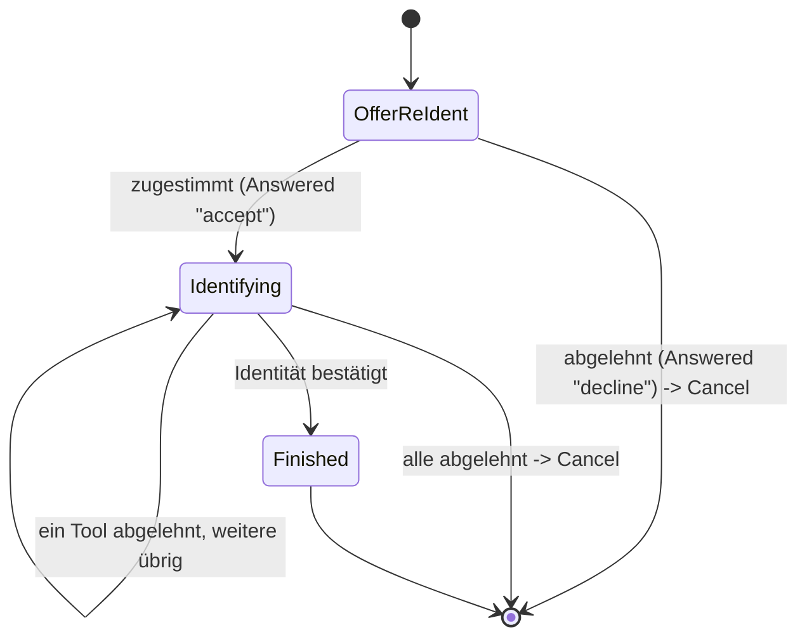

> Eine Journey aus dem Katalog. Die gemeinsame Lesehilfe zu den Diagrammen steht in
> [../04-orchestrierung.md](../04-orchestrierung.md), Abschnitt 3.

# `RE_IDENTIFY`

Geteilt von `FAST_ACCESS`/`LOOKUP_LOGIN`/`STEP_UP` (jeweils oben verlinkt) sowie vom
„Enrollment zuerst"-Experiment (`RegisterEnrollFirstStrategy`, Abschnitt „REGISTER") — eine einzige
Implementierung statt vier fast identischer. Nie ein Entry-Intent, nur über
`Transition.RequireSubJourney` erreichbar.

`OfferReIdent` fragt immer zuerst per `AnswerableState`-Prompt („Erneut identifizieren?"), nie als
unbemerkter Rückfall. `Identifying` trägt `targetAcr`/`startingAcr` sowie Angebot und Ablehnungen;
`ident-fsc`/`ident-eid` erreichen `loa2`/`loa3` im Alleingang.

Der Standardtext („Sicherheitsniveau mit den vorhandenen Anmeldeverfahren nicht erreichbar") passt
nur für `FAST_ACCESS`/`LOOKUP_LOGIN`/`STEP_UP`; für `RegisterEnrollFirstStrategy`s abschließendes
Angebot ist er falsch. Deshalb trägt `ReIdentifyState` (und darüber `forSubJourney(targetAcr,
startingAcr, wording)`) ein optionales `Wording` (Titel/Beschreibung/Button-Text für `OfferReIdent`
und `Identifying`), das nur dieser Aufrufer belegt; `null` behält den Standardtext. Gleiches Muster
wie `StepUpState.forSubJourney`s `reason`.

`startingAcr` steuert, wohin `onCancel` bei Ablehnung zurückfällt: `"none"` heißt, der aufrufende
Kanal war nicht authentifiziert (`FAST_ACCESS`/`LOOKUP_LOGIN`) → `ANONYMOUS`; ein echtes Niveau
heißt `AUTHENTICATED` (`STEP_UP`) → das bleibt er auch, eine abgelehnte Re-Identifizierung meldet
keine laufende Session ab.

`transition()` liefert für ein erfolgreiches `Identified` immer dieselbe `Action.RecordIdentification`; weil hier stets ein Konto gebunden ist, wirkt sie als Bestätigung, nie als
Übernahme: Die identifizierte Person muss zum bereits bekannten Account passen (`409` bei
Abweichung), unabhängig davon, welcher Intent die SubJourney angefordert hat.
