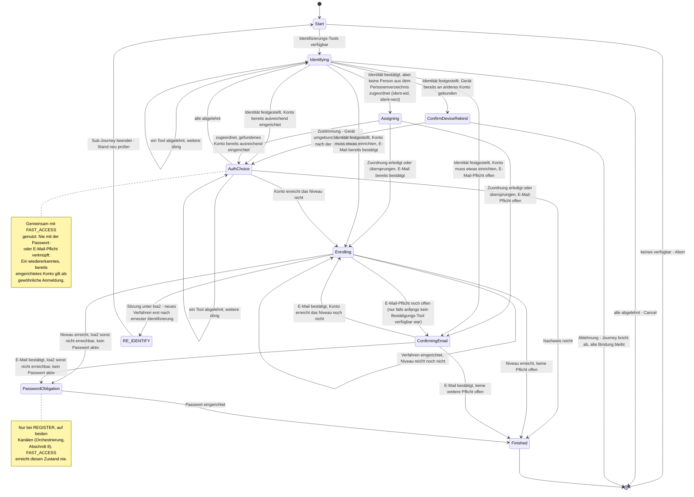
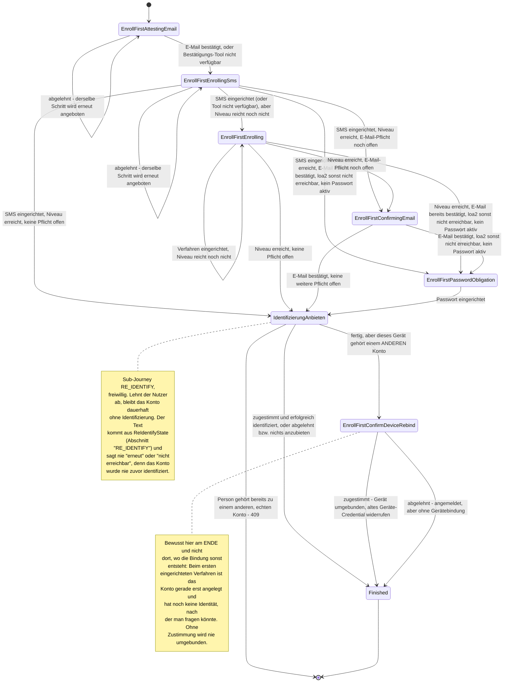

> Eine Journey aus dem Katalog. Wie die Diagramme zu lesen sind, erklärt
> [../04-orchestrierung.md](../04-orchestrierung.md), Abschnitt 3.

# `REGISTER`

Die Registrierung hat ihre eigene Journey mit eigenem Zustandstyp (`RegisterState`). Zwei Zustände
teilt sie mit [`FAST_ACCESS`](fast-access.md): `AuthChoice` und `Enrolling`. Nur ihr gehören
`Identifying`, `ConfirmDeviceRebind`, `Assigning`, `ConfirmingEmail` und `PasswordObligation`.
Auch `FAST_ACCESS` nutzt diese Journey: Muss sich jemand beim schnellen Anmelden erst ausweisen,
startet sie als vorgeschalteter Schritt (siehe [`FAST_ACCESS`](fast-access.md)).

**Das Gerät gehört schon einem anderen Konto.** Es kann sein, dass die Identifizierung ein
**anderes** Konto findet als das, an das dieses Gerät über `DeviceAccountLink` bereits gebunden ist
(„Zweitaccount“). Dann wird die Bindung nicht stillschweigend überschrieben. `afterIdentification`
prüft diesen Fall als Allererstes, noch bevor ein Anmeldeverfahren angeboten wird, und wechselt nach
`ConfirmDeviceRebind`:

- Stimmt der Nutzer zu (`accept`), wird das Gerät umgebunden (`Action.LinkDevice`). Dabei wird das
  Geräte-Credential (`enroll-device`) des bisherigen Kontos für genau diesen `bindingKeyRef`
  widerrufen (`AccountDeletionService.revokeMethod`). Danach geht es mit `afterIdentification`
  weiter.
- Lehnt er ab (`decline`), endet die Journey regulär über `Transition.Cancel`. Das ist kein Fehler,
  sondern dasselbe wie `DELETE .../journey`, und die bestehende Bindung bleibt unverändert.

**Ausgewiesen, aber noch keiner Person zugeordnet.** Nach `ident-eid` oder `ident-nect` steht fest,
wer jemand ist. Eine Person im Personenverzeichnis ist damit aber noch nicht gefunden, denn ein
Ausweisdokument trägt keine KVNR (ADR-18). Die Journey geht deshalb direkt nach `Assigning`, und
`next` zeigt sofort auf `ident-kvnr`. Dort gibt man die KVNR an oder, ohne KVNR, die Partnernummer
(ADR-34). Eine Ja/Nein-Frage davor gibt es bewusst nicht. „Darf ich nach der Nummer fragen?“ und
das Formular, das nach ihr fragt, wären dieselbe Frage zweimal, und das Formular erklärt selbst,
wofür die Nummer gebraucht wird. Wer nicht zuordnen will, bricht den Schritt ganz normal ab
(`DELETE .../tools/{toolSessionId}/ident-kvnr`, im Frontend beschriftet mit „Jetzt nicht“). Die
Registrierung läuft dann weiter. Das Konto bleibt **Interessent** (ADR-10): Die Identität ist voll
bestätigt, aber keiner Person im Personenverzeichnis zugeordnet. `Assigning` ist damit ein
Ausweich-, kein Pflichtzustand. Nach `ident-fsc` wird er nie erreicht, denn dort steht das
Personenverzeichnis selbst für die Person ein, und die PersonId ist sofort bekannt.

**Identifizieren heißt: finden oder anlegen.** `Identifying` hat zwei Aufgaben. Es ist der Einstieg
in die Registrierung und zugleich der letzte Ausweg beim Anmelden (für `FAST_ACCESS`, als
Sub-Journey). Eine Trennung in Registrierung und Anmeldung gibt es dabei nicht. Welches von beiden
es war, zeigt sich erst danach, wenn das Konto anhand der Claims gesucht wird. Deshalb darf eine
leere Kandidatenliste hier nicht zum Abbruch führen. Ein `Identified`-Ergebnis bedeutet an dieser
Stelle „finde das Konto oder übernimm es“. Das ist keine Besonderheit von `REGISTER`, sondern folgt
daraus, dass hier noch kein Konto gebunden ist. Ist bereits eines gebunden (bei `RE_IDENTIFY` oder
bei `Identifying` nach `AuthChoice`), läuft dieselbe Action mit derselben Prüfung, nur mit anderem
Ergebnis.

**Was mit dem Konto geschieht:**

- Wird kein Konto gefunden (`Resolution.Unresolved`), schreibt die Journey auf das Konto, das sie
  bereits hat, solange dieses noch keine PersonId trägt. Andernfalls entsteht ein neues Konto ohne
  zugeordnete Person.
- Ein bereits identifiziertes Konto übernimmt nie die bestätigte Identität eines anderen. Gehört der
  Kanal nur dem Gerät (der oben beschriebene Zweitaccount-Fall), bekommt die Journey ein eigenes
  Konto. Sonst wird sie abgewiesen.
- `recordClaims` schreibt PersonId und E-Mail auf demselben Weg für Claims und Anker. Konto, Claims
  und Journey-Zustand werden in derselben Transaktion gespeichert. Scheitert sie an einem Konflikt,
  wird auch das neue Konto zurückgenommen.
- Bestehende Konten werden ausschließlich über Anker gefunden
  ([12-entscheidungen.md](../12-entscheidungen.md) ADR-19). Bei einer eID ist das die an die Karte
  gebundene `restricted_id`, egal ob die eID direkt oder über Nect gelesen wurde. Passt kein Anker,
  bleibt es beim neuen Interessenten.
- Führt ein `Identified` zu einem bereits gebundenen Konto, setzt die Kontoschicht ihre Regeln durch:
  Die PersonId wird nur einmal gebunden und danach nie geändert, und jeder Anker gehört genau einem
  Konto.
- Findet der Schritt ein **anderes** Konto als das, mit dem die Journey arbeitet, geht das
  vorläufige der beiden im anderen auf ([12-entscheidungen.md](../12-entscheidungen.md) ADR-20).
  Vorläufig ist ein Konto ohne PersonId, auf dem nie ein Zugangsmittel eingerichtet wurde. Ist das
  Konto der Journey das vorläufige, wechselt die Journey zum gefundenen Konto und durchläuft
  `afterIdentification` noch einmal. Ist das gefundene Konto das vorläufige, bleibt die Journey bei
  ihrem Konto und übernimmt dessen Daten. Sind beide echte Konten, bleibt es bei der Antwort `409`.

**Web-Kanal:** Auch im Web-Kanal kann man die Registrierung direkt starten, neben
`KC_SELECT_METHOD`: `PATCH /kc/channels/{channelSessionId}` mit `intent=register`
([05-api.md](../05-api.md) Abschnitt 3). Ein eigenes Registrierungsformular von Keycloak gibt es
dafür nicht. `ident-fsc`, `ident-eid` und die `enroll-*`-Tools laufen über dieselben Web-Tool-Renderer
wie jeder andere Schritt. `ident-nect` gibt es nur im App-Kanal.

Findet `Identifying` ein **bereits bestehendes** Konto (über die KVNR oder die Partnernummer), auf
dem schon ein ausreichend starkes Verfahren eingerichtet ist, läuft der Nachweis über
`AuthChoice`/`afterProof` und nicht über `Enrolling`/`afterEnrollment`. Die Passwort- und die
E-Mail-Pflicht gelten dann **nicht**.

#### Experiment „Erst Anmeldeverfahren einrichten“ (`RegisterEnrollFirstStrategy`)

Dies ist eine zweite, eigenständige Variante von `REGISTER` mit eigenen Zuständen
(`RegisterEnrollFirstState`, nichts davon ist mit `RegisterState`, `AuthChoice` oder `Enrolling`
geteilt) und eigener Strategie. Unter `AuthIntent.REGISTER` ist nur ein einziges Spring-Bean
registriert, `RegisterDispatchStrategy`. Es wählt für jede **neue** Journey einmal zwischen beiden
Varianten. Welche Variante eine laufende Journey nutzt, ergibt sich danach allein aus ihrem
Zustandstyp (`is RegisterEnrollFirstState` oder `is RegisterState`). Der Schalter wird dafür nie
erneut gelesen.

Eingeschaltet wird die Variante über den Laufzeitschalter `FeatureFlags.REGISTER_ENROLL_FIRST`
(`"register-enroll-first"`). Den Wert liefert `FeatureFlagService` (`@Service`, implementiert
`FeatureFlagProvider`) aus der Tabelle `orchestrator.feature_flag`. Dort steht eine Zeile je
Schalter; fehlt die Zeile, ist der Schalter aus. Lesen und setzen lässt er sich über
`GET/PUT /orchestrator/admin/registration-order` (`RegistrationOrderController`).

**Grundidee:** Zum Start ist kein Konto nötig. Es entsteht erst, wenn das erste Verfahren
fertig eingerichtet ist (das allgemeine `Action.AdoptCredential` im `JourneyService`), und nicht
schon bei der Identifizierung. Bis dahin rechnet die Strategie mit einem Platzhalter-Konto, das nur
im Speicher existiert und nie gespeichert wird (`AccountProfile(accountId = -1, ...)`).

**Feste Reihenfolge: erst E-Mail, dann SMS.** In der normalen Variante (`RegisterState`,
`AuthEnrollCore`) wählt der Nutzer frei. Diese Variante verlangt dagegen zuerst die Bestätigung der
E-Mail-Adresse (`EnrollFirstAttestingEmail`, ein `ATTEST`-Schritt, kein Einrichten) und danach das
Einrichten von SMS (`EnrollFirstEnrollingSms`). Beide Schritte lassen sich nicht überspringen: Wer
ablehnt (`Abandoned`), bekommt denselben Schritt erneut angeboten. Hat der Betreiber eines der
beiden Tools gesperrt, entfällt nur dieser Schritt; die Journey wird dadurch nicht blockiert.

Danach gelten dieselben Pflichten wie in der normalen Variante (Orchestrierung, Abschnitt 8): ein
weiteres Verfahren, falls das Niveau nicht reicht, dann die E-Mail-Bestätigung, dann die
Passwort-Pflicht. `EnrollFirstEnrolling` fängt alles auf, was E-Mail und SMS nicht abdecken, etwa
ein höheres Sicherheitsniveau. Es ist außerdem der Startzustand, wenn beim Start weder E-Mail noch
SMS verfügbar waren.

Erst wenn alle Pflichten erfüllt sind, wird die Identifizierung **einmal angeboten, aber nie
erzwungen**. Das geschieht über die Sub-Journey `RE_IDENTIFY` (`Transition.RequireSubJourney`).
Lehnt der Nutzer ab oder gibt es nichts anzubieten, endet die Journey trotzdem erfolgreich
(`Transition.Authenticated`). Das Konto ist dann angemeldet, aber nicht identifiziert. Gehört die
identifizierte Person bereits zu einem anderen, echten Konto, lehnt der Executor die
Identifizierung mit `409` ab, denn zwei echte Konten werden nie zusammengeführt. Gibt es für diese
Person dagegen nur ein vorläufiges Konto (etwa aus einem früher abgebrochenen eID-Lauf), wird es
übernommen (ADR-20).

