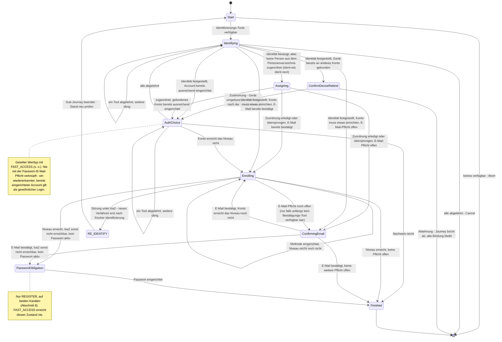

> Eine Journey aus dem Katalog. Die gemeinsame Lesehilfe zu den Diagrammen steht in
> [../04-orchestrierung.md](../04-orchestrierung.md), Abschnitt 3.

# `REGISTER`

`REGISTER`s eigene Journey (`RegisterState`) nutzt `AuthChoice`/`Enrolling` als geteilte Werttypen
mit `FAST_ACCESS` (s. o.) und besitzt zusätzlich `Identifying`, `ConfirmDeviceRebind`,
`Assigning`, `ConfirmingEmail` und `PasswordObligation` exklusiv. `FAST_ACCESS` läuft sie als Voraussetzung,
sobald es identifizieren müsste (s. o.).

Löst die frische Identifikation ein **anderes** Konto auf, als für dieses Gerät bereits
`DeviceAccountLink` eingetragen ist ("Zweitaccount"), wird das nicht unbemerkt überschrieben:
`afterIdentification` erkennt den Konflikt als Allererstes, noch bevor ein Anmeldeverfahren
angeboten wird, und wechselt nach `ConfirmDeviceRebind`. Zustimmung (`accept`) bindet das Gerät um
(`Action.LinkDevice`), widerruft dabei das Geräte-Credential (`enroll-device`) des bisherigen
Kontos für genau diesen `bindingKeyRef` (`AccountDeletionService.revokeMethod`) und kehrt zu
`afterIdentification` zurück. Ablehnung (`decline`) bricht die Journey über `Transition.Cancel`
regulär ab — kein Fehler, dieselbe Semantik wie `DELETE .../journey` — und lässt die bestehende
Bindung unangetastet.

Hat die Identifizierung zwar bestätigt, WER jemand ist, aber niemanden im Personenverzeichnis
aufgelöst (`ident-eid`/`ident-nect`: ein Ausweisdokument trägt keine KVNR, ADR-18), geht es direkt
nach `Assigning` — `next` zeigt also gleich auf `ident-kvnr` (KVNR, ohne KVNR die Partnernummer,
ADR-34). Eine Ja/Nein-Frage davor gibt es bewusst nicht: „Darf ich die Nummer
haben?" und das Formular, das nach ihr fragt, sind dieselbe Frage zweimal, und das Formular sagt
selbst, wofür die Nummer gut ist. Das Nein ist der normale Abbruch des Schritts
(`DELETE .../tools/{toolSessionId}/ident-kvnr`, im Frontend als „Jetzt nicht" beschriftet): Der
Lauf läuft weiter, das Konto bleibt **Interessent** (ADR-10) mit voll bestätigter Identität, nur ohne
Zuordnung zum Personenverzeichnis. Ein Fallback-, kein Pflichtzustand; ein `ident-fsc`-Lauf (das
Personenverzeichnis bürgt, PersonId sofort dabei) erreicht ihn nie.

`Identifying` ist gleichzeitig der letzte Ausweg beim Login (für `FAST_ACCESS`, per Sub-Journey) und
der Einstieg in die Registrierung. Eine `REGISTRATION`/`LOGIN`-Trennung gibt es nicht: Welches von beidem es
war, entscheidet erst die Claim-basierte Account-Auflösung danach; eine leere Kandidatenliste darf
hier nicht abbrechen. Ein `Identified`-Ergebnis heißt hier „finde oder übernimm den Account" — aber
das ist keine Eigenschaft von `REGISTER`: Es folgt daraus, dass an dieser Stelle noch kein Konto
gebunden ist. Ist eines gebunden (`RE_IDENTIFY`, oder `Identifying` nach `AuthChoice`), gilt
dieselbe Action mit derselben Prüfung, nur mit anderem Ausgang.

Bei `Resolution.Unresolved` schreibt der Lauf auf das Konto, das er schon hat, solange dieses noch
keine PersonId trägt; sonst entsteht ein neues Konto ohne Personenbindung. Ein bereits
identifiziertes Konto nimmt eine fremde Bestätigung nie an: Gehört der Kanal nur dem Gerät (der
Zweitaccount-Fall, Abschnitt 2), bekommt der Lauf sein eigenes Konto, sonst wird er abgewiesen.
`recordClaims` schreibt PersonId wie E-Mail über den gemeinsamen Claim-/Ankerpfad. Anlage, Claims und
Journey-Zustand teilen dieselbe Transaktion; ein Konflikt rollt auch den neuen Account zurück.
Bekannte Konten werden ausschließlich über Anker aufgelöst ([12-entscheidungen.md](../12-entscheidungen.md)
ADR-19) — für eID-Bestätigungen ist das die kartengebundene `restricted_id` (eID direkt oder über
Nect), ohne Anker-Treffer
bleibt es beim neuen Interessenten.
Bei einem `Identified` auf ein bereits gebundenes Konto erzwingt die Account-Schicht Erstbindung, Unveränderlichkeit der PersonId und
Ankerbesitz. Findet der Schritt ein **anderes** Konto als das, mit dem die Journey arbeitet, geht
das vorläufige der beiden im anderen auf ([12-entscheidungen.md](../12-entscheidungen.md) ADR-20) —
gemeint ist das Konto ohne PersonId, auf dem nie ein Zugangsmittel eingerichtet wurde. Ist es das
Konto der Journey, wechselt sie zum gefundenen und läuft noch einmal durch `afterIdentification`;
ist es das gefundene, bleibt sie stehen und übernimmt dessen Daten. Sind beide echt, bleibt es beim
`409`.

**Web-Kanal:** `REGISTER` ist neben `KC_SELECT_METHOD` ein zweiter, Web-nutzbarer Entry-Intent —
`PATCH /kc/channels/{channelSessionId}` mit `intent=register` ([05-api.md](../05-api.md)
Abschnitt 3). Kein natives Registrierungsformular: `ident-fsc`/`ident-eid` und `enroll-*` laufen
über dieselben Web-Tool-Renderer wie jeder andere Schritt (`ident-nect` gibt es nur im App-Kanal).

Findet `Identifying` einen **bereits existierenden** Account (Personen-Treffer über KVNR oder
Partnernummer) mit schon
ausreichender aktiver Methode, läuft der Nachweis über `AuthChoice`/`afterProof`, nicht über
`Enrolling`/`afterEnrollment` — `PasswordObligation` und E-Mail-Pflicht greifen dort **nicht**.

#### Experiment „Enrollment zuerst" (`RegisterEnrollFirstStrategy`)

Zweite, eigenständige `REGISTER`-Variante — eigene Zustände (`RegisterEnrollFirstState`, teilt
nichts mit `RegisterState`/`AuthChoice`/`Enrolling`), eigene Strategie.
`RegisterDispatchStrategy` ist der einzige unter
`AuthIntent.REGISTER` tatsächlich registrierte Spring-Bean und wählt pro **neuer** Journey einmalig
zwischen beiden Varianten. Welche Variante eine laufende Journey verwendet, entscheidet danach nur
noch der Zustandstyp selbst (`is RegisterEnrollFirstState` vs. `is RegisterState`), nie erneut das
Flag.

Aktiviert über das Runtime-Feature-Flag `FeatureFlags.REGISTER_ENROLL_FIRST`
(`"register-enroll-first"`), das `FeatureFlagService` (`@Service`, implementiert
`FeatureFlagProvider`) aus der Tabelle `orchestrator.feature_flag` beisteuert — eine Zeile je
Flag, keine Zeile heißt „aus". Gelesen/gesetzt wird es über
`GET/PUT /orchestrator/admin/registration-order` (`RegistrationOrderController`).

**Kernidee**: Kein Konto nötig, um zu starten — es entsteht erst lazy, beim ersten abgeschlossenen
Enrollment (`JourneyService`s generisches `Action.AdoptCredential`-Handling), nicht schon bei der
Identifikation. Bis dahin rechnet die Strategie gegen einen transienten, nie persistierten
Platzhalter-Account (`AccountProfile(accountId = -1, ...)`).

**Verpflichtende Reihenfolge E-Mail → SMS**: Anders als `RegisterState`/`AuthEnrollCore` (freie
Wahl) erzwingt diese Variante zuerst die E-Mail-Bestätigung (`EnrollFirstAttestingEmail`, ein
`ATTEST`-Schritt, kein Enrollment), danach SMS-Enrollment
(`EnrollFirstEnrollingSms`). Beides ist nicht überspringbar: Ablehnen (`Abandoned`) bietet denselben
Schritt erneut an. Ist eines der beiden Tools admin-seitig gesperrt, wird genau dieser Schritt
übersprungen (nicht die Journey blockiert). Erst danach greift dieselbe Pflichtkaskade wie
`RegisterState`/`AuthEnrollCore` (weiteres Verfahren falls das Niveau nicht reicht →
E-Mail-Bestätigung → Passwort-Pflicht, Abschnitt 8). `EnrollFirstEnrolling` ist der Auffangzustand für
das, was E-Mail+SMS nicht abdecken (z. B. ein höheres Sicherheitsniveau), und Startzustand, falls
beim Start weder E-Mail noch SMS verfügbar waren. Erst wenn jede Pflicht erledigt ist, wird
Identifikation **einmalig angeboten, nie erzwungen** — über die `RE_IDENTIFY`-Sub-Journey
(`Transition.RequireSubJourney`). Bei Ablehnung oder wenn nichts anzubieten ist, endet die Journey
trotzdem erfolgreich (`Transition.Authenticated`); das Konto bleibt unidentifiziert, ist aber
angemeldet. Gehört die identifizierte Person bereits zu einem anderen, echten Konto, lehnt der
Executor die Identifizierung mit `409` ab — zwei echte Konten werden nie zusammengeführt. Ein
vorläufiges Konto dieser Person (etwa von einem früher abgebrochenen eID-Lauf) wird dagegen
aufgenommen (ADR-20).

