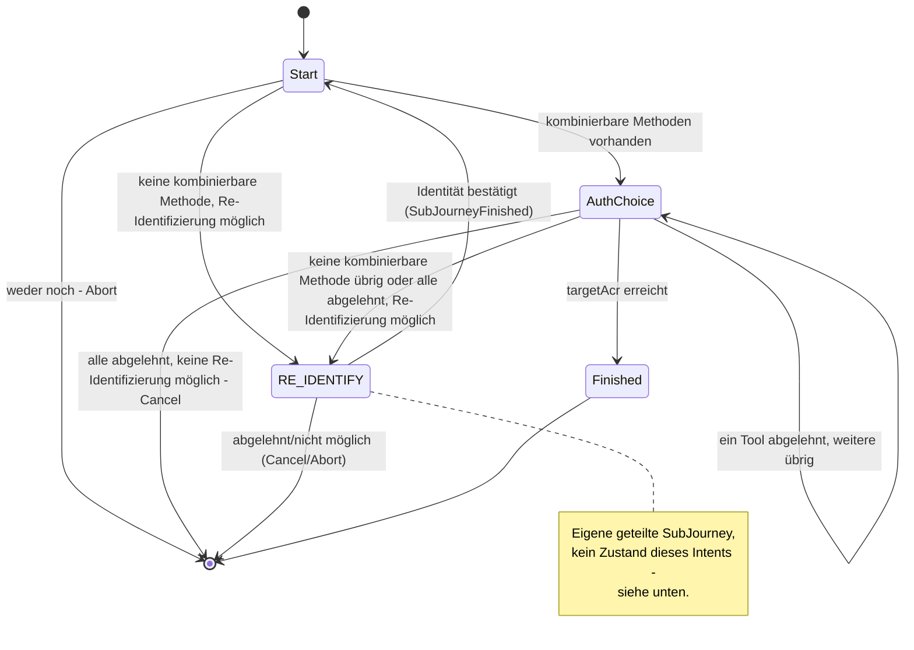

> Eine Journey aus dem Katalog. Die gemeinsame Lesehilfe zu den Diagrammen steht in
> [../04-orchestrierung.md](../04-orchestrierung.md), Abschnitt 3.

# `STEP_UP`

Jeder Zustand trägt `targetAcr` (das Ziel dieses Laufs, nicht die dauerhafte Untergrenze des
Kanals, Abschnitt 8) und `startingAcr`; `AuthChoice` zusätzlich Angebot und Ablehnungen. Mit
`allowReIdentification = false` (so fordert `CONFIRM_PEER_LOGIN` seinen Step-up an) entfällt der
Weg über `RE_IDENTIFY` ganz: Dann endet der Lauf mit `Abort` bzw. `Cancel`.

Schließt keine aktive Methode die Lücke (etwa ein Account mit nur einer aktiven Methode, die
`loa1` erreicht), springt die Strategie in die geteilte `RE_IDENTIFY`-SubJourney
statt selbst eine Re-Identifizierung anzubieten (Abschnitt „RE_IDENTIFY" unten). Nach ihrem
Abschluss (`SubJourneyFinished`) prüft `Start` per `finishOrContinue` erneut, ob der Nachweis jetzt
reicht.
