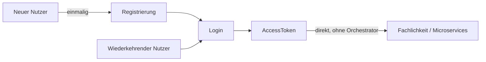
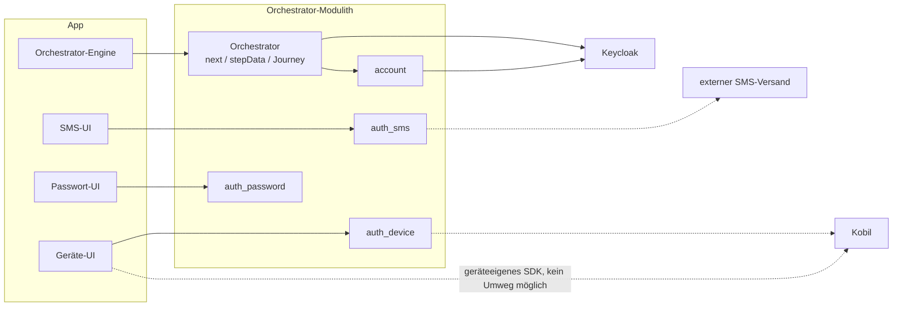
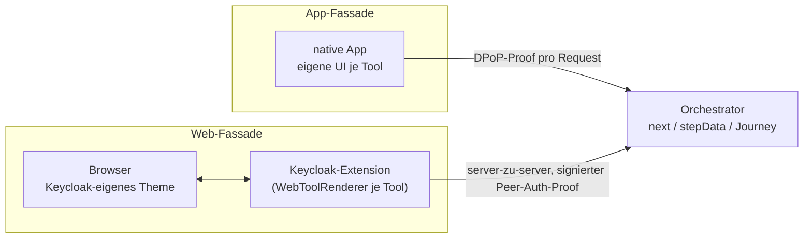
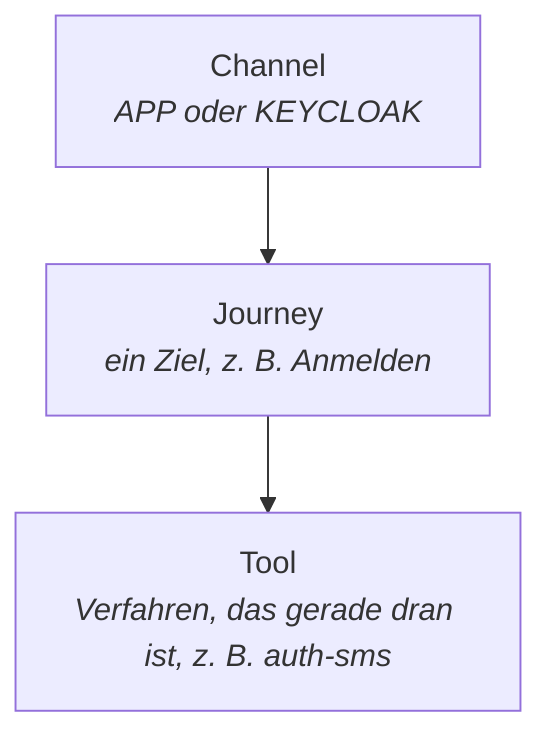
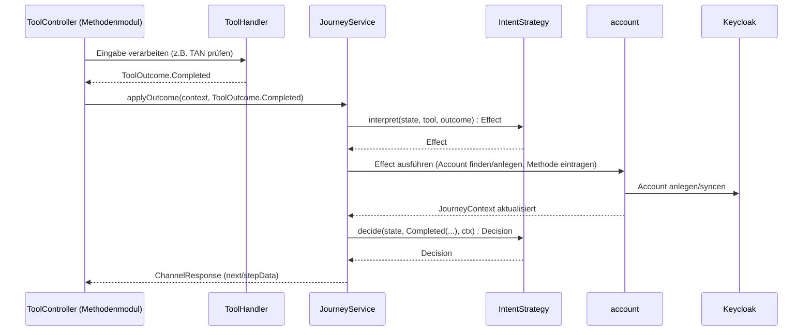

# Orchestrator-Konzepte für Backend-Entwickler

Worum es hier geht: wie Tool und Orchestrator zusammenspielen, mit den Begriffen, die der
Code dafür präzise verwendet. Details in
[../03-tool-architektur.md](../03-tool-architektur.md) und
[../04-orchestrierung.md](../04-orchestrierung.md).

---

## Worum es eigentlich geht

Das eigentliche Ziel ist immer dasselbe: ein `AccessToken`, mit dem die App danach die
Fachlichkeit — Microservices, andere Backends — **direkt** aufruft, ohne Umweg über den
Orchestrator. Registrierung ist kein eigener Zweck, sondern nur die einmalige Voraussetzung
dafür, dass ein neuer Nutzer danach einloggen kann. Das `AccessToken` selbst stammt aus einem
Standard-OIDC-Tokenfluss gegen Keycloak, den der Orchestrator serverseitig abwickelt.

## Die Einordnung im Gesamtbild

Aus Backend-Sicht relevant: der Orchestrator ist ein Modulith mit eigenen Tool-Modulen,
spricht für den Tokenfluss und die Account-Pflege mit Keycloak, und einzelne Tool-Module
delegieren ihrerseits an externe Dienste.

### Zwei Kanäle, ein Modell

Das Bild oben zeigt bewusst nur den App-Kanal (eigene UI, DPoP-Proof pro Request) — aus
Backend-Sicht ist das aber nur eine von zwei Fassaden vor demselben Orchestrator. Ein
`Channel` trägt seinen `channelType` (`APP`/`KEYCLOAK`) fest für seine ganze Lebenszeit
([02-domaenenmodell.md](../02-domaenenmodell.md)), aber Journey/Tool/`next` — alles, was
oben und im Sequenzdiagramm unten beschrieben ist — läuft für beide identisch.

Der Unterschied liegt allein darin, *wer rendert* und *wie der Request abgesichert ist*:
Im App-Kanal spricht die App direkt mit dem Orchestrator und weist sich per DPoP-Proof
aus; im Web-Kanal läuft der Browser komplett gegen Keycloaks eigenen Login (Redirect,
`loa1`/`loa2` als `acr_values`) — erst Keycloaks serverseitige Extension ruft den
Orchestrator auf, mit einem eigenen signierten Server-zu-Server-Nachweis statt eines
DPoP-Proofs, und rendert jeden Tool-Schritt in Keycloaks eigenem Theme statt einer
nativen UI-Komponente. Der Browser selbst bekommt den Orchestrator nie zu Gesicht.

Das gilt auch für die Tokens am Ende der Journey: der App-Kanal bekommt sein
`AccessToken` (und ein nie das Backend verlassendes `RefreshToken`) vom Orchestrator
selbst ausgestellt — Mock-JWT oder echtes Keycloak-Token, je nach Profil. Der Web-Kanal
bekommt seins direkt aus Keycloaks eigenem Token-Endpoint; der Orchestrator sieht davon
serverseitig nur das, was die Extension ihm für den jeweiligen Tool-Schritt meldet, nie
das Token selbst.

### Channel, Journey, Tool

Ineinander geschachtelt, keine Kette von Vorher/Nachher — genau das bildet `next` in
jeder `ChannelResponse` ab. Journeys sind nach ihrem Ziel benannt (`LOGIN`, `STEP_UP`,
`MANAGE_AUTH_METHODS`, `DELETE_ACCOUNT`, dazu Web-spezifisch `KC_SELECT_METHOD` und
`CONFIRM_PEER_LOGIN` für die kanalübergreifende QR-Anmeldung), Tools nach Verfahren und
Zweck (`enroll-sms` richtet ein, `auth-sms` benutzt ein bereits eingerichtetes).

Der Rest dieses Dokuments zoomt in genau die `Backend`-Box hinein: Wie hängen Orchestrator und
ein Tool-Modul wie `auth_sms` an einem konkreten Schritt zusammen?

## Zusammenspiel an einem Schritt

Was `ToolHandler` intern tut, um zu diesem `ToolOutcome` zu kommen, ist bewusst nicht Teil
dieses Bildes: eigene, tool-spezifische Fachlogik gegen ein eigenes Schema (`ToolDB`), auf das
nichts außerhalb des Moduls zugreift.

## Nutzen für dich als Backend-Entwickler

- **Dein Modul bleibt dein Modul** — ein Tool-Modul wie `auth_sms` hat sein eigenes Schema
  (`ToolDB`), auf das nichts außerhalb zugreift. Du kannst darin fachliche Logik ändern, ohne
  Journey oder andere Module überhaupt lesen zu müssen.
- **Der Vertrag ist klein und stabil** — dein `ToolHandler` liefert nur einen `ToolOutcome`;
  was das für Journey/Zustand/nächsten Schritt bedeutet, entscheidet ausschließlich die
  `IntentStrategy`. Du musst beim Schreiben eines Tools nie die volle Zustandsmaschine im Kopf
  haben.
- **App- und Web-Kanal sind für dich identisch** — Journey, Tool und `next` laufen für beide
  Fassaden gleich; du schreibst keine kanalspezifischen Sonderfälle in dein Modul.
- **Der Tokenfluss ist kein Baustellen-Code** — Standard-OIDC gegen Keycloak, serverseitig
  einmal implementiert; dein Modul liefert nur das Ergebnis eines Verfahrens, nie ein Token
  selbst.

---

Vollständige Zustandsdiagramme je Intent, Sub-Journey-Mechanik, Versuchsbudget, MFA-Regel:
[../04-orchestrierung.md](../04-orchestrierung.md). Tool-Katalog und `ToolOutcome`-Vertrag im
Detail: [../03-tool-architektur.md](../03-tool-architektur.md). Modulliste und
-abhängigkeiten: [../08-projektrahmen.md](../08-projektrahmen.md).
