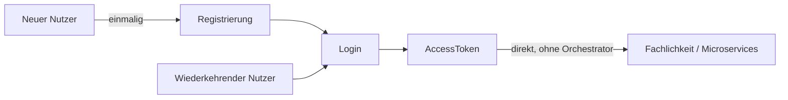
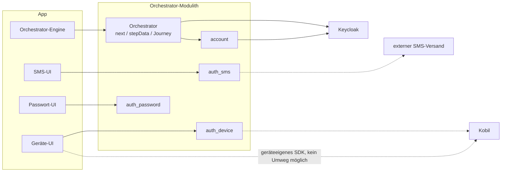
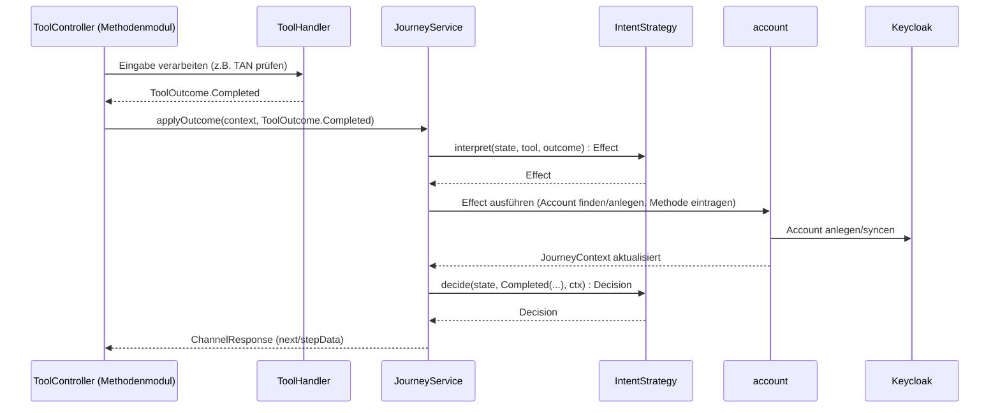

# Orchestrator-Konzepte für Backend-Entwickler

Worum es hier geht: wie Tool und Orchestrator zusammenspielen, mit den Begriffen, die der
Code dafür präzise verwendet. Details in
[../03-tool-architektur.md](../03-tool-architektur.md) und
[../04-orchestrierung.md](../04-orchestrierung.md).

---

## Worum es eigentlich geht

Das eigentliche Ziel ist immer dasselbe: ein `AccessToken`, mit dem die App danach die
Fachlichkeit — Microservices, andere Backends — **direkt** aufruft, ohne Umweg über den
Orchestrator. Registrierung ist kein eigener Zweck, sondern nur die einmalige Voraussetzung
dafür, dass ein neuer Nutzer danach einloggen kann. Das `AccessToken` selbst stammt aus einem
Standard-OIDC-Tokenfluss gegen Keycloak, den der Orchestrator serverseitig abwickelt.

## Die Einordnung im Gesamtbild

Dasselbe Bild wie im Frontend-Pendant, nur jetzt aus Backend-Sicht relevant: der Orchestrator
ist ein Modulith mit eigenen Tool-Modulen, spricht für den Tokenfluss und die Account-Pflege
mit Keycloak, und einzelne Tool-Module delegieren ihrerseits an externe Dienste.

Der Rest dieses Dokuments zoomt in genau die `Backend`-Box hinein: Wie hängen Orchestrator und
ein Tool-Modul wie `auth_sms` an einem konkreten Schritt zusammen?

## Zusammenspiel an einem Schritt

Was `ToolHandler` intern tut, um zu diesem `ToolOutcome` zu kommen, ist bewusst nicht Teil
dieses Bildes: eigene, tool-spezifische Fachlogik gegen ein eigenes Schema (`ToolDB`), auf das
nichts außerhalb des Moduls zugreift.

---

Vollständige Zustandsdiagramme je Intent, Sub-Journey-Mechanik, Versuchsbudget, MFA-Regel:
[../04-orchestrierung.md](../04-orchestrierung.md). Tool-Katalog und `ToolOutcome`-Vertrag im
Detail: [../03-tool-architektur.md](../03-tool-architektur.md). Modulliste und
-abhängigkeiten: [../08-projektrahmen.md](../08-projektrahmen.md).
