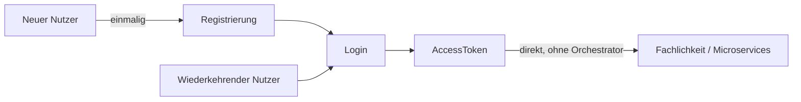
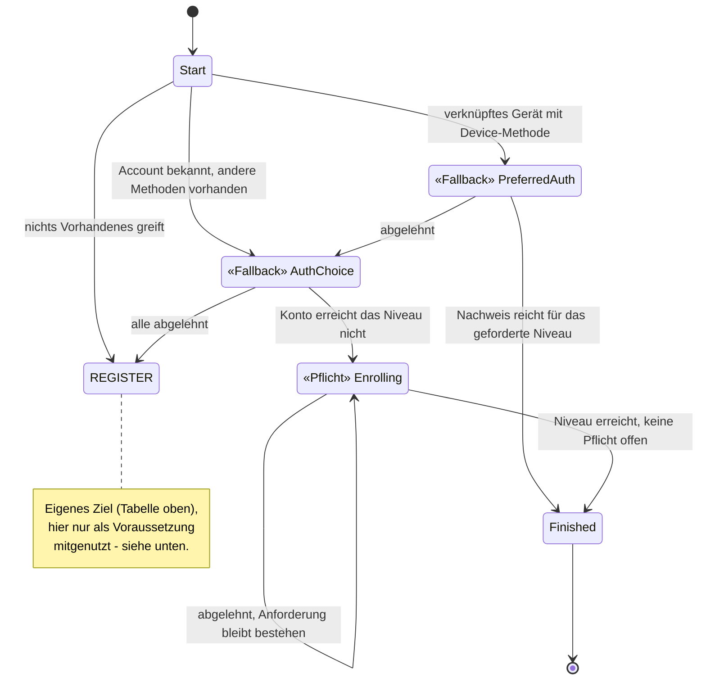
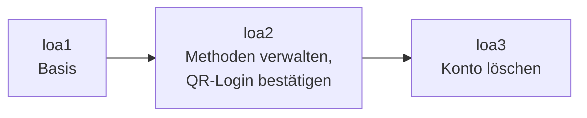

# Orchestrator-Konzepte für Fachexperten

Wie fachliche Regeln zu Anmeldung, Kontoverwaltung und Vertrauensniveau im System landen —
ohne Code lesen zu müssen. Details in
[../04-orchestrierung.md](../04-orchestrierung.md).

---

## Worum es eigentlich geht

Das eigentliche Ziel ist immer dasselbe: ein `AccessToken`, mit dem die App danach die
Fachlichkeit — Microservices, andere Backends — direkt aufruft. Registrierung ist kein
eigener Zweck, sondern nur die einmalige Voraussetzung dafür, dass ein neuer Nutzer danach
einloggen kann. Was dazwischen passiert — welche Nachweise wann verlangt werden, welches
Vertrauensniveau wofür reicht — ist keine Implementierungsdetail-Frage, sondern die
fachliche Regel selbst, und genau dafür ist dieses Dokument gedacht.

## Fachliche Ziele haben einen Namen im System — nicht nur in der Fachlichkeit

Jeder Ablauf, den ein Nutzer durchläuft, heißt nach seinem *Ziel*, nicht nach seinem
technischen Ablauf:

| Ziel aus fachlicher Sicht | Heißt im System |
|---|---|
| Möglichst reibungslos anmelden, mit Rückfallebenen | `FAST_ACCESS` |
| Bewusst neu identifizieren, auch auf einem bekannten Gerät | `REGISTER` |
| Klassischer Login ohne Gerätebindung | `LOOKUP_LOGIN` |
| Vertrauensniveau anheben (z. B. für eine sensible Aktion) | `STEP_UP` |
| Anmeldeverfahren hinzufügen oder entfernen | `MANAGE_AUTH_METHODS` |
| Konto unwiderruflich löschen | `DELETE_ACCOUNT` |
| Eine QR-Anmeldung auf einem anderen Gerät bestätigen | `CONFIRM_PEER_LOGIN` |
| Erneute Identifizierung, wenn nichts anderes mehr greift | `RE_IDENTIFY` |

Das ist mehr als Namensgebung: Wer eine fachliche Frage stellt — „darf man X löschen, ohne
sich frisch auszuweisen?" — findet die Antwort in genau *einem* dieser Bausteine, nicht
verstreut über mehrere Code-Ebenen.

## Jede Regel ist ein Bild, das man mit dem Fachbereich abgleichen kann

Für jedes Ziel gibt es ein vollständiges Zustandsdiagramm — jeder Zustand, jeder Übergang,
jede Bedingung ist darin sichtbar, nicht in verstreuter Logik verborgen. Ausschnitt aus
`FAST_ACCESS`:

Wichtig für die fachliche Prüfung: Das System unterscheidet zwei Sorten von Zustand, und
diese Unterscheidung ist erzwungen, nicht optional — im Bild oben direkt an den Notizen
ablesbar, nicht nur im Text darunter:

- **Fallback**: Ablehnen führt zum nächsten, aufwendigeren Weg (z. B. Gerät abgelehnt →
  andere Methode anbieten). Bequemlichkeit für den Nutzer, solange das Sicherheitsniveau
  am Ende trotzdem erreicht wird.
- **Pflicht**: Ablehnen führt nirgendwohin — die Anforderung bleibt bestehen, bis sie erfüllt
  ist. Für alles, was nicht verhandelbar ist (z. B. das geforderte Vertrauensniveau).

Welche Sorte ein Zustand ist, steht sichtbar im Modell, nicht als Kommentar, den jemand
vergessen könnte. Ein fachlicher Fehler — „das sollte doch Pflicht sein, nicht Fallback" —
lässt sich damit an *diesem* Bild klären, ohne Entwickler zu Rate zu ziehen.

## Wiederverwendete Teilabläufe bleiben eine fachliche Einheit

Manche Anforderungen tauchen in mehreren Zielen auf — „erneut identifizieren, wenn nichts
anderes mehr greift" gehört sowohl zu `FAST_ACCESS` als auch zu anderen Abläufen, und im Diagramm
oben ist sogar ein komplettes eigenes Ziel (`REGISTER`) nur die Voraussetzung für ein anderes. Das
System modelliert beides als eigenständige **Sub-Journey** (`RE_IDENTIFY`, `REGISTER`), die von
mehreren Zielen aus angestoßen wird, aber nur einmal definiert ist. Ändert sich die fachliche
Regel für Re-Identifizierung oder Registrierung, ändert sie sich an *einer* Stelle für alle
Abläufe, die sie nutzen — es gibt keine zweite, leicht abweichende Kopie, die man vergessen
könnte zu pflegen.

## Vertrauensniveau ist eine fachliche Stellschraube, kein technisches Detail

Jede Aktion verlangt ein bestimmtes Niveau (`loa1`/`loa2`/`loa3`) — je sensibler die Aktion,
desto höher die Hürde:

Das ist an genau der Stelle im Modell festgelegt, an der das jeweilige Ziel beschrieben ist —
nicht verteilt über Prüfungen, die überall im Code passieren könnten. Eine fachliche
Entscheidung wie „QR-Bestätigung braucht künftig einen frischen Nachweis, kein altes
Niveau" ist damit eine punktuelle, nachvollziehbare Änderung an der Beschreibung dieses
einen Ziels.

## Nachvollziehbarkeit statt Blackbox

Jeder Schritt, den ein Nutzer durchläuft, wird protokolliert und ist im Journey-Log
einsehbar — welches Verfahren wann angeboten, angenommen oder abgelehnt wurde, und welches
Niveau am Ende erreicht war. Für eine fachliche oder revisionsrelevante Frage („warum konnte
dieser Nutzer sein Konto ohne erneute Prüfung löschen?") braucht es damit keine Rekonstruktion
aus verteilten Systemlogs — der Ablauf ist durchgängig an einer Stelle sichtbar.

## Was daraus folgt

- **Fachliche Regeln sind an einer Stelle beschrieben, nicht im Code verstreut** — jedes
  Ziel hat sein eigenes, vollständiges Zustandsdiagramm, das sich unabhängig von der
  Implementierung prüfen lässt.
- **Ausnahmen sind sichtbar, nicht implizit** — Fallback vs. Pflicht, welches Niveau eine
  Aktion verlangt, welche Wege zu einer Re-Identifizierung führen: alles steht explizit im
  Modell, nichts ergibt sich zufällig aus der Reihenfolge des Codes.
- **Wiederverwendete Abläufe bleiben eine einzige fachliche Wahrheit** — eine Regeländerung
  an einer Sub-Journey wirkt überall dort, wo sie eingebunden ist, ohne Abweichungsrisiko.
- **Jeder Schritt ist im Nachhinein nachvollziehbar** — über das Journey-Log, ohne dass man
  wissen muss, wie das System intern aufgebaut ist.
- **A/B-Tests werden möglich** — weil ein Ziel wie `FAST_ACCESS` ein eigenständiges, in sich
  geschlossenes Modell ist, lässt sich für denselben Intent eine zweite Journey-Variante
  (andere Reihenfolge, andere Fallback/Pflicht-Einstufung) danebenstellen und im laufenden
  Betrieb ausspielen. So lässt sich messen, welche Variante erfolgreicher ist oder schneller
  zum Ziel führt — als echtes Experiment, nicht nur als Gedankenspiel, weil beide Varianten
  bereits im selben Modell nebeneinander existieren können.

---

Vollständige Zustandsdiagramme je Ziel, Sub-Journey-Mechanik, Versuchsbudget, Niveauregeln:
[../04-orchestrierung.md](../04-orchestrierung.md).
