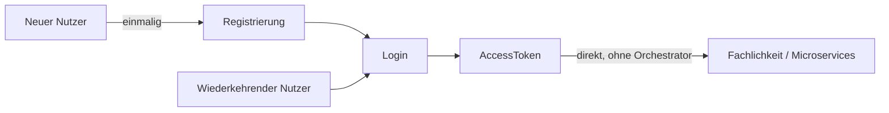
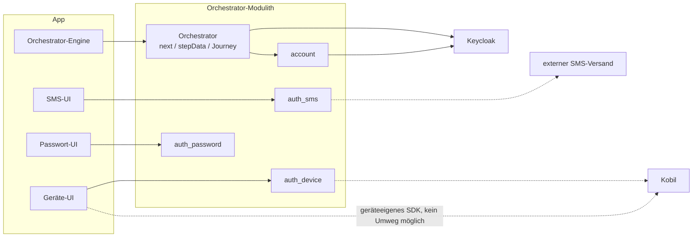
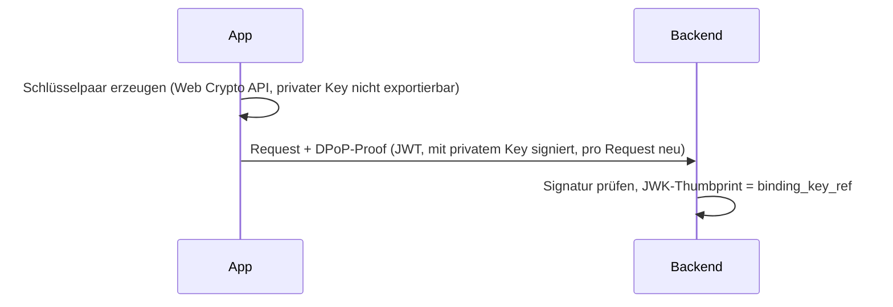

# Orchestrator-Konzepte für Frontend-Entwickler

Die Idee dahinter, nicht das API im Detail — das zeigt die Demo live.

---

## Worum es eigentlich geht

Das eigentliche Ziel ist immer dasselbe: ein `AccessToken`, mit dem die App danach die
Fachlichkeit — Microservices, andere Backends — **direkt** aufruft, ohne Umweg über den
Orchestrator. Registrierung ist kein eigener Zweck, sondern nur die einmalige
Voraussetzung dafür, dass ein neuer Nutzer danach einloggen kann.

Das `AccessToken` selbst stammt aus einem Standard-OIDC-Tokenfluss gegen Keycloak — der
Orchestrator wickelt ihn serverseitig ab, die App bekommt nur das Ergebnis. Auch das
Erneuern (Refresh) passiert im Backend über den Channel, nicht in der App: kein
Refresh-Token, keine Token-Erneuerungslogik im Frontend.

Bevorzugtes Login-Mittel ist die **Gerätebindung**: einmal auf einem Gerät eingerichtet,
beweist danach der Besitz dieses Geräts die Identität. Der Ablauf führt den Nutzer aktiv
dorthin; SMS, Passwort und E-Mail bleiben als Alternativen verfügbar, etwa für ein neues
oder wiederholt genutztes Gerät.

## Orchestrator-Architektur

Jedes Verfahren hat auf beiden Seiten eine eigene, gleichnamige, kleine Einheit: im
Backend ein Tool-Modul, das seine Beschreibung und seinen Ablauf selbst mitbringt; in der
App eine eigene UI-Komponente dafür. Was die App **nicht** selbst hat, ist die Logik,
*wann* welches Verfahren dran ist — das entscheidet ausschließlich das Backend über
`next`; die Orchestrator-Engine startet ein Tool nur darüber und übergibt dann an dessen
UI-Komponente.

Zwei Ergänzungen aus der Praxis:

- Ab dem Start spricht die Tool-UI direkt mit ihrem gleichnamigen Backend-Tool, nicht mehr
  generisch über die Orchestrator-Engine — jedes Tool bringt seine eigenen Endpunkte mit. Manche
  brauchen dafür aus technischen Gründen ohnehin ein eigenes Protokoll statt des üblichen
  Anfrage/Antwort-Schemas (WebAuthn, eID-Redirect) — bleibt aber auf diese eine
  UI-Komponente begrenzt.
- Ein Tool-Modul kann intern an weitere Dienste delegieren (SMS-Versand, ...) — für App
  und Orchestrator unsichtbar. `auth_device` etwa spricht dafür mit Kobil. Spiegelbildlich
  greift auch die Geräte-UI selbst direkt auf Kobil zu, wenn ein Schritt an ein
  geräteeigenes SDK gebunden ist, das sich nicht über das Backend führen lässt.
- Den OIDC-Tokenfluss gegen Keycloak führt ausschließlich der Orchestrator — dafür gibt es
  in der App keinen eigenen, direkten Weg. Ein eigenes `account`-Modul im Backend legt
  Accounts an und hält sie mit Keycloak synchron; auch das bleibt vollständig hinter dem
  Orchestrator verborgen.

(Dass die eigentliche Fachlichkeit direkt mit dem `AccessToken` angesprochen wird, ohne
Umweg über den Orchestrator, steht bereits oben.)

Daraus folgt für den Auth-Teil:

- **Abläufe ändern sich, ohne dass die App angepasst werden muss** — welche Schritte eine
  Journey verlangt und in welcher Reihenfolge, steht nur im Backend.
- **Neue Tools lassen sich einfach integrieren** — ein neues Modul bringt seine
  Beschreibung mit; die App braucht dafür eine neue UI-Komponente plus einen Eintrag in der
  Routing-Tabelle, aber keine neue Ablaufsteuerung.
- **Alte App-Versionen bleiben funktionsfähig** — eine App meldet beim Kanaleinstieg, was
  sie rendern kann (`availableTools`); ein Tool, das sie nicht kennt, wird ihr schlicht nie
  angeboten, statt zu einem Fehler zu führen.
- **Die App hält praktisch keinen eigenen Zustand** — nur die `channelSessionId`
  (dauerhaft) und, solange ein Tool läuft, die `toolSessionId` (kommt aus `next`). Jeder
  Ablauf (Login, Registrierung, Niveau anheben, Verfahren verwalten, Account löschen)
  bewegt denselben Kanal durch dasselbe kleine Zustandsmodell (`ANONYMOUS` ->
  `AUTHENTICATED` -> ...) — kein eigener State-Automat pro Ablauf im Frontend.

## Absicherung: DPoP, nicht mTLS

Jeder Request der App trägt einen `DPoP`-Header statt sich über ein Client-Zertifikat
(mTLS) auszuweisen:

DPoP ("Demonstrating Proof of Possession") bindet die Anfrage auf **Anwendungsebene**: das
Frontend erzeugt ein Schlüsselpaar, hält es lokal (Browser/App-Storage), und signiert
damit zu jedem Request einen kurzlebigen Proof. Das Backend leitet daraus einen
Schlüssel-Fingerabdruck ab (`binding_key_ref`) und weiß so, welches *Gerät* spricht —
unabhängig von TLS-Terminierung, Proxies oder Load-Balancern, die bei mTLS das
Client-Zertifikat durchreichen müssten. Der private Schlüssel verlässt das Gerät nie.

DPoP ist dabei kein Auth-Mittel und beweist keine Identität — es sichert jeden Request
desselben Kanals ab, unabhängig davon, mit welchem Verfahren sich der Nutzer anmeldet. Die
eingangs erwähnte **Gerätebindung als Login-Mittel** ist etwas anderes: ein eigenes,
gerätegebundenes Credential (`auth_device`), das der Nutzer aktiv einrichtet und das dann
die Identität nachweist.

---

Details, Feldformate, ein durchgespielter Tool-Zyklus:
[../05-api.md](../05-api.md), [../02-domaenenmodell.md](../02-domaenenmodell.md),
[../09-dpop.md](../09-dpop.md).
